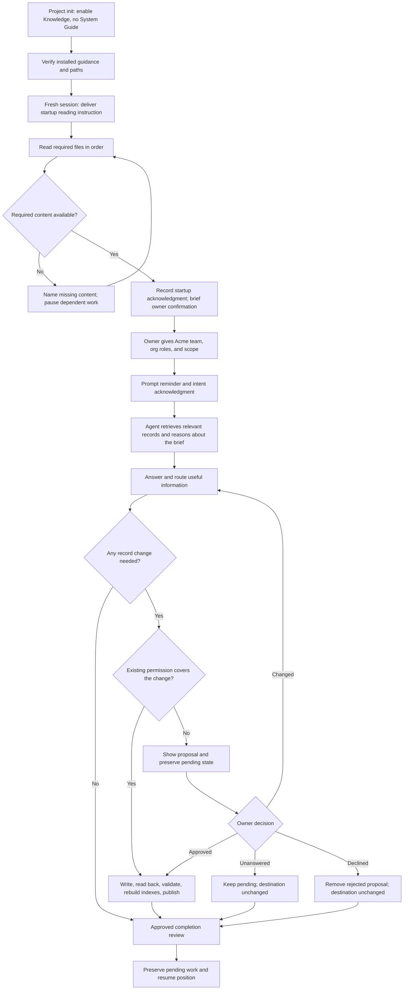
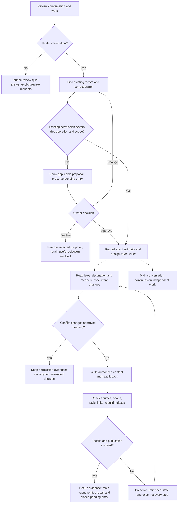

# Knowledge System — solution design

Updated: 2026-09-18. **Proposed; under review. No runtime build authorized.**

## 1. Purpose, authority, and review position

This is the single living solution design for the Knowledge System. It explains
the parts, how they work together, which requirements they serve, what their
controls can actually establish, and how the result will be tested. Detail is
kept when it helps make or review a design decision. Saving this document does
not approve its proposals or authorize implementation.

- [Knowledge System PRD](../../knowledge/prds/toolkit-operating-system/knowledge-system.md) owns the 30 requirements.
- [Toolkit OS PRD](../../knowledge/prds/toolkit-operating-system/toolkit-operating-system.md) owns the shared operating model and handshake principle.
- [Task D1](https://github.com/Mar5929/claude-toolkit/issues/269#task-d1--review-and-finalize-the-solution-design) owns the current work, roadmap, status, and approvals.
- [Acme walkthrough](269-knowledge-system/design-walkthrough.md) owns the hypothetical scenario and detailed review position.
- [Implementation plan](269-knowledge-system/implementation-plan.md) maps the recommended baseline to actual modules, dependency-ordered tasks, all 30 requirements, tests, and rollout. The tracker owns its live status.
- [Host capability evidence](269-knowledge-system/host-capability-evidence.md) separates current documentation, installed observations, and the H1–H6 proofs still needed.
- [Detailed solution design reference output](269-knowledge-system/detailed-solution-design-reference-output.md) preserves the earlier full draft unchanged. Its old recommendations and questions are historical inputs, not a second current design.

A later explicit owner decision takes precedence over an older design choice.
When this design and the PRD disagree, record the disagreement and reconcile it;
do not silently turn a design preference into an approved requirement. Proposed
behavior and a passing document check are never evidence of shipped behavior.

We are reviewing **Acme's first substantive message in a fresh session**. Acme
is a hypothetical Salesforce consolidation of two orgs. Setup enabled core
Knowledge System and `delivery/architecture/`, with System Guide off. The brief
supplies consulting team, client, originating and target org roles, and scope;
actual names and details are placeholders. No real installation or connection
occurred. Acme's tracker is not yet chosen. No complete scenario step or full
design has been approved.

The immediate review is startup reading and acknowledgment, the user-submit
reminder, and the approved completion review. Then continue the walkthrough
through routing, approvals, saving, recovery, concurrent work, and migration.

### Terms used in this design

| Term | Meaning |
| --- | --- |
| Host or harness | The program running the agent: Claude Code or Codex. |
| Hook | A host event handler that can deliver guidance or, where supported, interrupt a specific action. |
| Skill | Instructions loaded for a particular operation, with detailed references loaded when needed. |
| Root router | `CLAUDE.md` or `AGENTS.md`, providing the project's map and routes to applicable instructions. |
| Toolkit operating manual | The higher-level explanation of enabled components and their responsibilities. The selected path is `knowledge/toolkit-manual.md`; its draft content and delivery remain under separate OS review. |
| Knowledge manual | `knowledge/knowledge-manual.md`, defining knowledge eligibility, routing, approval, and links to procedures. |
| Handshake | A request for an agent step and an acknowledgment of the step or its outcome. Intent acknowledgment and completion acknowledgment are different. |
| Gate | A host-supported hold on a named action until an objective condition is met. A proposed gate requires runtime proof. |
| Control | Guidance, an objective check, or agent judgment. These can coexist in one component. |
| Card | The PRD's owner-facing proposal for a memory or PRD change requiring approval. Other components retain their own proposal rules. |
| Inbox | Persistent pending proposals and authorized saves that remain unfinished, including their permission and source. |
| Session state | Temporary bookkeeping for reminders and acknowledgments, never a second knowledge store. |
| Compaction | Replacement of some conversation context by a summary; guidance and unfinished work must remain recoverable. |
| Spill | Hook output being shortened into a preview and file reference by the host. Delivery of a path is not delivery of the full content. |
| Fail-open | A handler failure that permits the action to continue. It limits any enforcement claim. |
| Frontmatter | Structured metadata at the start of a Markdown file. |
| Context cost | Text brought into the agent's context, including file reads and tool results, not only hook output. |
| System Guide | An optional separate component documenting an existing system. Acme does not enable it. |
| Source of truth | The record that owns a particular kind of information; indexes and temporary summaries point to it. |

Platform-specific fields and registration syntax belong in implementation
references after verification, rather than in the owner's core vocabulary.

## 2. Decisions at a glance

| Topic | Current direction | Status and limit |
| --- | --- | --- |
| Reasoning | The agent judges relevance, significance, scope, destination, and meaning. | Governing principle; no semantic scoring engine. |
| Startup | Request ordered reads, prove native result observation first, then record a separate acknowledgment. Use a bounded helper only where needed. | Owner direction is reads plus handshake. D1-P1 selects the simplest adequate transport; H2 must prove actual delivery. Declaration-only operation fails strict R2 acceptance. |
| Prompt checkpoint | Every user prompt gets a short reminder, positive/negative criteria, manual links, and explicit intent acknowledgment through the shared helper. | Reminder behavior selected; helper transport and canonical message implementation recommended for host proof. |
| Completion checkpoint | One checkpoint near turn completion catches decisions and discoveries made while working. | Behavior approved by Mike, 2026-09-18; exact handler requires proof. Routine no-change reviews stay quiet under the PRD; an explicit review request receives an answer. |
| Root files | `AGENTS.md` and `CLAUDE.md` remain maps and routers. | Selected. Detailed policy lives in linked guidance. |
| Long-term memory | Both relevant and significant to this project. | Selected; not every useful note belongs in memory. |
| Routing | Consider all owning records, including tasks, PRDs, procedures, and architecture. | Selected; System Guide participates only when enabled. |
| Review trigger | Conversation-only work counts. | Changed-file counting as a relevance/review trigger is rejected. |
| Manuals | Every equipped project receives a Toolkit operating manual; the knowledge manual supplies component policy. | The selected path is `knowledge/toolkit-manual.md`, owned by project-init/project-sync. Resolve content acceptance and delivery under #306 before shipping the hook path. |
| Documentation saves | Authorized Git-tracked documentation updates are checked and promptly committed/pushed on main. | Owner direction. Runtime code/config changes follow their own implementation workflow. Designs remain under `docs/designs/`. |
| Old startup budgets | Earlier draft selected character budgets for two printing hooks. | Historical constraints of that mechanism. Recalculate for the revised startup; do not discard useful context-cost analysis. |
| Paths and migration | Use the PRD's proposed layout, with setup/sync migrating existing projects deliberately. | A proposed path is not a claim that the live repository already uses it. |
| Approved save execution | Main agent specifies the authorized change; a helper applies, checks, commits, and pushes while independent conversation continues. | Selected in R9/R28; host execution, result delivery, and recovery still require proof. |
| Writing | Proposal and saved-memory prose contain no jargon or figurative language. | R15 governs both main agent and helper; check actual wording as well as file validity. |
| Approvals | Requirements approval, design approval, permission to save, and authorization to build remain distinct. | Required. Never infer one from another. |

### Recommended implementation baseline

Keep the `second-brain` plugin identity and refactor to four public skills:
`knowledge-find`, `knowledge-save`, `knowledge-review`, and `knowledge-setup`.
Use one shared save procedure for every lifecycle change, including validation,
publication, and recovery. Reuse existing parsers, indexes, checkers, history
search, and installation logic where they meet the new responsibilities.
Migration convenience does not determine the finished architecture.

The main agent evaluates candidates and prepares clear proposals. After approval,
a helper executes the agreed save while the conversation continues, using the
same save procedure and durable permission record. The main agent checks the
returned result before reporting completion. Section 6.7 defines that separation.

Keep startup, prompt, completion, and scoped action checks separate, with thin
host adapters. Native read observation is the first startup option to prove;
add bounded read helpers and receipts only where needed. Choose copied or
plugin-managed runtime from activation, update, version, and recovery evidence.
Neither eight hooks nor a smaller fixed script count is a requirement. Retain
the existing feedback filename. The implementation plan maps the work.

Mike accepted the four-capability review direction and requested delegated
approved saves on 2026-09-18. These scoped decisions do not approve the full
design or establish installed behavior. Mike also approved a quiet review before the main agent finishes, without
waiting for an independent save helper, on 2026-09-18. The exact handler still
requires host proof and design/build approval. Mandatory behavioral outcomes remain acceptance
conditions even where a host cannot mechanically enforce every action.

## 3. Design philosophy and control boundaries

The [toolkit-wide handshake principle](../../knowledge/prds/toolkit-operating-system/toolkit-operating-system.md#design-principle-guide-the-agent-through-handshakes)
governs the design. The toolkit supplies guidance, checkpoints, and small
objective checks. The agent does the reasoning. Acknowledgment is bookkeeping,
not proof of understanding, correct classification, completed saving, or consent.

| Control | What it establishes | What it does not establish |
| --- | --- | --- |
| GUIDE | Applicable instructions and links reach the agent at the right moment. | The agent performed the instruction correctly. |
| CHECK | An observable condition holds: required fields, valid path, successful publication, or a current acknowledgment record. | The saved claim is true or semantically approved. |
| ENFORCE, when proven | A particular host action is held or rejected until its objective condition holds. | Universal protection outside those event/tool paths, during fail-open behavior, or on an unverified host. |
| JUDGE | The agent evaluates meaning using the sources and governing instructions. | An external guarantee of good reasoning. Representative sessions assess the behavior. |

Use narrow safeguards where a failure would damage trust: lasting writes,
unfinished publication, context loss, and invalid records. Do not supervise
every action merely because it can be observed. No keyword classifier, search
quality scorer, transcript grader, or changed-file threshold decides whether
the conversation contains something worth retaining.

A file-read result can establish that content was made available. A handshake
can record what the agent reports doing. Neither proves understanding. Missing
required content pauses only dependent work and prevents a false startup
confirmation. Intent acknowledgments must not be reused as completion evidence.

### Design patterns and why they fit

| Pattern | How the parts apply it | Requirement and philosophy benefit |
| --- | --- | --- |
| Read a small map, then follow relevant links | Root routes lead to manuals; indexes lead to the owning topic, PRD, or outside source. Detailed skill references load for the operation that needs them. | R2,5–8,19: the agent chooses relevant evidence without a custom search-ranking engine or a universal content dump. |
| Separate instruction, acknowledgment, and result | Startup requests reads; the prompt checkpoint records intent; completion records the review outcome. Saving has its own read-back and publication evidence. | R3,9,29: a receipt never substitutes for a finished operation or semantic judgment. |
| One owner for each meaning | Routing identifies kind, scope, and destination before writing; related records link instead of copying the same decision. | R16–18,30: a mixed conversation can update several owners without creating competing truth. |
| Recover from durable records | The inbox preserves pending meaning and permission; the tracker preserves task position. Temporary checkpoint state can be discarded and reconstructed. | R4,10,28–29: another session can continue without private memory or asking the owner to repeat consent. |
| Check objective conditions close to the operation | Check actual file shape after writes and actual publication after pushes; a proven gate can hold a named dependent action. | R3,14,21,29: checks cover observable failures while the agent assesses relevance, truth, and authority. |
| Share contracts, adapt delivery per host | Both hosts use the same manual, records, and expected outcomes; event wiring and receipt transport are verified separately. | R25–27: platform differences are explicit rather than hidden behind an unproven universal supervisor. |

These patterns explain the parts' relationships; they do not require a new
framework. Prefer existing toolkit procedures and documented host capabilities.

## 4. The parts

Paths in this inventory are relative to an equipped project unless explicitly
marked plugin-relative. They describe the recommended build, not the installed
state today. The four skill names describe the selected direction; helper and
handler filenames are candidates. Their activation is not approved by this inventory. Requirements refer to the current PRD.
All parts also serve the plain-parts, documented-platform, and judgment
boundaries in R1, R26, and R29.

### Files and guidance

| Part / path | Purpose and requirements | Control | When loaded | Context cost | Documentation basis |
| --- | --- | --- | --- | --- | --- |
| `SOUL.md` | Project role; supports R2–3 orientation | GUIDE | Ordered startup read | Actual file content when read | PRD R2; project setup contract |
| `knowledge/project.md` | Project purpose/resources/tracker and shared approval configuration; R2,10,14,30 | GUIDE; CHECK metadata | Ordered startup read | Actual content | PRD R2,10,14 |
| `knowledge/knowledge-manual.md` | Knowledge manual and routing map; R2,18,19 | GUIDE | Ordered startup read; reopen if missing/stale | Actual content; no mandatory full reread each prompt | PRD R2,18,19 |
| Root `AGENTS.md` / `CLAUDE.md` | Routes to project guidance; R2,26,30 | GUIDE | Applicable host instruction chain | Router content plus followed links | Host instruction documentation; folder-instruction PRD |
| Toolkit operating manual, `knowledge/toolkit-manual.md` | Cross-component orientation; R2,30 | GUIDE | Startup orientation integrated with OS design | Measure actual manual/read scope | Parent OS requirements; separate owner must approve content and deliver selected path |
| `knowledge/memory/current.md` | Shared short-term continuation; R4,13,30 | GUIDE; CHECK shape | Startup/resume and work changes | Concise current context | PRD R13 |
| `knowledge/memory-inbox.md` | Pending proposals and unfinished authorized saves; R9,10,28 | GUIDE; CHECK state/shape | Startup discovery and relevant save/recovery | Brief discovery summary, needed entries on demand | PRD R28 |
| `knowledge/memory/memory-index.md` | Generated map to memory topics; R5,21 | CHECK format; GUIDE use | Locate at startup; read for relevant lookup | Index text only when needed | PRD R19,21 |
| `knowledge/prds/prd-index.md` | Generated map to PRDs; R16,21 | CHECK format; GUIDE use | Relevant requirements lookup | Same as above | PRD R16,21 |
| `ai-external-knowledge/README.md` | Generated map to captured sources; R8,21 | CHECK format; GUIDE use | Documentation lookup | Same as above | PRD R8,21 |
| `knowledge/memory/memory-entries/` | Curated topic/subtopic records; R11–15,22 | JUDGE content; CHECK shape | On demand | Zero until read | PRD R14 and templates |
| `knowledge/memory/memory-entries/terminology-glossary.md` | Project words, aliases, references; R7 | JUDGE resolution; GUIDE | Before a term-dependent lookup/answer | Required entries; exact startup delivery unresolved | PRD R7 |
| `knowledge/prds/` | Required behavior and requirement approval; R16 | JUDGE content; CHECK shape | On demand and authorized upkeep | Relevant PRD sections | PRD R16 |
| `knowledge/memory-self-improvement.md` | Retain existing feedback home; R11,23 | GUIDE; JUDGE lessons | Candidate review | Relevant concise feedback | PRD R23; existing template |
| `brainstorms/` | Unchecked exploration; R18 | GUIDE trust boundary | On demand | Zero until read | PRD R18 |
| Existing root routes and managed manual | Continuing obligations and routes; R2–6,13,19 | GUIDE | Native instruction delivery plus startup/prompt/recovery checkpoints | Compact root routes; detailed policy read when needed | Host instruction docs; no extra standing-rule copy in baseline |

### Skills, hooks, tools, and state

| Part / proposed name | Purpose and requirements | Control | When run | Context cost | Documentation basis / proof |
| --- | --- | --- | --- | --- | --- |
| `knowledge-find` | Find, assess sources, cite; R2,4–8,16,19,24 | GUIDE/JUDGE | Relevant lookup | Invoked body/references | Refactor existing lookup; source-based scenarios |
| `knowledge-save` | Select, route, approve, write, verify, publish; R3,9–18,20–24,28,30 | GUIDE/JUDGE; calls checks | Save review or authorized upkeep | Body and needed templates | Refactor existing save/lifecycle procedures; complete save/recovery tests |
| `knowledge-review` | Diagnose multiple records or one lifecycle operation; route changes through save; R22–24 | GUIDE/JUDGE | Requested or justified maintenance | Relevant procedure and records | Refactored review; one shared save/publication procedure |
| `knowledge-setup` | Install/repair/migrate/report; R2–3,7,18,24–27 | GUIDE/CHECK | Setup/sync/repair | Procedure and setup report | Refactor existing setup skill |
| Save execution helper | Apply explicit approved change, check, commit, push, return evidence; R9–10,15,28 | Executes scoped authority; checks objective results | After approval or existing authorization | Assignment and relevant source/procedure content | Native helper capability and result/recovery proof; inbox holds durable authority |
| History adapter under `knowledge-find` | Read available project history; R19,24 | GUIDE/JUDGE | Earlier sources leave a historical gap | Selected excerpts only | Existing CLI history helper; other sources must be actually available |
| `knowledge-session-start.mjs` | Ordered read request and small discovery map; R2–4,7,13,28 | GUIDE; later receipt checks | Startup/recovery | Short directive plus actual file reads | Rework existing module; SessionStart itself cannot wait for the agent |
| `memory-reminder.mjs` | Criteria/routing and intent ack; R3,9,18,29 | GUIDE/CHECK receipt | Every user prompt | Compact criteria plus ack | Rework existing module; canonical wording shared across hosts |
| New `knowledge-completion.mjs` | Proposed bounded end-turn review; R3,9,28 | GUIDE/CHECK outcome | Near completion, at most one corrective continuation | Brief instruction; quiet no-change | Host Stop proof; mechanism pending acceptance |
| `save-reminder.mjs` and `work-item-close.mjs` | Relevant PR/work review and delivery-evidence check; R3,9,16,30 | Scoped hold only on proven paths | Supported action event | Short unmet-checkpoint explanation | Rework existing modules/parser; bypass/fail-open limits explicit |
| Explicit save read-back and checker | Validate actual file and rebuild affected index; R3,10,14,21 | JUDGE meaning; CHECK structure | Every authorized save | Result/failure only | Existing tools; stronger new write guard only with justified objective condition and coverage proof |
| Handoff skill and recovery events | Preserve current work and pending saves before/recover after context loss; R3,9,28 | GUIDE | Handoff and supported recovery events | Relevant pending context | No separate compact blocker in baseline; automatic compaction not held for a model review |
| `build-knowledge-index.mjs` | Deterministic three-index build; R8,21 | CHECK | After relevant changes | No routine context output | File-format contract and repeatability tests |
| `check-knowledge.mjs` + `frontmatter.mjs` | Fields, values, links, limits, secret patterns; R10,12–14,16,21 | CHECK | Saves and applicable commit checks | Named failures | PRD schemas; fixture tests |
| `command-parsing.mjs` | Recognize supported action command forms; supports R9 controls | Objective parsing only | Matching command event | None normally | Existing parser plus shell/platform tests |
| Candidate `knowledge-checkpoint.mjs` | Selected result observation and scoped acknowledgments; optional bounded reads; R2,3,29 | CHECK delivery/receipt facts; never understanding | Read/observe/ack operations | Bounded content plus small receipts | H2 must establish actual model-visible output; no general shell parser |
| Existing project Git hooks | Preserve existing behavior; explicit save checks remain required | Existing scope only | Commit where configured | Existing output | No new owner-edit pre-commit blocker recommended in initial release |
| Temporary per-session state outside repo | Reminder/ack generation and bounded retry facts; R29 | CHECK shape/isolation | Checkpoints | Normally none | Host session identity and lifecycle proof |
| Plugin activation and memory settings | Enable one shared file-based system; R1,10,25,27 | Configuration | Setup/session load | None directly | Current host docs/config verification |

These inventories state intended responsibilities. The number of scripts may
shrink when adjacent handlers can share implementation without merging their
jobs. Neither the earlier count of eight hooks nor a particular file name is a
requirement. The operating-manual dependency must be resolved before a shipped
hook can carry its real relative path.

## 5. Acme: end-to-end workflow

The diagram describes behavior. It does not assert that a startup or completion
gate has been implemented or proven on either host.

1. **Set up.** Acme's repository exists. Project-init equips core Knowledge,
   routes to the Toolkit manual, and uses the Salesforce delivery structure.
   Architecture belongs under `delivery/architecture/`. Setup validates actual
   paths, activation, and missing components before reporting success.
2. **Start a fresh session.** Applicable root instructions lead to the toolkit
   guidance. The knowledge startup step asks for `SOUL.md`,
   `knowledge/project.md`, and `knowledge/knowledge-manual.md` in that order. Actual content
   must reach the agent; naming paths is insufficient. The agent acknowledges
   completed reading, with one short owner-facing confirmation. Missing content
   is reported honestly. How a host holds dependent actions remains a proof task.
3. **Discover continuation context.** Read current work and relevant pending
   saves; discover indexes and the glossary. An index points to evidence rather
   than establishing it. This new project may have little history; do not invent
   team names, org details, architecture decisions, or a work tracker.
4. **Receive the first brief.** Mike describes the consulting team, Acme, source
   and target org roles, and scope. The prompt reminder arrives before processing.
   Its acknowledgment records intent to evaluate. The agent actually evaluates
   the brief and checks relevant existing records before proposing additions.
5. **Route the information.** Standing project orientation may update the project
   record; durable context may qualify as memory; consolidation requirements
   belong in their PRD/work item; architecture decisions belong in Acme's delivery
   architecture. Current task and next step belong to its work record, with only
   shared continuation context in working memory. One mixed message can affect
   several owners; no second copy is made merely to call it memory.
6. **Resolve uncertainty.** If org names, ownership, or scope are unclear, ask the
   question that changes the work. A hypothetical detail stays hypothetical.
   Unknown target architecture is not silently filled in by the scenario.
7. **Use the right permission.** An explicit instruction to update an authorized
   draft can cover that update. A new lasting memory needing approval receives
   the PRD's card. An unanswered proposal remains in the inbox. One approval
   covers its meaning and scope, not every proposed destination.
8. **Start an authorized save.** The main agent preserves the approved change
   and permission in the inbox and assigns execution to a helper. Mike can
   continue an independent question. The helper re-reads the destination,
   preserves concurrent edits, applies and checks the approved change, rebuilds
   indexes, and publishes through the existing documentation process. The main
   agent checks the returned evidence before saying it is saved.
9. **Review work produced during the turn.** The approved completion review
   catches insights or decisions absent from the original prompt. A routine
   review finding nothing stays quiet. Explicit review requests receive an
   answer. A recoverable save running in a helper does not hold the conversation
   open; it remains unfinished until its result is verified.
10. **Interrupt and resume.** If a push fails, preserve the exact outstanding
    change and permission in the inbox. A new session checks whether it already
    landed, completes unchanged authorized work without asking again, and raises
    only a genuine conflict. Current work links to the precise resume point.
11. **Correct later understanding.** If Acme changes its source/target strategy,
    find the owning records. Update current truth or preserve meaningful history
    according to the lifecycle rules. Repair references; never let stale memory
    override current requirements or the live system.
12. **Complete and deliver.** Update applicable PRDs for actual shipped behavior,
    keep acceptance and rollout evidence in the tracker, and preserve anything
    unfinished. Installation into another project is separate from merging the
    toolkit change.

## 6. Each part in detail

### 6.1 Startup files, root routing, and manuals

`SOUL.md` gives the agent its project role. `knowledge/project.md` supplies stable
orientation, resources, and tracker links; its proposed approval setting is
shared between hosts. `knowledge/knowledge-manual.md` owns the knowledge policy. The
startup instruction precedes their ordered reads, and the acknowledgment follows
available content. Do not emit the confirmation after only issuing a reminder.

The root files point to the manuals and component instructions. They do not
absorb the full knowledge rule or design philosophy. The Toolkit operating manual
describes enabled components and their responsibilities; the knowledge manual
describes this component. Their startup steps must be integrated, without two
competing orientation sequences. The higher manual's selected path is `knowledge/toolkit-manual.md`; its
content, exact read scope, and delivery remain dependencies of the separate manual design.

The existing startup module supplies one short request and discovery map, then
returns. It cannot wait inside SessionStart for the same agent to acknowledge;
the agent has not yet received the instruction. First prove whether native read
results show complete, current content delivered in the required order. Where
that is insufficient, test a bounded reader limited to the required files.
Include digests and ranges only if needed by the selected transport. H2 must
cover truncation and desktop wrappers; a process receipt alone proves only
that a process opened a file.

A separate acknowledgment follows verified delivery of all required content.
Acknowledgment remains an agent declaration, not cognitive
proof. Missing content withholds completion and pauses dependent work. If a
host cannot prove delivery, declaration-only operation is degraded and does
not satisfy strict R2 or full acceptance; report that blocker rather than
claiming equivalence. Do not add a general shell-output interpreter.

Use separate startup and prompt-review generations. Changed required content or
context recovery invalidates the affected startup receipt; an ordinary prompt
does not force a full manual reread. Recovery reuses guidance only while it is
available and current, without repeating the normal startup greeting.

### 6.2 Current work, inbox, and indexes

`knowledge/memory/current.md` is a concise shared overview: project goal,
milestones, each active item's goal/status/recent progress/next step/blocker/
to-dos and detailed-record link, plus general later work. Dates help a new
session judge freshness. It may hold useful unverified short-term findings,
clearly labeled. Detailed requirements, task instructions, approvals, and plans
stay in their owning tracker. Two sessions must preserve one another's entries.

`knowledge/memory-inbox.md` preserves unanswered cards and authorized saves that
did not finish. An entry carries a stable reference, destination and operation,
exact card when shown, source/date, host/conversation reference, update time,
state, next step/blocker, and permission evidence. For authorized PRD upkeep with
no card, record the outstanding scope and authority; do not invent a card.
States follow R28: awaiting approval, approved/save unfinished, or blocked by
conflict. Silence and age are not approval or rejection. Remove an active entry
only after rejection or verified completion; removal does not authorize deleting
lasting content. Avoid repeating unchanged proposals every turn.

The memory, PRD, and external-source indexes use the PRD's grouped one-line
link-and-summary shape. Summaries come from the sources, not an index writer's
reinterpretation. Recommend ordinal sorting by normalized group and then
project-relative path, with parent-before-child PRD nesting preserved.
Rebuild deterministically after affected changes; moves and
renames repair links. An index is a discovery map: open the actual record before
using its claim. Startup can expose paths and pending-work discovery without
printing every index or all historical records.

### 6.3 Memory records, glossary, PRDs, feedback, and exploration

Memory is maintained as useful topic/subtopic records under the proposed
`knowledge/memory/memory-entries/` layout. Apply R14's template and metadata;
preserve provenance and distinguish reported facts, inference, and observed
evidence. A record should explain the current useful understanding, not grow
into an append-only conversation dump. Update existing topics before creating
duplicates. Supersede or retire when the lifecycle rules warrant it; age alone
does not invalidate a useful fact. Approval for one operation does not authorize
another operation or a broader scope.

The glossary maps the owner's terms and aliases to the intended concepts or
records, with useful cautions and sources. Consult it before resolving an
ambiguous term or searching by a misleading synonym. Its selected proposed path
is in the inventory. The old 1,500-character partial print is not automatically
adopted: preserve the required terminology behavior and measure the chosen read
strategy. A truncated glossary must not silently hide necessary cautions.

PRDs hold required behavior, separate from implementation progress. Proposed
unapproved PRDs omit requirements-approval fields; approved requirements carry
both valid fields even when still proposed. Finalized requirements do not prove
delivery. Authorized upkeep after actual shipping follows R16 without a new
routine save card; new decisions follow their own permission. Maintain umbrella
and component requirements at the right scope with references instead of copies.

Selection feedback captures what Mike accepts/rejects as worth remembering and
helps later candidate review. It does not override the manual or authorize a
memory. Retain the existing `knowledge/memory-self-improvement.md` with concise
Lessons and Recent decisions; avoid a rename with no behavior benefit. Remove
the old fixed feedback cap rather than invent a size requirement beyond R21.
Brainstorms remain unchecked exploration, separate
from approved requirements and durable truth. External documents remain dated
outside sources. Existing-system explanation goes to an enabled Guide or an
actual named owner such as Acme's architecture, never a fallback memory dump.

### 6.4 Standing guidance and skills

Standing guidance keeps the find order, trust boundaries, save responsibilities,
and recovery routes available. Keep it small and route to details. Verify each
host's delivery/recovery behavior; do not assume a Claude rule is automatically
available in Codex or that root instruction files should contain the whole rule.

Use four public skills with distinct responsibilities. Every lifecycle change
uses the shared save/publication procedure. The table defines the four skills:

| Responsibility | Procedure | Completion and failure behavior |
| --- | --- | --- |
| Find (`knowledge-find`, with a history adapter when needed) | Orient to shared current work; apply applicable rules/skills; use glossary and source indexes; open relevant authoritative records; search available history last; cite evidence and conflicts. | Relevance/depth remain agent judgment. Historical conversation is not current truth; report unavailable history. |
| Save (`knowledge-save`) | Review candidates, determine kind/scope/owner, find existing record, apply existing permission or needed card, preserve pending state, write/read back/check/publish. | Finding no eligible candidate is a valid outcome. A marker is not completion. Failed saves retain authority and next action. |
| Review (`knowledge-review`) | Inspect records and propose scoped maintenance; send authorized changes to the common save procedure. Keep review from becoming a second writer. | Preserve useful history; no age-only deletion or separate unpublishing writer. |
| Setup (`knowledge-setup`) | Inspect configuration/content; install/repair approved components; reconcile layout; verify activation and host behavior. | Preserve owner content; distinguish configured, tested, and unavailable behavior. |

Skills load templates and detailed procedures only when needed. Save guidance
links to memory/PRD card and file templates, routing, inbox recovery, and skill
authoring. Procedure candidates are handed to the project's actual skill-authoring
process under its own permissions; do not invent a missing process or use the
memory card to authorize code. System Guide similarly retains its own process.

### 6.5 User-submit reminder

The following wording is under review. Paths are relative to the equipped
project's root. Keep one canonical source when implementing it; copied prompt
variants must not drift between hosts or setup templates.

> The user has submitted a message.
>
> **Friendly reminder:** keep front of mind and follow the Toolkit operating system's methodologies, processes, and instructions. Use the applicable root instruction chain, `AGENTS.md` and/or `CLAUDE.md`, to know what the project's files and folders contain and where information belongs. Toolkit operating manual: `knowledge/toolkit-manual.md`.
>
> Evaluate the user's message and relevant conversation for information to retain or update:
>
> - **Long-term memory:** information both relevant and significant to this project—lasting facts, decisions, feedback, constraints, relationships, meaningful events, and lessons from resolved failures that future sessions would otherwise need explained again.
> - **Short-term working context:** current goals, blockers, next steps, unfinished work, and temporary context needed to resume. Keep it concise and distinguish hypotheses from established facts.
> - **Other records:** route requirements, tasks, procedures, enabled System Guide content, and architecture changes to their owning records. Use their actual configured paths; do not duplicate them in memory.
>
> Do not retain secrets, filler, routine tool logs, unnecessary duplicates, or information without useful project purpose. Do not promote scratch reasoning, dropped ideas, or unverified hypotheses into long-term facts.
>
> Consider additions, corrections, updates, consolidation, superseding, and removal. Follow `knowledge/knowledge-manual.md` for eligibility, routing, and approval; finding a candidate does not authorize a lasting change.
>
> Acknowledge this reminder, then perform the evaluation. Acknowledgment confirms intent, not completed review or saving.

Proposed owner-facing acknowledgment: “Acknowledged. I'll evaluate what needs
retaining or updating.” Recommend an explicit intent receipt through the shared
helper, independently of this display wording; prove prompt delivery and
acknowledgment under the host event and transport checks in D1-P1.
The operating-manual path is selected; the separate OS task must settle its
content and deliver that file before this wording ships. The reminder
does not force a full manual reread each turn; missing or stale guidance is read
before the affected operation.

Related approved saves may share one commit when ready together, as Mike
approved on 2026-09-18. Each retains its own authorized scope and verified result;
never delay a ready save to collect others or broaden permission by grouping them.

### 6.6 Completion, save moments, and write safeguards

The end-turn review approved by Mike on 2026-09-18 asks for the outcome of the agent's review,
including discoveries made during execution. Outcomes distinguish no update
needed, authorized updates completed, proposals pending, and unfinished saves.
Routine no-change outcomes stay quiet to the owner; this does not prohibit an
internal acknowledgment if the selected host supports it. An explicit review
request receives a meaningful answer. Specify bounded continuation and recovery
before implementing a Stop handler; do not fire after every intermediate tool
or assistant message or let the acknowledgment trigger itself indefinitely.
Recommend at most one corrective continuation per review generation when its
outcome is missing; a second miss is reported as unfinished, never retried in a
loop. Pending approval and a recoverably delegated save are legitimate review
outcomes; neither means the save finished. Do not wait inside a Stop continuation
for an independent helper or trigger the main review repeatedly from the helper’s
own messages. Activation still needs design/build acceptance.

The earlier save-moment gate held PR creation, work-item close, and `work finish`
until the save skill had run since the last commit. That is a **candidate to
revise**: invocation time does not establish completed review or cover relevant
conversation-only decisions. Define a current checkpoint outcome and affected
action, then prove the host can hold that action. Command parsing recognizes
supported syntax only; it must not infer semantic approval. A merge or close
triggers a check of the owning work item's delivery evidence. Update PRDs only
for authorized behavior that actually shipped; a merge, closure, or cancelled
item alone does not prove delivery or requirements approval.

The write guard should check objective prerequisites on supported lasting-write
paths. The agent remains responsible for matching actual permission to meaning
and scope. An approved execution helper must be allowed to use the shared save procedure.
A “save skill ran” marker does not establish permission. Decide the
minimum safeguard justified by the PRD and prove covered tools, shell writes,
path normalization, worktrees, permissions, and timeout behavior. Document
uncovered paths. Do not claim a post-write check prevented the write.

The baseline save procedure explicitly performs read-back, validation, index
rebuild, and publication. Add an event-triggered check only when its proven
coverage improves recovery; not every write emits the same event. A checker
error must reach the agent and leave the save unfinished. Recommend no new Git
pre-commit blocker for the initial release. Preserve existing project hooks.
Blocking Mike's own manual edits would be a separate policy choice, not a
side effect of enabling knowledge.

Manual compaction and handoff need a checkpoint before context disappears.
Verify what each host can deliver or hold. Do not block automatic recovery
compaction on an unproven mechanism. Preserve pending work durably through the
inbox/tracker and available recovery instructions even when a hook cannot hold
the event.

### 6.7 Save transaction and recovery

An approval permits the stated operation, meaning, and scope. Existing authority
must survive session changes. Read the destination again before applying a save;
preserve other sessions' changes and check whether an interrupted save already
completed. If the content must change materially, keep the original authority
and ask only about the changed meaning. Separate local write, valid file,
commit, and remote publication evidence. Never call a failed push a completed
save or silently switch its publication route.

#### Main agent and save helper

The main agent finishes candidate selection, source checks, destination choice,
and proposal wording before asking for approval. Once the change is authorized,
it keeps the exact assignment in the existing inbox and starts a save helper.
The assignment states:

- The operation: create, update, supersede, retire, consolidate, or delete.
- The exact destination files and the approved change, including related links
  or index updates. Preserve any wording Mike explicitly required verbatim.
- The source evidence and the approval or existing permission covering this
  operation and scope. An approved deletion names exactly what may be removed.
- The applicable manual, shared save procedure, writing rules, and checks.
- The instruction to apply the change, read it back, validate it, commit and
  push through the existing documentation process, then return the result.

The helper executes that assignment. It cannot choose additional memories,
rewrite the approved decision, delete extra files, or treat a general “save”
instruction as permission for unrelated changes. It checks the latest files
before editing and returns a meaningful conflict to the main agent. Supported
host tools provide execution and result delivery; the helper does not create a
second approval system or pending-save store.

The result names the affected files, checks, commit, verified remote publication,
and any unfinished step. The main agent checks that evidence before reporting
success. The inbox remains `approved, save unfinished` until verification. A
new session checks whether the helper is still running and whether the change
already landed before retrying. Independent conversation continues; work that
needs the saved result waits. A later conflicting instruction pauses the affected
save for reconciliation rather than silently replacing the earlier permission.

Serialize shared-file publication through the existing documentation process.
Parallel helpers must not stage each other’s work, overwrite newer changes, or
apply one approval twice. Native execution may stop when a session ends; durable
pending records must support recovery even if that happens. If a host cannot
run the helper alongside the conversation and return its result, report that
limit and use the available save process without claiming this behavior works.

#### Plain wording before approval and after saving

The main agent reviews proposals for plain, concise wording before showing them.
The helper reads back the actual saved text and applies the same R15 review:
no jargon, figures of speech, figurative language, metaphors, or idioms in memory
or proposal prose. State the actual person, system, responsibility, check, or
fact. Keep necessary exact names and explain them in ordinary words. Preserve
approved meaning; resolve any conflict with requested verbatim wording before
approval. A forbidden-word list alone cannot establish this writing quality.
The main agent includes that review in its verification of the helper’s result.

#### Shared publication workflow

Knowledge saves use the Toolkit OS's
[shared documentation publication contract](../../knowledge/prds/toolkit-operating-system/toolkit-operating-system.md#shared-documentation-publication-contract).
That policy owns eligibility, the default-branch route, mixed changes,
concurrent edits, staging, checks, and push recovery. The save skill applies
knowledge-specific approval, metadata, source, and index checks before using
that route. Root routers point to the policy; they do not duplicate it.

For Acme, an authorized project-memory update can be published directly while
implementation remains in its worktree. A change to an installed knowledge
hook, rule, or skill follows the implementation workflow, regardless of its
filename extension. A failed push preserves the pending save and next action;
only verified remote publication completes the Git save. This documentation
design does not expand the currently shipped knowledge-only rule by itself.

### 6.8 Tools, session state, and configuration

The index builder reads source metadata and emits the three deterministic
indexes. The checker validates required fields, statuses, dates, links, limits,
and known secret patterns; secret detection is not exhaustive. The shared
frontmatter parser makes the builder and checker agree. Do not add content
limits simply to simplify a prompt budget; reconcile any new limit with R21.
Read-back and semantic/source review remain agent work.

Temporary session state records project, host, session, and agent identity,
separate startup/review generations, instruction revision, delivered file
delivery evidence required by the selected transport, acknowledgment outcome,
and bounded retry state. Use serialized
generation comparison and atomic replacement: a late hook must not overwrite
a newer prompt's state. Keep it outside tracked knowledge and
never store summaries, interpretations, or lasting approval as hidden authority.
Durable permission and pending saves belong in the inbox or owning record.
Separate helper sessions and concurrent sessions; do not inherit a parent's
completion merely because identifiers or branches match. Cleanup must not
delete active state. The old 30-day sweep is a proposal requiring proof, not an
accepted safety guarantee.

Activation should install one set of plugin behavior and the project routes
needed to use it. Inspect host-native automatic memory settings so competing
background writers do not undermine the shared approval model. Verify actual
settings, scope, precedence, and trust on each supported host rather than
assuming the old source snapshot is current. Function hooks/Claude Mods are a
possible adapter avenue; no selected behavior depends on an unverified API.

### Hook comparison and recommendation — 2026-09-18

**Direction approved by Mike, 2026-09-18:** use ordinary command hooks for the initial
implementation, with shared checkpoint and save logic separate from the small
Claude Code and Codex integrations. Keep function hooks/Claude Mods as a
candidate replacement for the Claude integration when evidence supports it.
This approves the hook direction only. Runtime proof, full design approval, and
build authorization remain outstanding.

| Need | Ordinary command hooks | Function hooks / Claude Mods |
| --- | --- | --- |
| Startup guidance and prompt reminders | Documented lifecycle events provide a direct starting point on both hosts. Actual delivery still needs testing. | Could integrate more deeply with Claude, but that depth alone does not improve the required outcome. |
| Read evidence and checks before writes | Can observe covered events and run checks; coverage gaps remain explicit. | Deeper access may improve observation or control. The announcement does not prove complete coverage or actual model receipt. |
| State and recovery | Shared code can maintain small session records and durable pending saves. Must handle concurrent and stale events. | Function-local state may simplify some work, but restart recovery still requires durable records. |
| Claude-specific interactions | Limited to documented hook contracts. | Announcement describes typed functions, ordered wrapping of operations, and interface events; potentially useful for richer Claude integration. |
| Codex support | Command handlers are documented. | No equivalent function-hooks interface established by the inspected Codex reference. A separate Codex integration is still needed. |
| Maintenance | Separate processes and host-specific output need testing and version checks. | Experimental interface changes add compatibility work; broader access also increases the behavior that needs testing. |

The [Claude Mods announcement](https://github.com/anthropics/claude-code/issues/91870)
still describes rapid interface iteration and experimental access. Local
`claude --version` returned 2.1.259 on 2026-09-18, older than the announcement's
267/268 examples. This does not establish local support. The linked architecture
attachment and source listings could not be retrieved during this comparison;
no claim depends on their unseen contents.

The [Claude hook reference](https://code.claude.com/docs/en/hooks) documents
background command hooks, but normal results wait for a later turn. It also
documents cancellation at noninteractive session teardown. The
[Codex hook reference](https://learn.chatgpt.com/docs/hooks) supports command and
MCP-tool handlers; prompt/agent handlers are skipped. Codex background hooks
cannot control the triggering operation and are cancelled when the session ends.
Local Codex CLI remains 0.154.0; this does not identify the desktop runtime.

**Parallel approved saving:** background hook execution is not proof of a model
helper. The main agent must still record approved scope, assign the helper,
verify its returned save evidence, and recover unfinished work from the existing
inbox. Use synchronous hooks where a covered action must wait for a check.
Do not run both integrations for the same responsibility and cause duplicate
reminders or saves. These are architecture conclusions from the documented
contracts, not measured results.

**Before selecting or activating an integration:** prove startup/read delivery,
compaction recovery, prompt and completion behavior, covered and uncovered write
paths, parallel helper completion, interrupted-save recovery, and concurrent
sessions on each supported host. Measure missed events, duplicate work, delay,
and context cost. Include hook trust and plugin interactions. Test Mods on a
supported version in isolation only if it can close a specific demonstrated gap
or materially improve those results; retain required Codex behavior. Broader
access is not a reason to replace the agent's judgment with a second controller.

No runtime configuration, experimental flag, account, or installed version was
changed for this comparison. Full design and build approval remain outstanding.

### Instruction content must match the requirements

Mike confirmed on 2026-09-18 that updating reminder mechanisms alone is
insufficient. Every active instruction surface must be reconciled with the
approved requirements: manuals, root rules, skills, helper assignments,
references, examples, generated reminders, and setup/sync content. Trace each
requirement to its owning instruction and all consumers in the implementation
plan. Check meaning as well as delivery. Static validity and matching installed
copies do not establish correctness. Require independent content review and
fresh-agent behavior in new and upgraded projects before acceptance. Do not
activate future policy piecemeal while current skills and checkers disagree.

### Approved division of instruction content

Mike approved this arrangement on 2026-09-18 after reviewing the recommendation.
R2 requires the core knowledge manual to be read in full, but already permits
operation details to be opened when needed. The approved arrangement is:

- **Core manual, read at startup:** information destinations and exclusions,
  source authority, save-review obligations, permission boundaries, required
  checks, recovery obligations, and a short list of which procedure to read
  before each operation. Preserve the R2 manual topics, including proposal and
  file-convention basics. It must contain enough to recognize the right action.
- **Task-specific instructions, read before acting:** detailed lookup procedure,
  save and lifecycle procedure, review procedure, and setup/migration procedure.
  Keep these with the four selected skills and their existing references.
- **Examples and exact formats, read when applicable:** proposal cards, fields,
  templates, migration examples, and host-specific details. Link from the
  procedure that needs them. Do not create one file per small rule.

Keep each rule in one owning location and use explicit links and read conditions.
Missing task instructions pause the affected operation. Context recovery must
restore the required core and the instructions needed for the current task.
Do not assume a reference was read merely because its link was delivered.

All manuals and referenced instructions must be literal, clear, and explicit,
without jargon or figurative language. Necessary exact technical names remain
accurate and are explained. Include conditions, actions, permission, checks,
and failure behavior; remove repeated explanations and unnecessary prose.
Validate this split through fresh-session outcomes, missed instructions,
retrieval overhead, and context size. Do not choose a word limit first or remove
required policy just to shorten startup. Exact file contents still require the
requirement-by-requirement audit; this approval does not authorize implementation.

## 7. Requirement coverage and proof

### Checkpoint interfaces

These are proposed behavioral contracts, not finalized event payloads or script
APIs. Each adapter must demonstrate that it can deliver the request, associate
the response with the right session and checkpoint, and report failure.

| Checkpoint | Input and request | Expected result | Failure or stale-result handling |
| --- | --- | --- | --- |
| Startup orientation | Applicable root routes, actual required-file paths, and current startup/recovery context. Request ordered reads. | Completed-read acknowledgment only after content is available; brief owner confirmation. | Identify missing or incomplete content; pause dependent work. An acknowledgment from another session or obsolete context does not satisfy this checkpoint. |
| Prompt reminder | Latest submitted prompt and compact canonical criteria with real manual paths. Request acknowledgment of intent to evaluate. | Receipt/intent, followed by agent review during the work. | Recover a missed reminder before dependent work; no claim that receipt means review or saving finished. |
| Turn completion | Conversation and work since the relevant review, including newly produced findings and pending entries. Request the review outcome. | No update needed, authorized updates completed, proposals pending, or save unfinished. Multiple outcomes may coexist for different candidates. | Preserve outstanding work and permission. Bounded continuation must not repeatedly interrupt unchanged pending proposals or quiet no-change results. |
| Save or delivery moment | Named action such as PR creation or work completion, the affected work, and its current review outcome. | Review completed for that work; dependent saves either finished or explicitly unresolved. | Hold only the supported dependent action when the chosen gate can enforce it. Follow R3 for unrelated work; the remaining completion-policy question stays in section12. |
| Lasting write and validation | Target, operation, scoped authority, latest destination, and actual resulting content. | Agent checks meaning/scope; tools report objective prerequisites and file/index validity. | An invalid file remains an unfinished save. A post-write error is recovery evidence, not proof that the write was prevented. |
| Handoff or context loss | Current task position, relevant inbox entries, durable authority, and available recovery routes. | Next session can find the pending work and resume under unchanged authority. | Report an unavailable event/gate; use the shared records rather than a private checkpoint file as the continuation source. |

D1-P1 compares native read observation with a bounded helper where needed,
then records the selected transport in the host evidence. H1–H6 establish actual
delivery, isolation, and bounded recovery before acceptance. Delegated saving
also requires proof that execution and result delivery continue while the main
conversation proceeds. Do not
parse ordinary prose to score reasoning. Receipts identify their current
checkpoint, not merely a branch or when a skill was opened.

The inventory explains each part's contribution. This reverse map prevents a
requirement disappearing when parts are renamed or simplified. Coverage is a
design claim awaiting the indicated evidence, not a declaration of completion.

| R | Parts / behavior | Proof and important limit |
| --- | --- | --- |
| 1 Plain parts | Markdown, skills, hooks, Git; temporary bookkeeping only | Inspect delivered architecture; no second authoritative store/service. |
| 2 Follow system | Startup reads/ack, root routes, manuals, skills | Missing-file and restored-context sessions; acknowledgment does not prove understanding. |
| 3 Reliability | Prompt/completion/checkpoint guidance and narrow checks | Fresh, long, switched-task, parallel, conversation-only sessions; static tests insufficient. |
| 4 Continuation | Current work, tracker, inbox discovery | Fresh session resumes correct work without owner repetition. |
| 5 Memory first | Find responsibility and standing guidance | Relevant saved fact is opened before answer; relevance remains judgment. |
| 6 Citations | Find procedure | Answer identifies actual source, not just an index. |
| 7 Vocabulary | Glossary | Known aliases and ambiguous terms resolve with cautions retained. |
| 8 Documentation | External index and source lookup | Relevant dated source consulted; captured content remains outside authority. |
| 9 Frictionless saving | Save transaction, checkpoints, direct documentation route | Authorized change checked and published; failure preserved; conversation-only case. |
| 10 Permission | Agent scope review, cards/inbox, narrow write checks | Silence creates no lasting change; existing permission survives; guard bypass limits explicit. |
| 11 Eligibility | Save judgment and feedback | Project-relevant, significant durable context selected; routine noise excluded. |
| 12 Exclusions | Agent review and checker | Excluded material rejected; pattern matching cannot prove absence of all secrets. |
| 13 Working memory | Shared overview and concurrency discipline | Two sessions preserve useful entries and tracker links; temporary findings labeled. |
| 14 File shape | Templates, parser/checker | Valid and invalid metadata fixtures; file shape is not truth. |
| 15 Writing | Main proposal review and helper saved-text review | No jargon, figures of speech, figurative language, metaphors, or idioms in memory/proposal prose; approved meaning and required exact names preserved. |
| 16 PRDs | Owning PRDs, approval fields, shipped upkeep | Unapproved draft valid without approval fields; shipped changes update proper scopes. |
| 17 Skills | Procedure routing to actual authoring process | Candidate reaches correct process; absent process reported, not invented. |
| 18 Routing | Manual, save procedure, owner links | Mixed content and cross-component decisions go to correct owners without duplication. |
| 19 Find order | Find skill, glossary, indexes | Relevant authority wins; history is checked before treated as current. |
| 20 Cards | Proposal reference and inbox | Correct operation/meaning/scope, separate answer/proposal; owner can approve selected items. |
| 21 Indexes/checker | Builder for three indexes, checker, read-back | Deterministic output, moved links repaired, invalid save remains unfinished. |
| 22 Lifecycle | Review/save | Update/supersede/retire with correct authority and useful history retained. |
| 23 Feedback | Selection-feedback record | Lessons improve selection without overriding policy or authorizing candidates. |
| 24 Plain-language requests | Skill routing | Natural requests reach correct operation without requiring command vocabulary. |
| 25 Codex | Host adapter and same shared records | Repeat behavioral scenarios on Codex; report any enforcement gap explicitly. |
| 26 Documented platform use | Verified docs and adapter proof | Record versions/sources, distinguish platform limit from design choice. |
| 27 Setup | Setup/sync/repair and delivery report | Fresh/equipped project activation works; merge alone is not rollout. |
| 28 Inbox | Pending-state and recovery flow | Cross-session unanswered/approved-unfinished/conflicted cases preserve exact scope. |
| 29 Judgment | Lightweight handshakes/objective checks | No semantic engine; bookkeeping outside knowledge; no changed-file review trigger. |
| 30 OS integration | Root routes/manual, component handoffs, tracker | Question with no work item and tracked delivery both preserve correct ownership. |

## 8. Host adapters and context cost

Share policy and file formats across Claude Code and Codex. Verify registration,
event ordering, context delivery, trust, shell forms, permissions, and recovery
separately. An adapter may differ without changing the required user behavior.
Where enforcement is unavailable, name the exact gap in setup and review; do not
quietly reduce the requirement to “roughly similar.”

The earlier reference contains useful Codex investigations and source pointers,
but fixed event counts, configuration keys, injected-shell assumptions, and
compaction/Stop behavior must be checked against supported versions before
implementation. Refresh applicable captured official documentation and preserve
sources for any decisive live verification.

| Cost category | Measure | Design consequence |
| --- | --- | --- |
| Always present | Root routes, standing guidance, skill descriptions | Keep routes compact; avoid duplicate manuals in root files. |
| Startup | Directive, actual ordered reads, discovery context, acknowledgment | A shorter hook does not make subsequent file reads free. |
| Every prompt | Reminder and selected acknowledgment | Canonical compact wording; measure across a long conversation. |
| On demand | Skill body, template, indexes, topic/PRD/source reads | Load relevant detail when needed; no universal full dump. |
| Completion/failure | Checkpoint and necessary outcome/recovery text | Routine no-change quiet; avoid loops and repeated pending cards. |

Record character counts and observed host token usage separately; do not equate
character and token limits. Measure normal and worst-case projects, unavailable
files, large inbox/glossary, and compaction. Earlier 9,500-character hook budgets
are retained in the reference as measurements for the printing design, not
current universal limits. No silent truncation of required meaning.

## 9. Changes, migration, and component boundaries

### Alternatives and tradeoffs carried forward

The reference's alternatives are useful design reasoning, but their old
recommendations do not become selected mechanisms merely by being copied here.

| Choice | Current recommendation or direction | Alternative and tradeoff | What settles it |
| --- | --- | --- | --- |
| Startup content | Owner direction: lean instruction, actual reads, then acknowledgment. | Printing everything saves explicit read turns but can duplicate context or spill/truncate. Reading by path still incurs the content cost and needs reliable completion/recovery. | Ordered-read and missing-content proof on both hosts; supersedes the old blanket printing recommendation. |
| Continuing guidance | Compact routes and standing obligations, with detailed manuals and skills read as needed. | Manual alone has fewer copies but risks unavailable guidance after recovery or in helper sessions. Copying the full manual into every instruction surface increases cost and drift. | Demonstrate current guidance reaches fresh, compacted, and helper contexts without assuming host parity. |
| Save-moment release | A checkpoint outcome for the relevant work, with honest unfinished states. | Skill-invocation or last-commit markers are cheap but cannot establish review completion and miss conversation-only changes. | Define objective receipt scope and proven action coverage; agent judgment remains outside the gate. |
| Pending proposal capture | Preserve a shown proposal before context can be lost; publish through the applicable shared-record workflow. | Deferring capture until the next user reply can lose an unanswered proposal if the session ends first. | Fresh-session recovery test; distinguish locally recorded from available to other sessions. |
| Write protection | Narrow objective safeguards where justified, plus explicit read-back/checks in the save procedure. | Guidance alone has fewer moving parts but weaker prevention. A blanket helper-agent ban or skill-open marker can block authorized work without proving semantic consent. | Document observed risk and tool coverage before selecting restrictions; approval scope stays with the agent. |
| Validation trigger | Keep explicit save validation authoritative; add supported event checks when they improve recovery. | Watching every shell action adds cost; an event that cannot return errors may rebuild an index but cannot by itself ensure the agent handles a failed save. | Measure coverage and error delivery without inventing a changed-file threshold for conversation review. |
| Completion reminder | Proposed bounded end-turn checkpoint, separate from prompt-side intent. | Standing guidance alone costs less but may miss findings produced during execution. A second model grading the reply introduces a semantic supervisor outside the selected philosophy. | Compare representative outcomes and loop behavior; no transcript-scoring engine. |

### Migration scope

The baseline changes six public skills to four and retains the existing feedback
path. Inventory callers and provide supported compatibility routes where needed.
Runtime packaging follows D1-P1 evidence rather than a predetermined copy policy.
Layout, indexes, checker behavior, and host wiring still need implementation.
The old eight-hook and blanket plugin-path inventory remains historical. Before coding,
inventory the live shipped originals, installed copies, catalogs, settings,
tests, and references. Confirm what is already delivered. This document's
proposed paths must not be mistaken for today's live paths such as
`knowledge/current.md` or `spec-index.md`.

Migration needs an explicit old-to-new path map, content/metadata reconciliation,
index and link repair, configuration changes, and a recovery plan. Inspect owner
edits and existing Git hooks first. Preserve information and pending permission;
do not overwrite a newer file with an older worktree copy. Run checks before
claiming conversion complete. Existing projects receive changes through their
setup/sync process, not merely because a toolkit commit merged.

The reference recommends migrating this repository before DragonFly. That is a
recommendation, not an approved migration decision. Each actual project's
conversion still needs applicable authorization
and verification. Removing installed script copies, switching all handlers to
plugin paths, exact renames, and summary normalization remain implementation
proposals to reconcile against current delivery requirements.

The Knowledge System owns knowledge behavior. Toolkit OS owns shared orientation
and orchestration; work tracking owns roadmap/tasks/status; System Guide owns
enabled-system explanation; skill authoring owns procedure delivery; Acme's
delivery architecture owns its architecture. Missing integration is a named
dependency, never permission to build a competing tracker or manual.

## 10. Technical proofs and behavior tests

Run small risky proofs before committing to mechanisms that depend on them.
Their results may change the design, including whether a proposed gate is worth
keeping. Do not assume every old experiment is still necessary after the
startup architecture changes.

| Proof | Passing evidence |
| --- | --- |
| Startup instruction, actual reads, acknowledgment | Correct order, content available, no false completion when missing/truncated; one owner confirmation. |
| Restore after compaction/task switch | Required current guidance available before dependent operations; obsolete receipts not reused. |
| Prompt delivery and transport | Reminder once per user message, intent distinguished from completion, no self-triggered loop. |
| Completion adapter | Bounded review opportunity; no repeated forced continuation; routine no-change quiet; independent save helpers do not hold the conversation open. |
| Objective gate and write coverage | Supported tools/shells/paths/worktrees tested, uncovered paths and timeout/fail-open behavior reported. |
| Save while conversation continues | Approve a save, answer an unrelated question while helper runs, receive verified result; delayed push never causes premature success. Prove result delivery after main-turn completion and recovery after parent/helper termination on each host. |
| Concurrent and helper sessions | No cross-session acknowledgment reuse or lost owner edits; durable permission unchanged. |
| Checker/index path | Shell and direct edits reach verification; failures are surfaced; staged check examines intended content. |
| Git integration | Existing hooks preserved; checked commit and verified push distinguished from local write. |
| Setup and host trust | New/equipped project runs correct plugin/adapter with actual settings and real relative manual paths. |
| Temporary state and cleanup | No lasting meaning stored privately; active sessions never deleted by age-only cleanup. |

Behavioral acceptance includes five representative contexts: fresh project,
long/compacted conversation, switching tasks, parallel sessions, and a mixed
project where Guide is enabled or disabled as appropriate. Exercise both hosts.
Seed relevant memory, conflicting sources, pending cards, an approved unfinished
save, missing manual, stale glossary, false/unsupported candidate, a secret-like
value, concurrent edits, and a refused push. Include a meaningful conversation
that changes no code files.

For each run record the starting files/configuration, expected requirement,
observed owner-visible behavior, actual records changed, publication evidence,
limits, and pass/fail. Static schema/link tests do not prove agent judgment or
fresh-session continuity. Preserve detailed reproducible harness cases from the
reference when applicable; retire only cases tied to superseded mechanisms.

### Concrete acceptance scenarios

Write the expected owners, permissions, and outcomes before each run. These
cases preserve useful detail from the reference while replacing old script
assumptions with observable behavior. Repeat applicable cases on both hosts and
after compaction; host trust/activation limitations must be visible.

| Scenario | Expected behavior and evidence | Requirements |
| --- | --- | --- |
| Acme first brief, no code changes | Team context, org roles, scope, an upcoming task, and a tentative idea are evaluated separately. Correct owning records receive only authorized meaning; an unanswered lasting-memory proposal stays pending. No invented org details or System Guide pages. | R3,9–13,18,28–30 |
| Known fact under a project alias | The glossary resolves the term; the relevant topic is opened and the answer cites its supporting record. The index line alone is insufficient evidence. | R5–8,19 |
| Correction with silence, then approval | Show the current PRD's proposal format; silence leaves the destination unchanged and the exact proposal recoverable. Later approval saves the corrected meaning once, without asking again. | R9–10,20,28 |
| Explicit helper assignment | Create, update, and delete cases each identify exact files, approved change, permission, checks, commit/push, and returned evidence. Failed publication remains pending; helper adds no unrelated changes. | R9–10,28 |
| Plain proposal and saved text | Rough notes with jargon or metaphors become literal, concise prose before approval; helper preserves that quality in the saved result without changing meaning. | R15,20 |
| Authorized requirements interview | In-scope settled answers are recorded with permission and assigned for saving before the next independent question; publication can finish while conversation continues. New recommended meaning or a separate memory gets its own applicable approval; drafting never marks full requirements or implementation approved. | R9–10,16,18 |
| Memory approval disabled in one project | Qualifying memory follows the same review and checks under standing permission, with honest provenance and the required report. PRD permission is unaffected. Restoring approval makes the next memory candidate wait. | R10–14; metadata representation remains an open design detail |
| Push fails with two active tasks | Report local/committed/remote state. The save and its dependent task remain unfinished; unrelated authorized work continues. A fresh session finds permission and the next recovery step without owner repetition. | R3–4,9,13,28 |
| Concurrent update and interrupted retry | Two sessions reread the shared destination and preserve one another's useful changes. A retry detects an already-published change instead of duplicating it; a meaning conflict returns only the unresolved choice to the owner. | R3,10,13,21,28 |
| Mixed ownership and partial permission | A component discussion yields a parent requirement, an item-only exception, and a procedure. Each goes to its owner or pending workflow; permission for one does not authorize the others or unrelated implementation. | R16–18,30 |
| No useful memory, but useful work context | Routine logs and dropped ideas produce no lasting-memory card. A necessary temporary blocker is kept concise in working context. Routine no-change review is quiet; an explicit review request receives an answer. | R9,11–13,23 |
| Merge without delivery, or cancelled work | Check the owning work record. No PRD claims new shipped behavior merely because a PR merged or an issue closed. Actual authorized shipped behavior triggers the correct PRD upkeep. | R16,30 |
| Handoff after a pending proposal | Preserve exact proposal and applicable authority; the continuation identifies relevant unfinished work. The next session neither treats pending text as truth nor repeats an unchanged card without reason. | R3–4,10,28 |

Inspect resulting files and fresh-session behavior, not just acknowledgments.
Tests of secret-like input use harmless synthetic values. Record failure causes
and repair evidence; a passing syntax check cannot turn a missed candidate or
lost permission into a successful scenario.

## 11. Design process and implementation sequence

```mermaid
flowchart LR
  A[Reconcile current requirements and decisions] --> B[Review parts and Acme behavior]
  B --> C[Investigate technical unknowns]
  C --> D[Resolve owner choices]
  D --> E[Separate requirements and design approval]
  E --> F[Authorize implementation tasks]
  F --> G[Build and verify adapters and saves]
  G --> H[Representative sessions and migration]
  H --> I[Owner acceptance and project rollout]
```

The tracker owns detailed phases, tasks, dependencies, and live status. The
design explains a sensible implementation dependency order without duplicating
that tracker: stabilize manual/routing contracts and file shapes; prove startup
and checkpoint adapters; implement save/check/index/recovery behavior; integrate
setup/sync and migration; run representative sessions; then roll out and accept.
Skill-authoring and the Toolkit manual stay explicit dependencies with their
own owners. Do not begin runtime implementation from this proposed sequence.

For each implementation task, name the covered requirements, affected shipped
and installed files, acceptance evidence, and rollback. Keep the old draft's
effort and cost estimates as historical estimates, not current commitments.
Rollback must preserve owner records and approvals; reverting code is not a
reason to delete knowledge produced during a trial.

## 12. Reconciled decision and question ledger

Do not replay the reference's 27 questions as a new interview. Resolve existing
answers against current records first. Owner questions concern behavior or
tradeoffs; platform facts and bookkeeping are investigation work.

| Item | Disposition | Next action |
| --- | --- | --- |
| Full startup printing versus reads | Read-and-handshake direction; native observation first, bounded helper if needed | Prove H2 actual model delivery; declaration-only fallback cannot pass R2. |
| Four public skills | Selected architecture direction, 2026-09-18 | Migrate callers to find/save/review/setup with one shared save procedure. |
| Approved save helper | Selected R9 behavior, 2026-09-18 | Give explicit operation/files/meaning/check/commit/push instructions; prove parallel execution and recovery. |
| Plain memory and proposal wording | Explicit R15 requirement | Main reviews proposal; helper checks saved text; no jargon or figurative language. |
| Quiet routine no-change review | Settled by current PRD | Preserve quiet owner experience; investigate internal transport separately. |
| Every-prompt reminder | Selected behavior; explicit helper intent receipt recommended | Canonical message in existing reminder module, real manual paths, D1-P1 prompt delivery/acknowledgment proof. |
| End-turn checkpoint | Quiet review behavior approved by Mike, 2026-09-18; handler still subject to proof | One corrective continuation at most; validate outcome/recovery under H3 before activation approval. |
| Changed-file review trigger | Rejected | Remove it from current design/testing assumptions; file changes can still trigger objective file validation. |
| Glossary path | Recorded direction | Use proposed path; verify migration and delivery before term-dependent work. |
| Proposed PRD approval fields | Settled by current R16 | Unapproved proposed draft omits both; valid paired fields when requirements approved. |
| PRD card labels and inbox content | Current R20/R28 govern | Reconcile stale walkthrough/card copies; preserve exact card actually shown. |
| Multiple decisions in one authorized publication | Approved by Mike, 2026-09-18 | Related approved saves may share a commit when ready together; preserve each scope and result, and never delay a ready save to collect others. |
| Approval-off metadata | Approved by Mike, 2026-09-18 | Store grant identity/date/scope once in project permission settings; mark each memory as auto-saved without repeating the grant or claiming individual review. |
| Additional size limits | Genuine design/PRD constraint | R21 governs; measure first, seek decision only if required meaning/limits conflict. |
| Save failure versus work completion | Cross-component policy question | Reconcile affected-work pause, pending-save recovery, and tracker completion; do not invent global blocking. |
| Guard scope, helper writes, invocation markers | Authorized save helpers selected; exact host safeguards need proof | Allow scoped execution under recorded authority; never substitute invocation markers for approval. |
| Checks on the owner's own edits | No new pre-commit blocker recommended initially | Preserve existing hooks; any broader blocking policy needs an explicit justified decision. |
| Manual compaction, clear, resume, fork | Host mechanics and recovery behavior | Verify supported events and current guidance reuse; no repeated greeting by default. |
| Codex equivalence | Requirement applies | Investigate exact gaps and disclose them; any behavioral relaxation needs explicit decision. |
| Skill-authoring dependency | Separate process | D1-P2 must identify the actual authoring owner/process; if absent, R17 integration stays blocked pending separately authorized capability. |
| Moving component PRDs under parent | Old question already overtaken by current nested paths | Preserve current locations; do not ask to approve a move already reflected in current records. |
| Publication, migration, installed-copy removal | Separate delivery actions | Reconcile actual live state and scope; keep owner changes and project-specific authorization. |

The old questions about outdated PRD line numbers, already-settled fields,
superseded printing thresholds, and textual cleanup are not new owner decisions.
Keep a genuine conflict visible until its owner resolves it. A recommendation
does not become approved merely because the earlier draft proceeded on it.

## 13. Disposition of the detailed reference

The reference is preserved intact. This map explains where its useful substance
is carried forward and which historical material remains available for exact
inspection. Linked detail is evidence and implementation input, not competing
current instructions.

| Earlier section | Current treatment |
| --- | --- |
| 1 What this document is; glossary | Retained and revised in section1: authority, scope, terms, review status; obscure host fields stay in the reference until needed. |
| 1a Decisions at a glance | Retained as section2 and reconciled ledger12; old counts and printing-budget decisions labeled historical. |
| 2 What the knowledge system solves | Carried through purpose, Acme workflow, component responsibilities, and full requirement map7. |
| 3 Design philosophy | Retained and strengthened in section3, including the design patterns and their requirement contributions; precise limits replace absolute enforcement claims. |
| 4 The parts | Retained as section4 with all part families, coverage, timing, context cost, documentation/proof. |
| 5 A session, start to finish; process diagram | Revised as Acme section5 and diagrams in5/6.7; startup and current checkpoints reconciled. |
| 6 Each part in detail | Current useful behavior retained in section6: files, existing skills grouped by responsibility, consolidated hook responsibilities, tools, state, settings, save/recovery. Exact old code-like specifications, literal rule bodies, numeric cutoffs, and outdated schemas remain historical until selected and reverified. |
| 7 Requirement map | Rebuilt for all30 requirements in section7 with proof and limitations. |
| 8 Codex | Current responsibilities in8 and proofs10; exact historical config/source investigations retained for verification rather than asserted as current APIs. |
| 9 What changes today; dependency and migration lists | Retained as9; refresh the actual file-by-file implementation inventory before build. Historical rename lists remain source material, not authorization. |
| 10 Riskiest assumptions | Current proof groups in10; old detailed experiments remain available and are reused when their mechanism survives. No fixed “one hour each” promise. |
| 11 Testing plan | Representative sessions, concrete acceptance scenarios, seeded failures, and recording requirements retained in10; exact harness recipes are supporting implementation material. |
| 12 Build order, cost, rollback | Current dependency order and rollback boundaries in11, context cost in8; detailed tasks/status belong to tracker, old estimates historical. |
| 13 Requirements to reconsider | Reconciled in12 against current PRD; resolved questions are not reopened automatically. |
| 14 Design alternatives | Explicit current tradeoff comparison in9, checkpoint contracts in7, and consequential choices in2/6/12; obsolete mechanism recommendations remain historical rather than being silently adopted. |
| 15 Open questions | Replaced by reconciled ledger12; distinguish owner decisions, architect investigations, settled and superseded items. |
| 16 Whole-system alternatives | Retain useful plain-file/host-native boundary in3/6.8; historical vendor comparisons stay in reference and require fresh evidence if reconsidered. |

## 14. Next review

Continue from [Notes](#notes) below. It holds the current review position,
outstanding decisions, and design tasks. Update the affected design section as
each point is settled; update the PRD when required behavior changes.

### Proposed refinements after memory-provider research — 2026-09-19

**Status:** proposed for review. Mike authorized preparing this comparison in
the existing design and preserving the previous version in Git. This records
proposals; it does not replace the selected behavior in sections 6–12, approve
new requirements, or authorize runtime implementation. The baseline is
[the design before this proposal](https://github.com/Mar5929/claude-toolkit/blob/5cce5597e2f69b9121e537749548672f77e8d860/docs/designs/269-knowledge-system.md).
Keep this one living design; no second design or separately maintained copy.

**Question being answered:** how does a fresh agent reliably learn and follow
the knowledge system, with useful guidance available at the right moment and
without unnecessary instruction overhead?

Two GPT-5.6 Sol researchers inspected official repository code for Hindsight,
claude-mem, Supermemory, and Mem0. Their findings support distributing guidance
between startup, task instructions, tool descriptions, and lifecycle events.
They do not establish that fewer words improve this toolkit's behavior, nor
that another provider's automatic extraction meets this project's requirements.

| Area | Already agreed or planned | Proposed refinement and reason |
| --- | --- | --- |
| Core manual and skills | Section 6 already divides startup policy, four task skills, and applicable examples/formats. | Keep this arrangement. Draft the actual words and trace each responsibility to its owning instruction; research does not require another manual or architecture. |
| Every-message reminder | Section 6.5 requests review on each user message and includes substantial policy plus an intent acknowledgment. Exact wording is under review. | Compare the existing draft against a shorter reminder that points to current canonical guidance. Preserve review frequency, scope, and acknowledgment obligations unless separately changed; measure missed candidates and repeated context cost before selecting wording. |
| Retrieving prior knowledge | Existing lookup instructions route questions to requirements, memory, the configured guide, or the work tracker. | Make the entry condition explicit in the draft lookup skill: when a request depends on prior decisions or required behavior, open the relevant owning records before recommending a change. Use one canonical lookup procedure. Broader interviewing/pushback behavior remains in [task #358](https://github.com/Mar5929/claude-toolkit/issues/358). |
| Recovery | Required current core and task guidance must be available again after context loss; a receipt alone proves no understanding. | Keep the architecture. Include a concrete test where the agent resumes a save after context loss, retrieves the needed procedure, preserves approval scope, and reports the actual save state. This sharpens existing tests rather than introducing a new recovery service. |
| Confidence and instruction cost | Sections 7, 8, and 10 already require content review, fresh-agent outcomes, context measurements, and host proofs. | Compare reminder variants on the same representative tasks and repeated fresh/long/recovered sessions. Record missed useful information, unnecessary proposals, source-selection errors, approval mistakes, false completion claims, and context cost. Choose wording from those results; no universal word cap or promise of perfect understanding. |

#### First review: shorter reminder candidate

The following is a candidate for comparison, not installed prompt text:

> Evaluate the user's message and relevant conversation for useful project
> information to retain, correct, or update. Follow the current knowledge manual
> for eligibility, destination, approval, and the applicable procedure. Restore
> missing or stale guidance before the affected operation. Acknowledge intent
> to review; report saving as complete only after its required checks succeed.

Read this alongside section 6.5 and the requirement audit. The candidate must
still lead agents to review short-term context and other owning records as well
as lasting memory. A link is not proof that its instructions were read. Its
acknowledgment is still intent, not completion. Completion review remains a
separate checkpoint. Any omitted obligation must remain available in the core
manual or applicable procedure and be demonstrated in behavior tests.

#### What the research supports, and its limits

- **Hindsight:** its [agent skill](https://github.com/vectorize-io/hindsight/blob/0a58d695adee239c8990ef30eacf66ebca54094f/hindsight-integrations/agent-plugin/skills/hindsight-memory/SKILL.md)
  teaches deliberate recall/retain/reflect. Its separate automatic integration
  uses [hooks](https://github.com/vectorize-io/hindsight/blob/0a58d695adee239c8990ef30eacf66ebca54094f/hindsight-integrations/claude-code/hooks/hooks.json)
  and an extraction mission in [settings](https://github.com/vectorize-io/hindsight/blob/0a58d695adee239c8990ef30eacf66ebca54094f/hindsight-integrations/claude-code/settings.json).
  These are distinct modes, not evidence that its primary agent follows a full
  memory manual at startup.
- **claude-mem:** the working agent gets a compact index and retrieval directions
  through its [context formatter](https://github.com/thedotmack/claude-mem/blob/adce0fdfaf1cd46646bbd0b22ae74cbd460ed787/src/services/context/formatters/AgentFormatter.ts).
  A separate observer receives the detailed [extraction instructions](https://github.com/thedotmack/claude-mem/blob/adce0fdfaf1cd46646bbd0b22ae74cbd460ed787/plugin/modes/code.json).
  Moving those instructions to another model reduces the working agent's burden
  by moving responsibility; it does not eliminate the instructions.
- **Supermemory:** its [startup hook](https://github.com/supermemoryai/claude-supermemory/blob/915aba1b8056ddb3630fa833973032ba6b788fdb/plugin/hooks/session-start.js)
  and [recall hook](https://github.com/supermemoryai/claude-supermemory/blob/915aba1b8056ddb3630fa833973032ba6b788fdb/plugin/hooks/recall-directive.js)
  supply profile and relevant context. Automatic capture delegates extraction
  to the service. Public integration code does not expose every hosted prompt.
- **Mem0:** its [hook runner](https://github.com/mem0ai/mem0/blob/a39a802bbc93e85b820078cd3c4dbaf53af25dbe/integrations/agent-plugin-core/python/hook_runner.py)
  handles lifecycle capture/retrieval, while its [remember skill](https://github.com/mem0ai/mem0/blob/a39a802bbc93e85b820078cd3c4dbaf53af25dbe/integrations/claude-code-plugin/skills/remember/SKILL.md)
  supplies focused instructions and distinguishes an intended save from completed
  extraction. Its full plugin and direct hosted MCP integration have different
  capabilities.

The recommendation remains agent judgment, owner approval where required,
Markdown/Git as authority, ordinary command hooks, and objective checks. No
automatic memory writer, separate semantic supervisor, new database, or provider
adoption is proposed here. Consider a different allocation of memory judgment
only as an explicit architecture/requirements decision supported by observed
failures and comparison evidence.

## Notes

Updated: 2026-09-19. This is the starting point for the remaining design
discussion. Keep the open decisions, tasks, and review notes together here so
Mike can continue from this document. Review one decision at a time. Record each
answer and update the affected design section. Requirements still belong in the
PRD; overall status, blockers, approvals, other tasks, and other work decisions
stay in the tracker. Mike confirmed this boundary on 2026-09-18. Save meaningful
updates promptly; do not create separate interview, notes, or continuation files
for this discussion. Section 12 preserves earlier decisions.

**Current position:** solution design is still in progress. Requirements may be
refined as this review settles behavior. Mike approved ordinary command hooks
for the initial implementation after reviewing the function-hooks comparison.
Function hooks remain a future candidate if evidence supports a benefit.
This does not authorize implementation or approve the full design.

**Resume here:** review the [proposed refinements](#proposed-refinements-after-memory-provider-research--2026-09-19)
one point at a time, starting with the shorter reminder candidate. Mike authorized
preparing this comparison on 2026-09-19; the exact revision remains under review.
Then draft the actual core knowledge manual first, followed by the
applicable skill instructions, templates, and rules using the instruction audit.
Prepare behavior-bearing drafts in an isolated implementation worktree; review
wording before supporting code and hooks, and activate them together. Mike asked
to continue on another computer or in a new project/session from this exact
point. Read these Notes and the linked audit; do not reopen settled decisions.
Technical proofs and full design/build approval remain outstanding.

**GitHub task summary to publish:** solution design is in progress, with
requirements refinement where needed. The outstanding decisions, design tasks,
and next review step are in this document's [Notes](#notes). Keep the task's
high-level status and this link current without duplicating this discussion.

**Publication:** Mike authorized switching to the personal GitHub account and
pushing these committed updates on 2026-09-18. Verify the remote result before
reporting publication complete. The GitHub task summary remains a separate
tracker update; it is not applied merely by pushing the documents.

### Resume on another computer or in a fresh session

- Clone or update the **claude-toolkit repository** from remote main, then read
  `knowledge/current.md`, these Notes, the linked PRD Notes, and the implementation
  plan's instruction audit. Paths are relative to the repository; old absolute
  Windows/worktree paths are not prerequisites. No unsaved conversation is
  needed to recover the selected design direction.
- This is continued toolkit development. Opening an unrelated new project does
  not authorize installing the unfinished Knowledge System there or copying
  this repository's project memories into it. Target installation comes later.
- The PRD owns required behavior; this master design owns selected architecture.
  The detailed reference output and older prep/process/review files are history.
  They must not override the current PRD, this design, or these Notes.
- The loaded knowledge manual and six existing skills still describe the older
  implementation. Use the audit to draft replacements; do not mistake today's
  installed instructions for the agreed target behavior or activate a partial
  replacement. Work on source templates and procedures together in an isolated
  worktree, with links to reviewable drafts in these Notes when they exist.
- The content-source audit and existing static checks are complete. No fresh
  model-session proof of the proposed startup/read acknowledgment, parallel
  helper recovery, or completion handler has been completed. Recheck CLI and
  desktop versions and hook trust on the new machine; earlier observations
  were Claude CLI 2.1.259 and Codex CLI 0.154.0, not desktop runtime guarantees.
- The Notes workflow is merged; project refresh remains separate. The local
  `WORK-ITEM.md` consolidation is still planned. Its
  [design](337-consolidated-work-item.md) owns that dependency. Resolve shared
  PRD versus local requirements ownership with that work, without migrating
  active records as part of this continuation.
- Publishing through Mike's personal account is authorized. Verify `Mar5929`
  before GitHub writes; another session may change the active account. Do not
  use the work account. The original computer's primary checkout has an
  unrelated unfinished `docs/designs/README.md` edit; it is preserved locally,
  not required for this work. Publication used a clean checkout. The original
  local main may lag remote main; inspect it before updating and never reset
  away that edit. A fresh clone gets the published continuation.
- GitHub's high-level task-summary update remains pending. The documents contain
  the current review detail; do not treat an older tracker summary as evidence
  that these approvals or audits are missing.

### Outstanding decisions

The earlier behavior decisions and core-manual/task-specific arrangement are
approved. The 2026-09-19 comparison is proposed: review its reminder wording and
retrieval/test refinements before adopting changes to the affected sections.
Record any additional tradeoff found during the audits and proofs. Full
requirements/design approval and build authorization remain outstanding.

### Tasks

These are investigation work, not questions for Mike to answer about APIs.

#### Task D2 — Make memory self-improvement instructions clear and current

Requested by Mike on 2026-09-18. Status: planned; initial source inspection done.
This task covers `knowledge/memory-self-improvement.md`, the installed template,
and every instruction that tells an agent what it means, when to read or update
it, and how to keep it current in any equipped project. R23 owns the behavior;
R15/R21 govern clarity and supported limits. Delivery follows E1-P1/P4/P7/P8.

- Define its purpose plainly: project-specific feedback that improves memory
  selection. Distinguish it from lasting project facts, current work, a transcript,
  and a second copy of the manuals. Explain authority when guidance disagrees.
- Reconcile the shipped template, knowledge manual, save/review/setup skills,
  helper instructions, checker, setup/sync, installed copy and relevant catalog
  explanations. State exactly when an agent reads it and which feedback causes
  an update; distinguish ordinary save outcomes from changes to selection rules.
- Define concise useful entries, actual reasons versus missing reasons, and how
  feedback changes later proposals. Include clear positive and negative examples;
  do not invent motives or preserve rejected facts as purported lessons.
- Review and clean this project's existing Lessons and Recent decisions against
  current requirements. Merge repeated guidance, remove obsolete instructions
  already owned elsewhere, preserve useful sourced feedback, and surface real
  contradictions before changing meaning. Keep other projects' feedback intact
  during setup/sync; do not replace it with this project's content.
- Remove reliance on the existing 8,000-character cap as a design requirement.
  R21 does not authorize that extra fixed limit. Reconcile the checker and all
  wording together during implementation; do not truncate useful feedback to
  satisfy an arbitrary number. Keep the file concise through purposeful upkeep.
- Verify a fresh agent can explain the file's purpose, use it before selecting
  memory, record relevant owner corrections without unnecessary approval, avoid
  routine logging noise, and consolidate it without losing useful feedback.
  Cover a new install, an upgraded project with existing lessons, conflicting
  guidance, no stated rejection reason, and useful content exceeding 8,000
  characters. Writing must be clear, explicit, and free of jargon or metaphor.

Initial findings: the template says one line per candidate; the installed file
and remember skill limit logging to owner changes in selection guidance. The
fixed cap appears in both checker copies, template, manual and reflect skill.
This task records work to do; none of those runtime instructions or existing
feedback entries have been changed by adding it.

#### Other remaining design tasks

- **Instruction content, not only delivery:** the [source audit baseline](269-knowledge-system/implementation-plan.md#instruction-audit-baseline--2026-09-18) now maps all R1–R30 requirements
  to instruction owners and required changes. Complete the final text review
  and behavior evidence; this baseline is not instruction acceptance. Audit all R1–R30 requirements
  against the full manuals, root instructions/rules, skills and references,
  helpers, templates/examples, hook wording, and setup/sync instructions. The
  [implementation plan](269-knowledge-system/implementation-plan.md#required-instruction-content-audit)
  defines the inventory and acceptance evidence. Review actual meaning and
  contradictions independently; prove current behavior in new and upgraded
  projects. Existing instructions are not yet aligned with the proposed system.

- **Hook choice:** ordinary command hooks with separate host integrations were
  approved by Mike on 2026-09-18. Follow the
  [comparison and proof conditions](#hook-comparison-and-recommendation--2026-09-18).
  Runtime comparison and acceptance proof remain outstanding.
- **Reading and recovery:** prove required content reaches the agent, choose
  native read observation or a bounded helper, and test missing content and
  context recovery on each supported host.
- **Parallel saving:** prove the save helper can run while the conversation
  continues, return its result, and recover after interruption without losing
  approval or repeating a completed save.
- **Installation:** compare copied and plugin-managed runtime for activation,
  updates, version checks, and rollback before selecting the delivery method.
- **Other component dependencies:** identify the available skill-authoring
  process and verify operating-manual delivery. Preserve the configured System
  Guide location; any default-path disagreement remains with its owner.

- **Remaining safeguards and acceptance:** reconcile the section 12 items on
  write guards, owner edits, context clear/resume/fork, and Codex differences;
  verify context costs against R21 without inventing additional limits. Record
  any requirement conflict in the [PRD Notes](../../knowledge/prds/toolkit-operating-system/knowledge-system.md#notes).
- **Before approval and build:** refresh the affected-file inventory, reconcile
  the requirement map and implementation plan with selected decisions, and
  document migration, rollback, and representative acceptance checks. Obtain
  full requirements/design approval and build authorization separately.

### Recorded notes

- Mike approved the instruction arrangement on 2026-09-18: read the complete
  core manual at startup, the applicable task procedure before acting, and
  templates/examples when needed. Use the four selected skills and references;
  preserve required startup topics and avoid unnecessary files or repetition.

- Work-tracker dependency update, reported by the owning task on 2026-09-18:
  Mike selected one local `WORK-ITEM.md` containing overview/status, tasks,
  questions, decisions/history, and requirements, with `DESIGN.md` separate.
  Top-level sections are Overview, Roadmap, Tasks, Recent History, and Requirements;
  history may be collapsible. This is planned, not shipped. Reconcile local
  knowledge routing with that owner before integration; do not migrate active
  records or create competing requirements/task files from this design.

- Approved by Mike, 2026-09-18: related approved saves may share one commit when
  ready together. Preserve each save's authorized scope and verified result.
  Never delay a ready save to wait for others; combining commits does not combine
  or expand permissions.

- Approved by Mike, 2026-09-18: run a quiet review before the main agent
  finishes to catch missed decisions or discoveries. Do not wait for an
  independent save helper. Exact hook behavior and bounded continuation still
  require technical proof; this is not implementation authorization.

- Approved by Mike, 2026-09-18: store who granted automatic-save permission,
  when, and its scope once in project permission settings. Each memory indicates
  it was auto-saved under that setting; no duplicated grant details and no
  implication of individual review. Source and date remain required. Select
  the exact field and migration checks during schema design. This does not
  enable automatic saving in this project or change current runtime behavior.

- The four skills, explicit approved helper assignments, and plain-language
  requirements are already recorded; do not restart those decisions.
- Both manual names are settled: `knowledge/knowledge-manual.md` and
  `knowledge/toolkit-manual.md`.
- Failed saves pause only dependent work. No additional size limits or blanket
  bans on helper writes are selected by this discussion.
- Full requirements/design approval, technical proof, and build authorization
  remain separate from approval to update these documents.
