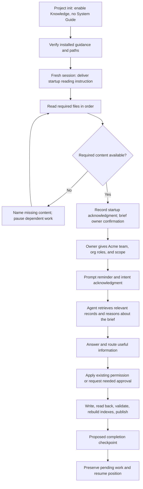
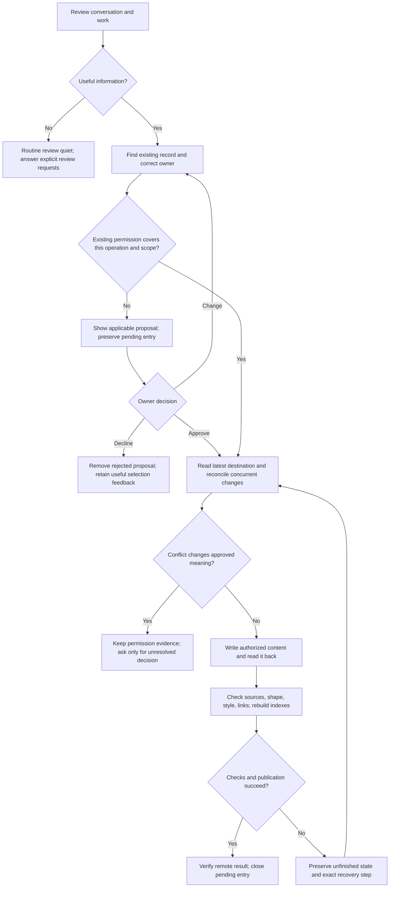

# Knowledge System — solution design

Updated: 2026-09-17. **Proposed; under review. No runtime build authorized.**

## 1. Purpose, authority, and review position

This is the single living solution design for the Knowledge System. It explains
the parts, how they work together, which requirements they serve, what their
controls can actually establish, and how the result will be tested. Detail is
kept when it helps make or review a design decision. Saving this document does
not approve its proposals or authorize implementation.

- [Knowledge System PRD](../../knowledge/prds/toolkit-operating-system/knowledge-system.md) owns the 30 requirements.
- [Toolkit OS PRD](../../knowledge/prds/toolkit-operating-system/toolkit-operating-system.md) owns the shared operating model and handshake principle.
- [Task D1](https://github.com/Mar5929/claude-toolkit/issues/269#task-d1--review-and-finalize-the-solution-design) owns the current work, roadmap, status, and approvals.
- [Acme walkthrough](269-knowledge-system/design-walkthrough.md) owns the hypothetical scenario and detailed review position.
- [Detailed solution design reference output](269-knowledge-system/detailed-solution-design-reference-output.md) preserves the earlier full draft unchanged. Its old recommendations and questions are historical inputs, not a second current design.

A later explicit owner decision takes precedence over an older design choice.
When this design and the PRD disagree, record the disagreement and reconcile it;
do not silently turn a design preference into an approved requirement. Proposed
behavior and a passing document check are never evidence of shipped behavior.

We are reviewing **Acme's first substantive message in a fresh session**. Acme
is a hypothetical Salesforce consolidation of two orgs. Setup enabled core
Knowledge System and `delivery/architecture/`, with System Guide off. The brief
supplies consulting team, client, originating and target org roles, and scope;
actual names and details are placeholders. No real installation or connection
occurred. Acme's tracker is not yet chosen. No complete scenario step or full
design has been approved.

The immediate review is startup reading and acknowledgment, the user-submit
reminder, and the proposed completion checkpoint. Then continue the walkthrough
through routing, approvals, saving, recovery, concurrent work, and migration.

### Terms used in this design

| Term | Meaning |
| --- | --- |
| Host or harness | The program running the agent: Claude Code or Codex. |
| Hook | A host event handler that can deliver guidance or, where supported, interrupt a specific action. |
| Skill | Instructions loaded for a particular operation, with detailed references loaded when needed. |
| Root router | `CLAUDE.md` or `AGENTS.md`, providing the project's map and routes to applicable instructions. |
| Toolkit operating manual | The higher-level explanation of enabled components and their responsibilities. Its project-relative path is still being designed separately. |
| Knowledge manual | `knowledge/README.md`, defining knowledge eligibility, routing, approval, and links to procedures. |
| Handshake | A request for an agent step and an acknowledgment of the step or its outcome. Intent acknowledgment and completion acknowledgment are different. |
| Gate | A host-supported hold on a named action until an objective condition is met. A proposed gate requires runtime proof. |
| Control | Guidance, an objective check, or agent judgment. These can coexist in one component. |
| Card | The PRD's owner-facing proposal for a memory or PRD change requiring approval. Other components retain their own proposal rules. |
| Inbox | Persistent pending proposals and authorized saves that remain unfinished, including their permission and source. |
| Session state | Temporary bookkeeping for reminders and acknowledgments, never a second knowledge store. |
| Compaction | Replacement of some conversation context by a summary; guidance and unfinished work must remain recoverable. |
| Spill | Hook output being shortened into a preview and file reference by the host. Delivery of a path is not delivery of the full content. |
| Fail-open | A handler failure that permits the action to continue. It limits any enforcement claim. |
| Frontmatter | Structured metadata at the start of a Markdown file. |
| Context cost | Text brought into the agent's context, including file reads and tool results, not only hook output. |
| System Guide | An optional separate component documenting an existing system. Acme does not enable it. |
| Source of truth | The record that owns a particular kind of information; indexes and temporary summaries point to it. |

Platform-specific fields and registration syntax belong in implementation
references after verification, rather than in the owner's core vocabulary.

## 2. Decisions at a glance

| Topic | Current direction | Status and limit |
| --- | --- | --- |
| Reasoning | The agent judges relevance, significance, scope, destination, and meaning. | Governing principle; no semantic scoring engine. |
| Startup | Request the required reads, then a truthful completion acknowledgment. | Latest owner preference replaces the old full-file-printing recommendation. Exact acknowledgment and gate mechanics require design and host proof. |
| Prompt checkpoint | Every user prompt gets a short reminder, positive/negative criteria, manual links, and intent acknowledgment. | Selected behavior; final wording, transport, and canonical source remain under review. |
| Completion checkpoint | One checkpoint near turn completion catches decisions and discoveries made while working. | Proposed mechanism. Routine no-change reviews stay quiet under the PRD; an explicit review request receives an answer. |
| Root files | `AGENTS.md` and `CLAUDE.md` remain maps and routers. | Selected. Detailed policy lives in linked guidance. |
| Long-term memory | Both relevant and significant to this project. | Selected; not every useful note belongs in memory. |
| Routing | Consider all owning records, including tasks, PRDs, procedures, and architecture. | Selected; System Guide participates only when enabled. |
| Review trigger | Conversation-only work counts. | Changed-file counting as a relevance/review trigger is rejected. |
| Manuals | Every equipped project receives a Toolkit operating manual; the knowledge manual supplies component policy. | Higher manual path and delivery design are a separate dependency. Do not invent a runtime path. |
| Documentation saves | Authorized Git-tracked documentation updates are checked and promptly committed/pushed on main. | Owner direction. Runtime code/config changes follow their own implementation workflow. Designs remain under `docs/designs/`. |
| Old startup budgets | Earlier draft selected character budgets for two printing hooks. | Historical constraints of that mechanism. Recalculate for the revised startup; do not discard useful context-cost analysis. |
| Paths and migration | Use the PRD's proposed layout, with setup/sync migrating existing projects deliberately. | A proposed path is not a claim that the live repository already uses it. |
| Approvals | Requirements approval, design approval, permission to save, and authorization to build remain distinct. | Required. Never infer one from another. |

## 3. Design philosophy and control boundaries

The [toolkit-wide handshake principle](../../knowledge/prds/toolkit-operating-system/toolkit-operating-system.md#design-principle-guide-the-agent-through-handshakes)
governs the design. The toolkit supplies guidance, checkpoints, and small
objective checks. The agent does the reasoning. Acknowledgment is bookkeeping,
not proof of understanding, correct classification, completed saving, or consent.

| Control | What it establishes | What it does not establish |
| --- | --- | --- |
| GUIDE | Applicable instructions and links reach the agent at the right moment. | The agent performed the instruction correctly. |
| CHECK | An observable condition holds: required fields, valid path, successful publication, or a current acknowledgment record. | The saved claim is true or semantically approved. |
| ENFORCE, when proven | A particular host action is held or rejected until its objective condition holds. | Universal protection outside those event/tool paths, during fail-open behavior, or on an unverified host. |
| JUDGE | The agent evaluates meaning using the sources and governing instructions. | An external guarantee of good reasoning. Representative sessions assess the behavior. |

Use narrow safeguards where a failure would damage trust: lasting writes,
unfinished publication, context loss, and invalid records. Do not supervise
every action merely because it can be observed. No keyword classifier, search
quality scorer, transcript grader, or changed-file threshold decides whether
the conversation contains something worth retaining.

A file-read result can establish that content was made available. A handshake
can record what the agent reports doing. Neither proves understanding. Missing
required content pauses only dependent work and prevents a false startup
confirmation. Intent acknowledgments must not be reused as completion evidence.

## 4. The parts

Paths in this inventory are relative to an equipped project unless explicitly
marked plugin-relative. They describe the proposed system, not the installed
state today. Skill and handler names below retain useful names from the earlier
draft; their final wiring is unapproved. Requirements refer to the current PRD.
All parts also serve the plain-parts, documented-platform, and judgment
boundaries in R1, R26, and R29.

### Files and guidance

| Part / path | Purpose and requirements | Control | When loaded | Context cost | Documentation basis |
| --- | --- | --- | --- | --- | --- |
| `SOUL.md` | Project role; supports R2–3 orientation | GUIDE | Ordered startup read | Actual file content when read | PRD R2; project setup contract |
| `knowledge/project.md` | Project purpose/resources/tracker and shared approval configuration; R2,10,14,30 | GUIDE; CHECK metadata | Ordered startup read | Actual content | PRD R2,10,14 |
| `knowledge/README.md` | Knowledge manual and routing map; R2,18,19 | GUIDE | Ordered startup read; reopen if missing/stale | Actual content; no mandatory full reread each prompt | PRD R2,18,19 |
| Root `AGENTS.md` / `CLAUDE.md` | Routes to project guidance; R2,26,30 | GUIDE | Applicable host instruction chain | Router content plus followed links | Host instruction documentation; folder-instruction PRD |
| Toolkit operating manual, path pending | Cross-component orientation; R2,30 | GUIDE | Startup orientation as integrated with OS design | Measure actual manual/read scope | Parent OS requirements and separate manual design |
| `knowledge/memory/current.md` | Shared short-term continuation; R4,13,30 | GUIDE; CHECK shape | Startup/resume and work changes | Concise current context | PRD R13 |
| `knowledge/memory-inbox.md` | Pending proposals and unfinished authorized saves; R9,10,28 | GUIDE; CHECK state/shape | Startup discovery and relevant save/recovery | Brief discovery summary, needed entries on demand | PRD R28 |
| `knowledge/memory/memory-index.md` | Generated map to memory topics; R5,21 | CHECK format; GUIDE use | Locate at startup; read for relevant lookup | Index text only when needed | PRD R19,21 |
| `knowledge/prds/prd-index.md` | Generated map to PRDs; R16,21 | CHECK format; GUIDE use | Relevant requirements lookup | Same as above | PRD R16,21 |
| `ai-external-knowledge/README.md` | Generated map to captured sources; R8,21 | CHECK format; GUIDE use | Documentation lookup | Same as above | PRD R8,21 |
| `knowledge/memory/memory-entries/` | Curated topic/subtopic records; R11–15,22 | JUDGE content; CHECK shape | On demand | Zero until read | PRD R14 and templates |
| `knowledge/memory/memory-entries/terminology-glossary.md` | Project words, aliases, references; R7 | JUDGE resolution; GUIDE | Before a term-dependent lookup/answer | Required entries; exact startup delivery unresolved | PRD R7 |
| `knowledge/prds/` | Required behavior and requirement approval; R16 | JUDGE content; CHECK shape | On demand and authorized upkeep | Relevant PRD sections | PRD R16 |
| `knowledge/memory-selection-feedback.md` | Owner's selection feedback; R11,23 | GUIDE; JUDGE lessons | Candidate review | Relevant concise feedback | PRD R23 |
| `brainstorms/` | Unchecked exploration; R18 | GUIDE trust boundary | On demand | Zero until read | PRD R18 |
| Project standing guidance, proposed `.claude/rules/knowledge-system.md` | Continuing obligations and routes; R2–6,13,19 | GUIDE | Host-dependent instruction delivery and recovery | Measure loaded text; Codex uses linked guidance, not a large root handbook | Host rules/instruction docs |

### Skills, hooks, tools, and state

| Part / proposed name | Purpose and requirements | Control | When run | Context cost | Documentation basis / proof |
| --- | --- | --- | --- | --- | --- |
| `knowledge-find` | Find, assess sources, cite; R2,4–8,16,19,24 | GUIDE/JUDGE | Relevant lookup | Description plus invoked body/references | Host skill docs; source-based scenario tests |
| `knowledge-save` | Select, route, approve, write, verify, publish; R3,9–18,20–24,28,30 | GUIDE/JUDGE; calls checks | Save review or authorized upkeep | Body and needed templates on demand | Skill docs; full save/recovery tests |
| `knowledge-review` | Deduplicate, correct, supersede, retire; R22–24 | GUIDE/JUDGE | Requested or justified maintenance | Body plus relevant records | Skill docs; lifecycle cases |
| `knowledge-setup` | Install/repair/migrate/report; R2–3,7,18,24–27 | GUIDE plus objective checks | Setup/sync/repair | Procedure and setup report | Plugin/install docs; fresh-project proof |
| Startup orientation handler, replaces old `startup-files.mjs` printer design | Ordered reading instruction and acknowledgment; R2–3 | GUIDE; gate candidate | New session and appropriate recovery events | Short directive plus actual reads/ack | `SessionStart` and host adapter proof |
| Startup discovery handler, old `startup-state.mjs` responsibility | Current work, pending saves, glossary/index routes; R2–4,7,13,28 | GUIDE | Start/resume/recovery | Short map plus selected reads | Event ordering and missing-file tests |
| `knowledge-prompt-reminder.mjs` | Criteria/routing reminder and intent ack; R3,9,18,29 | GUIDE; acknowledgment bookkeeping | Every user prompt | Compact reminder and ack each prompt | `UserPromptSubmit`; no duplicate/loop tests |
| `session-review-nudge.mjs` | Proposed end-turn review checkpoint; R3,9,28 | GUIDE; completion transport pending | Once near turn completion | Brief request; routine no-change silent to owner | `Stop` behavior on each host |
| `save-moment-gate.mjs` | Candidate checkpoint before PR creation/work completion; R3,9,16,30 | Conditional ENFORCE candidate | Named supported action paths | Zero normally; short hold on unmet condition | Pre-action event and bypass/failure tests |
| `knowledge-write-guard.mjs` | Candidate narrow lasting-write safeguard; R3,10,13–14 | Conditional ENFORCE candidate | Covered write tools | Zero normally; failure explanation | Tool/path coverage, shell and helper-agent tests |
| `knowledge-after-write.mjs` | Validate actual file and rebuild affected index; R3,14,21 | CHECK | Covered writes; explicit save fallback | Failure details only normally | Post-action event and return-context proof |
| `compact-hold.mjs` | Candidate manual-compaction checkpoint; R3,9 | GUIDE or ENFORCE only if supported | Before manual compaction | Short checkpoint when needed | Verify host event; never assume auto-compaction can be held |
| `build-knowledge-index.mjs` | Deterministic three-index build; R8,21 | CHECK | After relevant changes | No routine context output | File-format contract and repeatability tests |
| `check-knowledge.mjs` + `frontmatter.mjs` | Fields, values, links, limits, secret patterns; R10,12–14,16,21 | CHECK | Saves and applicable commit checks | Named failures | PRD schemas; fixture tests |
| `command-parsing.mjs` | Recognize supported action command forms; supports R9 controls | Objective parsing only | Matching command event | None normally | Existing parser plus shell/platform tests |
| `session-marker.mjs` | Candidate acknowledgment bookkeeping helper; R29 | CHECK storage/identity only | Chosen handshake transport | Small receipt if exposed | Transport and isolation proof |
| Git pre-commit integration | Candidate check of staged knowledge; R14,21 | ENFORCE for ordinary commits if installed | Commit | Failure details | Git hook semantics, existing hook compatibility |
| Temporary per-session state outside repo | Reminder/ack generation and bounded retry facts; R29 | CHECK shape/isolation | Checkpoints | Normally none | Host session identity and lifecycle proof |
| Plugin activation and memory settings | Enable one shared file-based system; R1,10,25,27 | Configuration | Setup/session load | None directly | Current host docs/config verification |

These inventories state intended responsibilities. The number of scripts may
shrink when adjacent handlers can share implementation without merging their
jobs. Neither the earlier count of eight hooks nor a particular file name is a
requirement. The operating-manual dependency must be resolved before a shipped
hook can carry its real relative path.

## 5. Acme: end-to-end workflow

The diagram describes behavior. It does not assert that a startup or completion
gate has been implemented or proven on either host.

1. **Set up.** Acme's repository exists. Project-init equips core Knowledge,
   routes to the Toolkit manual, and uses the Salesforce delivery structure.
   Architecture belongs under `delivery/architecture/`. Setup validates actual
   paths, activation, and missing components before reporting success.
2. **Start a fresh session.** Applicable root instructions lead to the toolkit
   guidance. The knowledge startup step asks for `SOUL.md`,
   `knowledge/project.md`, and `knowledge/README.md` in that order. Actual content
   must reach the agent; naming paths is insufficient. The agent acknowledges
   completed reading, with one short owner-facing confirmation. Missing content
   is reported honestly. How a host holds dependent actions remains a proof task.
3. **Discover continuation context.** Read current work and relevant pending
   saves; discover indexes and the glossary. An index points to evidence rather
   than establishing it. This new project may have little history; do not invent
   team names, org details, architecture decisions, or a work tracker.
4. **Receive the first brief.** Mike describes the consulting team, Acme, source
   and target org roles, and scope. The prompt reminder arrives before processing.
   Its acknowledgment records intent to evaluate. The agent actually evaluates
   the brief and checks relevant existing records before proposing additions.
5. **Route the information.** Standing project orientation may update the project
   record; durable context may qualify as memory; consolidation requirements
   belong in their PRD/work item; architecture decisions belong in Acme's delivery
   architecture. Current task and next step belong to its work record, with only
   shared continuation context in working memory. One mixed message can affect
   several owners; no second copy is made merely to call it memory.
6. **Resolve uncertainty.** If org names, ownership, or scope are unclear, ask the
   question that changes the work. A hypothetical detail stays hypothetical.
   Unknown target architecture is not silently filled in by the scenario.
7. **Use the right permission.** An explicit instruction to update an authorized
   draft can cover that update. A new lasting memory needing approval receives
   the PRD's card. An unanswered proposal remains in the inbox. One approval
   covers its meaning and scope, not every proposed destination.
8. **Finish an authorized save.** Re-read the destination to protect concurrent
   edits, apply the authorized change, read back the actual result, check sources
   and fields, rebuild affected indexes, commit and push through the applicable
   documentation route. Verify publication before claiming it is saved remotely.
9. **Review work produced during the turn.** The proposed completion checkpoint
   catches insights or decisions absent from the original prompt. A routine
   review finding nothing stays quiet. Explicit review requests receive an
   answer. Needed approval or incomplete saving remains visible.
10. **Interrupt and resume.** If a push fails, preserve the exact outstanding
    change and permission in the inbox. A new session checks whether it already
    landed, completes unchanged authorized work without asking again, and raises
    only a genuine conflict. Current work links to the precise resume point.
11. **Correct later understanding.** If Acme changes its source/target strategy,
    find the owning records. Update current truth or preserve meaningful history
    according to the lifecycle rules. Repair references; never let stale memory
    override current requirements or the live system.
12. **Complete and deliver.** Update applicable PRDs for actual shipped behavior,
    keep acceptance and rollout evidence in the tracker, and preserve anything
    unfinished. Installation into another project is separate from merging the
    toolkit change.

## 6. Each part in detail

### 6.1 Startup files, root routing, and manuals

`SOUL.md` gives the agent its project role. `knowledge/project.md` supplies stable
orientation, resources, and tracker links; its proposed approval setting is
shared between hosts. `knowledge/README.md` owns the knowledge policy. The
startup instruction precedes their ordered reads, and the acknowledgment follows
available content. Do not emit the confirmation after only issuing a reminder.

The root files point to the manuals and component instructions. They do not
absorb the full knowledge rule or design philosophy. The Toolkit operating manual
describes enabled components and their responsibilities; the knowledge manual
describes this component. Their startup steps must be integrated, without two
competing orientation sequences. The higher manual's path and exact read scope
remain dependencies of the separate manual design.

The earlier proposal split printed content into two startup hooks because of
output spill. The revised preference is instructions plus reads and a handshake.
This changes the delivery mechanism, budgets, and proof; it does not waive the
required content. An old receipt is not enough after relevant guidance changes
or is lost through compaction. Recovery reuses guidance only while it is
available and current, and does not repeat the normal startup greeting.

### 6.2 Current work, inbox, and indexes

`knowledge/memory/current.md` is a concise shared overview: project goal,
milestones, each active item's goal/status/recent progress/next step/blocker/
to-dos and detailed-record link, plus general later work. Dates help a new
session judge freshness. It may hold useful unverified short-term findings,
clearly labeled. Detailed requirements, task instructions, approvals, and plans
stay in their owning tracker. Two sessions must preserve one another's entries.

`knowledge/memory-inbox.md` preserves unanswered cards and authorized saves that
did not finish. An entry carries a stable reference, destination and operation,
exact card when shown, source/date, host/conversation reference, update time,
state, next step/blocker, and permission evidence. For authorized PRD upkeep with
no card, record the outstanding scope and authority; do not invent a card.
States follow R28: awaiting approval, approved/save unfinished, or blocked by
conflict. Silence and age are not approval or rejection. Remove an active entry
only after rejection or verified completion; removal does not authorize deleting
lasting content. Avoid repeating unchanged proposals every turn.

The memory, PRD, and external-source indexes use the PRD's grouped one-line
link-and-summary shape. Summaries come from the sources, not an index writer's
reinterpretation. Rebuild deterministically after affected changes; moves and
renames repair links. An index is a discovery map: open the actual record before
using its claim. Startup can expose paths and pending-work discovery without
printing every index or all historical records.

### 6.3 Memory records, glossary, PRDs, feedback, and exploration

Memory is maintained as useful topic/subtopic records under the proposed
`knowledge/memory/memory-entries/` layout. Apply R14's template and metadata;
preserve provenance and distinguish reported facts, inference, and observed
evidence. A record should explain the current useful understanding, not grow
into an append-only conversation dump. Update existing topics before creating
duplicates. Supersede or retire when the lifecycle rules warrant it; age alone
does not invalidate a useful fact. Approval for one operation does not authorize
another operation or a broader scope.

The glossary maps the owner's terms and aliases to the intended concepts or
records, with useful cautions and sources. Consult it before resolving an
ambiguous term or searching by a misleading synonym. Its selected proposed path
is in the inventory. The old 1,500-character partial print is not automatically
adopted: preserve the required terminology behavior and measure the chosen read
strategy. A truncated glossary must not silently hide necessary cautions.

PRDs hold required behavior, separate from implementation progress. Proposed
unapproved PRDs omit requirements-approval fields; approved requirements carry
both valid fields even when still proposed. Finalized requirements do not prove
delivery. Authorized upkeep after actual shipping follows R16 without a new
routine save card; new decisions follow their own permission. Maintain umbrella
and component requirements at the right scope with references instead of copies.

Selection feedback captures what Mike accepts/rejects as worth remembering and
helps later candidate review. It does not override the manual or authorize a
memory. The proposed feedback file and existing installed file require explicit
migration reconciliation. Brainstorms remain unchecked exploration, separate
from approved requirements and durable truth. External documents remain dated
outside sources. Existing-system explanation goes to an enabled Guide or an
actual named owner such as Acme's architecture, never a fallback memory dump.

### 6.4 Standing guidance and skills

Standing guidance keeps the find order, trust boundaries, save responsibilities,
and recovery routes available. Keep it small and route to details. Verify each
host's delivery/recovery behavior; do not assume a Claude rule is automatically
available in Codex or that root instruction files should contain the whole rule.

The earlier six-to-four skill consolidation is a proposal to review, not an
approved rename. Preserve these four responsibilities regardless of final names:

| Responsibility | Procedure | Completion and failure behavior |
| --- | --- | --- |
| Find (`knowledge-find`) | Orient to shared current work; apply applicable rules/skills; use glossary and source indexes; open relevant authoritative records; search session history last when appropriate; cite evidence and explain conflicts. | Relevance/depth remain agent judgment. Distinguish historical conversation from current truth. Ask only for a material unresolved gap. |
| Save (`knowledge-save`) | Review candidates, determine kind/scope/owner, find existing record, apply existing permission or present needed card, preserve pending state, write/read back/check/publish. | No candidate is a valid outcome. A marker is not completion. Failed writes/checks/pushes remain unfinished with authority and next action preserved. |
| Review (`knowledge-review`) | Inspect relevant records for duplication, contradiction, missing sources, stale truth, or lifecycle needs; propose scoped changes. | Keep useful history; avoid mass rewriting or deleting by age. Lasting changes follow their destination's approval. |
| Setup (`knowledge-setup`) | Inspect existing configuration and files; install/repair approved components; reconcile layout; verify activation, links, and host behavior; report differences. | Preserve owner content. Stop affected migration on conflict. Distinguish configured, tested, and unavailable behavior. |

Skills load templates and detailed procedures only when needed. Save guidance
links to memory/PRD card and file templates, routing, inbox recovery, and skill
authoring. Procedure candidates are handed to the project's actual skill-authoring
process under its own permissions; do not invent a missing process or use the
memory card to authorize code. System Guide similarly retains its own process.

### 6.5 User-submit reminder

The following wording is under review. Paths are relative to the equipped
project's root. Keep one canonical source when implementing it; copied prompt
variants must not drift between hosts or setup templates.

> The user has submitted a message.
>
> **Friendly reminder:** keep front of mind and follow the Toolkit operating system's methodologies, processes, and instructions. Use the applicable root instruction chain, `AGENTS.md` and/or `CLAUDE.md`, to know what the project's files and folders contain and where information belongs. Toolkit operating manual: **[configured relative path; not yet decided]**.
>
> Evaluate the user's message and relevant conversation for information to retain or update:
>
> - **Long-term memory:** information both relevant and significant to this project—lasting facts, decisions, feedback, constraints, relationships, meaningful events, and lessons from resolved failures that future sessions would otherwise need explained again.
> - **Short-term working context:** current goals, blockers, next steps, unfinished work, and temporary context needed to resume. Keep it concise and distinguish hypotheses from established facts.
> - **Other records:** route requirements, tasks, procedures, enabled System Guide content, and architecture changes to their owning records. Use their actual configured paths; do not duplicate them in memory.
>
> Do not retain secrets, filler, routine tool logs, unnecessary duplicates, or information without useful project purpose. Do not promote scratch reasoning, dropped ideas, or unverified hypotheses into long-term facts.
>
> Consider additions, corrections, updates, consolidation, superseding, and removal. Follow `knowledge/README.md` for eligibility, routing, and approval; finding a candidate does not authorize a lasting change.
>
> Acknowledge this reminder, then perform the evaluation. Acknowledgment confirms intent, not completed review or saving.

Proposed acknowledgment: “Acknowledged. I'll evaluate what needs retaining or
updating.” Its visible/internal transport remains open. The operating-manual
placeholder must become a real configured path before shipping. The reminder
does not force a full manual reread each turn; missing or stale guidance is read
before the affected operation.

### 6.6 Completion, save moments, and write safeguards

The proposed end-turn checkpoint asks for the outcome of the agent's review,
including discoveries made during execution. Outcomes distinguish no update
needed, authorized updates completed, proposals pending, and unfinished saves.
Routine no-change outcomes stay quiet to the owner; this does not prohibit an
internal acknowledgment if the selected host supports it. An explicit review
request receives a meaningful answer. Specify bounded continuation and recovery
before implementing a Stop handler; do not fire after every intermediate tool
or assistant message or let the acknowledgment trigger itself indefinitely.

The earlier save-moment gate held PR creation, work-item close, and `work finish`
until the save skill had run since the last commit. That is a **candidate to
revise**: invocation time does not establish completed review or cover relevant
conversation-only decisions. Define a current checkpoint outcome and affected
action, then prove the host can hold that action. Command parsing recognizes
supported syntax only; it must not infer semantic approval. Merging and closing
also trigger the appropriate PRD-upkeep obligations without conflating delivery
and requirements approval.

The write guard should check objective prerequisites on supported lasting-write
paths. The agent remains responsible for matching actual permission to meaning
and scope. A blanket helper-agent prohibition or “save skill ran” marker is not
automatically selected just because the old draft included it. Decide the
minimum safeguard justified by the PRD and prove covered tools, shell writes,
path normalization, worktrees, permissions, and timeout behavior. Document
uncovered paths. Do not claim a post-write check prevented the write.

The after-write handler can run the checker and rebuild indexes on covered
events. The save procedure still explicitly performs read-back, validation, and
publication because not every write necessarily emits the same host event.
A checker error must reach the agent and leave the save unfinished. Proposed
Git pre-commit integration checks the staged content; it cannot establish truth
or prevent every bypass. Preserve existing project Git hooks and report a
configuration conflict instead of replacing them silently.

Manual compaction and handoff need a checkpoint before context disappears.
Verify what each host can deliver or hold. Do not block automatic recovery
compaction on an unproven mechanism. Preserve pending work durably through the
inbox/tracker and available recovery instructions even when a hook cannot hold
the event.

### 6.7 Save transaction and recovery

An approval permits the stated operation, meaning, and scope. Existing authority
must survive session changes. Read the destination again before applying a save;
preserve other sessions' changes and check whether an interrupted save already
completed. If the content must change materially, keep the original authority
and ask only about the changed meaning. Separate local write, valid file,
commit, and remote publication evidence. Never call a failed push a completed
save or silently switch its publication route.

### 6.8 Tools, session state, and configuration

The index builder reads source metadata and emits the three deterministic
indexes. The checker validates required fields, statuses, dates, links, limits,
and known secret patterns; secret detection is not exhaustive. The shared
frontmatter parser makes the builder and checker agree. Do not add content
limits simply to simplify a prompt budget; reconcile any new limit with R21.
Read-back and semantic/source review remain agent work.

Temporary session state can record a session identity, relevant checkpoint
generation, acknowledgment kind, and bounded retry information. The exact
schema/storage remains a design task. Keep it outside tracked knowledge and
never store summaries, interpretations, or lasting approval as hidden authority.
Durable permission and pending saves belong in the inbox or owning record.
Separate helper sessions and concurrent sessions; do not inherit a parent's
completion merely because identifiers or branches match. Cleanup must not
delete active state. The old 30-day sweep is a proposal requiring proof, not an
accepted safety guarantee.

Activation should install one set of plugin behavior and the project routes
needed to use it. Inspect host-native automatic memory settings so competing
background writers do not undermine the shared approval model. Verify actual
settings, scope, precedence, and trust on each supported host rather than
assuming the old source snapshot is current. Function hooks/Claude Mods are a
possible adapter avenue; no selected behavior depends on an unverified API.

## 7. Requirement coverage and proof

The inventory explains each part's contribution. This reverse map prevents a
requirement disappearing when parts are renamed or simplified. Coverage is a
design claim awaiting the indicated evidence, not a declaration of completion.

| R | Parts / behavior | Proof and important limit |
| --- | --- | --- |
| 1 Plain parts | Markdown, skills, hooks, Git; temporary bookkeeping only | Inspect delivered architecture; no second authoritative store/service. |
| 2 Follow system | Startup reads/ack, root routes, manuals, skills | Missing-file and restored-context sessions; acknowledgment does not prove understanding. |
| 3 Reliability | Prompt/completion/checkpoint guidance and narrow checks | Fresh, long, switched-task, parallel, conversation-only sessions; static tests insufficient. |
| 4 Continuation | Current work, tracker, inbox discovery | Fresh session resumes correct work without owner repetition. |
| 5 Memory first | Find responsibility and standing guidance | Relevant saved fact is opened before answer; relevance remains judgment. |
| 6 Citations | Find procedure | Answer identifies actual source, not just an index. |
| 7 Vocabulary | Glossary | Known aliases and ambiguous terms resolve with cautions retained. |
| 8 Documentation | External index and source lookup | Relevant dated source consulted; captured content remains outside authority. |
| 9 Frictionless saving | Save transaction, checkpoints, direct documentation route | Authorized change checked and published; failure preserved; conversation-only case. |
| 10 Permission | Agent scope review, cards/inbox, narrow write checks | Silence creates no lasting change; existing permission survives; guard bypass limits explicit. |
| 11 Eligibility | Save judgment and feedback | Project-relevant, significant durable context selected; routine noise excluded. |
| 12 Exclusions | Agent review and checker | Excluded material rejected; pattern matching cannot prove absence of all secrets. |
| 13 Working memory | Shared overview and concurrency discipline | Two sessions preserve useful entries and tracker links; temporary findings labeled. |
| 14 File shape | Templates, parser/checker | Valid and invalid metadata fixtures; file shape is not truth. |
| 15 Writing | Save procedure/style read-back | Useful detail readable without the original conversation; no jargon-only summaries. |
| 16 PRDs | Owning PRDs, approval fields, shipped upkeep | Unapproved draft valid without approval fields; shipped changes update proper scopes. |
| 17 Skills | Procedure routing to actual authoring process | Candidate reaches correct process; absent process reported, not invented. |
| 18 Routing | Manual, save procedure, owner links | Mixed content and cross-component decisions go to correct owners without duplication. |
| 19 Find order | Find skill, glossary, indexes | Relevant authority wins; history is checked before treated as current. |
| 20 Cards | Proposal reference and inbox | Correct operation/meaning/scope, separate answer/proposal; owner can approve selected items. |
| 21 Indexes/checker | Builder for three indexes, checker, read-back | Deterministic output, moved links repaired, invalid save remains unfinished. |
| 22 Lifecycle | Review/save | Update/supersede/retire with correct authority and useful history retained. |
| 23 Feedback | Selection-feedback record | Lessons improve selection without overriding policy or authorizing candidates. |
| 24 Plain-language requests | Skill routing | Natural requests reach correct operation without requiring command vocabulary. |
| 25 Codex | Host adapter and same shared records | Repeat behavioral scenarios on Codex; report any enforcement gap explicitly. |
| 26 Documented platform use | Verified docs and adapter proof | Record versions/sources, distinguish platform limit from design choice. |
| 27 Setup | Setup/sync/repair and delivery report | Fresh/equipped project activation works; merge alone is not rollout. |
| 28 Inbox | Pending-state and recovery flow | Cross-session unanswered/approved-unfinished/conflicted cases preserve exact scope. |
| 29 Judgment | Lightweight handshakes/objective checks | No semantic engine; bookkeeping outside knowledge; no changed-file review trigger. |
| 30 OS integration | Root routes/manual, component handoffs, tracker | Question with no work item and tracked delivery both preserve correct ownership. |

## 8. Host adapters and context cost

Share policy and file formats across Claude Code and Codex. Verify registration,
event ordering, context delivery, trust, shell forms, permissions, and recovery
separately. An adapter may differ without changing the required user behavior.
Where enforcement is unavailable, name the exact gap in setup and review; do not
quietly reduce the requirement to “roughly similar.”

The earlier reference contains useful Codex investigations and source pointers,
but fixed event counts, configuration keys, injected-shell assumptions, and
compaction/Stop behavior must be checked against supported versions before
implementation. Refresh applicable captured official documentation and preserve
sources for any decisive live verification.

| Cost category | Measure | Design consequence |
| --- | --- | --- |
| Always present | Root routes, standing guidance, skill descriptions | Keep routes compact; avoid duplicate manuals in root files. |
| Startup | Directive, actual ordered reads, discovery context, acknowledgment | A shorter hook does not make subsequent file reads free. |
| Every prompt | Reminder and selected acknowledgment | Canonical compact wording; measure across a long conversation. |
| On demand | Skill body, template, indexes, topic/PRD/source reads | Load relevant detail when needed; no universal full dump. |
| Completion/failure | Checkpoint and necessary outcome/recovery text | Routine no-change quiet; avoid loops and repeated pending cards. |

Record character counts and observed host token usage separately; do not equate
character and token limits. Measure normal and worst-case projects, unavailable
files, large inbox/glossary, and compaction. Earlier 9,500-character hook budgets
are retained in the reference as measurements for the printing design, not
current universal limits. No silent truncation of required meaning.

## 9. Changes, migration, and component boundaries

The old draft proposes new skill names, plugin-owned hooks, a standing rule,
new layout, indexes, checker extensions, and host settings. Before coding,
inventory the live shipped originals, installed copies, catalogs, settings,
tests, and references. Confirm what is already delivered. This document's
proposed paths must not be mistaken for today's live paths such as
`knowledge/current.md` or `spec-index.md`.

Migration needs an explicit old-to-new path map, content/metadata reconciliation,
index and link repair, configuration changes, and a recovery plan. Inspect owner
edits and existing Git hooks first. Preserve information and pending permission;
do not overwrite a newer file with an older worktree copy. Run checks before
claiming conversion complete. Existing projects receive changes through their
setup/sync process, not merely because a toolkit commit merged.

The reference records this repository before DragonFly as the intended migration
order. Each actual project's conversion still needs applicable authorization
and verification. Removing installed script copies, switching all handlers to
plugin paths, exact renames, and summary normalization remain implementation
proposals to reconcile against current delivery requirements.

The Knowledge System owns knowledge behavior. Toolkit OS owns shared orientation
and orchestration; work tracking owns roadmap/tasks/status; System Guide owns
enabled-system explanation; skill authoring owns procedure delivery; Acme's
delivery architecture owns its architecture. Missing integration is a named
dependency, never permission to build a competing tracker or manual.

## 10. Technical proofs and behavior tests

Run small risky proofs before committing to mechanisms that depend on them.
Their results may change the design, including whether a proposed gate is worth
keeping. Do not assume every old experiment is still necessary after the
startup architecture changes.

| Proof | Passing evidence |
| --- | --- |
| Startup instruction, actual reads, acknowledgment | Correct order, content available, no false completion when missing/truncated; one owner confirmation. |
| Restore after compaction/task switch | Required current guidance available before dependent operations; obsolete receipts not reused. |
| Prompt delivery and transport | Reminder once per user message, intent distinguished from completion, no self-triggered loop. |
| Completion adapter | Bounded review opportunity; no repeated forced continuation; routine no-change quiet. |
| Objective gate and write coverage | Supported tools/shells/paths/worktrees tested, uncovered paths and timeout/fail-open behavior reported. |
| Concurrent and helper sessions | No cross-session acknowledgment reuse or lost owner edits; durable permission unchanged. |
| Checker/index path | Shell and direct edits reach verification; failures are surfaced; staged check examines intended content. |
| Git integration | Existing hooks preserved; checked commit and verified push distinguished from local write. |
| Setup and host trust | New/equipped project runs correct plugin/adapter with actual settings and real relative manual paths. |
| Temporary state and cleanup | No lasting meaning stored privately; active sessions never deleted by age-only cleanup. |

Behavioral acceptance includes five representative contexts: fresh project,
long/compacted conversation, switching tasks, parallel sessions, and a mixed
project where Guide is enabled or disabled as appropriate. Exercise both hosts.
Seed relevant memory, conflicting sources, pending cards, an approved unfinished
save, missing manual, stale glossary, false/unsupported candidate, a secret-like
value, concurrent edits, and a refused push. Include a meaningful conversation
that changes no code files.

For each run record the starting files/configuration, expected requirement,
observed owner-visible behavior, actual records changed, publication evidence,
limits, and pass/fail. Static schema/link tests do not prove agent judgment or
fresh-session continuity. Preserve detailed reproducible harness cases from the
reference when applicable; retire only cases tied to superseded mechanisms.

## 11. Design process and implementation sequence

```mermaid
flowchart LR
  A[Reconcile current requirements and decisions] --> B[Review parts and Acme behavior]
  B --> C[Investigate technical unknowns]
  C --> D[Resolve owner choices]
  D --> E[Separate requirements and design approval]
  E --> F[Authorize implementation tasks]
  F --> G[Build and verify adapters and saves]
  G --> H[Representative sessions and migration]
  H --> I[Owner acceptance and project rollout]
```

The tracker owns detailed phases, tasks, dependencies, and live status. The
design explains a sensible implementation dependency order without duplicating
that tracker: stabilize manual/routing contracts and file shapes; prove startup
and checkpoint adapters; implement save/check/index/recovery behavior; integrate
setup/sync and migration; run representative sessions; then roll out and accept.
Skill-authoring and the Toolkit manual stay explicit dependencies with their
own owners. Do not begin runtime implementation from this proposed sequence.

For each implementation task, name the covered requirements, affected shipped
and installed files, acceptance evidence, and rollback. Keep the old draft's
effort and cost estimates as historical estimates, not current commitments.
Rollback must preserve owner records and approvals; reverting code is not a
reason to delete knowledge produced during a trial.

## 12. Reconciled decision and question ledger

Do not replay the reference's 27 questions as a new interview. Resolve existing
answers against current records first. Owner questions concern behavior or
tradeoffs; platform facts and bookkeeping are investigation work.

| Item | Disposition | Next action |
| --- | --- | --- |
| Full startup printing versus reads | Reopened by latest read-and-handshake direction | Specify actual reads, acknowledgment, failure handling, and host proof; reconcile old selected delivery wording. |
| Quiet routine no-change review | Settled by current PRD | Preserve quiet owner experience; investigate internal transport separately. |
| Every-prompt reminder | Selected | Finalize canonical text, real manual path, and acknowledgment transport. |
| End-turn checkpoint | Mechanism proposed | Recommend one completion checkpoint; settle exact outcome/retry/recovery contract. |
| Changed-file review trigger | Rejected | Remove it from current design/testing assumptions; file changes can still trigger objective file validation. |
| Glossary path | Recorded direction | Use proposed path; verify migration and delivery before term-dependent work. |
| Proposed PRD approval fields | Settled by current R16 | Unapproved proposed draft omits both; valid paired fields when requirements approved. |
| PRD card labels and inbox content | Current R20/R28 govern | Reconcile stale walkthrough/card copies; preserve exact card actually shown. |
| Multiple decisions in one authorized publication | Owner's prompt documentation-save direction applies; batching boundary needs reconciliation | Preserve prompt, scoped saves; do not ask again merely to save an already-authorized draft. |
| Approval-off metadata | Genuine permission/provenance detail | Determine honest standing-authority representation; never fabricate a person/date approval. |
| Additional size limits | Genuine design/PRD constraint | R21 governs; measure first, seek decision only if required meaning/limits conflict. |
| Save failure versus work completion | Cross-component policy question | Reconcile affected-work pause, pending-save recovery, and tracker completion; do not invent global blocking. |
| Guard scope, helper writes, invocation markers | Architecture choices not approved by old draft | Recommend narrow objective checks and prove coverage; semantic approval remains agent work. |
| Checks on the owner's own edits | Owner policy decision if pre-commit enforcement is retained | Explain whether an invalid staged knowledge file blocks Mike's own commit, available recovery, and bypass limits before asking for a decision. |
| Manual compaction, clear, resume, fork | Host mechanics and recovery behavior | Verify supported events and current guidance reuse; no repeated greeting by default. |
| Codex equivalence | Requirement applies | Investigate exact gaps and disclose them; any behavioral relaxation needs explicit decision. |
| Skill-authoring dependency | Separate process | Find actual current owner/process before assuming it is absent or adding a subsystem. |
| Moving component PRDs under parent | Old question already overtaken by current nested paths | Preserve current locations; do not ask to approve a move already reflected in current records. |
| Publication, migration, installed-copy removal | Separate delivery actions | Reconcile actual live state and scope; keep owner changes and project-specific authorization. |

The old questions about outdated PRD line numbers, already-settled fields,
superseded printing thresholds, and textual cleanup are not new owner decisions.
Keep a genuine conflict visible until its owner resolves it. A recommendation
does not become approved merely because the earlier draft proceeded on it.

## 13. Disposition of the detailed reference

The reference is preserved intact. This map explains where its useful substance
is carried forward and which historical material remains available for exact
inspection. Linked detail is evidence and implementation input, not competing
current instructions.

| Earlier section | Current treatment |
| --- | --- |
| 1 What this document is; glossary | Retained and revised in section1: authority, scope, terms, review status; obscure host fields stay in the reference until needed. |
| 1a Decisions at a glance | Retained as section2 and reconciled ledger12; old counts and printing-budget decisions labeled historical. |
| 2 What the knowledge system solves | Carried through purpose, Acme workflow, component responsibilities, and full requirement map7. |
| 3 Design philosophy | Retained and strengthened in section3; precise limits replace absolute enforcement claims. |
| 4 The parts | Retained as section4 with all part families, coverage, timing, context cost, documentation/proof. |
| 5 A session, start to finish; process diagram | Revised as Acme section5 and diagrams in5/6.7; startup and current checkpoints reconciled. |
| 6 Each part in detail | Current useful behavior retained in section6: files, rules, four responsibilities, each hook responsibility, tools, state, settings, save/recovery. Exact old code-like specifications, literal rule bodies, numeric cutoffs, and outdated schemas remain historical until selected and reverified. |
| 7 Requirement map | Rebuilt for all30 requirements in section7 with proof and limitations. |
| 8 Codex | Current responsibilities in8 and proofs10; exact historical config/source investigations retained for verification rather than asserted as current APIs. |
| 9 What changes today; dependency and migration lists | Retained as9; refresh the actual file-by-file implementation inventory before build. Historical rename lists remain source material, not authorization. |
| 10 Riskiest assumptions | Current proof groups in10; old detailed experiments remain available and are reused when their mechanism survives. No fixed “one hour each” promise. |
| 11 Testing plan | Representative sessions, seeded failures, recording requirements retained in10; exact harness recipes are supporting implementation material. |
| 12 Build order, cost, rollback | Current dependency order and rollback boundaries in11, context cost in8; detailed tasks/status belong to tracker, old estimates historical. |
| 13 Requirements to reconsider | Reconciled in12 against current PRD; resolved questions are not reopened automatically. |
| 14 Design alternatives | Current consequential choices in2/6/12; historical alternatives retained unchanged for rationale, not copied as current recommendations. |
| 15 Open questions | Replaced by reconciled ledger12; distinguish owner decisions, architect investigations, settled and superseded items. |
| 16 Whole-system alternatives | Retain useful plain-file/host-native boundary in3/6.8; historical vendor comparisons stay in reference and require fresh evidence if reconsidered. |

## 14. Next review

Review startup instruction → actual ordered reads → acknowledgment first, then
the prompt reminder and proposed completion checkpoint against Acme's brief.
For each part, settle its responsibility and user behavior before its exact
script or platform API. Record decisions here, keep task position in D1 and
scenario details in the walkthrough, and reconcile the PRD where required.
Finish remaining behavior and technical proofs before separate approvals and
build authorization. Preserve every useful requirement and design detail while
removing duplicate or superseded prescriptions from the current authority.
