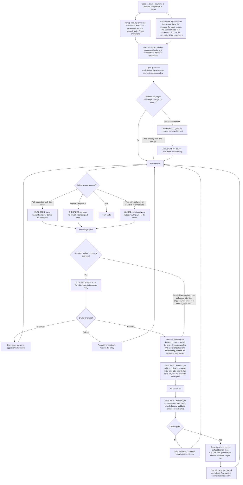

# Solution design: the project knowledge system


## 1. What this document is

This is a draft solution design. It is written for the owner, Mike, to approve
or change. It is not approval to build. The work item is GitHub issue 269 on
the `Claude-Toolkit-Project` board. The requirements document it designs from
is `knowledge/prds/knowledge-system.md`. That document has `status: proposed`
and the issue carries stage label `02-refinement`. Some of its requirements
still have open questions. This design does not settle them and does not change
the document's status. The second half of this document lists every open
question for the owner to answer. Three sources describe the wanted behavior,
and they sometimes disagree. The order for settling a disagreement is fixed:

1. A later clear instruction from Mike wins over everything.
2. The approved walkthrough wins over the requirements document. The
   walkthrough is the six-part picture of one session that Mike approved on
   2026-09-15.
3. The requirements document comes last of the three.

Where this design follows the walkthrough against the requirements document, it
says so where it does. Words used in a fixed way throughout:

| Word | What it means here |
| --- | --- |
| Harness | The agent program running the session. Claude Code and Codex are the two this toolkit supports. |
| Hook | A script the harness runs at a fixed moment, such as session start or just before a tool call. |
| Skill | A folder holding a `SKILL.md` file of instructions the agent loads when it needs them. |
| Rule file | A Markdown file under `.claude/rules/` that the harness puts into the agent's context. |
| Plugin | A package of skills, hooks, and scripts that a person installs once and turns on per project. |
| Frontmatter | The settings block at the top of a Markdown file, between two lines holding only `---`, written in YAML. |
| Matcher | The string in a hook's registration that says which event sources or tool names the hook runs for. |
| Compaction | The harness replacing the conversation so far with a summary, to free room in the context window. |
| Subagent | A separate agent a session starts for one delegated job, with its own context window. |
| Marker | A small record on disk that says something already happened in this session. |
| Card | The short block the agent shows the owner to ask for approval of one save: a numbered heading, `Change`, `Summary`, and `Your decision`. |
| System Guide | A separate part of the toolkit that documents how an existing system is built. It has its own requirements document and its own plugin. |
| Dynamic context injection | A line in a skill body that runs a shell command when the skill is invoked and puts the command's output into the body before the agent reads it. |
| Spill | What a harness does when a hook prints more than the output cap allows: it writes the whole text to a file and gives the agent a short preview and that file's path. |
| Fail-open | A hook that catches its own errors and exits 0, so a failure inside the hook lets the action through instead of stopping it. |
| Map | The text the two startup hooks print at the start of a session. Requirement 2 (PRD line 484) uses the word for the same thing. |
| Hook event | The named moment a hook runs at. The ones used here are `SessionStart`, `PreToolUse`, `PostToolUse`, `Stop`, and `PreCompact`. |
| `additionalContext` | A field in a hook's JSON output. The harness puts its text into the agent's context, beside the tool result or the prompt. |
| Exec form and shell form | Two ways to write a hook's command. Exec form gives the program in `command` and its arguments in `args`. Shell form gives one command string the shell parses. |
| `if` filter | An optional field on a Claude Code hook entry, written in permission-rule syntax such as `Edit(**/knowledge/prds/**)`. The harness checks it before it starts the hook process. |
| `${CLAUDE_PLUGIN_ROOT}` | The installed plugin's own folder, filled in by Claude Code when a hook or a skill runs. |
| `${CLAUDE_PLUGIN_DATA}` | A per-plugin folder outside the repository, at `~/.claude/plugins/data/<id>/`, that survives plugin updates. |
| `allowed-tools` | A skill frontmatter field listing tool calls the skill may make without a permission prompt. |
| Auto mode | A Claude Code permission mode in which the agent runs most tool calls without asking. |
| `bypassPermissions` | The permission mode that skips the permission prompt. A hook's deny still applies. |
| Managed setting | A setting an administrator sets for a machine or an organization, which a project cannot override. |
| `stop_hook_active` | An input field on the `Stop` event. It is true when the turn is already continuing because a `Stop` hook spoke, and it is how a hook avoids looping. |
| Worktree | A second working folder for the same Git repository, on its own branch. |
| Default branch | The branch a repository's work lands on, `main` in this repository. |
| DragonFly | The owner's other equipped project. |
| `second-brain` | The plugin that ships the knowledge system. The name is kept; 9.3 says why. |

## 1a. Decisions at a glance

Today one `SessionStart` hook prints 20,585 characters against Claude Code's
10,000-character output cap, so the knowledge manual never reaches the agent.
This design replaces that hook with two, each under 9,500 characters, rewrites
the manual to under 4,000 characters, replaces six skills with four, and adds
five things the harness enforces. The files themselves, plain Markdown committed to the default
branch, do not change.

| Kind of part | What it covers | Count |
| --- | --- | --- |
| File | `SOUL.md`, `knowledge/project.md`, the manual, `current.md`, the inbox, three generated indexes, the glossary, `memory-entries/`, `prds/`, the feedback file, `brainstorms/` | 13 |
| Rule | `.claude/rules/knowledge-system.md`, 26 lines, 1,998 characters, re-injected from disk after compaction | 1 |
| Skill | `knowledge-find`, `knowledge-save`, `knowledge-review`, `knowledge-setup` | 4 |
| Hook | Two startup printers, the save-moment gate, the write guard, the after-write check, the Stop nudge, the compaction hold | 7 |
| Tool | The index builder, the checker, the frontmatter parser, the command parser, the session marker, the Git pre-commit hook | 6 |
| State | `${CLAUDE_PLUGIN_DATA}/sessions/<session_id>.json`, the session facts the hooks share | 1 |
| Setting | `enabledPlugins` and `autoMemoryEnabled: false` in Claude Code; two `memories` keys in Codex | 2 |

Five things are enforced. The harness makes each one happen, or refuses the
action: the startup files are delivered in order inside each hook's budget; a
pull request, a work-item close, or `work finish` is held until `knowledge-save`
has run since the branch's last commit; a manual `/compact` is held once; a
write to a memory file or a requirements document is refused until
`knowledge-save` has run, and always inside a subagent; and every knowledge
write is checked and its index rebuilt, with `git commit` refusing a file that
fails the checker. Everything else is guidance, including what to look up, what
is worth saving, where it goes, and when to propose a save. Requirement 29
forbids a program that scores the agent's search, so nothing checks those.

Six things change from today. One startup hook becomes two, with a
9,500-character budget each. `knowledge/README.md` goes from 13,395 characters
to under 4,000, and its templates and field tables move into skill reference
files. Six skills become four. `memory-reminder.mjs`, which costs 1,292
characters on every message, is dropped for a 26-line rule file at 1,998
characters. Two guards, a compaction hold, an after-write check, and a Git
pre-commit hook are added, and every hook runs from the plugin, so projects keep
no copies. The data model is kept: the files, the direct-commit rule, the
checker's approval logic and its secret patterns, and the feedback file. No
knowledge file is deleted.

Eight decisions come before the build. The number in brackets is the question in
section 15.

1. Does hook delivery of the three startup files count as "read"? **Yes, and the check is that delivery finished.** [1]
2. Approve the end-of-turn nudge, which forces one turn continuation each time it speaks? **Approve it, capped at once per session per threshold.** [2]
3. May the approved walkthrough be edited where this design changes it? **Yes, both affected parts, with the edit dated.** [5]
4. Which glossary path is real? **`knowledge/memory/memory-entries/terminology-glossary.md`.** [6]
5. Does "when work ships" mean the work item is closed as done, or its pull request is merged? **Either one, and merge is not gated.** [7]
6. Are the startup budgets right? **Yes: 9,500 characters per hook, and 7,600 and 8,300 at the per-part caps.** [14]
7. Should `knowledge/project.md` stay at 1,500 characters? **Raise it to 2,000, and hold the manual at 4,000.** [15]
8. Which project migrates first? **This repository, then DragonFly.** [19]

The other nineteen questions are in section 15. Section 4 lists every part,
section 6 describes each one, section 7 maps the 30 requirements to parts and
checks, section 9 says what changes file by file, section 12 holds the cost, the
effort estimate, the rollback, and the eight build items, and section 13 gives
the design's reading of 23 requirements the requirements document leaves
unclear.

## 2. What the knowledge system solves

The owner should not have to hold the state of the project in his own head. The
agent holds it for him. That is the goal in one sentence, from the requirements
document's "Why this exists". The rest of that section and "How the owner
works" give these facts:

- The agent should know more than the owner about what has been going on in
  this project.
- Every new session should feel like the same agent, not a stranger who has to
  be caught up.
- Remembering too little means the owner explains the same thing twice.
  Remembering carelessly is worse, because a later agent believes information
  that is out of date and acts on it.
- The owner runs several agent sessions at the same time, in the integrated
  terminals of one VS Code project. Sessions use different models and different
  harnesses.
- The work is mostly requirements gathering, solution design, and reasoning, so
  a session's context window fills quickly. A session may be compacted, cleared,
  or replaced while other sessions keep working.
- The owner never reminds an agent to look something up, never says where
  information belongs, and never repeats the save rules.
- He approves what is saved as lasting knowledge, and he approves anything
  proposed for removal.
- Loading every instruction at the start of a session and hoping the agent still
  has it in mind later does not meet the requirement. Guidance has to arrive at
  the moment the agent needs to find, propose, write, update, or remove
  information.

Six ways the system fails, and what this design does about each:

| Failure | Cause | What the design does |
| --- | --- | --- |
| The agent repeats a question the project already answered | It did not look | A standing rule that says when to look, `knowledge-find` that says how, and a startup map that shows what exists |
| Something worth keeping is lost | Nobody proposed a save | Three moments a hook raises (a pull request, a work-item close, and a manual compaction), a handoff raised by `.claude/rules/offer-context-handoff.md` and the `/handoff` command, a nudge at the end of a turn when many files changed, and standing guidance for the rest |
| Wrong or unapproved text enters the store | A hand edit, or a save without a yes | Lasting files can be written only after `knowledge-save` is loaded; the checker runs after every write; approval stays the agent's duty under the skill's rules |
| A saved file never reaches other sessions | It was left on a branch | The existing `.claude/rules/knowledge-direct-commit.md`, plus `knowledge/memory-inbox.md`, which keeps the save until the push is verified |
| Guidance is gone after compaction | The context was summarized | The rule file is re-injected from disk, both startup hooks run again on compaction, and invoked skill bodies are re-attached |
| Startup loads too much text | Everything loads at once | Two hooks print a short map, each under its own fixed character budget; the detail lives in skills and loads on demand |

The last row is not a preference. It is measured. On 2026-09-16 the shipped
startup hook printed 20,585 characters in this repository. Claude Code caps a
hook output string at 10,000 characters and replaces the rest with a short
preview and a file path (`ai-external-knowledge/claude-code/hooks.md`, section
"JSON output"). So today the knowledge manual does not reach the agent at
startup at all unless the agent opens the file itself. Requirement 2's startup
files only reach the agent if each hook's output stays under the cap. That is
what the character budget is for.

## 3. Design philosophy

The owner's brief, in plain form: the agent does the reasoning. Each part
around it does one of three things: it delivers text when it applies, it
refuses one named action, or it checks a file. They never do the agent's
thinking.

### Three kinds of control

Every part of this design is one of three kinds. The kind is named for every
part in section 4 and again in section 6.

- **ENFORCE.** The harness makes it happen or refuses to let it happen. The
  agent cannot skip it.
- **GUIDE.** The right text reaches the agent at the moment it applies. The
  agent may still ignore it.
- **JUDGE.** The agent decides with its own reasoning. Nothing checks the
  decision.

### How each part is assigned ENFORCE, GUIDE or JUDGE

ENFORCE is used for three things only:

1. Writes to lasting files, meaning anything under
   `knowledge/memory/memory-entries/` or `knowledge/prds/`.
2. The three visible moments where a missed save would cost the owner trust:
   opening a pull request, closing a work item, and manual compaction.
3. File checks: required fields, allowed values, size limits, links, and
   secrets. The after-write check is one of these.

GUIDE is used for lookups, citations, choosing candidates, wording, the
destination table, and the quiet review at the end of a turn with real work.
JUDGE is used for relevance, search, what counts as memory, the wording of a
card, and which home a piece of information belongs in. This split follows
requirement 29, which says to begin with a small set of safeguards aimed at the
failures that damage trust, and to add restrictions only after a failure that
actually happened.

### What this design refuses to build

| Refused | Why |
| --- | --- |
| A scorer that grades the agent's search | Requirement 29: "Do not build something that scores whether the search was good enough." |
| A program that reads the agent's replies to check whether a review happened | Requirement 29 and requirement 3's "How reliability is demonstrated". A quiet review with nothing to say produces no text to read. |
| A service or an MCP server for knowledge operations | Requirement 1: plain parts only. A service is a second reasoning layer. |
| A database | Requirement 1: every piece of knowledge is a plain text file in the repository, and those files are the only copy. |
| A background writer | Requirement 1 and requirement 10. Anything that writes without approval breaks the approval rule. Claude Code auto memory and the Codex memory pipeline are both turned off for this reason. |

### The per-turn review is guided, not enforced

Requirement 9 asks for a save review at the end of every turn that did real
work, and requirement 3 says that review is required even when it produces
nothing the owner sees. A review that finds nothing produces no observable
output, so no harness can prove it happened. It is therefore GUIDE, not
ENFORCE. The three enforced moments are what catch a missed review. The design
says this, and the setup report every project receives says it too. Requirement
9 names five save moments. Three are enforced by a hook: a pull request, a
work-item close, and a manual compaction. The other two are guided. A handoff
or a context clear is raised by `.claude/rules/offer-context-handoff.md` and by
the `/handoff` command. The end of a turn with real work is raised by
`session-review-nudge.mjs`, which Mike has not yet approved; section 13.2 and
open question 2 put that decision to him.

## 4. The parts

`ENF` means ENFORCE. `GDE` means GUIDE. Context cost is characters added to the
agent's context.

| Kind | Name and path | Purpose | Control | When it runs or loads | Context cost | Documentation page followed |
| --- | --- | --- | --- | --- | --- | --- |
| File | `SOUL.md` | What the agent is responsible for in this project | GDE | Printed by `startup-files.mjs` | About 450 characters at start | None. Plain Markdown. |
| File | `knowledge/project.md` | What the project is, its resources, its tracker, and the `memory_approval` setting in frontmatter | GDE | Printed by `startup-files.mjs` | About 1,000 characters at start | None. Plain Markdown. |
| File | `knowledge/README.md` | The manual, also called the map: where each kind of information lives, the find order, the save moments, the approval rule, the file list, the skills | GDE | Printed by `startup-files.mjs` | Under 4,000 characters at start, 5,000 at its ceiling | None. Plain Markdown. |
| File | `knowledge/memory/current.md` | The shared overview of active work across sessions | GDE | Printed by `startup-state.mjs` | Under 5,000 characters, capped by the checker | None. Plain Markdown. |
| File | `knowledge/memory-inbox.md` | Unanswered cards and approved saves that did not finish | GDE on content, ENF on the tool used | Heading and state lines printed by `startup-state.mjs`; entries opened on demand | About 60 characters per entry at start, capped at 1,200 | None. Plain Markdown. |
| File | `knowledge/memory/memory-index.md` | Generated index of memory topics | GDE | Path and entry count printed at start; contents opened during a lookup | About 60 characters at start | None. Plain Markdown. |
| File | `knowledge/prds/prd-index.md` | Generated index of requirements documents | GDE | Path and entry count printed at start; contents opened during a lookup | About 60 characters at start | None. Plain Markdown. |
| File | `ai-external-knowledge/README.md` | Generated index of captured outside documentation | GDE | Path printed at start; opened during a lookup | One line at start | None. Plain Markdown. |
| File | `knowledge/memory/memory-entries/` | Memory topic files and topic folders | ENF on shape | Opened on demand | Zero until opened | None. Plain Markdown. |
| File | `knowledge/memory/memory-entries/terminology-glossary.md` | The project's words and what they refer to | GDE | Printed whole at start when under 1,500 characters, else its `Term / aliases` and `Refers to` columns up to 1,500 characters, then its path | Up to 1,500 characters | None. Plain Markdown. |
| File | `knowledge/prds/` | Requirements documents, parent and child | ENF on shape | Opened on demand | Zero until opened | None. Plain Markdown. |
| File | `knowledge/memory-selection-feedback.md` | What the owner accepts and rejects as memory | GDE | Read by `knowledge-save` | Zero until read; capped at 4,000 characters | None. Plain Markdown. |
| File | `brainstorms/` | Unchecked exploration at the project root | GDE | Opened on demand | Zero | None. Plain Markdown. |
| Rule | `.claude/rules/knowledge-system.md` | The standing obligations, 26 lines | GDE | Every session, and re-injected from disk after compaction | 1,998 characters per request, measured | `ai-external-knowledge/claude-code/memory.md`, section "Organize rules with `.claude/rules/`" |
| Skill | `knowledge-find` | How to look something up and how to cite it | GDE | When the agent or the owner invokes it | Description always, under 500 characters; body about 3,000 characters when invoked | `ai-external-knowledge/claude-code/skills.md`, section "Frontmatter reference" |
| Skill | `knowledge-save` | The whole save path: candidates, home, card, approval, write, check, push | GDE | When the agent or the owner invokes it | Description always, under 500 characters; body about 6,000 characters when invoked | `ai-external-knowledge/claude-code/skills.md`, sections "Frontmatter reference" and "Add supporting files" |
| Skill | `knowledge-review` | Whole-folder review for duplicates, conflicts, and retirement | GDE | On request, or after a migration | Description always, under 500 characters; body about 3,000 characters when invoked | `ai-external-knowledge/claude-code/skills.md`, section "Frontmatter reference" |
| Skill | `knowledge-setup` | Turn the system on in a project, migrate the layout, repair, and report | GDE | On request, or from `/project-init` and `/project-sync` | Description always, under 500 characters; body about 5,000 characters when invoked | `ai-external-knowledge/claude-code/skills.md`, section "Frontmatter reference" |
| Hook | `hooks/startup-files.mjs`, `SessionStart` | Print the version line, then `SOUL.md`, `knowledge/project.md`, and `knowledge/README.md`, in that order | ENF on delivery | Session start, resume, clear, compaction, fork | Up to 9,500 characters per start | `ai-external-knowledge/claude-code/hooks.md`, section "SessionStart" |
| Hook | `hooks/startup-state.mjs`, `SessionStart` | Print the version line, the inbox state lines, the glossary, the two index paths and their entry counts, the System Guide line, `knowledge/memory/current.md`, and the last line | ENF on delivery | Session start, resume, clear, compaction, fork | Up to 9,500 characters per start | `ai-external-knowledge/claude-code/hooks.md`, section "SessionStart" |
| Hook | `hooks/save-moment-gate.mjs`, `PreToolUse` | Hold a pull request, a work-item close, or `work finish`, the work tracker's finish command, until the save skill ran | ENF | Before the matching tool call | Zero unless it denies, then about 220 characters | `ai-external-knowledge/claude-code/hooks.md`, sections "PreToolUse" and "Common fields" |
| Hook | `hooks/knowledge-write-guard.mjs`, `PreToolUse` | Refuse a write to a lasting file until the save skill ran, and always inside a subagent | ENF | Before `Edit` or `Write` under the lasting paths | Zero unless it denies, then about 200 characters | `ai-external-knowledge/claude-code/hooks.md`, section "PreToolUse input" |
| Hook | `hooks/knowledge-after-write.mjs`, `PostToolUse` | Run the checker and rebuild the affected index after a knowledge write | ENF | After `Edit` or `Write` under `knowledge/` or `ai-external-knowledge/` | Zero on a clean write; about 300 characters on a failure | `ai-external-knowledge/claude-code/hooks.md`, section "PostToolUse" |
| Hook | `hooks/session-review-nudge.mjs`, `Stop` | Raise the review moment that no command announces, and report a checker failure on files changed through Bash | GDE | At the end of each turn | Zero unless it speaks, then about 250 characters and one forced continuation | `ai-external-knowledge/claude-code/hooks.md`, section "Stop" |
| Hook | `hooks/compact-hold.mjs`, `PreCompact` | Hold a manual compaction once, so the review happens before the context is summarized | ENF | On `/compact` only | Zero unless it holds | `ai-external-knowledge/claude-code/hooks.md`, section "PreCompact" |
| Tool | `tools/build-knowledge-index.mjs` | Generate the three indexes | ENF on format | From the after-write hook, or by hand | Zero | None. A Node script. |
| Tool | `tools/check-knowledge.mjs` | Check fields, values, size limits, links, and secrets. Read-only | ENF | From the after-write hook, the pre-commit hook, or by hand | Zero | None. A Node script. |
| Tool | `tools/frontmatter.mjs` | The shared frontmatter parser | ENF on parsing | Imported by the other two tools | Zero | None. A Node module. |
| Tool | `hooks/command-parsing.mjs` | The shared shell-command parser, kept unchanged. It ships today at `plugins/second-brain/hooks/command-parsing.mjs` and `save-reminder.mjs` imports it. Detail in 6.5 | ENF on parsing | Imported by `save-moment-gate.mjs` | Zero | None. A Node module. |
| Tool | `tools/session-marker.mjs` | Write the marker that says `knowledge-save` was invoked | ENF on recording | From a dynamic context injection line in the `knowledge-save` body | Zero | `ai-external-knowledge/claude-code/skills.md`, sections "Inject dynamic context", "How injected commands run", and "When an injected command fails" |
| Tool | `.githooks/pre-commit` | Run the checker on staged knowledge files and refuse a failing commit | ENF | On every `git commit` in an equipped project | Zero | Git documentation for `core.hooksPath` |
| State | `${CLAUDE_PLUGIN_DATA}/sessions/<session_id>.json` | The few session facts the hooks share | ENF on storage | Written and read by the hooks | Zero | `ai-external-knowledge/claude-code/plugins-reference.md`, section "Persistent data directory" |
| Setting | `.claude/settings.json`: `enabledPlugins`, `autoMemoryEnabled: false` | Turn the plugin on and Claude Code auto memory off | ENF | Session load | Zero | `ai-external-knowledge/claude-code/memory.md`, section "Auto memory" |
| Setting | Codex `config.toml`: `memories.generate_memories`, `memories.use_memories` | Turn the Codex memory pipeline off | ENF | Session load | Zero | Codex source at commit 9771934, `codex-rs/config/src/types.rs` |

Four notes on the table. A plugin cannot ship a `.claude/rules` file and
cannot ship CLAUDE.md text
(`ai-external-knowledge/claude-code/plugins-reference.md`, section "Plugin
components reference", the paragraph at line 905 and the file-locations table
that follows it). The rule file is therefore written into each project by
`project-init` and `project-sync` from the shipped rule library. For Codex, the
same text sits in one "Knowledge system" section of the root `AGENTS.md`.

Every hook script is written once and registered twice: in the plugin's
`hooks/hooks.json` for Claude Code, and declared in the plugin manifest for
Codex, with `.codex/hooks.json` as the fallback. Codex uses the same twelve
event names and the same JSON output keys, except on `Stop` and the two
compaction events, which section 8 covers. The Claude Code registration is the
exec form with `args`; Codex has no `args` field, so its registration is a
shell-form `command` string that resolves the script path itself.

Every hook entry sets an explicit `timeout`: 15 seconds for the two startup
hooks, 5 seconds for the two guards, the after-write check, and
`compact-hold.mjs`, and 10 seconds for the Stop hook. Claude Code's default is
600 seconds, and it discards the output of a hook that reaches its timeout, so a
hook that reaches its timeout renders no decision and the tool call goes through
the normal permission flow (`ai-external-knowledge/claude-code/hooks.md`, lines
431, 844, and 848). The guards must therefore be fast. A timeout is the one case
where the gate and the write guard do not enforce anything.

The always-on cost, paid on every request in every session: the standing rule at
1,998 characters, measured in 6.2, plus four skill descriptions written to stay
under 500 characters each, so under 2,000 characters for the four. About 4,000
characters in total, which is about 1,000 tokens at four characters per token.
Claude Code caps a skill's combined `description` and `when_to_use` text at 1,536
characters, so the 500-character budget is this design's choice and not the
harness limit. Section 12's cost table carries the same numbers with the
per-session and per-invocation costs beside them.

## 5. A session, start to finish

This section walks the six parts of the approved walkthrough. For each step it
names the part that does it and what the owner sees.

### Part 1. Read the required startup files

| Step in the walkthrough | Part that does it | What the owner sees |
| --- | --- | --- |
| The owner opens a session | The harness | Nothing |
| Project instructions, rules, and skills are available | `.claude/rules/knowledge-system.md` and the four skill descriptions load | Nothing |
| The startup reading steps reach the agent before the reads | `startup-files.mjs` prints the files themselves, so the reading is already done when the agent's first turn begins | Nothing |
| Read `SOUL.md`, then `knowledge/project.md`, then `knowledge/README.md`, in that order | `startup-files.mjs` prints them in that order in one stream | Nothing |
| The completion check | `startup-files.mjs` names any file it could not print, and `startup-state.mjs` prints the last line | Nothing |
| "I've read the knowledge manual." | The agent, following the last line of `startup-state.mjs` and the standing rule | One short line, once, when the session source is `startup` or `clear`. On `resume`, `compact`, and `fork` the last line says instead: "Context was restored. Do not repeat the startup confirmation." |

The hook prints the three files in order, so the reading is already done when
the agent's first turn begins. Nothing asks the agent to read them in order.
This is the design's answer to requirement 2's completion check, and it is one
of the open questions in the second half: requirement 2 asks for proof that the
contents "were read", and no harness can produce that proof.

### Part 2. Understand the request and current work

| Step | Part | What the owner sees |
| --- | --- | --- |
| Read `knowledge/memory/current.md` | `startup-state.mjs` printed it whole | Nothing |
| Check `knowledge/memory-inbox.md` for unanswered proposals and unfinished saves | `startup-state.mjs` printed each entry's heading and state line; the agent opens the entries that matter | Nothing, unless something is pending |
| The owner's request arrives | The owner | The owner's own message |
| Decide once whether long-term project knowledge could change the answer | The agent, guided by `.claude/rules/knowledge-system.md` | Nothing |
| If yes, find the source through the glossary and `knowledge/memory/memory-index.md` | `knowledge-find` | Nothing |
| Use an existing work item, or ask before creating one | The work tracker's own process, not this system | The question "Would you like me to create a work item for this?" when it applies |
| The briefing | The agent | A short briefing naming the records it used |

### Part 3. Use relevant knowledge to do the work

| Step | Part | What the owner sees |
| --- | --- | --- |
| Confirm the applicable guidance is present | The standing rule, which is loaded in every session and re-injected from disk after compaction | Nothing |
| Resolve the project's shorthand | `knowledge/memory/memory-entries/terminology-glossary.md`, printed at start whole when small and as two columns when large | Nothing |
| Open only the additional sources needed | `knowledge-find`, using the three indexes | Nothing |
| Decide whether the evidence is enough | The agent | A focused question when a gap remains |
| Cite the source under each finding | The standing rule and `knowledge-find` | The file path on the line below each finding |
| Do the work | The project's own delivery process | The work |
| Keep changed work state in its record | The tracker for item state; `knowledge/memory/current.md` for shared context | One short line saying the overview was updated, and whether it is pushed or saved locally only |

### Part 4. Decide what to save from the work

| Step | Part | What the owner sees |
| --- | --- | --- |
| The review happens at its moment | The three enforced moments and the nudge, all in 6.4; the skill description for "save this" | Nothing, until there is something to show |
| Establish the current rules before proposing | `knowledge-save` body and its reference files | Nothing |
| Read the project's output style before preparing a proposal | `knowledge-save` step 0, reading `outputStyle` in `.claude/settings.json` | Nothing |
| Consider prior owner feedback | `knowledge/memory-selection-feedback.md` | Nothing |
| Decide whether anything needs an update | The agent | Nothing on a quiet review |
| Choose the home | The manual's ten-line summary, then `knowledge-save/references/routing.md` at the moment of routing | The home named on the card |
| Decide whether new approval is needed | `knowledge-save`, reading `memory_approval` in `knowledge/project.md` frontmatter | A card, or a one-line report when the approval step is off |
| Show the card | `knowledge-save`, using `references/card-format.md` | The card, under its destination heading |
| Write the entry in the inbox in the same reply | `knowledge-save` | Nothing |
| The pre-write check | `knowledge-save` body step 8, three agent actions listed in 6.3. The hook does none of this | Nothing |
| The write is permitted | `knowledge-write-guard.mjs`, which checks permission to write and never the content | Nothing |
| A decision settled during an authorized interview | `knowledge-save` step 12 | One line, and no second approval question |
| Check the saved result and rebuild the index | `knowledge-after-write.mjs`, `check-knowledge.mjs`, `build-knowledge-index.mjs` | Nothing on success |
| Commit and push to the default branch | `knowledge-save`, following `.claude/rules/knowledge-direct-commit.md` | One line naming what was saved and where |
| Remove the completed inbox entry | `knowledge-save` | Nothing |

### Part 5. Fix knowledge problems when needed

| Step | Part | What the owner sees |
| --- | --- | --- |
| The agent finds a fault | Any step | Nothing |
| Establish the repair rules | `knowledge/README.md` and `knowledge-review` | Nothing |
| A clear mechanical repair, such as links after a rename or an index rebuild | `knowledge-save` lifecycle reference and `build-knowledge-index.mjs` | Nothing, or one line |
| A changed meaning, an unclear destination, or deleted content | Part 4's approval path | A card |
| A setup fault | `knowledge-setup` | The setup report |
| Verify and return to the interrupted step | `check-knowledge.mjs` | Nothing on success |

### Part 6. Hand off and resume

| Step | Part | What the owner sees |
| --- | --- | --- |
| Run the review before a handoff or a context clear | `knowledge-save`, invoked by the `handoff` skill and by `.claude/rules/offer-context-handoff.md` | Any card the review produces |
| Update `knowledge/memory/current.md` and the tracker | `knowledge-save` and the tracker | One line |
| Keep unanswered proposals and unfinished saves recoverable | `knowledge/memory-inbox.md`, reread before editing | Nothing |
| Check that the next session can actually see the saved state | `knowledge-save`, verifying the push | A short handoff, or a plain statement of what is not yet shared |
| A new session picks the work up | Part 1 and Part 2 again | The confirmation line, then the briefing |
| Recover each pending save by its recorded state | `knowledge-save`, reading the inbox entry | The card again for an unanswered proposal; nothing extra for an approved unfinished save |

`/clear` cannot be held. Claude Code's `SessionEnd` hook fires on a clear but
cannot block it and cannot say anything to the agent
(`ai-external-knowledge/claude-code/hooks.md`, section "SessionEnd"). A
deliberate clear is covered by `.claude/rules/offer-context-handoff.md` and the
`/handoff` command, which run the review before the prompt is written.

### The designed process



## 6. Each part in detail

### 6.1 The knowledge files

All of these are plain Markdown in the project repository, committed to the
default branch. They are the only copy of what they hold. This is requirement 1.
Every one of them is the same file in Codex, read and written the same way, so
no file below repeats that. Section 8.1 holds the harness differences.

#### `SOUL.md`

What it is: what the agent is responsible for in this project. It sits at the
project root, not under `knowledge/`. Mechanism: an ordinary file. It reaches
the agent because `startup-files.mjs` prints it first, after the version line.
Documentation page: none needed; it is not a harness feature. When: printed at
every session start, resume, clear, compaction, and fork. Written by:
`knowledge-setup` with the owner. Approval: the owner. Control: GUIDE. Context
cost: about 450 characters at start. What can go wrong: the owner edits it and
it grows past its share of the budget. Recovery: the overflow rule in
`startup-files.mjs` replaces it with a "Read this now" line, so nothing is
silently cut. Setup guidance keeps it under 1,000 characters.

#### `knowledge/project.md`

What it is: what the project is, the real systems it uses, their names and IDs,
the folders that matter, and where work is tracked. It also carries one
frontmatter field this design adds: `memory_approval: required` or
`memory_approval: off`. `required` is the default. `off` is the per-project
setting requirement 10 gives the owner, which turns the approval step off for
writes to memory only. It never covers a requirements document.

It also carries an `owner` field holding the project owner's name. When
`memory_approval` is `off`, a memory file still records who authorized it:
`approved_by` takes the value of that `owner` field, `approval_date` is the
date of the write, and the optional `source` field records the standing
approval, for example `source: standing memory approval, memory_approval off
since 2026-09-16`. Nothing the toolkit ships then carries a person's name. This
is an open question for the owner; requirement 14 gives `approved_by` the
allowed value "A person's name" and leaves no value for the standing-approval
case. Mechanism: an ordinary file. Printed by `startup-files.mjs`. Control:
GUIDE, plus one ENFORCE: `check-knowledge.mjs` requires `approved_by` to match
the project file's `owner` value when that file says `memory_approval: off`.
Context cost: about 1,000 characters at start. Setup guidance keeps it under
1,500 characters.

#### `knowledge/README.md`, the manual

What it is: one file that says where each kind of information lives and what
the rules are. The requirements document calls it the manual; requirement 2
calls the same thing a small map. This design keeps both names for one file.
Today's copy is 13,395 characters, which is 65 percent of the 20,585
characters the startup hook prints. It is rewritten to stay **under 4,000
characters**. Templates, field tables, and step-by-step procedures move into
the skills' reference files, which load only when a skill is invoked. Content
outline, with the character budget for each part:

| Part | What is in it | Budget |
| --- | --- | --- |
| Title and one purpose line | "The knowledge manual" and one sentence | 100 |
| Where information goes | Ten lines, one per home, with no examples, and a pointer to the full routing table in `knowledge-save/references/routing.md` | 600 |
| What is worth saving | Three lines on requirement 11's three-point memory test, with a pointer to requirement 12's exclusion list in the same reference folder | 300 |
| How a save is proposed | Three lines naming the card's `Change`, `Summary`, and `Your decision` labels, with a pointer to `knowledge-save/references/card-format.md` | 250 |
| The find order | Five lines, one per tier of requirement 19, plus one line saying an index entry is a pointer | 450 |
| The save moments | Five lines: a work item finishes or closes, a pull request is about to be opened, a handoff or context clear is coming, a turn ends after real work, and the owner says to save | 350 |
| The approval rule | Three lines: every write to a memory file or a requirements document needs permission that covers that change; silence is not approval; five things need no asking (rebuild an index, repair a clear broken link, write `current.md`, keep the feedback file, keep the inbox) | 350 |
| The file list | One line per file, with its path and one phrase | 450 |
| The skills | One line per skill: what it does and when to reach for it | 300 |
| Pointer lines | Where the field rules and templates live, and the direct link to `knowledge/memory/memory-entries/terminology-glossary.md` | 100 |

Total budget: 3,250 characters. 4,000 characters is the target the setup
guidance and the checker's warning hold the file to; 5,000 characters is the
ceiling the checker fails at, and 5,000 is the number the startup budget
arithmetic in 6.4 uses. The requirement 18 routing table is 2,560 characters and
the four-row "Ask this / Home / Example" test is a further 1,035 characters, so
3,595 characters in total. They do not fit in a 4,000-character manual that also
carries nine other parts. Both tables therefore live in
`plugins/second-brain/skills/knowledge-save/references/routing.md`, which
`knowledge-save` opens at the moment it chooses a destination and which
`knowledge-find` opens when a lookup needs it. Requirement 18's "given to the
agent in every project" is met by delivery at the moment of routing, which is
what requirement 2 (PRD line 484) asks for: detailed rules are opened when they
are needed. Section 13.20 puts that reading to Mike.

Mechanism: an ordinary file, printed last of the four by `startup-files.mjs`.
It is a managed copy: the toolkit owns its text, and
`tests/installed-copy-check.mjs` fails when the shipped original and a
project's copy stop matching. Control: GUIDE. Context cost: under 4,000
characters at start. What can go wrong: the manual grows again and pushes the
startup output over budget. Recovery: `check-knowledge.mjs` warns above 4,000
characters, naming the file and the number, and fails above 5,000. The warning
comes first because requirement 15 (PRD line 1075) says a size check that fails
never allows quietly dropping meaning the owner approved.

#### `knowledge/memory/current.md`

What it is: the shared overview across all sessions in this project. The
project goal and next milestone, then one section per active work item with its
goal, where the work stands, the next step, the blocker or None, its to-dos,
and a link to its detailed record. Then general project to-dos. It is not
lasting memory. A wrong line costs little and the owner can fix it by hand. A
stale file costs a lot more, so the agent rewrites it as work happens, without
asking, and says in one line that it did. Mechanism: an ordinary file, printed
last by `startup-state.mjs`, after the cheaper items. Control: GUIDE on its
content. ENFORCE on its size: `check-knowledge.mjs` refuses a file over 5,000
characters. ENFORCE on the tool used to change it: `knowledge-write-guard.mjs`
denies the `Write` tool on this file and on `knowledge/memory-inbox.md`, with
the reason "Read the current file and use Edit, so another session's change is
not overwritten."

Context cost: up to 5,000 characters at start. What can go wrong: two sessions
overwrite each other's entries. Recovery: the `Write` deny above forces `Edit`,
whose `old_string` must match the file's current content, so another session's
change fails the match and the agent has to reread
(`ai-external-knowledge/claude-code/tools-reference.md`, "Edit tool behavior"
and "Write tool behavior"). The standing rule says to reread a shared file
before editing it, and `.claude/rules/knowledge-direct-commit.md` fetches
before it commits. A write made through a Bash command still bypasses the deny.
This is a named limit.

Requirement 3 asks the agent to confirm in one short line that a shared-context
update is available to the next session. `knowledge-after-write.mjs` answers
that from Git rather than from a claim; 6.4 holds the two commands it runs and
the line it returns.

#### `knowledge/memory-inbox.md`

What it is: proposals the owner has not answered, and approved saves that did
not finish. One `##` heading per entry, keyed by a reference that does not
change. States are `awaiting approval`, `approved, save unfinished`, and
`blocked by conflict`. Each entry holds eight items: the stable reference; the
destination and the operation; the exact card when one was shown; which harness
it was shown in and that conversation's ID; the source and its date; the time
it was last updated; its state; and the next step or blocker. For automatic
upkeep of a requirements document where no card was shown, it holds the
specific update owed, where the permission came from, and links to the agreed
scope and the delivery evidence.

Timing: the entry is written locally in the same reply that shows the card, and
pushed at the next push or at the handoff. Writing it later loses the card if
the session dies first. Mechanism: an ordinary file. `startup-state.mjs` prints
only each entry's heading and its state line, so a long entry costs no more at
startup than a short one, and it stops at 1,200 characters of state lines, after which one line
says how many entries were not printed. The agent opens the entry that matters.
Control: GUIDE on the content, ENFORCE on the tool used to change it:
`knowledge-write-guard.mjs` denies the `Write` tool on this file, as it does on
`knowledge/memory/current.md`. Keeping the
inbox up to date is one of the five things requirement 10 allows without
asking. Context cost: about 60 characters per entry at start. What can go
wrong: the entry is never written, so a card is lost when the session ends.
Recovery: none after the fact. Writing in the same reply is what narrows the
window to one reply. Context cost when the inbox is long: the printed state
lines stop at 1,200 characters, and the last line reads "and N more entries in
knowledge/memory-inbox.md".

#### The three generated indexes

`knowledge/memory/memory-index.md`, `knowledge/prds/prd-index.md`, and
`ai-external-knowledge/README.md`. What they are: generated lists. Entries
grouped under short headings taken from each file's `group` field. Each entry
is one line: a link to the source file, then that file's `summary` copied word
for word. The index adds nothing of its own. Memory files whose `status` is not
`current`, and requirements documents whose `status` is not `finalized`, carry
their status on the line. The glossary is excluded from the memory index. In
the requirements-document index, a child sits under its parent, indented one
level. Two lines of header at most.

`ai-external-knowledge/README.md` does not exist today. The only index in that
folder is the hand-written topic index at
`ai-external-knowledge/claude-code/README.md`, which covers 161 captured pages
of one topic. Requirement 21 makes the root file a new generated index, built
from each captured topic's entry page, whose frontmatter supplies `group` and
`summary`.

Mechanism: written by `tools/build-knowledge-index.mjs`. Never edited by hand.
Control: ENFORCE on format. The tool is the only writer, and
`check-knowledge.mjs` fails a hand edit that does not match a rebuild. Context
cost: `startup-state.mjs` prints the two `knowledge/` indexes as a path and an
entry count, never their contents, so neither can push the other items past the
budget. `ai-external-knowledge/README.md` is a path at start and is opened during
a lookup. All three are opened when a lookup needs them. What can go wrong: a
Git merge of two branches leaves an index wrong with no reported conflict.
Recovery: the fixed sort rule means the same files always produce the same
bytes, and any write under `knowledge/` triggers a rebuild.

#### `knowledge/memory/memory-entries/`

What it is: one home per topic area. One Markdown file by default, or a topic
folder holding related files when an approved split says so. Each file carries
the twelve required frontmatter fields of requirement 14: `summary`, `group`,
`type`, `status`, `source`, `context`, `confidence`, `created_at`,
`updated_at`, `tags`, `approved_by`, `approval_date`. Topic folders and child
requirements documents are impossible in the tools shipped today.
`check-knowledge.mjs` fails on a subfolder, `build-knowledge-index.mjs` warns
and skips it, and two skills state the flat rule. All four change in the build.
Control: ENFORCE on shape, through `check-knowledge.mjs`,
`knowledge-write-guard.mjs`, and `.githooks/pre-commit`. JUDGE on content:
nothing checks whether a saved fact is true.

#### `knowledge/memory/memory-entries/terminology-glossary.md`

What it is: a title, one purpose sentence, and one alphabetical table with the
columns Term / aliases, Plain meaning, Refers to, Watch out, Source / date. It
is not a memory topic. It has no memory fields and is left out of the memory
index. Requirement 7 says the agent uses its meanings "from the first message
of every session". `startup-state.mjs` prints the glossary whole when it is
under 1,500 characters. Above that it prints two columns of the table, `Term /
aliases` and `Refers to`, up to 1,500 characters, and then the file path. Those
two columns are what the agent needs to recognise a term and know when to open
the file; forty terms in two columns fit in well under 1,000 characters. The
limit and the two-column form are named in the setup report. Control: GUIDE.
Context cost: up to 1,500 characters at start.

#### `knowledge/prds/`

One requirements document per feature area, or a folder holding a parent and
its children. Required fields: `summary`, `group`, `area`, `status`, `source`,
`created_at`, `updated_at`, `tags`. `approved_by` and `approval_date` are both
absent on an unapproved `proposed` draft and both required once the
requirements are approved. Control: ENFORCE on fields, through
`check-knowledge.mjs`. The existing approval logic in that tool already
separates permission to write a draft from approval of the requirements, and
thirty test cases cover it. Both are kept.

#### `knowledge/memory-selection-feedback.md`

What this owner accepts and rejects as memory, so later proposals improve. A
table of date, candidate, outcome, and the owner's stated reason, or "no reason
given". The checker warns above 4,000 characters and never refuses the write,
because requirement 21 sets no size limit for this file. It replaces today's
`knowledge/memory-self-improvement.md`, which is capped at 8,000. It is guidance
about how the agent works, not a fact about the project, so keeping it current
needs no approval. Control: GUIDE on content and on size.

#### `brainstorms/`

Unchecked exploration, at the project root, outside `knowledge/`. Nothing in it
is project truth. Control: GUIDE.

### 6.2 The standing rule file

A plugin cannot ship a rule file
(`ai-external-knowledge/claude-code/plugins-reference.md`, section "Plugin
components reference", line 905 and the file-locations table that follows it).
The file is written into a project by `project-init` and `project-sync`, from
the shipped rule library at `plugins/project-init/library/rules/general/`.

#### `.claude/rules/knowledge-system.md`

What it is: the standing obligations, 26 lines, no `paths` frontmatter, so it
loads in every session. Mechanism: an unscoped rule file. Documentation
page: `ai-external-knowledge/claude-code/memory.md`, section "Organize rules
with `.claude/rules/`". Unscoped rules load at session start with the same
priority as `.claude/CLAUDE.md`, and they are re-injected from disk after
compaction (`ai-external-knowledge/claude-code/context-window.md`, section
"What survives compaction"). That re-injection is why the standing obligations
sit here and not only in hook output: hook-added context is summarized away
with the rest of the conversation. The 26 lines, written out, measure 1,998
characters. That number is the one this design uses everywhere the rule's cost
appears, because it is paid on every request. An earlier draft of the same 26
obligations measured 2,438 characters and was shortened without dropping one.
The 26 lines:

1. This project runs the knowledge system; its manual is
   `knowledge/README.md`.
2. The startup hooks printed the three startup files; do not read them again.
3. Confirm in one line only when the startup lines ask, not when they say
   context was restored.
4. Before each answer, decide once whether saved knowledge could change it.
5. That decision holds while the scope and the information stay the same;
   another tool call is no reason to redecide.
6. When the answer is yes, follow the manual's find order.
7. Put the source path on the line under each finding, every time.
8. Resolve project shorthand from the glossary before searching.
9. An index line is a pointer. Open the file.
10. A `proposed` requirements document does not prove what the system does
    today.
11. Save moment: a work item finishes or closes.
12. Save moment: a pull request is about to open.
13. Save moment: a handoff or context clear is coming.
14. Save moment: a turn ends after real work.
15. Save moment: the owner says to save.
16. Run `knowledge-save` at those moments; it carries the rules, templates,
    and approval path.
17. Write under `memory-entries/` or `prds/` only through that skill.
18. `current.md` and `memory-inbox.md` are the agent's to keep, without
    asking.
19. Reread a shared file before changing it; use `Edit` not `Write` and keep
    others' entries.
20. An approved save goes straight to the default branch, under
    `knowledge-direct-commit.md`.
21. Say "saved locally, not yet pushed" until the push lands.
22. A helper agent reports candidates and never writes knowledge.
23. In an authorized interview, publish each settled decision before the next
    question, without asking again; several in one reply share one commit and
    push.
24. After compaction, reuse what is left and reopen the manual before the next
    knowledge step.
25. `knowledge-find` looks up, `knowledge-review` reviews the folder,
    `knowledge-setup` installs and repairs.
26. Detail lives in the manual, then the skill's reference files.

Control: GUIDE. It enforces nothing. Context cost: 1,998 characters in
every request, in every session, including inside a subagent, because subagents
load the CLAUDE.md hierarchy (`ai-external-knowledge/claude-code/sub-agents.md`,
section "What loads at startup", line 1036). That a subagent also loads the
project's rule files is this design's inference from that same line; the page
does not say it. Two cases are the exception: the Explore and Plan subagents,
which load no rules, and any subagent whose definition carries `omitClaudeMd`, a
frontmatter field that launches it without the user, project, and local
CLAUDE.md files. For both, `knowledge-write-guard.mjs` is the only cover.

The two sources disagree about `omitClaudeMd`, and this design names the
disagreement rather than picking one. The captured page says the opposite at
line 1041: "Explore and Plan are the only subagents that omit CLAUDE.md and git
status. There is no frontmatter field or per-agent setting to change which
agents". That capture is dated 2026-09-04. The live documentation read on
2026-09-16 does list the field, added in Claude Code v2.1.271, and that reading
is in the research notes for this design, 2026-09-16, not in the repository.
Step zero refreshes the capture and settles which is current, so the field is a
build-time check and not a settled fact.

What can go wrong: the rule is present and the agent still does not look
something up. Nothing catches that. It is a named limit, and requirement 3's
representative sessions are how it is tested. Codex: the same text, as part of
one "Knowledge system" section in the root `AGENTS.md`. Codex re-renders
`AGENTS.md` after compaction, so the guidance returns there too.

### 6.3 The four skills

All four are the same skill folders in Codex, which reads `SKILL.md` folders
with `name` and `description` frontmatter; 8.1 holds the differences. All four
live in `plugins/second-brain/skills/`. All four are model-invocable
and user-invocable, so requirement 24's plain-language requests reach them
through their descriptions, and `/second-brain:knowledge-save` reaches them by
name.

Mechanism and documentation page for all four:
`ai-external-knowledge/claude-code/skills.md`, sections "Frontmatter reference"
and "Add supporting files". A skill's name and description load at session start
and are paid on every request. Claude Code caps a skill's combined `description`
and `when_to_use` text at 1,536 characters and the whole skill listing at 1
percent of the context window. Each of the four descriptions is written to stay
under 500 characters, well inside that cap, so the four together cost under
2,000 characters per request. With the standing rule's measured 1,998
characters, the always-on cost of this system is about 4,000 characters, or
about 1,000 tokens at four characters per token. The
body loads only when the skill is invoked, and then stays across turns. After
compaction, Claude Code re-attaches the most recent invocation of each skill,
keeping the first 5,000 tokens per skill and 25,000 tokens in total, oldest
dropped first, so the rules that matter most go at the top of each body and a
session that invokes many skills can lose the save skill's body entirely.

#### `knowledge-find`

Replaces the shipped `recall` and `session-search` skills. Description names:
picking up work, a question about a decision or a required behavior,
troubleshooting, and the moment before a multi-step procedure. Body outline:

1. The five tiers of requirement 19, with one line on what each source is for.
2. Resolve the project's shorthand from the glossary before tier 4.
3. The citation format of requirement 6: the finding, then the source path on the
   line below; a session name and date for something found in history; a page
   path and capture date for outside documentation.
4. The tie-break of requirement 16: a `finalized` requirements document wins on
   required behavior, the System Guide wins on how the parts fit together, the
   live system wins on what exists now, and memory never beats any of the three.
5. Scan `ai-external-knowledge/README.md` during the lookup and open the
   captured page before relying on it.
6. When tier 4 finds nothing, say so and name what was searched.

Reference files: `references/source-roles.md` (what each tier is for and what
it cannot settle), `references/session-search.md` (how to run the history
search), and `scripts/search-sessions.mjs` (read-only, Claude Code history
only). When a lookup needs to know which home holds a kind of information, it
opens `knowledge-save/references/routing.md`, which holds the requirement 18
table. Control: GUIDE. Context cost: description always; body about 3,000
characters when invoked. The history search is Claude Code only and
reports itself unavailable in Codex.

#### `knowledge-save`

Replaces `remember`, `retire`, and the writing half of `reflect`. Description
names: remember, save, write this down, a fixed problem, before a pull request,
before a handoff, a finished work item, a shipped change, and something out of
date or duplicated. The body's first line is a dynamic context injection line.
It runs `node "${CLAUDE_PLUGIN_ROOT}/tools/session-marker.mjs"`, which writes
the marker that `save-moment-gate.mjs` and `knowledge-write-guard.mjs` read.
Documentation page: `ai-external-knowledge/claude-code/skills.md`, sections
"Inject dynamic context", "How injected commands run", and "When an injected
command fails". The command runs every time the skill is invoked, on both the
`/skill-name` path and the model-invoked path. It must always exit 0, because a
failed injected command aborts the whole invocation and the agent then sees
nothing.

The frontmatter carries
`allowed-tools: Bash(node ${CLAUDE_PLUGIN_ROOT}/tools/session-marker.mjs *)`,
and the injected command is written to match that rule. Whether the rule matches
the command as written, including the quotation marks around the path, is what
the permission test in section 10 proves before the skill ships. An injected command never
prompts for permission, and one whose permission check returns anything other
than allow aborts the whole skill invocation, so without the pre-approving rule
the only sanctioned way to write a lasting file would abort in a project with
default permissions. Two other cases the body handles: under the managed setting
`disableSkillShellExecution: true` the command is replaced by `[shell command
execution disabled by policy]`, and in auto mode the invocation does not abort
but the command may not have run. In both the injected output shows that no
marker was written, and the body's first instruction tells the agent to run the
command itself before writing anything, because the write guard would otherwise
deny the write the skill is performing. Body outline:

0. Read the project's output style before preparing a proposal and before
   writing anything, which is what requirement 15 asks for: the `outputStyle`
   value in `.claude/settings.json`, then `.claude/output-styles/<name>.md` when
   that file exists, or `.claude/rules/plain-english-artifacts.md` when the
   style is a built-in with no file in the project.
1. Gather candidates from the work since the last review.
2. Drop candidates by requirements 11 and 12, and by
   `knowledge/memory-selection-feedback.md`.
3. Route each survivor by the requirement 18 table in `references/routing.md`,
   and name the home.
4. Check the existing topic file or folder, and check the inbox for a proposal
   that already covers it.
5. Decide the approval path: a card, recorded drafting permission, an authorized
   interview, shipped-work upkeep, or `memory_approval: off`.
6. Show the cards in the requirement 20 shape, under their destination headings.
7. Write the inbox entry in the same reply.
8. On approval, run the pre-write check, then write with the templates. The
   pre-write check is three agent actions, not a hook: reread the shared records
   the change touches, confirm the recorded approval still covers this exact
   meaning, and confirm the change is still needed.
9. Read back the saved change and compare it with the approved operation,
   meaning, and scope, and check the written words against the style read in
   step 0.
10. Let `knowledge-after-write.mjs` run the checker and rebuild the index; run
    both tools by hand when that hook did not fire.
11. Commit and push to the default branch under
    `.claude/rules/knowledge-direct-commit.md`.
12. During an authorized drafting or requirements interview, do steps 8 to 11 in
    the same reply that settles the point, before the next question is asked,
    under the permission already recorded. No second permission request is made.
    Several decisions settled in one reply share one commit and one push.
13. Update the inbox and the feedback file.
14. Report in one line, or stay quiet, as requirements 9 and 16 say.

When a candidate is a repeatable procedure, the skill shows a short proposal
naming the skill, its purpose, and the suggested path
`.claude/skills/<name>/SKILL.md` or the Codex equivalent, and then stops. It
never approves or writes a project skill, and the proposal is kept out of the
`Proposed memory saves` section, because requirement 17 says approval follows
the skill-authoring process and not the knowledge save card. That step does not
exist yet: 9.6 names it as a dependency and section 12 item 8 carries it.

Reference files: `references/routing.md` (the requirement 18 routing table and
its four-row test, opened at the moment a destination is chosen),
`references/card-format.md` (the requirement 20 card, which replaces today's
five-bullet `Why` / `Where` / `From` / `Unsure` / `Checked` template),
`references/memory-file.md`, `references/prd-file.md`,
`references/glossary-row.md`, `references/inbox-entry.md`,
`references/lifecycle.md` (update, supersede, retire, merge, delete),
`references/skill-proposal.md`, and `references/feedback-entry.md`.

The fifteen steps are the order of a save, not a script the agent reads out.
Each one names a decision the agent makes with its own judgment: which
candidates survive, which home fits, whether approval already covers the change,
what the card says, whether the saved words match the style. Requirement 29 asks
for a small set of safeguards rather than a procedure that replaces reasoning,
and the steps carry no test the agent has to pass and no counter. What they do
carry is the material a save needs in one place, so the agent is not recalling
the field rules, the card shape, and the push procedure from memory.

Control: GUIDE on its own. It becomes the only allowed way to write a lasting
file because `knowledge-write-guard.mjs` refuses every other way. Context cost:
description always; body about 6,000 characters when invoked. What can go
wrong: the agent invokes the skill, writes nothing, and the gate opens. The
gate only proves that the save skill was invoked since the branch's last commit.
It cannot tell whether the review found anything. Named limit. In Codex there is no dynamic context injection, so
the marker is written by a plain `node` step the body tells the agent to run,
which proves the command ran and not that the body was read.

#### `knowledge-review`

Replaces the folder-wide half of `reflect`. Description names: a whole-folder
review, duplicates, contradictions, cleanup, and the check after a layout
migration. Body outline: read every memory topic and requirements document;
list duplicates, conflicts, and retirement candidates; consolidate the feedback
file; propose every change through `knowledge-save`, never writing directly.
Reference file: `references/review-checklist.md`. Control: GUIDE. Context cost:
description always; body about 3,000 characters when invoked.

#### `knowledge-setup`

Replaces `second-brain`. Description names: set up, turn on, check, repair,
explain, and bring up to date. Body outline: detect what state the project is
in; equip it in one approved step; migrate an older layout with link repair;
turn Claude Code auto memory off with `autoMemoryEnabled: false` in
`.claude/settings.json`; turn the Codex memory pipeline off; read the project's
current `core.hooksPath` and list `.git/hooks` before enabling the Git
pre-commit hook, and report a conflict instead of overwriting an existing
value; write the rule file and the `AGENTS.md` section; show the requirement 18
routing table with one example per row, from `references/routing-examples.md`;
run the delivery proof; report `equipped <version>` or name the failed check
and every Codex gap.

Reference files: `references/templates/` (one per knowledge file),
`references/routing-examples.md` (the same table and examples that
`knowledge-save/references/routing.md` holds, shown once at setup),
`references/migration.md`, `references/codex-delivery.md`, and
`references/proof.md`. Control: GUIDE, running ENFORCE settings. Context cost:
description always; body about 5,000 characters when invoked. The Codex report names
each gap.

### 6.4 The seven hooks

Every hook is `type: "command"` in exec form:
`"command": "node", "args": ["${CLAUDE_PLUGIN_ROOT}/hooks/<name>.mjs"]`. Every
one catches its own errors and exits 0, so a broken knowledge setup can never
stop a session from running, and every one writes only to the session-state
folder or to a generated index. They are registered in the plugin's
`hooks/hooks.json` for Claude Code, and declared in the plugin manifest for
Codex, with `.codex/hooks.json` as the fallback.

Every entry sets an explicit `timeout`: 15 seconds for the two startup hooks, 5
seconds for the two guards, the after-write check, and `compact-hold.mjs`, and
10 seconds for the Stop hook. The Claude Code default is 600 seconds, and a hook
that reaches its timeout has its output discarded, so a hook that reaches its
timeout renders no decision and the tool call goes through the normal permission
flow (`ai-external-knowledge/claude-code/hooks.md`, lines 431, 844, 848). That
is the fail-open path, and it is the one case where the gate and the write guard
do not enforce anything. It is named in the setup report, and the build measures
each hook's worst case on a large knowledge folder, `compact-hold.mjs`
included.

Two hooks print the startup map. Hooks for one event run in parallel with no
guaranteed order, so the order between the two does not matter: the three-file
order requirement 2 asks for sits inside the first hook. When several hooks
return startup text for one event, the agent receives all of the values
(`hooks.md`, line 996). Splitting the print in two doubles the room, because the
10,000-character output cap applies to each hook's output string, not to the
event.

#### `startup-files.mjs`, `SessionStart`

Matcher: `startup|resume|clear|compact|fork`. Input fields read: `session_id`,
`source`, `cwd`. Every path it prints is resolved from the repository root that
`git rev-parse --show-toplevel` reports for `cwd`, so a worktree reads its own
files rather than the primary checkout's. Both startup hooks do this. Output:
plain text on stdout, exit 0. Documentation page:
`ai-external-knowledge/claude-code/hooks.md`, section "SessionStart". A
`SessionStart` hook's plain stdout is added to the agent's context before the
first prompt. Only `command` and `mcp_tool` handlers run on this event, and
`mcp_tool` handlers are skipped at launch, so this is a `command` handler. The
"skipped at launch" half is a live change after the 2026-09-04 capture,
recorded in the research notes for this design, 2026-09-16, not in the
repository, and re-cited from the refreshed page after step zero.

Print order, which is the order requirement 2 asks for: one line reading
`Knowledge system <plugin version>, session source <source>`; then `SOUL.md`,
`knowledge/project.md`, and `knowledge/README.md`, each whole. The version is
the `version` field of
`plugins/second-brain/.claude-plugin/plugin.json`, read from
`${CLAUDE_PLUGIN_ROOT}`. When that file cannot be read or has no `version`, the
line reads `Knowledge system version unknown, session source <source>`, and the
line is never left out, because its absence is what tells the owner in Codex
that the hooks did not run (8.2).

Budget: 9,500 characters, because Claude Code caps a hook output string at
10,000 and replaces anything above it with a preview and a file path. The four
parts at their caps come to 7,600 against 9,500: version line 100, `SOUL.md`
1,000, `knowledge/project.md` 1,500, manual 5,000. The manual's number in this
arithmetic is its 5,000-character ceiling, the size the checker fails above;
4,000 characters is the target the setup guidance and the checker's warning hold
it to. Setup guidance keeps each file inside its share.

Overflow rule: when printing a file whole would push the output over budget,
the hook prints in that file's place, and in that file's position, the single
line `Read <path> now, before the confirmation.` The order never changes, and a
missing file prints `[missing: <path>]`. The drop order is the print order
reversed: the manual first, then `knowledge/project.md`, then `SOUL.md`.
Control: ENFORCE on delivery; what the agent does with the text is GUIDE.
Context cost: up to 9,500 characters, once per session start, resume, clear,
compaction, and fork, and about 6,000 in a normal project. What can go wrong,
and the recovery:

| Problem | Recovery |
| --- | --- |
| A `/clear` or a conversation switch while the hook is still running discards its output | The hook runs again on the new source, so nothing is lost |
| A file is missing | The hook names it, the agent withholds the confirmation, and only dependent work pauses |
| The map is summarized away by compaction | The hook matches `compact` and runs again |
| The hook reaches its 15-second timeout | Its output is discarded and the session starts with no startup files. The agent has the standing rule and the manual's path, and opens the files itself |

Codex: same, on the same five sources, through
`hookSpecificOutput.additionalContext`. Two fixes in the build:
`.codex/hooks.json` and `.claude/settings.json` both leave `fork` out of the
matcher today, and `additionalContextLimit` is set to 10,000, explained in 6.7.

#### `startup-state.mjs`, `SessionStart`

Matcher: `startup|resume|clear|compact|fork`. Same event, same input fields,
same output form, and the same fail-open rules as `startup-files.mjs`. Print
order. The short items that matter most come first, so the overflow rule never
reaches them:

0. The same version line `startup-files.mjs` prints, from the same source, about
   100 characters. Hook order is not guaranteed, so each output says which
   version produced it.
1. `knowledge/memory-inbox.md`: each entry's `##` heading and its state line
   only, about 60 characters per entry, up to 1,200 characters. After that the
   hook prints one line reading `and N more entries in
   knowledge/memory-inbox.md`. Twenty entries print in full; a forty-entry inbox
   prints twenty and the count.
2. `knowledge/memory/memory-entries/terminology-glossary.md`, whole when it is
   under 1,500 characters; above that, its `Term / aliases` and `Refers to`
   columns up to 1,500 characters, and then the file path.
3. `knowledge/memory/memory-index.md` and `knowledge/prds/prd-index.md`, each as
   one line holding the path and the number of entries, never the contents.
   About 60 characters each, and about 200 for the two together with a long path
   and a five-digit count.
4. The System Guide line, about 100 characters, in one of three states.
   Configured: `System Guide: <entry page path>.` Absent or turned off: `System
   Guide is not configured.` Malformed `.system-guide.json`: `System Guide
   configuration could not be read.` The hook never repairs or interprets the
   file, so the System Guide plugin reports the fault itself.
5. `knowledge/memory/current.md`, whole. The checker caps it at 5,000
   characters.
6. The last line, about 200 characters. When `source` is `startup` or `clear` it
   asks for the one-line confirmation. On `resume`, `compact`, and `fork` it
   says instead: "Context was restored. Do not repeat the startup
   confirmation." Either way it names any file that was missing, and when one is
   missing it tells the agent to hold the confirmation back until that file is
   read.

Requirements 28, 7, and 19 need the inbox state, the glossary, and the index
pointers at the first message, so they print before the working-memory text.
The design reads `/clear` as the start of a new session, which is why `clear`
asks for the confirmation; section 13.21 puts that to Mike.

Budget: 9,500 characters, the same cap for the same reason. The worst case is
every part at its cap: version line 100, inbox state lines 1,200, glossary
1,500, index lines 200, System Guide line 100, `current.md` 5,000, last line
200. That is 100 + 1,200 + 1,500 + 200 + 100 + 5,000 + 200 = 8,300 against
9,500. The two caps that make the sum hold are the inbox's 1,200 characters and
the glossary's 1,500; without them a forty-entry inbox and a large glossary came
to about 9,700, and `current.md` was the first thing dropped, which is the one
part requirements 4 and 13 rest on.

The overflow rule is the one above, applied in reverse print order:
`knowledge/memory/current.md` is replaced by a `Read` line first, then the
System Guide line is dropped, then the index lines. The version line, the inbox
state lines, and the glossary columns are never dropped.

Housekeeping: on every run the hook deletes session-state files older than 30
days, judged by each file's own last-write time, so a session that is still
running is never deleted. Control: ENFORCE on delivery; what the agent does
with the text is GUIDE. Context cost: up to 9,500 characters, on the same five
sources, and about 4,000 in a normal project. At the caps above the two hooks
together cost 15,900 characters at a session start, 7,600 and 8,300; the two
budgets allow at most 19,000; and a normal project pays about 10,000. Today's
single hook prints 20,585 characters, of which everything above 10,000 is
replaced by a preview and a file path. What can go
wrong, and the recovery:

| Problem | Recovery |
| --- | --- |
| The agent skips the confirmation | Visible in requirement 3's representative sessions. Nothing enforces it |
| The agent repeats the confirmation after a compaction | The last line says context was restored, which is the instruction not to repeat it. Nothing enforces it |
| The hook reaches its 15-second timeout | Its output is discarded and the session starts without the state lines. The standing rule names the inbox and the glossary, and the agent opens them |

Codex: same, through `hookSpecificOutput.additionalContext`.

#### `save-moment-gate.mjs`, `PreToolUse`

Matchers and `if` filters. One `if` field holds exactly one permission rule,
with no way to combine rules, so each pattern is its own handler entry
(`ai-external-knowledge/claude-code/hooks.md`, lines 126 and 435). A `Bash`
rule never matches a PowerShell call, so every shell pattern gets a PowerShell
twin. Eight handler entries point at the same script:

| Matcher | `if` filter | What it catches |
| --- | --- | --- |
| `Bash\|PowerShell` | `Bash(gh pr create *)` | Opening a pull request from a Bash command line |
| `Bash\|PowerShell` | `PowerShell(gh pr create *)` | The same command in PowerShell |
| `Bash\|PowerShell` | `Bash(gh issue close *)` | Closing a work item from a Bash command line |
| `Bash\|PowerShell` | `PowerShell(gh issue close *)` | The same command in PowerShell |
| `Bash\|PowerShell` | `Bash(work finish *)` | Finishing a local work item from Bash |
| `Bash\|PowerShell` | `PowerShell(work finish *)` | The same command in PowerShell |
| `mcp__github__create_pull_request` | none | Opening a pull request through the GitHub MCP tool |
| `mcp__github__issue_write` | none | Closing an issue through the GitHub MCP tool |

The two MCP matchers matter because in web and remote sessions the agent opens
pull requests with `mcp__github__create_pull_request`, not `gh pr create`.
Without them the gate would never fire in web and remote sessions, which is
where this repository's owner works most. `mcp__github__issue_write` also creates and edits issues, so the
hook reads `tool_input` and holds only when the state is being set to closed. A
tool from a plugin-bundled MCP server carries a scoped name,
`mcp__plugin_<plugin-name>_<server-name>__<tool>`, and a matcher written against
the bare server key never fires for it (`hooks.md`, line 376), so the two
matchers above cover a user-level or project-level GitHub server only. A project
whose GitHub tools come from a plugin registers the scoped matcher as well, and
the setup report says so.

Documentation page: `ai-external-knowledge/claude-code/hooks.md`, sections
"PreToolUse", "Common fields" (the `if` filter), and the MCP tool naming rules.
The `if` filter is best-effort for Bash: Claude Code runs the hook whenever it
cannot tell what a command line will do, so the script re-checks the command
itself. The `if` patterns use the two-star form, because a single-segment
pattern matches only under the working directory root since v2.1.214. Codex has
no `if` field at all and ignores one silently, so the script's own filtering is
the real filter on both harnesses. Input fields read: `session_id`, `cwd`,
`tool_name`, `tool_input.command` for a shell call, `tool_input` for the MCP
calls, and `agent_id` when present. Output on a hold:

```json
{ "hookSpecificOutput": {
    "hookEventName": "PreToolUse",
    "permissionDecision": "deny",
    "permissionDecisionReason": "This command is a save moment. Invoke knowledge-save, finish the review, then run the command again." } }
```

Release condition: the session-state file holds a `save_skill_at` timestamp
newer than the branch's last commit, read with `git log -1 --format=%ct`. A
session that saved, then committed more work, is held again. Control: ENFORCE.
It enforces that `knowledge-save` was invoked after the last commit, not that
the review was any good. Context cost: zero unless it denies, then about 220
characters. What can go wrong, and the recovery:

| Problem | Recovery |
| --- | --- |
| A pull request opened in a browser, or a command form the script does not recognize | None. Named limit |
| The hook reaches its 5-second timeout | Its output is discarded and the command goes through the normal permission flow. The gate does not hold. Named in the setup report |
| `git log -1 --format=%ct` on a branch with no commits, a detached HEAD, or a shallow clone | The script treats an unreadable commit time as "no commit", so the gate holds rather than opening |

Merging a pull request raises no hold. On 2026-09-03 the owner named the
commands the gate holds, recorded in issue 269's comment of that date:
`gh pr create`, `work finish`, and `gh issue close`. Merge is not one of them.
Instead, at the pull-request review `knowledge-save` writes one inbox entry
saying that upkeep of the requirements document is owed when that pull request
merges, so the next session's startup lines repeat the reminder.
Windows: the matcher includes `PowerShell` and the script knows the PowerShell
command forms, because on Windows without Git Bash, Claude Code does not
register the Bash tool at all. Codex runs `commandWindows` through `cmd.exe`,
not PowerShell; the value shipped today is PowerShell syntax and is fixed in
the build. Codex otherwise behaves the same, through `PreToolUse` on the shell
tool.

#### `knowledge-write-guard.mjs`, `PreToolUse`

Matcher: `Edit|Write`. One `if` field holds one permission rule, so each pattern
below is its own handler entry pointing at the same script:
`Edit(**/knowledge/memory/memory-entries/**)`,
`Write(**/knowledge/memory/memory-entries/**)`, `Edit(**/knowledge/prds/**)`,
`Write(**/knowledge/prds/**)`, `Write(**/knowledge/memory/current.md)`, and
`Write(**/knowledge/memory-inbox.md)`.

`NotebookEdit` is a third file-writing tool and is deliberately left out. Every
knowledge file is Markdown, so no knowledge write can arrive through it.
Documentation page: `ai-external-knowledge/claude-code/hooks.md`, section
"PreToolUse input". For a file tool, `tool_input.file_path` is always absolute,
with `~` and relative paths already expanded, so the rule cannot be dodged by
spelling the path differently. On Windows the separators are backslashes, so
the script normalizes them before matching. Input fields read: `session_id`,
`cwd`, `tool_name`, `tool_input.file_path`, and `agent_id` with `agent_type`
when present. Three deny conditions:

1. `agent_id` is present. A subagent never writes lasting knowledge, whatever
   the marker says. Plugin and settings hooks do run inside subagents, and the
   input carries `agent_id` and `agent_type`
   (`ai-external-knowledge/claude-code/sub-agents.md`).
2. The session-state file holds no `save_skill_at` for this session.
3. The tool is `Write` and the path is `knowledge/memory/current.md` or
   `knowledge/memory-inbox.md`. Both are shared between parallel sessions.
   `Edit` matches `old_string` against the file's current content, so another
   session's change fails the match and forces a reread; `Write` replaces the
   whole file with no comparison. The reason returned is "Read the current file
   and use Edit, so another session's change is not overwritten." This deny does
   not depend on the marker, because keeping those two files current is one of
   the five things requirement 10 allows without asking.

Output on a deny for conditions 1 and 2: the same `permissionDecision: "deny"`
output as the gate, with the reason "Lasting knowledge is written through
knowledge-save, which carries the approval rules and the templates. Invoke it
first." Control: ENFORCE on the path. It enforces that the skill's rules are in
context at the moment of the write. It cannot see approval; no hook can. That
is the design's largest named limit and it appears in the setup report. Context
cost: zero unless it denies, then about 200 characters.

What can go wrong: a write made through a Bash command, with `sed`, a heredoc,
or `python -c`, never reaches an `Edit` or `Write` matcher. The guard does not
cover it, and that is true of the `Write` deny on the two shared files as well.
`session-review-nudge.mjs` reconciles those files at the end of the turn and
`.githooks/pre-commit` checks them before they are committed, which are checks,
not refusals. A hook that reaches its 5-second timeout also lets the write
through. Both are stated in the setup report.

A stronger option exists and is not built now, because requirement 29 says to
add a restriction only after a failure that happened; 14.3 describes it and
records it as the next step if an unapproved write ever lands. Codex:
enforced there too. Codex fires `PreToolUse` for `apply_patch` with the matcher
aliases `Write` and `Edit`, so the same matcher string works. Its `tool_input`
is one field, `command`, holding the whole patch text with no file list, so the
script reads the `*** Update File:` and `*** Add File:` lines out of the patch.

#### `knowledge-after-write.mjs`, `PostToolUse`

Matcher `Edit|Write`. One `if` field holds one permission rule, so each pattern
is its own handler entry pointing at the same script: `Edit(**/knowledge/**)`,
`Write(**/knowledge/**)`, `Edit(**/ai-external-knowledge/**)`, and
`Write(**/ai-external-knowledge/**)`.

There is no registration on `Bash`. A write made through a Bash command is
reconciled once per turn by `session-review-nudge.mjs`, which already runs `git
status` there. That is the same coverage of `sed`, heredocs, and `python -c`
for one process per turn instead of one per command, and it removes a
dependence on `tool_response.bashEditDiff`, a public beta field that needs
Claude Code v2.1.269 and the `bashEditDiffEnabled` setting. Documentation page:
`ai-external-knowledge/claude-code/hooks.md`, section "PostToolUse".
`hookSpecificOutput.additionalContext` puts text beside the tool result, where
the agent reads it. Input fields read: `session_id`, `cwd`, `tool_name`,
`tool_input.file_path`, `tool_response`.

What it does: runs `check-knowledge.mjs` on the written file, and rebuilds the
affected index with `build-knowledge-index.mjs` when the file sits under
`memory-entries/`, `prds/`, or a captured topic. When the written path is
`knowledge/memory/current.md`, it also runs `git status --porcelain` on that
file and `git rev-list --count origin/<default-branch>..HEAD`, so the agent's
one-line confirmation reports a checked fact rather than a claim. Output:
nothing on a clean write that is already published. On a failure,
`additionalContext` naming the file, the rule it broke, and the sentence "the
save is unfinished until this passes". On an unpublished `current.md`, one
line: "current.md is saved locally, not yet pushed." Control: ENFORCE. Every
knowledge write made with `Edit` or `Write` is checked and the index follows,
without the agent remembering to run anything. Context cost: zero on a clean
published write; about 300 characters on a failure.

Why not `FileChanged`: that event watches the disk and fires whatever wrote the
file, so it would also see writes made through Bash commands. It returns no
`additionalContext`, so a failed check would never reach the agent, and its
matcher is a literal filename in the working directory rather than a glob. It
may be added later as a silent index rebuild for the owner's own hand edits.
Codex: the same event and keys, with no `if` field, so the script's own path
filter does the work on every tool call.

#### `session-review-nudge.mjs`, `Stop`

Documentation page: `ai-external-knowledge/claude-code/hooks.md`, section
"Stop". A `Stop` hook's `hookSpecificOutput.additionalContext` keeps the
conversation going so the agent can act on the text. It is shown in the
transcript as hook feedback rather than as a hook error, and it runs under the
same loop protections as `decision: "block"`: the `stop_hook_active` input and
the cap of 8 consecutive continuations (`hooks.md`, "Stop decision control",
lines 993, 2545, 2555, and 2477). So this hook forces one continuation of the
turn whenever it speaks, on both harnesses. The only difference between Claude
Code and Codex is the label in the transcript. Section 8.4 says the same thing
from the Codex side. Input fields read: `session_id`, `cwd`,
`stop_hook_active`. The Stop input carries no tool count and no list of changed
files, and the transcript file lags the live conversation, so the count comes
from Git. What it does:

1. Exits silent when `stop_hook_active` is true.
2. On the first Stop of a session, records `stop_baseline`, which is HEAD and
   the dirty paths at that moment, in the session-state file.
3. On later Stops, counts files changed since `save_skill_at`, ignoring anything
   under `knowledge/` and the state folder. Until `knowledge-save` has run once,
   there is no `save_skill_at`, and the reference point is `stop_baseline`.
4. When the count crosses 10, returns `additionalContext`: "<n> files changed
   since the last knowledge review. This is a save moment under the manual.
   Invoke knowledge-save, or say why not." It fires at most once per session per
   threshold: `nudged_at_count` holds the count at the last nudge, and the hook
   speaks again only when the count has crossed the next multiple of 10.
5. Once per session, when `knowledge/memory-inbox.md` holds an entry in state
   `approved, save unfinished`, returns one line naming it.
6. Reconciles writes made through Bash commands. It lists files changed under
   `knowledge/` and `ai-external-knowledge/` since its own last run, runs
   `check-knowledge.mjs` on them, and returns any failure as
   `additionalContext`. It says nothing when the checker passes.

When step 4, 5, or 6 prints anything, the turn does not end; the agent gets
another turn to act on it. For step 6 that is
the wanted behavior: a checker failure is something the agent has to fix before
the turn ends anyway. For steps 4 and 5 it is a cost, and it is the reason the
nudge is capped. Control: GUIDE. It raises the requirement 9 moment that no
owner words and no command announce. Steps 4 and 5 were recommended by an agent
in issue 269 on 2026-09-03 and have never been approved, so whether this hook has a nudge at
all is Mike's decision. Section 13.2 and open question 2 put it to him.
Without it, the design raises three visible moments and nothing else, and the
end of a turn with real work rests on the standing rule alone.

Context cost: one `git status` per turn; about 250 characters and one forced
continuation when it speaks. What can go wrong: in a shared checkout it cannot
tell this session's changes from another session's. It prints when it cannot
tell. The nudge is capped, so a false count costs one message and one
continuation. Another `Stop` hook in the same project shares the 8-continuation
cap, which the build measures. Codex: the same forced continuation, carried
differently. The Codex `Stop` output has no `additionalContext` field, so the
text travels as `decision: "block"` with a reason. There is no documented loop
cap there, so the session-state file is what prevents a second block. See 8.4.

#### `compact-hold.mjs`, `PreCompact`

Matcher: `manual` only. Auto compaction is never held, because blocking a
recovery compaction can fail the request. Documentation page:
`ai-external-knowledge/claude-code/hooks.md`, section "PreCompact", lines 2989
to 2991. `PreCompact` can block with exit 2 or `decision: "block"`. For a
manual `/compact`, the documentation says the stderr message is shown to the
user, and that Claude Code discards a `PreCompact` hook's `systemMessage` and
`continue`. It does not say the agent sees the message. The hold therefore
stops the compaction and tells the owner; nothing makes the agent run the
review. The ENFORCE claim covers the hold only. The documentation does not
say who sees the hold message, the owner or the agent. The build runs one test
to find out, and the wording is set afterwards.

Input fields read: `session_id`, `trigger`. What it does: holds `/compact` at
most once per session, and only when there is something to review: no
`save_skill_at` since the branch's last commit, or files changed since the last
review. The message is "A context clear is a save moment. Refresh current.md
and run the knowledge review, then run /compact again." It writes
`compact_held: true` into the session-state file, so the second `/compact` goes
through. The review ends with one line telling the owner to run `/compact`
again, so he is not left waiting.

Control: ENFORCE, once, and only when something changed. Context cost: zero
unless it holds. What can go wrong: `/clear` cannot be held at all.
`SessionEnd` fires on a clear but cannot block it and cannot speak to the
agent. The deliberate clear is covered by
`.claude/rules/offer-context-handoff.md` and the `/handoff` command instead,
which run the review before the prompt is written. Codex: not present. Codex
has `PreCompact` with the same `manual` and `auto` matchers, but its output
schema carries only `continue`, `stopReason`, `suppressOutput`, and
`systemMessage`, and the Codex source says it cannot block. This is a named
Codex gap in 8.1 and in the setup report. One short verification run at build
time confirms it against the Codex version in use.

### 6.5 The tools and the Git hook

The four tool scripts are plain Node programs, so Git and Node do not care
which harness ran them. They live in `plugins/second-brain/tools/` and run as
`node "${CLAUDE_PLUGIN_ROOT}/tools/<name>.mjs"`. A fifth Node module,
`hooks/command-parsing.mjs`, sits beside the hooks and is described below.
Projects keep no copies, so a
project cannot end up running a different version of a tool. This repository's own `CLAUDE.md` tool row and step 4 of
`.claude/rules/knowledge-direct-commit.md` change from `.claude/tools/...` to
the plugin path, and `tests/installed-copy-check.mjs` changes with them.

#### `build-knowledge-index.mjs`

What it is: the only writer of the three indexes. It groups by each file's
`group` field, sorts groups and files by one fixed rule so the same input
always produces the same bytes, keeps a topic folder's files under one heading,
indents a child requirements document under its parent, leaves out the glossary
and the inbox, and puts a status label on any memory that is not `current` and
any requirements document that is not `finalized`. Control: ENFORCE on format.
What can go wrong: a Git merge leaves an index wrong with no reported conflict;
the fixed sort rule and the after-write rebuild are the recovery.

#### `check-knowledge.mjs`

What it is: a read-only checker. It never edits a file, and a test asserts the
file on disk is byte-identical after a run. Both are kept. What it checks, and
fails on: the required fields and allowed values of requirements 14 and 16,
including `context` and `updated_at`, which today it wrongly rejects as unknown
fields; the twelve required memory fields; `approved_by` matching the project
file's `owner` value when `memory_approval: off`; `summary` under 200
characters; `knowledge/memory/current.md` under 5,000 characters;
`knowledge/README.md` over 5,000 characters; that links resolve; the eight
secret patterns; and that the inbox is not indexed. Requirement 21 sets only
two size limits, so those are the only two it fails on for size, plus the
manual's own hard ceiling.

What it warns on, without failing: `knowledge/README.md` over 4,000 characters
and `knowledge/memory-selection-feedback.md` over 4,000 characters. A warning
names the file and the number. Requirement 21 says no other size limit is set,
and requirement 15 says a size check that fails never allows quietly dropping
approved meaning, so these two stay warnings. Section 13.22 puts the three
added limits to Mike. It does not compare the manual against a saved checksum.
`tests/installed-copy-check.mjs` already fails when a project's installed
manual stops matching the shipped original, so a SHA-256 pin inside the checker
does the same job twice, and the pin refuses a commit when the owner edits his
own manual, which the requirements document allows him to do.

The glossary is exempt from the twelve memory fields and from the index fields,
under requirement 7. It stops enforcing the flat-folder rule, which today makes
the requirements document's own layout impossible. Output: exit 1, naming the
file and the rule it broke. A warning prints and exits 0. Control: ENFORCE. In Codex the skill runs it by hand where the
after-write hook does not fire.

#### `frontmatter.mjs`

The shared frontmatter parser, imported by the other two tools, so they cannot
disagree about what a file says. It reports what it does not understand rather
than guessing. Kept as it is today.

#### `session-marker.mjs`

What it is: the script that writes `save_skill_at` and `branch` into the
session-state file. It runs from the dynamic context injection line at the top
of the `knowledge-save` body, on every invocation, on both the typed and the
model-invoked path. It always exits 0.

Why not a hook on the `Skill` tool: a `PreToolUse` hook matching the `Skill`
tool fires only when the model calls the tool. Typing `/skill-name` bypasses it,
and `UserPromptExpansion` is the event that fires on that direct path
(`ai-external-knowledge/claude-code/hooks.md`, line 1365). The Skill tool's
`tool_input` schema is also undocumented. So a hook on the Skill tool never
proves the skill ran; it covers the model path only. The injection line covers
both paths in one place. The fallback, if the injection line turns out not to
work, is two hooks together: `PreToolUse` on `Skill` for the model path and
`UserPromptExpansion` with a `command_name` matcher for the typed path. That
pairing matters because a managed setting can switch the injection line off.

Control: ENFORCE on recording. It is the evidence the gate and the write guard
read. Codex: weaker. Codex has no Skill tool and no dynamic context injection,
so the body's last step tells the agent to run one `node` command. That proves
the command ran, not that the body was read.

#### `hooks/command-parsing.mjs`

What it is: the shared shell-command parser, kept unchanged. It ships today at
`plugins/second-brain/hooks/command-parsing.mjs`, where `save-reminder.mjs`
imports it; after this design lands `save-moment-gate.mjs` imports it and
nothing else does. It
splits a command line into segments, strips heredocs and quoted text, and
reports whether a segment is the command the gate is looking for, so
`gh pr create` inside a quoted string or a heredoc does not trigger a hold. It
is a module, not a hook: it registers on no event and runs only inside the
gate's process. It is the reason the gate does not depend on the `if` filter,
which is best-effort for Bash and absent in Codex. Control: ENFORCE on parsing.
Context cost: zero.

#### `.githooks/pre-commit`

What it is: a Git pre-commit hook, tracked in the project repository, enabled
by `knowledge-setup` with `git config core.hooksPath .githooks`. It runs
`check-knowledge.mjs` on the staged files under `knowledge/` and
`ai-external-knowledge/` and refuses the commit when a check fails. The file
needs the executable bit and a portable shebang. Why it is here: nothing runs
the checker automatically today. The after-write hook gives the agent early
feedback; this is the last check before a knowledge file is committed, it
covers both harnesses, and it covers the owner's own hand edits, which is what
requirement 21 asks for. Git is one of the five parts requirement 1 allows.
Control: ENFORCE. What can go wrong, and the recovery:

| Problem | Recovery |
| --- | --- |
| It refuses the owner's own bad commit | That is the intent. It is put to the owner as open question 16 |
| `core.hooksPath` already has a value, for example a JavaScript project using husky at `.husky`, or hooks in `.git/hooks` | `knowledge-setup` reads the current value and lists `.git/hooks` before writing. When either is in use, it reports the conflict and changes nothing, and the setup report names which hooks are in force |
| `git commit --no-verify` skips every Git hook | Documented Git behavior, named in the setup report. The after-write check and the checker still run |

### 6.6 The session state

What it is: one small JSON file per session, holding the few facts the hooks
share. Location: `${CLAUDE_PLUGIN_DATA}/sessions/<session_id>.json` in Claude
Code, which resolves to `~/.claude/plugins/data/<id>/`, a per-plugin folder
outside the repository that survives plugin updates
(`ai-external-knowledge/claude-code/plugins-reference.md`, section "Persistent
data directory"). In Codex the folder is `~/.claude-toolkit/sessions/`. Never
inside the repository. This is requirement 29's data boundary: session
bookkeeping is temporary state, never a lasting fact about the project. Fields:

| Field | What it holds | Written by | Read by |
| --- | --- | --- | --- |
| `save_skill_at` | Epoch seconds when `knowledge-save` was last invoked | `session-marker.mjs` | `save-moment-gate.mjs`, `knowledge-write-guard.mjs`, `session-review-nudge.mjs` |
| `branch` | The branch that was checked out at that moment | `session-marker.mjs` | `save-moment-gate.mjs` |
| `stop_baseline` | HEAD and the dirty paths at the session's first Stop | `session-review-nudge.mjs` | `session-review-nudge.mjs` |
| `nudged_at_count` | The changed-file count at the last nudge, so the hook speaks again only at the next multiple of 10 | `session-review-nudge.mjs` | `session-review-nudge.mjs` |
| `reconciled_at` | When the Stop hook last reconciled files changed through Bash commands | `session-review-nudge.mjs` | `session-review-nudge.mjs` |
| `compact_held` | Whether the manual compaction hold already fired | `compact-hold.mjs` | `compact-hold.mjs` |
| `inbox_nudged` | Whether the unfinished-save line already fired this session | `session-review-nudge.mjs` | `session-review-nudge.mjs` |

Housekeeping: `startup-state.mjs` deletes session-state files older than 30
days on every run, judged by each file's own last-write time, so a session that
is still running is never deleted. It is the only destructive action in the
design, and the build proves it. Control: ENFORCE on where it lives. Context
cost: zero. It never reaches the agent's context. What can go wrong: a
subagent's hook input may carry the parent's `session_id`, which would let a
helper agent pass on the parent's marker. Whether it does is to prove during
the build. If it does, the write guard keys on `session_id` together with
`agent_type`. Either way, the guard already denies any lasting write when
`agent_id` is present, so the marker is not the only cover.

If Claude Code ever adds hooks that run inside the session rather than as a
separate program, this file and the `PreToolUse` and `PostToolUse` scripts that
read it are the parts that would move. Nothing else changes. Such hooks do not
exist in any official source today, so they are named here once, as an
unverified future, and nothing in this design depends on them.

### 6.7 The settings

| Setting | Value | Why | Page followed |
| --- | --- | --- | --- |
| `.claude/settings.json` `enabledPlugins` | `{"second-brain@claude-toolkit": true}` | Turns the plugin on for this project, which is requirement 27's one approved step | `ai-external-knowledge/claude-code/plugins-reference.md` |
| `.claude/settings.json` `autoMemoryEnabled` | `false` | Claude Code auto memory writes files on its own judgment with no approval step, lives outside the repository, and is not shared with Codex. Requirements 1 and 10 rule it out. This is the setting `knowledge-setup` writes. The environment variable `CLAUDE_CODE_DISABLE_AUTO_MEMORY` is the fallback where the settings key is unavailable, and it outranks the settings key in either direction, so the setup report names which one is in force | `ai-external-knowledge/claude-code/memory.md`, section "Enable or disable auto memory" |
| `.claude/settings.json` hook entries | none | The hooks come from the plugin's `hooks/hooks.json`. Projects keep no copies | `ai-external-knowledge/claude-code/plugins-reference.md`, section "Hooks" |
| Codex `config.toml` `memories.generate_memories` and `memories.use_memories` | `false` | Codex ships its own memory pipeline on by default, with a store and a background consolidation agent that writes without approval. Same reason as auto memory | Codex source at commit 9771934 |
| Codex `.codex/hooks.json` `additionalContextLimit` | `10000` | In Codex this value is an approximate **token** threshold, not a character count: above it, Codex writes the whole text to a file and gives the model a preview and the path. 10,000 tokens is comfortably above the 9,500-character budget of either startup hook, which is roughly 2,400 tokens, and it matches the Claude Code character cap so the build carries one number | Codex source at commit 9771934 |
| `knowledge/project.md` frontmatter `memory_approval` | `required` or `off` | The approval setting lives in a project file, not in settings, so both harnesses read the same value | None. Plain Markdown. |

Which Codex config layer holds the memory settings, project or user, is to prove
during the build.

## 7. Requirement map

`ENFORCED` means a part of the harness makes it happen or refuses to let it
happen. `GUIDED` means text reaches the agent at the moment it applies.
`JUDGED` means the agent decides and nothing checks the decision. Most rows are
a mix, and the strongest control is named first.

| Requirement | Parts | Control | The check that proves it | Known limit |
| --- | --- | --- | --- | --- |
| 1. Plain parts only | Every part in section 4 | GUIDED. Checked at build review, not at run time | List every part. Each is a Markdown file, a rule file, a hook, a skill, or Git. A Node script is part of the hook or skill that runs it. A repo check fails when the plugin ships a part outside those five kinds | Someone adds a service later. Section 4 is the record of what exists |
| 2. The agent follows this system | `startup-files.mjs`, `startup-state.mjs`, `.claude/rules/knowledge-system.md`, the four skills | ENFORCED on delivery, GUIDED on use | Run `claude --init-only --debug-file`, read the log, and confirm the map printed in order and ended with its last line, with no spill notice | Delivery is not proof of reading. Requirement 2's "confirm the contents were read" cannot be met and is an open question |
| 3. Reliable behavior without reminders | All seven hooks, the standing rule, `knowledge-save`, the setup report | ENFORCED at the three moments, GUIDED for lookups and the per-turn review | Requirement 3's representative sessions on both harnesses: a fresh session, a long conversation with the context condensed, a task switch, and parallel sessions | A quiet review cannot be observed. Named in the design and in every setup report |
| 4. Picks up where the last left off | `knowledge/memory/current.md`, `startup-state.mjs`, `knowledge-find` | GUIDED | Work in one session, close it, open a fresh session two days later and ask what was being worked on | A stale `current.md` reads as current. The nudge counts changed files, not stale text |
| 5. Check memory first | `.claude/rules/knowledge-system.md`, `knowledge-find` | GUIDED, JUDGED on relevance | Ask about something already saved. The answer comes from the file and names it | The agent can decide "no" wrongly. No checker for judgment, by requirement 29 |
| 6. Cite the source | The standing rule, `knowledge-find` | GUIDED | Ask for something saved. The line below the finding is the file path | A missing citation is caught only by reading the answer |
| 7. Speaks the project's language | `terminology-glossary.md`, `startup-state.mjs`, `knowledge-save` | GUIDED | Use a known term and an unfamiliar one. Both resolve without a question | A glossary over 1,500 characters prints two columns and its path, so the `Watch out` and `Source / date` columns need the file to be opened. Named in the setup report |
| 8. Read the real documentation first | `ai-external-knowledge/README.md`, `knowledge-find`, `build-knowledge-index.mjs` | ENFORCED on index format, GUIDED on use | Ask for something a captured topic covers without naming the folder. The page is opened and cited with its capture date | Capture dates can be ignored. `.claude/rules/ai-external-knowledge.md` still applies |
| 9. Saving is frictionless | `knowledge-save`, `save-moment-gate.mjs`, `session-review-nudge.mjs`, `compact-hold.mjs`, `.claude/rules/knowledge-direct-commit.md` | ENFORCED at three moments, GUIDED at the other two | Finish work with a candidate. One word of approval writes the file and the reply ends with it pushed | A push can fail. The skill says so and the inbox keeps the save. Batching several decisions into one push is an open question |
| 10. Approval before any write | `knowledge-save`, `knowledge-write-guard.mjs`, `memory_approval` in `knowledge/project.md` | ENFORCED on the write path, GUIDED on approval itself | Show a card, say nothing back. The card stays in the inbox as `awaiting approval` and nothing is written | No hook can see approval. A write made through a Bash command never reaches the guard; `session-review-nudge.mjs` reconciles it at the end of the turn and `.githooks/pre-commit` catches it before it is published. The read-back and the inbox rules reduce the risk; they do not remove it |
| 11. What counts as memory | `knowledge-save`, `knowledge/memory-selection-feedback.md` | JUDGED, GUIDED | Give three candidates: a temporary schedule change, a supported decision, a routine step the agent did alone. Only the decision is proposed | Over-proposing. The feedback file corrects it over time |
| 12. What never counts | `knowledge-save`, `check-knowledge.mjs` secret patterns | ENFORCED for secrets, JUDGED for the rest | Run the list against one session's candidates. Everything matching a bullet is dropped before a card | A secret in a form the eight patterns miss |
| 13. Working memory | `knowledge/memory/current.md`, the standing rule, `startup-state.mjs`, `knowledge-write-guard.mjs`, `check-knowledge.mjs` | ENFORCED on size and on the tool used, GUIDED on upkeep | Two parallel sessions update the overview. A third finds both items and neither update erased the other | The `Write` deny forces `Edit`, whose exact-match rule fails on a stale read. A write made through a Bash command still bypasses it |
| 14. Memory file shape | `check-knowledge.mjs`, `knowledge-after-write.mjs`, `.githooks/pre-commit`, `references/memory-file.md` | ENFORCED | Write one memory file. Every required field is present with an allowed value and the checker passes | The `approved_by` value when the approval step is off needs the owner's answer |
| 15. How the words are written | `knowledge-save` step 0 reads the active output style, or `.claude/rules/plain-english-artifacts.md` when the style is a built-in with no file | GUIDED, JUDGED | Hand a saved memory to someone who was not in the conversation. They can say what is true in one read | Jargon in a saved file. The read-back step is the only check |
| 16. Requirements documents | `check-knowledge.mjs` field logic, `knowledge-save` upkeep path, `save-moment-gate.mjs` on work-item close | ENFORCED on fields, GUIDED on upkeep | Ship an authorized change affecting two areas. Both documents are updated, checked, committed, and pushed with no new approval question | "When work ships" is read as: the work item is closed as done, or its pull request is merged. That reading is an open question |
| 17. Procedures become skills | `knowledge-save` routing, `references/skill-proposal.md` | GUIDED | Teach the agent a repeatable way of doing something here. It offers a project skill at the runtime's skill location, not a memory file, and approval follows the skill-authoring process, not the knowledge save card | No skill-authoring process exists to hand the proposal to. `knowledge-save` shows the proposal and stops. Named as a dependency in 9.6 and as a small work item in section 12 |
| 18. Where information goes | The ten-line summary in `knowledge/README.md`, the full table in `knowledge-save/references/routing.md`, and `knowledge-setup/references/routing-examples.md` at setup | GUIDED, JUDGED | Hand the agent one item of each kind. Each lands in the right home and the card names the home | The full table reaches the agent when it routes a save, not at startup. Whether that meets "given to the agent in every project" is section 13.20 |
| 19. The find order | `knowledge-find`, the standing rule | GUIDED, JUDGED | Ask about active work, a past decision, a required behavior, and a vendor capability. Each answer is grounded in the right source | Tiers can be skipped. By design nothing scores the search |
| 20. The save card | `references/card-format.md` | GUIDED | Present one memory card and one requirements-document card after an ordinary answer. Each has its own heading and number, and approving one moves only that one | The card layout can change over time. A card review is part of requirement 3's sessions |
| 21. Indexes and the checker | `build-knowledge-index.mjs`, `check-knowledge.mjs`, `knowledge-after-write.mjs`, `session-review-nudge.mjs`, `.githooks/pre-commit` | ENFORCED | Rebuild all three indexes twice with unchanged sources. The bytes match. Break a required field and try to save: the save is reported unfinished and the rule is named | Codex `PostToolUse` fires for `apply_patch`, so the after-write hook works there, with the patch-parsing caveat. The pre-commit hook covers both harnesses and hand edits. The design adds three size limits the requirement does not set; section 13.22 |
| 22. Keeping current truth clean | `references/lifecycle.md`, `knowledge-review`, `knowledge-save` | GUIDED | Approve combining two overlapping topic files. Content, history, and links survive and the originals are removed without asking again | A duplicate nobody notices. The whole-folder review runs on request only |
| 23. Learning what to save | `knowledge/memory-selection-feedback.md`, `knowledge-save` | GUIDED, ENFORCED on size | Reject a proposal with a reason. A later session drops or reshapes a similar candidate. Reject another with no reason: no reason is invented | Invented reasons. The template's "no reason given" line prevents that |
| 24. Request knowledge operations in plain language | The four skill descriptions | GUIDED | Ask for each outcome in ordinary words with no command name. The right skill runs | A description too weak to match. `/skill-doctor` shows which skills go unused |
| 25. Codex | Every part, registered for Codex; the setup report | ENFORCED where the Codex event exists, reported where it does not | Run the same session in Codex. Every step gives the same result, or the setup report names the gap | Requirement 25 asks for "the same result in Codex". Some gaps cannot close. The honest check is "same, or named" |
| 26. Built the way the documentation says | Every part names its page in sections 4 and 6 | GUIDED. Checked at build review, not at run time | Pick any part. Open the page named. The part matches the page | The captured pages are twelve days old and twelve releases behind. The build refreshes the capture first and re-reads `hooks.md` and `skills.md` |
| 27. Installed once, turned on per project, and checked | `knowledge-setup`, `project-init`, `project-sync`, the delivery proof | ENFORCED by the proof | Turn it on in a fresh project with one yes. The report says equipped and names the version. Turn it on in a second project without a yes: nothing changes there | Old copies left behind in a project. `project-sync` removes them after the proof passes |
| 28. Pending memory inbox | `knowledge/memory-inbox.md`, `knowledge-save`, `startup-state.mjs` state lines, `session-review-nudge.mjs` | GUIDED, ENFORCED on delivery of the state lines | Leave one card unanswered and interrupt one approved save. A fresh session in the other harness finds both, finishes the approved one without asking, and removes only that entry | The entry can fail to be written. Writing it in the same reply as the card narrows the window to one reply |
| 29. Preserve agent judgment with narrow safeguards | The whole design. Only the gate, the write guard, the checker, and the compaction hold refuse anything | GUIDED. Checked at build review, not at run time | Section 3's refused list, checked against what the build ships | Someone adds a scorer later. Section 3 is the record |
| 30. Integration with the toolkit OS | `save-moment-gate.mjs` on work-item close, tracker links in `current.md`, the upkeep path in `knowledge-save` | ENFORCED at item close, GUIDED elsewhere | Run a question that needs no work item, then a tracked change that ships behavior. Each record has one owner and no second store appears | The tracker's completion command could change. The `if` patterns are the only coupling |

## 8. Codex

Codex is the second harness. A harness is the program the agent runs inside.
Claude Code is the first one. Requirement 25 (PRD lines 1588 to 1597) says the
system must work in both, and that a behavior Codex cannot do is named in the
design and in every project's setup report. Every Codex fact below comes from
the Codex source code at commit `9771934`, read on 2026-09-16. Each one names
its source file and line range, from `codex-rs/config/src/hook_config.rs` for
the event list to `codex-rs/core/src/tools/hook_names.rs` for the matcher
aliases. The working notes are in the research notes for this design,
2026-09-16, not in the repository. The Codex documentation site is blocked from
this machine, so the source is the only evidence. Codex releases fast: ten
alpha releases in the five days before 2026-09-16. Every fact is re-checked at
build time. Claude Code facts name a captured page under
`ai-external-knowledge/claude-code/`.

One decision applies to every row of the table: every hook script is written
once. Codex has twelve hook events with Claude Code's event names, written in
PascalCase, and Claude Code's JSON key names
(`hookSpecificOutput.additionalContext`, `permissionDecision` with `allow`,
`deny`, `ask`) on the events that support them. One script reads the same input
JSON and prints the same output JSON on both harnesses. What differs, and what
8.1 and 8.4 cover, is that `Stop`, `SubagentStop`, `PreCompact`, `PostCompact`,
`SessionEnd`, and `Interrupt` carry no `additionalContext`, and that the config
schema has no `if`, no `once`, and no `args`. The script is registered in the
plugin's `hooks.json` for Claude Code and in `.codex/hooks.json` for Codex.

### 8.1 Each part in Codex

"Same" means Codex does what Claude Code does. "Weaker" means Codex does part of
it, and the row says which part is missing. "Not present" means Codex has no
mechanism at all.

| Part | Codex mechanism | Same, weaker, or not present | What the setup report says |
| --- | --- | --- | --- |
| `startup-files.mjs` and `startup-state.mjs` (SessionStart) | Two `SessionStart` handlers in `.codex/hooks.json`, sources `startup`, `resume`, `clear`, `compact`, `fork`; each prints through `hookSpecificOutput.additionalContext` | Same. Codex re-renders the root `AGENTS.md` after compaction as well. Doc page followed for the Claude Code half: `ai-external-knowledge/claude-code/hooks.md` | "Startup map: working. It prints nothing until you trust the hooks on this machine." |
| `.claude/rules/knowledge-system.md` (standing rule, 26 lines) | One "Knowledge system" section of the root `AGENTS.md` | Same. Codex loads the root `AGENTS.md` at start and re-renders it after compaction | "The standing rules live in AGENTS.md, not in a rules folder." |
| `knowledge-find`, `knowledge-save`, `knowledge-review`, `knowledge-setup` | Skills. Codex reads `SKILL.md` folders with `name` and `description` frontmatter and supports explicit naming | Same. Which path Codex uses, `.agents/skills/` copies or the plugin from `.agents/plugins/marketplace.json`, is a build-time proof | "All four skills are available. Ask for them in plain words or by name." |
| `save-moment-gate.mjs` (PreToolUse on the shell tool) | `PreToolUse` on the shell tool, `permissionDecision: "deny"` with a reason | Same for shell commands | "The save moment gate holds `gh pr create`, `gh issue close`, and the work-item finish command." |
| `save-moment-gate.mjs` on `mcp__github__create_pull_request` and `mcp__github__issue_write` | `PreToolUse` fires for every tool call, and MCP tools arrive as `mcp__<server>__<tool>` (`codex-rs/core/src/tools/handlers/mcp.rs:96`) | Same, confirmed in the source and verified by one run. The matcher string is letters, digits, and underscores, which Codex treats as an exact list, so the same literal matcher works on both harnesses | "The gate also holds a pull request opened through the GitHub tool." |
| `knowledge-write-guard.mjs` (PreToolUse on Edit and Write) | `PreToolUse` fires for the file tool `apply_patch`, with the matcher aliases `Write` and `Edit` | Weaker in one way only. The Codex input is a single field, `command`, holding the whole patch text with no file list. The guard script reads the `*** Update File:` and `*** Add File:` lines out of that text. Blocking works the same | "Hand edits to memory files and PRDs are refused on both harnesses until the knowledge-save skill has run." |
| `knowledge-after-write.mjs` (PostToolUse on Edit and Write) | `PostToolUse` with the same block-and-reason shape, and `additionalContext` | Same, subject to the `apply_patch` payload proof | "The checker runs after every knowledge write. A failure is reported to the agent and the save is unfinished until it passes." |
| `session-review-nudge.mjs` (Stop) | Codex `Stop` accepts `decision: "block"` with a reason and nothing else | Same behavior, different label. On both harnesses the hook forces one continuation of the turn when it speaks. Codex has no `additionalContext` and no documented loop cap, so the session-state file is what stops a second one. See 8.4 | "The end-of-turn review nudge continues the turn once per session on either harness." |
| `compact-hold.mjs` (PreCompact, manual only) | Codex has `PreCompact` with the same `manual` and `auto` matchers | Not present. The Codex `PreCompact` output schema holds only `continue`, `stopReason`, `suppressOutput`, and `systemMessage`, and the source says it cannot block. `PostCompact` is the same | "Codex cannot hold a compaction. Run the knowledge review before you compact." |
| Session state `${CLAUDE_PLUGIN_DATA}/sessions/<session_id>.json` | A folder under the home directory: `~/.claude-toolkit/sessions/` | Same. Neither harness offers a store; both hand the hook a session id | "Session bookkeeping is kept outside the repository." |
| `build-knowledge-index.mjs`, `check-knowledge.mjs`, `frontmatter.mjs` | Plain Node scripts. Git and Node do not care which harness ran them | Same | "The index builder and the checker are the same programs on both harnesses." |
| `session-marker.mjs` (records that `knowledge-save` ran) | Codex has no Skill tool and no dynamic context injection, so the last step of the `knowledge-save` body runs one `node` command that writes the marker | Weaker. It proves the command ran, not that the skill body was read. If the agent stops early, no marker is written and the gate stays shut, which is the safer outcome | "In Codex the save gate is released by a command inside the save skill, not by the harness." |
| `.githooks/pre-commit` (Git pre-commit hook) | Git, enabled by `core.hooksPath` | Same. It runs the checker on staged files under `knowledge/` and `ai-external-knowledge/` and refuses the commit on a failure | "Git refuses a commit that carries a knowledge file breaking the field rules." |
| Knowledge files (`SOUL.md`, `knowledge/project.md`, `knowledge/README.md`, `knowledge/memory/current.md`, `knowledge/memory-inbox.md`, `knowledge/memory/memory-entries/`, `knowledge/prds/`, `knowledge/memory-selection-feedback.md`, `brainstorms/`) | Plain Markdown in Git | Same. This is the whole point of requirement 1 (PRD line 456) | "The files are the same files. Either harness can read and write them." |
| Turning the harness's own memory off | `[memories]` in the Codex config: `generate_memories = false`, `use_memories = false` | Same intent, different setting name. Claude Code uses `autoMemoryEnabled: false`. See 8.3 | "Codex's own memory pipeline is switched off in this project." |
| Plugin delivery | Codex plugin manifests support a `hooks` key | Prefer plugin-declared hooks on both harnesses, with `.codex/hooks.json` as the fallback. To prove during the build | Names which of the two is in use. |

### 8.2 The trust rule

Codex runs no hook until the person trusts it on that machine. Trust is stored
per content hash. Editing a hook makes Codex ask again. If the person picks
"continue without trusting", the hooks are silently inert: no startup map, no
gate, no write guard, and no message saying so. This is the single largest
difference between the two harnesses, because a freshly cloned repository
starts with the whole system switched off and looking normal. What the design
does about it:

- `knowledge-setup` tells the owner, in the setup report, to trust the hooks,
  and says what an untrusted session looks like: no startup map, and the first
  line of the map missing from the session.
- The startup map's first line is a version line. Its absence is the owner's
  and the agent's signal that the hooks did not run.
- Whether a plugin-declared hook needs the same trust approval as a project
  hook is a build-time proof. It decides whether the plugin's `hooks.json` or
  `.codex/hooks.json` is the delivery path for Codex.
- Whether `codex exec`, the non-interactive run, needs
  `--dangerously-bypass-hook-trust` is a build-time proof. It decides whether
  the setup proof run can check hook delivery at all.

### 8.3 Switching off the Codex memory pipeline

Codex ships its own memory system, on by default. It has two settings under
`[memories]` in the Codex config: `generate_memories` and `use_memories`. It
summarizes past sessions with a model, stores results in a state database,
writes files under `~/.codex/memories/`, and runs a consolidation sub-agent
with no approvals. That breaks three things at once:

| What it does | Requirement it breaks | PRD line |
| --- | --- | --- |
| Keeps a state database | Requirement 1, plain parts only | 456 |
| Writes in the background | Requirement 1, no background writer | 456 |
| Writes without asking | Requirement 10, approval before any write | 703 |

Decision: `knowledge-setup` sets `generate_memories = false` and `use_memories
= false` for an equipped project, and the setup report says so. This matches
what the toolkit already does with Claude Code auto memory, which is off in
this repository today. Where the setting lives, the project config or the user
`config.toml`, is a build-time check.

### 8.4 The Stop difference is a label, not a behavior

On Claude Code, a `Stop` hook can return
`hookSpecificOutput.additionalContext`. That is non-error feedback, and the
conversation continues so the agent can act on it. It runs under the same loop
protections as `decision: "block"`: the `stop_hook_active` input and the cap of
8 consecutive continuations. The only difference from a block is that the
transcript labels it hook feedback rather than a hook error
(`ai-external-knowledge/claude-code/hooks.md`, lines 993, 2545, and 2555). On
Codex, `Stop` has no `additionalContext`. The only way to say anything is
`decision: "block"` with a reason, which also forces the turn to continue.
There is no documented loop cap.

So the end-of-turn nudge forces one continuation on both harnesses. What
differs is the transcript label and the loop cap, not what the owner waits for.
Decision: the nudge fires at most once per session per threshold, on either
harness. It fires when the changed-file count crosses the threshold, or when
`knowledge/memory-inbox.md` holds an approved save that never finished. The
session-state file records that it fired, so a second one is impossible in
Codex where nothing else would stop it.

The end-of-turn nudge was recommended by an agent on 2026-09-03 and has never
been approved. Whether it exists at all is Mike's decision: section 13.2 and
open question 2. Without it, the design raises three visible save moments and
leaves the end of a turn to the standing rule. The after-write reconciliation
that now runs at Stop also continues the turn, but only when the checker fails
on a file changed through a Bash command. That is a failure the agent has to
fix before the turn ends anyway. If a genuinely quiet note is wanted later, the
documented place for it is `UserPromptSubmit` on the next turn, which adds text
beside the prompt and continues nothing.

### 8.5 The missing `if`, and what replaces it

Claude Code hook entries take an `if` field written in permission-rule syntax,
such as `Edit(**/knowledge/prds/**)` or `Bash(gh pr create *)`. The harness
checks it before spawning the hook process
(`ai-external-knowledge/claude-code/hooks.md`). Codex has no `if` field, no
`once` field, and no `args` field. An `if` written into a Codex handler is read
and silently ignored. Because there is no `args`, the Claude Code exec form
does not carry over: the Codex registration is a shell-form `command` string,
and this repository's `.codex/hooks.json` resolves the script path with `git
rev-parse --show-toplevel`, because Codex does not set `$CLAUDE_PROJECT_DIR`.
The same script file runs on both harnesses. Each one needs its own
registration file, because the fields differ.

Decision: every guard script does its own path and command filtering in its
first lines and exits fast when nothing matches. The Claude Code `if` entries
stay, as an optimization that saves spawning a process, never as the only
filter. A script that depended on `if` would be unguarded in Codex. The cost in
Codex is one short Node process per tool call. Measured equivalent on Claude
Code today: the two shipped `PreToolUse` hooks return zero characters and exit
0 on a non-matching command. One Claude Code detail that the `if` patterns
depend on: a single-segment pattern matches only under the working directory
root. The design uses `Edit(**/knowledge/prds/**)` and
`Write(**/knowledge/memory/memory-entries/**)`, with the leading `**/`, so a
worktree or a nested checkout still matches. This changed in Claude Code
v2.1.214 and is in the test plan.

### 8.6 The Codex facts to prove during the build

Twelve proofs. Each is a short run with a written result. None of them changes
which parts are built; each one decides a delivery detail or becomes a named gap
in the setup report.

| # | What to prove | What it decides |
| --- | --- | --- |
| 1 | A plugin-declared hook runs in Codex without a separate trust prompt | Plugin `hooks.json` or `.codex/hooks.json` as the Codex delivery path |
| 2 | `codex exec` runs, or refuses to run, untrusted hooks without `--dangerously-bypass-hook-trust` | Whether the setup proof run can check hook delivery in Codex |
| 3 | The `apply_patch` `PreToolUse` payload carries only `{"command": <patch text>}` and never a file path | The shape the write guard parses |
| 4 | One verification run confirming what the source already says: Codex `PreCompact` matches `manual` and `auto` and cannot block | Confirms `compact-hold.mjs` is a named Codex gap rather than a part |
| 5 | Whether `generate_memories` and `use_memories` live in the project config or the user `config.toml` | Which file `knowledge-setup` writes |
| 6 | A nested `AGENTS.md` is re-read when the working directory changes mid-session | Confirms the decision to keep all rule text in the root `AGENTS.md` |
| 7 | `additionalContextLimit` at 10,000 tokens delivers both startup hooks whole, measured in tokens rather than characters, and what a spill looks like | Whether the 9,500-character budget of each hook is safe in Codex |
| 8 | Codex finds the four skills through `.agents/skills/` copies, through the plugin, or both | What `knowledge-setup` installs for Codex |
| 9 | `commandWindows` runs through `cmd.exe`, not PowerShell, on the owner's Windows machines | Fixes the shipped PowerShell syntax in `.codex/hooks.json` |
| 10 | The manifest fields in `.agents/plugins/marketplace.json` are the ones Codex reads | Whether the plugin registers at all in Codex |
| 11 | The Codex IDE extension and the Codex app show the hook trust review | Whether hooks run outside the terminal at all |
| 12 | A `Stop` block in Codex does not loop when the session-state file blocks a second one | Whether the Codex review nudge is safe to ship |

Two more Codex facts are fixes, not proofs, and are listed in section 9:
`CODEX_PROJECT_DIR` does not exist and its fallback in two shipped hooks is dead
code; `.codex/hooks.json` and `.claude/settings.json` both leave `fork` out of
the `SessionStart` matcher.

---

## 9. What changes from today

**The verdict: refactor the delivery, keep the data model.** What is rewritten
is how the system reaches the agent: one startup hook becomes two with a
character budget each, the hooks move to plugin-native registration so projects
keep no copies, six skills become four, two guards and a compaction hold are
added, and a marker records that the save skill ran. What is kept is the data
model of plain Markdown files in the repository, the direct-commit rule, the
checker's approval-field logic and its secret patterns, and the feedback file.
The reason is that today's parts remind rather than deliver: the startup hook
prints 20,585 characters against a 10,000-character cap, so the manual never
arrives; `memory-reminder.mjs` repeats the manual on every message; the
once-per-branch save hold was bypassed in an audited session; and the current
tools cannot represent the folder layout the requirements document asks for.
No knowledge file has to be deleted, and no part of the design is bought from
outside; section 16 says why each outside product was rejected.

The inventory behind this section was written on 2026-09-16 against the files
on disk in this repository. Every row below names the shipped file it changes,
and those files are the primary source. The working inventory is in the
research notes for this design, 2026-09-16, not in the repository. One measured
fact decides most of this section. The shipped startup hook was run with the
required fake input and printed **20,585 characters**. Claude Code caps hook
output at 10,000 characters per string; above the cap the text goes to a file
and the agent gets a path and a preview
(`ai-external-knowledge/claude-code/hooks.md`). So today the manual does not
reach the agent at startup unless the agent opens the file itself. The
9,500-character budget in the new design is not a preference. It is the
condition under which requirement 2's startup reads happen at all.

### 9.1 Hooks

| Current part | Keep, change, or drop | Reason | Requirement served |
| --- | --- | --- | --- |
| `plugins/second-brain/hooks/knowledge-session-start.mjs` | Change: rewritten as two hooks, `startup-files.mjs` and `startup-state.mjs` | Prints 20,585 characters against a 10,000-character cap per hook output string. Wrong file order. No budget, no version line, no inbox lines, no glossary, no `fork` source. Two hooks on the same event give the map two budgets instead of one | 2 (PRD line 475), 3 (line 508), 7 (line 616), 28 (line 1629) |
| `entriesOnly()` inside that hook (prints index entry lines only) | Change: `startup-state.mjs` prints each index as a path and an entry count | The idea is right and the new form is cheaper still. Its own comment says the listings are deliberately unsatisfying: enough to make the agent open the right file, never enough to answer from | 19 (line 1316) |
| The System Guide boundary inside that hook | Keep as is | It reports only an explicit off state and never imports the System Guide plugin's paths. A malformed config is left alone so the guide's own plugin reports it | 30 (line 1754) |
| `plugins/second-brain/hooks/memory-reminder.mjs` (UserPromptSubmit) | Drop | 1,292 characters on every message, measured; 129,200 characters over a 100-message session. It restates the manual that startup already delivered, and it tells the agent on every message that a PRD becomes `current`, which requirement 16 replaced with `finalized`. This repository already removed `style-reminder` for the same reason | 29 (line 1707) |
| `plugins/second-brain/hooks/save-reminder.mjs` | Change: folded into `save-moment-gate.mjs` | The once-per-branch hold was bypassed in an audited session. The gate is now released by evidence that `knowledge-save` ran after the branch's last commit | 3 (line 524), 9 (line 674) |
| The knowledge-only branch detection inside `save-reminder.mjs` | Keep, moved into `save-moment-gate.mjs` | It compares the branch against the default branch and, when every committed change is under `knowledge/`, says the branch needs no pull request. It counts committed work only, so one stray build file cannot confuse it | 9 (line 678) |
| `plugins/second-brain/hooks/work-item-close.mjs` | Change: folded into `save-moment-gate.mjs` | One gate, one piece of evidence, instead of two hooks with two temp folders | 3 (line 524), 16 (line 1162) |
| `plugins/second-brain/hooks/command-parsing.mjs` | Keep as a shared helper for `save-moment-gate.mjs` | The `if` filter is best effort and absent in Codex. The parser strips heredocs and quoted text and confirms the segment | 26 (line 1599) |
| Gate coverage of `gh pr create` and `gh issue close` only | Change: add `mcp__github__create_pull_request` and `mcp__github__issue_write` | In web and remote sessions the agent opens pull requests through the GitHub MCP tool, not `gh`. Without this the gate never fires in web and remote sessions, which is where the owner works most. On `mcp__github__issue_write` the gate reads `tool_input` and holds only when the state is being set to closed | 3 (line 524), 9 (line 674) |
| Nothing registered on `PreToolUse` for Edit and Write | Add `knowledge-write-guard.mjs` | Nothing stops a hand edit to a memory file or a PRD today | 10 (line 703), 29 (line 1689) |
| Nothing registered on `PostToolUse` for knowledge writes | Add `knowledge-after-write.mjs`, on `Edit` and `Write` only | The checker and the index rebuild depend on the agent remembering to run them | 21 (line 1469) |
| A second `PostToolUse` registration on every `Bash` call, to catch writes made with `sed`, a heredoc, or `python -c` | Considered and dropped | It would run `git status` on every shell command in every session. The `Stop` hook already runs at the end of each turn and already computes changed files from Git, so the same coverage costs one process per turn instead of one per command, and it drops a dependence on the beta field `tool_response.bashEditDiff`. Requirement 29 says not to watch every action just because it is possible | 29 (line 1699) |
| Nothing registered on `Stop` | Add `session-review-nudge.mjs` | The fifth save moment, "a turn ends after real work", has nothing behind it | 9 (line 674) |
| Nothing registered on `PreCompact` | Add `compact-hold.mjs`, manual compaction only | Automatic compaction is never held, because blocking a recovery compaction can fail the request | 9 (line 674) |
| `plugins/hooks-library/hooks/spec-check-reminder.mjs` | Keep, unchanged | It is a different plugin and a different moment: the first file edit of a session, asking whether `spec-check` ran before building from a PRD | 16 (line 1120) |
| Fail-open behavior in every hook | Keep as is, and add an explicit `timeout` to every entry | Every hook catches its own errors and exits 0, verified at runtime for all seven. A knowledge setup must never stop a session from running. A hook that reaches its timeout also fails open, which is why the guards are short and their run time is measured | 29 (line 1669) |
| Session state in the OS temp folder | Change: move to `${CLAUDE_PLUGIN_DATA}/sessions/<session_id>.json`, and `~/.claude-toolkit/sessions/` in Codex | The placement rule stays, the contents grow. Requirement 29 (PRD line 1732) already asks for this placement. `${CLAUDE_PLUGIN_DATA}` is documented at `~/.claude/plugins/data/<id>/`. `startup-state.mjs` deletes files older than 30 days | 29 (line 1732) |
| `CODEX_PROJECT_DIR` fallback in two shipped hooks | Drop | The variable does not exist in Codex. The fallback is dead code | 26 (line 1599) |
| `fork` missing from the `SessionStart` matcher in `.claude/settings.json` and `.codex/hooks.json` | Change: add `fork` | A forked conversation starts with no map | 2 (line 475) |

### 9.2 Skills

| Current part | Keep, change, or drop | Reason | Requirement served |
| --- | --- | --- | --- |
| `recall` | Change: merged into `knowledge-find` | One find procedure instead of two entry points | 19 (line 1316), 24 (line 1567) |
| `session-search` skill | Change: merged into `knowledge-find` as tier 5 | It is the last tier of the same find order | 19 (line 1316) |
| `session-search/scripts/search-sessions.mjs` | Keep as is, as a reference script under `knowledge-find` | Read-only, smallest scope first, refuses an all-project search without a second flag, never writes a result into knowledge | 29 (line 1669) |
| `remember` | Change: merged into `knowledge-save` | The save, the retire, and the write half of the folder review share the card, the approval path, the checker, and the push | 9 (line 669), 10 (line 703) |
| `retire` | Change: merged into `knowledge-save` as the lifecycle branch | Today a supersede crosses two skills, because `retire` calls back into `remember` for the replacement | 22 (line 1512) |
| `reflect`, folder-wide half | Change: renamed `knowledge-review` | A plain name for a whole-folder review | 22 (line 1512), 24 (line 1567) |
| `reflect`, write half | Change: merged into `knowledge-save` | Today `reflect` calls both `remember` and `retire`, so a folder review can be three skills deep | 22 (line 1512) |
| `second-brain` skill | Change: renamed `knowledge-setup`, plus the layout migration and the delivery proof | Requirement 27 (PRD line 1617) asks the setup to report which version is running. Nothing reports a version today | 27 (line 1617) |
| `remember/references/proposal-template.md` | Drop, replaced by a card reference under `knowledge-save` | Requirement 20 (PRD line 1410) says do not require a fixed list of `Why`, `Where`, `From`, `Unsure`, `Checked` bullets. The template requires exactly those five in that order | 20 (line 1385) |
| The five-bullet rule inside `knowledge/README.md` | Drop | Same reason. It is the manual's copy of the same contract | 20 (line 1385) |
| `handoff`, `grill-me`, `spec-check` skills in other plugins | Change: the skill name they invoke | They all invoke `remember`, which no longer exists. See 9.4 | 9 (line 674), 30 (line 1754) |

### 9.3 Tools, templates, tests, rules, settings, the manual, and this repo's copies

| Current part | Keep, change, or drop | Reason | Requirement served |
| --- | --- | --- | --- |
| `tools/frontmatter.mjs` | Keep as is | One parser shared by the builder and the checker, so they cannot disagree about what a file says. It reports what it does not understand instead of guessing | 21 (line 1458) |
| `tools/check-knowledge.mjs`, secret patterns | Keep as is | Eight patterns, each a shape that is hard to produce by accident. Requirement 12 (PRD line 795) says this is the one rule enforced by code, and it is. The failure message tells the owner to rotate the credential | 12 (line 782) |
| `tools/check-knowledge.mjs`, read-only promise | Keep as is | A test asserts the file on disk is byte-identical after a run | 29 (line 1669) |
| `tools/check-knowledge.mjs`, PRD approval-field logic | Keep, and add fields | It already separates permission to draft from approval of the requirements, with 30 test cases. Add `group` and `updated_at` to the field lists | 16 (line 1195) |
| `tools/check-knowledge.mjs`, unknown-field rejection of `context` and `updated_at` | Change: both become known, and `updated_at` becomes required | Confirmed by running the checker against a PRD-shaped memory file: two failures, exit 1. Requirement 14 (PRD lines 935 and 938) requires both | 14 (line 916) |
| `tools/check-knowledge.mjs`, flat-folder rule | Change: allow topic folders under `memory-entries/` and child PRD folders under `prds/` | Requirement 14 (PRD line 918) and requirement 16 (PRD line 1127) both need folders. The flat rule is written into four places and blocks the PRD's data model | 14 (line 918), 16 (line 1127) |
| `tools/check-knowledge.mjs`, `summary` limit of 250 characters | Change to 200 | Requirement 21 (PRD line 1469). Four files in this repository already break the new limit and are fixed in the migration | 21 (line 1469) |
| `tools/check-knowledge.mjs`, `current.md` limit of 2,000 characters | Change to 5,000 | Requirement 21 (PRD line 1469). This repository's own file is at 1,847 characters with one active item | 13 (line 802), 21 (line 1469) |
| `tools/check-knowledge.mjs`, manual SHA-256 pin | Drop | `tests/installed-copy-check.mjs` already fails when a project's installed manual stops matching the shipped original, so the pin does the same job twice, and it refuses a commit when the owner edits his own manual, which the requirements document allows | 27 (line 1617) |
| `tools/check-knowledge.mjs`, glossary handling | Add: the glossary is exempt from the twelve memory fields | Requirement 7 (PRD line 620). Today the checker would demand all nine of the fields it currently requires on a glossary file, and all twelve after this change | 7 (line 610) |
| `tools/build-knowledge-index.mjs` | Change: grouped output, Markdown links, a third index, child PRDs indented, a two-line header | Requirement 21 (PRD lines 1460 to 1466). Today it produces one flat list with backtick filenames and a nine-line header, and it warns and skips any subfolder | 21 (line 1458), 8 (line 652) |
| `tools/build-knowledge-index.mjs`, PRD blurb "Only a current PRD is settled truth" | Drop | Requirement 16 (PRD line 1211) says a PRD never uses the word `current` | 16 (line 1120) |
| Template `knowledge/README.md` (270 lines, 13,395 characters) | Change: rewritten as a map under 4,000 characters | It is 65 percent of the startup output today. Requirement 2 (PRD line 484) says detailed rules and templates are opened when they are needed. The detail moves into skill references | 2 (line 475) |
| Template `SOUL.md` | Keep as is | 443 characters, placeholder prompts filled in at setup | 2 (line 475) |
| Template `knowledge/project.md` | Change: add the frontmatter field `memory_approval` with the values `required` or `off` | Requirement 10 (PRD line 717) allows the owner to turn the approval step off for memory writes. Nothing supports it today. The frontmatter is where both harnesses can read it | 10 (line 717) |
| Template `knowledge/current.md` | Change: move to `knowledge/memory/current.md`, new three-section shape, cap 5,000 | Requirement 13 (PRD lines 804 and 824 to 828) | 13 (line 802) |
| Template `knowledge/memory-self-improvement.md` | Change: renamed `knowledge/memory-selection-feedback.md`, table shape, cap 4,000 characters | Requirement 23 (PRD line 1556) leaves the home to the design. The mechanism is the one requirement met end to end today and is kept whole | 23 (line 1537) |
| Template `knowledge/prds/spec-index.md` | Change: renamed `knowledge/prds/prd-index.md` | Requirement 21 (PRD line 1460) | 21 (line 1458) |
| Template `knowledge/memory/memory-index.md` | Keep the file, change the generated format | Same builder rewrite | 21 (line 1458) |
| Template `knowledge/brainstorms/.gitkeep` | Change: `brainstorms/` moves to the project root | Requirement 18 (PRD line 1292) | 18 (line 1247) |
| Template `knowledge/.obsidian/app.json` | Keep as is | Three relative-link settings. It adds no behavior and costs nothing | 1 (line 456) |
| New template `knowledge/memory-inbox.md` | Add | Requirement 28 (PRD line 1629). Nothing exists today | 28 (line 1629) |
| New template `knowledge/memory/memory-entries/terminology-glossary.md` | Add | Requirement 7 (PRD line 612). No glossary ships today | 7 (line 610) |
| New generated `ai-external-knowledge/README.md` | Add: generated by the builder from each topic's entry page | Requirement 21 (PRD line 1460) makes it the third index. The root file does not exist today; the hand-written index is the topic index at `ai-external-knowledge/claude-code/README.md` | 8 (line 652), 21 (line 1458) |
| `tests/knowledge-startup-check.mjs` | Change: large rewrite | It locks the old startup order, the manual's byte count and hash, the five proposal bullet labels that requirement 20 removes, and the Codex parity of one hook. All four move. The manual's hash check goes with the pin | 2, 20, 21, 25 |
| `tests/knowledge-startup-check.mjs`, the 30 checker approval cases | Keep as is, and extend | They cover requirement 16's approval-field rule exactly | 16 (line 1195) |
| `tests/installed-copy-check.mjs` | Change: the hook and tool rows go away when the project copies go | Hooks and tools run from the plugin. The rule-file rows stay | 27 (line 1617) |
| `tests/link-check.mjs`, `tests/orphan-check.mjs` | Keep as is | They walk every Markdown file, so the migration's moved files and repaired links are checked by them | 1 (line 466) |
| `.claude/rules/knowledge-direct-commit.md` | Keep, with one path change | Six numbered steps for landing a save on the default branch from a worktree, including what to do when the push is refused. Requirement 9 (PRD line 685) names this rule as the owner of the procedure. Step 4 names `.claude/tools/...`, which moves to the plugin path | 9 (line 678) |
| `.claude/rules/offer-context-handoff.md` | Change: the skill name it invokes | It names `remember` four times | 9 (line 674) |
| `.claude/rules/work-item-stages.md` | Keep as is | It owns the stages and the tracker rules. The manual points at it instead of repeating it | 30 (line 1754) |
| New `.claude/rules/knowledge-system.md` (26 lines, 1,998 characters) | Add, shipped from `plugins/project-init/library/rules/general/` | Standing obligations that survive compaction, because unscoped rules are re-injected from disk. A plugin cannot ship a rules file, so `project-init` and `project-sync` write it into the project | 3 (line 508), 5 (line 587), 9 (line 669) |
| `.claude/settings.json` hook entries | Drop from projects | Every Claude Code hook comes from the plugin's `hooks.json` | 27 (line 1617) |
| `.claude/settings.json` `CLAUDE_CODE_DISABLE_AUTO_MEMORY` | Change to `autoMemoryEnabled: false` | `knowledge-setup` writes the per-project settings key, documented in `ai-external-knowledge/claude-code/memory.md`, "Enable or disable auto memory". The environment variable stays as the fallback where the key is unavailable, and it outranks the key in either direction, so the setup report names which one is in force. Claude Code auto memory stays off: it writes outside the repository, machine-local, without asking | 1 (line 456), 10 (line 703) |
| `.codex/hooks.json`, one hook registered | Change: every hook script registered in shell form, `additionalContextLimit` set to 10,000 tokens, `fork` added, `commandWindows` rewritten for `cmd.exe` | Requirement 25 (PRD line 1588). Three of the five save moments have nothing behind them in Codex today | 25 (line 1588) |
| `.claude/tools/` and `.claude/hooks/` copies in this repository | Drop | Hooks and tools run from the plugin. The rule copies and the output-style copy stay, and `tests/installed-copy-check.mjs` keeps them matching | 27 (line 1617) |
| `.claude/toolkit-sync.md` | Change: record the new setup | It is this repository's setup record and names the hooks, the indexes, and the parallel-save problem | 27 (line 1617) |
| `docs/toolkit-map.md` | Change: the skill and hook rows | It names `remember` at seven line numbers and the other five skills at three more. `docs/CLAUDE.md` says the map is updated in the same change that renames a plugin or a skill | 30 (line 1754) |
| `.claude-plugin/marketplace.json` and `.agents/plugins/marketplace.json` | Change: keep the plugin name `second-brain`, update the skill list | The plugin name is what every project's `enabledPlugins` value names, so renaming it would turn the system off in both equipped projects until each one was edited. The four skills are renamed because their names are what the agent reads. `CLAUDE.md` says to update both manifests | 27 (line 1617) |
| `archive/second-brain-v1/` | Keep, untouched | History, never current truth | none |

### 9.4 The rename and dependency list

Everything below breaks when a name or a path changes. The list comes from the
inventory in the research notes for this design, 2026-09-16, not in the
repository. The build plan carries it as a checklist, because a missed row is a
file that silently names something that no longer exists.

| What it depends on | Files that must change | Count |
| --- | --- | --- |
| The skill name `remember` | `plugins/session-skills/skills/handoff/SKILL.md` (lines 10, 21, 83, 85, 104, 106, 276 to 279, 302); `plugins/session-skills/skills/grill-me/SKILL.md` (lines 24, 114 to 120); `plugins/session-skills/README.md` (lines 172, 196 to 198); `plugins/project-init/library/rules/general/offer-context-handoff.md` (lines 10, 22, 25, 28) and its installed copy `.claude/rules/offer-context-handoff.md`; the deny messages in `save-reminder.mjs` line 138 and `work-item-close.mjs` line 79; `memory-reminder.mjs` lines 46 and 47; `reflect/SKILL.md` line 63; `retire/SKILL.md` line 30; `knowledge/README.md` line 265 and the template's line 265; `docs/toolkit-map.md` (lines 24, 40, 56, 251, 286, 395, 408); `plugins/project-init/skills/project-sync/SKILL.md` line 256; `tests/knowledge-startup-check.mjs` (lines 257 to 274, 299 to 303); `README.md` line 134 | 15 files |
| The other five skill names (`recall`, `retire`, `reflect`, `second-brain`, `session-search`) | `knowledge/README.md` lines 264 to 270 and the template; `docs/toolkit-map.md` lines 24, 39 to 44, 250 to 253; `project-sync/SKILL.md` lines 256 to 257; `plugins/second-brain/README.md` lines 82 to 91; `recall/SKILL.md` line 60; `retire/SKILL.md` line 11; `reflect/SKILL.md` line 63; `second-brain/SKILL.md` line 25; `plugins/second-brain/.codex-plugin/plugin.json` line 17; `.claude-plugin/marketplace.json` lines 23 to 25; `.agents/plugins/marketplace.json`; `README.md` lines 133 to 135 and 265; `tests/knowledge-startup-check.mjs` lines 272 to 274 | 13 places |
| The path `knowledge/README.md` | `knowledge-session-start.mjs` lines 31 and 89; `memory-reminder.mjs` lines 33 and 37; `save-reminder.mjs` line 140; `work-item-close.mjs` line 81; `check-knowledge.mjs` lines 273 to 288; all six `SKILL.md` files; `CLAUDE.md`; `AGENTS.md` by way of `CLAUDE.md`; `handoff/SKILL.md` lines 80 and 106; `grill-me/SKILL.md` line 116; `project-sync/SKILL.md` lines 227, 255, 342; `project-init/SKILL.md` line 272; `setup-flow.md` lines 167 and 295; `tests/installed-copy-check.mjs` lines 59 to 64; `tests/knowledge-startup-check.mjs` lines 38 to 39 and 203 to 231 | 18 places |
| The manual's exact bytes | `check-knowledge.mjs` line 32 holds the SHA-256 `2f0d1a53bc234a7695631f41c412cafcdd535185d0c29bd67c13f4d695fa678e` and `tests/knowledge-startup-check.mjs` lines 215 to 216 recompute and compare it. Both go away with the pin. `tests/installed-copy-check.mjs` lines 59 to 64 compare the installed copy to the template and stay, which is the one check that keeps the two matching | 3 files |
| The manual's marker comments | `<!-- claude-toolkit:knowledge-manual -->` at line 1 is read by `memory-reminder.mjs` lines 34 and 55, `second-brain/SKILL.md` line 62, `project-sync/SKILL.md` lines 227 to 228, and `tests/knowledge-startup-check.mjs` lines 207 and 446. Nine policy marker pairs (the text `knowledge-policy`, a colon, and the name) (`routing`, `trust`, `find`, `save-test`, `never-save`, `file-shapes`, `approval`, `lifecycle`, `skill-map`) are counted at lines 217 to 230 and their contents asserted at lines 233 to 255. Line 393 fails any other file carrying that marker text | 5 files |
| The six startup file paths and their order | `tests/knowledge-startup-check.mjs` lines 85 to 95 assert the exact list and order, and lines 113 to 134 assert each appears once in the output; `knowledge/README.md` lines 13 to 20; `handoff/SKILL.md` lines 78 to 83; `grill-me/SKILL.md` lines 29 to 37; `project-init/SKILL.md` line 296; `setup-flow.md` lines 294 to 295 | 6 files |
| The index filename `spec-index.md` | `build-knowledge-index.mjs` line 42; `knowledge-session-start.mjs` line 42; `check-knowledge.mjs` line 301; the seed template; `tests/knowledge-startup-check.mjs` lines 92, 105, 159 to 165; `docs/toolkit-map.md`; `README.md` line 129 | 8 files |
| The tool paths `.claude/tools/build-knowledge-index.mjs` and `.claude/tools/check-knowledge.mjs` | `knowledge/README.md` lines 236 to 237 and the template; `remember/SKILL.md` lines 114 to 115; `retire/SKILL.md` lines 49 to 50; `reflect/SKILL.md` line 17; `second-brain/SKILL.md` lines 43 to 45 and 93 to 94; `knowledge-direct-commit.md` lines 32 to 33; `project-sync/SKILL.md` lines 257 to 258 and 271; this repository's `CLAUDE.md` Tools table; `README.md` lines 129 to 130 and 219; `plugins/second-brain/README.md` lines 96 to 97; `tests/installed-copy-check.mjs` lines 103 to 104 | 12 places |
| The five hook filenames in the plugin, four of which the shipped setup installs into a project | `tests/installed-copy-check.mjs` lines 92 to 98; `.claude/settings.json` lines 18, 30, 35, 47, 58; `.codex/hooks.json` lines 10 to 11; `tests/knowledge-startup-check.mjs` lines 171 to 183 and 407 to 419; `project-sync/SKILL.md` lines 100 to 122, where line 121 warns that `memory-reminder.mjs` shares an event with a retired style hook and must be kept; `machine-sync/SKILL.md` line 161; `README.md` lines 123 to 130 | 7 files |
| The five proposal bullet labels | `tests/knowledge-startup-check.mjs` lines 277 to 296 assert ``Why``, ``Where``, ``From``, ``Unsure``, ``Checked`` in that order, and lines 397 to 401 fail any other file that contains all five; `knowledge/README.md` lines 188 to 189; `remember/references/proposal-template.md` lines 30 to 34 and 58 to 71 | 3 files |
| Everything else named in the audit | `.claude/settings.json` lines 8 to 10 enable `second-brain@claude-toolkit` by name and line 4 sets `CLAUDE_CODE_DISABLE_AUTO_MEMORY`; `tests/orphan-check.mjs` and `tests/link-check.mjs` walk every Markdown file, so a moved file with an unrepaired link fails them; `plugins/system-guide/` reads `.system-guide.json` and shares the lookup tier, with `tests/system-guide-integration.test.mjs` and `tests/experience-system-guide.test.mjs` touching the shared behavior; `.claude/toolkit-sync.md` lines 137 to 140, 177 to 185, 207 to 214 | 8 files |

Two more path changes: the `knowledge-direct-commit.md` step 4 command and this
repository's `CLAUDE.md` tool rows both change from `.claude/tools/...` to the
plugin path, once the project copies are removed.

### 9.5 The layout migration for an equipped project

The PRD's folder layout does not exist on disk in any project yet. Two projects
are equipped today: this repository and DragonFly. Both are on the old layout,
and the checker enforces the old layout, so the move and the tool change happen
in the same step. The migration runs inside `project-sync`, is approved per
project before anything moves, and reports what it will do first.

| Step | What moves | What breaks if it is skipped |
| --- | --- | --- |
| 1 | `knowledge/current.md` to `knowledge/memory/current.md` | The startup map reads a file that is not there |
| 2 | `knowledge/memory/*.md` to `knowledge/memory/memory-entries/`, leaving `memory-index.md` and `current.md` outside it | The memory index and the working memory get indexed as memory entries |
| 3 | `knowledge/prds/spec-index.md` to `knowledge/prds/prd-index.md` | Two index files, one stale |
| 4 | `knowledge/memory-self-improvement.md` to `knowledge/memory-selection-feedback.md`, with the new table shape and the 4,000-character cap | The save skill reads a file that is not there |
| 5 | `knowledge/brainstorms/` to `brainstorms/` at the project root | Brainstorms sit inside the folder the checker walks |
| 6 | Create `knowledge/memory-inbox.md` and `knowledge/memory/memory-entries/terminology-glossary.md` from the templates | Requirements 28 and 7 have no file |
| 7 | Add `memory_approval: required` to the `knowledge/project.md` frontmatter | The checker cannot tell a standing approval from a missing one |
| 8 | Add `updated_at` and, where it is known, `context` to every existing memory file and PRD | The rewritten checker fails every existing file |
| 9 | Shorten every `summary` over 200 characters. Four files in this repository are over today: `knowledge/memory/github-account-for-pushes.md` at 225, `knowledge/memory/knowledge-manual-voice.md` at 241, `knowledge/prds/folder-instruction-files.md` at 229, `knowledge/prds/guided-delivery.md` at 211 | The checker fails four files |
| 10 | Repair every link to a moved file, under requirement 1 (PRD line 462). A repair that could change meaning is asked about first | `tests/link-check.mjs` and `tests/orphan-check.mjs` fail |
| 11 | Remove `.claude/hooks/` and `.claude/tools/` copies and the hook entries in `.claude/settings.json` | Two copies of every hook run at once |
| 12 | Rebuild all three indexes and run the checker | The indexes still name the old paths |

Order matters in two places. Step 8 comes before step 12, because the checker
fails on a missing `updated_at`. Step 10 comes after every move, because a link
cannot be repaired to a file that has not moved yet.

### 9.6 Parts considered and dropped, and one part this design depends on

Three parts were in an earlier draft of this design and are not built.

- **A second rule file**, six lines long, scoped to knowledge paths and loaded
  only when the agent read a file under `knowledge/`. Dropped, because all six
  lines already sit in `.claude/rules/knowledge-system.md`, which is loaded in
  every session and re-injected from disk after compaction, and because the
  Explore and Plan subagents load no rules at all, so a path-scoped copy would
  not reach the case it was meant for. It would also have cost a second shipped
  file, a second installed copy, a second `project-sync` row, and a second
  `installed-copy-check` row, and Codex has no path-scoped rules, so it would
  have been paid there in every session anyway.
- **The manual's SHA-256 pin inside `check-knowledge.mjs`.** Dropped, because
  `tests/installed-copy-check.mjs` already keeps a project's installed manual
  equal to the shipped original, and the pin refused a commit when the owner
  edited his own manual.
- **A `PostToolUse` registration on every `Bash` call.** Dropped, because the
  `Stop` hook already runs once per turn and already computes changed files from
  Git, so moving the reconciliation there gives the same coverage of `sed`,
  heredocs, and `python -c` for one process per turn instead of one per command.

One dependency this design names and does not build: a **skill-authoring step**.
Requirement 17 says approval for a project skill follows the skill-authoring
process, not the knowledge save card, and no such process exists anywhere under
`plugins/`. `knowledge-save` shows a skill proposal and stops. Section 12 carries
a small work item for the missing step, and section 13.7 puts it to Mike.

---

## 10. Riskiest assumptions and the small tests that prove them first

Twenty-six tests. Each row is about one hour of work and produces a written
result. These run before the build, not during it. A failed assumption changes a
delivery detail and is recorded; none of them changes which parts are built.

| Assumption | Why it matters | The one-hour test | Pass condition |
| --- | --- | --- | --- |
| A `SessionStart` hook can print about 9,500 characters, in order, on the `startup` source | The whole of requirement 2 rests on hook delivery counting as the startup reads. The current hook prints 20,585 characters and is truncated | Run `claude --init-only --debug-file <path>` in a test project, then read the log | The last expected line of `startup-files.mjs` appears in the log, in order, with no spill notice |
| The same is true on the `compact` source | The map has to come back after compaction | A real session with `--debug-file`, filled and then compacted with `/compact`. `--init-only` exits without starting a conversation, so it cannot test this | Both hooks print again after the compaction, in the log |
| Two `SessionStart` hooks both deliver, and the agent receives both values | The split budget depends on it | Register both and read the `--init-only` log | Both outputs appear. The order between them does not matter |
| The real byte count of the assembled map in a seeded project with every file at its cap | Proving that 9,500 characters can be printed is not the same as proving the map fits in 9,500 | Seed a project with `SOUL.md`, `project.md`, the manual, `current.md`, a forty-entry inbox, and a glossary larger than 1,500 characters, all at their caps. Run both hooks and count | `startup-files.mjs` prints 7,600 characters or fewer and `startup-state.mjs` 8,300 or fewer, the inbox stops at twenty entries and a count, and the overflow rule drops the parts named in 6.4 in the stated order |
| A dynamic context injection line in the `knowledge-save` body runs on both invocation paths and writes the marker | The gate and the write guard read that marker. A typed `/knowledge-save` bypasses the Skill tool events, so a `PostToolUse` marker would miss it | Invoke the skill by model choice, then by typing the command. Check the session-state file after each | The marker file exists after both. The injected command exits 0 in both cases, including when it fails, because a failed injected command aborts the whole invocation |
| The injected marker command passes the permission check in a project with default permissions | An injected command whose permission check does not return allow aborts the whole skill invocation, which would take out the only sanctioned way to write a lasting file | Invoke `knowledge-save` in default permission mode with the `allowed-tools` rule in the frontmatter. Repeat under `disableSkillShellExecution: true` and in auto mode | The permission check on the injected command returns allow, so the marker file appears and the skill body loads. If it does not, the rule and the command are rewritten until the same run passes. Under the managed setting and in auto mode the body still loads and its first instruction tells the agent to run the command itself |
| `PostToolUse` fires for the Skill tool | This is the fallback marker, if injection does not work | Invoke the skill by model choice with a logging `PostToolUse` hook matching `Skill` | The hook fires and the input carries a usable skill name in `tool_input` |
| An `if` pattern of `Edit(**/knowledge/prds/**)` matches from the project root and from a worktree | A single-segment pattern matches only under the working directory root, changed in Claude Code v2.1.214. The wrong pattern leaves the write guard silent | Edit a file under `knowledge/prds/` in the primary checkout and again in a sibling worktree, with the guard registered | The guard denies in both places |
| Plugin `hooks.json` scripts run, with `${CLAUDE_PLUGIN_ROOT}` resolving to the installed plugin | Nothing is copied into projects any more, so a broken plugin path means no hooks at all | Install the plugin from this marketplace in a clean test project. Run a session | Every registered hook runs and the scripts find their own folder |
| Unscoped rule files are re-injected after compaction | Requirement 3 (PRD line 508) asks for guidance that comes back after context loss. The standing rule is what delivers it | Start a session, fill it, run `/compact`, then ask the agent to quote a line that appears only in `.claude/rules/knowledge-system.md` | The agent can quote it without opening the file |
| `${CLAUDE_PLUGIN_DATA}` exists and is writable at `~/.claude/plugins/data/<id>/` | The session-state file lives there. Requirement 29 (PRD line 1732) keeps it out of the repository | Write and read a file from a hook script | The file is created outside the repository and survives the session |
| A subagent's hook input carries the parent's `session_id`, plus `agent_id` and `agent_type` | The write guard must refuse a helper agent's write even when the parent's marker exists | Start a helper agent that tries an `Edit` under `knowledge/memory/memory-entries/` | The guard denies, because `agent_id` is present, whatever the marker says |
| `FileChanged` with `watchPaths` fires for a file the agent changed with a Bash command | Only for a later silent index rebuild after the owner's hand edits. It cannot carry the checker's result, because that event returns no `additionalContext`, so a failed check would never reach the agent, and it watches literal filenames | Register a watch on one file and change it with `sed` | The hook fires. If it does not, the feature is dropped, and nothing else changes |
| A Git pre-commit hook enabled by `core.hooksPath` runs the checker and refuses a bad commit | It runs at the moment a knowledge file is committed, and it covers the owner's own hand edits and both harnesses | Stage a memory file with a missing `updated_at` and commit | The commit is refused and the message names the file and the rule |
| `PreCompact` with the matcher `manual` holds `/compact` and is never registered for `auto` | Blocking an automatic recovery compaction can fail the request | Run `/compact` with the hook registered, then fill a session until automatic compaction runs | Manual compaction is held once. Automatic compaction is never held |
| A `Stop` hook returning `additionalContext` does not loop | The nudge runs at the end of every turn | Register the nudge, cross the threshold, and let the turn end | The nudge appears once and continues the turn once. `stop_hook_active` is true on the second entry and the hook exits silent |
| The Stop nudge's continuation does not interact badly with another `Stop` hook in the same project | Both share the cap of 8 consecutive continuations | Register a second Stop hook that also continues the turn, and cross both thresholds | Neither hook is left without a turn, and the turn ends at the cap rather than looping |
| Each guard's `timeout` is short enough that the fail-open path is never reached in normal use | A timed-out hook renders no decision and the tool call continues | Time `git log`, `git status`, and the checker on a large knowledge folder, on the slowest machine in use | Every hook's worst case is well under its `timeout`: 5 seconds for the two guards, the after-write check, and `compact-hold.mjs`, 10 for the Stop hook, 15 for the startup hooks |
| Where a `PreCompact` `decision: "block"` reason is shown: the owner, the agent, or both | The hold message is written for whoever reads it | Run `/compact` with the hook registered and read both the terminal and the next agent message | The message appears in at least one of the two, and the wording is set to match |
| The gate fires for a PowerShell call on a Windows machine without Git Bash | One `if` rule matches one tool, so a `Bash(...)` rule never matches PowerShell | Run `gh pr create` through PowerShell on a Windows machine with no Git Bash, with all eight handlers registered | The gate denies, and the deny comes from the PowerShell handler |
| A plugin `hooks/hooks.json` deny survives the owner's usual permission mode, including auto mode | The write guard and the gate are the design's two refusals | Try a guarded write in default mode, in auto mode, and in `bypassPermissions` | The deny holds in all three |
| A plugin hook needs no separate trust step in Claude Code | Codex requires one; the setup report says so per harness | Install the plugin in a clean project and run a session | Every plugin hook runs with no trust prompt |
| `core.hooksPath` has no existing value in each project `knowledge-setup` equips | Setting it replaces the whole hooks directory | Read `core.hooksPath` and list `.git/hooks` in each equipped project | Either it is unset and `.git/hooks` is empty, or the setup reports the conflict and changes nothing |
| The write guard's `if` pattern and the script's own path check agree after Windows backslash normalization | An `if` that filters out a call the script would have denied leaves the guard silent | Edit a guarded file on Windows with the guard registered and the `if` in place | The guard denies, and it denies again with the `if` removed |
| `git log -1 --format=%ct` behaves on a branch with no commits, a detached HEAD, and a shallow clone | The gate's release condition reads it | Run the gate in all three states | The gate holds rather than crashing or opening |
| The 30-day housekeeping in `startup-state.mjs` cannot delete the state file of a session that is still running | It is the only destructive action in the design | Start a session, set its state file's last-write time to 31 days ago, and start a second session | The running session's file is kept, because the hook writes it on every run before the sweep |

The twelve Codex proofs in section 8.6 are part of this list and are run in the
same pass. They are kept in section 8 because each one decides a Codex delivery
detail or becomes a line in the setup report. Three things nobody has solved,
in this project or anywhere else. They stay JUDGE, and the representative
sessions in section 11 are the only check on them:

| Unsolved | What it means in practice |
| --- | --- |
| Proving a file was read and used | Hook delivery proves the text arrived. Nothing proves the agent used it |
| Proving the right knowledge was consulted | A count of tool calls is not evidence. Requirement 3 (PRD line 553) says so directly |
| Judging whether a written fact is true | This repository's own 2026-08-04 brainstorm holds the example: an agent wrote "nine months" with the right dates in front of it |

---

## 11. Testing plan against requirement 3

Requirement 3's check (PRD lines 546 to 554) sets this plan. It says: run
representative sessions on every supported harness, a fresh session, a long
reasoning conversation with context condensed, a task switch, and parallel
sessions changing shared knowledge. Include a known fact, a correction needing
approval, an already-approved save, a low-value detail that must stay out, a
failed save, and a handoff. The owner gives no reminders during the test. Write
down the failures and the gaps. Reading a rule, calling a tool, or increasing a
counter does not on its own pass this check.

### 11.1 The five representative sessions

Each session runs on Claude Code and again on Codex. Ten runs in total.

| Session | How it is set up | What it is testing |
| --- | --- | --- |
| Fresh session | A new session in an equipped test project with a seeded knowledge folder | The startup map arrives whole and in order, the agent gives the one-line confirmation, and the first question is answered from the seeded knowledge with a source path |
| Long session with compaction | A long reasoning conversation, then `/compact`, then more work in the same session | Guidance comes back: the standing rule re-injects from disk, the startup map prints again on the `compact` source, and the agent still follows the save rules afterwards |
| Task switch | One task finishes, a different task starts in the same session | The lookup for the second task actually happens. Requirement 3 (PRD line 521) says a check done for an earlier task does not cover a different task |
| Parallel sessions | Two sessions in two worktrees change `knowledge/memory/current.md` and save a memory entry at about the same time | Neither session loses the other's entry. The `Write` deny forces `Edit`, the stale edit fails its exact match, the agent rereads, and the direct-commit rule's fetch step is followed |
| Codex session | The same four sessions again in Codex, in a trusted and an untrusted state | Every Codex row in section 8.1 behaves as written, and the untrusted state is visible |

### 11.2 The seeded situations

The six situations from requirement 3's check, plus the interview case
requirement 9 adds, are seeded into the sessions above. Each one has an expected
outcome written before the run.

| Situation | How it is seeded | Expected outcome |
| --- | --- | --- |
| A known fact | One memory entry in the seeded folder answers a question the owner asks in plain words | The agent answers from that file and puts the source path on the line under the finding. It does not answer from the index line alone |
| A correction needing approval | The owner corrects something the agent said, in a way that changes a saved entry | A save card appears in the requirement 20 shape: a numbered topic name, `Change`, `Summary`, `Your decision`. Nothing is written before the owner answers. The corrected meaning is the approved scope; the owner's exact words are copied only if he asks for that |
| An already-approved save | The owner approved a save in the previous turn, and the session continues | The write happens without a second approval question. The read-back runs. The one-line report says whether it was pushed or is local only |
| A low-value detail | A passing detail about a tool call or a dropped idea comes up during the work | No card appears for it. Requirement 12 (PRD line 782) keeps it out. If a card does appear, the run is a failure and the reason goes in the feedback file |
| A failed save | The push is made to fail, or the checker is made to fail on the written file | The save is reported as unfinished, the entry stays in `knowledge/memory-inbox.md` with its state, the dependent task waits, and the unrelated task carries on. Requirement 3 (PRD line 556) allows exactly this |
| A handoff | The owner says he is about to clear context, or runs `/handoff` | The knowledge review runs before the handoff prompt is written. Pending inbox items are read and the ones that matter are named in the prompt |
| An authorized requirements interview | The owner gives permission to refine a named requirements document, then answers three questions in a row | Each settled decision is written and pushed before the next question is asked, with no second permission request. Several decisions settled in one reply share one commit and one push. Requirement 9's own check (PRD line 697) is the pass condition |

### 11.3 How each session is run

| Kind of run | Command or method | What it can and cannot show |
| --- | --- | --- |
| Hook delivery proof | `claude --init-only --debug-file <path>`, then read the log | Shows the startup map arrived whole and in order. Shows nothing about what the agent did with it |
| Scripted two-turn runs | `claude -p` with two turns: one that triggers the gate, one after the save skill ran | Shows the gate denying once and allowing after. Good for the enforced parts, which are the parts a script can see |
| Hand sessions | A person runs the session and reads the replies | The only way to check a citation, a card's shape, a quiet review, or a judgment call. Requirement 3 (PRD line 553) rules out counting tool calls instead |
| Parallel run | Two hand sessions in two worktrees, started within a minute of each other | The only way to see a lost write |
| Codex runs | The same, in Codex, with the hooks trusted and then untrusted | Shows the trust rule's effect, which no Claude Code run can show |

The enforced parts are checked by the scripted runs. The guided parts are checked
by the hand sessions, and by nothing else.

### 11.4 The repo checks

These run before every pull request, as `CLAUDE.md` requires.

| Check | What it covers here |
| --- | --- |
| `node tests/link-check.mjs` | Every link to a moved file in the migration is repaired |
| `node tests/orphan-check.mjs` | No Markdown file is left with nothing pointing at it after the renames |
| `node tests/installed-copy-check.mjs` | The rule file and the output style still match their shipped originals, and after the SHA-256 pin is dropped this is the only check keeping a project's manual equal to the shipped one. The hook and tool rows are removed in the same change that removes the copies |
| `node tests/knowledge-startup-check.mjs` | The rewritten startup contract: the file order inside `startup-files.mjs`, the print order inside `startup-state.mjs`, each hook's budget, the version line, the manual's new size, and Claude and Codex hook parity |
| `claude plugin validate .` | The plugin still loads. `main` is what every machine installs from |

### 11.5 How results are recorded

The tracker is the `Claude-Toolkit-Project` board on GitHub, connected to this
repository.

- Each representative session gets one row in the issue body: the session, the
  harness, the date, pass or fail, and the failures found.
- The reasoning behind a result, and anything still open, goes in the one
  comment titled "Progress log", edited in place.
- A failure that is a design change goes into the issue body as a settled
  decision, not only into the comment.
- The written result of each assumption test in section 10 and each Codex proof
  in section 8.6 is one line in the Progress log, with the date.
- A gap that cannot be closed is written into the setup report text, because
  requirement 25 (PRD line 1592) and requirement 3 (PRD line 539) both require
  a project to be told what its harness cannot do.

---

## 12. Build order and the suggested work-item split

Eight items after step zero, which comes first and is not optional. Each names
the requirements it delivers, the files it touches, and what it waits for.

### Cost, effort, and rollback

**Context cost.** Every number in this design is characters. Four characters is
about one token, which is the unit the owner pays in. Every figure below comes
from the sections named beside it.

| When it is paid | Today | After this design |
| --- | --- | --- |
| Once per session start, resume, clear, compaction, and fork | The single startup hook prints 20,585 characters. The agent receives the first 10,000, about 2,500 tokens, and a file path for the rest, so the manual does not arrive (9, 6.4) | Two hooks, 15,900 characters at every cap, about 4,000 tokens; about 10,000 characters, about 2,500 tokens, in a normal project. The manual arrives (6.4) |
| On every request, in every session and most subagents | `memory-reminder.mjs` adds 1,292 characters, about 320 tokens, and repeats the manual. The six shipped skill descriptions are paid as well and were not measured (9.1) | The standing rule at 1,998 characters plus four descriptions under 500 each: about 4,000 characters, about 1,000 tokens (6.2, 6.3) |
| When a skill is invoked, once, and kept across turns | `remember`, `recall`, `reflect`, `retire`, `second-brain`, or `session-search` body | `knowledge-save` about 6,000 characters, about 1,500 tokens; `knowledge-setup` 5,000; `knowledge-find` and `knowledge-review` 3,000 each (6.3) |
| When a guard speaks | Today's reminders speak on a schedule | 200 to 300 characters on a deny or a checker failure, and nothing otherwise (6.4) |

One day's arithmetic, as an example rather than a measurement: four parallel
sessions of 100 requests each is 400 requests, so the always-on cost is about
400,000 tokens of input across the day, and the four session starts add about
10,000 to 16,000. `memory-reminder.mjs` alone costs about 128,000 tokens over
the same 400 requests today, and the manual still does not reach the agent.

**Effort.** An estimate, in agent sessions, not a commitment. It assumes one
session is a working block that ends with the repository checks passing.

| Item | Estimated sessions | What drives the size |
| --- | --- | --- |
| Step zero | Under 1 | One script run and a re-read of two pages |
| 1. Manual, standing rule, two startup hooks, four skills | 4 to 6 | The manual and the rule are written and approved first; four skill folders and about eighteen reference files follow |
| 2. The guards and the session state | 2 to 3 | Five hook scripts and the registration entries, after the assumption tests |
| 3. The tools and the layout migration | 3 to 4 | Three tool rewrites, the templates, and twelve migration steps |
| 4. Codex delivery | 2 | Twelve proofs, each a short run with a written result |
| 5. Setup, sync, and the delivery proof | 1 to 2 | Report text and two skill bodies |
| 6. Tests, docs, and the rest of the toolkit | 2 | The remaining rows of the rename list |
| 7. The representative sessions | 2, plus ten hand runs | The runs are hand work and cannot be scripted |
| 8. The project skill proposal step | 1 | One reference file and one authoring step |

**Rollback.** The plugin is versioned, and an equipped project pins the version
it was last synced to, so going back is `/project-sync` re-run at the previous
version: the old hooks and skills return, and nothing in the repository's
knowledge files is touched. The layout migration in 9.5 is ordinary Git commits
in the project being migrated, so `git revert` puts the old paths back, provided
no later save has been committed over them; after that the revert is a merge the
owner resolves. Two things do not roll back on their own: a knowledge
file written in the new shape keeps its new fields, which the old checker
rejects as unknown, and the Codex and Claude Code settings the setup wrote stay
until they are changed back. Both are named in the setup report. Because two
projects are equipped, each one migrates on its own approval, and question 19
asks which goes first.

### Step zero. Refresh the captured Claude Code documentation

| Field | Value |
| --- | --- |
| Requirements delivered | 26 (PRD line 1599) |
| Files | `ai-external-knowledge/claude-code/` (whole capture), by running `node .claude/tools/capture-claude-code-docs.mjs` |
| Depends on | Nothing |
| Why first | The capture in the repository is twelve days old and twelve Claude Code releases behind. Every part of this design names a captured page. Re-read `hooks.md` and `skills.md` after the refresh and correct anything this design got wrong |
| Done when | The capture date in the file headers is today's date, and the hook events, the `if` syntax, the output cap, and the skill frontmatter fields in this design match the refreshed pages |

### Item 1. The manual, the standing rule, the two startup hooks, and the four skills

| Field | Value |
| --- | --- |
| Requirements delivered | 2 (line 475), 5 (line 587), 6 (line 599), 11 (line 746), 12 (line 782), 15 (line 1044), 17 (line 1235), 18 (line 1247), 19 (line 1316), 20 (line 1385), 22 (line 1512), 24 (line 1567) |
| Files | `plugins/second-brain/skills/knowledge-setup/references/templates/knowledge/README.md` rewritten as the map under 4,000 characters; `plugins/second-brain/hooks/startup-files.mjs` and `startup-state.mjs`; `plugins/second-brain/hooks/hooks.json`, created here with the two `SessionStart` entries and their 15-second timeouts; the four skill folders `knowledge-find`, `knowledge-save`, `knowledge-review`, `knowledge-setup` with their `references/`, including `knowledge-save/references/routing.md` and `knowledge-setup/references/routing-examples.md`; `plugins/project-init/library/rules/general/knowledge-system.md` and its installed copy `.claude/rules/knowledge-system.md`, which `tests/installed-copy-check.mjs` compares; deletion of the six old skill folders `recall`, `reflect`, `remember`, `retire`, `second-brain`, and `session-search`; the skill lists in `.claude-plugin/marketplace.json` and `.agents/plugins/marketplace.json`; and in this repository, removal of the `SessionStart` entry in `.claude/settings.json` and of the `.claude/hooks/knowledge-session-start.mjs` copy |
| Depends on | Step zero |
| Note | The manual, the standing rule, and the four skill descriptions are written first and approved before the rest of the item starts, because every budget in this design was measured against them. This item owns the rename list in section 9.4 for the six old skill names, the two marketplace manifests, and the old startup hook's registration; item 6 carries the remaining references in other plugins, the documentation, and the tests |

What item 1 can test on its own, once its `hooks.json` is in place and the old
registration is gone: that both startup hooks run in a session; that
`startup-files.mjs` prints the version line, `SOUL.md`, `knowledge/project.md`,
and the manual in that order; that each hook's output is inside its
9,500-character budget on a seeded project at every cap; that the overflow rule
replaces the right file with a `Read` line in the stated drop order; and that
the last line asks for the confirmation on `startup` and `clear` and says
context was restored on `resume`, `compact`, and `fork`. The four skills can be
invoked by name and by plain-language request. What item 1 cannot test is the
marker, the gate, or the write guard, because those scripts arrive in item 2.

### Item 2. The guards and the session state

| Field | Value |
| --- | --- |
| Requirements delivered | 3 (line 508), 9 (line 669), 10 (line 703), 29 (line 1669) |
| Files | `plugins/second-brain/hooks/save-moment-gate.mjs`, `knowledge-write-guard.mjs`, `knowledge-after-write.mjs`, `session-review-nudge.mjs`, `compact-hold.mjs`; `plugins/second-brain/hooks/command-parsing.mjs` kept as the shared helper; `plugins/second-brain/tools/session-marker.mjs`; the `PreToolUse`, `PostToolUse`, `Stop`, and `PreCompact` entries in the plugin's `hooks.json`, eight of them for the gate and six for the write guard, because one `if` holds one rule |
| Depends on | Item 1, because every guard's message names a skill, and the marker is written from the `knowledge-save` body |
| Note | The assumption tests in section 10 run before this item starts, because four of them decide how these scripts are written. `hooks/hooks.json` already exists from item 1; this item adds the `PreToolUse`, `PostToolUse`, `Stop`, and `PreCompact` entries to it, with the timeouts in 6.4 |

### Item 3. The tools and the layout migration

| Field | Value |
| --- | --- |
| Requirements delivered | 7 (line 610), 8 (line 652), 13 (line 802), 14 (line 916), 16 (line 1120), 21 (line 1458), 23 (line 1537), 28 (line 1629) |
| Files | `plugins/second-brain/tools/build-knowledge-index.mjs`, `check-knowledge.mjs`, `frontmatter.mjs`; `.githooks/pre-commit`; every template under `plugins/second-brain/skills/knowledge-setup/references/templates/`; the migration steps inside `plugins/project-init/skills/project-sync/SKILL.md` |
| Depends on | Item 1 for the file shapes the checker enforces |
| Note | The twelve migration steps in section 9.5 are this item's acceptance list. Nothing in an equipped project moves without the owner approving that project's migration. This item owns `plugins/project-init/skills/project-sync/SKILL.md`: it creates the migration section, and item 5 edits the same file afterwards for setup and the delivery proof |

### Item 4. Codex delivery

| Field | Value |
| --- | --- |
| Requirements delivered | 25 (line 1588) |
| Files | `.codex/hooks.json`; the "Knowledge system" section of the root `AGENTS.md`; `plugins/second-brain/.codex-plugin/plugin.json`; `.agents/plugins/marketplace.json`; the Codex branch inside every hook script |
| Depends on | Items 1, 2 and 3, because the scripts must exist before they are registered |
| Note | The twelve proofs in section 8.6 run inside this item. Each one ends as a fact in the setup report or a named gap |

### Item 5. Setup, sync, and the delivery proof

| Field | Value |
| --- | --- |
| Requirements delivered | 27 (line 1617), 30 (line 1754) |
| Files | `plugins/project-init/skills/project-init/SKILL.md` Gate 3; `plugins/project-init/skills/project-sync/SKILL.md`; `plugins/project-init/skills/machine-sync/SKILL.md`; the `knowledge-setup` skill's report text; `.claude/toolkit-sync.md` |
| Depends on | Items 1 to 4, and on item 3 for `project-sync/SKILL.md`, which item 3 creates and this item extends |
| Note | The report names the running version, which nothing does today, and names every Codex gap found in item 4 |

### Item 6. Tests, docs, and the rest of the toolkit

| Field | Value |
| --- | --- |
| Requirements delivered | 1 (line 456), 4 (line 575), 26 (line 1599); and it protects every other requirement from a stale reference |
| Files | `tests/knowledge-startup-check.mjs`, `tests/installed-copy-check.mjs`; `docs/toolkit-map.md`; `README.md`; `plugins/session-skills/skills/handoff/SKILL.md`, `grill-me/SKILL.md`; `plugins/project-init/library/rules/general/offer-context-handoff.md`; `plugins/second-brain/README.md`; every other row of the dependency list in section 9.4 |
| Depends on | Items 1 to 5 |
| Note | This item finishes the rename list that item 1 started: the references in other plugins, the documentation, and the tests. A row left undone is a file naming a skill that no longer exists |

### Item 7. The representative sessions

| Field | Value |
| --- | --- |
| Requirements delivered | 3's check (line 546) |
| Files | No product files. Results go in the issue body and the Progress log |
| Depends on | Items 1 to 6 |
| Note | Failures found here come back as changes inside the items above, not as a new item |

### Item 8. The project skill proposal step

| Field | Value |
| --- | --- |
| Requirements delivered | 17 (line 1235), the part `knowledge-save` cannot deliver on its own |
| Files | `plugins/second-brain/skills/knowledge-save/references/skill-proposal.md`; a new skill-authoring step, location to be decided with the owner |
| Depends on | Item 1 for the save skill's body, and Mike's answer to open question 17 |
| Note | Requirement 17 says approval for a project skill follows the skill-authoring process, not the knowledge save card. No such process exists in the toolkit. This item is small: the proposal format and one authoring step that takes the owner's yes and writes `.claude/skills/<name>/SKILL.md`. It does not block items 2 to 7 |

The build order is the item order. Two items can overlap safely: item 3's tool
work does not touch item 2's hook scripts. Item 4 cannot start before item 2
finishes, because Codex registering a script that does not exist fails with no
message. Item 8 can run at any point after item 1.

---

## 13. Requirements to reconsider

Twenty-three entries, then a short list of requirements that should move,
shrink, or go. Each entry names the requirement and its PRD line, says what is
wrong or unclear in two sentences, gives the recommended answer, and says what
changes in the design if Mike answers differently.

Three of the entries, 13.9, 13.10 and 13.11, are recorded decisions rather than
questions, which is why they have no entry in section 15. The design proceeds on
the recommended answer unless Mike says otherwise.

### 13.1 Requirement 2, "confirm the contents were read" (PRD line 481)

The line asks for a completion check that confirms the contents of each file
reached the agent and were read. The approved walkthrough, Part 1, says it more
strongly: "Check that the file contents reached the agent and were read. Listing
file names or issuing a reminder does not complete the read." No harness can
observe reading; it can only observe delivery. Because the walkthrough outranks
the requirements document under section 1's order, answering this may mean
editing the approved walkthrough, not only the requirements document.

**Recommended answer:** hook delivery in order counts as read. The check is
that the delivery finished, proved by the map's last line appearing in the
session.

**If Mike answers differently:** the startup hook prints a directive instead of
the files, the agent makes three `Read` calls, and a `PostToolUse` counter holds
the confirmation until all three ran. That costs three tool turns in every
session and still proves only that a tool ran.

### 13.2 Requirements 3 and 9, the quiet review at the end of every turn (PRD lines 524 and 674)

A review that finds nothing to save produces no output, so nothing can see
whether it happened. Requirement 29 (PRD line 1669) forbids a program that reads
the agent's replies, which is the only other way to check.

**Recommended answer:** the per-turn review stays a guided duty. The three
visible moments a hook can raise are enforced, and `session-review-nudge.mjs`
raises the end of a turn with real work when the changed-file count crosses a
threshold. That nudge was recommended by an agent on 2026-09-03 and has never
been approved, and it costs one forced continuation of the turn each time it
speaks, on both harnesses. Mike decides whether to have it at all.

**If Mike drops the nudge:** the design raises three visible moments and nothing
at the end of a turn. The standing rule still names that moment, and
`.claude/rules/offer-context-handoff.md` and `/handoff` still raise the
handoff.

**If Mike answers differently:** the only remaining mechanism is a hook that
reads the reply and judges it. That is a scorer, and the design records it as a
rejected option under requirement 29 and requirement 3 (PRD line 535).

### 13.3 Requirements 9 and 13, a push per decision and per working-memory change (PRD lines 681 and 854)

Requirement 9 says one yes ends the owner's part and the save is pushed.
Requirement 13 says the next session must be able to see the updated context. Read
strictly, that is a commit and a push for every settled decision on a shared
default branch, which collides with other sessions.

**Recommended answer:** several decisions settled in one reply share one push.
`knowledge/memory/current.md` pushes at the save moments and at the handoff.
Between them the one-line confirmation says "saved locally, not yet pushed",
which requirement 3 (PRD line 520) already allows.

**If Mike answers differently:** every write pushes immediately. The design adds
retry and merge handling to the direct-commit step, because a push to a busy
default branch is refused often.

### 13.4 Requirement 14 with requirement 10, `approved_by` when the approval step is off (PRD lines 940 and 717)

Requirement 10 lets the owner turn the approval step off for memory writes in a
project. Requirement 14 says `approved_by` and `approval_date` are never empty,
and gives no value for the off case.

**Recommended answer:** `knowledge/project.md` gains an `owner` field.
`approved_by` takes that field's value, `approval_date` is the write date, and
the optional `source` field records the standing approval, for example
`source: standing memory approval, memory_approval off since 2026-09-16`. The
setting lives in the `knowledge/project.md` frontmatter as `memory_approval:
off`, so both harnesses read it, and nothing the toolkit ships carries a
person's name. Requirement 14's allowed value for `approved_by` is "A person's
name", which this satisfies and which the earlier composite string did not.

**If Mike answers differently:** if he wants the fields left out when the step is
off, the checker needs a second required-field set keyed on the project setting,
and every index and report has to handle a file with no approver.

### 13.5 Requirement 18 and the layout, the System Guide paths (PRD lines 168 to 172 and 1279)

This PRD names `knowledge/system-guide/` with `system-guide-index.md` and a
`system-guide-entries/` folder. The System Guide PRD, which Mike approved and
told the agent to build, names `knowledge/system/` with a different structure
entirely (`knowledge/prds/system-guide.md` lines 66, 72, 194 to 211).

**Recommended answer:** this PRD stops naming another plugin's layout. It refers
only to the enabled guide's entry page named in `.system-guide.json`. The System
Guide PRD owns its own folders.

This answer also changes the approved walkthrough, whose Part 3 names
`knowledge/system-guide/system-guide-index.md` and `system-guide-entries/`. Open
Question 5 asks for that edit, together with the Part 1 change question 1
would bring.

**If Mike answers differently:** if this PRD's layout wins, the System Guide PRD
and the built guide both change, and requirement 1 (PRD line 460) has to be
re-read, because it forbids this PRD becoming a second owner of another part's
content.

### 13.6 Requirement 7, the glossary path (PRD line 612)

This PRD puts the glossary at
`knowledge/memory/memory-entries/terminology-glossary.md`. The System Guide PRD
puts it at `knowledge/glossary.md` (line 125). Two files would both be called
the glossary.

**Recommended answer:** Mike picks one path, and both PRDs use it. The design
recommends this PRD's path, because the glossary is memory and the find order
already walks `memory-entries/`.

**If Mike answers differently:** if `knowledge/glossary.md` wins, the checker's
exemption, the index exclusion, the find order, and the startup map all point at
the root path instead. The work is the same size either way.

### 13.7 Requirement 17, the skill-authoring process (PRD line 1238)

Requirement 17 says a repeatable procedure becomes a project skill at the skill
location the runtime provides, and hands the proposal to a skill-authoring
process. No such process exists in the toolkit.

**Recommended answer:** `knowledge-save` never approves or writes a project
skill. It shows the owner a short skill proposal and stops; 6.3 gives the
proposal's contents and why it stays out of the `Proposed memory saves` section.
Writing the skill needs an authoring step the toolkit does not define. Section
9.6 names it as a dependency and section 12 item 8 carries it as a small work
item.

**If Mike answers differently:** if requirement 17 should leave this work item
altogether, the dependency is recorded in the issue body and item 8 disappears.
If he wants the authoring step built here, item 8 grows into a work item of its
own.

### 13.8 Requirement 16, "when work ships" (PRD line 1162)

Requirement 16 asks for quiet automatic PRD upkeep when work ships. The PRD
never defines shipping.

**Recommended answer:** shipped means the work item is closed as done, or its
pull request is merged to the default branch. The gate at item close forces the
save skill, whose upkeep branch does the update. Merging a pull request raises
no hold. On 2026-09-03 the owner named the commands the gate holds, recorded in
issue 269's comment of that date: `gh pr create`, `work finish`, and
`gh issue close`. Merge is not one of them. Instead, at the
pull-request save review, `knowledge-save` writes one inbox entry reading "PRD
upkeep owed when PR N merges", and the next session's startup lines repeat that
entry's heading and state.

**If Mike answers differently:** if merge should be gated, the gate matches
`gh pr merge` and `mcp__github__merge_pull_request`, and the inbox entry is not
needed.

### 13.9 Requirement 1, "nothing else" against Node scripts (PRD line 456)

Requirement 1 lists the allowed parts and says nothing else. The system is built
from Node scripts that hooks and skills run.

**Recommended answer:** a script that a hook or a skill runs is part of that
hook or that skill. The five allowed parts are Markdown files, Git, hooks,
skills, and the harness itself.

**If Mike answers differently:** if scripts are a separate part needing its own
permission, requirement 1 gets one more line and nothing in the design changes.

### 13.10 Requirements 8 and 21, the outside-documentation index (PRD lines 652 and 1460)

Requirement 21 makes `ai-external-knowledge/README.md` a generated index. That
file does not exist today. The only index in the folder is the hand-written
topic index at `ai-external-knowledge/claude-code/README.md`, which covers 161
captured pages of one topic and is not shipped to any other project.

**Recommended answer:** the builder generates it from each topic's entry page.
The capture script writes the topic page's frontmatter, so the builder has a
`summary` and a capture date to read.

**If Mike answers differently:** if the root index is written by hand instead,
requirement 21 loses its third index and the startup map points at a file nothing keeps
current.

### 13.11 The preferred direction names function hooks (PRD lines 1826 to 1831)

The PRD's exploratory section leans toward hooks that run in-process. Function
hooks do not exist in any official Claude Code source: fourteen live pages, the
changelog to 2.1.273, and `llms.txt` were all checked on 2026-09-16. The one
public reference is GitHub issue anthropics/claude-code#91870, opened on
2026-09-03 by the community account `poteat`. The "on the scale of weeks" timing
and the `CLAUDE_CODE_ENABLE_FUNCTION_HOOKS=1` flag come from that issue alone,
not from Anthropic documentation or the changelog.

**Recommended answer:** build on documented command hooks. Name one upgrade
point: the session-state file and the three `PreToolUse` and `PostToolUse`
scripts are what a function hook would replace later. Nothing else changes.

**If Mike answers differently:** waiting for function hooks stops the build with
no date to wait for.

### 13.12 Requirement 28, eight items per inbox entry (PRD line 1640)

Requirement 28 names eight items per entry and keeps the card exactly as it was
shown, which is about nine lines per entry. That is a lot of text for a case that should be rare.

**Recommended answer:** keep the approved shape. `knowledge-save`'s reference
file holds the template, so the agent never composes an entry from memory, and
`startup-state.mjs` prints only each entry's heading and state line, so a long
entry costs nothing at startup. The requirement names eight items per entry, not
nine.

**If Mike answers differently:** a shorter entry loses the card's wording, and
the owner answering it a day later has to be shown the card again.

### 13.13 Requirement 25, "the same result in Codex" (PRD line 1592)

Requirement 25 asks for the same outcomes on every supported harness. Section 8
names the places where Codex cannot do the same thing: it cannot hold a
compaction, it has no `if`, `once`, or `args` field, and it runs no hook until
the person trusts the hooks on that machine.

**Recommended answer:** the check becomes "same, or named". Every difference is
a row in section 8.1 and a line in every project's setup report, which is what
requirement 25 (PRD line 1592) already requires for a behavior Codex cannot
enforce.

**If Mike answers differently:** if strict parity is required, the design has to
drop the Claude Code features Codex lacks, which makes both harnesses weaker for
no gain.

### 13.14 Requirement 7, how the glossary reaches the agent from the first message (PRD line 616)

Requirement 7 says the agent uses the glossary's meanings from the first message
of every session, and leaves the method to the builder. A large glossary cannot
be printed at startup inside the 9,500-character budget.

**Recommended answer:** `startup-state.mjs` prints the glossary whole when it is
under 1,500 characters. Above that it prints two columns, `Term / aliases` and
`Refers to`, up to 1,500 characters, and then the file path. Those two columns
are what the agent needs to recognise a term and know when to open the file, and
forty terms in two columns fit in well under 1,000 characters, so the limit
rarely applies. The setup report names both. The cutoff is 1,500 rather than
2,000 so that the second startup hook's worst case stays under its budget; 6.4
holds that arithmetic.

**If Mike answers differently:** if the whole glossary must always print, the
budget has to grow past the 10,000-character hook cap, which sends the output to
a file and delivers nothing. The only other option is a smaller manual.

### 13.15 The operating-system PRD's open row on a failed knowledge review (`knowledge/prds/toolkit-operating-system.md` line 503)

That row asks what a failed or missed knowledge review does to work completion.
This PRD says a failed save pauses only that save and the work depending on it
(PRD line 556), and the work-item upkeep PRD allows an unapproved local `Done`
with the gap reported.

**Recommended answer:** the item-close gate requires that the save review ran. A
save that then fails is reported in the completion summary and kept in
`knowledge/memory-inbox.md`, and it does not block `Done`, because requirement 3
says a failed save pauses only dependent work.

**If Mike answers differently:** if a failed save must block completion, the gate
has to read the inbox for an unfinished entry, not just the skill marker, which
is the stronger write guard recorded in 14.3 and not built now.

### 13.16 The PRD's own frontmatter has no `group` and no `updated_at` (PRD lines 1 to 12, against line 1195)

Requirement 16 lists `group` and `updated_at` among the required PRD fields. This
PRD's own frontmatter has neither. It was flagged on 2026-09-15 and never
answered.

**Recommended answer:** add both fields to this PRD in the same change that
teaches the checker about them, so the PRD passes its own rule.

**If Mike answers differently:** if the fields are not required after all,
requirement 16's field list and the checker both change, and the migration's
step 8 disappears.

### 13.17 The walkthrough's inbox card uses a "New wording" block (the approved walkthrough, Part 4, `knowledge/prds/knowledge-system-walkthrough.html`)

The approved walkthrough's inbox example card shows `**Change:**`, then
`**New wording:**` with a block quotation, then `**Your decision:**`.
Requirement 20 (PRD lines 1401 to 1404) names `Change`, `Summary`, and `Your
decision`, and lines 1387 to 1390 say the summary is not a word-for-word preview.
It was flagged on 2026-09-15 and never answered.

**Recommended answer:** the card keeps requirement 20's three labels. A block
quotation of the exact new wording is allowed inside `Summary` when the exact
words are what the owner is approving, such as a one-line correction.

**If Mike answers differently:** the tie-break rule says the approved
walkthrough wins over the PRD, so if he keeps "New wording" as a fourth label,
requirement 20 is edited and the card reference follows it.

### 13.18 Requirement 16, approval fields required while the PRD is still proposed (PRD lines 1198 to 1200)

The line says that once requirements are approved, `approved_by` and
`approval_date` are both required even while the PRD stays `proposed`. That
makes `proposed` carry two different states, and a reader cannot tell them apart
without reading the fields. It was flagged on 2026-09-15 and never answered.

**Recommended answer:** keep the rule and say the two states out loud in the
manual: a `proposed` PRD with no approval fields is being refined; a `proposed`
PRD with both fields has approved requirements and is waiting to be built. The
checker already enforces exactly this in 30 test cases.

**If Mike answers differently:** if `finalized` should be set the moment
requirements are approved, the fields are only ever on a `finalized` PRD, and the
checker's approval logic gets simpler.

### 13.19 Requirement 9's three exclamation marks (PRD line 678)

The line reads "saved directly to the default branch and pushed!!!". The
project's own output style forbids that kind of emphasis, and the shipped manual
has the same problem at `knowledge/README.md` lines 7 to 9. It was flagged on
2026-09-15 and never answered.

**Recommended answer:** delete the exclamation marks in the PRD and fix the
manual's lines in the rewrite. Nothing about the behavior changes.

**If Mike answers differently:** nothing in the design changes either way. This
is a wording fix only.

### 13.20 Requirement 18, where the routing table is delivered (PRD lines 1274 to 1308)

Requirement 18's routing table is 2,560 characters and its four-row "Ask this /
Home / Example" test is a further 1,035 characters. Line 1308 says both are
"given to the agent in every project". They do not fit in a manual that has to
stay under 4,000 characters and carry nine other parts.

**Recommended answer:** both tables live in
`plugins/second-brain/skills/knowledge-save/references/routing.md`, opened when
the save skill chooses a destination and when a lookup needs it. The manual
keeps a ten-line summary of the homes, one line each, with no examples.
`knowledge-setup` shows the table with one example per row at setup, which is
what line 1308's last sentence asks for. "Given to the agent in every project"
is met by delivery at the moment of routing, which is what requirement 2 (PRD
line 484) asks for.

**If Mike answers differently:** if the full table must print at startup, the
manual grows past 4,000 characters, and `startup-files.mjs` has room for it only
if `SOUL.md` and `knowledge/project.md` shrink. Nothing else in the design
changes.

### 13.21 Does `/clear` start a new session? (PRD line 481, and the standing rule)

The confirmation line is given once at a new session start. `SessionStart` fires
on five sources, and the design treats `startup` and `clear` as a new session
and `resume`, `compact`, and `fork` as a continuation.

**Recommended answer:** yes, `/clear` starts a new session. The conversation is
gone, so the agent has nothing to continue from and the confirmation is the
first thing the owner sees.

**If Mike answers differently:** `startup-state.mjs` asks for the confirmation on
`startup` only, and after a `/clear` the owner sees the map arrive with no line
saying it did.

### 13.22 Requirement 21, size limits this design adds (PRD line 1469)

Requirement 21 sets two size limits, a 200-character `summary` and a
5,000-character `knowledge/memory/current.md`, and then says "No other size
limit is set here." This design adds three: the manual, the feedback file, and
the glossary print cutoff.

**Recommended answer:** the manual fails only above 5,000 characters and warns
above 4,000. The feedback file warns above 4,000 and never fails. The glossary's
1,500 characters is a print cutoff, not a file limit, and above it two columns
are printed rather than nothing. The inbox's 1,200 characters is the same kind
of cutoff on printed state lines, not a limit on the file. No size check ever cuts approved meaning, which
is what requirement 15 (PRD line 1075) requires.

**If Mike answers differently:** if the design may set no limit the requirement
does not, the manual's ceiling goes away and `startup-files.mjs` handles an
oversized manual with its overflow rule alone, which means the manual is
replaced by a "Read this now" line in any project where it has grown.

### 13.23 Requirement 9, saving during an authorized interview (PRD lines 696 to 701)

Requirement 9 says that during an authorized interview a settled decision is
saved and published before the next question is asked, with no second permission
request, and it gives that its own check. The approved walkthrough repeats it.

**Recommended answer:** `knowledge-save` step 12 and line 23 of the standing
rule carry it. Several decisions settled in one reply share one commit and one
push, which is the same batching 13.3 recommends. The interview case is seeded
in the testing plan.

**If Mike answers differently:** if each decision must be pushed on its own, the
direct-commit step needs retry and merge handling, because a push per answer to
a busy default branch is refused often.

### Requirements that should move, shrink, or go

The entries above ask what a requirement means. These five ask whether it
belongs here at all.

| Requirement | Move, shrink, or go | Recommendation |
| --- | --- | --- |
| 18, the routing table and its four-row test (PRD lines 1274 to 1308) | Move | Out of the manual and into `knowledge-save/references/routing.md`, delivered when a save chooses a home. It is 3,595 characters against a 4,000-character manual. See 13.20 |
| 2, "confirm the contents were read" (PRD line 481) | Shrink | To what a harness can observe: the delivery finished, and the agent says so in one line. No harness can observe reading. See 13.1 |
| 18 and the layout, the System Guide folders (PRD lines 168 to 172 and 1279) | Go | They belong to the System Guide requirements document, which names different folders. Two documents cannot own one layout. See 13.5 |
| 17, procedures become skills (PRD line 1238) | Move | The authoring half belongs to a skill-authoring step the toolkit does not have. `knowledge-save` proposes and stops. See 13.7 and item 8 |
| 28, eight items per inbox entry (PRD line 1640) | Keep | It is a lot of text, and it is what lets the owner answer a card a day later without being shown it again. The startup print cost is two lines per entry. See 13.12 |

---

## 14. Design options where two answers are reasonable

Eight places where a second answer would also work. The recommendation comes
first, then the alternative, then the reason for the choice.

### 14.1 How the startup files reach the agent

**Recommended: the `SessionStart` hooks print the files whole.** The print
order, the two budgets, the overflow rule, and the confirmation line are in
6.4.

**Alternative: the hook prints a directive and the agent makes three `Read`
calls,** with a `PostToolUse` counter holding the confirmation until all three
have run.

**Reason:** hook delivery costs no tool turns and always happens in the same
order. The alternative costs three tool turns in every session and proves only
that a tool ran, not that anything was read. The recommended option forces the
manual rewrite, which the 10,000-character cap requires anyway.

### 14.2 What releases the save-moment gate

**Recommended: a marker.** `save-moment-gate.mjs` allows the command when
`knowledge-save` was invoked in this session after the branch's last commit,
compared with `git log -1 --format=%ct`.

**Alternative: hold once per branch,** which is what ships today.

**Reason:** the once-per-branch hold was bypassed in an audited session, where
a session claimed a review that never ran. The marker costs one small file. It
still does not prove the review was good, and the design says so.

### 14.3 Whether to guard writes to lasting files

**Recommended: a `PreToolUse` guard.** `knowledge-write-guard.mjs` denies `Edit`
and `Write` under `knowledge/memory/memory-entries/` and `knowledge/prds/` until
`knowledge-save` has been invoked in this session, and denies any such write from
a helper agent, because a helper never loads the save skill.

**Alternative: no guard,** relying on the standing rule and the after-write
checker. A second, narrower question inside the same option is whether the guard
also denies `Write` on `knowledge/memory/current.md` and
`knowledge/memory-inbox.md`. It does, because `Edit` compares `old_string`
against the file's current content and `Write` does not, so the deny turns
"reread before replacing" into a mechanism at no cost when the agent already
uses `Edit`.

**Reason:** a hand-written memory file is the failure most likely to damage
trust, because a later agent will believe it. The guard costs nothing when the
skill is used. A stronger version exists and is not built now: deny unless
`knowledge/memory-inbox.md` holds a matching "approved, save unfinished" entry
for that destination, which turns the inbox into an approval ledger. Requirement
29 (PRD line 1698) says add restrictions only after a failure that happened, so
that version is recorded as the next step if an unapproved write ever lands.

### 14.4 Where the standing obligations live

**Recommended: a short manual plus a rule file.** `knowledge/README.md` is the
map, delivered by the startup hook. `.claude/rules/knowledge-system.md` holds
26 lines of standing obligations, measured at 1,998 characters.

**Alternative: the manual only, with no rule file.**

**Reason:** unscoped rule files are re-injected from disk after compaction, and
a helper agent loads rules but never sees the parent's hook output. The manual
alone is workable, because the startup hook runs again on the `compact` source,
but it leaves helper agents with nothing.

### 14.5 When a shown card is written to the inbox

**Recommended: in the same reply that shows the card.** The entry is written
locally, and pushed at the next push or at the handoff.

**Alternative: write the entry only when the owner's next message does not
answer the card.**

**Reason:** the alternative loses the card if the session ends first, which is
the exact case requirement 28 (PRD line 1640) exists for. Requirement 28 does
not say when the entry is written, so this is the design's answer.

### 14.6 How the end-of-turn review is checked

**Recommended: guided, plus the Stop nudge.** The review is a duty in the
standing rule, and `session-review-nudge.mjs` raises it. Its threshold, its
once-per-session cap, and the forced continuation are in 6.4.

**Alternative one: no nudge.** The nudge was recommended by an agent on
2026-09-03 and has never been approved. Without it the design raises three
visible moments and leaves the end of a turn to the standing rule. This is
Mike's decision, in open question 2.

**Alternative two: a prompt hook on `Stop` that reads the agent's last reply and
judges whether a review happened.**

**Reason:** the second alternative is a program that reads the agent's replies.
Requirement 29 (PRD line 1669) and requirement 3 (PRD line 535) both rule it
out. It is recorded here as rejected, not as an open choice. The first
alternative is a real choice and costs one forced continuation per session.

### 14.7 What triggers the after-write check

**Recommended: `PostToolUse` on `Edit` and `Write`, plus one reconciliation at
`Stop`.** Both are described in 6.4.

**Alternative one: a second `PostToolUse` registration on every `Bash` call.**
That was the earlier draft. It gives the same coverage of `sed`, heredocs, and
`python -c` at the cost of one process per shell command in every session, and
it depends on `tool_response.bashEditDiff`, a public beta field gated by a
setting.

**Alternative two: `FileChanged` with `watchPaths` set on the knowledge
folders.**

**Reason:** the Stop hook already runs once per turn and already computes
changed files from Git, so alternative one adds no coverage and requirement 29 says
not to watch every action just because it is possible. `FileChanged` returns no
`additionalContext`, so a failed check would never reach the agent, and it
watches literal filenames rather than folders. It may be added later as a silent
index rebuild for the owner's own hand edits.

### 14.8 How the skill marker is written

**Recommended: dynamic context injection in the `knowledge-save` body.** A
command line in the skill body runs on every invocation and writes the marker
through `session-marker.mjs`. The command always exits 0, because a failed
injected command aborts the whole skill invocation.

**Alternative: a `PreToolUse` hook matching the Skill tool, paired with a
`UserPromptExpansion` hook for the typed path.**

**Reason:** a Skill-tool hook fires only when the model invokes a skill. A typed
`/knowledge-save` bypasses it, and `UserPromptExpansion` is the event that covers
that path, so the alternative needs two hooks where injection needs one. The
Skill tool's `tool_input` schema is also undocumented. Injection covers both
paths in one line, with `allowed-tools` pre-approving the command so the
invocation cannot abort. The two-hook pairing stays as the fallback, because a
managed setting can switch the injection line off. In Codex there is no Skill
tool and no injection, so the save skill runs one `node` command as its last step
instead, which is weaker and is named in the Codex table.

---

## 15. Open questions for Mike

Twenty-seven questions, grouped. Each can be answered on its own, and each has a
recommended answer, here or in the section 13 entry it points at.

### PRD wording

1. Requirement 2 (PRD line 481): does hook delivery of the three startup files
   count as "read", with the check being that delivery finished? See 13.1.
2. Requirements 3 and 9 (PRD lines 524 and 674): approve the end-of-turn nudge?
   The review at the end of a turn with real work is a guided duty, and
   `session-review-nudge.mjs` raises it when the changed-file count crosses a
   threshold. The nudge speaks at most once per session per threshold, and each
   time it speaks it forces the turn to continue, on both harnesses. It was
   recommended by an agent on 2026-09-03 and has never been approved.
   **Recommended: approve it, with the once-per-session-per-threshold cap.** The
   other four save moments are covered by a command the owner runs or by the
   handoff rule; a long working session that never opens a pull request has
   nothing else raising the moment. Leaving it out is a real choice, and it
   leaves the end of a turn to the standing rule. See 13.2 and 14.6.
3. Requirements 9 and 13 (PRD lines 681 and 854): may several decisions settled
   in one reply share one push, with `knowledge/memory/current.md` pushed at the
   save moments and at the handoff? See 13.3.
4. Requirement 14 with requirement 10 (PRD lines 940 and 717): when the approval
   step is off, may `approved_by` take the `owner` value from
   `knowledge/project.md`, with `approval_date` set to the write date and the
   standing approval recorded in `source`? See 13.4.
5. May the approved walkthrough be edited where this design changes it? Two
   parts are affected: Part 3 names the System Guide's folders, which 13.5 says
   this document should stop naming, and Part 1 states the completion check more
   strongly than any harness can meet, which question 1 answers. **Recommended:
   yes, edit both parts, and record the edit with its date.**
6. Requirement 7 (PRD line 612): which glossary path is real,
   `knowledge/memory/memory-entries/terminology-glossary.md` or
   `knowledge/glossary.md`? See 13.6.
7. Requirement 16 (PRD line 1162): does "when work ships" mean the item is
   closed as done, or its pull request is merged to the default branch? See
   13.8.
8. Requirement 25 (PRD line 1592): does the Codex check become "same, or named
   in the setup report"? See 13.13.
9. Requirement 16 (PRD line 1195): does this PRD's own frontmatter get `group`
   and `updated_at`? Open since 2026-09-15. See 13.16.
10. Requirement 20 (PRD lines 1401 to 1404): does the inbox card keep the
    walkthrough's "New wording" block, or the PRD's three labels? Open since
    2026-09-15. See 13.17.
11. Requirement 16 (PRD lines 1198 to 1200): do the approval fields stay
    required while a PRD is still `proposed`? Open since 2026-09-15. See 13.18.
12. Requirement 9 (PRD line 678): may the three exclamation marks be deleted,
    and the same style fixed at `knowledge/README.md` lines 7 to 9? Open since
    2026-09-15. See 13.19.

### Design choices

13. `startup-state.mjs` prints the glossary whole under 1,500 characters, and
    two of its columns up to 1,500 characters plus the path above that. Is that
    acceptable? See 13.14.
14. Each startup hook has a 9,500-character budget. Inside `startup-files.mjs`,
    the per-part guidance is the version line at 100, `SOUL.md` under 1,000,
    `knowledge/project.md` under 1,500, and the manual under 5,000, which totals
    7,600. The manual's own target is 4,000 characters; 5,000 is the ceiling the
    checker fails at, and this budget uses the ceiling. Inside
    `startup-state.mjs` the caps total 8,300, and 6.4 shows that sum. The
    standing rule is a separate cost, paid on every request rather than at
    startup, and it measures 1,998 characters. Are those numbers right? The
    question of whether to have per-part caps at all was raised on 2026-09-05
    and is answered here: the caps exist, and the total is also checked.
15. Should `knowledge/project.md` be trimmed to 1,500 characters, or should that
    number be raised? Open since 2026-09-05. **Recommended: raise the guidance
    for `knowledge/project.md` to 2,000 characters and hold the manual at its
    4,000-character target.** `startup-files.mjs` still fits: 100 + 1,000 +
    2,000 + 4,000 is 7,100, inside the 9,500-character budget, and the checker's
    4,000-character warning and 5,000-character ceiling on the manual stay as
    they are.
16. The Git pre-commit hook refuses a bad knowledge commit from anyone,
    including the owner's own hand edit. Is that the intent of requirement 21?
17. Requirement 17 hands a procedure to a skill-authoring process that does not
    exist. Should the missing authoring step be built here as item 8, or should
    requirement 17 leave this work item with the dependency recorded in the
    issue body? `knowledge-save` shows a skill proposal and stops either way.
    See 13.7.
18. The operating-system PRD's open row (line 503): does a failed knowledge save
    keep `Done` available, with the failure reported and the entry kept in the
    inbox? See 13.15.

### Migration

19. Each equipped project's layout migration is approved separately before
    anything moves. Which project goes first, this repository or DragonFly?
    **Recommended: this repository.** Its checks, its tests, and the shipped
    originals all live here, so a fault is found where it can be fixed, and
    DragonFly then receives the migration through `/project-sync` after it has
    run once.
20. Four files in this repository have a `summary` over the new 200-character
    limit. May they be shortened as part of the migration?
21. The `.claude/hooks/` and `.claude/tools/` copies are removed from projects,
    and the hooks run from the plugin. Confirm?
22. Should the component PRDs, including this one, become children of the
    operating-system PRD, now that child PRD folders will be possible?
    **Recommended: not now.** Child folders are built in item 3, and moving the
    component documents is a separate change with its own link repair across
    every project. It is worth a work item of its own once the folders exist.
23. After approval, the operating-system PRD's three stale rows (lines 501, 502
    and 507) are updated as automatic upkeep under requirement 16. Row 508 is
    already reconciled and needs only this design's coordination method, and row
    503 stays open. Confirm?

### Raised by the round-one review

24. Requirement 18 (PRD line 1308): is the full routing table "given to the
    agent in every project" when it is delivered at the moment of routing, from
    `knowledge-save/references/routing.md`, rather than printed at startup? See
    13.20.
25. Does `/clear` start a new session, so the confirmation line is asked for on
    `startup` and `clear` and not on `resume`, `compact`, or `fork`? See 13.21.
26. Requirement 21 (PRD line 1469) says no size limit other than its two is set.
    May the design warn at 4,000 characters on the manual and the feedback file,
    fail at 5,000 on the manual, cut the glossary print at 1,500, and cut the
    printed inbox state lines at 1,200? See 13.22.
27. Requirement 9 (PRD lines 696 to 701): is the interview clause met by
    `knowledge-save` step 12 and line 23 of the standing rule, with several
    decisions in one reply sharing one commit and one push? See 13.23.

---

## 16. Alternatives considered for the whole system

Each verdict below was reached against the product's own documentation or source
on 2026-09-16. The full comparison, with fetch dates, is in the research notes
for this design, 2026-09-16, not in the repository.

| Approach | Verdict | Reason |
| --- | --- | --- |
| Claude Code auto memory, default setup | Reject | The store sits outside the repository, is machine-local, and is written without asking. |
| Claude Code auto memory pointed into the repository with `autoMemoryDirectory` | Reject | The value must be an absolute path, so no portable repository path works, and the no-approval problem stays. |
| `CLAUDE.md` plus `.claude/rules/` | Adopt part | One unscoped rule file carries the standing obligations and is re-injected from disk after compaction. A path-scoped second rule file was considered and dropped; see 9.6. |
| Claude Code skills | Adopt | Already in use; the description stays in context and the body loads only when the skill is used. |
| Claude Code command hooks | Adopt | Documented, scriptable, and the only way to block a tool call or add text at a fixed moment. |
| Codex lifecycle hooks | Adopt | Twelve events with Claude Code's names, and nearly the same JSON: the output differs on `Stop` and the compaction events, and the config schema has no `if`, `once`, or `args`. One script still serves both harnesses. |
| Claude Code prompt hooks and agent hooks | Adopt part, carefully | Useful only for one narrow question about an approval on record; requirement 29 forbids using them to grade the agent's search. |
| Codex memories subsystem | Reject, and switch it off | A state database, a background writer, and writes with no approval. |
| Anthropic memory tool `memory_20250818` | Reject | It is for programs built on the API; a finished harness cannot be handed your own tool handler. |
| claude-mem | Reject | A Chroma vector database plus SQLite, recording automatically. |
| memsearch | Reject | Markdown plus a Milvus database is still a second store. |
| Mem0 | Reject | A service with a vector store, not files. |
| Letta | Reject | It replaces the harness, and the agent edits its own memory. |
| Obsidian-style vault | Adopt part, already done | A file layout adds no behavior, so it cannot meet requirements 3, 9, 10 or 28 on its own. |
| One `AGENTS.md` handbook for both harnesses | Adopt part | Worth importing so Codex and Claude Code read one file instead of two copies. |
| Git pre-commit hook running the checker | Adopt part | Nothing runs the checker by itself today, and Git catches a bad file whichever harness wrote it. |
| Claude Code team memory stores (`CLAUDE_MEMORY_STORES`) | Reject for now | It appears in one changelog line and in no documentation page, so it cannot be designed against. |
