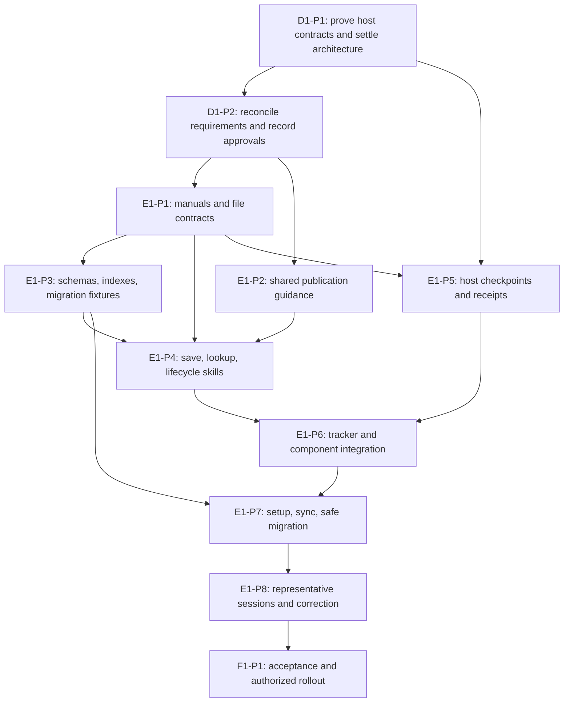

# Knowledge System implementation plan

Updated: 2026-09-18. Proposed execution plan for issue #269. No production implementation has been performed by this planning task, and this document does not supply missing requirements, design, or release approval.

## Authority and execution boundary

- [Knowledge System PRD](../../../knowledge/prds/toolkit-operating-system/knowledge-system.md) owns R1–R30.
- [Master solution design](../269-knowledge-system.md) owns the proposed architecture and decisions.
- [Host capability evidence](host-capability-evidence.md) separates installed observations, official contracts, and H1–H6 proof tasks.
- [Toolkit OS R25](../../../knowledge/prds/toolkit-operating-system/toolkit-operating-system.md#shared-documentation-publication-contract) owns documentation publication.
- [Issue #269](https://github.com/Mar5929/claude-toolkit/issues/269) owns D1 design review, E1 implementation, F1 acceptance, and live task status. The work packages below are task specifications to link from that record, not another tracker.
- [Detailed reference](detailed-solution-design-reference-output.md) preserves prior research. Its old mechanism choices, API claims, and estimates do not authorize implementation.

The owner authorized this design and plan refinement. Record the resulting recommendations for review without fabricating a whole-PRD approval. Begin production changes only when the owning task records the applicable build authorization. Technical facts are resolved through evidence tasks; the owner should not have to choose event names or troubleshoot adapters.

## Recommended build baseline

**Architecture review, 2026-09-18:** Mike requested the best architecture rather than the easiest reuse, accepted the review recommendation, and asked to add it to this plan. The direction below replaces this plan's earlier presumption that six skills and copied runtime should remain. It does not approve the full PRD, runtime implementation, or release. The master design now reflects this direction and the subsequent delegated-save and wording requirements. D1-P2 must reconcile remaining host evidence and approval questions; the earlier six-skill baseline is superseded.

Keep the `second-brain` plugin identity and refactor its public capabilities into four skills:

| Skill | Responsibility |
| --- | --- |
| `knowledge-find` | Find relevant sources, resolve conflicts, and cite evidence. Use available session history as a read-only source adapter when needed, retaining project scope, privacy, and historical-source cautions. |
| `knowledge-save` | Own one shared procedure for create, update, supersede, retire, delete, and consolidation: authority, latest-source reads, linked changes, validation, publication, and interrupted-save recovery. |
| `knowledge-review` | Diagnose duplicates, contradictions, lifecycle issues, and feedback-maintenance needs. Hand resulting changes to the shared save procedure instead of maintaining a second writer. |
| `knowledge-setup` | Detect, install, migrate, repair, and verify activation/version, coordinating delivery with project-init and project-sync. |

Approved saves run through a helper while independent conversation continues,
under the updated R9/R28. The main agent finishes proposal and approval work,
then gives explicit operation, destination, approved meaning, source, permission,
check, commit, and push instructions. The helper uses the same save procedure;
the main agent checks its returned evidence before reporting completion. R15’s
ban on jargon and figurative language applies to both proposal and saved text.

Mike approved combining related saves in one commit on 2026-09-18 when they
are ready together. Preserve separate authorized scope and verified results;
never delay a ready save to collect others. Include both together-ready and
one-save-delayed cases in save/publication acceptance checks.

The reason is correctness as well as clarity. Today `remember` publishes approved changes, while `retire` can create a replacement through `remember`, then change the old record under instructions that prohibit publication. `reflect` delegates across both. One logical lifecycle change needs one complete save procedure. Operation-specific references keep that procedure focused; it is not an autonomous content writer or a new reasoning engine. Existing operational-maintenance permissions remain applicable without inventing new approval steps.

Reuse the parser, index builder, checker, history-search code, command parsing, and installation logic where they meet the new contracts. Inventory actual callers before migrating skill names; provide explicit compatibility routes where needed without assuming native alias support or keeping duplicate procedures. Migration effort determines the delivery sequence, not the finished architecture.

**Hook direction approved by Mike, 2026-09-18:** start with ordinary command
hooks and keep shared logic separate from the Claude Code and Codex integrations.
Function hooks/Claude Mods may replace the Claude integration if testing proves
a benefit. This decision does not waive host proofs or grant full design/build
approval. See the [comparison](../269-knowledge-system.md#hook-comparison-and-recommendation--2026-09-18).

Keep startup, prompt, completion, and scoped action checks as separate responsibilities with thin host adapters and shared temporary state. They need not each become a new script. Use ordinary command hooks where proven, retain ordered explicit startup reads and the selected every-prompt reminder, and include the quiet completion review approved by Mike on 2026-09-18 for findings made during work; independent save helpers must not delay the main conversation. Never use changed-file counts to decide whether conversation-only work deserves review. Checkpoints neither classify meaning nor approve saves.

Prove the smallest adequate startup transport before choosing its implementation. First test native reads and observable result delivery on each host. Add a bounded manifest reader, content digests, or range receipts only where needed to establish complete, current, model-visible delivery. A process receipt proves only a process read; acknowledgment is a separate declaration, not understanding or semantic permission. If neither native observation nor a helper establishes delivery, declaration-only operation fails strict R2/full acceptance. Do not revive full-file startup printing or infer compliance from arbitrary shell output or assistant prose.

Select copied project runtime versus plugin-managed runtime by fresh-session activation, version consistency, trust, update, recovery, and rollback evidence on each supported host. Neither packaging option wins by default. Keep one canonical source and preserve owner-specific configuration under either option; D1-P1 selects the contract and E1-P7 implements it.

Keep feedback in the existing `knowledge/memory-self-improvement.md`, with concise Lessons and Recent decisions, because R23 leaves its location to design. Remove the unrelated fixed 8,000-character failure threshold; preserve useful feedback without inventing new R21 size limits. The PRD's proposed layout for memory, current work, glossary, PRD index, and brainstorms remains the planning target, subject to the recorded requirements and build authority.

Keep deterministic checks separate from behavioral acceptance. A valid file, receipt, or successful hook test never demonstrates that the correct memory was selected or that a permission covered its meaning.

## Verified repository starting points

Paths below are repository-relative. “Change” means planned, not already implemented. Inspect the latest files again before executing a package because other toolkit work continues.

| Area | Existing source and actual gap | Planned treatment |
| --- | --- | --- |
| Startup | `plugins/second-brain/hooks/knowledge-session-start.mjs` prints full startup files in the old order, then index entries; failures allow continuation. | Preserve System Guide isolation; replace full printing with compact ordered-read/recovery request and evidence-aware acknowledgment. |
| Prompt | `plugins/second-brain/hooks/memory-reminder.mjs` exists, but has old memory criteria, forced manual reopening, and no explicit intent receipt. | Rewrite message from the canonical manual/contract; cover every destination, positive/negative criteria, actual relative paths, and intent. |
| Action reminders | `plugins/second-brain/hooks/save-reminder.mjs`, `work-item-close.mjs`, and `command-parsing.mjs` already detect supported PR/close commands and issue one-time holds. | Reuse parser and known command coverage; replace branch/once-only adequacy assumptions with current work review outcome; merge/close alone never establishes shipping. |
| Completion and receipts | No dedicated knowledge completion handler or shared receipt helper in this plugin. The separate style handshake demonstrates narrow read observation. | Use candidate completion/checkpoint modules, with read transport selected by D1-P1 rather than fixed in advance. Borrow tested patterns from `plugins/hooks-library/hooks/style-handshake.mjs` without copying its policy or assuming its Claude read observation covers Codex. |
| Save/find/lifecycle | Existing six skills contain old paths and incompatible rules: `remember` requires full manual reread, rejects pending queuing, uses an older card, and ties finalized PRDs to delivery; `retire` supports replacement, retirement, and deletion but forbids publication; `reflect` treats built proposed PRDs as a defect. | Replace the six entry points with four skills and operation-specific references; migrate the proposal template and history-search adapter. All lifecycle writes share one save/publication procedure. |
| Files/templates | `plugins/second-brain/skills/second-brain/references/templates/` supplies SOUL, manual, project, current, feedback, and two indexes. | Move templates into `knowledge-setup/references/templates/`, repair callers, and adopt the new record layout; add inbox, glossary, and topic/PRD authoring examples. Keep content guidance in references loaded when needed. |
| Index/checker | `plugins/second-brain/tools/{build-knowledge-index,check-knowledge,frontmatter}.mjs` are reusable. Builder emits two old indexes; checker uses old required fields and 250/2,000/8,000 limits. | Extend to three grouped indexes, new metadata/layout, summary under 200 and current under 5,000, glossary exception, and read-only errors. Preserve a single parser. |
| Setup/sync | `plugins/second-brain/skills/second-brain/SKILL.md`, `plugins/project-init/skills/project-init/` and `plugins/project-init/skills/project-sync/SKILL.md` describe old copies, layout, and Codex startup-only wiring. | Update one coherent delivery contract, migration, actual activation/version checks, and supported host reports. |
| Publication | `plugins/project-init/library/rules/general/knowledge-direct-commit.md` is shipped knowledge-only guidance; parent R25 now defines broader documentation eligibility. | Extend this canonical rule and its catalog in place. File content, not extension or folder alone, determines the route; do not build a semantic classifier. |
| Tracker/handoff | `plugins/project-init/library/rules/general/work-item-stages.md`, `plugins/session-skills/skills/{work-guide,handoff,solution-design,spec-check,requirements-helper}/SKILL.md`, and `plugins/work-tracker/skills/work/` already own tasks, approvals, and continuation. | Integrate knowledge outcome and source links; retain existing tracker ownership and CLI. No second planning store. |
| Tests/install records | `tests/{knowledge-startup-check,installed-copy-check,link-check,orphan-check}.mjs`, System Guide tests, `.claude/settings.json`, `.codex/hooks.json`, `.claude/toolkit-sync.md`. | Revise obsolete startup expectations, add focused behavior fixtures, update installed copies through delivery, and preserve unrelated hooks/settings. |

## Task and dependency map

These IDs are proposed subtasks under the existing roadmap tasks. They do not create native GitHub subissues or imply status changes. The main conversation maintains the canonical issue and records approvals; each assigned builder owns only its package, and an independent reviewer verifies its exit evidence.

E1-P3 and E1-P5 can run in separate implementation worktrees after their contracts are agreed. E1-P4 procedure drafting can begin alongside them, but its integrated save acceptance depends on E1-P3's completed tools. Serialize edits to shared templates, manifests, and installed copies. Do not enable half the new layout in this repository while old runtime/checker expectations still own it.

## D1-P1: prove host contracts before selecting enforcement

**Owner:** host-adapter builder; independent reviewer checks evidence. **Dependencies:** current official documentation and installed host versions. **Requirements:** R2–3,9,25–27,29–30.

Use disposable equipped test projects, not production records. Record the source date and tested version. Current local version discovery found Claude Code 2.1.259 and Codex 0.154.0; documentation alone does not prove these binaries implement newer features.

Test CLI and desktop execution separately where both are supported. Record the effective runtime version, active configuration layers, and trust/permission state for each; the CLI version on PATH does not establish the desktop bundled version. Claude Mods remain a possible later adapter, not a baseline dependency or an experimental flag enabled by this plan.

Prove ordered file reading, readable-content observation where available, explicit startup and prompt acknowledgment, one bounded completion continuation, supported action denial, missing/truncated content, stale receipts, helper isolation, disabled/untrusted hooks, timeouts, and Windows command quoting. Test compaction/resume/clear as separate cases. Record unavailable events instead of inventing substitutes that silently change requirements.

Prove H1–H6 in the linked host evidence, first comparing native read observation with a bounded helper only where needed. Reconcile the evidence document’s helper-specific H2 recipe with the selected transport. Establish ordered, complete, current delivery and a separate acknowledgment; use digests/ranges only where the chosen mechanism needs them. Changed guidance invalidates the affected completed read. Prove whether truncation occurs before or after PostToolUse and whether desktop/code-mode wrappers preserve model-visible output. Do not match arbitrary shell output as if it were a complete read. Startup returns its instruction before the agent can act; waiting inside that hook for the same agent's acknowledgment would deadlock.

Before-final-answer continuation runs at most once when review is outstanding; another stop without a valid outcome reports an unfinished checkpoint instead of looping. New user input establishes a new review generation, not a new startup-read generation. Required guidance revision or context recovery invalidates the affected startup scope; ordinary prompts do not force rereading unchanged available manuals. A pending proposal or recoverably delegated save is a valid review outcome and must not hold the conversation open. The save itself remains unfinished until publication is verified.

Prove delegated save execution separately from read/checkpoint helpers. Test
whether a native helper can continue while the main agent answers a new prompt,
return its result after the main turn ends, and recover when either session stops.
Cover late results, conflicting later instructions, duplicate retry, concurrent
publication, and unavailable parallel execution. Report unsupported behavior;
a spawned helper alone is not proof of an independent completed save.

Compare copied and plugin-managed runtime in disposable projects: prove initial activation, actual running version, update propagation, project opt-in/trust, path resolution on Windows, recovery after missing files, and rollback without duplicate registrations. Choose packaging from those results; source installation alone is not activation evidence.

**Deliverable/exit:** a host capability matrix with source evidence and observed results; selected read/acknowledgment and packaging contracts, plus a covered action list. Claude startup events cannot hold session creation, and fail-open tool hooks are not universal protection. Codex hosted/specialized tools and continued terminal input may bypass tool hooks. A missing proof blocks the claim of enforcement and the dependent production feature, not unrelated design tasks.

**Risk/rollback:** prototypes can give false confidence if only hook stdout is tested. Exercise actual sessions; discard only disposable fixtures and restore their hook configuration. No requirement is weakened to make a prototype pass.

## D1-P2: reconcile the design and genuine owner decisions

**Owner:** design lead/main conversation. **Dependencies:** D1-P1. **Requirements:** all 30; parent R25.

The master and this plan now share the four-capability architecture and delegated-save requirements. Reconcile remaining host evidence and approval questions while preserving accepted startup reads, prompt behavior, and judgment boundaries. Compare alternatives by complete saves, clear discovery, recovery, concurrency, host parity, measured context cost, and maintainability. Record which existing internals satisfy those contracts and which need replacement. Keep D1’s approval and current position in issue #269.

Locate the actual project skill-authoring procedure and its approval owner for R17 before implementing the handoff. If none exists, record R17's integration dependency and obtain scope for that capability separately; a routing sentence alone does not supply a working authoring process.

The quiet completion-review behavior is approved by Mike as of 2026-09-18. Prove the bounded handler in D1-P1; exact mechanism selection and production activation still require design/build authority. A prompt-only adapter cannot be claimed to satisfy the end-turn review outcome merely because the reminder ran.

Recommend no new Git pre-commit hook in the initial release: explicit checks and covered agent write safeguards meet the intended save sequence without changing Mike's manual-edit workflow or replacing unrelated Git hooks. Broader manual-edit blocking would be a separate owner policy decision supported by a demonstrated failure.

Mike settled automatic-save metadata on 2026-09-18: record the grant's person,
date, scope, and source once in project permission settings. Mark each affected
memory as auto-saved; do not duplicate grant details into individual approval
fields. R10/R14 own this behavior. Automatic saving remains opt-in; this design
decision does not enable it.

Use R3's affected-work pause for failed saves. The tracker must not claim a dependent deliverable complete; unrelated tasks can continue. Existing accepted completion rules remain with the tracker. Do not impose a global session lock.

**Deliverable/exit:** one coherent design, explicit unresolved material policy decisions with recommendations, separate requirements/design/build authority recorded before E1 production execution. Technical uncertainty is not sent to the owner as a choice of APIs.

**Risk/rollback:** changing architecture must not erase accepted meaning; preserve the reference and decision provenance. Unaccepted proposals remain proposed.

## E1-P1: manuals, templates, and record contracts

**Owner:** knowledge guidance builder. **Dependencies:** D1-P2; Toolkit operating-manual owner under issue #306. **Requirements:** R1–2,7,10–18,20,23,28–30.

The canonical knowledge manual is `knowledge/knowledge-manual.md`; preserve its marker and reconcile its policy against the approved requirements. The earlier `knowledge/README.md` rename is already delivered; a path migration alone does not update instruction meaning. Coordinate `knowledge/toolkit-manual.md`, reported by the #306 coordinating task as Mike’s selected path. It covers high-level philosophy, project structure, end-to-end workflows, and subsystem cooperation; detailed knowledge procedures stay in the knowledge manual. The manual owner supplies content and the project-init/project-sync delivery contract. Verify delivery before embedding the path in a shipped hook. Do not create a competing manual inside the Knowledge System or ship a placeholder link.

Migrate the managed manual and project/SOUL/current/feedback templates from `plugins/second-brain/skills/second-brain/references/templates/` to `plugins/second-brain/skills/knowledge-setup/references/templates/`, updating template consumers together. Add `knowledge/memory-inbox.md`, `knowledge/memory/memory-entries/terminology-glossary.md`, and concise memory/PRD examples in that template/reference family. Move template current work to `knowledge/memory/current.md`, rename the PRD index template to `prd-index.md`, and put brainstorms at project root. Retain the existing feedback filename. The System Guide owner supplies its actual enabled path; do not silently migrate or enable it.

Use the PRD's exact card fields and working-memory structure. Inbox entries carry stable reference, destination/operation, exact shown card or precise authorized upkeep owed, source/date, host/conversation identity, update time, state, next step, and separate durable authority. Identity for deduplication is operational; pending text never becomes evidence. Capture source/context separately in memory; do not infer missing provenance to satisfy metadata.

**Deliverable/exit:** coherent templates and small root/manual routing contract, with valid empty and populated examples. Tests cover glossary without frontmatter, proposed PRD without approval, approved PRD with paired fields, exact pending card, active work from two sessions, and style/source preservation. No arbitrary record-length cap beyond R21.

### Memory self-improvement task

Task D2 in the [design Notes](../269-knowledge-system.md#task-d2--make-memory-self-improvement-instructions-clear-and-current)
records Mike's requested review of the feedback file, installed template,
reading/update triggers, cleanup, and unsupported 8,000-character cap. E1-P1
owns instruction/template wording; E1-P4 owns use and cleanup behavior; E1-P7
owns safe migration of existing project feedback and matching checker guidance;
E1-P8 proves new and upgraded projects behave correctly. Treat this as required
content work, not just a reminder or a filename migration. No implementation is
claimed by adding the task.

### Required instruction-content audit

Mike explicitly requested this audit on 2026-09-18. Delivery of a reminder or a
manual is insufficient: the instructions the agent receives must match the
approved requirements. This is implementation scope and an acceptance condition,
not a claim that the existing manual already matches the proposed system.

Before changing instructions, extend this plan's requirement coverage with a
row for every R1–R30 requirement: approved behavior, canonical instruction source
and section, consuming instructions or references, required wording changes,
installed destination, owner, and evidence. Mark a requirement with no instruction
change as reviewed with a reason. Do not infer coverage from filenames or a
successful copy/hash check. Keep this record here rather than create a separate
notes or audit file.

Apply the owner's 2026-09-18 language requirement throughout: no jargon or
figurative language; explicit conditions, actions, permissions, checks, and
failure handling. Explain necessary exact technical names. Review meaning,
not just forbidden words or length. Remove repetition without losing detail.
Implement the core-manual/task-specific arrangement approved by Mike on
2026-09-18, after full design/build authorization, using the four
existing planned skills and their references. Preserve all R2 startup topics;
exact content requires the audit below before implementation. Test that each task loads
its necessary detail, including after context recovery, without loading every
procedure for every session.

Review the complete text of each applicable surface, including examples and
negative instructions, not only search matches:

| Surface | Required review |
| --- | --- |
| Knowledge and toolkit manuals | Routing, source authority, startup/recovery, permission, pending saves, plain language, file shapes, lifecycle, feedback, component boundaries; keep detailed policy in its owning manual. |
| Root instructions and installed rules | CLAUDE/AGENTS routes, work stages, documentation saves, manual upkeep, handoff and output style; remove conflicting instructions while preserving unrelated owner rules. |
| Four skills, helper assignments, and operation references | Lookup, selection, proposals, approval, automatic saves, every lifecycle operation, validation, commit/push, recovery, and quiet completion. Retired skill names must route correctly or be removed from active callers. |
| Templates, sample records, and proposal cards | Exact current fields and examples, automatic-save marker versus individual approval, pending approval versus finished saves, Notes ownership, glossary and topic layout. |
| Hook-generated instructions and checker messages | Actual emitted wording agrees with the manual; no old approval or reread rules reintroduced by a reminder, error message, or recovery instruction. |
| Setup, sync, migration, manifests, and catalogs | A new project receives coherent content; an existing project receives the same policy through safe migration. Verify active loaded versions and installed copies, not just repository source. |
| Other component entry points | Work tracking, requirements/design helpers, handoff, System Guide and skill-authoring routes preserve their owners and current permissions. Reconcile the separately approved Notes workflow when integrated. |

Known source gaps verified on 2026-09-18 include the manual's old startup order,
layout and six-skill map; blanket memory approval fields; `remember` forbidding
pending queuing; `retire` forbidding commit/push; and missing explicit coverage
of the newly approved automatic-save and helper workflow. These describe the
current implementation, not permission to edit live instructions during design.
The Notes workflow has since merged at c77082e; reconcile against that source
while distinguishing repository delivery from project refresh.

Acceptance requires an independent meaning review against every requirement,
plus fresh-agent scenarios in both a newly equipped project and an upgraded
project on each supported host. Include saving after approval, saving with
per-save approval disabled, retirement, interrupted helper recovery, quiet
completion, no-jargon proposals and saved text, and PRD/design continuation.
Seed obsolete instructions to verify migration detects or reconciles them;
preserve owner customizations and report unresolved conflicts. Check that the
agent acts on current content without coaching from this conversation. Record
static content/copy checks separately from observed behavior. Any contradictory
active instruction or untested scenario remains an explicit release gap.

**Risk/rollback:** manual rules and skill templates can drift. Keep shared meaning in the manual and operation details in linked references; revert template/runtime package together before activation, preserving owner-authored records.

## E1-P2: reusable documentation publication

**Delivery update, 2026-09-18:** The shared rule, setup/sync routes, installed
copies, and catalogs shipped separately in [PR 353](https://github.com/Mar5929/claude-toolkit/pull/353)
(project-init 0.73.0; marketplace 0.117.0). Reuse that guidance for this package.
Knowledge-specific save integration and fresh-host acceptance remain to be
validated during the Knowledge System build; this release does not complete
those dependent packages.

**Owner:** project-init builder. **Dependencies:** D1-P2. **Requirements:** R3,9–10,13,16,28,30; parent R18,R25.

Extend `plugins/project-init/library/rules/general/knowledge-direct-commit.md`, its `README.md` catalog, `project-init/skills/project-init/references/{thin-claudemd,root-file-examples,setup-flow}.md`, and project-sync guidance. Root maps identify eligible documentation homes and route to the full policy. Keep the existing rule filename initially to avoid breaking installed references.

The workflow uses the existing default-branch checkout, verifies identity/remote/staged work, fetches safely, rereads the destination, checks the exact authorized change, stages only owned paths, commits, pushes, and verifies remote inclusion. Serialize the shared index/commit step. A Markdown skill or rule changing installed behavior is implementation, not a documentation exception. Independent documentation can publish separately; inseparable mixed changes stay in the implementation PR.

**Deliverable/exit:** reusable source, installed rule copy, routes, and guidance agree. Scenarios cover documentation from a worktree, behavioral Markdown, mixed edits, unrelated staged files, parallel changes, failed validation, rejected push, explicit publication hold, and an already-published retry. No force-push, account switching, autostash, or silent PR fallback.

**Risk/rollback:** broad file globs can bypass review. The agent judges eligibility and tools verify Git facts; do not implement a classifier. Reverting guidance preserves published records and reports any unfinished save through its owning record.

## E1-P3: schemas, indexes, and read-only validation

**Owner:** knowledge tools builder. **Dependencies:** E1-P1. **Requirements:** R7–8,12–16,21–23,28–29.

Extend the three existing tools under `plugins/second-brain/tools/`. Build memory, PRD, and external-source indexes from canonical metadata, with summaries copied exactly. Recommend ordinal sorting by normalized group then project-relative path for stable output across hosts; preserve parent-before-child PRD nesting and topic grouping. Exclude glossary, inbox, working state, and feedback from lasting indexes. External-topic entries use outside-source fields, not memory approval fields.

Update required fields, real dates, allowed statuses, links, nested topics, paired PRD approval, memory context, and the two limits: summary under 200 characters and current work under 5,000. Remove the old 250/2,000 limits and feedback cap. Keep the checker read-only. Retain a managed-manual integrity check tied to the installed release/template, not a second policy copy; regenerate any existing checksum with its template in the same change. Secret-pattern checks are useful but explicitly non-exhaustive.

**Deliverable/exit:** focused `plugins/second-brain/tests/knowledge-records.test.mjs` fixtures for valid/invalid metadata, YAML quoting/lists, dates, glossary exception, nested topics, external sources, status labels, missing fields, links, deterministic rebuilds, and safe synthetic secret patterns. Reading the result and judging meaning remain agent responsibilities.

**Risk/rollback:** current parser supports a small YAML subset. Exercise every allowed field representation; extend its shared parser or use one proven YAML parser only if fixtures establish a need. Do not maintain two parsers or silently reinterpret unsupported YAML. Keep failed conversion inputs intact.

## E1-P4: lookup, saving, lifecycle, and recovery procedures

**Owner:** knowledge workflow builder. **Dependencies:** E1-P1–P3. **Requirements:** R3–24,28–30.

Build the four skills and migrate the proposal reference. `knowledge-find` applies relevance once per unchanged request, reuses current evidence, consults glossary before relevant searches, opens actual sources, and uses available history last. Its session-history adapter retains the existing script and read-only project scope; an unavailable Codex history source is reported, never called an empty result or silently replaced with another project's history.

`knowledge-save` evaluates memory and other destinations, separates routine quiet review from explicit review requests, preserves new pending proposals, honors existing scope, reads back actual writes, runs checks/indexing, publishes through E1-P2, and removes only verified completed or rejected inbox entries. A real significant fix may qualify under R11 even when first solved by the agent; routine activity does not. No mandatory full manual reread every turn. Read relevant current guidance before the operation.

Implement the main-agent/helper split in the shared save procedure. The main
agent keeps the authorized assignment in the inbox before delegation. Specify
create/update/supersede/retire/consolidate/delete, exact destination files,
approved meaning and required verbatim text, evidence and permission, applicable
instructions, required checks, and commit/push. The helper reads latest content,
applies only that scope, checks and publishes, and returns paths/checks/commit/
remote evidence or the unfinished step. Main verifies the result; do not wait
for publication before answering an independent question. Preserve existing
permissions, prevent two workers from applying the same save, and check whether
the original worker is still running before recovery.

Review proposal language before approval and actual saved language afterward.
Memory/proposal prose must contain no jargon, figures of speech, figurative
language, metaphors, or idioms. Preserve approved meaning and required exact
names; resolve conflicting verbatim instructions before approval. Keep this a
writing review rather than a claim that keyword scanning proves compliance.

Assign an opaque stable operation reference when a real pending proposal or authorized unfinished save is first captured, retaining it through revised cards and conflict transitions. Before each inbox or destination edit, reread both relevant records, compare the operation reference and intended scoped change, and detect whether the change already landed. Similar meaning from concurrent proposals requires agent reconciliation, not a hash-based semantic merger. Serialize shared publication; do not erase another entry while resolving this one. Test two sessions approving/retrying the same operation, simultaneous distinct entries, destination drift, blocked-by-conflict with authority intact, rejection, and removal only after verified completion.

`knowledge-review` produces findings and proposed change sets; `knowledge-save` applies authorized lifecycle and operational-maintenance changes through the same save/publication path. Preserve existing exceptions for operational feedback and generated indexes; do not require new meaning approval for already-authorized maintenance. Supersede changed meaning in its owning topic; create a new file only for a justified topic change or approved split. Consolidation verifies preservation and links before removing originals. Feedback records actual owner criteria/reason, not guessed preferences or a running activity log. Never finalize a PRD merely because code shipped.

**Deliverable/exit:** conversation-only routing, known fact citation, partial approval, silence, correction, explicit verbatim request, approved retry, topic split/merge, manual rename/deletion recovery, feedback carryover, and no-result review scenarios pass. Verify each plain-language intent selects the appropriate capability, review does not independently apply lifecycle changes, and every lifecycle operation finishes or remains recoverably pending through the same save procedure. Verify cards render as Markdown under destination headings and unique numbers. Check output style and source-supported meaning, not only file validity.

**Risk/rollback:** procedure changes can accidentally broaden permission. Preserve exact authority and scope through conflicts; pause only dependent writes. Roll back skill version if needed while retaining pending entries and actual published outcomes.

## E1-P5: startup, prompt, completion, and scoped action checks

**Owner:** host-adapter builder. **Dependencies:** D1-P1, E1-P1; E1-P4 before behavior acceptance. **Requirements:** R2–3,9–10,25–29.

Refactor existing hooks around startup orientation, prompt review, completion review, and scoped action checks, using thin host adapters. `knowledge-completion.mjs` and `knowledge-checkpoint.mjs` are candidate modules, not a fixed file count. Keep read transport separate from save/publication procedures; implement only the native observation or helper transport proven in D1-P1. Temporary state has project/host/session/agent identity, separate startup and review generations, acknowledgment kind/outcome, instruction revision, and retry state; add delivered-content evidence such as digests/ranges only as required by that transport. It contains no lasting content, permission, transcript, search results, or shadow inbox. Use serialized compare-before-update of the current generation plus atomic replacement; atomic writes alone do not stop a late hook replacing newer state. Test delayed read/Stop events after a new prompt and concurrently completing handlers. Cleanup must not delete active sessions based only on age.

Startup instructs reads of SOUL, project, then `knowledge/knowledge-manual.md`; discovers current work, inbox, glossary, and index paths. It withholds successful acknowledgment when required content is unavailable. Prompt delivers canonical compact criteria and intent acknowledgment once per user message. The completion event catches new findings from execution and distinguishes no changes, completed saves, pending proposals, and unfinished saves, including helpers still running. Do not force the main turn to wait for an independent save or trigger repeated reviews from helper messages; a routine no-change stays invisible to the owner. Explicit save requests still receive a result.

Use supported pre-action paths only for narrow objective holds. Receipt presence cannot authorize a lasting write. Before a consequential write, the agent checks the applicable durable authority and latest file; objective checks confirm valid target and required record fields. Reuse existing supported command detection for PR/work handover. Do not require arbitrary shell, connector, or helper actions to pass a universal interceptor the host does not provide. Add a new write guard only if D1-P1 identifies a specific objective prerequisite and demonstrated coverage; do not equate a prior skill invocation with approval.

**Deliverable/exit:** `plugins/second-brain/tests/knowledge-checkpoints.test.mjs` covers stale/wrong-session receipts, missing files/state, changed manual, prompt deduplication, bounded Stop, pending valid outcome, helper isolation, timeouts, command variants, and bypass limits. Revised `tests/knowledge-startup-check.mjs` checks actual new contract rather than old full-print order. Fresh native sessions on both hosts provide separate behavior evidence.

**Risk/rollback:** false gating, infinite continuation, and unsupported host events. Keep the prior working registration available, disable only the failing knowledge adapter on a proven defect, report degraded coverage, and retain project data. No unsupported universal enforcement claim.

## E1-P6: toolkit and work-item integration

**Planned dependency, 2026-09-18:** the work-tracker task reports Mike's selected
local format as one `WORK-ITEM.md` for overview/status, tasks, questions,
decisions/history, and requirements, plus separate `DESIGN.md`. Its top-level
sections are Overview, Roadmap, Tasks, Recent History, and Requirements. Roadmap
holds phases/milestones, outcomes, status, and task/child-item links; execution
detail stays in Tasks. Coordinate the
requirements/Notes routing with that owner; do not assume separate TASKS.yaml,
STATUS.md, or REQUIREMENTS.md remain authoritative after migration. The storage
change is not shipped and does not authorize migration here. External trackers
retain their own records. An existing shared feature PRD must not be copied into
a competing local requirements authority; resolve ownership during integration.

**Owner:** integration builder. **Dependencies:** E1-P4–P5. **Requirements:** R3–4,9,16–19,24,28,30.

Update handoff, work-guide, solution-design, spec-check, requirements-helper, and lifecycle guidance only where they must pass owning scope, delivery evidence, and continuation to knowledge. `plugins/work-tracker/skills/work/scripts/{work.mjs,lib/tracker.mjs,lib/common.mjs}` are existing objective tracker mechanisms; do not change them unless the integration test exposes an actual missing interface. Use existing task fields, approvals, completion records, and chosen tracker APIs.

The tracker owns status and acceptance. Knowledge reports its outcome and dependent failure. Merge/close prompts a check of actual delivered behavior before automatic PRD upkeep. A cancelled or merged-but-undelivered item does not silently finalize or rewrite a PRD. A simple question creates no work item. System Guide and client architecture follow their own configured owner/workflow; Acme remains Guide-off with `delivery/architecture/`.

**Deliverable/exit:** a tracked change, a question without a task, a cancelled item, cross-component requirements, a procedure handoff, a Guide-on project, and Acme Guide-off all keep one owner per record. Existing work-tracker and System Guide tests remain passing. Required manual paths are real and project-relative before release.

**Risk/rollback:** knowledge can become a second tracker or invoke unrelated work. Use references and destination return outcomes; restore changed integration instructions together while preserving true tracker state.

## E1-P7: activation, migration, packaging, and installed copies

**Owner:** setup/delivery builder. **Dependencies:** E1-P1–P6. **Requirements:** R1–3,7–8,13–14,16,21,25–28,30.

Implement `knowledge-setup`, update project-init setup-flow, project-sync, root-route references, plugin READMEs, `docs/toolkit-map.md`, top-level README, both plugin manifests for each changed plugin, and marketplace version metadata. Keep the plugin name. Apply the D1-P1 packaging decision to runtime paths, applicable installed rules, `.claude/settings.json`, `.codex/hooks.json`, root router blocks, and `.claude/toolkit-sync.md`. For copied runtime, refresh copies from canonical source; for plugin-managed runtime, verify resolution/update/rollback before removing obsolete copies and registrations.

| Existing record or entry point | Target/action |
| --- | --- |
| Six existing skill names | Migrate callers, catalogs, manifests, templates, and tests to four skills. Route legacy requests where needed using supported mechanisms; remove duplicate procedures only after discovery tests pass. |
| `knowledge/current.md` | Move to `knowledge/memory/current.md`; preserve all active items and repair routes. |
| Flat lasting files under `knowledge/memory/` | Move into `knowledge/memory/memory-entries/`, preserving approved content/provenance; coherent topic splits need their own authority. |
| `knowledge/prds/spec-index.md` | Rebuild as `knowledge/prds/prd-index.md`; repair references and remove obsolete generated file after checks. |
| `knowledge/brainstorms/` | Move to root `brainstorms/`, preserve unchecked status and links. |
| Feedback file | Retain current path and useful content; remove obsolete cap from behavior, not useful lessons. |
| `knowledge/README.md` managed manual | Rename to `knowledge/knowledge-manual.md`, preserving contents and customizations; repair callers together. Keep unrelated README content and stop for conflicting manuals. |
| Inbox/glossary/external index | Create missing structures only; reconcile existing content instead of overwriting. |
| Existing System Guide path/config | Preserve ownership and actual configured location; coordinate any separately authorized migration with that plugin. |

Inventory files/permissions first. Work in reversible batches, retain an old-to-new map and baseline commit, and leave an ambiguous conversion untouched. Add required group/context/update fields only from available evidence; missing approval/source is a named migration issue, never invented metadata. Already-approved layout conversion follows R10's conversion permission and owner review afterward; this is not permission to change meaning or migrate another project silently.

**Deliverable/exit:** new, already-equipped, partially installed, mixed/unknown, Guide-only, and owner-modified projects are classified correctly. New setup is one approved operation with version, all required parts, checks, actual host activation, and named limitations. Install into this repository only after fixture proof; external projects require their own authorization. Run all four repository checks, plugin validation, and relevant integration tests. Old/new registrations never run twice.

**Risk/rollback:** layout and runtime can become inconsistent. Revert the package/registration and restore path mapping together, preserve new authorized content and permission, then rebuild old-compatible indexes. Never reset a shared checkout or discard post-migration owner edits. Recommend this repository as first trial; DragonFly is not implicitly authorized.

## E1-P8: representative sessions and correction loop

**Owner:** independent acceptance reviewer; builders repair failures. **Dependencies:** E1-P7. **Requirements:** all 30.

Run fresh session, long/compacted conversation, task switch, parallel sessions, and component-enabled/disabled scenarios on both hosts. Include a helper that is deliberately slow, a failed push after the main turn ends, parent/helper interruption, explicit create/update/delete assignments, and conflicting later instructions. Verify the main conversation continues and the result is checked before success. Seed known facts, shorthand, current-versus-required conflicts, no-code conversation decisions, unapproved and approved unfinished saves, low-value details, a missing source, concurrent edits, rejected push, handoff, and deliberate owner file edits. Use the master’s concrete acceptance scenarios and every PRD Check, including significant episodes and authorized interviews. Extract still-relevant failure cases from the detailed reference into named tests with requirement, fixture, expected outcome, host/version, observed result, and evidence location. Include truncated reads, helper isolation, stale/late events, manual and automatic compaction, Windows command matching, permission modes, hook bypass/timeouts, concurrent saves, and shallow/detached/no-commit repository cases where supported action detection depends on them. Record why an obsolete mechanism-specific case no longer applies rather than dropping it silently.

Measure hook text, file-read content, tool turns, and observed token usage separately. Enforce no invented numeric budget; investigate duplicate rereads, repeated cards, missing/truncated guidance, false holds, or unnecessary broad scans. Keep small instructions and load relevant detail on demand without dropping required content to fit a target.

**Deliverable/exit:** requirements-to-evidence matrix records expected result, actual source/record changes, host/version, limitations, and pass/fail. A missed obligation remains a failure even if a receipt exists. Repair and rerun affected scenarios; do not rerun unrelated expensive sessions without a reason. Independent review checks permission and meaning, not only script outputs.

**Risk/rollback:** static tests can mask poor agent behavior. Release remains blocked on material failed outcomes; document residual host gaps plainly rather than treating disclosure as compliance.

## F1-P1: acceptance and authorized rollout

**Owner:** main conversation/release owner; Mike supplies applicable acceptance. **Dependencies:** E1-P8 and explicit release/target authority. **Requirements:** R3,16,25–27,30.

Present concrete delivered behavior, remaining gaps, checks, and rollback. Record acceptance through the existing tracker. Merge approved implementation through its normal workflow; refresh marketplace/cache and run project-sync separately. Verify actual installed version, activation, and fresh-session behavior in each authorized target. A source merge is not rollout evidence.

Update only the PRDs affected by authorized actually shipped behavior, under existing upkeep authority. Preserve explicit publication holds and unresolved deviations. Keep the reference/history; retire the active design according to the project lifecycle only after its useful settled behavior and references are owned elsewhere. Do not delete planning records prematurely.

**Deliverable/exit:** accepted result and per-target adoption evidence in the tracker, current requirements/operating guidance, no unresolved approved save hidden in a session. Unsupported or untested targets are named. Roll back runtime independently of owner knowledge and preserve all durable pending permissions.

## Requirement-to-package traceability

Every row needs objective or behavioral evidence appropriate to its claim. Package completion does not finalize a requirement automatically.

| R | Primary packages | Required evidence |
| --- | --- | --- |
| 1 Plain parts | E1-P1 templates, E1-P3 tools, E1-P7 setup | Editable Markdown/Git; no secondary store; owner rename/deletion recovery. |
| 2 Follow system | D1-P1, E1-P1/P5/P7 | Ordered startup reads, honest acknowledgment, recovered guidance. |
| 3 Reliability | E1-P4/P5/P8 | Required moments without owner reminders; affected-work failure and recovery. |
| 4 Continuation | E1-P1/P4/P6/P8 | New session resumes shared work and pending saves correctly. |
| 5 Memory first | E1-P4/P8 | Relevant source used; irrelevant lookup skipped without repeated tool-by-tool decisions. |
| 6 Sources | E1-P4/P8 | Finding followed by correct file/session/capture source and required date. |
| 7 Vocabulary | E1-P1/P3/P4/P8 | Glossary table, direct route, aliases/cautions, no memory-index entry. |
| 8 Outside docs | E1-P3/P4/P8 | Grouped source index, capture metadata, relevant current vendor evidence. |
| 9 Saving | D1-P1, E1-P2/P4/P5/P8 | Prompt reminder, required reviews, explicit approved helper assignment, conversation continues, verified publication and returned result. |
| 10 Permission | D1-P2, E1-P1/P4/P5/P8 | Scope, silence, partial approval, ongoing authority, approval toggle, recovery. |
| 11 Eligibility | E1-P4/P8 | Project significance, owner involvement/real-fix exception, significant episode. |
| 12 Exclusions | E1-P3/P4/P8 | No noise/secrets as memory; valid other destinations retained. |
| 13 Working memory | E1-P1/P3/P4/P8 | Exact structure, under 5,000 characters, concurrent items and shared availability. |
| 14 Memory shape | E1-P1/P3/P4/P7 | Topic maintenance, required fields/context, justified splits, provenance. |
| 15 Writing | E1-P1/P4/P8 | Proposal and saved text reviewed for no jargon or figurative language; approved meaning and required exact names preserved. |
| 16 PRDs | E1-P1/P3/P4/P6/P8 | Approval distinct from delivery; proper parent/child owner; shipped upkeep. |
| 17 Procedures | E1-P4/P6/P8 | Existing skill-authoring destination and permissions, no procedure memory. |
| 18 Routing | E1-P1/P4/P6/P8 | Kind/scope/owner, mixed meaning, partial permission, no duplicate authority. |
| 19 Find order | E1-P4/P8 | Native investigation, current evidence, glossary, relevant history and clear gaps. |
| 20 Cards | E1-P1/P4/P8 | Destination headings, unique numbers, Change/Summary/Your decision, uncertainty resolved. |
| 21 Index/checker | E1-P3/P7/P8 | Three deterministic indexes, limits, read-back, failure remains unfinished. |
| 22 Lifecycle | E1-P4/P8 | In-place changed truth, useful history, approved consolidation and repaired links. |
| 23 Feedback | E1-P1/P4/P8 | Defaults plus sourced project feedback; no invented reasons or policy override. |
| 24 Plain requests | E1-P4/P6/P8 | Each outcome reachable without command vocabulary. |
| 25 Codex | D1-P1, E1-P5/P7/P8 | Same shared records and behavioral tests; explicit capability/coverage gaps. |
| 26 Documented use | D1-P1, E1-P5/P7 | Current source/installed-version mapping and observed adapter proof. |
| 27 Activation | E1-P7, F1-P1 | Opt-in complete setup, version, checks, actual per-project adoption. |
| 28 Inbox | E1-P1/P4/P8 | Exact card, durable authority, pending/conflict/resume/idempotent completion. |
| 29 Native judgment | D1-P1, E1-P4/P5/P8 | Lean reminders/receipts, narrow objective checks, no semantic engine. |
| 30 OS integration | E1-P2/P6/P7/P8, F1-P1 | One owner per record; tracker/manual/publication integration and rollout proof. |

## Instruction audit baseline — 2026-09-18

This is a source-level coverage audit, not completion of the future instruction
rewrite or a fresh-session acceptance test. The local checkout includes the
approved #269 refinements; `origin/main` at c77082e includes the merged document
Notes workflow. Inspect both until the shared checkout is safely reconciled.
The merged Notes guidance is shipped source, but project refresh is separate.

The table names the instruction owner and content to reconcile for every
requirement. Package owners above own the work. The earlier evidence matrix
supplies each row's acceptance scenario. Every row remains open for final text
review and observed behavior; no row is passed merely because a source exists.

Source names below resolve to these existing locations:

- Manual: `plugins/second-brain/skills/second-brain/references/templates/knowledge/knowledge-manual.md`, installed as `knowledge/knowledge-manual.md`.
- Skills: `plugins/second-brain/skills/`; old recall/remember/retire/reflect/session-search/second-brain procedures migrate to the four selected skills.
- Cards: `remember/references/proposal-template.md` within that skill directory.
- Templates: `second-brain/references/templates/` within that skill directory; destination is the planned knowledge-setup family.
- Hooks: `plugins/second-brain/hooks/`; tools: `plugins/second-brain/tools/`; installed copies and registration are under `.claude/` and `.codex/` as applicable.
- Integration: session-skills guidance, project-init setup/sync and rules, work-tracker guidance, and `knowledge/toolkit-manual.md`. Preserve component owners and configured paths.

| R | Owning instruction and consuming surfaces | Required content reconciliation |
| --- | --- | --- |
| 1 | Manual routing; setup/templates/tools | Keep editable records and one owning location; explain rename/deletion recovery and new layout. |
| 2 | Manual startup; root routes; startup hook; skills | Correct required read order, complete-read acknowledgment and missing-content handling; remove unconditional whole-manual rereads from remember and reminder. |
| 3 | Manual obligations; save/review skills; completion and action hooks | Describe required outcomes, affected-work pauses and recovery; a reminder or invocation alone is insufficient. |
| 4 | Manual continuation; current/inbox templates; handoff/work guide | Resume from current records and document Notes; distinguish pending saves from delivered work. |
| 5 | Manual find policy; knowledge-find | Select relevant sources before broad investigation without imposing unnecessary lookup for every action. |
| 6 | Manual trust; find/save references | Cite the actual source and date where required; do not use an index line as evidence. |
| 7 | Manual glossary route; find/setup/templates | Define glossary location, table format, aliases and excluded index treatment. |
| 8 | Manual source routing; find/setup/index instructions | Add source-capture metadata and grouped index guidance; preserve external text as source material. |
| 9 | Manual saving; save skill; helper assignment; hooks | Explicit parallel assignment, verified commit/push, quiet review, ready-save grouping and durable recovery; remove routine no-result announcements. |
| 10 | Manual permission; save/review/setup; fields/checker | Distinguish individual approval, existing scope and automatic-save setting; store the grant once and auto-save indication per memory. |
| 11 | Manual selection; save/review; reminder | Preserve project relevance and significance; real-fix exception must survive reminder wording. |
| 12 | Manual exclusions; save/review; reminder | Reject unsuitable lasting memory without discarding valid PRD, task or procedure updates; remove blanket rejection of useful failure lessons. |
| 13 | Manual working state; current template; checker/handoff | New location and structure, multiple concurrent items, 5,000-character requirement instead of current 2,000. |
| 14 | Manual fields; templates; save/lifecycle/checker | Topic and subtopic ownership, source/context/group/update fields, automatic-save marker and conditional approval fields. |
| 15 | Both manuals; all skills/references/cards/examples/hook wording | Literal plain language, explained exact names, enough operational detail, no metaphor or jargon; check proposals and saved text. |
| 16 | Manual PRD rules; templates; requirements/design/upkeep skills | R16 finalization records approved requirements, not proof of delivery; remove remember's built-first definition. Preserve bottom Notes and shared PRD versus local work-item requirement ownership. |
| 17 | Manual routing; save and integration guidance | Identify actual portable skill-authoring procedure and its permissions; local machine availability does not establish toolkit delivery. |
| 18 | Manual routing; all knowledge skills; component guidance | Route by information kind, scope and owner before memory eligibility; avoid duplicate authorities. |
| 19 | Manual find order; find/history adapter | Reconcile stop-at-first-answer wording with conflicts, current verification and missing context; history availability must be explicit. |
| 20 | Manual proposal summary; Cards; save/review | Replace old Why/Where/From/Unsure/Checked card with required destination sections and Change/Summary/Your decision; resolve material uncertainty first. |
| 21 | Manual validation; index/checker instructions; setup | Three grouped indexes, actual field/size rules and saved-text readback; existing static checks prove only the old contract. |
| 22 | Manual lifecycle; save/review; retirement references | Keep changed truth in the owning topic; shared complete save procedure; remove retire's no-commit/push boundary and avoid automatically creating replacements. |
| 23 | Manual feedback; review/save/template/checker | Actual owner feedback and source; revisit fixed 8,000-character cap against R21 and selected feedback design. |
| 24 | Four skill descriptions; catalogs; root routes | Plain-language requests select the correct procedure without requiring skill names. |
| 25 | Manual/skill host-neutral wording; Codex setup/hooks | Same required outcomes on Codex, actual supported coverage, no Claude-only instruction treated as universal. |
| 26 | Setup/host references; hook instructions | Current official contracts and tested versions; no unsupported event or enforcement claim. |
| 27 | Setup/sync/manual/root routes/manifests | Complete opt-in activation, trusted hooks, coherent installed text and migration; source merge is not target adoption. |
| 28 | Manual pending state; Cards/save/review/inbox template | Remove no-queue-on-silence instruction; preserve unanswered proposals without approving them and recover authorized interrupted saves. |
| 29 | Manual responsibilities; skills/hooks/helper contracts | Agent selects meaning; scripts check objective conditions; acknowledgments neither approve nor prove understanding. |
| 30 | Both manuals; all integration entry points | Consistent record ownership, scoped permissions and publication; account for merged Notes workflow and still-planned consolidated work-item storage. |

### Independent source review findings

A separate read-only review confirmed the main content risks against the PRD:

- R13: the current template has one item and a 2,000-character cap; the required
  file has project context and multiple active items, at the new path, with the
  5,000-character cap. Changing only its filename is insufficient.
- R14: the manual's flat layout omits required group, context, and update fields
  and the allowed topic/subtopic structure.
- R22: the manual lifecycle section and retire steps require a replacement file;
  the PRD requires changed truth to remain in its owning topic file. Rewrite the
  procedure and its examples together with validation.
- R11: the manual's broad list of lasting facts lacks the PRD's significance
  test; the reminder also needs the carefully scoped real-fix exception.
- R16: remember currently ties finalized status to a finished build; requirements
  approval and delivered behavior are separate in the PRD. Reconcile this in all
  trust/status wording, not just the write procedure.
- R23: the feedback path, logging shape, and 8,000-character limit describe the
  current implementation, not an approved requirement to preserve them.

These findings remain in merged c77082e source; the Notes changes do not resolve
them. The audit therefore cannot certify current instruction content as aligned.

### Technical validation completed and still required

Executed in the current checkout: 39 startup-contract checks and 22 installed-copy
checks passed. These test existing code and copy consistency. The proposed
`plugins/second-brain/tests/` suite does not exist yet. No new-host behavior is
claimed, and no installed settings or runtime were changed by this audit.

Source inspection confirms two immediate limits: the current startup loader
prints content in its old order, and the current reminder carries conflicting
policy text. Neither can serve unchanged as evidence for the approved design.
D1-P1 must use isolated proof fixtures and record actual host/version, effective
trusted configuration, observations and failures for H1–H6. First prove startup
instruction, actual content delivery, acknowledgment, and missing-content
handling; next prove parallel helper lifetime/results/recovery and bounded
completion. Current passing tests cannot substitute for those model-session
proofs. Keep claims about CLI and desktop behavior separate.

## Milestone exits and publication

| Milestone | Exit condition |
| --- | --- |
| Design ready | D1-P1 evidence, reconciled master/PRD, material choices visible, applicable separate approvals recorded. |
| Contracts ready | Manuals/templates/publication and metadata fixtures agree; no placeholder manual path remains in a deployable package. |
| Integrated build ready | Runtime, skills, setup, installed copies, versions, and tests agree in a disposable project. |
| Release candidate | Representative sessions pass on both supported hosts; any unmet requirement is explicitly unresolved rather than claimed done. |
| Delivered | Owner acceptance and authorized target adoption verified; tracker and PRD upkeep reflect actual outcomes. |

Documentation-only planning updates follow R25 directly on main after scoped checks. All future executable hooks, behavior-bearing skills/rules, configuration, and inseparable documentation changes use implementation worktrees and normal review. Builders never commit unrelated staged work. The main conversation links this plan from D1 and E1 and maintains task status there.
