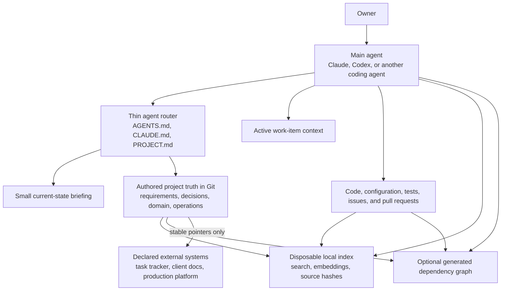
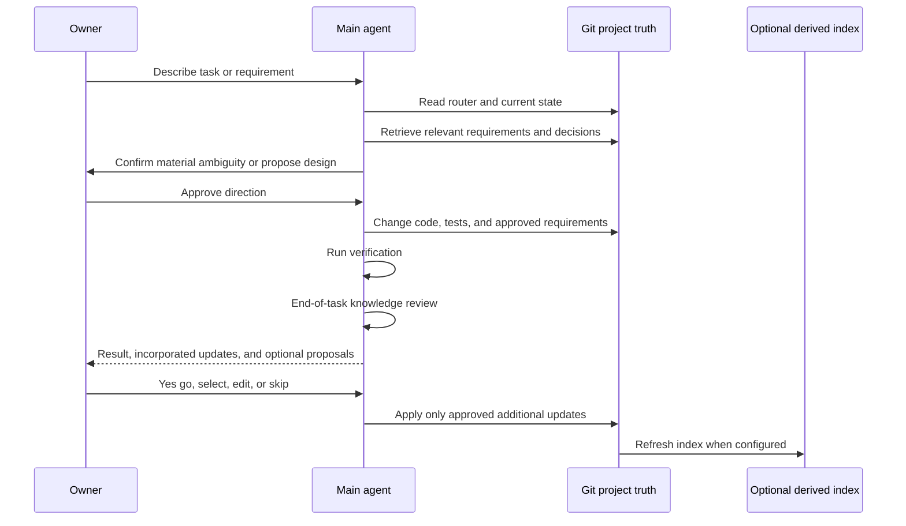

# Second-brain v2 technical architecture

Status: approved architecture under implementation. Units 01 and 02 are
implemented and independently reviewed in source. V2 is not shipped.

This document is the high-level source of truth for the proposed second-brain
v2 design. Detailed implementation units must follow this architecture, but
open implementation details in section 22 must be resolved before their
affected units are built.

## 1. Executive decision

Second-brain v2 will be a Git-native project knowledge system.

Durable project truth will live in human-readable, version-controlled files in
the project repository. A remote memory database is not part of the core
architecture. If a database is added later, it may only be a disposable search
or dependency index that can be rebuilt from the repository.

Desired system behavior remains under `specs/`. Other durable project memory
lives under typed folders in `memory/`, including context, decisions,
implementation knowledge, references, domain knowledge, and operations.

The architecture uses this rule:

> Project truth lives in Git. An index may help an agent find that truth, but it
> may never become a second source of truth.

This replaces the earlier proposal for a remote memory ledger. The remote
ledger solved some identity and concurrency problems, but it recreated
capabilities Git already provides while introducing authentication, routing,
backup, cost, synchronization, and stale-data failure modes.

The target optimizes in this order:

1. Correct current behavior and requirements.
2. One clear authority for each kind of knowledge.
3. Traceable sources and reversible changes.
4. Proactive preservation of important lessons.
5. Retrieval at the moment of need.
6. Low and predictable token use.
7. Portability across Claude, Codex, machines, and project types.
8. Coverage.

A missing memory is inconvenient. An incorrect memory presented as current
truth can cause compounding implementation errors and is therefore worse.

## 2. Problem statement

Mike should not have to repeatedly explain how a product or client system is
supposed to behave. Future agents need durable access to:

- product behavior;
- detailed requirements and user stories;
- edge cases;
- data-preservation rules;
- approved decisions and later reversals;
- important technical constraints;
- domain language and stakeholder terminology;
- source-of-truth rules;
- operational safety rules;
- known current blockers; and
- non-obvious implementation rationale.

Requirements evolve. The system must show which requirement is active now,
which earlier requirement it superseded, who or what established it, and what
tests or implementation currently support it.

The system must not treat session summaries, agent guesses, generated indexes,
or old work-item notes as equivalent to approved current requirements.

## 3. Core architecture principles

### 3.1 One canonical home per knowledge class

Each project declares where every supported class of knowledge lives. Other
documents may point to that home but may not duplicate its body.

Examples:

- desired product behavior lives in active product requirements;
- architecture choices live in the decision register;
- current implemented behavior lives in code, configuration, and tests;
- project workflow rules live in checked-in agent guidance;
- task status, blockers, work-item relationships, and current handoffs live in
  the `work-tracker` plugin's Git records;
- domain terminology lives in the glossary;
- deployment state lives in the declared deployment record; and
- temporary investigation state lives in the active work item.

There is no universal authority order that works for every question. The
authority depends on the kind of question being asked.

### 3.2 Authored truth and derived intelligence are separate

Human-approved requirements, decisions, policies, and domain knowledge are
authored truth.

Search indexes, dependency graphs, generated documentation, summaries, and
embeddings are derived intelligence. Derived artifacts must identify their
sources and source revisions. They may help locate or analyze authoritative
content, but they may not independently establish a project fact.

### 3.3 Current truth is explicit

Git history preserves what changed, but agents should not have to mine commit
history to determine current behavior. The current files must explicitly mark
active, proposed, superseded, deprecated, rejected, and unresolved content.

### 3.4 Knowledge changes travel with related work

When an approved implementation changes product behavior, the relevant
requirement, decision, and tests should change in the same pull request.

The `/remember` workflow is a safety net for durable knowledge discovered
during work. It is not the only mechanism that keeps specifications current.

### 3.5 Automatic recommendation, controlled persistence

Agents proactively identify valuable knowledge at the end of substantial work.
They do not silently promote every observation into project truth.

### 3.6 Small automatic context, deliberate retrieval

The system automatically loads only a small router and a small current-state
briefing. Detailed knowledge is retrieved when the task, files, or subsystem
make it relevant.

### 3.7 Mechanical controls enforce mechanical limits

Size limits, allowed statuses, unique identifiers, link validity, duplicate
identifiers, source hashes, and traceability requirements must be checked by
scripts or tests. Instructions such as "keep this file under 50 lines" are not
sufficient on their own.

## 4. Logical system layers



### 4.1 Authored project truth

This layer contains information that future agents may rely on when deciding
what the project should do. Changes are reviewed through the normal Git
workflow.

### 4.2 Current-state briefing

This is a concise answer to "what matters right now?" It contains headlines and
pointers only. It is not a work log, decision register, deployment history, or
requirements document.

The default hard limit is:

- no more than 40 non-empty lines;
- no more than 3 KB;
- no appended historical update narratives; and
- no detailed implementation body copied from another file.

A validation check must fail when the limit or schema is violated.

### 4.3 Work-item context

Active work may use a temporary context, plan, investigation log, or handoff
file. When the work closes, durable conclusions move to their canonical homes.
The remaining work-item material can be archived without becoming startup
context.

### 4.4 Derived search index

No database is required by default. Repository routing, stable identifiers,
mapped paths, and deterministic text search must work without one.

When project scale or measured retrieval quality justifies it, an optional
local SQLite database under `memory/.cache/` may provide full-text search,
structured lookup, and optionally semantic search. Embeddings and a local model
are opt-in. The index is generated from Git and ignored by Git.

Each indexed result must retain:

- canonical file path;
- record identifier when present;
- source commit SHA;
- source content hash;
- heading or line anchor;
- artifact type;
- short search excerpt; and
- derivation method.

The index contains no independently authored memory. Deleting and rebuilding it
must not lose project truth.

### 4.5 Structural graph

An optional structural graph answers mechanical questions such as:

- what reads or writes this field;
- what depends on this API;
- what tests cover this requirement;
- what permissions grant access to this component; and
- what may break if this component changes.

Graph edges carry their source, extraction method, and confidence. Disagreements
between parsed and curated edges are reported rather than silently resolved.

## 5. Default repository layout

Every project uses `specs/` for authoritative desired behavior and `memory/`
for the other durable project knowledge classes. Projects may omit optional
subfolders and map existing content into these roots.

```text
AGENTS.md
CLAUDE.md
PROJECT.md

specs/
  README.md
  product/
    calendar.md
    authentication.md
    data-retention.md

memory/
  README.md
  config.yaml
  context/
    current.md
    project-background.md
    constraints.md
  decisions/
    README.md
    DEC-001-example.md
  knowledge/
    README.md
  references/
    README.md
    external-systems.md
    approved-documents.md
  domain/
    glossary.md
    source-authority.md
  operations/
    deployment.md
    recovery.md
    environments.md
  .cache/                        # optional, generated, and gitignored
    search.sqlite
    health.json

tools/
  memory/
    validate.mjs
    search.mjs
    rebuild-index.mjs
```

The entry files have different purposes:

- `PROJECT.md` is the canonical project router for humans and agents.
- `AGENTS.md` is the Codex adapter and remains concise.
- `CLAUDE.md` is the Claude adapter and remains concise.
- `specs/README.md` routes agents to authoritative desired behavior.
- `memory/README.md` routes agents to durable project context without copying
  the bodies of the indexed files.
- `memory/config.yaml` declares the project identifier, enabled
  knowledge modules, canonical paths, external authorities, budgets, and schema
  version. It also maps source paths and subsystems to the specifications and
  memory documents that must be reviewed when those paths change.
- `memory/context/current.md` is the bounded current-state briefing.
- `tools/memory/` contains deterministic validation, search, and optional index
  maintenance commands installed and updated by the toolkit.
- Reusable agent workflows such as proactive review and `/remember` live in the
  toolkit plugin. V2 does not install curator agents in projects.

The adapters point to `PROJECT.md` and platform-specific safety rules. They do
not duplicate the full project description.

An existing project may preserve established subdivisions inside these roots,
provided its config maps them and each knowledge class still has one canonical
home.

## 6. Project profiles and optional modules

The scaffolding must support different kinds of projects without installing a
large empty documentation system into all of them.

Every project receives the small core:

- project router;
- decision lifecycle;
- current-state briefing;
- end-of-task knowledge review;
- validation and size budgets; and
- optional generated index support.

Projects then enable one or more modules.

### 6.1 Software product module

- product behavior and acceptance requirements;
- data-preservation invariants;
- architecture decisions;
- code rationale;
- test-to-requirement traceability; and
- API and data-contract documentation.

### 6.2 Client engagement module

- stakeholder register;
- client terminology and informal-language mappings;
- engagement constraints;
- commitments and open client questions;
- external-system map; and
- client-approved decision sources.

### 6.3 Data and integration module

- source authority by entity or field;
- lineage and transformation rules;
- identity and matching keys;
- reconciliation rules;
- retention and migration invariants; and
- vendor or connector semantics.

### 6.4 Regulated operations module

- approval boundaries;
- protected environments;
- deployment evidence;
- rollback and recovery requirements;
- audit references; and
- data-access constraints.

### 6.5 Platform metadata module

For systems such as Salesforce:

- component and field inventory;
- writer and reader relationships;
- permission and sharing relationships;
- generated metadata documentation;
- deployment component tracker; and
- platform-specific dependency graph.

Modules share the same lifecycle and routing rules. They contribute templates
and validators but do not change the core truth model.

## 7. Requirement model

Product requirements are the authoritative statement of how the system should
behave. They are not limited to short user stories. They may include granular
behavior, edge cases, failure behavior, data preservation, security, and
acceptance evidence.

Each durable requirement has:

| Field | Purpose |
|---|---|
| `id` | Stable identifier that is never reused |
| `title` | Short behavior name |
| `status` | proposed, active, superseded, deprecated, or rejected |
| `behavior` | What the user or system must be able to do |
| `scope` | Where the requirement applies |
| `invariants` | Conditions that must remain true |
| `edge_cases` | Boundary and failure scenarios |
| `data_preservation` | What must survive edits, deletion, migration, retries, or partial failure |
| `acceptance_scenarios` | Observable examples that prove the behavior |
| `source` | Owner statement, approved document, issue, regulation, or other authority |
| `supersedes` | Earlier requirement identifiers replaced by this one |
| `related_decisions` | Architecture decisions that implement or constrain it |
| `verification` | Tests, code, or manual evidence |

Example:

```markdown
### CAL-014: Preserve historical completion

Status: Active
Source: Owner-approved requirement
Supersedes: CAL-009

When a repeating calendar item is edited, existing completion records must
remain attached to the occurrence the user originally completed.

Invariants:
- Editing the title does not remove prior completion records.
- Moving future occurrences does not move historical completion records.
- Deleting the repeating rule does not delete completed history.

Acceptance:
- Given a completed occurrence, when the series title changes, the historical
  occurrence remains completed under the new visible title.
```

Tests should reference requirement identifiers where practical. A behavior
change is incomplete until its active requirement and verification evidence
agree.

## 8. Decision and supersession model

Decisions use stable identifiers and explicit lifecycle states:

- proposed;
- accepted;
- superseded;
- rejected; and
- deprecated.

An accepted decision records context, the choice, rationale, tradeoffs,
consequences, affected requirements, and supporting evidence.

When a decision changes:

1. create or accept the successor decision;
2. mark the earlier decision superseded;
3. link both directions;
4. update affected active requirements if behavior changed;
5. update tests and implementation in the same change when applicable; and
6. leave Git history as the full audit trail.

Agents must not present superseded decisions as current. They may retrieve an
old decision when the task asks why the project changed or when historical
context is necessary to understand a migration.

## 9. Authority, provenance, and conflict handling

The project config maps each question type to an authority.

| Question | Default authority |
|---|---|
| What should the product do? | Active product requirement |
| Why was this architecture chosen? | Accepted decision |
| What does the implementation do now? | Current code, configuration, and tests |
| What terms mean in this project | Project glossary |
| Which data source wins | Source-authority document |
| What is being worked on | Declared task tracker or active work item |
| What is deployed | Declared deployment record |
| How agents must operate | Checked-in agent rules |
| What Mike prefers across all projects | User-level agent instructions |

When two sources conflict, the agent must:

1. identify the knowledge class being asked about;
2. consult the configured authority for that class;
3. report the conflicting source;
4. avoid silently combining incompatible claims; and
5. propose the smallest correction or clarification needed.

An agent inference is never promoted directly to active project truth. It can
become a proposed requirement, question, or recommendation with supporting
evidence.

## 10. Freshness model

Freshness comes primarily from change coupling, not from periodic AI review.

### 10.1 Same-change rule

When implementation behavior changes, the same pull request should update:

- affected active requirements;
- affected decisions or rationale;
- tests or other verification;
- generated indexes; and
- current state when the change materially affects immediate work.

### 10.2 Source-pinned derived artifacts

Generated documents and indexes record the source commit and content hash. A
hash mismatch marks the derived artifact stale. Stale derived content may point
to its source but may not be presented as verified current behavior.

### 10.3 Explicit review state

High-risk requirements may declare a review trigger such as:

- a named dependency changes;
- a data-source contract changes;
- a protected environment is refreshed;
- a related decision is superseded; or
- a configured review date arrives.

Review dates alone do not prove correctness. They create a review obligation,
not automatic renewal.

### 10.4 No append-only current state

The current-state briefing is replaced in place. Historical progress belongs in
Git history, completed work items, deployment records, or a work log.

## 11. Session and task lifecycle



### 11.1 Startup

At startup, the agent reads:

1. its platform adapter;
2. the canonical project router;
3. `memory/context/current.md`; and
4. only the knowledge documents relevant to the current task.

The default automatic-context budget is 1,500 tokens across the router and
current-state briefing. Projects can lower it. Raising it requires an explicit
project decision and a measured reason.

### 11.2 During work

The agent retrieves by stable identifiers, mapped paths, affected subsystems,
and deterministic text search before using semantic search.

When the owner approves a requirement that directly governs the current
implementation, the agent updates that requirement as part of the current work.
The owner should not need a second `/remember` step for already-approved,
in-scope product behavior.

When the owner changes a requirement during the conversation, the agent must:

1. locate the active requirement that currently governs the behavior;
2. classify the new statement as a clarification, compatible extension,
   material reversal, or unresolved ambiguity;
3. show the material behavior delta when it affects implementation;
4. ask for clarification only when the new desired behavior is materially
   ambiguous;
5. revise the active requirement for a compatible clarification, or create and
   link a successor while marking the old requirement superseded for a
   reversal; and
6. update the requirement, code, and tests in the same work.

A clear instruction to implement the changed behavior is approval for the
in-scope specification update. The agent reports that update explicitly.

### 11.3 End-of-task knowledge review

After verification and before the final response for substantial work, the main
agent automatically performs a lightweight knowledge review. It also runs when
the owner signals that a task, project, or working session is ending. The owner
does not need to invoke `/remember`.

The response separates:

- specification and memory changes already incorporated with the work; and
- additional proposed changes that have not yet been written.

It recommends no more than five additional high-value updates. Each
recommendation states:

- proposed knowledge;
- classification;
- canonical target file;
- whether it creates, updates, corrects, or supersedes something;
- source or evidence;
- why future agents will need it; and
- whether it was already incorporated into the current change.

The review saves:

- explicitly approved behavior;
- edge cases and preservation rules;
- approved decisions and reversals;
- important terminology;
- non-obvious constraints;
- recurring failure modes; and
- verified current-state changes that future sessions need.

It rejects:

- raw session summaries;
- temporary debugging steps;
- unverified hypotheses;
- generic descriptions of code;
- duplicate facts;
- speculative decisions;
- transient tool output; and
- information that belongs only in the current work item.

For a substantial task with no candidates, the agent says:

> No durable knowledge updates recommended.

Simple questions and minor edits do not need a visible review.

The normal approval interface accepts ordinary language:

- `yes go` applies all proposals;
- `1 only` or another selection applies only named proposals;
- `edit 2 to say...` revises a proposal before applying it; and
- `skip` writes nothing.

The proposal exists only in the conversation until approved. Approval triggers
the same active main agent to apply the exact Git changes, validate them,
refresh any configured disposable index, and report the changed files. It does
not launch another model or agent.

### 11.4 Proactive apply and `/remember`

Proactive apply and `/remember` are the same Git-writing workflow.
`/remember` remains an optional explicit entry point, not a required step after
normal work.

It:

1. accepts the agent's recommendations or a direct owner instruction;
2. finds the canonical knowledge home;
3. searches for duplicates and contradictions;
4. proposes an exact diff;
5. applies only the approved items;
6. validates identifiers, lifecycle links, sizes, and references;
7. reports what changed; and
8. refreshes disposable indexes when configured.

It uses the active main agent context. It does not launch curator subagents,
perform broad repository sweeps, persist rejected proposals, or silently
rewrite unrelated knowledge.

## 12. Retrieval and token budgets

Default retrieval behavior:

- no automatic recall on every user prompt;
- no full memory-folder injection;
- no session transcript ingestion;
- read the smallest relevant authoritative document;
- use repository maps and deterministic text search before an optional index;
- return pointers before large bodies;
- deduplicate documents already read in the session;
- stop when authoritative sources answer the question; and
- surface uncertainty when relevant sources disagree.

Suggested default budgets:

| Operation | Budget |
|---|---|
| Automatic startup context | 1,500 tokens |
| Initial task-specific retrieval | 4,000 tokens |
| End-of-task knowledge review | Existing main-agent context, no extra model |
| Recommended updates | At most 5 |
| Optional search results | At most 5 pointers |
| Current-state file | 3 KB and 40 non-empty lines |

The 2026-07-25 Anchor incident is a non-regression baseline: approximately 9.8
million processed tokens, 90 assistant turns, 54 tool calls, and 10.5 minutes
were spent curating 7 nodes after a one-line change.

The normal v2 wrap-up target is:

- no curator subagent;
- no model call beyond the main agent already completing the task;
- deterministic search and validation;
- no broad graph maintenance;
- no hidden retry loops; and
- a visible result or visible skip.

## 13. External systems

Git is the default authority for durable project knowledge. External systems
can remain authoritative for classes they are better suited to own.

Examples:

- `work-tracker` owns task status by default. Its optional GitHub Issues and
  Projects adapter is a derived collaboration mirror, not a second authority.
- A future project may explicitly declare ClickUp, Jira, or another external
  tracker authoritative, but that requires a project-level exception and an
  adapter designed for that direction.
- A production platform can own current deployed runtime state.
- A client-controlled document system can own a signed approval.

The project config must declare the exception and store a stable pointer in
Git. Full bodies should not be mirrored into multiple systems.

Detailed product behavior remains in Git by default. Work-item IDs may be
linked from requirements, decisions, and knowledge, but second-brain never
copies or changes their status. If a project must keep requirements externally,
that is an explicit project-level exception. The Git repository then stores the
authority declaration and stable pointers, not a competing requirements copy.

## 14. Lessons from evaluated systems

The Davis repository demonstrates several patterns that v2 should preserve.

### 14.1 Adopt from Davis Advisors

#### Memory as routing

Short entries point to the real work item, specification, component tracker,
knowledge document, or external record. Memory does not need to copy every body.

#### Typed knowledge

Project facts, reference material, user preferences, feedback, and current
state are distinguishable. V2 will formalize the useful categories and map each
to a canonical Git home.

#### Correction and supersession discipline

The Davis curator guidance correctly recognizes that a later investigation can
overturn an earlier "done," "passed," or "clean" conclusion. V2 makes this a
validated lifecycle instead of relying on curator prose.

#### Client lexicon

A confirmed mapping from stakeholder language to concrete system terms is
valuable for consulting and domain-heavy projects. This becomes part of the
optional client-engagement module.

#### Source authority

Documentation of which source, object, field, or connector wins is essential
for data and integration projects. This becomes part of the data-and-integration
module.

#### Detailed requirements

The Davis security and feature specifications contain strong examples of:

- explicit behavior;
- concrete scenarios;
- edge cases;
- exceptions;
- quantitative evidence;
- open questions;
- implementation constraints;
- deployment implications; and
- required tests.

V2 keeps that depth while adding stable requirement identifiers and a clearer
current-versus-superseded lifecycle.

#### Rebuildable SQLite graph

The Davis metadata catalog is the strongest reusable technical pattern:

- Git files remain authoritative;
- SQLite is generated and gitignored;
- graph edges retain source and confidence;
- parsed and curated interpretations can coexist;
- disagreements are reported;
- the database works without production credentials; and
- deleting the database loses no truth.

V2 generalizes this pattern through optional project-specific adapters.

#### Small current-focus intent

The goal of giving a new agent a short current briefing is correct. V2 retains
the concept and adds hard enforcement.

### 14.2 Do not adopt from Davis Advisors

#### Session Brain

The Davis Session Brain is legacy and no longer intentionally used. It must not
become part of v2.

The repository currently still imports its stale May 2026 `BRAIN.md` from
`CLAUDE.md`. That illustrates why disabling a process is insufficient when its
output remains in automatic context.

#### Background curator writes

The main agent should not dispatch multiple background agents to make silent
memory changes. This increases cost, creates shared-file races, and separates
the knowledge write from the owner-visible task conclusion.

#### Propagation fan-out

The Davis curator often updates a topic file, the memory index, current focus,
and several cross-referenced summaries for one change. This makes every
correction expensive and gives stale claims multiple places to survive.

V2 stores the body once and generates indexes mechanically.

#### Unenforced size instructions

The Davis `CURRENT_FOCUS.md` is approximately 114 KB even though its curator
rule says to keep it under 50 lines. This proves that important limits need
validators.

#### Large automatic context

At the time of review:

- the curated memory folder contained 67 files and approximately 578 KB;
- its memory index was approximately 17.6 KB;
- `CURRENT_FOCUS.md` was approximately 114 KB;
- the legacy Session Brain was approximately 14.6 KB;
- the Claude rules folder contained 16 files and approximately 67 KB; and
- the generated knowledge base contained 278 files and approximately 1.8 MB.

These sizes are manageable as selectively retrieved repository content. They
are not appropriate as automatic startup context.

#### Committed repetitive audit logs

The committed memory audit log was approximately 549 KB and included repeated
audits of the same session. Raw operational logs are normally local, rotated,
and ignored unless a specific record is promoted as durable evidence.

#### Machine-specific junctions

The Davis project uses a Windows directory junction so Claude's user-level
memory path writes into the repository. This is clever but not portable enough
for a reusable Claude and Codex toolkit.

#### Missing local automation dependencies

The repository's settings reference memory hook scripts that were not present
on the reviewed `master` tree. V2 cannot depend on untracked machine-local
scripts for required behavior.

#### Competing sources of truth

The Davis system divides project context among Git, ClickUp, memory files,
current focus, Session Brain, work logs, and generated documentation. Some
separation is appropriate, but overlapping bodies create authority ambiguity.
V2 requires one declared owner for each knowledge class.

#### Versioned specification chains

Files named V1, V2, and V3 preserve useful history but force agents to reconcile
which portions remain current. V2 uses stable requirement and decision
identifiers with explicit successor links. Historical versions remain available
through Git.

#### Generated documentation as independent authority

Generated knowledge bases are valuable navigation and analysis layers. They
must not outrank the source code or approved requirements from which they were
derived.

### 14.3 Adopt selectively from Agentic OS

#### Provenance-first retrieval

Search results should identify the source file, stable identifier, lifecycle
status, and source hash. An agent must be able to open the authoritative Git
record instead of treating a generated summary as truth.

#### Exact search before optional semantic search

Stable identifiers, path mappings, and exact text search are predictable,
cheap, and easy to inspect. Optional semantic retrieval can help larger
projects find conceptually related material, but it supplements rather than
replaces deterministic routing.

#### Rebuildable index with a health receipt

When a project enables an index, it records the source commit, source hashes,
index schema, and enabled search modes. The health receipt distinguishes a
healthy index from a stale, failed, or intentionally disabled index.

#### Retrieval and scope tests

Representative queries should verify that active authoritative records outrank
stale, historical, or loosely related notes. Projects with multiple clients or
knowledge scopes also test that retrieval does not leak across configured
boundaries.

#### Bounded startup context

A small, deliberate startup briefing is useful. It must remain within a
validated budget and route the agent to deeper sources only when needed.

### 14.4 Do not adopt from Agentic OS

#### Per-turn model capture

Running another model after every turn to extract memories adds cost and turns
ordinary conversation into an uncontrolled ingestion stream.

#### Transcript archives and scheduled AI curation

Raw transcripts, daily distillation, weekly curation, and background curator
jobs create more material to reconcile without proving that it is current
project truth.

#### Heavy default local infrastructure

PGLite, a large embedding model, and semantic indexing should not be required
for every project. V2 starts with Git routing and deterministic search. A
project may enable a disposable local index only after measured retrieval needs
justify it.

#### Automatic commits or pushes

Knowledge updates remain visible project changes. The agent must not
automatically commit or push them merely because a capture workflow ran.

#### Technical index status as semantic authority

An item being successfully indexed proves only that it was processed. It does
not prove that the claim is correct, current, approved, or applicable. In the
evaluated corpus, a relevant calendar memory could still rank below undated
learning notes. Lifecycle and source authority must be explicit in Git.

#### Project curator agents

Reusable workflows belong in the toolkit plugin, and deterministic project
helpers belong under `tools/memory/`. A project does not install background
curator agents by default.

## 15. Portability across agent surfaces

The core behavior cannot rely on one model vendor's private memory mechanism.

- Codex receives concise checked-in guidance through `AGENTS.md`.
- Claude receives concise checked-in guidance through `CLAUDE.md`.
- Both route to the same `PROJECT.md` and project knowledge files.
- Proactive knowledge review and `/remember` use equivalent instructions on
  both surfaces.
- Reusable workflows live in the toolkit plugin.
- Deterministic validators, search, and optional index refresh run through
  ordinary project scripts under `tools/memory/`.
- Platform-specific hooks are optional convenience layers.
- A project remains understandable from a fresh clone without user-level
  symlinks, junctions, hidden agent files, or remote credentials.

User-wide preferences may remain in user-level Claude or Codex instructions.
Required project guidance must be present in the repository.

## 16. Security and privacy

Do not store in project knowledge:

- secrets or credentials;
- authentication tokens;
- raw transcripts;
- unrestricted tool logs;
- sensitive personal information not appropriate for repository visibility; or
- client material that violates the repository's access policy.

Client names and necessary business context may be stored when the repository
is an approved location for that client data.

Before enabling a knowledge module, project initialization confirms:

- repository visibility;
- sensitive-data classification;
- permitted source systems;
- whether generated indexes may leave the machine; and
- retention expectations.

## 17. Failure behavior

The system prefers visible incompleteness:

- No canonical home: recommend configuration instead of guessing a file.
- Conflicting active requirements: stop and present the conflict.
- Unverified inference: create a proposal, not active truth.
- Supersession without a valid predecessor: fail validation.
- Derived source hash mismatch: mark stale and read the source.
- Current-state budget exceeded: fail validation and require condensation.
- External authority unavailable: report that current state could not be
  verified.
- Index unavailable: fall back to repository search.
- Index disagrees with Git: discard or rebuild the index.
- Proactive review or `/remember` has no worthwhile candidate: write nothing.

## 18. Maintenance

Maintenance is deterministic where possible:

- validate unique requirement and decision identifiers;
- validate lifecycle and successor links;
- enforce current-state and router size budgets;
- find broken internal pointers;
- detect derived artifacts whose source hash changed;
- rebuild local search indexes;
- report requirements without verification evidence;
- report implementation changes that touch mapped behavior without a related
  specification review; and
- archive completed work-item material.

Maintenance does not:

- summarize every session;
- capture every turn;
- require scheduled AI curation;
- launch open-ended curator agents;
- rewrite knowledge based only on model inference;
- resolve contradictions without owner-visible evidence; or
- inject a full maintenance backlog into feature work.

## 19. Fresh-start direction

Second-brain v1 is retired and is not a source for v2. Existing v1 databases,
exports, project memory caches, curator output, and outbox files are not
classified or imported.

For each project that adopts v2:

1. start from the current Git repository;
2. identify authoritative requirements and operational documentation already
   committed to Git;
3. install the v2 project layout only after its implementation units pass;
4. build `specs/` and `memory/` from reviewed Git content and new owner-approved
   work;
5. build the small routers and current-state briefing; and
6. optionally generate a disposable local index.

The live v1 Worker and Neon resources remain untouched until the owner
separately approves deletion. Their continued existence does not make their
content valid input to v2.

## 20. Simulator requirements

The interactive simulator must show how the architecture behaves during real
repository work, not only display a static system diagram.

The "Fix a Calendar checkoff bug" scenario must demonstrate:

1. which small startup files the agent receives;
2. how the agent locates relevant calendar requirements;
3. which active requirement identifiers govern the change;
4. how edge cases and data-preservation rules affect the implementation;
5. how code and tests reference those requirements;
6. how an approved requirement change updates Git in the same work;
7. how the agent automatically runs the end-of-task knowledge review;
8. how an unrelated durable discovery becomes an additional proposal;
9. how `yes go`, selection, editing, and skipping change the proposed diff;
10. how an old requirement is superseded;
11. exactly what an optional SQLite index stores and why it is not required;
12. how stale index data is detected and rebuilt; and
13. estimated startup, retrieval, and wrap-up token use.

The simulator should also allow switching project profiles so Mike can compare
how the same core system serves:

- a product application;
- a Salesforce client engagement;
- a data or integration project; and
- a smaller project that needs only the core.

## 21. Architecture acceptance criteria

The architecture is ready for implementation only when:

1. A fresh clone contains all required project knowledge behavior.
2. Project truth remains available without a remote memory service.
3. Each knowledge class has one declared canonical home.
4. Authoritative behavior remains under `specs/`, while other durable project
   knowledge is stored in typed folders under `memory/`.
5. Active requirements express behavior, edge cases, and preservation rules.
6. A requirement reversal leaves one clearly active successor.
7. Code-changing pull requests can validate related requirement review.
8. Current-state and router size limits are mechanically enforced.
9. A substantial task produces at most five proactive knowledge
   recommendations without a curator subagent.
10. The owner can approve all proposals with `yes go`, approve a subset, edit
    one, or skip all of them.
11. Proposals remain unwritten until approval.
12. `/remember` remains an optional alias for the same approved Git workflow.
13. The default installation needs no database, embedding model, or project
    curator agent.
14. Deleting every generated database loses no project truth.
15. A stale derived artifact is excluded from verified current answers.
16. Claude and Codex read the same canonical project guidance.
17. External systems have explicit, non-overlapping authority declarations.
18. The 9.8-million-token curation scenario cannot recur in normal wrap-up.
19. A product, client engagement, data project, and small repository can each
    install only the modules they need.

## 22. Implementation decisions

Units 01 and 02 resolve these implementation choices:

1. Project configuration uses a strict, dependency-free YAML subset with
   closed keys and JSON-style arrays.
2. Structured requirements and memory use one Markdown file per record with
   strict frontmatter.
3. Current state is an owner-maintained, validated pointer briefing under hard
   byte and line budgets.

The following remain open for later units:

1. Which optional index adapter is built first and what measured threshold
   justifies enabling it.
2. How strict specification-to-test traceability should be for each project
   profile.

The folder layout, Git authority, proactive review, and natural-language
approval interaction are resolved architecture decisions.
