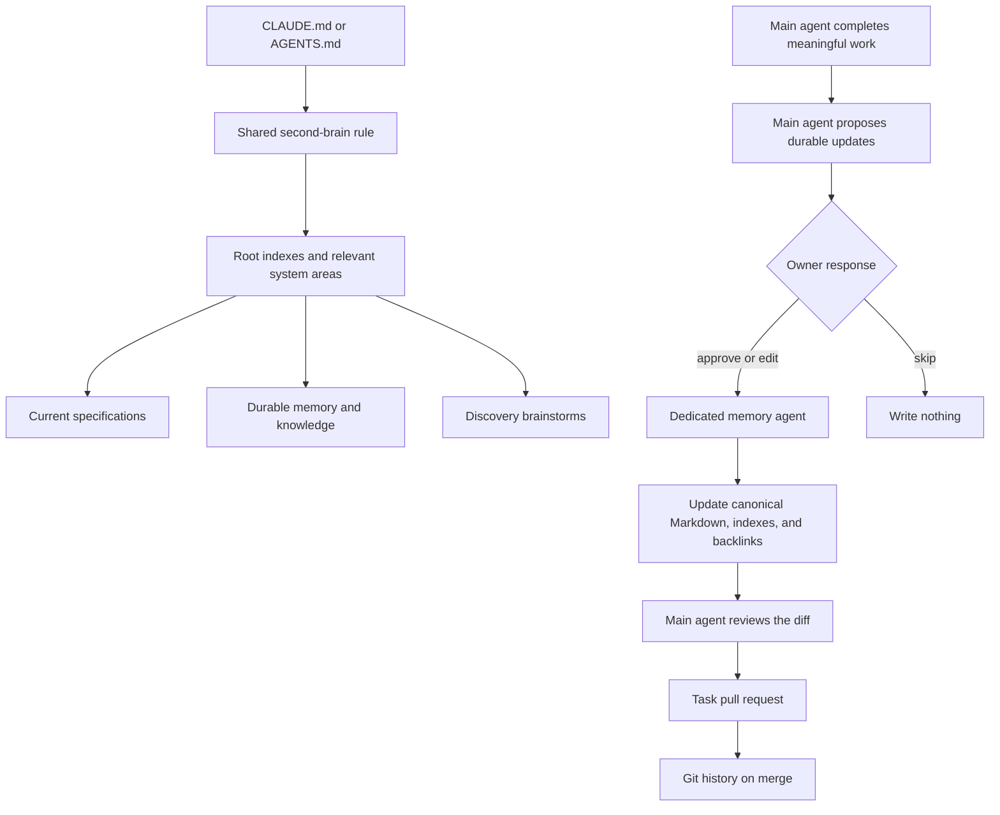
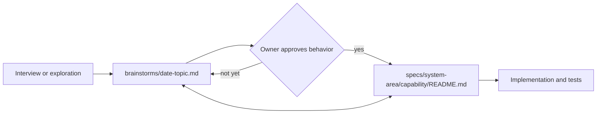

# Second-brain v3

Status: current shipped design for the second-brain plugin. Adoption in each
project remains opt-in and owner-approved.

Second-brain v3 is a shared project memory and knowledge system for Claude and
Codex. Its contents are ordinary Markdown files committed to the same Git
repository as the project.

The system is intentionally simple:

1. Root instructions tell Claude and Codex where project truth lives.
2. Agents read only the material relevant to the work.
3. The main agent performs the requested work and notices durable information.
4. At defined completion points and natural stopping points after meaningful
   work, the main agent proposes useful updates.
5. The owner approves, changes, or skips those proposals in normal language.
6. A dedicated memory agent organizes and writes the approved Markdown updates.
7. The updates travel through the same worktree and pull request as the task.

V3 is not a database, knowledge graph, transcript collector, background
service, or deterministic rules engine. AI judgment decides what is relevant
and how the approved information fits the schema.

## The system in one picture



## Project layout

Projects create only the system-area folders and documents they need.

```text
project/
  CLAUDE.md
  AGENTS.md
  .claude/
    rules/
      second-brain.md
    agents/
      memory-librarian.md
  brainstorms/
    README.md
    <date>-<topic>.md
  specs/
    README.md
    <system-area>/
      README.md
      <capability>/
        README.md
        <optional-supporting-document>.md
  memory/
    README.md
    context/
      README.md
      <system-area>/
    planning/
      README.md
      <system-area>/
    decisions/
      README.md
      <system-area>/
    knowledge/
      README.md
      <system-area>/
    references/
      README.md
      <system-area>/
    domain/
      README.md
      <system-area>/
    operations/
      README.md
      <system-area>/
```

`<system-area>` comes from the project, such as `authentication`, `billing`,
`reporting`, `salesforce`, `mobile-app`, or `project-wide`. V3 does not impose a
universal list.

## What each home owns

| Home | What belongs there | Authority |
|---|---|---|
| `specs/` | Current approved product and system behavior | Authoritative for what the system should do |
| `brainstorms/` | Raw discovery, interviews, options, and unresolved exploration | Non-authoritative input to later decisions and specifications |
| `memory/context/` | Durable circumstances, constraints, stakeholders, and project background | Current project context |
| `memory/planning/` | Vision, goals, roadmap, milestones, timeline, strategic dependencies, durable risks, and assumptions | Current high-level direction, not ticket status |
| `memory/decisions/` | Important choices, reasons, alternatives, and consequences | Current rationale unless marked superseded |
| `memory/knowledge/` | Reusable technical and project understanding | Current durable understanding |
| `memory/references/` | Sources and why they matter | Supporting material, not automatic truth |
| `memory/domain/` | Business language, concepts, actors, policies, and examples | Current domain meaning |
| `memory/operations/` | How to operate, release, recover, support, and verify the system | Current operating guidance |
| Project artifact folders | Raw meeting notes, transcripts, communications, deliverables, research, and source exports | Canonical raw evidence |
| Work tracker | Backlog, ticket status, blockers, ticket relationships, handoffs, branches, pull requests, and landing proof | Authoritative for work state |
| Git | Exact document history, branches, review, and recovery | Authoritative history |

One piece of truth has one canonical home. Other documents link to it instead
of copying it.

## How discovery becomes approved behavior

Brainstorms stay in one flat folder because discovery often crosses system
areas or begins before the correct area is known. Specifications use stable
system-area folders because they describe approved current behavior.



Every specification links to all applicable brainstorms that informed it.
Each brainstorm links back to every resulting specification. One brainstorm
may inform several specifications, and one specification may use several
brainstorms.

`brainstorms/README.md` indexes the dated files and their resulting
specifications. A brainstorm is stored once, never copied into every area it
touches.

Raw brainstorming never becomes current behavior merely because an agent wrote
it down.

## How specifications evolve

Each capability has its own folder. Its `README.md` is the one required,
canonical specification. Supporting documents such as `user-flows.md`,
`data-model.md`, `interfaces.md`, or `migration.md` are created only when they
make a substantial specification easier to understand.

The canonical specification describes current approved behavior. Git preserves
its exact previous versions. An important historical choice receives a linked
decision record when its rationale will help future work. Routine changes do
not require duplicate archived specifications or a changelog.

If old behavior is still deployed, supported, or relevant for compatibility,
the current specification describes that continuing boundary.

## Where the agent instructions live

The detailed schema and operating instructions have one canonical project home:

```text
.claude/rules/second-brain.md
```

Both `CLAUDE.md` and `AGENTS.md` carry the routing schema in full and tell their
agent to read that shared rule for everything else. Routing has to work before
an agent opens another file, and Codex reads only `AGENTS.md`, so that one part
is copied on purpose. Both root sections change in the same commit as the rule,
and the rule wins if they ever disagree.

The dedicated memory agent reads the same shared rule and the relevant project
indexes. Its reusable role instructions live at
`.claude/agents/memory-librarian.md`. The path is shared project content even
when Codex invokes the role through its own delegation mechanism.

## When the main agent proposes updates

The main agent conducts a short durable-knowledge review only:

- when a substantial task request is complete, at the moment its pull request is
  opened. The pull request does not wait for the owner's answer: it opens with
  the code in it, and the approved memory is committed to the same branch before
  it is merged;
- at the end of a brainstorming or requirements interview;
- at the end of a milestone or project phase; or
- at another natural stopping point after meaningful work, when the owner ends
  or pauses the task and a settled durable result exists.

A session handing off to a fresh one, or about to have its context cleared, does
trigger this review. That moment has the most at stake, because the context is
about to be destroyed and nothing can catch a clear after it happens. Save what
the owner approves and carry everything else inside the handoff prompt.

An ordinary chat message, a commit, or a trivial action does not trigger it.
Live status, blockers, and next actions are not memory.
One review may satisfy several nearby stopping points unless later work changes
the durable result.

The main agent proposes every useful update it recommends. There is no fixed
number. The owner may approve all, approve selected items, change wording or
destinations, defer an item, or skip everything.
A deferred item changes no durable document and creates no second-brain queue.

The main agent must invoke the memory agent for approved content. The memory
agent writes only that content and the index or backlink changes necessary to
keep it navigable. If the approved write fails, the task remains unfinished and
does not merge as though it succeeded unless the owner explicitly waives it.

## Parallel sessions and Git

Every active chat session works in its own worktree and branch. Its memory agent
writes only inside that same worktree.

Task-related code, tests, specifications, and approved memory updates normally
use one pull request. A brainstorming-only session or standalone memory cleanup
may use a documentation-only pull request.

The memory agent never writes directly to `main`, another session's worktree,
or a shared external store. Git exposes text conflicts when parallel branches
edit the same lines, but it cannot detect the same truth filed in two paths or
two different files that disagree.

Before a pull request containing specification or memory changes merges, its
branch is brought current through the existing Git workflow. The main agent then
invokes the librarian for a read-only comparison against the latest relevant
documents and indexes. It reports semantic duplicates or conflicting current
truth. Any destructive or meaning-changing repair remains owner-approved.

## Greenfield and brownfield projects

For a greenfield project, v3 starts with the project explanation, high-level
planning, system-area discovery, and approved specifications.

For a brownfield project, v3 begins with a read-only map of the existing
repository and documentation. Graphify or another analysis tool may help
produce that map, but its output is evidence rather than current truth.
Interviews backfill intent, business context, history, and constraints that
cannot be safely inferred from code.

Existing documents are kept and linked, moved with approval, or consolidated
with approval. Adoption does not duplicate every document into a template or
turn unverified inference into authoritative memory.

Raw meeting notes, transcripts, communications, deliverables, and other project
artifacts stay in their ordinary project scaffolding. V3 links to useful
evidence and preserves approved durable outcomes rather than copying the raw
record into agent memory.

## Optional document aids

Every durable specification or memory document has a descriptive title, a
one-sentence summary immediately after the title, type-specific content,
contextual relationships when useful, and a one-sentence entry in the nearest
index.

`Status`, validity guidance, `Tags`, `Sources`, and `Aliases` are optional
everywhere. An agent uses them only when they make a document easier to find,
understand, verify, or keep current. Templates do not require them or include
empty placeholders.

A time-sensitive document may use an owner-approved `Review after: <date>` or
`Review when: <event>`. Reaching the date or event tells an agent to verify the
information before relying on it. It does not automatically expire or rewrite
the document.

Normal Markdown links, descriptive titles, system-area indexes, and backlinks
are the primary navigation system.

## Specification set

- [Technical specification](TECHNICAL-SPECIFICATION.md): authority, reading,
  proposing, approval, memory-agent writing, concurrency, correction, and
  acceptance behavior.
- [Markdown schemas](MARKDOWN-SCHEMAS.md): human-readable shapes for
  brainstorms, specification folders, planning, and all other memory types.
- [Toolkit integration](TOOLKIT-INTEGRATION.md): plugin boundaries,
  `project-init`, `project-sync`, work-tracker, grill-me, Claude, Codex, and
  rollout.
- [Discovery record](../../brainstorms/2026-07-28-second-brain-v3-project-memory.md):
  raw owner interview and repository evidence that informed this design.

## Shipped source

- [Canonical project rule](../../plugins/second-brain/skills/second-brain/references/second-brain-rule.md):
  the complete rule copied into an adopting project.
- [Memory librarian](../../plugins/second-brain/agents/memory-librarian.md):
  the on-demand writer role used by Claude and Codex.
- [Adoption guide](../../plugins/second-brain/skills/second-brain/references/adoption-guide.md):
  greenfield setup and brownfield read-only adoption.
- [Copy-ready schemas](../../plugins/second-brain/skills/second-brain/references/markdown-schemas.md):
  starting shapes for indexes, specifications, brainstorms, and typed memory.

## Explicitly not part of v3

- database, Worker, or hosted memory service;
- memory MCP connector;
- embeddings or semantic search;
- hooks or scripts that capture, recall, place, or write memory;
- transcript or per-message capture;
- background, scheduled, or autonomous curation;
- a deterministic natural-language approval parser;
- machine-enforced document schemas;
- mandatory tags, sources, aliases, or YAML frontmatter;
- a fixed proposal limit;
- automatic commits, pushes, merges, or deployments; or
- a second ticket, backlog, or handoff system.

A hook that enforces a rule or starts the durable review at a completion point
is not excluded. It writes nothing and approves nothing, so the approval
boundary above is unchanged.

The dedicated memory agent is invoked for an approved update. It is not a
background curator and does not act independently.
