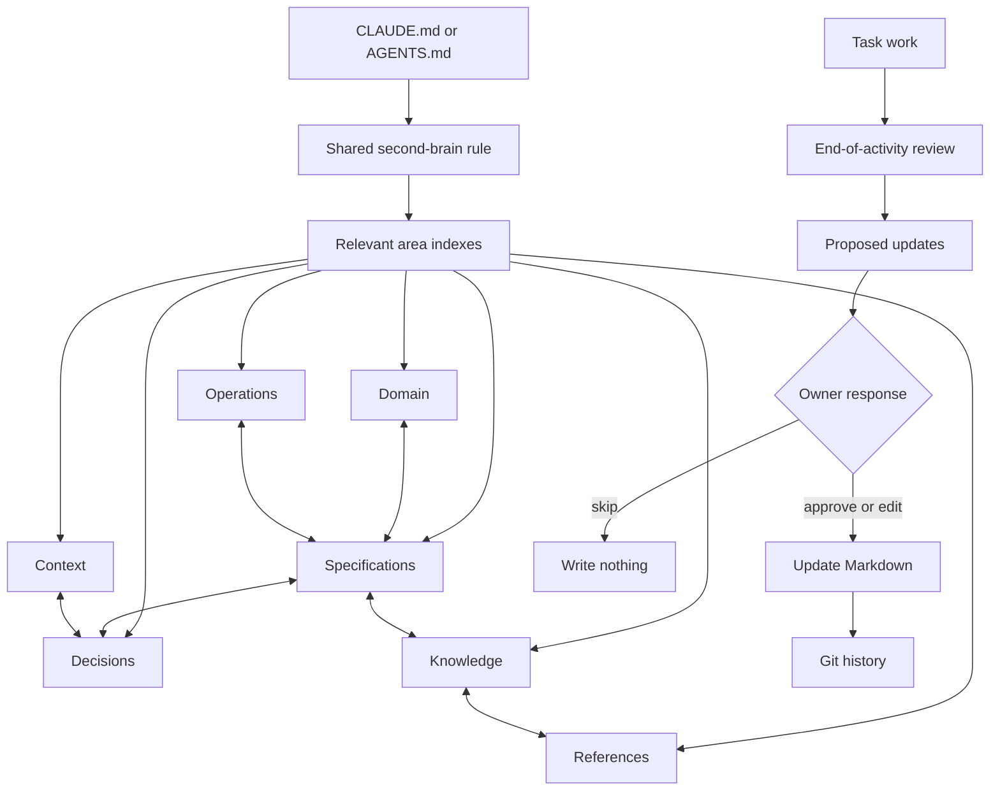

# Second-brain v3

Status: draft technical specification for owner review. Nothing in this folder
is installed or shipped yet.

V3 is a shared Markdown memory and knowledge system for Claude and Codex. It is
not a database, a background service, or an automated transcript collector. It
is a project structure plus standing agent instructions:

1. Read the relevant project specifications and durable knowledge before work.
2. Complete the requested work.
3. Notice what future sessions should know.
4. Show the owner any additional specification or memory updates worth making.
5. Write only the updates the owner approves.

The previous v2 specification is not a requirements source for v3. V3 starts
from the owner-approved direction documented here.

## The system in one picture



## Project layout

The folders are organized first by information type and then by the areas that
make sense for that project. A project creates only the area folders it needs.

```text
project/
  CLAUDE.md
  AGENTS.md
  .claude/
    rules/
      second-brain.md
  specs/
    README.md
    <system-area>/
      README.md
      <capability>.md
  memory/
    README.md
    context/
      README.md
      <system-area>/
        README.md
        <topic>.md
    decisions/
      README.md
      <system-area>/
        README.md
        <decision>.md
    knowledge/
      README.md
      <system-area>/
        README.md
        <topic>.md
    references/
      README.md
      <system-area>/
        README.md
        <source>.md
    domain/
      README.md
      <system-area>/
        README.md
        <concept>.md
    operations/
      README.md
      <system-area>/
        README.md
        <procedure>.md
```

`<system-area>` is chosen from the project itself, such as `authentication`,
`billing`, `reporting`, `salesforce`, or `mobile-app`. It is not a universal
list imposed by the toolkit.

## What each home owns

| Home | What belongs there |
|---|---|
| `specs/` | What the product or system must do |
| `memory/context/` | Durable project circumstances, constraints, and current conditions needed to understand the work |
| `memory/decisions/` | Decisions, reasons, alternatives, and consequences |
| `memory/knowledge/` | Non-obvious technical or project knowledge future work should reuse |
| `memory/references/` | Useful external or internal sources and why they matter |
| `memory/domain/` | Business language, concepts, rules, and examples |
| `memory/operations/` | How to operate, release, recover, or support the system |
| Work tracker | Backlog, ticket status, blockers, dependencies, handoffs, and proof that work reached the main branch |

V3 does not copy work-tracker status into memory. Memory files may link to a
work item when it provides useful history or context.

## Where the agent instructions live

The full operating instructions and detailed Markdown schemas have one
canonical home: `.claude/rules/second-brain.md`.

Both `CLAUDE.md` and `AGENTS.md` contain the same short v3 orientation:

- read `.claude/rules/second-brain.md`;
- show the folder map above in compact form;
- identify `specs/` as product and system behavior;
- identify the six `memory/` types; and
- explain that the work tracker, not memory, owns ticket status.

This gives every Claude and Codex session an immediate map without maintaining
two full copies of the rules. Codex reaches the shared rule through
`AGENTS.md`; Claude reaches it through `CLAUDE.md` and the existing
`.claude/rules/` convention.

## How documents connect

Every durable document has a `Related` section containing ordinary relative
Markdown links. A relationship that matters in both directions is written in
both documents. For example:

```markdown
## Related

- [Password reset specification](../../../specs/authentication/password-reset.md)
  - Defines the behavior this decision supports.
- [Email delivery knowledge](../../knowledge/authentication/email-delivery.md)
  - Explains an implementation constraint.
```

Area `README.md` files index the documents in that area. An agent begins with
the relevant index, follows the links it needs, and searches the repository
when the task crosses areas. There is no generated graph or required index.

## When updates are considered

The main agent performs a short knowledge review:

- after completing a task;
- when the owner indicates that a chat or work session is ending;
- at a handoff or wrap-up;
- at the end of a milestone or project phase;
- when a project ends; and
- when the owner says `/remember`, "remember this", or similar words.

Because v3 has no hooks, it cannot react after a chat window is closed without
a final agent turn. The review happens at the natural close of work in the
conversation.

The agent reports what the task already updated, then proposes every additional
durable update it genuinely recommends. There is no fixed number of proposals.
The owner may approve all, approve selected items, edit any item in normal
language, or skip. The agent does not write unapproved post-activity proposals.

## Specification set

- [Technical specification](TECHNICAL-SPECIFICATION.md): authority, reading,
  writing, linking, review, correction, and acceptance behavior.
- [Markdown schemas](MARKDOWN-SCHEMAS.md): the human-readable structure of each
  document type.
- [Toolkit integration](TOOLKIT-INTEGRATION.md): how the plugin,
  `project-init`, `project-sync`, `CLAUDE.md`, and `AGENTS.md` fit together.

## Explicitly not part of v3

- database, Worker, or hosted memory service;
- MCP memory connector;
- embeddings or semantic search;
- runtime scripts for memory behavior;
- Claude or Codex hooks for capture, recall, or review;
- transcript or per-message capture;
- background curator agents;
- scheduled maintenance or AI curation;
- a natural-language command parser;
- a fixed limit on proposed updates;
- automatic commits, pushes, or deployments; or
- a second ticket or backlog system.
