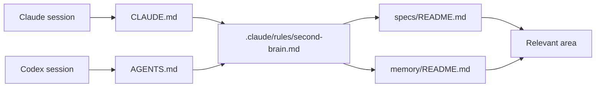

# Second-brain v3 toolkit integration

Status: draft for owner review. This describes the intended toolkit changes. It
is not an installer and does not authorize a project migration.

## 1. Boundary between toolkit components

### second-brain plugin

The `second-brain` plugin owns:

- the canonical reusable `.claude/rules/second-brain.md` source;
- the folder and file templates;
- the `second-brain` skill for setup, explanation, review, and maintenance; and
- the optional `/remember` entry point.

It does not own project initialization as a whole, work-item tracking, Git
commits, pull-request workflows, or cloud infrastructure.

### project-init plugin

`project-init` offers v3 as an opt-in project setup gate. If approved, it:

1. asks what system areas the project currently needs;
2. shows the exact folders and root files it will add or edit;
3. creates only the approved root indexes and current area folders;
4. copies the canonical shared rule into `.claude/rules/second-brain.md`;
5. adds the compact orientation section to both `CLAUDE.md` and `AGENTS.md`;
6. creates or adapts human-readable indexes; and
7. records that v3 is installed.

It does not generate empty area trees, install hooks or scripts, create a
database, or enable a background process.

### project-sync skill

`project-sync` audits an existing project for:

- the v3 shared rule;
- equivalent v3 sections in `CLAUDE.md` and `AGENTS.md`;
- `specs/README.md` and `memory/README.md`;
- the six memory type indexes;
- sensible area organization;
- broken or obviously missing index links;
- whether task status is duplicated outside work-tracker; and
- existing project documents that should be linked or reorganized.

It reports findings before changing anything.

Project-sync never mass-moves existing specifications or documentation on its
own. It proposes a project-specific organization and exact moves for owner
approval. Existing content is preserved unless the owner approves a merge,
rewrite, or deletion.

### work-tracker plugin

Work-tracker continues to own tasks. V3 may link to a work item because it
records the work that produced a decision or learning. It does not:

- mirror ticket status;
- choose the next ticket;
- manage blockers;
- prove Git landing; or
- replace `SPEC.md` or `STATUS.md` inside a work-item folder.

Work-item `SPEC.md` defines that ticket's approved scope. `specs/` defines
durable product and system behavior beyond one ticket. When a ticket changes
durable behavior, its implementation updates the applicable `specs/` document.

## 2. Existing rule reconciliation

V3 must be married to the toolkit's current rule library, not layered on top as
contradictory instructions.

When v3 is implemented:

- `keep-claudemd-current.md` keeps `CLAUDE.md` accurate and thin, but routes
  durable detail to `specs/` or `memory/`. It does not turn `CLAUDE.md` into the
  memory store.
- `wrap-up-ritual.md` invokes the v3 review and respects approval before writing
  additional durable proposals. Specification changes already authorized by
  the task remain part of that task.
- `steer-to-the-goal.md` routes current goals, next steps, and handoffs to
  work-tracker or the project's handoff document. It proposes memory only when
  the underlying context is durable beyond the ticket.
- `work-item-folders.md` continues to route all ticket state to work-tracker.
- the two retired v1 recognition rules are not installed as v3 rules. The new
  shared `second-brain.md` rule replaces their memory and knowledge routing
  role for projects that opt into v3.

Project-init and project-sync must update these selected rules as one coherent
installation. An agent must not receive one rule that says to write memory
automatically and another that says to seek approval.

## 3. Installed rule routing



### Why the full schema is not copied into both root files

Every session needs an immediate map, so the compact folder dictionary appears
in both root files. The complete templates and lifecycle instructions do not.

Keeping the complete schema in three places would make drift likely:

1. Claude's copy could change;
2. Codex's copy could change differently; and
3. the toolkit rule could become a third version.

The canonical rule plus two compact routes preserves visibility and one
detailed source of truth.

## 4. Plugin source layout

The intended toolkit implementation is:

```text
plugins/second-brain/
  README.md
  skills/
    second-brain/
      SKILL.md
      references/
        second-brain-rule.md
        folder-layout.md
        markdown-schemas.md
    remember/
      SKILL.md
```

The reusable rule source is copied into a project as:

```text
.claude/rules/second-brain.md
```

The templates remain plugin references used by the skills. They are not copied
into every project as unused template files.

## 5. New-project setup conversation

The v3 gate should remain short and understandable:

1. Explain that v3 keeps project knowledge in organized Markdown and Git.
2. Recommend the initial system areas after inspecting the project.
3. Show the proposed folder tree.
4. Ask the owner to approve, edit, or skip it.
5. Create the approved structure.
6. Explain where behavior, decisions, knowledge, and tasks now belong.

The gate does not ask the owner to choose databases, embeddings, automation,
schemas, or agent infrastructure because none is part of v3.

## 6. Existing-project adoption

An existing project may already have:

- a flat `specs/` folder;
- design or architecture folders;
- ADRs;
- runbooks;
- project notes;
- a work-tracker;
- a large `CLAUDE.md`; or
- no `AGENTS.md`.

Project-sync first maps each existing home to the proposed v3 type and area. It
then recommends one of three treatments per source:

1. **Keep and link.** The existing location is already a good canonical home.
2. **Move with approval.** The material fits v3 better and all references can
   be updated safely.
3. **Consolidate with approval.** Several overlapping documents should become
   one current document, with important history retained in Git or a clearly
   superseded record.

Adoption must not create a second copy of every existing document just to fit a
template.

## 7. First pilot

After the specification and plugin implementation are separately approved,
Anchor should be the first pilot because it is a real project with existing
specifications, work tracking, Claude instructions, Codex instructions, and
historical memory-system context.

The pilot is a project-sync exercise, not an automatic migration:

1. refresh the merged toolkit;
2. run a read-only v3 audit in Anchor;
3. show the proposed area map and exact file changes;
4. obtain separate owner approval;
5. install the rule and root routes;
6. organize only the approved current Git documents;
7. use v3 during real Anchor work;
8. collect confusing placement or retrieval cases; and
9. improve the toolkit specification before broader rollout.

The pilot starts from Anchor's current authoritative Git documents.

## 8. Implementation sequence

The smallest coherent sequence for the full v3 system is:

1. Approve this v3 product and technical specification.
2. Replace the plugin's retired placeholder behavior with the shared rule,
   templates, and agent-guided setup/review skills.
3. Update project-init and project-sync to install and audit both Claude and
   Codex routes.
4. Test the same scenarios manually with cold Claude and Codex sessions in a
   temporary repository.
5. Merge and refresh the toolkit.
6. Run a read-only Anchor pilot audit.
7. Ask before changing Anchor.
8. Refine v3 from the pilot, then offer it to other projects.

This is the full v3 architecture. The sequence controls rollout risk; it does
not reduce the product to a smaller substitute.

## 9. Verification without runtime automation

V3 does not need memory scripts or hooks. The implementation can still be
verified by:

- plugin manifest validation;
- inspecting the generated project tree;
- checking Markdown links;
- starting a cold Claude session and a cold Codex session against the same
  fixture;
- asking each agent to find the same behavior and its related decision;
- completing a sample task and confirming both agents propose useful updates;
- approving selected updates in normal language; and
- confirming neither agent writes skipped proposals.

No memory-specific runtime script or hook is installed in a project.
