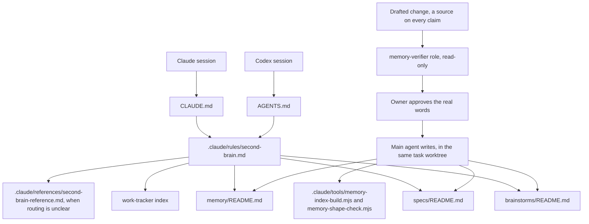

# Second-brain v3 toolkit integration

Status: current toolkit integration for the second-brain plugin.

This document defines how the approved v3 design fits the reusable toolkit.
The plugin ships the system, while each client-project adoption remains a
separately approved setup or sync action.

The toolkit is the reusable plugin marketplace. The owner selectively adopts
its tools and systems in each greenfield or brownfield project, and AI agents
install only the approved selections through `project-init` or `project-sync`.
The toolkit supplies rules, roles, skills, and templates. Each adopting
repository owns the specifications and memory created there.

## 1. Component boundaries

### 1.1 Second-brain plugin

The `second-brain` plugin owns:

- the canonical reusable `.claude/rules/second-brain.md` source, and its longer
  companion `.claude/references/second-brain-reference.md`;
- the reusable memory-verifier role instructions;
- the two scripts installed to `.claude/tools/`, `memory-index-build.mjs` and
  `memory-shape-check.mjs`;
- root, area, brainstorm, specification, and memory templates;
- the `second-brain` skill for explanation, setup, review, and maintenance; and
- the optional `/remember` entry point.

It does not own:

- all project initialization;
- work-item status or backlog management;
- Git commit, pull-request, merge, or cleanup workflows;
- Graphify or another structural-analysis system;
- cloud infrastructure;
- platform-specific background automation;
- project-specific or client-specific memory; or
- a shared cross-project memory store.

### 1.2 Project-init plugin

`project-init` orchestrates v3 installation for a new project after the owner
opts in. It obtains the source rule, role, and templates from `second-brain`
rather than maintaining another copy.

It:

1. understands the project purpose and stack;
2. recommends initial system areas;
3. shows the exact tree and root-file edits;
4. creates only approved roots and real specification areas, adding each memory
   area index with the first durable document it owns;
5. copies the canonical shared rule and its routing reference;
6. installs the memory-verifier role and both scripts in `.claude/tools/`;
7. adds compact routes to both `CLAUDE.md` and `AGENTS.md`;
8. reconciles existing continuity rules;
9. connects v3 to the configured work tracker;
10. offers an initial project-memory pass; and
11. offers `grill-me` for project discovery.

It does not create a database, capture scripts, an autonomous curator, empty
area trees, or a competing archive for raw project artifacts. It installs no
memory hooks. Guard and orientation hooks are Gate 2 and come from the
`hooks-library` plugin.

### 1.3 Project-sync skill

`project-sync` adopts v3 in an existing project through a read-only audit first.

It inventories:

- existing specifications, ADRs, architecture docs, runbooks, glossaries,
  references, project overviews, roadmaps, and knowledge stores;
- current `CLAUDE.md`, `AGENTS.md`, and `.claude/rules/`;
- current work-tracker authority;
- existing brainstorms and discovery notes;
- existing indexes, links, likely duplicates, and contradictions; and
- optional structural or repository-analysis material.

It also reports durable documents that lack a clear title, one-sentence
summary, type-appropriate structure, descriptive index entry, or contextual
relationship language. These are review findings, not machine validation
failures.

It presents a proposed area map and exact changes before writing.

It never mass-moves or duplicates existing documents merely to satisfy a
template. It keeps and links good existing homes, proposes approved moves when
they improve ownership, consolidates only with approval, and leaves uncertain
material unresolved.

Meeting notes, transcripts, communications, deliverables, and other raw project
artifacts remain in the project's ordinary scaffolding. V3 may link to them but
does not copy them into memory.

As its final adoption step, `project-sync` offers an initial memory pass based
on the read-only audit. It keeps observations, inferences, owner-confirmed
intent, and unknowns distinguishable, then proposes useful starting documents
and interviews rather than silently declaring the audit authoritative.

### 1.4 Grill-me plugin

`grill-me` owns the durable discovery interview behavior:

- ask one question at a time;
- recommend an answer;
- checkpoint every response before the next question; and
- preserve the raw interview.

When a project uses v3, `grill-me` stores its capture at
`brainstorms/<date>-<topic>.md` and adds it to the root brainstorm index.
That owner-invoked raw checkpoint is the one place anything reaches a file
without the owner approving the exact words first. It is a brainstorm, which is
never authoritative. Specifications and curated memory still go through the
draft, check, approve, save flow.

At the end of the interview, the main agent proposes any resulting
specification or memory updates. The raw brainstorm remains separate.

This matches the current grill-me default. V3 adds index and backlink behavior
without requiring grill-me to classify discovery into a system area.

### 1.5 Work-tracker plugin

Work-tracker owns:

- backlog;
- current work status;
- blockers;
- ticket relationships and dependencies;
- current handoff;
- branches and pull requests; and
- proof that completed work reached the main branch.

V3 documents may link to work items. V3 planning may explain how work items
serve a milestone. Neither duplicates live ticket state.

Work-item `SPEC.md` owns the approved scope of one ticket. A capability under
top-level `specs/` owns durable product or system behavior beyond that ticket.
When a ticket changes durable behavior, both can link to the same task while
retaining their separate authority.

### 1.6 Git workflow plugins and rules

Existing worktree and pull-request workflows own:

- creating an isolated branch and worktree;
- updating from remote;
- committing and pushing;
- opening, reviewing, and merging a pull request; and
- cleaning up a completed worktree.

V3 requires every write to stay in the requesting session's worktree, but it
does not reimplement Git commands.

Before a pull request containing specification or memory changes merges, the Git
workflow first brings its branch current. The main agent then invokes
`memory-verifier` for a read-only comparison with the latest project memory and
indexes, sized to how big the change is. Git still owns file integration;
`memory-verifier` catches duplicate homes and conflicting current truth in
different files that Git cannot identify.

## 2. Installed project architecture



### 2.1 What the root files carry and what the shared rule carries

Every session has to route correctly before it opens anything, and Codex reads
only `AGENTS.md`. So the routing schema is copied into both root files in full:
the authority map, and for every home its purpose, when to use it, and when not
to.

The shared rule carries how a save works, who does which part, and where things
go. Its longer companion, `.claude/references/second-brain-reference.md`, carries
the detail: for every document type, relationship, index, supporting file, and
optional metadata element, it explains the purpose, when to use it, when not to
use it, whether it is mandatory or optional, its authority boundary, and good
versus unnecessary examples. An agent opens the reference when routing is
genuinely unclear, not on every save. Folder indexes carry the project's actual
content map.

The copy is a real maintenance cost, accepted on purpose so the routing is never
one file-open away. Any change to the authority map, the homes, or the document
contract updates both root files in the same change, and the rule wins if they
disagree.

### 2.2 Why the memory verifier has a project role file

The reusable role file gives Claude and Codex one shared description of:

- what it may read and what it may never do;
- the three source kinds and the different check each one gets;
- what it must not raise;
- the two jobs, checking a draft and the pre-merge review;
- how the review is sized to the change; and
- the report shape for each job.

Claude may invoke it as a project agent. Codex may spawn a delegated agent
instructed to read the same role. The role is consistent even though the two
host products expose delegation differently.

## 3. Intended plugin source layout

```text
plugins/second-brain/
  README.md
  agents/
    memory-verifier.md
  tools/
    memory-index-build.mjs
    memory-shape-check.mjs
  skills/
    second-brain/
      SKILL.md
      references/
        second-brain-rule.md
        second-brain-reference.md
        folder-layout.md
        markdown-schemas.md
        orientation-snippet.md
        adoption-guide.md
        templates/
          brainstorms/README.md
          specs/README.md
          memory/
            README.md
            context/README.md
            planning/README.md
            decisions/README.md
            knowledge/README.md
            references/README.md
            domain/README.md
            operations/README.md
    remember/
      SKILL.md
```

If host plugin packaging requires agent files under another supported location,
the implementation may adapt the package layout while retaining one canonical
role source.

The installed project receives:

```text
.claude/rules/second-brain.md
.claude/references/second-brain-reference.md
.claude/agents/memory-verifier.md
.claude/tools/memory-index-build.mjs
.claude/tools/memory-shape-check.mjs
brainstorms/README.md
specs/README.md
memory/README.md
memory/context/README.md
memory/planning/README.md
memory/decisions/README.md
memory/knowledge/README.md
memory/references/README.md
memory/domain/README.md
memory/operations/README.md
```

Area folders and documents are created only when needed. Template source files
remain in the plugin and are not copied into projects as unused examples.

This preserves the complete memory schema. "Only when needed" applies to
project-specific system areas such as `authentication/`, `billing/`, or
`territory-management/`. It does not make the shared rule, its routing
reference, the memory-verifier role, the two scripts, root indexes, or typed
memory homes optional within an adopted second-brain installation.

## 4. Reconciliation with current project-init rules

V3 must replace conflicting continuity instructions rather than layering more
rules on top.

When v3 ships:

- `keep-claudemd-current.md` keeps `CLAUDE.md` accurate and thin. Durable
  details route to `specs/`, `brainstorms/`, or `memory/`.
- `wrap-up-ritual.md` uses the approved v3 completion triggers and natural
  stopping point after meaningful work. It does not require a memory review for
  ordinary responses, trivial actions, or commits.
- `offer-context-handoff.md` runs the memory check before the handoff prompt is
  written, because that moment destroys the most context and nothing can catch a
  clear after it happens. Approved items are saved; everything else is carried
  inside the prompt. Live status and next actions are still not memory.
- The `handoff` plugin's `/handoff` command performs those steps in order where
  it is installed. The rule is the backup when the owner asks in their own words
  instead.
- `steer-to-the-goal.md` routes live goals and next actions to work-tracker.
  Durable vision, roadmap, milestones, and strategic risks route to
  `memory/planning/`.
- `work-item-folders.md` retains task-state authority.
- retired v1 recognition rules are not installed as v3 operating rules.
- `.claude/rules/README.md` indexes `second-brain.md` once, rather than
  duplicating its schema.

The implementation must inspect and update every conflicting rule in the same
plugin change so agents do not receive contradictory instructions.

## 5. New-project setup

The v3 setup conversation stays short:

1. Explain that v3 keeps approved behavior, discovery, and durable project
   knowledge in organized Markdown and Git.
2. Explain that work-tracker continues to own tickets.
3. Recommend initial system areas based on the project explanation and stack.
4. Show the exact proposed folder tree and root-file changes.
5. Ask the owner to approve, edit, or skip.
6. Install the approved structure, shared rule, routing reference,
   memory-verifier role, both scripts, and routes.
7. Offer to conduct initial project discovery using `grill-me`.
8. Propose initial context and planning documents after discovery.

Project-init does not require formal project ceremonies. A project may begin
with a plain-language explanation. Stack-specific artifact folders remain part
of Gate 1 scaffolding rather than second-brain.

## 6. Existing-project adoption

### 6.1 Read-only audit

Before changing anything, project-sync reports:

- proposed system areas;
- existing documents mapped to v3 homes;
- documents already in good canonical homes;
- likely overlaps or conflicts;
- broken or stale routing references;
- live ticket state copied into documentation;
- missing Claude or Codex routes; and
- exact files it recommends creating, moving, editing, or leaving alone.

### 6.2 Treatment choices

For each source, recommend:

1. **Keep and link**
2. **Move with approval**
3. **Consolidate with approval**
4. **Leave unresolved**

Deletion is never implied by adoption. Existing history remains in Git.

### 6.3 Brownfield system mapping

A separately approved mapping exercise may inspect code, tests, metadata,
repository history, existing documentation, or Graphify output.

The result can inform:

- `memory/context/` for project and environment constraints;
- `memory/knowledge/` for reusable technical understanding;
- `memory/domain/` for business vocabulary;
- `memory/planning/` for modernization direction;
- `specs/` for verified current behavior; and
- `brainstorms/` for unknowns requiring interviews.

Repository analysis cannot establish owner intent by itself. Agents keep
observations, inferences, and confirmed requirements distinguishable in normal
language.

## 7. Main-agent and memory-verifier integration

### 7.1 Draft handoff

The main agent drafts the real words itself, then gives `memory-verifier` a
bounded task containing:

```text
The exact drafted text, in numbered pieces:
The destination path for each piece:
Where each claim came from (in a file, the owner said it, or worked out):
The owner's actual words, where a claim cites them:
Which lines the owner wrote themselves:
Current worktree:
```

This is an agent-to-agent communication guide, not a rigid machine payload.

### 7.2 Memory-verifier result

`memory-verifier` returns a verdict per claim, plus what it noticed:

```text
Draft check
- per claim: Confirmed with path and line, Wrong with what the file says, or
  Unchecked when nothing can confirm it
- Already has a home: paths owning a fact the draft repeats
- Routing: anything belonging in specs/ rather than memory/, or in both
- Shape faults: missing summary, missing Basis line, broken link
```

It runs in the foreground, so the report reaches the session that called it
without that session having to ask. It writes nothing.

Running it before the owner sees the draft is mandatory. The owner is never
asked to approve a claim nobody checked. If it cannot finish, the main agent
retries or reports the failure and keeps the task unfinished. The pull request
may open, but it does not merge as though the save succeeded unless the owner
explicitly waives it. Deferred proposals create no separate memory queue.

### 7.3 Explicit `remember`

`/remember` and phrases such as "remember this" use the same path: draft, check,
show the owner, save.

If the owner clearly instructs the system to save specific content, that is
approval for the content. The main agent still drafts the exact words, has them
checked, and chooses the canonical home without a second filing approval. If the
requested meaning is unclear, ask one focused question or propose the specific
durable takeaway first. The request does not authorize a risky or large
structural change unless that change is also made visible and approved.

There is no separate quick-write store.

## 8. Verification approach

The memory core installs no runtime scripts or hooks of its own, but the toolkit
implementation still needs proportionate tests.

### 8.1 Package and fixture checks

- Validate Claude and Codex plugin manifests.
- Initialize a temporary greenfield fixture.
- Confirm only approved roots and real areas are created, and every populated
  memory area has an index.
- Confirm both root orientation files route to the same rule.
- Confirm the memory-verifier role and both scripts in `.claude/tools/` are
  installed, and that `node .claude/tools/memory-shape-check.mjs` passes.
- Confirm all root and type indexes link correctly.
- Confirm each durable fixture document has a title, one-sentence summary,
  `Basis:` line under `memory/`, type-appropriate content, and a descriptive
  index entry.
- Confirm important links state their direction and meaning in natural
  language.
- Confirm no database, MCP, embedding, or transcript component appears, and no
  hook that writes memory. A `hooks-library` hook that enforces a rule or starts
  a review is not a finding, and neither is a script that checks a document's
  shape or rebuilds an index list from documents that already exist.

### 8.2 Cold-agent scenarios

Run the same fixture with a cold Claude session and cold Codex session:

1. Ask each to locate a capability's current behavior.
2. Ask each to find its relevant brainstorm and decision.
3. Ask each where roadmap status and ticket status belong.
4. Complete a sample requirement change.
5. Confirm the main agent drafts the real words at the approved point or a
   natural stopping point after meaningful work, without repeating the review
   after ordinary replies.
6. Confirm `memory-verifier` ran before the owner saw the draft, and that
   anything it could not confirm reaches the owner marked as unchecked.
7. Approve selected updates in natural language, and edit one of them.
8. Confirm the main agent writes only the approved content, and writes the
   edited line exactly as the owner wrote it.
9. Confirm the index builder and the shape check both ran and passed.
10. Confirm code, tests, specifications, and memory stay in one worktree.
11. Confirm skipped proposals are not written.

### 8.3 Brownfield fixture

Create an existing-project fixture with:

- a flat specification folder;
- an ADR folder;
- a roadmap;
- a glossary;
- a runbook;
- an oversized `CLAUDE.md`;
- work-tracker status copied into a current-focus file; and
- stale links.

Project-sync must report a read-only map before changes and must not mass-move,
delete, or duplicate content.

### 8.4 Parallel-session scenario

Use two worktrees that update related or overlapping documents. Confirm each
session's writes stay in its own worktree, Git exposes overlapping text edits,
and the pre-merge `memory-verifier` review reports semantic duplicates or
conflicting current truth placed in different files.

Tests may inspect generated files and links in the toolkit repository. They do
not become runtime enforcement installed in client projects.

## 9. First pilot

After the specification and implementation are separately approved, Anchor
should be the first real pilot.

The pilot sequence is:

1. merge and refresh the implemented toolkit;
2. run a read-only v3 project-sync audit in Anchor;
3. show the proposed area map and exact changes;
4. obtain separate approval before changing Anchor;
5. install the rule, role, root routes, and approved folder indexes;
6. organize only approved current Git documents;
7. use v3 during real feature work;
8. record confusing retrieval, placement, proposal, or conflict cases; and
9. refine the toolkit before broader rollout.

Anchor's current Git documents are the starting evidence. No legacy external
memory is automatically treated as current truth.

## 10. Implementation and rollout sequence

The complete toolkit implementation covers steps 1 through 9. Project rollout
begins at step 10 and remains separately approved:

1. Refine and approve the v3 technical specification.
2. Implement the shared rule, its routing reference, the memory-verifier role,
   the two scripts, templates, and v3 skills in `second-brain`.
3. Reconcile the general project rules that overlap completion and continuity.
4. Update `grill-me` for v3 area-aware capture while preserving its standalone
   behavior.
5. Update `project-init` to offer and install the complete v3 system.
6. Update `project-sync` to audit and adopt v3 safely.
7. Add greenfield, brownfield, cold-agent, and parallel-worktree verification.
8. Update all plugin READMEs, the toolkit map, marketplace descriptions, and
   versions.
9. Open a pull request and obtain merge approval.
10. Refresh the toolkit on the pilot machine.
11. Run the read-only Anchor audit.
12. Ask separately before changing Anchor.
13. Pilot during real work, refine, and then roll out to other projects.

This sequence delivers the full architecture. It separates toolkit
implementation from changes to a client project.

## 11. Explicit implementation exclusions

Do not add:

- a database or cloud service;
- a memory MCP server;
- embeddings or semantic retrieval;
- a hook that captures, recalls, places, or writes memory;
- a natural-language approval parser;
- an engine that judges what a document says;
- transcript capture;
- an autonomous or scheduled curator;
- a fixed proposal count;
- automatic Git operations; or
- automatic project migration.

A hook that enforces a rule or starts the durable review belongs in the
`hooks-library` plugin, not here. The memory core stays hook-free; what it
forbids anywhere is a hook that writes.

`memory-shape-check.mjs` is installed in client projects and is not the excluded
engine. It reads and reports, changing nothing, and it looks only at a
document's shape: a title, a one-sentence summary, a `Basis:` line under
`memory/`, and an entry in the nearest index. It never judges what a document
says.

## Brainstorms that informed this integration

- [Second-brain v3 project memory discovery](../../brainstorms/2026-07-28-second-brain-v3-project-memory.md)
  - Defines the shared rule, the dedicated memory role, worktree and
    pull-request boundaries, greenfield and brownfield usage, and review timing.

## Related

- [Second-brain v3 overview](README.md)
  - Gives the complete system map in plain language.
- [Technical specification](TECHNICAL-SPECIFICATION.md)
  - Defines normative v3 behavior.
- [Markdown schemas](MARKDOWN-SCHEMAS.md)
  - Defines the project documents installed and maintained by the toolkit.
