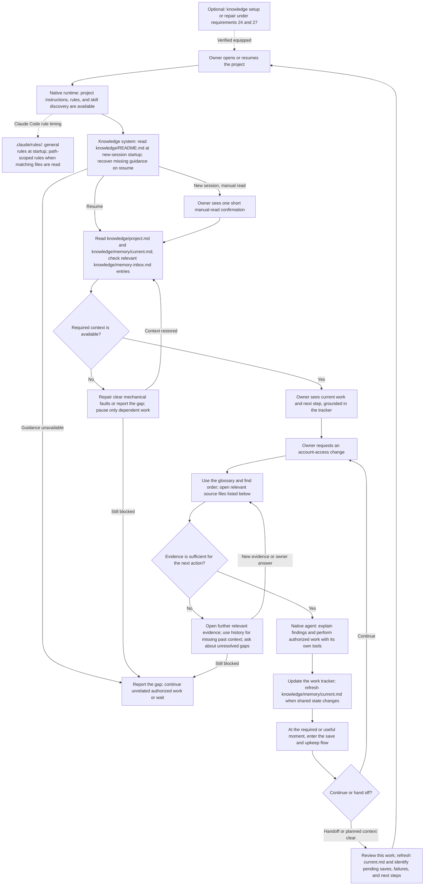
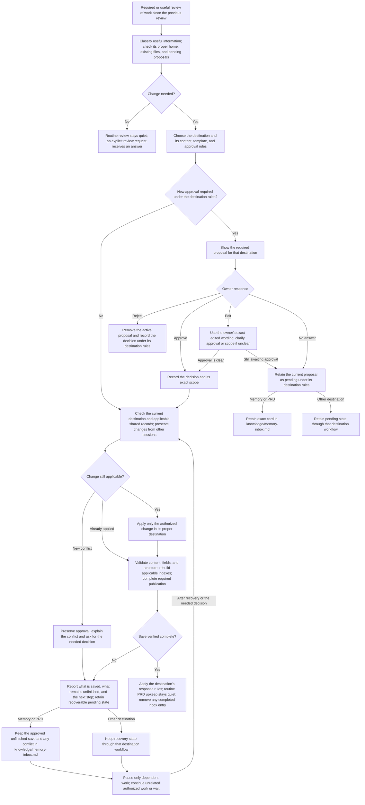

# The project second brain

## Contents

- [Why this exists](#why-this-exists)
- [How the owner works](#how-the-owner-works)
- [Where it sits](#where-it-sits)
- [How to read this](#how-to-read-this)
- [Project folder layout](#project-folder-layout)
- [A session, start to finish](#a-session-start-to-finish)
- [1. Plain parts only](#1-plain-parts-only)
- [2. The agent follows this system](#2-the-agent-follows-this-system)
- [3. Reliable behavior without reminders](#3-reliable-behavior-without-reminders)
- [4. Picks up where the last left off](#4-picks-up-where-the-last-left-off)
- [5. Check memory first](#5-check-memory-first)
- [6. Cite the source](#6-cite-the-source)
- [7. Speaks the project's language](#7-speaks-the-projects-language)
- [8. Read the real documentation first](#8-read-the-real-documentation-first)
- [9. Saving is frictionless](#9-saving-is-frictionless)
- [10. Approval before any write](#10-approval-before-any-write)
- [11. What counts as memory](#11-what-counts-as-memory)
- [12. What never counts](#12-what-never-counts)
- [13. Working memory](#13-working-memory)
- [14. Memory file shape](#14-memory-file-shape)
- [15. How the words are written](#15-how-the-words-are-written)
- [16. Requirements documents](#16-requirements-documents)
- [17. Procedures become skills](#17-procedures-become-skills)
- [18. Where information goes](#18-where-information-goes)
- [19. The find order](#19-the-find-order)
- [20. The save card](#20-the-save-card)
- [21. Indexes and the checker](#21-indexes-and-the-checker)
- [22. Keeping current truth clean](#22-keeping-current-truth-clean)
- [23. Learning what to save](#23-learning-what-to-save)
- [24. Request knowledge operations in plain language](#24-request-knowledge-operations-in-plain-language)
- [25. Codex](#25-codex)
- [26. Built the way Claude Code's documentation says](#26-built-the-way-claude-codes-documentation-says)
- [27. Installed once, turned on per project, and checked](#27-installed-once-turned-on-per-project-and-checked)
- [28. Pending memory inbox](#28-pending-memory-inbox)
- [29. Preserve agent judgment with narrow safeguards](#29-preserve-agent-judgment-with-narrow-safeguards)
- [30. Integration with the toolkit OS and other components](#30-integration-with-the-toolkit-os-and-other-components)
- [Potential paths to explore](#potential-paths-to-explore)

## Why this exists

The owner should not have to remember the state of the project himself. The
agent remembers it for him.

- The agent knows more than the owner about what has been going on in this project.
- It gets smarter over time, because what it learns is written down and read back.
- Every new session feels like talking to the same agent, not a stranger who has to be caught up.
- It is the agent's lasting memory, tuned so the agent learns when something is worth keeping.
- The owner can edit knowledge files directly. Requirement 1 defines recovery when an edit breaks a link or required structure.

Two ways to fail, and both are bad. Remembering too little means the owner
explains the same thing again. Remembering carelessly is worse, because a later
agent believes something stale and acts on it.

## How the owner works

The owner routinely runs several parallel agent conversations in the integrated
terminals of one VS Code project or directory. Sessions may use different
models or harnesses. Much of the work is complex requirements gathering,
solution design, and reasoning. Context fills quickly; a session may have its
context condensed, be cleared, or be replaced while other sessions keep working.

The owner should never have to babysit knowledge upkeep: remind an agent to
look something up, tell it where information belongs, repeat the save rules,
or reconstruct what another session did. He approves lasting meaning and
proposed removals. The agent notices the need, finds the right instructions,
prepares the proposal, and completes authorized upkeep itself.

Loading all the instructions at startup and hoping they remain in the agent's
attention does not meet this requirement. The system must guide the agent at
the moment it needs to find, propose, write, update, or remove information.
The agent keeps its freedom to reason, investigate, and design within those
boundaries. Requirements 2, 13, 18, and 19 define this behavior.

## Where it sits

The knowledge system is a component of the [Toolkit Operating System](toolkit-operating-system.md).
This PRD includes the OS changes required for knowledge behavior to work within
that larger system. Requirement 30 defines the integration responsibilities
and the boundaries with other components.

The toolkit ships a whole set of parts for working with an AI agent on a
project: rules, hooks, skills, the work tracker, and captured
outside documentation. The second brain is two of those parts. It is the memory,
and it is the record of the product's required behavior, user experience,
process requirements, and reasons, which is what a PRD holds. It keeps what
is true in this project and why. Anything else
belongs to another part, and the second brain does not keep it. A repeatable
procedure goes to a skill. A standing instruction goes to `.claude/rules/`,
scoped through the runtime’s supported rule behavior. Live status goes to the
work tracker. How one item gets built and its build order belong in its solution
design and work-item plan, kept with or linked from the chosen tracker. Outside documentation
the agent can use goes to `ai-external-knowledge/`. Requirement 18 is the full
list.

The system sets a small number of required responsibilities. The agent chooses
how to investigate, reason, and solve the task while meeting them. For example,
it decides which information meets the memory-selection rules, but still obtains
required approval before saving. This is not a fixed script for every action.
Requirements 3 and 29 distinguish reliable outcomes from attempts to control
the agent's thinking.

Judge every requirement below against that whole set of parts. If a requirement
moves work into the second brain that another part already owns, the requirement
is wrong.

## How to read this

- The status is `proposed`. This document describes the finished system. It does not describe how the system works today.
- The numbered requirements say what must happen, what the owner sees, the process and decision rules, and the required data model. A closing section records preferred design directions and examples separately. Detailed implementation choices and build plans belong with the work item.
- This document holds the goal, the requirement, and the behavior. Each requirement is written clearly enough that a builder can design from it without guessing the intended behavior. The solution design may choose among different ways to meet the same requirement; the PRD does not make that implementation choice.
- When the owner gives a clear answer or correction within authorized refinement of this document, the agent writes it here in that same reply under requirement 10. It is never logged on an issue instead, because an issue comment gets lost and this document then never gets updated.
- Mike authorized ongoing refinement of this PRD and approved the drafting-permission rule in requirement 10 on 2026-09-10. That permission covers faithful capture of his answers and corrections; it does not approve every requirement, a solution design, or implementation.
- Requirement 3 defines the reliability outcomes and the evidence needed to demonstrate them. The solution design chooses how documented harness capabilities deliver those outcomes and identifies any limits.
- "A session, start to finish" follows one session through every requirement, so the numbered list is easier to follow.
- On 2026-09-12, Mike authorized importing the agreed direction from the linked ChatGPT conversation and decision report, interviewing him, and saving clear answers directly to this PRD on `main`. This continues drafting permission; it does not approve the complete requirements or authorize implementation.
- The closing section records the preferred solution philosophy and high-level architecture, with examples and open design questions. A preferred direction is not a verified platform capability or a completed solution design.
- Where this document and `knowledge/README.md` disagree, this document wins. Each disagreement is named in the place it happens, and `knowledge/README.md` is then changed to match this document.

## Project folder layout

```text
project/
├── brainstorms/
├── ai-external-knowledge/
│   ├── README.md
│   └── captured-topic/
│       └── README.md
└── knowledge/
    ├── README.md
    ├── project.md
    ├── memory/
    │   ├── memory-index.md
    │   ├── memory-entries/
    │   │   ├── terminology-glossary.md
    │   │   ├── memory-topicarea1.md
    │   │   └── larger-topic-area/
    │   │       ├── subtopic-one.md
    │   │       └── subtopic-two.md
    │   └── current.md
    ├── prds/
    ├── .obsidian/
    └── system-guide/
        ├── system-guide-index.md
        └── system-guide-entries/
            ├── system-guide-area1.md
            └── system-guide-area2.md
```

The topic and area filenames are examples. Memory topic files and optional
topic folders follow requirement 14. The outside-documentation index and
captured topics follow requirements 8 and 21. System Guide remains a separate,
optional component; this layout names its home when enabled. Its index points
to pages in `system-guide-entries/`. Brainstorms live in `brainstorms/` at the
project root, outside `knowledge/`.

The PRD index and parent-and-child PRDs remain under `knowledge/prds/` as
requirements 16 and 21 describe. The pending inbox remains at
`knowledge/memory-inbox.md` under requirement 28; the supplied layout did not
specify a different home for it.

When adopting this layout, preserve existing content and working links.
Instructions and indexes must lead to the current locations.

**Check:** compare the project folders with this layout. Each memory topic has
one file or one topic folder in `memory-entries/`; the glossary is also there.
Current work and memory lessons are beside that folder. An enabled System Guide
has its own index and entries folder.
Brainstorms are at the project root. Existing content remains reachable.

## A session, start to finish

**Example:** an existing project is evaluating a change to account access before
its next release. The owner returns to the project, investigates the change,
settles requirements, and later hands the work to another session. The example
uses the planned folder layout. Topic filenames are illustrative.

The flow includes **native runtime behavior**, which Claude Code or Codex
already provides, and **knowledge-system behavior**, which this PRD requires.
Native steps provide context for the complete process; the toolkit does not
reimplement them. The numbered requirements define the behavior. Solution
design selects any additional triggers or enforcement mechanisms.

### Session flow



The recovery arrows resume after the missing context or decision becomes
available; they do not require repeated retries while blocked. The agent can
continue unrelated authorized work. A normal turn does not require a handoff,
a new proposal, or a visit to every source.

### 1. Start or resume the session

The native runtime makes project instructions, rules, and available skills accessible
through its supported mechanisms, including files such as `CLAUDE.md` or
`AGENTS.md`. This step supplies context for the walkthrough; its implementation
is outside the knowledge system.

In Claude Code, [native rule handling](https://code.claude.com/docs/en/memory#path-specific-rules) includes:

- Project rules in `.claude/rules/`. Rules without a `paths` field load at startup when project rules are enabled.
- Rules with YAML `paths` patterns. These load when Claude reads matching files, rather than all loading at startup.
- Personal rules in `~/.claude/rules/`, which apply across projects.

Codex uses its supported instruction mechanisms under requirement 25.

At a new session start, the agent reads `knowledge/README.md` and gives the
single short confirmation in requirement 2. On resume or context loss, it
recovers guidance that is missing or no longer current. It does not repeat the
full manual on every message.

The agent uses `knowledge/project.md` to locate project resources,
`knowledge/memory/current.md` to understand shared work, and
`knowledge/memory-inbox.md` to recover relevant pending proposals or unfinished
saves. It opens the linked tracker record for actual work status and approvals.
The owner receives a concise briefing: the account-access review is still open,
the earlier constraint remains relevant, and the next step is to check the
proposed change against that constraint. It cites the supporting overview and
tracker record under requirement 6. When the briefing uses project shorthand,
it applies the glossary under requirement 7 before presenting it. Requirements
2–4, 13, and 28 define startup and recovery behavior.

### 2. Interpret the request and open the right sources

The owner asks whether account access should change for this release. The agent
uses the glossary, source roles, and find order in requirements 5–8 and 19.
It chooses search terms, tools, and investigation depth. Already-available,
relevant, current information can be reused.

| Source in this example | What the agent reads and why |
| --- | --- |
| Shared work and tracker | `knowledge/memory/current.md`, then its linked work item, to establish current scope, approval, blocker, and next step. |
| Instructions and skills | Applicable root and folder instructions, rules, and a relevant skill such as `.claude/skills/<name>/SKILL.md`, or the supported harness equivalent, before using that procedure. |
| Project terminology | `knowledge/memory/memory-entries/terminology-glossary.md` to resolve shorthand before searching for the wrong concept. |
| Earlier decisions | `knowledge/memory/memory-index.md`, then `knowledge/memory/memory-entries/account-access.md`, to read the earlier decision and its evidence. |
| Required behavior | `knowledge/prds/prd-index.md`, then the relevant PRD under `knowledge/prds/`, to establish what users must be able to do. A proposed requirement does not prove current behavior. |
| Existing system | When enabled, `knowledge/system-guide/system-guide-index.md`, then the relevant page in `system-guide-entries/`. The agent checks code or live evidence when the question concerns what exists now. |
| Vendor documentation | `ai-external-knowledge/README.md`, then the relevant captured page, when the answer depends on vendor behavior. Missing or outdated evidence is handled under requirement 8. |
| Earlier conversation | Available project session history, if the earlier sources leave a relevant gap. Historical claims are checked before being presented as current. |

The owner sees an answer supported by the relevant sources, using the citation
format in requirement 6. If the evidence leaves a consequential gap, the agent
identifies it and asks a focused question. The table shows the available parts
of lookup; it is not a script that searches every folder for every request.

### 3. Work and maintain shared context

The agent performs authorized research, design, or implementation using its
native reasoning and tools. Reading a proposed PRD does not authorize building
it. The delivery workflow owns the work item's status, approvals, and build plan.

When useful shared context changes, the agent rereads and updates
`knowledge/memory/current.md`, preserving other sessions' active work and
linking to the tracker instead of copying it. Unverified findings stay labelled.
Disposable scratch details remain in the conversation. When the agent updates
the shared overview, it tells the owner in one line. Requirements 4, 12, 13, and
18 define these boundaries.

### 4. Review, route, and save

The investigation may produce a lasting release decision, a PRD correction,
or a repeatable project procedure. Each follows its own destination rules.
The agent checks the selection rules, exclusions, existing files, and
relevant owner feedback under requirement 23 before proposing memory.
Requirement 18 determines each destination.



The diagram's general steps apply through each destination's own workflow.
The memory inbox and direct-default-branch publication rules apply to knowledge
saves; they do not become a new delivery procedure for skills, rules, or System
Guide content. Requirement 20 defines proposal formatting and requirement 10
defines approval. Useful owner feedback on memory proposals is retained and
applied under requirement 23.

| Information produced | Destination and resulting action |
| --- | --- |
| Lasting account-access decision | Update the existing topic in `knowledge/memory/memory-entries/` after required approval. Keep its source and required fields; avoid a second file for the same topic. |
| Significant result the project will look up later | At task end, propose an event memory with the result and output location under requirement 11. Routine work produces no episode proposal. |
| Clear correction within authorized PRD refinement | Update the named PRD in `knowledge/prds/` without asking for the same permission again. A new requirement recommended by the agent still needs agreement. |
| Shipped changes to behavior or requirements from authorized work | Maintain all applicable PRDs under requirement 16, validate, commit, and push without a new save card or routine notification. Respect explicit publication holds. |
| Reusable project procedure | Propose a project skill and use that destination's approval and delivery rules. |
| Explanation of an existing part | Use the enabled System Guide's own workflow and its `knowledge/system-guide/` location. |
| New project shorthand | Propose an update to the existing glossary table. |
| Standing instruction | Use the project's root instructions or rules workflow, rather than saving it as memory. |
| Changed work status or continuation context | Update the tracker or `knowledge/memory/current.md` as appropriate; link to the detailed record. |
| Raw exploration worth retaining | Use `brainstorms/`; it remains unchecked exploration, not approved knowledge. |
| Outside reference material | Use the captured-documentation workflow under `ai-external-knowledge/`, keeping the source and capture date. |
| Low-value or disposable detail | Keep it out of lasting knowledge and do not show a memory proposal for it. |

For a memory or PRD save, completion includes the approved meaning, required
format, generated indexes, validation, and publication required by requirements
9, 14–16, and 21. A local write alone does not establish publication. Pending
proposals and approved unfinished saves follow requirement 28, including
conflicting changes and recovery without duplicate writes.

### 5. Repair or clean up when needed

These paths can begin during lookup, work, or save review. They return to the
same approval and validation rules rather than creating a second save process.

| Condition | Action and return to the session |
| --- | --- |
| Owner renamed, moved, or deleted a file | Apply requirement 1: automatically repair only a clear mechanical fault that preserves intent. Ask before choosing unclear meaning or restoring deliberately deleted content. Resume dependent work after recovery. |
| Existing knowledge is duplicated, conflicting, or no longer useful | Use requirement 22 for a review across knowledge or an operation on one file. Lasting changes still require the appropriate approval. |
| Setup is missing, disabled, outdated, or broken | Use the setup or repair requirements in 24 and 27. Activating a project requires its owner's approval. |
| A request names an operation in ordinary language | Provide the corresponding outcome in requirement 24. Only the applicable operations are needed. |

### 6. Hand off and continue later

Before a handoff or planned context clear, the agent reviews this work, refreshes
`knowledge/memory/current.md`, and identifies relevant entries in
`knowledge/memory-inbox.md`. The tracker holds detailed delivery state; the
shared overview gives the next session its entry points and next step.
Before opening a pull request or closing the work item, the required review
also covers the work being handed over.

An unanswered proposal remains pending. An approved unfinished save remains
recoverable. Neither is presented as completed knowledge. The agent reports any
sharing failure so the owner knows what another session cannot yet see.

The next session checks the dated overview against its linked tracker and
sources, recovers relevant pending work, and continues without making the owner
repeat settled decisions. Requirements 3, 4, 9, 13, 19, and 28 govern this
continuity on every supported harness under requirement 25.

## 1. Plain parts only

- Every piece of knowledge this system keeps is a plain text file in this repository, and those files are the only copy. No database. No background writer. No separate store the owner cannot open.
- Built from what Claude Code already ships: rules, hooks, skills, Markdown files, and Git. Nothing else.
- Reuse existing toolkit parts and documented harness capabilities before adding a mechanism. Any new mechanism must name the requirement an existing part cannot meet. The knowledge system does not introduce another work tracker or a second owner of another component's content.
- The owner can read, edit, move, or delete knowledge files by hand. The agent respects the resulting content rather than silently undoing the owner's changes.
- If an edit breaks a link or required structure, the agent repairs it automatically only when the intended fix is clear and preserves meaning. Examples include updating links after an unambiguous rename and rebuilding an index.
- The agent asks before a repair that could change meaning, choose between unclear destinations, or restore deliberately deleted content. It reports the affected file and the decision needed rather than guessing.
- Until the problem is resolved, only work that depends on the broken information pauses. Unrelated authorized work continues under requirement 3.

**Check:** rename a knowledge file by hand. The agent updates its links and
rebuilds the index without asking when the destination is clear. Delete a file
deliberately: the agent does not restore its content without approval. Make a
change with two plausible repairs: the agent explains the choice and asks. Only
dependent work pauses while that decision is pending.

**Check:** list every part the system is built from. Each one is a rule file,
a hook, a skill, a Markdown file, or Git.

## 2. The agent follows this system

- In every session, the agent follows the knowledge system: when to save, what to save, how to save, where to save, what to check first, what to cite, and what never to write.
- Reading a rule is not enough. The agent has to actually do what the rule says, every time. Example: requirement 9 requires a save review at the end of meaningful work. The test is whether the right proposals, authorized saves, and pending state result, not merely whether the agent read the rule.
- It follows the system whether or not the owner mentions it. The owner never has to remind it.
- At a new session start, the agent reads the canonical knowledge-system manual at `knowledge/README.md` and shows the owner one short confirmation, such as “I’ve read the knowledge manual.” Show it once after reading, without a checklist or repeated confirmations on normal turns. The manual explains the knowledge homes, what belongs and does not belong in each, selection and proposal rules, approval, and file conventions, with pointers to each component’s detailed guidance.
- If the manual or other required guidance is unavailable, the agent reports the missing source and pauses only work that depends on it. Unrelated authorized work may continue. It never confirms reading an unavailable manual.
- A small map is available at startup and whenever context is condensed, cleared, or resumed. It points to the current operating instructions, information homes, indexes, and the checks that apply. Detailed rules, templates, and knowledge are reached when needed; the whole knowledge base and every procedure are not loaded up front.
- Before a lookup, the agent establishes the applicable find order. Before proposing or making a knowledge change, it establishes the destination rules, exclusions, approval rules, file fields, template, and writing standard. It follows the current instructions for that operation even late in a long session. Already-read guidance can be reused while it remains available and current. Missing guidance is opened again before the affected operation proceeds.
- The same guidance applies when the owner changes tasks or another session changes the relevant records. A completed check for an earlier task does not establish that the new task's knowledge was checked.
- The system is responsible for bringing the needed guidance back at these moments. A one-time startup briefing or the owner repeating a rule is not sufficient. Which documented harness mechanism delivers that guidance and the requirement 3 checks is the design's job.
- The agent uses judgment to understand meaning, choose relevant sources, reject low-value candidates, and write a useful proposal. It cannot use that judgment to skip the system's required lookup, approval, validation, or upkeep moments.
- Following is demonstrated, not assumed. Requirement 3 defines the outcomes, verification scenarios, and handling of missed or incomplete operations.

**Check:** at a new session start, the owner sees one short confirmation after
the agent reads the manual. Normal turns contain no repeated confirmation or
startup checklist. Make the manual unavailable: no confirmation is shown, the
missing path is reported, and only dependent work pauses.

**Check:** run a whole session without mentioning memory once. At every moment
this document names, the agent does what this document says. Any moment where it
did not is identified during verification and handled under requirement 3.

**Check:** run a long requirements or design conversation, condense its context,
then introduce a correction, a lasting decision, and a routine detail that must
not be saved. Without a reminder from the owner, the agent finds the current
guidance, routes each correctly, uses the standard proposal and file shape,
and waits for the required approval. Repeat after switching tasks and in a
fresh session on each supported harness. An initial briefing alone does not
pass this check.

## 3. Reliable behavior without reminders

The owner must be able to rely on knowledge upkeep throughout long and parallel
sessions. Reading instructions once is not enough. The system brings back the
needed guidance, checks the required conditions, and makes an unfinished or
failed operation visible without waiting for the owner to notice.

### Required outcomes

- Before answering or acting on project information, the agent checks the relevant knowledge under requirement 19. Relevant, current sources already available in context can satisfy that check. A check for an earlier task does not cover a different task automatically.
- An answer or proposal based on saved knowledge identifies its supporting source under requirement 6. This applies however the agent found or opened that source. A path attached to a search result alone does not establish that the answer is supported.
- The external-knowledge index is reachable from the small map. The agent opens relevant outside documentation before relying on it, as requirement 8 requires.
- A save review happens at every moment in requirement 9. Opening a pull request or closing a work item requires that review for the work being handed over. At the end of a turn involving real work, the review stays internal unless there is something to approve, a save requiring notification, or a problem. Requirement 16 keeps routine PRD upkeep quiet. At handoff, identify relevant pending state under requirement 28. An explicit request for a save or review still receives a clear answer, including when nothing qualifies. An existing inbox entry alone does not satisfy a new review.
- Lasting knowledge is changed only within the owner's approval. Proposals follow the standard format, and a proposal missing required information is corrected before requesting approval. A save is not reported complete until its content, required fields, indexes, and publication have been checked. Failed checks leave the save unfinished.
- When a required check or save was missed, the agent identifies the gap and performs the needed review or recovery within existing approval. It never claims the missing check happened or asks the owner to reconstruct the session for it.

### How reliability is demonstrated

The solution design identifies which conditions the supported harness can
check or prevent mechanically, which depend on the agent understanding meaning,
and how the latter are guided and verified. Use existing toolkit and documented
harness capabilities first. A custom gate, reply parser, single retrieval route,
or session counter is not required merely because it could be built.

The required outcomes remain mandatory. Any unsupported protection or remaining
reliance on agent judgment is stated in the design and project setup report,
with its practical effect and recovery behavior. Do not describe a reminder as
a guaranteed block, or claim that counts prove the right information was found
or saved. A reported limitation is not evidence that the requirement is met.

**Check:** run representative sessions on every supported harness: a fresh
session, a long reasoning conversation with context condensed, a task switch,
and parallel sessions changing shared knowledge. Include a known fact, a
correction needing approval, an already-approved save, a low-value detail that
must stay out, a failed save, and a handoff. Verify the resulting proposals,
source-backed answers, saved files, and recovered state against the expected
outcomes. The owner supplies no reminders. Record failures and gaps; reading a
rule, calling a tool, or increasing a counter alone does not pass the check.

### A failure pauses the affected work

When a knowledge save fails, pause that save and any work that depends on its
successful completion. Continue unrelated work that can be done accurately
within existing approval. One failed save does not stop the whole session.

The agent says what failed, what was actually saved, what remains unfinished,
which dependent work is waiting, and the next step. It fixes what it can within
existing approval and permissions. If it cannot finish, it reports the blocker
and never claims that the save or dependent work is complete. This applies to
validation and publication failures as well as a missing required approval.

**Check:** make a knowledge save fail while the session has one task that needs
the saved result and another that does not. The save and dependent task remain
unfinished; the agent reports the failure and continues the unrelated task.
Once the save succeeds, the dependent task can resume under its existing
approval.

## 4. Picks up where the last left off

- The owner comes back after two days, asks "what were we working on?", and the agent answers.
- The answer covers what is in progress, what happened last time, and which session handed off to which.
- The owner never pieces this together himself.
- So `knowledge/memory/current.md` is kept up to date as work happens, across sessions, not only at the end of one.
- Updates to it are quick and short. The agent makes them on its own, without asking, and tells the owner in one line that it did. This file is not lasting memory, so a wrong line costs little and the owner can fix it by hand. A stale file costs a lot more.

**Check:** work in one session, close it, open a fresh session two days later and
ask "what were we working on?". The agent answers correctly without reading any
transcript.

## 5. Check memory first

- When the owner asks something, or the agent starts a task, the agent first checks whether this project already knows the answer, already solved it, or holds useful context.
- It brings that up without being asked.
- This check is required for both questions and tasks. Use relevant, current context already available rather than repeating a search solely to record another search. Requirement 3 defines reliability and verification.

**Check:** ask about something already saved. The agent answers from the saved
file and names it, instead of searching the code or asking the owner.

## 6. Cite the source

- Whenever the agent checks memory, a PRD, a saved session, or the outside documentation folder and finds something, it says what it found and, on the line right below, where it found it.
- What that line carries: the file path. For something found in a past session, the name and date of that session. For an outside documentation page, the path of the page and the date the page was captured.
- This covers an answer, a past fix, and any context the agent brings up.
- This happens every time. It is never optional, and never only when the owner asks.
- Why: the owner has to be able to see that the answer came from what this project actually knows, and go and check it himself.

**Check:** the agent says "the project already has this". The line right below
names the file it came from, and the owner can open that file and find it there.

## 7. Speaks the project's language

The system ships a glossary: one file, `knowledge/memory/memory-entries/terminology-glossary.md`. It maps the
owner's words and the client's shorthand to the real thing, which may be a field
name, a system, a person, or a process.

- From the first message of every session, the agent uses the glossary's meanings without being told to. How it gets them is the builder's choice.
- When a term in the glossary is used, the agent applies it and does not ask.
- When a term is unfamiliar, first use the conversation, glossary, and relevant project sources to resolve it. Ask one focused question only when uncertainty remains that could change the answer or action. Propose a glossary entry when the mapping is useful recurring project shorthand, through the normal card and approval flow.
- The glossary has a title, one sentence explaining its purpose, and one alphabetical Markdown table, with one short row per term. Use the template below. No heading or paragraph for each term; keep every cell brief.
- Put alternate names in the same row. If a term means different things in different systems, clearly identify the context.
- Keep only a short caution in the table. Link to detailed explanations or important history in their proper home under requirement 18. Their length does not make them memory.
- Update the existing row when its meaning changes; remove obsolete or duplicate wording. Do not append another account of the same meaning.
- Record the source and date per row, distinguishing reported meanings from verified ones. Clearly mark unresolved meanings instead of presenting them as settled.
- Add terms that need explanation in this project, not every ordinary word.
- Resolve project shorthand before tier 4 so searches use the intended names. Reuse a mapping already established and current; an unfamiliar word alone does not require a new glossary entry.
- The owner's example: he said "match on the discovery email field and the core email field", and the agent knew exactly which two fields those were, like a colleague who had been on the project for years.

### Glossary template

The file title is "Terminology glossary",
followed by this purpose sentence and table. The PCO row illustrates the format;
each project supplies its own terms and sources.

Project words and shorthand, what they mean, and what they refer to.

| Term / aliases | Plain meaning | Refers to | Watch out | Source / date |
| --- | --- | --- | --- | --- |
| PCO | Patient Care Operations | The PCO department | Older documents contain an incorrect expansion. | Mike, 2026-09-08; reported |

**Check:** use a known term, then an unfamiliar term whose meaning is clear
from a project source. The agent resolves both without asking. Use a term with
two plausible meanings that change the action: it asks one focused question.
It proposes a glossary entry for a useful recurring mapping, not every new word.

**Check:** scan a glossary containing several terms, alternate names, a meaning
that differs between systems, and an unresolved term. The table stays compact
and alphabetical, identifies the different contexts and uncertainty, and names
each row's source and date. Updating a meaning edits its row; detailed history
is linked rather than expanded into paragraphs under the term.

## 8. Read the real documentation first

- `ai-external-knowledge/README.md` is the index of captured outside knowledge. It uses the same generated, grouped link-and-summary format as the memory and PRD indexes in requirement 21. Each topic entry links to its captured entry page; it does not copy the documentation into the index.
- The project's small knowledge map points to this index. During lookup, the agent scans it to decide whether captured documentation is relevant. A current scan already in context can be reused; a changed topic list or lost context requires a fresh scan.
- Before running a repeatable process or working out a fix that depends on a captured topic, the agent opens the relevant page. Example: before changing a hook, it reads the captured Claude Code page about hooks instead of relying on what it already thinks it knows about hooks. Unrelated topics are not opened.
- One folder per captured topic. Its entry page supplies `group` and `summary` in YAML frontmatter for the index, and records the original source address and capture or refresh date. The summary states what the topic covers and when it is useful. These are outside-documentation fields; memory approval, confidence, and status fields do not apply.
- Adding, refreshing, moving, or removing a captured topic rebuilds and checks its index as part of the same upkeep. Requirement 21 owns the shared index format; outside-documentation upkeep owns the captured sources and their metadata.
- Captured documentation is outside source material, not approved project truth. The agent checks whether its date and version are suitable for the task. When a missing or outdated page matters, it checks the current original source when access allows, or states the gap. It never presents an old capture as verified current behavior.
- The agent judges which outside topics are relevant, then follows the required source checks before relying on them. Requirement 3 defines how this behavior is demonstrated.

**Check:** ask for something a captured topic covers without naming the folder.
The agent finds the topic through the index, opens the relevant page before
acting on its claims, and cites the page and capture date. An unrelated topic
is left unopened. Refresh or remove a topic and check that the index follows.
Repeat with an outdated capture: the answer identifies its age and checks the
original source or states what could not be verified.

## 9. Saving is frictionless

- A save needing new approval is one short card and one yes, whether it is a memory or a product requirements document. Existing authority covers PRD refinement under requirement 10 and automatic upkeep after shipped work under requirement 16; neither needs another card and yes for the same scope.
- No long review. No back and forth. No reading a full file before deciding.
- The agent proposes at the right moment on its own. The owner never has to remember to ask.
- Five moments force a save review: a work item finishes or closes, a pull request is being opened, a handoff or a context clear is coming, a turn ends after real work was done, and any time the owner says to save something. Requirement 3 defines the required result and how these moments are enforced.
- The other moments are the agent's own judgment. It should propose a save when useful: a real problem here has just been fixed, a commit is coming, or relevant context changed, such as a new person, a role change, a tool switch, a stale fact found, or a data-authority decision. A missed candidate is reviewed at the next required moment.
- The owner saying "remember this" starts the save flow that leads to a card. It is not permission to write, and it skips no step.
- The save review is that same flow run over everything the session did since the last one. It gathers candidates, drops any that fail requirements 11 and 12, checks for existing inbox proposals, and shows one card per new candidate needing approval. Already-authorized saves proceed under requirement 10. During routine work, speak up only for something needing approval, a completed save that requires notification, or a problem; do not report that nothing needs saving. Routine PRD upkeep follows requirement 16's quiet completion rule. Do not repeat an unchanged unanswered card at each review. An explicit request for a save or review still receives a clear result, and handoff identifies relevant pending state under requirement 28. Requirement 3 requires the review even when it produces no visible message. Quiet review does not require a background service.
- When approved, memory or PRDs are saved directly to the default branch and pushed!!! They are not lost in worktree branches or buried in something that a future agent would not easily find.
- A save is finished only when the file is on the default branch and pushed, and not before.
- An approved knowledge save is not deferred into a feature branch, pull request, or separate draft. This holds even when the session is doing its other work on a branch. The save still goes straight to the default branch. The session's own branch gets the saved file later, whenever someone merges or pulls the default branch into it. The pending inbox in requirement 28 preserves unanswered proposals and interrupted saves; it never replaces completing an approved save.
- One yes finishes the owner's part for a save requiring a proposal. He runs no Git command and does nothing else. The save completes on its own, and the reply tells him it is done or tells him it failed. Routine PRD upkeep needs no separate success message under requirement 16. Whether the writing happens inside that reply or just after it is the design's job, so long as a failure is never silent.
- If the push fails, the agent says so in that same reply and the save is not finished. Requirement 3 sets what pauses and what can continue. Nothing is ever parked silently.
- Completed knowledge has one authoritative destination. Unfinished proposals have one known inbox, which agents maintain and recover automatically; the owner never has to remember where a proposal was left.

The existing `.claude/rules/knowledge-direct-commit.md` owns the procedure for
publishing authorized knowledge saves to the default branch. The inbox adds
recovery of pending proposals without creating another publication procedure.

**Check:** finish meaningful work with nothing new worth saving. The agent
performs the review without adding a no-save announcement. Finish work with a
qualifying candidate needing approval: the agent shows its card.
With a successful save, one word of approval writes the file, and before the
reply ends the file is on the default branch and pushed. Nothing else is asked
of the owner. If the save fails, the agent identifies the unfinished save and
follows requirement 3; it never claims that no save is waiting.

## 10. Approval before any write

- Every memory or PRD write needs authority covering the change. This may be explicit save approval, existing permission to refine a PRD, or the standing authority for PRD upkeep after shipped work in requirement 16. Separate lasting-memory proposals still require the standard card and the owner's approval.
- Approval already given for drafting or refining a named PRD covers faithful capture of the owner's clear answers and corrections within that scope. Save those in the same reply without asking him to approve his own instruction again. The normal placement, validation, and publication requirements still apply.
- If the owner's words are ambiguous, clarify the meaning before changing the requirement. A new requirement the agent invents or recommends needs the owner's agreement before it becomes a requirement in the draft. Drafting permission does not approve that new meaning.
- A separate lasting-memory proposal still uses the standard card and approval, even when it arose during an authorized PRD interview. Drafting or saving permission does not approve the requirements as a whole, a solution design, or implementation. Requirement 16 defines what a PRD's approval fields mean.
- Record the drafting permission, who gave it, its source and date, and its scope in the existing canonical draft or linked work record. A later session reads that record and carries forward the same permission while it remains applicable. It does not ask again solely because the session or model changed, and it never expands the recorded scope.
- The same authority boundary covers changing lasting meaning and merging, superseding, retiring, or deleting lasting knowledge. The agent proposes operations outside its existing authority; it carries out authorized operations and their checks without making the owner manage the files.
- Silence is not approval. An unclear answer is not approval. Asking to see the full text is not approval.
- The owner may change the wording, the place, the tags, or drop the whole thing.
- When the owner edits the words, those words are written exactly as typed. The agent does not tidy them, shorten them, or improve them.
- Only the authorized meaning is written. Do not add surrounding context or new meaning outside that authority.
- Resolve material questions before presenting a save card, as requirement 20 requires. Approval covers only the stated operation and wording or affected content; it does not approve an unresolved assumption or an unrelated follow-up.
- Five things can be done without asking the owner: rebuilding an index, repairing a broken link within requirement 1’s limits, writing `knowledge/memory/current.md`, maintaining project-specific memory-selection feedback under requirement 23, and maintaining the pending inbox under requirement 28. None of them changes what a lasting file means. Requirement 4 says how the current file is updated. Inbox retention is permission to preserve a proposal, not permission to accept its meaning.
- For files the owner already approved under an older folder layout, the agent converts those files first and shows the owner the converted results afterwards, in groups small enough to read in one pass. The owner approves after the conversion, not before. Any file that will not convert cleanly is named and left alone. The agent never guesses what an old file meant.

**Check:** show a proposal and say nothing back. The exact proposal is retained
in the pending inbox, marked awaiting approval. Its destination is unchanged,
and a later session never treats the pending text as an approved fact.

**Check:** authorize refinement of a named PRD, then give a clear correction.
The correction is saved in that reply without a new approval question. Start
a fresh session: it finds the recorded permission and handles another in-scope
correction the same way. Give an ambiguous answer: it asks for clarification.
Let the agent recommend a new requirement or identify a separate memory: it
seeks the appropriate approval. None of these steps starts implementation or
marks the full requirements approved.

## 11. What counts as memory

Something is memory when all three are true:

1. It is about this project and useful to it, as `knowledge/project.md` describes the project.
2. It is significant. It is a lasting fact, a decision, a constraint, or a real lesson about how something here works or how a real problem here was fixed. The test is time: without it, the next agent would lose real time working the same thing out again. The words in the memory itself must be about this project.
3. The human user (owner) was part of it. He said it, decided it, or worked it out with the agent.

There is one carve-out. A real, significant problem in this project that the agent found and fixed alone may be proposed as memory, even though the owner was not part of working it out. Nothing else skips point 3. A routine thing the agent did alone still fails point 2, so it is never proposed.

How a real failure here was fixed is memory, not a rule. The memory says what
broke, what caused it, and what fixed it. Writing one rule per fix would put
hundreds of one-off entries in the rules folder. The standing instructions the
rules folder exists for would then be much harder to find.

**One kind of memory has its own name: a significant episode.** It is a piece
of work that produced a result the project will look up again later.

- Its memory says what was done, what came out of it, and where the output lives, in a few sentences, with `type: event`.
- The card for it appears at the end of the task on its own. The owner never asks for it, and one yes writes it.
- The owner's example: an exercise matching two spreadsheets against the contacts in the system, and what the match found.
- Not an episode: routine edits, or a task with no result anyone will look up again.

**Check:** finish a piece of work with a real result. The card appears in the
same reply, and nobody asked for it.

**Check:** give the agent two candidates. The owner says "the client moved the
demo to Thursday". That passes all three points and a card is proposed. The
agent, working alone, updated a Python package so a browser would open. That
fails point 2, so the carve-out never reaches it, and no card is ever proposed
for it.

## 12. What never counts

- Small things the agent did alone while doing a task, with no human in it. The owner's example: asked to open Amazon in a browser, the agent had to update a Python package to get there. That is not memory.
- Commands run, tool calls, searches, web lookups, agent behavior, and shell behavior. One exception: a trap in this project's own tools or setup that cost real time, once found and fixed, is a real fix, and requirement 11 makes that memory. Example: the Salesforce command line fails under Bash in this project, so run it from PowerShell. The three-point test still applies, so a one-off hiccup with no lesson in it is never saved.
- Raw error text and scratch thinking. The lesson from a significant fix is memory. The raw error is not.
- Ideas that were tried and dropped. One exception: an idea that was acted on and later found wrong is memory, when the wrong answer had already spread into other files. Example: a test in August said an idea failed, three documents copied that, and the test was found wrong in late August. The memory says the conclusion was withdrawn and why, so no later agent finds a copy and acts on it.
- A step by step record of files opened and edits made, and everything a helper agent did.
- Copies of code, or anything an agent could work out by reading the source or the live system. Example: a write-up of how the sharing model works today, when the org itself shows it. If a project keeps research like that, it keeps it in its own reference folder outside the second brain. Memory holds only the decision or the trap that came out of the research.
- A repeatable procedure. That is a skill. One past fix is not a procedure.
- An open task, an implementation step, or the live status of work in flight. Detailed work records belong to the work tracker, never lasting memory. Temporary to-dos use requirement 13's working-memory format. Ask before creating a work item unless the owner already requested one; adding a to-do alone does not create one.
- A "read this first" pointer for a piece of work. The work item carries its own entry point, and `knowledge/memory/current.md` carries the active ones.
- The story behind a standing instruction. The rule file may say in one line why it exists. Nothing else about its history is kept.
- Anything stale or contradicted with no historical value.
- Passwords, keys, and tokens, ever. The `knowledge/` folder is in Git. Git keeps a copy of every past version of every file, so deleting the secret later does not remove it.

**Check:** run this list against a session's candidates. Anything that matches a
bullet on this list is dropped before a card is written. During an explicit
review, the agent can identify which exclusion applies; routine reviews stay
quiet under requirement 9.

## 13. Working memory

One file, `knowledge/memory/current.md`. It is the shared overview across agent
conversations in this project and answers "what is happening right now".

What it holds:

- The overall project goal and next milestone.
- Each active work item's goal, where it stands, next step, blocker, to-dos, and link to its detailed record when one exists. Include the owning session when known.
- General project to-dos that the owner wants to return to later and that do not belong to an active work item.
- Useful short-term findings that have not been saved as memory, clearly marked when unverified. Actual pending save proposals live in `knowledge/memory-inbox.md`; this overview links there instead of copying their text.
- Dates on entries, so a later agent can tell when a line is out of date.

The overview combines the useful context from all active project sessions so a
new agent can help the owner continue. Give enough background to understand
where each item stands. Link to detailed records instead of copying their
requirements, plans, or full progress history.

### Working-memory template

Use a Markdown title, an updated date, and these sections:

| Section | Required content | Optional content |
| --- | --- | --- |
| Project goal | Overall goal and next milestone | Links to a detailed project plan |
| Active work | One descriptive subsection per item: goal, where work stands, next step, blocker or None, to-dos, and a link to its detailed record when one exists | Owning session when known; useful findings clearly labelled if unverified |
| General project to-dos | Requested later work not attached to an active item, or None | Links to existing records |

Date item context and to-do entries where needed. Include a due date only when
the owner provided it. Do not invent missing facts, dates, or records. Keep
item-specific to-dos under their item. An empty to-do list may say None.

When the owner mentions a project task to do later, record it in the
appropriate to-do section without a lasting-memory proposal. This does not
create a tracker item. Ask before creating one unless that action was already
requested. If a task is already tracked, link to it and keep its detailed plan
and status in the tracker.

What it never holds:

- A lasting fact. Nothing in this file is trusted as a lasting fact after the work is finished. Lasting facts go through the normal save into `knowledge/memory/memory-entries/`.
- A log of what happened. It is overwritten, never appended.
- A work item's requirements. Those belong to the tracker.
- Secrets.

How it behaves:

- Read at the start of every session.
- It distinguishes the project's overall objective from each active work item's next step and owning session when known. Detailed scope, progress, and approvals remain in the chosen tracker, linked from this overview.
- Rewritten as work happens: a piece of the work finishes, which the agent judges, something blocks, a handoff is coming, a session closes.
- Before replacing shared context, reread it and reconcile changes made by other sessions or the owner. Preserve other active items and their useful context. Rewriting the overview never means replacing the whole project's picture with only this session's task.
- Before relying on an entry, check its dated state against the linked authoritative record when available. A session name does not prove that session is still running. Unverified findings are labelled as such and never presented as approved lasting knowledge.
- Updated context must be available to the next project session, including one using another harness or worktree. If sharing the update fails, identify the saved location and the gap. Never claim another session can see a change that remains only in this conversation or an isolated checkout.
- Kept short. Long entries make it useless.
- Anything in it that turns out to be lasting goes through the normal save. Sitting in this file is never on its own a reason to make it long-term memory.

**Check:** open the file after a working session. It says the objective, the
next step, and either the blocker or that there is no blocker. Nothing in it is
a record of what happened.

**Check:** the owner mentions one to-do for an active item and one general
project to-do. Each appears in its proper section without a lasting-memory
proposal or an automatically created work item. An already-tracked task is
linked rather than copied into a second detailed task record.

**Check:** two parallel terminal sessions work on different items and both
update the overview. A third, fresh session can identify both items and their
next steps without reading either conversation. Neither update erased the
other's context. Change one item's tracker state and confirm a later briefing
uses that state instead of repeating the older overview.

### Working-memory example

Fictional content and dates; links are placeholders.

```markdown
# Current work
Updated: 2026-09-13

## Project goal
Prepare the account-access changes for the next release.

Next milestone: Agree the access requirements before planning the change.

## Active work

### Account access
Updated: 2026-09-13

**Goal**
Decide who can view and edit a customer account, including people invited after it was created. The release needs one clear access policy approved by the owner.

**Where the work stands**
We compared shared account access with access assigned separately to each person. The tradeoffs are in the work item. The owner has not chosen an approach, so implementation has not started.

**Next step**
Walk the owner through both approaches using the same example account. Record the agreed requirements in the work item.

**Blocker**
The access policy needs an owner decision before implementation.

**To-dos**
- Added 2026-09-13: Check whether support needs a separate access role. Already tracked: <link to the existing task>.

**Owning session**
Access review.

**Detailed record**
<link to the existing work item and comparison>

## General project to-dos
- Added 2026-09-13: Review the project README screenshots after the release. No work item has been created.
```

## 14. Memory file shape

- Each topic area has one home under `knowledge/memory/memory-entries/`: one Markdown file by default, or a topic folder containing related Markdown files when the topic needs to be split. Keep related facts, decisions, lessons, and useful history together so the agent can read their context coherently. Do not create a file for each granular piece of information. The memory index, current work, and memory lessons sit outside the entries folder.
- Before saving, find the existing topic file or folder and update the file that owns the information. Create a file only for a distinct topic area that has no home, as part of an approved split, or for a coherent subtopic not already covered in an existing topic folder. New files still follow requirement 10's approval rules. File and folder names describe their topic or subtopic in plain words: lowercase with hyphens; Markdown filenames end in `.md`. Do not name them after dates, codes, or ticket numbers.
- When a topic becomes too large to keep in one useful file, the agent recommends a split into coherent subtopics within that topic's folder. The proposal names the affected files and what each will contain. Keep context needed to understand each subtopic with it. Keep common lasting context in the appropriate topic or subtopic file and link to it from related files instead of duplicating it. Splitting follows requirement 10's approval rules; it is not permission to create one file per fact. Every resulting memory file follows this requirement's field rules and requirement 15's size limit.
- Each file is maintained, not continually appended to. Rewrite or remove outdated, repeated, or conflicting information when appropriate, within the approval rules. Keep the current account clear. Retain an important timeline or superseded decision trail in the same file only when that history is useful, with dates and clear labels showing what no longer applies.
- Do not sort memory topics into subfolders by type. A note can hold a fact, a decision, and a piece of history together.
- The terminology glossary shares the entries folder but keeps the table format in requirement 7. It is not a memory topic and does not require memory fields.
- Each memory topic file starts with a settings block. The block sits between two lines that hold only `---`, and it is written in real YAML. This document calls that block the frontmatter.

Required on every memory file:

| Field | What it is | Allowed values |
| --- | --- | --- |
| `summary` | The main takeaway from this topic or subtopic in one short line, so the index helps the agent choose which source to open. Under 200 characters, which is about 30 words. The index shows this line. | Free text, one line |
| `group` | The topic heading this file sits under in the index. A few plain words, shared by files in the same topic folder. | Free text, a few words |
| `type` | What kind of thing it mostly is. Does not decide where the file sits. | `fact`, `decision`, `event`, `context`, `constraint` |
| `status` | Whether it answers questions about what is true now. | `current`, `superseded`, `retired` |
| `source` | Where it came from and where to go check it: a file path, a commit, a link, or the name of the person who said it. | Free text |
| `context` | The discussion, event, or circumstances the memory came from, with its date when known. Example: "Memory created from the meeting about security and permissions on 2026-09-11." | Brief plain-language text |
| `confidence` | How the agent knows. | `observed`, `reported`, `inferred` |
| `created_at` | The date the file was first written. Never changes. | `YYYY-MM-DD` |
| `updated_at` | The date its content or status last changed. Creation sets it too. This is not proof that its facts were rechecked. | `YYYY-MM-DD` |
| `tags` | How a topic is found across many files. Free-form, no fixed list, as many as needed. | YAML list of strings |
| `approved_by` | Who approved it. | A person's name |
| `approval_date` | When they approved it. Never empty. | `YYYY-MM-DD` |

Both `source` and `context` are required on long-term memory files. `source`
identifies the evidence; `context` briefly explains the occasion it came from.
The context is not a meeting transcript or an expanding activity log. The
example date above is illustrative; use the actual date when known, never an
invented one.

What `confidence` means: `observed` is the agent checked it directly. `reported`
is someone said it. `inferred` is the agent worked it out. Inferred stays
inferred until somebody checks it.

Optional fields, written only when they apply and left out otherwise:

| Field | What it holds | When it is written |
| --- | --- | --- |
| `confirmed_at` | The date the file was last re-checked and found still true. | On every update that confirms the file. |
| `source_quote` | The exact words the fact came from. | When the wording itself matters, such as a client's own phrasing. |
| `effective_from` | The date the fact started to apply. | When a fact has a known start date. |
| `effective_to` | The date the fact stopped applying. | When a fact has a known end date. Not a substitute for `status`. |
| `project` | The project name. | When the file could be read outside its project. |
| `work_item` | The work item that produced the file. | When one work item did. |
| `supersedes` | The path of an older file this one replaced. | When an existing file-level replacement needs to remain traceable. An ordinary change within a topic area updates the same file under requirement 22. |
| `superseded_by` | The path of the file that replaced this older file. | When retaining that older file's replacement link. It does not require creating another file when a decision changes. |
| `related_memories` | Paths of related memory files, including other subtopics in the same topic folder. | When a link helps a reader. Write the link on both files, so each one points at the other. |

All dates are `YYYY-MM-DD`. All paths are relative to the project root.

### Memory body template

After the YAML properties, start with a title heading that names the memory
topic in plain words. The body is flexible: use paragraphs, lists, or
topic-specific headings that fit the information. Give enough context for a
future agent to understand and use it without the original conversation.
Fixed headings such as "Current understanding" and "Reason for the decision"
are not required. Include reasons or history when they help explain the memory.

Two optional sections have standard names:

- **When to revisit:** a known condition or time that makes another review useful.
- **Related records:** useful links to other memories, PRDs, work items, or other records.

Omit either section when it does not apply. Do not invent review dates,
conditions, or links to fill the template. Requirement 15 governs the wording.

Links in the body use relative Markdown links. No separate index of incoming
links is required. To find the files that point at a file, search the project
for its name. This does not prevent useful Related records links in the body.

**Check:** write one memory file. Every required field is present and holds an
allowed value, and the checker passes.

**Check:** a memory from a meeting identifies its evidence in `source` and
briefly names the meeting topic and known date in `context`. Omit either
property: the checker reports the missing required field.

**Check:** save several related details and later a changed decision in the same
topic area. The agent maintains the existing topic file, with no competing
current statements or file per detail. When the topic becomes too large, it
recommends a coherent split and waits for required approval. After an approved
split, the topic's files remain together in one folder, preserve useful context
and history, and are reachable through the memory index. Later updates go to
the file that already owns that subtopic.

### Memory example

Fictional decision, approval, and dates. Replace link placeholders with real
relative Markdown links in an actual memory.

```markdown
---
summary: Keep the current sign-in provider for the next release; review the choice after release.
group: Account access
type: decision
status: current
source: Project owner, release-planning conversation
context: Provider options discussed during release planning on 2026-09-13.
confidence: reported
created_at: 2026-09-13
updated_at: 2026-09-13
tags:
  - sign-in
  - release-planning
approved_by: Project owner
approval_date: 2026-09-13
---

# Sign-in provider decisions

The owner decided to keep the current sign-in provider for the next release. Changing providers would add migration and testing work and delay the release.

This decision applies to the next release. It does not settle the provider choice for later releases. No replacement provider has been selected.

## When to revisit

Review the provider choice after the release.

## Related records

- Access requirements: <link to the applicable PRD>
- Release work: <link to the existing work item>
```

## 15. How the words are written

This applies to every memory file, every PRD, and every card. The reader is a
stranger: an agent with no context, or the owner a year from now. He is not
technical.

- Plain, clear, everyday words. No AI jargon, no toolkit vocabulary the reader was never given, no figures of speech, no idioms.
- As short as it can be without dropping anything a future agent needs. Every sentence has to be needed. If removing it loses nothing, remove it.
- Accuracy before completeness. One wrong sentence makes the whole file untrustworthy, because a later agent acts on it. Resolve uncertainty that affects a proposed save before presenting its card, under requirement 20. A guess is never written as a fact.
- Concrete, not abstract: the real name, the real value, the real path, the real date. Write the full date, never "last week". Name the system or the organization every time. When something was left undone, say so.
- Nothing that points at a conversation the reader cannot see. No "as discussed", no "per our call".

The body follows requirement 14's flexible template. These are content
considerations, not mandatory headings or sections:

1. The current facts, decisions, and lessons for that topic area, stated briefly and coherently.
2. Why it is so, when that context helps a later agent understand whether it still applies.
3. What to do differently because of it, when there is something.
4. Where further detail lives, when a useful related record exists; link instead of copying it.
5. An important timeline or superseded decision trail, only when needed, clearly separated from what is true now.

When the memory settles a question that was open, it says so and names what
proved it, so no later agent works the same thing out again. Example: "Settled
2026-07-02: manual account edits are reverted every morning; proven three times."

A memory file stays under 5,000 characters. If it grows beyond that limit,
remove repetition, summarize faithfully, or recommend the topic split in
requirement 14. Supporting detail in another information home is linked under
requirement 18. Keep coherent context together; do not fragment it into tiny
files merely to meet the size limit.
Preserve the source and approved meaning. Length alone never turns a fact into
a PRD requirement, a procedure, or a work item. Lasting changes still follow
the approval rules; a failed size check never permits silently dropping meaning.

Before writing, the agent answers three questions. What is the one thing a
future agent must know? What would that agent get wrong without it? What is the
shortest wording that still says it? The card shows the answer to the third
question, never a first draft. Accuracy comes first. Being short and clear
comes second. Neither one is a reason to drop something a future agent needs.

A PRD uses direct, simplified technical English that a junior software
developer can understand without the original conversation. Explain necessary
technical terms. Remove conversational preambles, drafting commentary, and
unnecessary repetition. Keep the behavior, decision rules, process, user
experience, data model, and useful examples explicit. Each requirement has one
main home; other sections refer to it when needed.

Its structure and fields follow requirement 16; the memory body guidance
and memory size limit do not apply. Before design, review requirements for
wording that could be implemented literally while missing the intended result.
Identify the competing interpretations and resolve choices that change behavior
with the owner. Editing for clarity must preserve the requirement's meaning.

**Check:** hand a memory to someone who was not in the conversation. In one
read they can say what is true and, when relevant, why and what to do about it.
The wording introduces no unexplained terms. Then remove any one sentence
from the file. Each time, something a future agent needs is now missing. If removing a sentence
loses nothing, that sentence should not have been in the file.

## 16. Requirements documents

A product requirements document, PRD for short, is one document per feature
area, kept in `knowledge/prds/`. A big feature area may be a folder instead of
one file, with a parent PRD and child PRDs inside it.

- Same file for its whole life. The filename is the feature area in plain words, same naming rules as a memory file.
- A feature area may be a folder: `knowledge/prds/<area>/<area>.md` is the parent PRD, and every other file in that folder is a child PRD. A child covers one sub-part of the area with its own numbered requirements, its own status, and the same fields as any PRD. The parent holds the goal, the requirements that span the whole area, and a contents list naming each child. Example: `knowledge/prds/knowledge-system/knowledge-system.md` is the parent, and `knowledge/prds/knowledge-system/indexes-and-checker.md` is a child holding the requirements for the two indexes and the checker.
- A small feature area stays one file at the top of `knowledge/prds/`. Nothing forces a folder.
- A child never repeats a requirement the parent already states. It refers to the parent by requirement number. When the two disagree, the parent wins and the disagreement is said out loud.
- It opens as `proposed`, which is what we want built. It is edited to `finalized` once the work delivering its requirements is verified complete in the tracker and the document accurately describes the delivered behavior. A small PRD follows the same rule. Build progress, delivery dates, and completion evidence stay in the tracker; the PRD does not maintain a second progress record.
- When answering how something works today, the agent uses current evidence. It does not treat a proposed requirement as proof that the behavior exists. A document's status alone, including `finalized`, does not establish what is true now. Requirement 19 governs source checks.
- When a memory and a PRD disagree, the agent names both sources and distinguishes required behavior from evidence of existing behavior. A finalized PRD remains the reference for required behavior; a proposal does not replace verified facts merely by describing a desired change.
- When a project also has a System Guide at `knowledge/system-guide/`, the order is: a finalized PRD wins on what the system should do, the System Guide wins on how the system is put together, and the live system wins on what exists right now. Memory never beats any of those three. The agent reports the disagreement instead of quietly picking. The System Guide is not part of the second brain; it is its own plugin with its own PRD.
- `superseded` and `retired` are history.
- This folder used to be called `knowledge/specs/`, and older sessions call these files specs.
- A PRD describes what the system does or should do, its behavior, the end user's experience, process requirements, constraints, and observable completion expectations. It states these in plain language and distinguishes intended behavior from verified existing behavior. It does not reproduce code or prescribe the build plan.
- Build order, delivery roadmaps, implementation tasks, schedules, work-item status, and detailed solution designs do not belong in a PRD. A clearly separated closing section may preserve the owner's preferred solution philosophy, high-level architecture, illustrative examples, and options to explore without making them functional requirements. Required runtime sequences do belong: for example, approval must precede a lasting-memory write. That describes how the product behaves, not which part to build first.
- When work ships, check whether it changed system behavior or requirements and apply the automatic upkeep below. Reordering delivery alone never changes the product requirements.

**Automatic upkeep after shipped work**

- When authorized work by the owner and agent results in shipped changes to behavior or requirements, the agent has standing authority to update every applicable PRD. This includes the umbrella OS PRD when the change affects the overall experience. The owner does not need to request or approve each documentation update separately.
- Capture the decisions and behavior delivered within the work's authorization. Use the agreed scope and verified delivery evidence. Do not invent requirements or turn an unexpected implementation defect into an approved requirement; report any unresolved difference between intended and delivered behavior.
- Read the latest PRDs, preserve other sessions' changes, update the affected requirements in their main sections, and maintain relevant links and metadata. Apply the existing approval-field and finalization rules: shipping part of a large PRD does not finalize the entire document. Keep build progress and delivery evidence in the existing tracker, with links where needed.
- Validate the updates, rebuild affected indexes, and make a quick commit and push to the default branch through the existing knowledge-save process. Do not require a save card, a separate review of the wording, or another approval for faithful upkeep. Explicit holds on writing or publication still apply.
- Routine successful upkeep stays quiet. The owner need not see the document edits or a separate save confirmation. Report a conflict, missing authority, failed check, or failed publication that needs attention; an explicit request for an update or status receives a clear answer. An interrupted update remains recoverable under requirement 28 without requesting the same authority again.

**Check:** ship an authorized change affecting two feature areas and the overall
toolkit experience. The agent updates the relevant component and umbrella PRDs,
checks them, commits, and pushes without a new approval prompt or routine save
notification. An unrelated proposed requirement remains unapproved. Repeat with
a publication hold, a failed push, and an unexpected deviation from the agreed
behavior: the agent preserves the hold or reports the gap instead of claiming
publication or silently changing the agreed requirement.

**A PRD is usually big.** Most of the time it describes a large feature, too
much for one work item to deliver. A small PRD that one work item delivers is
allowed, and it is the exception.

- When a PRD is too big for one work item, it is broken down into smaller work items in the work tracker. Each work item points back to the PRD and names the numbered requirements it delivers. That is why the requirements are numbered.
- The solution design and work-item plan own how the work gets built, its roadmap, and build order. They live with the work item or in the project's designated design document linked from that item. The chosen tracker owns current delivery status, dependencies, blockers, and next actions. Use the existing delivery workflow; the knowledge system creates no second planner or tracker.
- A PRD may link to the relevant work item or delivery plan so the agent can find it. It does not copy that plan, build order, or status. Each work item names the PRD requirements it delivers, preserving the connection between requirements and implementation.
- Agents keep each record current in its own home when the work changes, within existing approval. A work item being created, reordered, or split updates the delivery records. A change to required behavior updates the PRD. The owner never has to direct the filing or keep these records aligned by hand.

**Check:** open a PRD that more than one work item delivers. Its links lead to
the delivery records, and the work items name the requirements they cover.
Ask to build search before the inbox: the delivery plan changes, and the PRD
gains no roadmap, tasks, or progress entries. Change the required search
behavior: the PRD captures that approved meaning. A fresh session finds both
the required behavior and current delivery plan without the owner directing
it to the right files.

Required fields: `summary`, `group`, `area`, `status`, `source`, `created_at`,
`updated_at`, and `tags`. They follow the memory field meanings except for
approval: on a PRD, `approved_by` and `approval_date` record approval of its
requirements, not permission to write or save the draft. An unapproved
`proposed` PRD omits both. Once requirements are approved, both are required,
even while the PRD remains proposed. Every other PRD status requires both.
If either approval field is supplied, both must be nonblank strings, and the
approval date must be a real `YYYY-MM-DD` date. Do not invent approval metadata.
Memory approval remains required.

**Approval check:** save an authorized unapproved draft without either field;
validation passes without claiming requirements approval. Add only one field,
an empty pair, or an invalid date; validation fails. Existing approved PRDs
and memories still pass with complete valid approval records.

A PRD's `status` is `proposed`, `finalized`, `superseded`, or `retired`. A PRD
never uses the word `current`. The word for a built PRD is `finalized`. `area`
names the feature area and normally matches the filename.

Optional fields: `confirmed_at`, `source_quote`, `effective_from`,
`effective_to`, `project`, `work_item`, `supersedes`, `superseded_by`,
with the same meanings and rules as the memory file table.

Two fields are never on a PRD. `confidence` is left out, because a PRD states
what should happen, rather than how certain a fact is. `type` is left out,
because every file in the folder is the same kind of thing.

`proposed` and `finalized` are statuses only a PRD may carry. No memory file ever
has them. A memory that is still true is `current`.

**Check:** a proposed requirement says customers should receive an email after
checkout. Ask whether those emails are being sent today. The agent checks
current evidence rather than treating the requirement as proof. If it cannot
verify the behavior, it says so. A finalized label alone does not skip this check.

## 17. Procedures become skills

- When the agent works out a repeatable way to do something here, that is a skill, not a memory file.
- It becomes a project skill at `.claude/skills/<name>/SKILL.md`. A skill in that folder is used in this project and nowhere else. It is not copied to other projects. Whether a procedure is worth sharing with other projects is not this system's job.
- The agent proposes it through the same one card, one yes flow used for a save.
- A procedure must never be saved as a memory file. A memory file is read back later as a fact about the project, so a procedure stored there gets followed as an instruction that nobody approved as an instruction. Example: an agent saves "we deploy by running the build script twice" as a memory. A later agent reads that line as a rule and runs the script twice, even after the real procedure changed.
- The traps and gotchas that go with a procedure live in that skill, next to the steps, not in memory. Example: the five ways a field-change search gives a confidently wrong answer sit in the skill that does the search.

**Check:** teach the agent a repeatable way of doing something here. It offers a
project skill at that path, not a memory file.

## 18. Where information goes

Before the agent writes anything, it works out which home in the table below
the information belongs in, and names that home in the card. The wrong
home does real harm. Example: a repeatable procedure saved as a memory file
comes back later as a fact and gets followed as an instruction, which is what
requirement 17 forbids.

For the chosen destination, the agent follows its current content rules,
exclusions, fields, template, approval boundary, and update or removal process.
These have one authoritative home in that component's guidance, reached through
the small knowledge map. A future agent must be able to find them without the
owner explaining the folder structure. The second brain points to the System
Guide's own rules when it is enabled; it does not invent a competing template
or maintain that guide as another PRD.

The agent checks both what belongs and what must stay out before proposing a
save. A correct folder and valid fields do not make unsupported content safe.
Keep the approved meaning, its source, relevant dates, and current or historical
status clear. Exclude unrelated details, unsupported conclusions, duplicate
explanations, and transient reasoning that could mislead a future reader.
Requirement 15 owns the plain-language writing standard. Requirement 10 defines
the authority for a write; new approval uses the standardized proposal.
The owner does not manage the files.

| The question | Where it goes |
| --- | --- |
| Who the agent is in this project | `SOUL.md` |
| A standing instruction for how the agent behaves | The project's root instructions, such as `CLAUDE.md` or `AGENTS.md`, and applicable rules in `.claude/rules/` or the harness equivalent |
| Where this project keeps its things: the real systems it uses, their names and IDs, and the folders and paths that matter | `knowledge/project.md` |
| How a part of the system is put together, and what it is for: its objects, fields, processes, sub-applications, and what links to what | The System Guide at `knowledge/system-guide/`, when the project has one. It is a separate toolkit plugin the owner turns on per project, with its own PRD. Memory keeps only the decision or the trap, and links to the System Guide page. |
| A repeatable procedure | A project skill at `.claude/skills/<name>/SKILL.md` |
| What we want built, and later the behavior we actually got | `knowledge/prds/` |
| A lasting fact, decision, event, context, or constraint | `knowledge/memory/memory-entries/` |
| The current objective, blocker, and next step | `knowledge/memory/current.md` |
| An unanswered save proposal or an approved save that has not finished | `knowledge/memory-inbox.md`, temporary pending state under requirement 28 |
| A word the owner or the client uses for something | `knowledge/memory/memory-entries/terminology-glossary.md` |
| What this owner accepts and rejects as memory | Project-specific selection feedback under requirement 23; its storage is chosen during design. |
| Requirements and status for one piece of work | The work tracker |
| Build order and delivery roadmap | The solution design and work-item plan, kept with or linked from the chosen tracker |
| Which PRD requirements a work item delivers | The work item, referring to the PRD's numbered requirements |
| How one work item gets built | Its solution design, kept with or linked from the work item |
| Documentation from outside this project | `ai-external-knowledge/`, one folder per topic, each naming its source address and capture date |
| Unchecked exploration and raw brain dumps | `brainstorms/` |
| Useful temporary context another session needs to continue | `knowledge/memory/current.md`, with links to detail in the authoritative work record and clear labels for unverified findings |
| Disposable scratch details with no continuation value | Conversation only |
| A past conversation | Session history |

Four homes are easy to mix up. Test each piece of information on its own, and split a note that holds several kinds.

| Ask this | Home | Example |
| --- | --- | --- |
| Does it say what the system must do, or what a user gets? | A PRD | "A user can find an advisor by name or firm." |
| Does it explain an existing part, what it is for, or how parts connect? | The System Guide | "The search uses Contact and Account. This field identifies the advisor's firm." |
| Does it record a lasting decision or a costly mistake? | Memory | "Mike rejected name-only matching because two advisors shared a name." Link to the detail. |
| Does it say what work remains, or where a change was deployed? | The work tracker | "Production deployment is still owed." |

The PRD keeps the intended behavior and its business reason. The System Guide explains the existing structure and each part's purpose. Memory keeps the short decision or lesson. The tracker keeps what is owed and what shipped where. Requirement 16 says who wins when they disagree.

The full table above, and this test, are given to the agent in every project, so it never has to guess where something goes. Requirement 2 makes following it a must, and the setup of a new project shows the table and one example per row.

**Check:** hand the agent one item of each kind. Each lands in the right home.
When approval is needed, the proposal names the home before the write. Include an unsupported claim,
a duplicate, and a task-only detail: none becomes lasting knowledge. For a
memory, PRD, and enabled System Guide page, the agent locates the appropriate
template and content rules without asking the owner to explain them.

## 19. The find order

When the owner makes a request, the agent establishes the project, the question
to answer, and the applicable root and folder instructions. These instructions
govern the whole lookup; finding an answer in working memory never bypasses a
standing rule. It then follows these tiers before asking the owner to repeat
project context or searching the code broadly. Information already read can
satisfy a tier while it remains available, relevant, and current.

The pending inbox is checked for continuity under requirement 28. It is not a
tier of factual evidence: pending text cannot establish project truth or become
an instruction. Verify a relevant claim against its original source before
using it, and preserve its unapproved status.

| Tier | Where | Notes |
| --- | --- | --- |
| 1 | `knowledge/memory/current.md` | Orient to shared work across sessions. For an item's actual scope, status, approval, or next step, open its authoritative tracker record. |
| 2 | Applicable root instructions and standing rules | Use the instructions already in force; open relevant guidance that is missing from context. They define procedures and restrictions, not a substitute for evidence about the live system. |
| 3 | Skills | Find an existing procedure that applies. Use its instructions and supporting references when performing that procedure. |
| 4 | Memory, PRDs, and the System Guide when enabled, through their indexes and links | Use memory for lasting decisions and lessons, a PRD for required behavior and why, and the System Guide for useful explanations of existing parts and their connections. Open the relevant source, following requirement 16 when sources disagree. |
| 5 | Available project session history | Use this when the earlier sources do not answer or a relevant explanation from an earlier conversation is still missing. Say what context is being sought, then search without an extra yes within existing access permissions. An unavailable history source is reported, not treated as an empty search result. |

Before tier 4, use the glossary and relevant context to resolve project
shorthand where needed. Reuse a meaning already established and current.
Requirement 7 governs when remaining ambiguity needs the owner's answer.

At a relevant point in the lookup, scan the external-knowledge index as
requirement 8 describes. Open the matching captured page before making a claim
or taking an action that depends on that outside documentation. This supports
the lookup without making every task read every vendor topic. Check the
original source when the capture is missing or too old for the question.

Stop when the available evidence answers the question with the needed scope
and freshness. An incomplete working-memory entry does not end the search:
follow its links and check lasting knowledge when useful. A source about what
was intended does not establish what is deployed now; inspect the relevant
code or live evidence when that is the question.

If the earlier sources leave a gap, use tier 5 before asking the owner to
reconstruct a past conversation. If relevant history is unavailable, or the
search still leaves a gap, say what is missing and ask one focused question.
Do not ask the owner to choose folders, name a command, or repeat the search
protocol. A new decision only the owner can make remains a question for him.

The same order applies to every kind of task. There is no separate order for
fixing a bug, designing, or resuming work.

- Always name where the answer was found, in the shape requirement 6 sets.
- An index line is only a pointer to a file. Never answer from the index line alone. Open the file it points at and read it before using what it says.
- Answer what is true now from relevant, current evidence. Memory, PRDs, and historical records can point to useful sources, but a status label or proposed requirement alone does not prove existing behavior. Check the supporting evidence, name disagreements, and state what remains unverified. Reuse evidence already read while it remains relevant and current.
- When tier 4 finds nothing, say so plainly and name what was searched. Never invent a believable answer, and never hand back something recent but unrelated.
- A tier 5 finding is identified as historical, with its source and date. Before relying on it as current, verify it against relevant project records or direct evidence. Ask the owner only when material uncertainty remains that available sources cannot resolve. If verification is unavailable, state that limit. Being found in history is never by itself a reason to save something; lasting candidates still pass the normal selection and approval steps.

Outside documentation supports the relevant tier; it does not replace the
project's decisions or instructions. Requirement 8 owns its index and upkeep.

**Check:** ask about active work, a past decision, required product behavior,
an existing system interaction, and a vendor capability. Without naming a
command, the owner gets an answer grounded in the appropriate source. Ask for
an explanation missing from project records but present in an earlier session:
the agent identifies the historical source and date, verifies relevant claims
against available evidence, and asks only about remaining material uncertainty.
Ask something none of the available sources answers: it names the gap and asks one
focused question. Repeat with history unavailable and confirm it reports that
limitation instead of pretending a search found nothing.

## 20. The save card

A save proposal makes the owner's decision clear: what will change, the exact
wording, and what a yes will authorize. A quick scan must be enough to approve,
change, or decline it without opening the full file.

### Separate proposals from the answer

- Finish the main answer, then use a horizontal divider and a large Markdown heading for each destination with proposals: `Proposed memory saves`, `Proposed PRD saves`, `Proposed System Guide saves`, or the corresponding destination name.
- Keep different destinations in separate sections even when they appear in the same response. Omit empty sections. A mixed group does not replace the destination headings with one general heading.
- Number proposals uniquely across the response so the owner can refer to a specific card. Keep each card under its destination's heading, with clear space between cards.
- System Guide keeps its own card format, approval, and delivery rules inside its section. Other components also retain their own authority and delivery rules; displaying their proposals here does not transfer their responsibilities to the knowledge system.

### What a memory or PRD card shows

1. A numbered, readable topic name.
2. **Change:** the operation and its scope. Say whether this creates a file, adds to an existing file, replaces content, merges files, changes status, or removes content. For a replacement, identify the earlier statement being replaced. For a removal or status change, identify the affected content and result.
3. **New wording:** the exact passage that will be written, as a block quote of at most three sentences. Do not show the whole file unless requested. For a removal or status-only operation, use **Affected content** instead and quote or clearly identify what the operation covers.
4. **Your decision:** a direct question naming the action being approved, such as "May I replace the earlier decision with this wording?" Make clear that the owner can approve, request changes, or decline. For several proposals, the owner can select numbers or explicitly approve all; approval of one does not approve the others.

Render the card as Markdown, not a code fence. Use plain words, visible labels,
and blank lines between the topic, change, wording, and decision. Do not require
a fixed list of `Why`, `Where`, `From`, `Unsure`, and `Checked` bullets.

The readable topic identifies the destination. A file link or optional details
can expose the exact path, tags, source, and checks without making the owner
read them to understand the change. The agent must still check relevance,
evidence, duplicates, conflicts, and the destination's file rules, and retain
required source and approval records. Only routine presentation is reduced.
Show a source, reason, or consequence when it materially affects the decision;
do not hide it in optional details.

### Resolve questions before requesting a save

- If uncertainty affects the accuracy or scope of the proposed wording, investigate first. If the agent needs an owner decision or information it cannot obtain, ask one specific question before presenting that save card. State what answer is needed and how it affects the proposed save.
- Do not attach an unexplained `Uncertain` or `Unsure` line to a card. Approval of a save is not a request for the owner to investigate a separate issue.
- An unrelated unresolved issue does not block a supported save. Handle that issue through the relevant work process when authorized; do not silently create a task or expand the save's scope.
- The approval covers the stated operation and exact wording or affected content. It does not establish the truth of an unsupported claim or authorize an unstated follow-up. Requirement 10 owns the approval boundary, including existing authority that requires no new card.

### Example: replacing an earlier memory decision

Fictional example of a card after the agent has confirmed the proposed facts:

---

## Proposed memory saves

### 1. Customer imports

**Change:** Replace the saved decision to match customers by email.

**New wording:**

> Email alone is not a reliable customer identifier. The previous import combined different customers who shared an email address.

**Your decision:** May I replace the earlier decision with this wording?

Reply **"yes," "change it," or "don't save."**

---

**Check:** present one memory proposal and one PRD proposal after an ordinary
answer. Each has its own destination heading and a unique number. The owner
can identify what changes, the wording, and the decision without opening a
file. Approve only one and confirm only that change proceeds. Introduce a
material uncertainty: the agent investigates or asks a specific question
before proposing that save. A separate unresolved issue is not attached as an
unexplained warning and does not silently become an authorized task.

## 21. Indexes and the checker

- The memory index at `knowledge/memory/memory-index.md`, the PRD index at `knowledge/prds/prd-index.md`, and the outside-documentation index at `ai-external-knowledge/README.md` are generated from their source files using the shared format below. Other knowledge indexes, including an enabled System Guide's index, use the same grouped link-and-summary format; their components still own their source metadata and upkeep. The PRD index used to be called `spec-index.md`.
- The memory index includes files both directly in `memory-entries/` and inside topic folders. A topic folder's files remain together under their topic heading, with a link and summary for each file. In the PRD index, a child PRD is listed under its parent, indented one level, so the reader sees the area and its parts together.
- The index is grouped under short topic headings, not one flat alphabetical list. Each heading reads like the question a reader would ask, such as "Deploy and org-safety rules" or "Where things live", so the reader can quickly find the relevant source. The heading comes from each file's `group` field. Files with the same `group` sit together under that heading. The order of the groups, and the order of files inside a group, follow one fixed rule, so the same set of files always produces exactly the same index. Which rule is the design's job.
- Each entry is one line: a link to the source file, then its `summary`. Memory and PRD summaries state the key knowledge or required behavior in plain words. A captured-topic summary states its coverage and when it is useful, as requirement 8 requires. The agent opens the actual source before relying on it, as requirement 19 requires.
- The summary is written once, in the file's own `summary` field, and the index copies it word for word. The index adds nothing of its own. Every line in it comes from a file.
- A memory whose status is not `current`, or a PRD whose status is not `finalized`, shows its status on its line, so historical records and proposed requirements are clearly identified. No index label substitutes for requirement 19's source checks.
- The header above the entries is two lines at most. The index points at files. It does not explain how anything works.
- Never edited by hand. The order of files inside a group follows one fixed rule. Two sessions rebuilding the index at the same time then produce the same lines in the same order, so their changes do not conflict in Git.
- If an index disagrees with the files on disk, the files win. Rebuild it.
- Every saved memory file and PRD is confirmed against the field rules and three size limits: an index source's `summary` is under 200 characters, `knowledge/memory/current.md` is under 5,000 characters, and any one memory file is under 5,000 characters. A topic folder may contain several memory files; the memory-file limit applies to each file, not the folder's combined content. No other size limit is prescribed here. Confirming never changes a file.
- A file that breaks a limit or a field rule is named, along with the rule it broke. A save that fails is not finished. The agent fixes the file and confirms it again before it says the save is done. Nothing is ever cut off silently.
- After any lasting knowledge change, the affected index is rebuilt and the checker is run. A failing check means the save is not finished, and the agent says so instead of claiming the knowledge is stored.

### Memory index example

Example contents of `knowledge/memory/memory-index.md`. The topics and files
below are illustrative, not existing project records.

```markdown
# Memory index

## Account access decisions

- [Account access](memory-entries/account-access.md): Access decisions and constraints agreed with the owner, including the reasons for the current approach.

## Import decisions and lessons

- [Import matching](memory-entries/imports/matching.md): Email matching was rejected because shared addresses caused records for different people to be combined.
- [Import history](memory-entries/imports/legacy-import.md) (retired): The one-time legacy import finished; its mapping decisions are retained only for historical reference.
```

| What appears in the example | Where it comes from |
| --- | --- |
| Topic heading | The source file's `group` field. |
| File link | The source file's location, relative to the index. |
| Text after the colon | The source file's `summary`, copied exactly. |
| `(retired)` | The source file's `status`; current memories need no status label. |

The import files share a topic folder and heading, but each has its own link
and summary. The example illustrates the layout; it does not select the final
sorting rule.

**Check:** rebuild the memory, PRD, and outside-documentation indexes. All use
the same grouped one-line link-and-summary format, with summaries copied from
their sources. A repeated rebuild with unchanged sources gives the same output.
Rename a memory file inside a topic folder or move a captured topic: its index
link follows. Break a required field and try to save: the save is reported
unfinished, and the file and the broken rule are named.

## 22. Keeping current truth clean

- The agent notices and proposes cleanup without being asked. Every proposal names the affected content, the operation, and its reason in the standard format. Owner approval is required before a lasting edit, merge, supersession, retirement, or deletion; after approval, the agent completes the operation and checks the result itself. It does not ask the owner to perform the file maintenance.
- Never just append or create another file. Search for the topic area's existing file or folder, then maintain the file that owns the information under requirement 14.
- Keep the original creation date, update the content-change date, and retain evidence for the current meaning. Record a verification date only when the claim was actually rechecked. A recent edit alone never makes an old claim newly verified.
- **Update** by editing the relevant topic or subtopic file into a clear current account. Rewrite or remove outdated, repeated, or unnecessary content with approval; do not accumulate every new detail at the end. Set `updated_at` to today. Record a dated change in the body only when its history matters. Set `confirmed_at` only when its claim was rechecked and found still true.
- **Supersede a decision or fact** within the file that already owns it when an approved replacement changes what is true. Replace the current statement and repair references that still treat the old statement as current. Keep the earlier decision, its date, and why it changed only when that trail matters; label it as superseded. Otherwise remove the outdated wording. A changed decision does not create another memory file.
- **Retire** when a file no longer applies but its history still matters. Set `status` to `retired`. It stops answering what is true now and stays findable.
- **Delete a whole file** for three reasons only, and name the reason in the reply: a copy made by mistake, a secret that should never have been written down, or something that was never true. This whole-file rule does not prevent approved removal or rewriting of content within a maintained topic-area file. Preserve important history when needed; do not keep obsolete wording merely because it was once written.
- Age alone is never a reason. Written two years ago and still true means still true.
- A memory nobody will look up again is found and proposed for retirement without the owner hunting for it. He says yes. The reason is never age. The reason is that the result it holds will not be needed again. Example: a spreadsheet built once in June, checked and delivered, with nothing pointing at it months later.
- This happens at each save, for the files the search turned up, and across the whole folder during a knowledge review. Consolidate duplicate or unnecessarily fragmented content with approval, preserving useful context and repairing links. Keep the coherent subtopic files of an approved topic split; sharing a topic area alone does not make them duplicates. Conflicting statements are resolved rather than left side by side as current truth. Link related files when understanding or applying one benefits from opening the other. The aim is maintained topic context, not many files for tiny details.

**Check:** save something that contradicts an existing file. The agent shows the
conflict and, after approval, updates that same topic or subtopic file. The replacement
is clearly current. Any useful earlier decision remains dated and marked as
superseded; unnecessary old wording is removed. No second memory file is added.

**Check:** let the agent find an accidental duplicate. It proposes the removal
and explains why without prompting. Withhold approval: the file remains.
Approve: it removes the duplicate, repairs affected navigation, validates the
result, and reports completion. A later session follows the surviving source.

## 23. Learning what to save

The toolkit comes with default criteria for what counts as memory and what
does not, defined in requirements 11 and 12. The agent applies those defaults
from the first session, even when the project has no memory-selection feedback.

Learning adds project-specific criteria on top of those defaults: additional
kinds of information worth keeping and additional filters for what is not
useful in this project. The defaults remain the starting point; the owner does
not have to teach them again. The agent uses the owner's feedback to improve
later proposals without requiring the same correction in each session.

- Before proposing memory, consider relevant prior feedback about what the owner accepts or rejects. Drop or reshape a similar candidate when that feedback applies.
- Preserve useful feedback across sessions, including the owner's stated reason when one was given. Do not invent a reason or infer a general preference from silence.
- Feedback about selecting memories is operational guidance, not a lasting fact about the project. Maintaining that feedback needs no separate save approval and does not approve a memory candidate.
- Apply the governing knowledge rules. Report a conflict between feedback and those rules rather than silently changing the policy.
- Keep feedback useful and concise. Do not retain secrets, raw conversations, or an unnecessary history of routine activity.
- Lessons stay in this project. If evidence within authorized access suggests a toolkit-wide improvement, propose it through the toolkit change workflow. Local upkeep does not search other projects, change shared instructions, or roll out policy on its own.

The storage location, record format, and mechanisms for reading, recording,
and consolidating feedback are solution-design choices. The existing approach
is described under [Potential paths to explore](#current-implementation-open-to-refactoring).

**Check:** start a project with no selection feedback. The agent applies the
toolkit defaults. Add a project-specific inclusion or exclusion: later
candidates reflect it alongside those defaults. Reject a proposal and explain
why. In a later session, a similar candidate is dropped or reshaped using that feedback. Reject another without
a reason: the agent does not invent one. No particular command or log format
is needed to pass this check.

## 24. Request knowledge operations in plain language

The owner can ask for these outcomes in ordinary words, without knowing a
command name, skill name, or tool sequence:

- Find what the project already knows about a topic, with relevant sources.
- Review information for saving, show any proposal needing approval, complete authorized saves, and review pending proposals.
- Review a file that is out of date and propose the appropriate update, supersession, retirement, or deletion.
- Review knowledge for duplicates, contradictions, and content that no longer applies.
- Find missing context in available project history within requirement 19's access and verification boundaries.
- Explain whether knowledge is set up correctly and perform authorized setup or repair under requirement 27.

These are required capabilities, not a fixed number of commands or skills.
The agent chooses the applicable operations under the existing requirements;
it does not run all of them for every request. The design may combine, split,
rename, or replace the current entry points.

**Check:** request each outcome in ordinary language without naming a command.
The agent performs the applicable operation, preserves approval boundaries,
and reports its result or an actual access or setup gap.

## 25. Codex

- A Codex session follows every requirement in this document, the same as a Claude session. Same shared files, equivalent startup orientation, same cards, and the same rules about what to save and where.
- The design uses each supported harness's documented capabilities to meet the same outcomes and performs requirement 3's verification on each. It does not assume that one harness's mechanisms exist in another.
- Where the design finds that Codex cannot enforce one behavior at all, it says which one, and the setup report for every project says so too. It never quietly leaves a gap.
- Nothing in the saved files is specific to one agent. Both read the same Markdown.

**Check:** open the project in Codex and run the same session as in "A session,
start to finish". Every step gives the owner the same result it gives in Claude.
Any step that cannot be enforced in Codex is named in the setup report.

## 26. Built the way Claude Code's documentation says

Everything this system puts into a project, and everything the toolkit ships
for it, is built the way the official Claude Code documentation says to build
it. That covers every rule file, hook, skill, plugin part, settings entry, and
startup text that relates to memory, PRDs, or the second brain.

- Best practice here means the captured documentation in `ai-external-knowledge/claude-code/`, not what an agent remembers or assumes. Before building or changing a part, the builder reads the page that covers that kind of part.
- Guidance is available where it applies without filling every session with unrelated instructions. The design chooses the documented way to scope it in each supported harness.
- Routine startup guidance stays compact and leads to detail when needed, as requirement 2 requires.
- The design for each part names the documentation page it followed and the practice it applied, so a reviewer can check the part against the page.
- When the documentation and this document disagree, this document decides what the system does, and the documentation decides how Claude Code is used to do it. The disagreement is said out loud, never quietly picked.

**Check:** pick any part the system ships. The design names the documentation
page it followed. Open that page. The part matches what the page says. Pick any rule file. Either it is scoped to the places it applies to, or it
applies everywhere and is short.

## 27. Installed once, turned on per project, and checked

- The second brain is installed once on a computer. A project gets it only when the owner says yes to turning it on there.
- Turning it on is one step that finishes completely. Every part the project needs is put in place in that one step, not some now and some later.
- Afterwards, the setup checks itself and tells the owner plainly whether the project is equipped, and which version is active. It never calls a half-finished setup healthy.
- Turning it on again later, to bring a project up to date, works the same way and reports the same way.

**Check:** turn the second brain on in a fresh project with one yes. The report
says equipped and names the version. Open a session there: the briefing arrives
and the required checks and save behavior work. Turn it on in a second project without saying yes: nothing
changes there.

## 28. Pending memory inbox

One plain Markdown file, `knowledge/memory-inbox.md`, holds actual knowledge
save proposals awaiting the owner's answer and authorized saves that have not
finished, including automatic PRD upkeep. It sits directly under `knowledge/`, outside lasting memory.
Agents retain unanswered proposals and manage follow-up. The owner does not
maintain a queue or repeat a decision because the session changed.

### What is kept

- Automatically retain an unanswered proposal once it has been shown to the owner. Preserve the exact card, including its proposed wording and formatting. Unshown brainstorming, raw conversations, discarded candidates, and secrets do not belong here.
- Keep an approved proposal while its save is unfinished. Save locally and share the pending record promptly through the project's default branch. If either step fails, report what exists, where it exists, and what another session cannot yet see. A proposal that exists only in chat is still unsaved.
- Use the same entry format for each pending save: a stable reference; destination and operation; exact card when one was shown; source reference and date; last-updated time; state; and the next step or blocker. For authorized PRD upkeep with no card, record the specific update still owed, the source of its authority, and links to the agreed scope and delivery evidence. Do not invent a card or a new approval event. The states are `awaiting approval`, `approved, save unfinished`, and `blocked by conflict`; standing authority uses `approved, save unfinished`. Record approval or standing authority separately with its source, date, covered content and scope, and who gave explicit approval when applicable. A conflict does not erase that record or expand its scope.
- Keep only the context needed to understand and resolve that proposal. Use links to the original sources and work record. An already-authorized PRD draft stays in its canonical PRD; the inbox does not become a second copy of that document or a work tracker.

### How agents use it

- The small knowledge map identifies the inbox, its purpose, and its rules. At startup, after context recovery, and at handoff, agents check pending state without loading every proposal into every session. Open the relevant entry when recovering a save or reviewing it with the owner.
- Before editing this shared file, reread it and preserve other sessions' entries and changes. Concurrent sessions must not lose proposals, duplicate the same proposal, or apply the same approved save twice.
- Pending content is visibly labelled with its approval and completion state and excluded from memory and PRD indexes. Its presence never gives it the authority of a fact, requirement, preference, or instruction. Requirement 19 governs any use of its source as evidence.
- An unanswered card remains available automatically, including across sessions and context clears. Silence, age, and a session ending neither approve nor reject it. Do not repeat the unchanged card every turn. Briefly identify pending state at handoff or when relevant; show the card again when the owner reviews pending items or when new information requires a decision.
- For an approved unfinished save, check the current destination and whether the save already completed. If the approved change is still applicable, finish it without asking for the same approval again. If newer information conflicts or the proposed meaning must change, preserve the entry, explain the conflict, and obtain the needed decision before applying the changed meaning. Requirement 3 limits the pause to affected work.
- Remove an entry from the active inbox once the approved save is verified complete under requirement 9 or the owner rejects the proposal. This housekeeping needs no further approval. It does not authorize deleting lasting knowledge, which still follows requirement 10. Never discard an unanswered entry merely to keep the file short.

**Check:** retain and share two proposals, receive no answer to one, and record
approval for the other before its destination save is interrupted. Start a
fresh session in another harness:
it finds the exact unanswered card and the approved unfinished save, treats
neither pending entry as established knowledge, and completes the unchanged
approved save without asking again. It removes only the completed entry. Reject
the remaining card and it leaves the active inbox. Repeat with parallel edits,
an already-completed save, and conflicting newer content: no proposal is lost,
no save is duplicated, and conflicting meaning waits for the owner's decision.

**Check:** interrupt automatic PRD upkeep with no save card. The pending record
identifies the update and its standing authority. A later session verifies what
was already saved and completes the remaining work without a new approval.

## 29. Preserve agent judgment with narrow safeguards

This requirement defines the limits of automated enforcement for requirements
1–3, 5, 10, 18, 19, and 25.

### Functional and logic requirements

- Claude Code and Codex remain responsible for reasoning, search, investigation,
  classification, and proposing useful content. Do not build a search engine or
  another reasoning engine to replace what the agent can already do natively.
- The system requires relevant project knowledge to be consulted. The agent
  chooses search terms, tools, files, depth, and follow-up investigation. The
  source roles and precedence in requirement 19 guide where to look; they do
  not prescribe exact queries, result counts, or a tool-call script.
- Retrieval guidance starts with the lightest effective check, such as an
  acknowledgement that required knowledge was consulted. Do not build a scorer
  that decides whether the search was intellectually good enough. An
  acknowledgement is bookkeeping, not proof of understanding or answer quality;
  requirement 3 still verifies the resulting behavior.
- Stronger checks protect lasting writes: required approval must cover the
  actual change, and the destination, file shape, fields, and saved result must
  satisfy the applicable rules. A valid file does not prove that its meaning is
  correct. The agent evaluates meaning and the owner approves it.
- Preserve existing approval, including authorized PRD refinement under
  requirement 10. A safeguard must not repeatedly ask the owner to approve the
  same unchanged instruction.
- Begin with a small set of safeguards for failures that would damage trust.
  Add restrictions only when observed failures justify them. Do not monitor or
  control every action merely because that is technically possible.

### Process and user experience

1. At session start, the agent reads the canonical knowledge manual and gives
   the one-line confirmation defined in requirement 2.
2. During ordinary work, the agent reasons and investigates freely within the
   task's authorization. Reminders stay small; the full manual is not reloaded
   on every message. The policy layer should be almost invisible to the owner.
3. When a lasting-memory candidate arises, the agent rereads the relevant
   policy, classifies the candidate, checks for an existing home, and prepares
   the standard proposal. Useful information is not automatically memory.
4. Where new approval is required, the owner approves, edits, or rejects the
   proposal. Silence never authorizes a lasting write. Already-authorized
   changes proceed under requirement 10.
5. Validate the approved change against its destination's rules, complete the
   save and publication, and confirm the real result. Requirement 3 governs
   failure recovery; requirement 28 preserves unfinished proposals and saves.

Reading the manual once does not mean forgetting it after context loss. Recover
missing or changed guidance under requirement 2. The design determines how to
detect and recover missing or changed guidance. Requirement 9 defines when a
routine save review needs a visible response.

### Data boundaries

- Approved project knowledge remains in its authoritative Markdown files under
  the existing data model. No vendor's memory categories replace the owner's
  definitions or the routing in requirement 18.
- Session bookkeeping, such as which manual version was read or whether a
  bootstrap acknowledgement occurred, is temporary runtime state. It is not a
  lasting project fact and never belongs in long-term memory.
- Temporary runtime state cannot replace the shared working context in
  requirement 13 or the recoverable proposal and approval records in
  requirement 28. A lost session must not lose an approved unfinished save.
- Interpretation, summaries, and search results must not silently become
  approved facts. Preserve the approved meaning and its source; later agents
  must be able to distinguish evidence from a derived account.

**Check:** ask whether to replace an authentication provider. The agent finds
relevant prior knowledge using its own tools and queries, investigates further
as needed, and cites the evidence. It is not required to run a prescribed query
or open a fixed number of results. A later decision worth preserving triggers
the relevant policy and approval flow. An unapproved or malformed lasting
write fails its required checks; an already-authorized PRD correction does not
ask for the same permission again. Session bookkeeping never appears as a
project memory. Requirement 2 checks startup behavior; requirement 3 checks
actual outcomes throughout the session.

## 30. Integration with the toolkit OS and other components

The knowledge system must work as part of the [Toolkit Operating System](toolkit-operating-system.md).
Its delivery includes the OS changes needed to satisfy this PRD. A requirement
is not complete if knowledge works in isolation but the normal OS workflow
cannot reach it or follow its rules.

When a knowledge requirement needs an OS change, record the required behavior
here, the affected OS responsibility, and a check showing the integration works.
Link to the corresponding umbrella requirement. Keep detailed component rules
in their existing PRDs; do not duplicate their procedures or create another
owner of their records. Build tasks and implementation choices stay in the
existing delivery process.

| OS responsibility | Required knowledge integration | Umbrella requirements to align |
| --- | --- | --- |
| Session start and continuity | Make the knowledge guidance, current context, indexes, glossary, and pending-save records reachable when this component is enabled. Apply this PRD's required reads and recovery rules without adding a second startup process. | R6, R9, R11, R17 |
| Request routing and separate components | Use requirement 18 to choose the owning component. The chosen tracker owns work-item records; guided delivery owns the delivery process; System Guide owns its explanations; skills, rules, and captured documentation use their own upkeep. The walkthrough identifies each handoff and the result returned. | R7–R11, R16 |
| Approval and PRD upkeep | Carry existing authority across components and sessions. Apply requirement 16's autonomous upkeep after shipped work, including affected umbrella requirements, while preserving the approval rules for new decisions and separate memories. | R8, R10, R15, R25 |
| Work milestones and completion | The delivery process makes the scope and outcome of the relevant work available for knowledge review at requirement 9's moments. Knowledge reports its actual completion or failure to that process. The tracker retains ownership of work status; a failed knowledge operation pauses only dependent work under requirement 3. | R8, R13, R16, R19–R20 |
| Setup and missing capabilities | The setup and sync processes make the required knowledge parts available, preserve project choices and content, and report missing support. Route a fault to the component responsible for fixing it. Do not silently enable an optional component to satisfy a lookup or save. | R4–R5, R19–R20, R22 |
| Publication and concurrent work | Use the existing quick-save process for knowledge-owned records, preserve other sessions' edits, honor explicit holds, and retain unfinished saves for recovery. Other components keep their own delivery rules even when their files are nearby. | R18, R25 |

The OS must not impose a competing knowledge policy, force every question to
create a work item, or duplicate another component's tracker, approval process,
templates, or content. An unavailable component is reported as a gap; its work
is not silently reassigned to memory or PRDs. Requirement 3 governs the effect
of that gap on the current task.

The owning component's workflow performs each operation and supplies its result.
The knowledge system uses that result and resumes the applicable knowledge step.
The exact hooks, skills, events, and coordination mechanisms are chosen during
solution design after the requirements are finalized.

**Check:** run a question that needs no work item and a tracked change that
ships behavior affecting a component and the OS. Verify required knowledge
reads, the existing tracker's updates, separate System Guide upkeep when
applicable, quiet PRD upkeep, and a recoverable handoff. Each record has one
owner. Repeat with System Guide disabled, a failed knowledge save, and parallel
edits: no substitute store is created, no failure is reported as success, and
unrelated authorized work continues.

## Potential paths to explore

### Preferred solution philosophy and high-level architecture

**Status:** preferred direction for solution design.
It is not implementation approval or a claim that any particular runtime API
is available. Requirements above define the outcomes; this section preserves
the proposed way to achieve them.

Sources: Mike's [Designing An AI Operating System conversation](https://chatgpt.com/c/6aa4a93c-7c7c-83ea-b3df-a20043c0a966)
and the supplied `ai-agent-memory-frameworks-decision-report.md`, especially
sections 26–27. This section states the design direction without requiring
access to those sources.

Keep the capable coding agent at the center. Repository instructions and one
canonical knowledge manual teach the policy. A thin layer connected to supported
runtime events provides timely reminders, tracks a few session facts, and
checks consequential writes. The policy survives changes in vendor integration.

```text
Repository instructions + canonical knowledge manual
                         ↓
             Thin policy layer for the runtime
                         ↓
       Claude Code / Codex uses native judgment and tools
                         ↓
     Approved lasting change → validation → save → confirmation
```

For Claude Code, investigate the stateful function-style hooks or “mods”
discussed in the source as the leading long-term option when available and
stable. Keep ordinary hooks as a possible fallback. Verify both against current
official documentation and practical tests before selecting a mechanism. Do not
assume Codex has the same API or that ordinary hooks cannot track state or block
actions. The distinction below explains responsibilities, not platform limits.

### The handbook, doorbell, and supervisor example

Imagine the agent is a capable engineer:

| Part | Analogy | Responsibility |
| --- | --- | --- |
| `CLAUDE.md` / `AGENTS.md` | Employee handbook | Establish the project rules and point to the knowledge manual. |
| Knowledge-system manual | Knowledge handbook | Define what each knowledge store means, where information belongs, and which approval rules apply. Point to the relevant procedures. |
| Skills | Task-specific procedures | Give the agent the instructions, templates, and completion checks for the operation it is performing. |
| Hook | Doorbell or reminder alarm | React at a useful moment and bring an obligation to the agent's attention. |
| Stateful hook or mod | Lightweight supervisor | Remember a few session facts and check required steps without doing the engineer's thinking. |
| Claude Code / Codex | Engineer | Search, reason, investigate, propose, and solve the user's task. |

Skills are part of the proposed design. They could guide finding and using
knowledge, reviewing information worth saving, preparing a proposal, updating
the correct file, or repairing and maintaining knowledge. These are examples of
responsibilities, not a fixed list of skills or a requirement for one skill per
operation. The future design exercise will decide how to group them.

The manual owns the shared policy. Skills reference that policy and provide the
details needed for a particular operation, including relevant templates,
approval steps, and completion checks. The agent reads the applicable skill
when needed and uses its own judgment within those rules. A skill does not
prescribe every search query or tool call. A reminder can direct the agent to
the relevant procedure; the completion check verifies the required outcome.
Making a skill available alone does not prove that its instructions were read
or followed.

Example: the owner asks, “Should we replace our authentication provider?” The
reminder says to consult existing knowledge. A skill could guide the agent on
source roles, project terminology, conflicting evidence, and citation rules.
The agent chooses how to search, finds the earlier decision, checks the current
situation, and answers. The supervisor can remember that the manual was already
read, avoiding repeated full briefings. It does not prescribe a query or decide
which answer is best.

Later the owner says, “Keep Auth0 for this release because migrating now would
delay launch.” A skill could guide the agent through checking lasting value,
finding the existing topic, choosing the destination, and preparing the standard
proposal card. The agent evaluates the meaning; the owner gives any required
save approval. The skill provides the applicable file template and save steps,
and the completion check verifies the actual approved change, destination, and
saved result. This is an illustration, not an actual authentication decision
for this toolkit.

### Current implementation: open to refactoring

The toolkit currently uses the following skills for knowledge operations.
This describes the existing setup, not a requirement to preserve six skills,
their names, or their boundaries. Refactor, combine, replace, or remove these
entry points when a better approach meets the requirements.

| Current skill | Current responsibility |
| --- | --- |
| `recall` | Find relevant project knowledge before broad investigation or asking the owner. |
| `remember` | Select candidates, prepare proposals, and write approved memory or PRD changes. |
| `retire` | Propose and carry out approved changes that take one file out of current use. |
| `reflect` | Review knowledge for cleanup and consolidate memory-selection feedback. |
| `session-search` | Search locally saved Claude Code CLI conversations within project and access limits. |
| `second-brain` | Set up, adopt, check, explain, or repair project knowledge. |

The current feedback mechanism uses `knowledge/memory-self-improvement.md`
with `Lessons` and `Recent decisions` sections. The installed template describes
a dated candidate, outcome, and stated reason, or "no reason given". The
`remember` skill reads this feedback before selecting candidates. Its current
logging step applies when the owner proposes changing what counts as memory;
it does not require a log of every routine proposal. The `reflect` skill
consolidates repeated entries, and the current checker enforces an 8,000-character
limit.

These file, logging, consolidation, and size choices are starting points for
design. Requirement 23 defines the learning outcome; it does not require this
file or log. Select the simplest suitable mechanism after the requirements
are finalized.

Current sources: [skill inventory](../../plugins/second-brain/skills/),
[save skill](../../plugins/second-brain/skills/remember/SKILL.md),
[review skill](../../plugins/second-brain/skills/reflect/SKILL.md), and
[feedback template](../../plugins/second-brain/skills/second-brain/references/templates/knowledge/memory-self-improvement.md).

### Future design task: map requirements to implementation mechanisms

**TODO — after the PRD requirements are finalized and approved:** perform a
systematic architecture exercise that:

- Maps each PRD requirement to the most appropriate implementation mechanism.
- Evaluates existing skills, hooks, and related agent-guidance mechanisms
  without assuming the current design is correct.
- Refactors, combines, removes, or introduces skills and hooks where appropriate.
- Favors the simplest modular design that satisfies the requirements and
  preserves the agent's native reasoning, search, and file navigation.
- Treats the existing implementation as a starting point, not a constraint.

This is a future solution-design task. Do not perform the exercise during
requirements refinement.

### Earlier options and questions for solution design

The report's earlier memsearch, Mem0, session-memory services, `.memory/` layout,
and provider-interface recommendations are exploratory history. They are not
requirements to install a service, add a database, replace native search, or
change this PRD's approved folder direction. The owner's later direction puts
native agent search and a thin policy layer first.

Explore these questions without assuming their answers:

- Which documented events can reliably deliver startup guidance, recover it
  after context loss, and check consequential writes in each supported runtime?
- What is the smallest useful session-state model, and how does it avoid
  treating an old acknowledgement as proof that current guidance is available?
- How can write checks cover actual edits and existing approval without adding
  a large controller or blocking legitimate work?
- How will representative sessions expose missed obligations, false blocks,
  repeated reminders, context overhead, and degradation of ordinary work?

[Earlier exploratory implementation ideas](../brainstorms/2026-09-10-knowledge-system-potential-paths.md)
remain possible approaches, not requirements, verified harness capabilities,
or an approved design. Where they prescribe more control than the direction
above, revisit them before using them.
