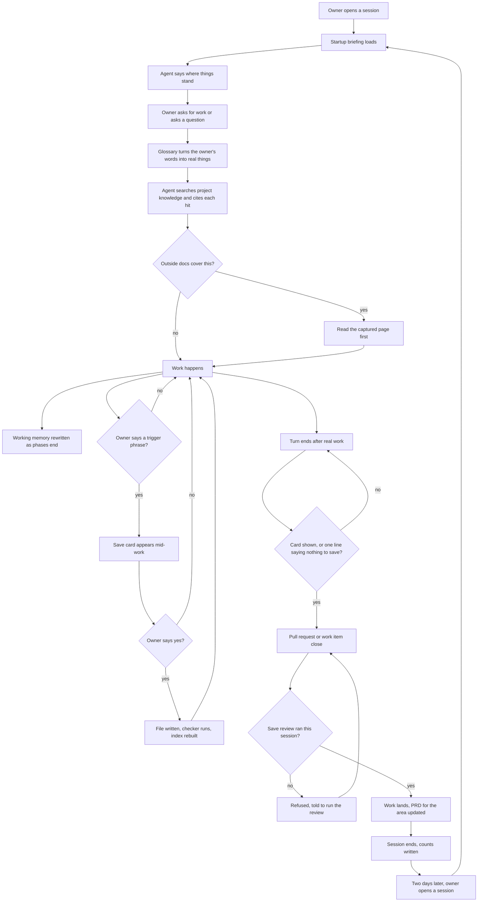

# The project second brain

## Contents

- [Why this exists](#why-this-exists)
- [Where it sits](#where-it-sits)
- [How to read this](#how-to-read-this)
- [A session, start to finish](#a-session-start-to-finish)
- [1. Plain parts only](#1-plain-parts-only)
- [2. Rules before any change](#2-rules-before-any-change)
- [3. Guarantees, not advice](#3-guarantees-not-advice)
- [4. Picks up where the last left off](#4-picks-up-where-the-last-left-off)
- [5. Check memory first](#5-check-memory-first)
- [6. Cite the source](#6-cite-the-source)
- [7. Speaks the project's language](#7-speaks-the-projects-language)
- [8. Read the real documentation first](#8-read-the-real-documentation-first)
- [9. Saving is frictionless](#9-saving-is-frictionless)
- [10. Approval before any write](#10-approval-before-any-write)
- [11. What counts as memory](#11-what-counts-as-memory)
- [12. What never counts](#12-what-never-counts)
- [13. Working memory](#13-working-memory)
- [14. Memory file shape](#14-memory-file-shape)
- [15. How the words are written](#15-how-the-words-are-written)
- [16. Requirements documents](#16-requirements-documents)
- [17. Procedures become skills](#17-procedures-become-skills)
- [18. Where information goes](#18-where-information-goes)
- [19. The find order](#19-the-find-order)
- [20. The save card](#20-the-save-card)
- [21. Indexes and the checker](#21-indexes-and-the-checker)
- [22. Keeping current truth clean](#22-keeping-current-truth-clean)
- [23. Learning what to save](#23-learning-what-to-save)
- [24. The six commands](#24-the-six-commands)
- [25. Codex](#25-codex)
- [Notes for the builder: options, not requirements](#notes-for-the-builder-options-not-requirements)

## Why this exists

The owner should not have to hold the project in his head. This system moves
that load onto the agent.

- The agent knows more than the owner about what has been going on in this project.
- It gets smarter over time, because what it learns is written down and read back.
- Every new session feels like talking to the same agent, not a stranger who has to be caught up.
- It is the agent's lasting memory, tuned so the agent learns when something is worth keeping.
- The human user (owner) can modify or delete knowledge within the second brain system without involving the agent and the system will not break.

Two ways to fail, and both are bad. Remembering too little means the owner
explains the same thing again. Remembering carelessly is worse, because a later
agent believes something stale and acts on it.

## Where it sits

The toolkit ships a whole operating system for working with an AI agent on a
project: rules, hooks, skills, the work tracker, design files, and captured
outside documentation. The second brain is the memory part and link back to why the product was designed a certain way (PRDs). It holds what is
true here and why. Everything else it hands to the part that owns it. A
repeatable procedure goes to a skill. A standing instruction goes to
`.claude/rules/`(with proper syntax and path tags so it loads only when needed). Live status goes to the work tracker. How one item gets built
goes to `docs/designs/`. Outside documentation the agent can use to specialize its knowledge goes to `ai-external-knowledge/`.
Requirement 18 is the full list.

This operating system is a fixed workflow with the agent inside it. Hooks fire
at fixed moments, rules load, skills run. The agent's judgment is used inside
those fixed points, and never to decide whether a point happens at all. That is
why requirement 3 reads the way it does.

Judge every requirement below against that whole picture. A requirement that
pulls work into the second brain that another part already owns is wrong.

## How to read this

- The status is `proposed`. This describes the finished system, not today's.
- It says what must happen, what the owner sees, and why. It never says which hook, file, or code does it. Those are build decisions and go in a design file under `docs/designs/`.
- This document holds the goal, the requirement, and the behavior. Each requirement is written explicitly enough to guide the design: so clear and so well written that the design choices basically choose themselves. If a builder has to guess between two designs, the requirement is not finished yet and gets sharpened here first.
- When the owner says something that belongs in this document, the agent writes it here in that same reply. It is never logged on an issue instead, because an issue comment gets lost and this document then never gets updated.
- Requirements 2 and 3 are the one exception. They name kinds of mechanism, because no wording alone can meet them. Which mechanism delivers each one is still the design's job.
- "A session, start to finish" follows one session through every requirement, so the numbered list is easier to follow.
- The closing section "Notes for the builder" holds ideas that bind nothing.
- Where this document and `knowledge/README.md` disagree, this document wins. Each disagreement is called out where it happens, and the manual is brought in line.

## A session, start to finish

One project, one owner, one agent, one session. This follows the whole operating
system once, so the numbered requirements below are easier to follow. Every
step names what the owner sees, what happens, which files are read or written,
and how the rule is enforced: a gate, an output check, a count, or nothing but
the agent's judgment. Requirement 3 defines those strengths.

**1. The owner opens a session**

- What the owner sees: a first message saying what was in progress last time, what happened, and the next step. Nobody asked for it.
- What happens: the briefing loads. Who the agent is, the standing rules, the rules of this system, what the project is, what is happening now, the glossary, the two indexes, the list of captured outside topics, and a few hundred characters saying where the gates are.
- Files read: `SOUL.md`, `.claude/rules/`, `knowledge/README.md`, `knowledge/project.md`, `knowledge/current.md`, `knowledge/glossary.md`, `knowledge/memory/memory-index.md`, `knowledge/prds/spec-index.md`.
- Enforced by: a gate. Nothing in the project can change until the rules of this system were read whole in this session. If the briefing was cut short, the gate stays shut until the agent opens the manual itself. Requirements 2 and 4.

**2. The owner asks for something**

- What the owner sees: the agent uses the project's own words back, correctly. A term the agent does not know gets one question, then a card offering to add it.
- What happens: the glossary turns shorthand into the real field, system, person, or process. Then the agent searches what the project knows, in order: what is happening now, the standing rules, the skills, the glossary, memory and PRDs through their indexes, then past sessions. Every hit comes back with its path on the line below. If a captured outside topic covers the task, that page is read before anything else.
- Files read: `knowledge/glossary.md`, `knowledge/current.md`, the indexes, the memory or PRD files they point at, `ai-external-knowledge/<topic>/` when it applies, and the work item in the tracker when the task belongs to one.
- Enforced by: a gate on the first change. No file changes until the search happened. A plain question is not gated, and a question answered without a search is counted. Citing is built into the search itself. Outside-docs use is counted. Requirements 5, 6, 7, 8.

**3. The work happens**

- What the owner sees: the work, in plain language. When a phase ends or something blocks, one fast question: "update what we are working on to say X?"
- What happens: the agent builds. If the task is a repeatable procedure this project already has, the project skill runs instead of the agent improvising. The work item's stage moves as the work moves. Working memory is rewritten, never appended.
- Files written: `knowledge/current.md` after one yes. The work item in the tracker. A project skill under `.claude/skills/` when a procedure is being recorded.
- Enforced by: the agent's judgment for when a phase ended, plus the gate at the end of the turn (step 5) that catches what it missed. Requirements 4, 13, 17.

**4. Something worth keeping comes up mid-work**

- What the owner sees: a card, right there, in the shape requirement 20 sets. Bold headline, an arrow saying where it goes, the exact words, five bullets. One word answers it.
- What happens: the owner said a trigger phrase ("actually", "going forward", "never do X", a new person, a tool switch), or a real problem here was just fixed, or the work produced a result the project will look up again. The agent checks the self-improvement file first, so something the owner already rejected is dropped or reshaped before he sees it.
- Files written, after yes: one file under `knowledge/memory/` or `knowledge/prds/`, the index, and one line in `knowledge/memory-self-improvement.md` recording the outcome. All of it is committed to the default branch and pushed in the same reply.
- Enforced by: an output check on the card's shape. A gate on the write: the checker runs, and a failing check means the save is not finished. The moment itself is the agent's judgment, backed by the count in step 7. Requirements 9, 10, 11, 20, 21, 23.

**5. The turn ends after real work**

- What the owner sees: either a card, or one line: "nothing to save, because ...".
- What happens: the agent cannot end the turn any other way. If the work produced a result the project will refer back to, the card is an episode: what was done, what came out, where the output lives.
- Files written: as in step 4, after yes. `knowledge/current.md` says the next step.
- Enforced by: a gate on the end of the turn. The design sets and states the threshold for "real work". Requirements 3, 11.

**6. The work lands**

- What the owner sees: a pull request, or a work item closed. If the save review has not run for this work in this session, the attempt is refused, every time, until it has. Each refusal tells the agent to run the review. There is no second try that slips through.
- What happens: code lands by pull request with the owner's approval. A change that touches only `knowledge/` commits straight to the default branch. When the work item closes, the agent checks whether the area's behavior changed. If it did, that area's PRD is edited to match, through the normal card and yes, and its status moves from proposed to current.
- Files written: the branch and pull request. The work item's stage and progress log. The PRD for the area, after yes.
- Enforced by: a gate on opening a pull request and a gate on closing a work item, held until the review is done. A gate on the write for the PRD edit. Requirements 3, 16.

**7. The session ends**

- What the owner sees: nothing, unless he opens the count file. If he says he is about to clear context, the save review runs first and then he gets a handoff prompt.
- What happens: the counts are written. Save moments against cards shown. Questions answered without a search. Captured topics opened.
- Files written: the count file the design names, somewhere the owner can read.
- Enforced by: a count. This is what makes a missed moment visible instead of silent. Requirement 3.

**8. Two days later**

- What the owner sees: he opens a session and asks "what were we working on?", or does not even have to, because step 1 already said so.
- What happens: the loop starts again from step 1, and the agent knows what the last one knew.
- Enforced by: everything above. This is the check for requirement 4.

## 1. Plain parts only

- Build it from what Claude Code already ships: rules, hooks, skills, Markdown files, and Git.
- No database. No background writer. No second store of truth outside these files.

**Check:** list every moving part of the system. Each one is a rule file, a
hook, a skill, a Markdown file, or Git. There is nothing else.

## 2. Rules before any change

- Nothing that changes the project happens in a session until the rules of this system have been read whole in that session. A file edit, a write, a command that changes state: each one is refused until then.
- Read whole means all of the rules. Not a preview, not a summary, not a file path to open later.
- The refusal says what to read, so the agent is never stopped without being told what to do next.
- This is a gate in the sense requirement 3 sets out. It is not advice the agent may weigh against something else.

**Check:** in a fresh session, try to edit a file first. The edit is refused, and
the refusal says what to read.

## 3. Guarantees, not advice

Text put in front of the agent is advice. The agent can ignore it, and an agent
with a full context often does. A refusal that holds until a condition is met is
a guarantee. So every behavior below is written as something that is impossible
or refused, never as something the agent should do.

Three strengths exist, and each behavior is given one by name:

- **Gate.** The action cannot happen until the condition holds.
- **Output check.** The reply is rejected and redone when it breaks the rule.
- **Count.** The miss is recorded afterwards, so it is visible.

### Rules read: gate

No action that changes anything in the project happens until the rules have been
read whole in that session. Requirement 2 states it in full.

**Check:** in a fresh session, try to edit a file first. The edit is refused and
the refusal says what to read.

### Memory checked: gate, then count

- Gate: the first action in a session that changes anything is refused until the project's knowledge has been searched for the task at hand.
- Count: a plain question from the owner is not gated. A question answered with no search is counted instead, and the count is visible at the end of the session.

**Check:** in a fresh session, try to change a file before any search. It is
refused. For questions, the session-end count shows how many were answered
without a search.

### Source cited: built in

There is one way the agent reads project knowledge, and it hands back every
finding with its path beside it. A finding without a source cannot exist, so
there is nothing left to enforce.

**Check:** every result of a knowledge search shows a path beside every hit.

### Outside documentation used: in front of the agent, and counted

- The list of captured topics is in front of the agent in every session. This is the one place text is put in front of the agent on purpose, and it stays under a few hundred characters.
- Use of a captured topic is counted.
- This one cannot be gated. Gating it would mean guessing which topic a task needs.

**Check:** the topic list is there in a fresh session, and the session-end count
shows how often a captured topic was opened.

### Save proposed at the right moment: gate, plus a count

- A gate at each fixed moment: opening a pull request, closing a work item, a handoff, and the end of any turn in which real work was done. The design sets the threshold for real work and states it.
- The moment cannot pass until either a card was shown, or the agent wrote one line saying nothing needs saving and why.
- At session end, a count of moments against cards shown, written to a file the owner can read.

**Check:** finish a task and try to end the turn. It cannot end without a card or
the one line.

### Memory rules followed: gate on the write, output check on the card

- Gate: after any write under `knowledge/`, the checker runs. A failing check means the save is not finished, and the agent says so.
- Output check: a card missing the headline, the arrow, the quote, or any of the five bullets is rejected and redone.

**Check:** write a file with a bad field. The save is reported unfinished. Show a
card missing a bullet. It is redone.

### Why it is built this way

Text an agent is only expected to remember fades as context fills. The owner
has already watched a rule file go unfollowed, and Claude Code itself cut an
18,000 character briefing down to a 2,000 character preview. Under that
pressure, advice gets ignored. A refusal cannot be ignored.

Text put in front of the agent keeps one small job: a few hundred characters
saying where the gates are, so the agent knows about each gate before it reaches
one. Which mechanism delivers each gate, output check, and count belongs to the
solution design.

## 4. Picks up where the last left off

- The owner comes back after two days, asks "what were we working on?", and the agent answers.
- The answer covers what is in progress, what happened last time, and which session handed off to which.
- The owner never pieces this together himself.
- So `knowledge/current.md` is kept up to date as work happens, across sessions, not only at the end of one.
- Updates to it are quick and short. They still ask the owner first, as one fast question, never a review.

**Check:** work in one session, close it, open a fresh session two days later and
ask "what were we working on?". The agent answers correctly without reading any
transcript.

## 5. Check memory first

- When the owner asks something, or the agent starts a task, the agent first checks whether this project already knows the answer, already solved it, or holds useful context.
- It brings that up without being asked.
- The agent cannot decide to skip this.

**Check:** ask about something already saved. The agent answers from the saved
file and names it, instead of searching the code or asking the owner.

## 6. Cite the source

- Whenever the agent checks memory, a PRD, a saved session, or the outside documentation folder and finds something, it says what it found and, on the line right below, where it found it.
- What that line carries: the file path. For a saved session, the session. For an outside documentation page, the page and the date it was captured.
- This covers an answer, a past fix, and any context the agent brings up.
- This happens every time. It is never optional, and never only when the owner asks.
- Why: the owner has to be able to see that the answer came from what this project actually knows, and go and check it himself.

**Check:** the agent says "the project already has this". The line right below
names the file it came from, and the owner can open that file and find it there.

## 7. Speaks the project's language

The system ships a glossary: one file, `knowledge/glossary.md`. It maps the
owner's words and the client's shorthand to the real thing, which may be a field
name, a system, a person, or a process.

- The agent has the glossary from the first message of every session, the same way it has the current focus. It loads at session start.
- When a term in the glossary is used, the agent applies it and does not ask.
- When the owner uses a term the agent does not know, the agent asks once, then proposes the mapping through the one card, one yes flow.
- The glossary is checked before tier 4 of the find order, because a search for the owner's shorthand finds nothing.
- The owner's example: he said "match on the discovery email field and the core email field", and the agent knew exactly which two fields those were, like a colleague who had been on the project for years.

**Check:** use a term that is in the glossary. The agent acts on the right thing
without asking. Use one that is not. The agent asks once, and a card for the
mapping appears.

## 8. Read the real documentation first

- The agent knows the folder `ai-external-knowledge/` exists and what topics are captured there.
- It reads the right page before running a repeatable process and before working out a fix.
- One folder per topic. Each names its source address and the date it was captured.
- The agent cannot decide to skip this either.

**Check:** ask for something a captured topic covers. The agent opens that page
first, and says which page it read and when the page was captured.

## 9. Saving is frictionless

- Any save, memory or product requirements document, is one short card and one yes.
- No long review. No back and forth. No reading a full file before deciding.
- The agent proposes at the right moment on its own. The owner never has to remember to ask.
- The right moments are: a task or work item finishes, a commit or pull request is coming, a handoff or a context clear is coming, the session has run long, a real problem here has just been fixed, and any time the owner says to save something.
- The owner saying "remember this" starts the review. It is not permission to write and it skips no step.
- When approved, memory or PRDs are saved directly to the default branch and pushed!!! They are not lost in worktree branches or buried in something that a future agent would not easily find.
- A save is finished only when the file is on the default branch and pushed, and not before.
- No worktree, no feature branch, no pull request, no draft, no "later". This holds even when the session is doing its other work on a branch. The save still goes straight to the default branch, and the branch picks it up the next time it is brought current.
- Everything from the card to the push happens in the same reply as the yes. The owner does nothing else and runs no Git command.
- If the push fails, the agent says so in that same reply and the save is not finished. Nothing is ever parked silently.
- There is never a second place to look for a save. If the owner has to remember where a save is, it will be forgotten.

**This changes today's direct-commit rule.** That rule keeps a save on the
session's own branch when the session is working in a worktree. That is a parked
save, and this document removes that exception.

**Check:** finish a piece of work. In that same reply the agent shows one card.
One word of approval writes the file, and before the reply ends the file is on
the default branch and pushed. Nothing else is asked of the owner. Then ask "is
there a save waiting anywhere?" The answer is never yes.

## 10. Approval before any write

- No hook, background job, or helper agent writes memory or a requirements document on its own.
- Silence is not approval. An unclear answer is not approval. Asking to see the full text is not approval.
- The owner may change the wording, the place, the tags, or drop the whole thing.
- When the owner edits the words, those words are written exactly as typed. He is the source.
- Only the approved meaning is written. Not the surrounding context, not an improved version, not one extra sentence that seemed useful.
- The `Unsure` line is approved separately. Approve the content but not the guess, and the guess comes out.
- Two things need no meaning approval: rebuilding an index and repairing a broken link. Writing `knowledge/current.md` asks one fast question first, as requirement 4 says.
- Converting files already approved under an older layout is the one exception. The agent converts, shows the owner readable batches, and he approves afterwards. Anything that will not convert cleanly is named, never guessed.

**Check:** show a proposal and say nothing back. Nothing is written and nothing
is held for later.

## 11. What counts as memory

Something is memory when all three are true:

1. It is related to/valuable to this project, as `knowledge/project.md` describes the project.
2. It is significant. A lasting fact, a decision, a constraint, or a real lesson about how something here works or how a real problem here was fixed, such that the next agent would lose real time without it. It must be related to the project. The content of the memory must be related to project.
3. The human user (owner) was part of it. He said it, decided it, or worked it out with the agent.

There is one addition. If the agent alone finds and fixes a real, significant problem that is related to and valuable to this project, it may propose that as memory. The owner's yes is the human part.

How a real failure here was fixed is memory, not a rule: what broke, what caused
it, and what fixed it. One rule per fix would fill the rules folder with
hundreds of one-off entries and hide the standing instructions it exists for.

**A named kind: a significant episode.** A piece of work that produced a result
the project will refer back to.

- Its memory says what was done, what came out of it, and where the output lives, in a few sentences, with `type: event`.
- The card for it appears at the end of the task on its own. The owner never asks for it, and one yes writes it.
- The owner's example: an exercise matching two spreadsheets against the contacts in the system, and what the match found.
- Not an episode: routine edits, or a task with no result anyone will look up again.

**Check:** finish a piece of work with a real result. The card appears in the
same reply, unprompted.

**This changes the manual.** `knowledge/README.md` today says memory must come
from the owner, or from the owner and agent together. The addition above lets
the agent propose a fix it found alone. The manual is brought in line.

**Check:** two candidates. "The client moved the demo to Thursday" passes all
three and is proposed. "I updated a Python package so the browser would open"
fails points two and three and is never proposed.

## 12. What never counts

- Small things the agent did alone while doing a task, with no human in it. The owner's example: asked to open Amazon in a browser, the agent had to update a Python package to get there. That is not memory.
- Commands run, tool calls, searches, web lookups, agent behavior, and shell behavior.
- Raw error text and scratch thinking. The lesson from a significant fix is memory. The raw error is not.
- Ideas that were tried and dropped.
- A step by step record of files opened and edits made, and everything a sub-agent did.
- Copies of code, or anything an agent could work out by reading the source.
- A repeatable procedure. That is a skill. One past fix is not a procedure.
- An open task, an implementation step, or the live status of work in flight. Those belong to the work tracker.
- Anything stale or contradicted with no historical value.
- Passwords, keys, and tokens, ever. This folder is in Git and Git keeps everything.

**Check:** run this list against a session's candidates. Anything on it is
dropped before a card is written, and the agent says in one line which rule
dropped it.

## 13. Working memory

One file, `knowledge/current.md`. It answers "what is happening right now".

What it holds:

- The current objective, in one or two sentences.
- Which work item it belongs to, and what is blocking it.
- The exact next step.
- Anything picked up this session that is not lasting yet.
- Dates on entries, so a later agent can tell when a line is out of date.
- !!!!The information should be cross-ai-agent sessions. The purpose of the working memory is so that the human user can pickup or start any ai agent session with a brand new agent and it (the agent) has a crystal clear picture on what the current goals, next milestones, roadmaps, tasks, etc. are. Utilize paths to persisted/more detailed information in the current memory if necessary. Don't simply duplicate details stated in work items, memories etc. The point is the consolidate all working sessions into one clear picture so agents know how to orchestrate sessions and guide the user to their goals.!!!!

What it never holds:

- Anything trusted as a lasting fact once the work is finished.
- A log of what happened. It is overwritten, never appended.
- A work item's requirements. Those belong to the tracker.
- Secrets.

How it behaves:

- Read at the start of every session.
- Rewritten as work happens: a phase ends, something blocks, a handoff is coming, a session closes.
- Kept short. Long entries make it useless.
- Anything in it that turns out to be lasting goes through the normal save. Sitting in this file is never on its own a reason to make it long-term memory.

**Check:** open the file after a working session. It says the objective, the
blocker, and the next step, and nothing in it is a record of what happened.

## 14. Memory file shape

- Flat under `knowledge/memory/`. No subfolders by type.
- One topic per file. The filename is the topic in plain words: lowercase, hyphens between words, ending in `.md`. Not a date, not a code, not a ticket number.
- Flat on purpose. One note is usually a fact, a decision, and a piece of history at once, so sorting into folders by type makes every save start with a question that has no right answer.
- Frontmatter is real YAML between `---` fences.

Required on every memory file:

| Field | What it is | Allowed values |
| --- | --- | --- |
| `summary` | The headline: the fact itself in one short line, so the index answers the question without the file being opened. Under about 20 words. The index shows this line. | Free text, one line |
| `group` | The topic heading this file sits under in the index. A few plain words, reused across files on the same topic. | Free text, a few words |
| `type` | What kind of thing it mostly is. Does not decide where the file sits. | `fact`, `decision`, `event`, `context`, `constraint` |
| `status` | Whether it answers questions about what is true now. | `current`, `superseded`, `retired` |
| `source` | Where it came from and where to go check it: a file path, a commit, a link, or the name of the person who said it. | Free text |
| `confidence` | How the agent knows. | `observed`, `reported`, `inferred` |
| `created_at` | The date the file was first written. Never changes. | `YYYY-MM-DD` |
| `tags` | How a topic is found across many files. Free-form, no fixed list, as many as needed. | YAML list of strings |
| `approved_by` | Who approved it. | A person's name |
| `approval_date` | When they approved it. Never empty. | `YYYY-MM-DD` |

What `confidence` means: `observed` is the agent checked it directly. `reported`
is someone said it. `inferred` is the agent worked it out. Inferred stays
inferred until somebody checks it.

Optional fields, written only when they apply and left out otherwise:

| Field | What it holds | When it is written |
| --- | --- | --- |
| `confirmed_at` | The date the file was last re-checked and found still true. | On every update that confirms the file. |
| `source_quote` | The exact words the fact came from. | When the wording itself matters, such as a client's own phrasing. |
| `effective_from` | The date the fact started to apply. | When a fact has a known start date. |
| `effective_to` | The date the fact stopped applying. | When a fact has a known end date. Not a substitute for `status`. |
| `project` | The project name. | When the file could be read outside its project. |
| `work_item` | The work item that produced the file. | When one work item did. |
| `supersedes` | The path of the file this one replaces. | Only in the supersede step of requirement 22, together with `superseded_by` on the old file. |
| `superseded_by` | The path of the file that replaced this one. | Only in that same step, on the old file. Its `status` becomes `superseded` at the same time. |
| `related_memories` | Paths of other memory files on the same topic. | When a link helps a reader, and always both ways. |

All dates are `YYYY-MM-DD`. All paths are relative to the project root.

Below the frontmatter: a title in plain words, then what is true, written so
someone reading it a year from now understands it without the conversation that
produced it. Links are plain relative file paths in the body. To find what
points at a file, search for its name.

**Check:** write one memory file. Every required field is present and holds an
allowed value, and the checker passes.

## 15. How the words are written

This applies to every memory file, every PRD, and every card. The reader is a
stranger: an agent with no context, or the owner a year from now. He is not
technical.

- Plain, clear, everyday words. No AI jargon, no toolkit vocabulary the reader was never given, no figures of speech, no idioms.
- As short as it can be without dropping anything a future agent needs. Every sentence has to be needed. If removing it loses nothing, remove it.
- Accuracy before completeness. One wrong sentence makes the whole file untrustworthy, because a later agent acts on it. Anything not checked goes in the card's Unsure line or is left out. A guess is never written as a fact.
- Concrete, not abstract: the real name, the real value, the real path, the real date. Dates are absolute, never "last week". The system or org is named every time. When something was left undone, say so.
- Nothing that points at a conversation the reader cannot see. No "as discussed", no "per our call".

What a memory's body holds, in this order, and nothing else:

1. The fact, decision, or lesson itself, in one or two sentences.
2. Why it is so, in enough words that a later agent can tell whether it still applies.
3. What to do differently because of it, when there is something.
4. Where the detail lives, as a path or a link, instead of the detail itself.

Most memories fit on one screen. A memory that keeps growing has become a
document. It belongs in a PRD, a skill, or a design file, and the memory shrinks
back to the headline and a pointer.

Before writing, the agent works out the content on purpose: what is the one
thing a future agent must know, what would it get wrong without it, and what is
the smallest wording that carries it. The card shows that wording, never a first
draft. A memory is optimized for accuracy first, then for being short and clear,
and it drops nothing a future agent needs.

A PRD follows the same word rules. It says behavior and experience in plain
sentences, every requirement can be checked, and it never restates code.

**Check:** hand a memory to someone who was not in the conversation. In one
read they can say what is true, why, and what to do about it, and nothing makes
them ask what a word meant. Then remove any one sentence. Something a future
agent needs is gone.

## 16. Requirements documents

A product requirements document, PRD for short, is one living document per
feature area, in `knowledge/prds/`.

- Same file for its whole life. The filename is the feature area in plain words, same naming rules as a memory file.
- It opens as `proposed`, which is what we want built. It is edited to `current` once it describes what was actually built.
- Only a `current` PRD is settled truth. Never answer "how does this work today" from a `proposed` one.
- Only a `current` PRD beats a memory. When a memory and a current PRD disagree, the agent says so out loud and names both files. It never quietly picks one.
- `superseded` and `retired` are history.
- This folder used to be called `knowledge/specs/`, and older sessions call these files specs.
- A PRD says how the system should behave in plain words: the logic, the behavior, what the user does, what the user sees. It never restates the code. If an agent could work it out by reading the source, it does not go here.
- When a work item finishes, check whether it changed how any area is meant to behave. If it did, that area's PRD is edited to match, through the normal approval. That is what keeps a PRD trustworthy.

**A PRD is usually big.** Most of the time it describes a large feature or an
epic, too much for one work item. A small PRD that one work item delivers is
allowed, and it is the exception.

- When a PRD is too big for one work item, it is broken down into smaller work items in the work tracker. Each work item points back to the PRD and names the numbered requirements it delivers. That is why the requirements are numbered.
- A big PRD carries a roadmap, as its own section inside the PRD. The roadmap lists the work items in the order they will be built, each with its link in the tracker and the requirements it covers. It says the order and the mapping. It does not copy each item's stage or status, because the tracker owns those and the link leads there.
- Each work item gets its own implementation plan, in `docs/designs/`, one file per work item. The plan says how that item gets built. It never lives in the PRD.
- The agent maintains all three: the PRD, its roadmap, and the plans. When a work item is created, reordered, split, or finished, the roadmap is updated in that same session through the normal card and yes. When a work item finishes, the PRD's behavior is brought current and that item's plan is deleted, as requirement 18 says.
- The owner never has to ask for any of this upkeep. It happens at the moment the work item changes.

**Check:** open a PRD that more than one work item delivers. It has a roadmap
section. Every work item in it links to the tracker, and every one of those
work items links back to the PRD and names its requirements. Finish one work
item. The roadmap changes in the same session, and the PRD's behavior section
changes before the work item is called done.

Required fields: `summary`, `group`, `area`, `status`, `source`, `created_at`,
`tags`, `approved_by`, `approval_date`. Same meanings and same allowed values as
a memory file. `area` names the feature area and normally matches the filename.

Optional fields: `confirmed_at`, `source_quote`, `effective_from`,
`effective_to`, `project`, `work_item`, `supersedes`, `superseded_by`,
with the same meanings and rules as the memory file table.

Two fields are never on a PRD. `confidence`, because a PRD is approved behavior
and "how sure are we" does not apply. `type`, because every file in the folder
is the same kind of thing. Only a PRD may carry the status `proposed`.

**Check:** open a PRD marked `proposed` and ask the agent how the system works
today. It says the file is not built yet and refuses to answer from it.

## 17. Procedures become skills

- When the agent works out a repeatable way to do something here, that is a skill, not a memory file.
- For this project only, it becomes a project skill at `.claude/skills/<name>/SKILL.md`. A skill in that folder applies to this project and is not shared with other projects.
- The agent proposes it through the same one card, one yes flow used for a save.
- Saving a procedure as a memory is how an agent quietly changes the way it works, because the procedure comes back later as a fact and gets followed as an instruction.

**Check:** teach the agent a repeatable way of doing something here. It offers a
project skill at that path, not a memory file.

## 18. Where information goes

Putting something in the wrong home causes real damage, so this is checked
before anything is written.

| The question | Where it goes |
| --- | --- |
| Who the agent is in this project | `SOUL.md` |
| A standing instruction for how the agent behaves | `.claude/rules/` |
| A repeatable procedure | A project skill at `.claude/skills/<name>/SKILL.md` |
| What we want built, and later how it settled | `knowledge/prds/` |
| A lasting fact, decision, event, context, or constraint | `knowledge/memory/` |
| The current objective, blocker, and next step | `knowledge/current.md` |
| A word the owner or the client uses for something | `knowledge/glossary.md` |
| What this owner accepts and rejects as memory | `knowledge/memory-self-improvement.md` |
| Requirements and status for one piece of work | The work tracker |
| The order in which a feature's work items get built, and which requirements each covers | The roadmap section of that feature's PRD |
| How one work item gets built | `docs/designs/`, one file per work item, deleted once its PRD is current |
| Documentation from outside this project | `ai-external-knowledge/`, one folder per topic, each naming its source address and capture date |
| Unchecked exploration and raw brain dumps | `knowledge/brainstorms/` |
| Only needed to finish the task at hand | Nowhere. It stays in the conversation. |
| A past conversation | Session history |

**Check:** hand the agent one item of each kind. Each lands in the right home,
and the agent names the home before it writes.

## 19. The find order

When the agent needs to know something it goes down these tiers and stops at the
first one that answers. It searches here before asking the owner and before
searching the code broadly.

| Tier | Where | Notes |
| --- | --- | --- |
| 1 | `knowledge/current.md` | What is happening now. |
| 2 | `.claude/rules/` | The answer may be a standing instruction. Already loaded, so this is a check, not a search. |
| 3 | Skills | Is this a procedure rather than a fact to look up? |
| 4 | `knowledge/memory/` and `knowledge/prds/`, through their indexes, then the links inside what is found | A current PRD beats a memory. Check the work tracker when the question belongs to one work item. |
| 5 | Past sessions, through `session-search` | Offered or announced, never done silently. |

Before tier 4, check `knowledge/glossary.md` and turn the owner's words into the
project's real names. A search for the owner's shorthand finds nothing.
Requirement 7 says why.

Once tier 5 is done, and only then, ask the owner.

- Always name where the answer was found, in the shape requirement 6 sets.
- An index is a map, not evidence. Open the file before relying on its line.
- Only `current` files answer what is true now. Everything else answers questions about history.
- When tier 4 finds nothing, say so plainly and name what was searched. Never invent a believable answer, and never hand back something recent but unrelated.
- Everything from tier 5 comes back flagged: "I found this in an earlier session. Is this still true?" Being found there is never by itself a reason to save it. If it is still true it goes through the normal save.

Outside documentation is not a tier. Requirement 8 says when the agent opens it.

**Check:** ask something nothing in the project answers. The agent names what it
searched, offers the session search, and then says it does not know. It never
fills the gap with a guess.

## 20. The save card

Every save proposal, in every project, uses one shape. Same parts, same order,
same labels, so the tenth card reads the same way as the first.

- A bold headline. One plain sentence saying what gets saved. Not a file path and not a label.
- Then an arrow and one of four phrases: `New memory file`, `Memory, edit to an existing file`, `New PRD file`, `PRD, edit to an existing file`.
- A block quote holding the exact text that would land in the file. Three sentences at most. Not the full file text.
- Five bullets on consecutive lines, in this order: `Why`, `Where`, `From`, `Unsure`, `Checked`.

What each bullet carries:

- `Why`: what a later session gets out of this. Not a restatement of the quote.
- `Where`: the exact path, whether the file is new or an edit, and the tags.
- `From`: who it came from and how sure. You said it, we worked it out together, or I worked it out.
- `Unsure`: anything unchecked, or the single word "nothing". Never left out and never softened into silence.
- `Checked`: what was opened to confirm this is not already written down. Shown with the card, never held back, so weak reasoning is visible before he answers.

How it is shown:

- Rendered Markdown, never inside a code fence. The owner reads the formatted result, not the markup.
- A blank line between the three blocks and nowhere else. Related lines stay together. A blank line after every sentence hides what connects to what.
- Every line written as if the owner is five years old. Short words, one idea per sentence, no jargon, and none of the toolkit's own vocabulary.
- More than one file means numbered blocks with a horizontal rule between them, and one closing line asking which numbers to save.

The headline and the quoted text carry the decision. The owner approves the
quoted text, `Why`, and `From`. The rest is shown so he can see how it is filed,
and he may change any of it.

**This changes today's template.** The arrow line currently offers the word
"spec". The folder is `knowledge/prds/` and the word is PRD.

**Check:** read a card. The owner can tell in one pass what is being saved,
whether it is a memory or a PRD, and exactly which words will be written. He
never opens a file to decide.

## 21. Indexes and the checker

- Two generated files: `knowledge/memory/memory-index.md` and `knowledge/prds/spec-index.md`.
- The index is grouped under short topic headings, the way a person would sort the files, not one flat alphabetical list. The heading comes from each file's `group` field. Files with the same `group` sit together, and the groups appear in a fixed order.
- Each entry is one line: a link to the file, then the file's `summary`. The summary is the headline fact itself, in plain words, not a description of the file. A reader gets the answer from the line and opens the file only for the detail. The owner's model for this is the memory index in his Davis project, where a line reads like "Never send via Gmail; paste the email or save it to a file".
- The summary exists in one place, the file, and the index copies it. Nothing in the index is written anywhere else.
- A file whose status is not `current` shows its status on its line, so a superseded, retired, or proposed file is visibly not an answer to what is true now.
- The header above the entries is two lines at most. The index is a map, not a manual.
- Never edited by hand. The ordering inside a group is fixed, so two sessions running at once do not fight over the same lines.
- If an index disagrees with the files on disk, the files win. Rebuild it.
- One read-only checker confirms required fields, allowed values, and size limits. It never writes anything.
- After any lasting knowledge change, the index is rebuilt and the checker is run. A failing check means the save is not finished, and the agent says so instead of claiming the knowledge is stored.

**Check:** rename a memory file and rebuild. The index line follows, under the
heading its `group` names. Read any line: it states a fact, not "this file is
about". Break a required field and run the checker. It fails and names the file.

## 22. Keeping current truth clean

- Never just add. Search for a file on this topic first. A new file every time something comes up fills the folder with near-duplicates until nobody trusts it.
- **Update** when the new information agrees with the file and adds to it. Edit the file, set `confirmed_at` to today, and note what changed. No new file.
- **Supersede** when the new information contradicts the file and is right. Three steps, together or not at all: write the new file with `supersedes` pointing at the old, mark the old file `superseded` with `superseded_by` pointing at the new, then fix anything still treating the old file as current. The old file stays, because often the fact that something changed is the useful part.
- **Retire** when a file no longer applies but its history still matters. Set `status` to `retired`. It stops answering what is true now and stays findable.
- **Delete** for three reasons only, and say which one out loud: a copy made by mistake, a secret that should never have been written down, or something that was never true. Something that stopped being true is superseded or retired, never deleted.
- Age alone is never a reason. Written two years ago and still true means still true.
- Duplicates get merged, contradictions get resolved, overlapping files get linked. The goal is a small, trustworthy, connected set of knowledge, not a large one.

**Check:** save something that contradicts an existing file. The agent shows the
conflict, supersedes rather than adding a second file beside it, and afterwards
both files point at each other.

## 23. Learning what to save

`knowledge/memory-self-improvement.md` is where the agent keeps lessons about
what this owner accepts and rejects AS IT RELATES TO MEMORY, so its proposals get better over time.

- It holds lessons and a short log of recent proposal outcomes.
- The save flow reads it before gathering candidates, so something the owner has already rejected is dropped or reshaped before he ever sees it. It appends one line per candidate after he decides.
- Each line carries the date, the candidate in a few words, the outcome, and the owner's reason in his own words, or "no reason given". Never an invented reason.
- It is working state for the save flow, not memory. Appending needs no approval, nothing in it is a lasting project fact, and secrets never go in it.
- When a lesson there disagrees with the rules of this system, the rules win and the disagreement is said out loud.
- The review command merges repeated lines into lessons so the file stays small.
- Lessons stay in this project. One that keeps coming up across projects moves into the shared manual through the normal toolkit change.

**Check:** reject a proposal and give a reason. A line appears in the file with
that reason. Propose something similar later and the agent names the earlier
rejection instead of proposing it again.

## 24. The six commands

| Command | What it does for the owner |
| --- | --- |
| `recall` | Finds what this project already knows, before searching the code or asking him. |
| `remember` | Proposes one thing and saves it on his yes, as a memory or a PRD. |
| `retire` | Takes one file out of current use: superseded, retired, or deleted. |
| `reflect` | Reviews the whole knowledge folder and proposes cleanup: duplicates, contradictions, stale files. |
| `session-search` | Searches past Claude Code sessions when project knowledge did not answer. |
| `second-brain` | Sets up, checks, explains, or repairs this system in a project. |

**Check:** run each one. Each does the thing above without the owner having to
explain what he wants.

## 25. Codex

- A Codex session gets the same knowledge files and the same startup briefing as a Claude session.
- It does not get the gates, because Codex has no way to hold a command before it runs.
- So a Codex session reads the rules and follows them. Every gate in requirement 3 is a Claude session only, and there the rules are advice again.
- Nothing in the saved files is specific to one agent. Both read the same Markdown.

**Check:** open the project in Codex. The briefing arrives and the rules are
followed. No command is held.

## Notes for the builder: options, not requirements

These are ideas the owner and earlier agents found useful while working this
out. They bind nothing. The solution design may take any of them, change them,
or drop them.

- **Gate by ledger.** Record each read of a required file in a per-session ledger, and refuse changing tool calls until the ledger holds the entries.
- **Gate by marker.** Each process step leaves a marker. The next step, or the end of the turn, is refused until the marker exists.
- **Output check at the end of the turn.** Read the final reply and reject it when it breaks a rule about shape, such as a card missing a bullet or a finding with no path.
- **A per-message hook that mostly stays quiet.** It speaks only when the owner's words match a fixed list of trigger phrases: a new person, "actually", "going forward", "never do X", a tool switch, a focus change. Silent otherwise. Seen working in another project of the owner's.
- **A session-end count** of save moments against cards shown, written to a small log. Also seen working there.
- **A background write.** After the owner's yes, the write itself may run in a helper so the conversation never stops. This is not the background writer requirement 1 forbids. That one writes without the owner. This one writes only what he already approved.
- **The glossary as a rule plus one file.** The other project keeps a rule saying check the glossary before guessing, next to the file itself. The same shape works here.
- **Keep the per-session injection to a few hundred characters.** Where the gates are, and which outside-documentation topics exist. Nothing else.
