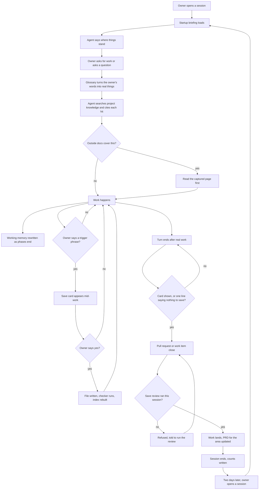

# The project second brain

## Contents

- [Why this exists](#why-this-exists)
- [Where it sits](#where-it-sits)
- [How to read this](#how-to-read-this)
- [A session, start to finish](#a-session-start-to-finish)
- [1. Plain parts only](#1-plain-parts-only)
- [2. The agent follows this system](#2-the-agent-follows-this-system)
- [3. Guarantees, not advice](#3-guarantees-not-advice)
- [4. Picks up where the last left off](#4-picks-up-where-the-last-left-off)
- [5. Check memory first](#5-check-memory-first)
- [6. Cite the source](#6-cite-the-source)
- [7. Speaks the project's language](#7-speaks-the-projects-language)
- [8. Read the real documentation first](#8-read-the-real-documentation-first)
- [9. Saving is frictionless](#9-saving-is-frictionless)
- [10. Approval before any write](#10-approval-before-any-write)
- [11. What counts as memory](#11-what-counts-as-memory)
- [12. What never counts](#12-what-never-counts)
- [13. Working memory](#13-working-memory)
- [14. Memory file shape](#14-memory-file-shape)
- [15. How the words are written](#15-how-the-words-are-written)
- [16. Requirements documents](#16-requirements-documents)
- [17. Procedures become skills](#17-procedures-become-skills)
- [18. Where information goes](#18-where-information-goes)
- [19. The find order](#19-the-find-order)
- [20. The save card](#20-the-save-card)
- [21. Indexes and the checker](#21-indexes-and-the-checker)
- [22. Keeping current truth clean](#22-keeping-current-truth-clean)
- [23. Learning what to save](#23-learning-what-to-save)
- [24. The six commands](#24-the-six-commands)
- [25. Codex](#25-codex)
- [26. Built the way Claude Code's documentation says](#26-built-the-way-claude-codes-documentation-says)
- [Notes for the builder: options, not requirements](#notes-for-the-builder-options-not-requirements)

## Why this exists

The owner should not have to remember the state of the project himself. The
agent remembers it for him.

- The agent knows more than the owner about what has been going on in this project.
- It gets smarter over time, because what it learns is written down and read back.
- Every new session feels like talking to the same agent, not a stranger who has to be caught up.
- It is the agent's lasting memory, tuned so the agent learns when something is worth keeping.
- The human user (owner) can modify or delete knowledge within the second brain system without involving the agent and the system will not break.

Two ways to fail, and both are bad. Remembering too little means the owner
explains the same thing again. Remembering carelessly is worse, because a later
agent believes something stale and acts on it.

## Where it sits

The toolkit ships a whole set of parts for working with an AI agent on a
project: rules, hooks, skills, the work tracker, and captured
outside documentation. The second brain is two of those parts. It is the memory,
and it is the record of why the product was designed the way it was, which is
what a PRD holds. It keeps what is true in this project and why. Anything else
belongs to another part, and the second brain does not keep it. A repeatable
procedure goes to a skill. A standing instruction goes to `.claude/rules/`,
written so that it loads only when it is needed. Live status goes to the work
tracker. How one item gets built goes on that work item, in the work tracker. Outside documentation
the agent can use goes to `ai-external-knowledge/`. Requirement 18 is the full
list.

This set of parts is a fixed workflow with the agent working inside it. Hooks
fire at fixed moments, rules load, skills run. The agent uses its judgment
inside those fixed moments. It never uses its judgment to decide whether a fixed
moment happens at all. Example: the agent decides what a save card says. It does
not decide whether the card appears. That is why requirement 3 reads the way it
does.

Judge every requirement below against that whole set of parts. If a requirement
moves work into the second brain that another part already owns, the requirement
is wrong.

## How to read this

- The status is `proposed`. This document describes the finished system. It does not describe how the system works today.
- It says what must happen, what the owner sees, and why. It never says which hook, file, or code does it. Those are build decisions and go on the work item, in the work tracker.
- This document holds the goal, the requirement, and the behavior. Each requirement is written clearly enough that a builder can design from it without guessing. If a builder would have to guess between two designs, the requirement is not finished. It gets rewritten here first.
- When the owner says something that belongs in this document, the agent writes it here in that same reply. It is never logged on an issue instead, because an issue comment gets lost and this document then never gets updated.
- Requirement 3 is the one exception. It names kinds of mechanism, because no wording alone can meet it. Which mechanism delivers each one is still the design's job.
- "A session, start to finish" follows one session through every requirement, so the numbered list is easier to follow.
- The closing section "Notes for the builder" holds ideas that bind nothing.
- Where this document and `knowledge/README.md` disagree, this document wins. Each disagreement is named in the place it happens, and `knowledge/README.md` is then changed to match this document.

## A session, start to finish

This section follows one session from start to finish: one project, one owner,
one agent. It walks through every part of the system in the order it happens, so
the numbered requirements below are easier to follow. Every step names what the
owner sees, what happens, which files are read or written, and how the rule is
enforced. A rule is enforced by a gate, an output check, a count, or by nothing
but the agent's judgment. Requirement 3 explains those four.

**1. The owner opens a session**

- What the owner sees: a first message saying what was in progress last time, what happened, and the next step. The owner did not have to ask for it.
- What happens: the briefing loads. Who the agent is, the standing rules, the rules of this system, what the project is, what is happening now, the two indexes, the list of captured outside topics, and a few hundred characters saying where the gates are.
- Files read: `SOUL.md`, `.claude/rules/`, `knowledge/README.md`, `knowledge/project.md`, `knowledge/current.md`, `knowledge/glossary.md`, `knowledge/memory/memory-index.md`, `knowledge/prds/prd-index.md`.
- Enforced by: the briefing arrives whole, never cut off, and the gates in requirement 3 hold from the first message. If anything the agent needs did not arrive, it opens that file itself before doing anything else. Requirements 2 and 4.

**2. The owner asks for something**

- What the owner sees: the agent uses the project's own words, and uses them correctly. When the agent does not know a term, it asks one question. Then it shows a card offering to add that term to the glossary.
- What happens: the glossary turns shorthand into the real field, system, person, or process. Then the agent searches what the project knows, in order: what is happening now, the standing rules, the skills, the glossary, memory and PRDs through their indexes, then past sessions. Every hit comes back with its path on the line below. If a captured outside topic covers the task, that page is read before anything else.
- Files read: `knowledge/glossary.md`, `knowledge/current.md`, the indexes, the memory or PRD files they point at, `ai-external-knowledge/<topic>/` when it applies, and the work item in the tracker when the task belongs to one.
- Enforced by: a gate on the first change. No file changes until the search happened. A plain question changes no file, so it is not gated. A question answered without a search is counted instead. Citing is built into the search itself. Outside-docs use is counted. Requirements 5, 6, 7, 8.

**3. The work happens**

- What the owner sees: the work, in plain language. When a piece of the work finishes, or when the work is blocked, the agent updates what we are working on and says so in one line. It does not ask.
- What happens: the agent builds. If the task is a repeatable procedure this project already has, the project skill runs instead of the agent improvising. The work item's stage moves as the work moves. Working memory is rewritten, never appended.
- Files written: `knowledge/current.md`, updated without asking. The work item in the tracker. A project skill under `.claude/skills/` when a procedure is being recorded.
- Enforced by: the agent's judgment for when a phase ended, plus the gate at the end of the turn (step 5) that catches what it missed. Requirements 4, 13, 17.

**4. Something worth keeping comes up mid-work**

- What the owner sees: a card in that same reply, in the shape requirement 20 sets. It has a bold headline, an arrow saying where the file goes, the exact words to be written, and five bullets. The owner answers it with one word.
- What happens: one of these happened. The owner said a trigger phrase, such as "actually", "going forward", or "never do X". Or the owner brought up something new, such as a new person or a switch to a different tool. Or a real problem in this project was just fixed. Or the work produced a result the project will look up again. Before showing a card, the agent reads `knowledge/memory-self-improvement.md`, so something the owner already rejected is dropped or changed before he sees it.
- Files written, after yes: one file under `knowledge/memory/` or `knowledge/prds/`, the index, and one line in `knowledge/memory-self-improvement.md` recording the outcome. All of it is committed to the default branch and pushed in the same reply.
- Enforced by: an output check on the card's shape. A gate on the write: the checker runs, and a failing check means the save is not finished. The moment itself is the agent's judgment, backed by the count in step 7. Requirements 9, 10, 11, 20, 21, 23.

**5. The turn ends after real work**

- What the owner sees: either a card, or one line: "nothing to save, because ...".
- What happens: the agent cannot end the turn any other way. If the work produced a result the project will refer back to, the card proposes a significant episode, which requirement 11 defines: what was done, what came out of it, and where the output lives.
- Files written: as in step 4, after yes. `knowledge/current.md` says the next step.
- Enforced by: a gate on the end of the turn. The design sets and states the threshold for "real work". Requirements 3, 11.

**6. The work lands**

- What the owner sees: a pull request, or a work item closed. If the save review has not run for this work in this session, the attempt is refused. It stays refused every time until the review has run. Each refusal tells the agent to run the review. No later attempt is allowed through without it.
- What happens: code lands by pull request with the owner's approval. A change that touches only `knowledge/` commits straight to the default branch. When the work item closes, the agent checks whether the area's behavior changed. If it did, that area's PRD is edited to match, through the normal card and yes. When the last work item on that PRD's roadmap closes, its status moves from `proposed` to `finalized`.
- Files written: the branch and pull request. The work item's stage and progress log. The PRD for the area, after yes.
- Enforced by: a gate on opening a pull request and a gate on closing a work item, held until the review is done. A gate on the write for the PRD edit. Requirements 3, 16.

**7. The session ends**

- What the owner sees: nothing, unless he opens the count file. If he says he is about to clear context, the save review runs first and then he gets a handoff prompt.
- What happens: three counts are written. How many moments needed a save card, and how many cards were actually shown. How many questions were answered with no search. How many times a captured outside topic was opened.
- Files written: the count file the design names, somewhere the owner can read.
- Enforced by: a count. This is what makes a missed moment visible instead of silent. Requirement 3.

**8. Two days later**

- What the owner sees: he opens a session and asks "what were we working on?", or does not even have to, because step 1 already said so.
- What happens: the loop starts again from step 1, and the agent knows what the last one knew.
- Enforced by: everything above. This is the check for requirement 4.

## 1. Plain parts only

- Build it from what Claude Code already ships: rules, hooks, skills, Markdown files, and Git.
- No database. No background writer. These files are the only place this knowledge is kept.

**Check:** list every part the system is built from. Each one is a rule file, a
hook, a skill, a Markdown file, or Git. Nothing else is on the list.

## 2. The agent follows this system

- In every session, the agent follows the knowledge system: when to save, what to save, how to save, where to save, what to check first, what to cite, and what never to write.
- Reading a rule is not enough. The agent has to actually do what the rule says, every time. Example: requirement 9 says a save card appears when a task finishes. The test is not "did the agent read that rule". The test is "did the card show up".
- It follows the system whether or not the owner mentions it. The owner never has to remind it.
- How the agent comes to know the rules is a design choice. Reading them at startup, reading them at the moment of a save, or being refused until it has read them are all ways to get there. Which way is chosen is the design's job. What is not a choice is the outcome: the rules are followed.
- Following is proven, not assumed. Requirement 3 says how each behavior is enforced, and the counts at session end show any miss.

**Check:** run a whole session without mentioning memory once. At every moment
this document names, the agent does what this document says. Any moment where it
did not is visible in the counts.

## 3. Guarantees, not advice

Text the system shows the agent is only advice. The agent can ignore it, and an
agent that has already read a lot in one session often does. A refusal that
holds until a condition is met is a guarantee. So every behavior below is
written as something that is impossible or refused, never as something the agent
should do.

There are three ways to enforce a behavior. Every behavior below is given one of
them by name:

- **Gate.** The action cannot happen until the condition holds.
- **Output check.** The reply is rejected and redone when it breaks the rule.
- **Count.** The miss is recorded afterwards, so it is visible.

### System followed: enforced by all of the rest

Requirement 2 says the agent follows this system. There is no single gate for
that. Each behavior below is enforced at its own moment, and together they are
the proof.

### Memory checked: gate, then count

- Gate: the first action in a session that changes anything is refused until the project's knowledge has been searched for the task at hand.
- Count: answering a question changes no file, so a question is not gated. A question answered with no search is counted instead, and the count is visible at the end of the session.

**Check:** in a fresh session, try to change a file before any search. It is
refused. For questions, the session-end count shows how many were answered
without a search.

### Source cited: built in

There is one way the agent reads project knowledge, and it hands back every
finding with its path beside it. A finding without a source cannot exist, so
there is nothing left to enforce.

**Check:** every result of a knowledge search shows a path beside every hit.

### Outside documentation used: in front of the agent, and counted

- The list of captured topics is shown to the agent in every session, inside the one short block of text the system shows on purpose. That block holds the list of captured topics and the names of the gates, and the whole block stays under a few hundred characters.
- Use of a captured topic is counted.
- This one cannot be gated. Gating it would mean guessing which topic a task needs.

**Check:** the topic list is there in a fresh session, and the session-end count
shows how often a captured topic was opened.

### Save proposed at the right moment: gate, plus a count

- A gate at each fixed moment: opening a pull request, closing a work item, a handoff, the end of any turn in which real work was done, and any time the owner says to save something. The design sets the threshold for real work and states it.
- The moment cannot pass until either a card was shown, or the agent wrote one line saying nothing needs saving and why.
- At session end, two numbers are written to a file the owner can read: how many moments needed a card, and how many cards were shown.

**Check:** finish a task and try to end the turn. It cannot end without a card or
the one line.

### Memory rules followed: gate on the write, output check on the card

- Gate: a save is not finished until the checker has run on the written file and passed. A failing check means the save is not finished, and the agent says so.
- Output check: a card missing the headline, the arrow, the quote, or any of the five bullets is rejected and redone.

**Check:** write a file with a bad field. The save is reported unfinished. Show a
card missing a bullet. It is redone.

### Why it is built this way

An agent stops following text it was only asked to remember, and it stops more
often the longer a session runs. The owner has already watched a rule file go
unfollowed, and Claude Code itself cut an 18,000 character briefing down to a
2,000 character preview. Advice gets ignored. A refusal cannot be ignored.

The text the system shows the agent keeps one small job. It is a few hundred
characters naming the gates and the captured outside topics, so the agent knows
about each gate before it reaches one. Which mechanism delivers each gate,
output check, and count belongs to the solution design.

## 4. Picks up where the last left off

- The owner comes back after two days, asks "what were we working on?", and the agent answers.
- The answer covers what is in progress, what happened last time, and which session handed off to which.
- The owner never pieces this together himself.
- So `knowledge/current.md` is kept up to date as work happens, across sessions, not only at the end of one.
- Updates to it are quick and short. The agent makes them on its own, without asking, and tells the owner in one line that it did. This file is not lasting memory, so a wrong line costs little and the owner can fix it by hand. A stale file costs a lot more.

**Check:** work in one session, close it, open a fresh session two days later and
ask "what were we working on?". The agent answers correctly without reading any
transcript.

## 5. Check memory first

- When the owner asks something, or the agent starts a task, the agent first checks whether this project already knows the answer, already solved it, or holds useful context.
- It brings that up without being asked.
- The agent does not get to choose whether to do this. Before the first change it is forced. For a plain question it cannot be forced, so a miss is counted, as requirement 3 says.

**Check:** ask about something already saved. The agent answers from the saved
file and names it, instead of searching the code or asking the owner.

## 6. Cite the source

- Whenever the agent checks memory, a PRD, a saved session, or the outside documentation folder and finds something, it says what it found and, on the line right below, where it found it.
- What that line carries: the file path. For something found in a past session, the name and date of that session. For an outside documentation page, the path of the page and the date the page was captured.
- This covers an answer, a past fix, and any context the agent brings up.
- This happens every time. It is never optional, and never only when the owner asks.
- Why: the owner has to be able to see that the answer came from what this project actually knows, and go and check it himself.

**Check:** the agent says "the project already has this". The line right below
names the file it came from, and the owner can open that file and find it there.

## 7. Speaks the project's language

The system ships a glossary: one file, `knowledge/glossary.md`. It maps the
owner's words and the client's shorthand to the real thing, which may be a field
name, a system, a person, or a process.

- From the first message of every session, the agent uses the glossary's meanings without being told to. How it gets them is the builder's choice.
- When a term in the glossary is used, the agent applies it and does not ask.
- When the owner uses a term the agent does not know, the agent asks once, then proposes the mapping through the one card, one yes flow.
- The glossary is one Markdown table. Each row holds the term, what it means in plain words, the real thing it points at (a field name, a system, a person, a process), and where and when that was verified. Example: "Cap Level" means the field `MS_Capacity__c`, verified in the production org on a named date. Anything longer than a row is a memory the row links to.
- The glossary is checked before tier 4 of the find order, because a search for the owner's shorthand finds nothing.
- The owner's example: he said "match on the discovery email field and the core email field", and the agent knew exactly which two fields those were, like a colleague who had been on the project for years.

**Check:** use a term that is in the glossary. The agent acts on the right thing
without asking. Use one that is not. The agent asks once, and a card for the
mapping appears.

## 8. Read the real documentation first

- The agent knows the folder `ai-external-knowledge/` exists and what topics are captured there.
- Before running a repeatable process, and before working out a fix, the agent reads the captured page that covers the subject. Example: before changing a hook, it reads the captured Claude Code page about hooks instead of relying on what it already thinks it knows about hooks.
- One folder per topic. Each names its source address and the date it was captured.
- The agent does not get to choose whether to do this. It cannot be forced, because nothing can know in advance which topic a task needs, so each use is counted, as requirement 3 says.

**Check:** ask for something a captured topic covers. The agent opens that page
first, and says which page it read and when the page was captured.

## 9. Saving is frictionless

- Every save is one short card and one yes. This is true whether the save is a memory or a product requirements document.
- No long review. No back and forth. No reading a full file before deciding.
- The agent proposes at the right moment on its own. The owner never has to remember to ask.
- Five moments are forced. The agent cannot pass them without a card or a one-line "nothing to save": a work item finishes or closes, a pull request is being opened, a handoff or a context clear is coming, a turn ends after real work was done, and any time the owner says to save something. Requirement 3 says how they are forced.
- Two moments are the agent's own judgment. It should propose a save, but nothing forces it: a real problem here has just been fixed, and a commit is coming. A miss at one of these is caught at the next forced moment.
- The owner saying "remember this" starts the save flow that leads to a card. It is not permission to write, and it skips no step.
- The save review is that same flow run over everything the session did since the last one. It gathers candidates, drops any that fail requirements 11 and 12, and then shows one card per candidate, or says in one line that nothing needs saving. It is what the gates in requirement 3 wait for.
- When approved, memory or PRDs are saved directly to the default branch and pushed!!! They are not lost in worktree branches or buried in something that a future agent would not easily find.
- A save is finished only when the file is on the default branch and pushed, and not before.
- No worktree, no feature branch, no pull request, no draft, no "later". This holds even when the session is doing its other work on a branch. The save still goes straight to the default branch. The session's own branch gets the saved file later, whenever someone merges or pulls the default branch into it. Nothing extra has to happen for the save itself to be finished.
- Everything from the card to the push happens in the same reply as the yes. The owner does nothing else and runs no Git command.
- If the push fails, the agent says so in that same reply and the save is not finished. Nothing is ever parked silently.
- There is never a second place to look for a save. If the owner has to remember where a save is, it will be forgotten.

**This changes today's direct-commit rule,** which is the file
`.claude/rules/knowledge-direct-commit.md`. That rule keeps a save on the
session's own branch when the session is working in a worktree. A save sitting
on a branch is a save the owner has to go and find. This document removes that
exception, so every approved save goes to the default branch.

**Check:** finish a piece of work. In that same reply the agent shows one card.
One word of approval writes the file, and before the reply ends the file is on
the default branch and pushed. Nothing else is asked of the owner. Then ask "is
there a save waiting anywhere?" The answer is never yes.

## 10. Approval before any write

- No hook, background job, or helper agent writes memory or a requirements document on its own.
- Silence is not approval. An unclear answer is not approval. Asking to see the full text is not approval.
- The owner may change the wording, the place, the tags, or drop the whole thing.
- When the owner edits the words, those words are written exactly as typed. The agent does not tidy them, shorten them, or improve them.
- Only the approved meaning is written. Not the surrounding context, not an improved version, not one extra sentence that seemed useful.
- The `Unsure` line on the card is approved on its own. The owner can approve the text to be saved and still reject what is on the `Unsure` line. When he does, that unsure part is dropped and never written to the file. Requirement 20 says what the `Unsure` line holds.
- Four things can be done without asking the owner: rebuilding an index, repairing a broken link, writing `knowledge/current.md`, and appending a line to `knowledge/memory-self-improvement.md`. None of them changes what a lasting file means. Requirement 4 says how the current file is updated.
- There is one exception, for files the owner already approved when this project used an older folder layout. The agent converts those files first and shows the owner the converted results afterwards, in groups small enough to read in one pass. The owner approves after the conversion, not before. Any file that will not convert cleanly is named and left alone. The agent never guesses what an old file meant.

**Check:** show a proposal and say nothing back. Nothing is written and nothing
is held for later.

## 11. What counts as memory

Something is memory when all three are true:

1. It is about this project and useful to it, as `knowledge/project.md` describes the project.
2. It is significant. It is a lasting fact, a decision, a constraint, or a real lesson about how something here works or how a real problem here was fixed. The test is time: without it, the next agent would lose real time working the same thing out again. The words in the memory itself must be about this project.
3. The human user (owner) was part of it. He said it, decided it, or worked it out with the agent.

There is one addition. If the agent alone finds and fixes a real, significant problem that is related to and valuable to this project, it may propose that as memory. Point 3 is still met, because the owner's yes is what puts the human in it.

How a real failure here was fixed is memory, not a rule. The memory says what
broke, what caused it, and what fixed it. Writing one rule per fix would put
hundreds of one-off entries in the rules folder. The standing instructions the
rules folder exists for would then be much harder to find.

**One kind of memory has its own name: a significant episode.** It is a piece
of work that produced a result the project will look up again later.

- Its memory says what was done, what came out of it, and where the output lives, in a few sentences, with `type: event`.
- The card for it appears at the end of the task on its own. The owner never asks for it, and one yes writes it.
- The owner's example: an exercise matching two spreadsheets against the contacts in the system, and what the match found.
- Not an episode: routine edits, or a task with no result anyone will look up again.

**This changes the manual.** `knowledge/README.md` today says memory must come
from the owner, or from the owner and agent together. The addition above lets
the agent propose a fix it found alone. The manual is changed to match.

**Check:** finish a piece of work with a real result. The card appears in the
same reply, and nobody asked for it.

**Check:** give the agent two candidates. The owner says "the client moved the
demo to Thursday". That passes all three points and a card is proposed. The
agent, working alone, updated a Python package so a browser would open. That
fails points 2 and 3, and no card is ever proposed for it.

## 12. What never counts

- Small things the agent did alone while doing a task, with no human in it. The owner's example: asked to open Amazon in a browser, the agent had to update a Python package to get there. That is not memory.
- Commands run, tool calls, searches, web lookups, agent behavior, and shell behavior. One exception: a trap in this project's own tools or setup that cost real time, once found and fixed, is a real fix, and requirement 11 makes that memory. Example: the Salesforce command line fails under Bash in this project, so run it from PowerShell. The three-point test still applies, so a one-off hiccup with no lesson in it is never saved.
- Raw error text and scratch thinking. The lesson from a significant fix is memory. The raw error is not.
- Ideas that were tried and dropped. One exception: an idea that was acted on and later found wrong is memory, when the wrong answer had already spread into other files. Example: a test in August said an idea failed, three documents copied that, and the test was found wrong in late August. The memory says the conclusion was withdrawn and why, so no later agent finds a copy and acts on it.
- A step by step record of files opened and edits made, and everything a helper agent did.
- Copies of code, or anything an agent could work out by reading the source or the live system. Example: a write-up of how the sharing model works today, when the org itself shows it. If a project keeps research like that, it keeps it in its own reference folder outside the second brain. Memory holds only the decision or the trap that came out of the research.
- A repeatable procedure. That is a skill. One past fix is not a procedure.
- An open task, an implementation step, or the live status of work in flight. Those belong to the work tracker. Example: a manual step still owed in production is a ticket, never a memory. If no ticket exists, make one.
- A "read this first" pointer for a piece of work. The work item carries its own entry point, and `knowledge/current.md` carries the active ones.
- The story behind a standing instruction. The rule file may say in one line why it exists. Nothing else about its history is kept.
- Anything stale or contradicted with no historical value.
- Passwords, keys, and tokens, ever. The `knowledge/` folder is in Git. Git keeps a copy of every past version of every file, so deleting the secret later does not remove it.

**Check:** run this list against a session's candidates. Anything that matches a
bullet on this list is dropped before a card is written, and the agent says in
one line which bullet dropped it.

## 13. Working memory

One file, `knowledge/current.md`. It answers "what is happening right now".

What it holds:

- The current objective, in one or two sentences.
- Which work item it belongs to, and what is blocking it.
- The exact next step.
- Anything learned this session that has not been saved as memory. It sits here until it is either saved or no longer needed.
- Dates on entries, so a later agent can tell when a line is out of date.
- !!!!The information should be cross-ai-agent sessions. The purpose of the working memory is so that the human user can pickup or start any ai agent session with a brand new agent and it (the agent) has a crystal clear picture on what the current goals, next milestones, roadmaps, tasks, etc. are. Utilize paths to persisted/more detailed information in the current memory if necessary. Don't simply duplicate details stated in work items, memories etc. The point is the consolidate all working sessions into one clear picture so agents know how to orchestrate sessions and guide the user to their goals.!!!!
- In short: this file gives a brand new agent the whole current picture in one read. It holds the goals, the milestones, and the next steps. For detail, it gives the path to the work item, the memory, or the PRD that holds it, instead of copying that detail here.

What it never holds:

- A lasting fact. Nothing in this file is trusted as a lasting fact after the work is finished. Lasting facts go through the normal save into `knowledge/memory/`.
- A log of what happened. It is overwritten, never appended.
- A work item's requirements. Those belong to the tracker.
- Secrets.

How it behaves:

- Read at the start of every session.
- Rewritten as work happens: a piece of the work finishes, which the agent judges, something blocks, a handoff is coming, a session closes.
- Kept short. Long entries make it useless.
- Anything in it that turns out to be lasting goes through the normal save. Sitting in this file is never on its own a reason to make it long-term memory.

**Check:** open the file after a working session. It says the objective, the
next step, and either the blocker or that there is no blocker. Nothing in it is
a record of what happened.

## 14. Memory file shape

- Flat under `knowledge/memory/`. No subfolders at all.
- One topic per file. The filename is the topic in plain words: lowercase, hyphens between words, ending in `.md`. Not a date, not a code, not a ticket number.
- Flat on purpose. One note is usually a fact, a decision, and a piece of history at once, so sorting into folders by type makes every save start with a question that has no right answer.
- Each file starts with a settings block. The block sits between two lines that hold only `---`, and it is written in real YAML. This document calls that block the frontmatter.

Required on every memory file:

| Field | What it is | Allowed values |
| --- | --- | --- |
| `summary` | The headline: the fact itself in one short line, so the index answers the question without the file being opened. Under 200 characters, which is about 30 words. The index shows this line. | Free text, one line |
| `group` | The topic heading this file sits under in the index. A few plain words, reused across files on the same topic. | Free text, a few words |
| `type` | What kind of thing it mostly is. Does not decide where the file sits. | `fact`, `decision`, `event`, `context`, `constraint` |
| `status` | Whether it answers questions about what is true now. | `current`, `superseded`, `retired` |
| `source` | Where it came from and where to go check it: a file path, a commit, a link, or the name of the person who said it. | Free text |
| `confidence` | How the agent knows. | `observed`, `reported`, `inferred` |
| `created_at` | The date the file was first written. Never changes. | `YYYY-MM-DD` |
| `tags` | How a topic is found across many files. Free-form, no fixed list, as many as needed. | YAML list of strings |
| `approved_by` | Who approved it. | A person's name |
| `approval_date` | When they approved it. Never empty. | `YYYY-MM-DD` |

What `confidence` means: `observed` is the agent checked it directly. `reported`
is someone said it. `inferred` is the agent worked it out. Inferred stays
inferred until somebody checks it.

Optional fields, written only when they apply and left out otherwise:

| Field | What it holds | When it is written |
| --- | --- | --- |
| `confirmed_at` | The date the file was last re-checked and found still true. | On every update that confirms the file. |
| `source_quote` | The exact words the fact came from. | When the wording itself matters, such as a client's own phrasing. |
| `effective_from` | The date the fact started to apply. | When a fact has a known start date. |
| `effective_to` | The date the fact stopped applying. | When a fact has a known end date. Not a substitute for `status`. |
| `project` | The project name. | When the file could be read outside its project. |
| `work_item` | The work item that produced the file. | When one work item did. |
| `supersedes` | The path of the file this one replaces. | Only in the supersede step of requirement 22, together with `superseded_by` on the old file. |
| `superseded_by` | The path of the file that replaced this one. | Only in that same step, on the old file. Its `status` becomes `superseded` at the same time. |
| `related_memories` | Paths of other memory files on the same topic. | When a link helps a reader. Write the link on both files, so each one points at the other. |

All dates are `YYYY-MM-DD`. All paths are relative to the project root.

Below the frontmatter comes a title in plain words. Under the title comes what
is true. Write it so someone reading it a year from now understands it without
having seen the conversation that produced it.

Links in the body are plain relative file paths. There is no list of what links
to what. To find the files that point at a file, search the project for that
file's name.

**Check:** write one memory file. Every required field is present and holds an
allowed value, and the checker passes.

## 15. How the words are written

This applies to every memory file, every PRD, and every card. The reader is a
stranger: an agent with no context, or the owner a year from now. He is not
technical.

- Plain, clear, everyday words. No AI jargon, no toolkit vocabulary the reader was never given, no figures of speech, no idioms.
- As short as it can be without dropping anything a future agent needs. Every sentence has to be needed. If removing it loses nothing, remove it.
- Accuracy before completeness. One wrong sentence makes the whole file untrustworthy, because a later agent acts on it. Anything not checked goes in the card's Unsure line or is left out. A guess is never written as a fact.
- Concrete, not abstract: the real name, the real value, the real path, the real date. Write the full date, never "last week". Name the system or the organization every time. When something was left undone, say so.
- Nothing that points at a conversation the reader cannot see. No "as discussed", no "per our call".

What a memory's body holds, in this order, and nothing else:

1. The fact, decision, or lesson itself, in one or two sentences.
2. Why it is so, in enough words that a later agent can tell whether it still applies.
3. What to do differently because of it, when there is something.
4. Where the detail lives, as a path or a link, instead of the detail itself.

Most memories fit on one screen. When a memory keeps growing past that, it is
really a document, not a memory. Move the long content into a PRD, a skill, or
the work item it belongs to. What stays in the memory file is the one-line summary and the
path to where the long content now lives.

Before writing, the agent answers three questions. What is the one thing a
future agent must know? What would that agent get wrong without it? What is the
shortest wording that still says it? The card shows the answer to the third
question, never a first draft. Accuracy comes first. Being short and clear
comes second. Neither one is a reason to drop something a future agent needs.

A PRD is written the same way as a memory, under all the rules above. It says
how the system behaves and what the owner sees, in plain sentences. Every
requirement in it can be checked. It never restates code.

**Check:** hand a memory to someone who was not in the conversation. In one
read they can say what is true, why, and what to do about it, and nothing makes
them ask what a word meant. Then remove any one sentence from the file. Each
time, something a future agent needs is now missing. If removing a sentence
loses nothing, that sentence should not have been in the file.

## 16. Requirements documents

A product requirements document, PRD for short, is one document per feature
area, kept in `knowledge/prds/`.

- Same file for its whole life. The filename is the feature area in plain words, same naming rules as a memory file.
- It opens as `proposed`, which is what we want built. It is edited to `finalized` once every work item on its roadmap is done and it describes what was actually built. A small PRD that one work item delivers is finalized when that item finishes. While a big PRD is being built, each requirement that is done gets a line saying "Built on YYYY-MM-DD", so progress is visible inside the PRD.
- Only a `finalized` PRD is settled truth. Never answer "how does this work today" from a `proposed` one.
- Only a `finalized` PRD beats a memory. When a memory and a finalized PRD disagree, the agent follows the PRD, says so, and names both files. It never picks one without saying. A `proposed` PRD never beats a memory, because it is not built yet.
- `superseded` and `retired` are history.
- This folder used to be called `knowledge/specs/`, and older sessions call these files specs.
- A PRD says how the system should behave in plain words: the logic, the behavior, what the user does, what the user sees. It never restates the code. If an agent could work it out by reading the source, it does not go here.
- When a work item finishes, check whether it changed how any area is meant to behave. If it did, that area's PRD is edited to match, through the normal card and yes. That is what keeps a PRD trustworthy.

**A PRD is usually big.** Most of the time it describes a large feature, too
much for one work item to deliver. A small PRD that one work item delivers is
allowed, and it is the exception.

- When a PRD is too big for one work item, it is broken down into smaller work items in the work tracker. Each work item points back to the PRD and names the numbered requirements it delivers. That is why the requirements are numbered.
- A big PRD has a roadmap, written as its own section inside the PRD. The roadmap lists the work items in the order they will be built. Each line has the work item's link in the tracker and the numbers of the requirements that item covers. So the roadmap says two things: the build order, and which requirements each work item covers. It never copies a work item's stage or status. The tracker holds those, and the link leads there.
- Each work item carries its own solution design, on the work item itself in the work tracker. The design says how that item gets built. It never lives in the PRD. The PRD stays separate because it is the testable, living truth of how the system should function. What one work item does is a different thing.
- The agent keeps both up to date: the PRD and its roadmap. When a work item is created, reordered, split, or finished, the roadmap is updated in that same session through the normal card and yes. When a work item finishes, the PRD is edited so it describes how the area now behaves. The work item's design stays with the work item.
- The owner never has to ask for any of this upkeep. It happens at the moment the work item changes.

**Check:** open a PRD that more than one work item delivers. It has a roadmap
section. Every work item in it links to the tracker, and every one of those
work items links back to the PRD and names its requirements. Finish one work
item. The roadmap changes in the same session. The part of the PRD that
describes how the area behaves changes before the work item is called done.

Required fields: `summary`, `group`, `area`, `status`, `source`, `created_at`,
`tags`, `approved_by`, `approval_date`. They mean the same as they do on a
memory file, and take the same values, with one difference: a PRD's `status` is
`proposed`, `finalized`, `superseded`, or `retired`. A PRD never uses the word
`current`. The word for a built PRD is `finalized`. `area` names the feature area and normally matches the
filename.

Optional fields: `confirmed_at`, `source_quote`, `effective_from`,
`effective_to`, `project`, `work_item`, `supersedes`, `superseded_by`,
with the same meanings and rules as the memory file table.

Two fields are never on a PRD. `confidence` is left out, because a PRD is
approved behavior and "how sure are we" does not apply. `type` is left out,
because every file in the folder is the same kind of thing.

`proposed` and `finalized` are statuses only a PRD may carry. No memory file ever
has them. A memory that is still true is `current`.

**Check:** open a PRD marked `proposed` and ask the agent how the system works
today. The agent says that PRD describes what is wanted, not what exists, and
refuses to answer the question from it.

## 17. Procedures become skills

- When the agent works out a repeatable way to do something here, that is a skill, not a memory file.
- It becomes a project skill at `.claude/skills/<name>/SKILL.md`. A skill in that folder is used in this project and nowhere else. It is not copied to other projects. Whether a procedure is worth sharing with other projects is not this system's job.
- The agent proposes it through the same one card, one yes flow used for a save.
- A procedure must never be saved as a memory file. A memory file is read back later as a fact about the project, so a procedure stored there gets followed as an instruction that nobody approved as an instruction. Example: an agent saves "we deploy by running the build script twice" as a memory. A later agent reads that line as a rule and runs the script twice, even after the real procedure changed.
- The traps and gotchas that go with a procedure live in that skill, next to the steps, not in memory. Example: the five ways a field-change search gives a confidently wrong answer sit in the skill that does the search.

**Check:** teach the agent a repeatable way of doing something here. It offers a
project skill at that path, not a memory file.

## 18. Where information goes

Before the agent writes anything, it works out which home in the table below
the information belongs in, and names that home in the card. The wrong
home does real harm. Example: a repeatable procedure saved as a memory file
comes back later as a fact and gets followed as an instruction, which is what
requirement 17 forbids.

| The question | Where it goes |
| --- | --- |
| Who the agent is in this project | `SOUL.md` |
| A standing instruction for how the agent behaves | `.claude/rules/` |
| Where this project keeps its things: the real systems it uses, their names and IDs, and the folders and paths that matter | `knowledge/project.md` |
| A repeatable procedure | A project skill at `.claude/skills/<name>/SKILL.md` |
| What we want built, and later how it actually works | `knowledge/prds/` |
| A lasting fact, decision, event, context, or constraint | `knowledge/memory/` |
| The current objective, blocker, and next step | `knowledge/current.md` |
| A word the owner or the client uses for something | `knowledge/glossary.md` |
| What this owner accepts and rejects as memory | `knowledge/memory-self-improvement.md` |
| Requirements and status for one piece of work | The work tracker |
| The order in which a feature's work items get built, and which requirements each covers | The roadmap section of that feature's PRD |
| How one work item gets built | The work item itself, in the work tracker |
| Documentation from outside this project | `ai-external-knowledge/`, one folder per topic, each naming its source address and capture date |
| Unchecked exploration and raw brain dumps | `knowledge/brainstorms/` |
| Only needed to finish the task at hand | Nowhere. It stays in the conversation. |
| A past conversation | Session history |

This table is given to the agent in every project, so it never has to guess where something goes. Requirement 2 makes following it a must, and the setup of a new project shows the table and one example per row.

**Check:** hand the agent one item of each kind. Each lands in the right home,
and the agent names the home before it writes.

## 19. The find order

When the agent needs to know something it goes down these tiers and stops at the
first one that answers. It searches here before asking the owner and before
searching the code broadly.

| Tier | Where | Notes |
| --- | --- | --- |
| 1 | `knowledge/current.md` | What is happening now. |
| 2 | `.claude/rules/` | The answer may be a standing instruction. Claude Code loads the rules into every session on its own, so the agent re-reads what it already has instead of searching the folder. |
| 3 | Skills | Is this a procedure rather than a fact to look up? |
| 4 | `knowledge/memory/` and `knowledge/prds/`, through their indexes, then the links inside what is found | A finalized PRD beats a memory. Check the work tracker when the question belongs to one work item. |
| 5 | Past sessions, through `session-search` | The agent says it is searching past sessions, then does it. It does not wait for a yes. It never does it silently. |

Before tier 4, check `knowledge/glossary.md` and turn the owner's words into the
project's real names. A search for the owner's shorthand finds nothing.
Requirement 7 says why.

Once tier 5 is done, and only then, ask the owner.

The same order applies to every kind of task. There is no separate order for
fixing a bug, designing, or resuming work.

- Always name where the answer was found, in the shape requirement 6 sets.
- An index line is only a pointer to a file. Never answer from the index line alone. Open the file it points at and read it before using what it says.
- Only a memory marked `current` or a PRD marked `finalized` answers what is true now. Everything else answers questions about history.
- When tier 4 finds nothing, say so plainly and name what was searched. Never invent a believable answer, and never hand back something recent but unrelated.
- Everything from tier 5 comes back flagged: "I found this in an earlier session. Is this still true?" Being found there is never by itself a reason to save it. If it is still true it goes through the normal save.

Outside documentation is not a tier. Requirement 8 says when the agent opens it.

**Check:** ask something nothing in the project answers. The agent names what it
searched, says it is searching past sessions and does so, and then says it does
not know. It never
fills the gap with a guess.

## 20. The save card

Every save proposal, in every project, uses one shape. Same parts, same order,
same labels, so the tenth card reads the same way as the first.

- A bold headline. One plain sentence saying what gets saved. Not a file path and not a short tag-like phrase. Good: "The client moved the demo to Thursday." Bad: `knowledge/memory/demo-date.md`. Bad: "Demo date change".
- Then an arrow, the character →, and one of four phrases: `New memory file`, `Memory, edit to an existing file`, `New PRD file`, `PRD, edit to an existing file`.
- A block quote holding the exact text that would land in the file. Three sentences at most. Not the full file text.
- Five bullets on consecutive lines, in this order: `Why`, `Where`, `From`, `Unsure`, `Checked`.

What each bullet carries:

- `Why`: what a later session gets out of this. Not a restatement of the quote.
- `Where`: the exact path, whether the file is new or an edit, and the tags.
- `From`: who it came from and how sure. You said it, we worked it out together, or I worked it out.
- `Unsure`: anything unchecked, or the single word "nothing". Never left out and never softened into silence.
- `Checked`: the files the agent opened to confirm this is not already written down. It appears on the card itself, at the same time as everything else. The owner can then see whether the agent really looked before he answers.

How it is shown:

- Rendered Markdown, never inside a code fence. The owner reads the formatted result, not the markup.
- A blank line between the three blocks and nowhere else. The three blocks are: the headline with its arrow line, the block quote, and the five bullets. Related lines stay together. A blank line after every sentence hides what connects to what.
- Every line written as if the owner is five years old. Short words, one idea per sentence, no jargon, and none of the toolkit's own vocabulary.
- More than one file means numbered blocks with a horizontal rule between them, and one closing line asking which numbers to save.

The headline and the quoted text are what the owner is really saying yes to.
He approves the quoted text, `Why`, and `From`. The other bullets are shown so
he can see where the file goes and how it is tagged, and he may change any of
them.

**This changes today's template.** The arrow line currently offers the word
"spec". The folder is `knowledge/prds/` and the word is PRD.

**Check:** read a card. The owner can tell in one pass what is being saved,
whether it is a memory or a PRD, and exactly which words will be written. He
never opens a file to decide.

## 21. Indexes and the checker

- Two generated files: `knowledge/memory/memory-index.md` and `knowledge/prds/prd-index.md`. Both have the same shape and are built the same way. The PRD index used to be called `spec-index.md`.
- The index is grouped under short topic headings, not one flat alphabetical list. The heading comes from each file's `group` field. Files with the same `group` sit together under that heading. The order of the groups, and the order of files inside a group, follow one fixed rule, so the same set of files always produces the same index. The rule is alphabetical: groups by their heading, files by their filename.
- Each entry is one line: a link to the file, then the file's `summary`. The summary is the headline fact itself, in plain words, not a description of the file. A reader gets the answer from the line and opens the file only for the detail. The owner's model for this is the memory index in his Davis project, where a line reads like "Never send via Gmail; paste the email or save it to a file".
- The summary is written once, in the file's own `summary` field, and the index copies it word for word. The index adds nothing of its own. Every line in it comes from a file.
- A memory whose status is not `current`, or a PRD whose status is not `finalized`, shows its status on its line, so a superseded, retired, or proposed file is visibly not an answer to what is true now.
- The header above the entries is two lines at most. The index points at files. It does not explain how anything works.
- Never edited by hand. The order of files inside a group follows one fixed rule. Two sessions rebuilding the index at the same time then produce the same lines in the same order, so their changes do not conflict in Git.
- If an index disagrees with the files on disk, the files win. Rebuild it.
- One read-only checker confirms required fields, allowed values, and three size limits: the `summary` line of any memory file or PRD is under 200 characters, `knowledge/current.md` is under 5,000 characters, and `knowledge/memory-self-improvement.md` is under 10,000 characters. Nothing else has a size limit. The checker never writes anything.
- When a file breaks a limit or a field rule, the checker names the file and the rule it broke. A save that fails the checker is not finished. The agent shortens or fixes the file and runs the checker again before it says the save is done. Nothing is ever cut off silently.
- After any lasting knowledge change, the index is rebuilt and the checker is run. A failing check means the save is not finished, and the agent says so instead of claiming the knowledge is stored.

**Check:** rename a memory file and rebuild. The index line follows, under the
heading its `group` names. Read any line: it states a fact, not "this file is
about". Break a required field and run the checker. It fails and names the file.

## 22. Keeping current truth clean

- Never just add. Search for a file on this topic first. A new file every time something comes up fills the folder with near-duplicates until nobody trusts it.
- **Update** when the new information agrees with the file and adds to it. Edit the file, set `confirmed_at` to today, and say in the file body what changed and on what date. No new file.
- **Supersede** when the new information contradicts the file and is right. Three steps, together or not at all: write the new file with `supersedes` pointing at the old, mark the old file `superseded` with `superseded_by` pointing at the new, then fix anything still treating the old file as current. The old file stays, because often the fact that something changed is the useful part.
- **Retire** when a file no longer applies but its history still matters. Set `status` to `retired`. It stops answering what is true now and stays findable.
- **Delete** for three reasons only, and name the reason in the reply: a copy made by mistake, a secret that should never have been written down, or something that was never true. Something that stopped being true is superseded or retired, never deleted.
- Age alone is never a reason. Written two years ago and still true means still true.
- This happens at each save, for the files the search turned up, and across the whole folder when `reflect` runs. Two files saying the same thing are merged into one. Two files that disagree are resolved by the supersede steps above. Two files on the same topic get `related_memories` pointing each at the other. The aim is a small set of files the agent can trust, where related files point at each other, not a large set.

**Check:** save something that contradicts an existing file. The agent shows the
conflict, supersedes rather than adding a second file beside it, and afterwards
both files point at each other.

## 23. Learning what to save

`knowledge/memory-self-improvement.md` is where the agent keeps lessons about
what this owner accepts and rejects AS IT RELATES TO MEMORY, so its proposals get better over time.

- It holds lessons and a short log of recent proposal outcomes.
- The save flow reads this file before it gathers candidates, so something the owner has already rejected is dropped or reshaped before he ever sees it. After the owner decides, the save flow appends one line to this file for each candidate it showed him.
- Each line carries the date, the candidate in a few words, the outcome, and the owner's reason in his own words, or "no reason given". Never an invented reason.
- This file is a scratch record the save flow keeps for itself. It is not memory. Appending a line to it needs no approval. Requirement 10 lists it with the other things that need none. Nothing in it is a lasting fact about the project, and secrets never go in it.

- When a lesson in this file disagrees with anything in this document, this document wins. The agent names the disagreement in its reply instead of quietly following one of them.
- The `reflect` command merges repeated lines into a single lesson, so the file stays small.
- A lesson stays in this project's own file. If the same lesson keeps coming up in more than one project, it stops being a lesson here and is written into the shared knowledge manual, `knowledge/README.md`, which every project receives. That edit goes through the same approval as any other change to the manual.

**Check:** reject a proposal and give a reason. A line appears in the file with
that reason. Propose something similar later and the agent names the earlier
rejection instead of proposing it again.

## 24. The six commands

| Command | What it does for the owner |
| --- | --- |
| `recall` | Finds what this project already knows, before searching the code or asking him. |
| `remember` | Finds what is worth saving, shows one card per item, and saves each one he says yes to, as a memory or a PRD. |
| `retire` | Takes one file out of current use: superseded, retired, or deleted. |
| `reflect` | Reviews the whole knowledge folder and proposes cleanup: duplicates, contradictions, stale files. |
| `session-search` | Searches past Claude Code sessions when project knowledge did not answer. |
| `second-brain` | Sets up, checks, explains, or repairs this system in a project. |

**Check:** for each of the six, the owner asks for it in his own words and
names nothing else. `recall`: he asks what the project already knows about a
topic, and gets saved files with their paths. `remember`: he says "remember
this", and gets a card. `retire`: he says a file is out of date, and gets a
proposal to supersede, retire, or delete it. `reflect`: he asks for a cleanup
review, and gets a list of duplicates, contradictions, and stale files.
`session-search`: project knowledge answers nothing, and he is offered a search
of past sessions. `second-brain`: he asks whether this system is set up
correctly here, and gets an answer.

## 25. Codex

- A Codex session follows every requirement in this document, the same as a Claude session. Same files, same startup briefing, same cards, same counts, same rules about what to save and where.
- How each behavior is enforced in Codex is the design's job, the same way requirement 3 leaves it to the design for Claude. Codex has different hooks than Claude Code, so the design may need a different way to reach the same result.
- Where the design finds that Codex cannot enforce one behavior at all, it says which one, and the setup report for every project says so too. It never quietly leaves a gap.
- Nothing in the saved files is specific to one agent. Both read the same Markdown.

**Check:** open the project in Codex and run the same session as in "A session,
start to finish". Every step gives the owner the same result it gives in Claude.
Any step that cannot be enforced in Codex is named in the setup report.

## 26. Built the way Claude Code's documentation says

Everything this system puts into a project, and everything the toolkit ships
for it, is built the way the official Claude Code documentation says to build
it. That covers every rule file, hook, skill, plugin part, settings entry, and
startup text that relates to memory, PRDs, or the second brain.

- Best practice here means the captured documentation in `ai-external-knowledge/claude-code/`, not what an agent remembers or assumes. Before building or changing a part, the builder reads the page that covers that kind of part.
- Example: a rule file that only matters when the agent is working in certain folders carries a `paths:` line in its frontmatter naming those folders. Claude Code then applies that rule only while the agent works with matching files, instead of loading it into every session. A rule that matters everywhere has no `paths:` line and stays short, because it costs every session.
- Example: startup text stays short, because the documentation says long startup text makes the agent follow instructions less reliably.
- The design for each part names the documentation page it followed and the practice it applied, so a reviewer can check the part against the page.
- When the documentation and this document disagree, this document decides what the system does, and the documentation decides how Claude Code is used to do it. The disagreement is said out loud, never quietly picked.

**Check:** pick any part the system ships. The design names the documentation
page it followed. Open that page. The part matches what the page says. Pick any
rule file: it either has a `paths:` line naming the folders it applies to, or
it applies everywhere and is short.

## Notes for the builder: options, not requirements

These are ideas the owner and earlier agents found useful while working this
out. They bind nothing. The solution design may take any of them, change them,
or drop them.

- **Gate by list.** Keep a list, for this session only, of every required file the agent has read. Refuse any action that would change a file until that list holds the entries the gate asks for.
- **Gate by marker.** Each process step leaves a marker. The next step, or the end of the turn, is refused until the marker exists.
- **Output check at the end of the turn.** Read the final reply and reject it when it breaks a rule about shape, such as a card missing a bullet or a finding with no path.
- **Something that runs on every message and usually does nothing.** It acts only when the owner's words match a fixed list of trigger phrases: a new person, "actually", "going forward", "never do X", a tool switch, a focus change. Otherwise it does nothing at all. This already works in another project of the owner's.
- **A count written at the end of the session:** how many save moments came up, against how many cards were shown. It goes in a small log file. This already works in the same project as the bullet above.
- **A background write.** After the owner says yes, a separate helper process may do the writing and pushing, so the owner is not left waiting while it finishes. This is not the background writer requirement 1 forbids. That one writes without asking the owner. This one writes only what he already approved.
- **The glossary as a rule plus one file.** The owner's other project keeps two things side by side: the glossary file, and a rule in `.claude/rules/` saying to check the glossary before guessing what a term means. The same pair could be used here.
- **Keep the text put in front of the agent each session to a few hundred characters.** Where the gates are, and which outside-documentation topics exist. Nothing else.
