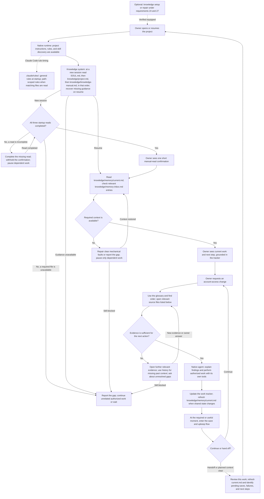
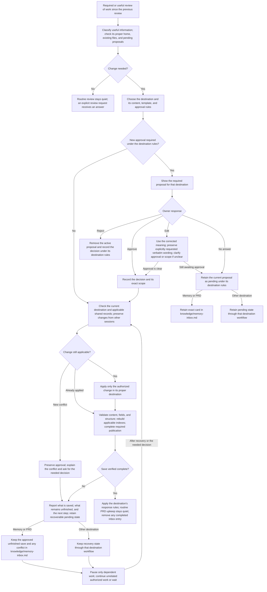

# The project second brain

## Contents

- [Notes](#notes)
- [Why this exists](#why-this-exists)
- [How the owner works](#how-the-owner-works)
- [Where it sits](#where-it-sits)
- [How to read this](#how-to-read-this)
- [Project folder layout](#project-folder-layout)
- [A session, start to finish](#a-session-start-to-finish)
- [1. Plain parts only](#1-plain-parts-only)
- [2. The agent follows this system](#2-the-agent-follows-this-system)
- [3. Reliable behavior without reminders](#3-reliable-behavior-without-reminders)
- [4. Picks up where the last left off](#4-picks-up-where-the-last-left-off)
- [5. Check memory first](#5-check-memory-first)
- [6. Cite the source](#6-cite-the-source)
- [7. Speaks the project's language](#7-speaks-the-projects-language)
- [8. Read the real documentation first](#8-read-the-real-documentation-first)
- [9. Saving is frictionless](#9-saving-is-frictionless)
- [10. Approval before any write](#10-approval-before-any-write)
- [11. What counts as memory](#11-what-counts-as-memory)
- [12. What never counts](#12-what-never-counts)
- [13. Working memory](#13-working-memory)
- [14. Memory file shape](#14-memory-file-shape)
- [15. How the words are written](#15-how-the-words-are-written)
- [16. Requirements documents](#16-requirements-documents)
- [17. Procedures become skills](#17-procedures-become-skills)
- [18. Where information goes](#18-where-information-goes)
- [19. The find order](#19-the-find-order)
- [20. The save card](#20-the-save-card)
- [21. Indexes and the checker](#21-indexes-and-the-checker)
- [22. Keeping current truth clean](#22-keeping-current-truth-clean)
- [23. Learning what to save](#23-learning-what-to-save)
- [24. Request knowledge operations in plain language](#24-request-knowledge-operations-in-plain-language)
- [25. Codex](#25-codex)
- [26. Built the way Claude Code's documentation says](#26-built-the-way-claude-codes-documentation-says)
- [27. Installed once, turned on per project, and checked](#27-installed-once-turned-on-per-project-and-checked)
- [28. Pending memory inbox](#28-pending-memory-inbox)
- [29. Preserve agent judgment with narrow safeguards](#29-preserve-agent-judgment-with-narrow-safeguards)
- [30. Integration with the toolkit OS and other components](#30-integration-with-the-toolkit-os-and-other-components)
- [Potential paths to explore](#potential-paths-to-explore)

## Why this exists

The owner should not have to remember the state of the project himself. The
agent remembers it for him.

- The agent knows more than the owner about what has been going on in this project.
- It gets smarter over time, because what it learns is written down and read back.
- Every new session feels like talking to the same agent, not a stranger who has to be caught up.
- It is the agent's lasting memory, tuned so the agent learns when something is worth keeping.
- The owner can edit knowledge files directly. Requirement 1 defines recovery when an edit breaks a link or required structure.

Two ways to fail, and both are bad. Remembering too little means the owner
explains the same thing again. Remembering carelessly is worse, because a later
agent believes information that is out of date and acts on it.

## How the owner works

The owner routinely runs several parallel agent conversations in the integrated
terminals of one VS Code project or directory. Sessions may use different
models, and they may use different agent programs. This document calls an agent
program a harness; Claude Code and Codex are the ones it names. Much of the work
is complex requirements gathering, solution design, and reasoning. A session's
context window, the limited amount of text the agent can hold at one time, fills
quickly. A session may have its context condensed into a summary, be cleared, or
be replaced while other sessions keep working.

The owner should never have to look after knowledge upkeep himself. He should
not have to remind an agent to look something up, tell it where information
belongs, repeat the save rules, or work out again what another session did. He approves what gets saved
as lasting knowledge, and he approves anything proposed for removal. The agent
notices the need, finds the right instructions, prepares the proposal, and
finishes the upkeep it is already allowed to do.

Loading all the instructions at the start of a session and hoping the agent
still has them in mind later does not meet this requirement. The system must
guide the agent at the moment it needs to find, propose, write, update, or
remove information.
The agent keeps its freedom to reason, investigate, and design within those
boundaries. Requirements 2, 13, 18, and 19 define this behavior.

## Where it sits

The knowledge system is one part of the [Toolkit Operating System](toolkit-operating-system.md).
This document is a product requirements document, a PRD for short. It includes
the changes the wider operating system needs so that the knowledge behavior
works inside it. Requirement 30 says who is responsible for joining the two
together, and where the line sits between this part and the other parts.

The toolkit ships a whole set of parts, also called components, for working
with an AI agent on a project: rules, hooks, skills, the work tracker, and captured outside
documentation. The second brain is two of those parts. It is the memory, and it
is the record of what the product has to do, what the person using it
experiences, what the process requires, and why, which is what a PRD holds. It
keeps what is true in this project and why. Anything else belongs to another
part, and the second brain does not keep it. A repeatable procedure goes to a
skill. A standing instruction goes to `.claude/rules/`, scoped in the ways the
harness supports. Live status goes to the work tracker. How one item gets built
and its build order belong in its solution design and work-item plan, kept with
or linked from the chosen tracker. Outside documentation the agent can use goes
to `ai-external-knowledge/`. Requirement 18 is the full list.

The system sets a small number of required responsibilities. The agent chooses
how to investigate, reason, and solve the task while meeting them. For example,
it decides which information meets the rules for what counts as memory, but it
still gets the required approval before saving. This is not a fixed script for
every action.
Requirements 3 and 29 distinguish reliable outcomes from attempts to control
the agent's thinking.

Judge every requirement below against that whole set of parts. If a requirement
moves work into the second brain that another part already owns, the requirement
is wrong.

## How to read this

- The status is `proposed`. This document describes the finished system. It does not describe how the system works today.
- The numbered requirements say what must happen, what the owner sees, the rules for the process and for decisions, and the required data model, which means what information is stored and in which fields. A closing section keeps preferred design directions and examples separate from the requirements. Detailed choices about how to build it, and build plans, belong with the work item.
- This document holds the goal, the requirement, and the behavior. Each requirement is written clearly enough that a builder can design from it without guessing the intended behavior. The solution design may choose among different ways to meet the same requirement; this document does not choose how it gets built.
- When the owner has already allowed the agent to keep refining this document, and he then gives a clear answer or correction, the agent records the correction and starts saving it here in that same reply, under requirements 9 and 10. This PRD remains the final destination; a pending record or issue comment never substitutes for completing its update.
- Mike authorized ongoing refinement of this PRD and approved the drafting-permission rule in requirement 10 on 2026-09-10. That permission covers faithful capture of his answers and corrections; it does not approve every requirement, a solution design, or implementation.
- Requirement 3 says what reliable behavior has to produce, and what evidence proves it. The solution design chooses how the harness's documented features deliver those outcomes, and it names any limits.
- "A session, start to finish" follows one session through every requirement, so the numbered list is easier to follow.
- This PRD must stay consistent with the [approved walkthrough](knowledge-system-walkthrough.html). When they conflict, update this PRD to match the approved walkthrough. A later clear owner clarification takes precedence and is reconciled across both. Do not infer an answer to a question the walkthrough leaves open.
- On 2026-09-12, Mike authorized importing the agreed direction from the linked ChatGPT conversation and decision report, interviewing him, and saving clear answers directly to this PRD on `main`. This continues drafting permission; it does not approve the complete requirements or authorize implementation.
- The closing section records the preferred way of solving this and the rough shape of the design, with examples and open design questions. A preferred direction is not a proven feature of the platform, and it is not a finished solution design.
- For current operations, follow `knowledge/knowledge-manual.md` and the applicable instructions for the destination, as the walkthrough requires. This proposed PRD describes intended behavior; reading it does not replace the operating instructions. Name disagreements and update those instructions through authorized work against the approved requirements.

## Project folder layout

```text
project/
├── SOUL.md
├── brainstorms/
├── ai-external-knowledge/
│   ├── README.md
│   └── captured-topic/
│       └── README.md
└── knowledge/
    ├── README.md
    ├── project.md
    ├── memory-inbox.md
    ├── memory/
    │   ├── memory-index.md
    │   ├── memory-entries/
    │   │   ├── terminology-glossary.md
    │   │   ├── memory-topicarea1.md
    │   │   └── larger-topic-area/
    │   │       ├── subtopic-one.md
    │   │       └── subtopic-two.md
    │   └── current.md
    ├── prds/
    │   └── prd-index.md
    ├── .obsidian/
    └── system-guide/
        ├── system-guide-index.md
        └── system-guide-entries/
            ├── system-guide-area1.md
            └── system-guide-area2.md
```

The topic and area filenames are examples. Memory topic files and optional
topic folders follow requirement 14. The outside-documentation index and
captured topics follow requirements 8 and 21. The System Guide is a separate
part of the toolkit that a project can turn on or leave off; this layout shows
where it lives when a project turns it on. Its index points to pages in
`system-guide-entries/`. Brainstorms live in `brainstorms/` at the project root,
outside `knowledge/`.

`SOUL.md` sits at the project root. It says what the agent is responsible for
in this project, and it is the first of the required startup reads in
requirement 2.

The PRD index and parent-and-child PRDs remain under `knowledge/prds/` as
requirements 16 and 21 describe. The pending inbox remains at
`knowledge/memory-inbox.md` under requirement 28.

When adopting this layout, preserve existing content and working links.
Instructions and indexes must lead to the current locations.

**Check:** compare the project folders with this layout. Each memory topic has
one file or one topic folder in `memory-entries/`; the glossary is also there.
Current work sits beside that folder. The owner's feedback about what is worth
saving as memory has no fixed home in this layout; requirement 23 leaves that
choice to the design. An enabled System Guide has its own index and entries
folder. Brainstorms are at the project root. Existing content remains
reachable.

## A session, start to finish

**Example:** an existing project is evaluating a change to account access before
its next release. The owner returns to the project, investigates the change,
settles requirements, and later hands the work to another session. The example
uses the planned folder layout. Topic filenames are illustrative.

The flow includes **behavior the harness already provides**, meaning what Claude
Code or Codex does on its own, and **knowledge-system behavior**, which this
document requires. The harness's own steps are shown so the whole process makes
sense; the toolkit does not rebuild them. The numbered requirements define the
behavior. The solution design chooses any extra triggers, and any way of
enforcing them.

### Session flow



The recovery arrows resume after the missing context or decision becomes
available; they do not require repeated retries while blocked. The agent can
continue unrelated authorized work. A normal turn does not require a handoff,
a new proposal, or a visit to every source.

### 1. Start or resume the session

The harness itself makes project instructions, rules, and available skills
reachable in whatever ways it supports, including files such as `CLAUDE.md` or
`AGENTS.md`. This step is here as background for the walkthrough; building it is
not part of the knowledge system.

In Claude Code, [native rule handling](https://code.claude.com/docs/en/memory#path-specific-rules) includes:

- Project rules in `.claude/rules/`. Rules without a `paths` field load at startup when project rules are enabled.
- Rules with YAML `paths` patterns. These load when Claude reads matching files, rather than all loading at startup.
- Personal rules in `~/.claude/rules/`, which apply across projects.

Codex uses the instruction methods it supports, under requirement 25.

At a new session start, the agent reads three files in this order: `SOUL.md`,
what the agent is responsible for in this project; `knowledge/project.md`, what
the project is, its resources, and where work is tracked; and
`knowledge/knowledge-manual.md`, the knowledge manual. The instruction to make these reads
reaches the agent before it makes them.

Then the system checks that all three reads finished: the contents of each file
reached the agent and were read. Listing file names, or sending a reminder, does
not count as reading a file. If a read did not finish, tell the agent to finish
it, hold back the confirmation, and pause the work that depends on that file. If
one of the three files is unavailable, say which file is missing and pause only
the work that depends on it; come back to that read when the file is available.
Once all three reads are done, the agent gives the one short confirmation in
requirement 2.

On resume or context loss, the agent recovers guidance that is missing or no
longer current. It does not repeat the full manual on every message.

The agent then reads `knowledge/memory/current.md` to understand the work shared
across sessions, and checks `knowledge/memory-inbox.md` for relevant proposals still
waiting for an answer, or saves that did not finish. It opens the tracker record
those files link to, which holds the real status of the work and the approvals
given. The owner then gets a short briefing: the account-access review is still
open, the earlier constraint still applies, and the next step is to check the
proposed change against that constraint. The briefing names the overview and the
tracker record the information came from, as requirement 6 requires. When the briefing uses project
shorthand, the agent applies the glossary under requirement 7 before showing it.
Requirements 2–4, 13, and 28 define startup and recovery behavior.

### 2. Interpret the request and open the right sources

The owner asks whether account access should change for this release. The agent
uses the glossary, the role each source plays, and the find order in
requirements 5–8 and 19. It chooses its own search terms, tools, and how deep to
investigate. If it already has relevant information that is still current, it
can reuse that instead of searching again.

| Source in this example | What the agent reads and why |
| --- | --- |
| Shared work and tracker | `knowledge/memory/current.md`, then its linked work item, to establish current scope, approval, blocker, and next step. |
| Instructions and skills | The root and folder instructions that apply, the rules, and a relevant skill such as `.claude/skills/<name>/SKILL.md`, or whatever the harness in use calls the same thing, read before using that procedure. |
| Project terminology | `knowledge/memory/memory-entries/terminology-glossary.md` to resolve shorthand before searching for the wrong concept. |
| Earlier decisions | `knowledge/memory/memory-index.md`, then `knowledge/memory/memory-entries/account-access.md`, to read the earlier decision and its evidence. |
| Required behavior | `knowledge/prds/prd-index.md`, then the relevant PRD under `knowledge/prds/`, to establish what users must be able to do. A proposed requirement does not prove current behavior. |
| Existing system | When enabled, `knowledge/system-guide/system-guide-index.md`, then the relevant page in `system-guide-entries/`. The agent checks code or live evidence when the question concerns what exists now. |
| Vendor documentation | `ai-external-knowledge/README.md`, then the relevant captured page, when the answer depends on vendor behavior. Missing or outdated evidence is handled under requirement 8. |
| Earlier conversation | Available project session history, if the earlier sources leave a relevant gap. Historical claims are checked before being presented as current. |

The owner sees an answer backed by the relevant sources, and the answer names
those sources in the way requirement 6 sets out. If the evidence leaves a gap
that matters, the agent says what is missing and asks a focused question. The
table shows the sources a lookup can use; it is not a script that searches every
folder for every request.

### 3. Work and maintain shared context

The agent does the research, design, or building it has been authorized to do,
using its own reasoning and tools. Reading a proposed PRD is not permission to
build it. The delivery workflow owns the work item's status, approvals, and
build plan.

During that work, the agent also notices project information worth retaining
outside the active item's scope. Conversation, requirements refinement, and
solution design count as work even when no files change. Requirements 9 and
18 govern capturing that information in its proper home without silently
expanding the work being implemented.

When shared context changes in a way that matters, the agent reads
`knowledge/memory/current.md` again and updates it, keeping the active work of
other sessions intact and linking to the tracker instead of copying it. A
finding nobody has checked stays labelled as unchecked. Throwaway details stay
in the conversation. When the agent updates the shared overview, it tells the
owner in one line. Requirements 4, 12, 13, and 18 set these boundaries.

### 4. Review, route, and save

The investigation may produce a lasting decision about the release, a correction
to a PRD, or a repeatable procedure for this project. Each one has its own rules
about where it goes. Before proposing a memory, the agent checks the rules for
what counts, the exclusions, the files that already exist, and any relevant
feedback from the owner under requirement 23. Requirement 18 says where each one
belongs.



The general steps in the diagram happen inside each destination's own workflow.
The rules about the memory inbox, and about saving straight to the default
branch, apply to knowledge saves. They do not become a new way of delivering
skills, rules, or System Guide pages. Requirement 20 says how a proposal is laid
out, and requirement 10 says how approval works. Useful feedback the owner gives
on memory proposals is kept and used again under requirement 23.

| Information produced | Destination and resulting action |
| --- | --- |
| Lasting account-access decision | Update the existing topic in `knowledge/memory/memory-entries/` after required approval. Keep its source and required fields; avoid a second file for the same topic. |
| Significant result the project will look up later | At task end, propose an event memory with the result and output location under requirement 11. Routine work produces no episode proposal. |
| Clear correction within authorized PRD refinement | Update the named PRD in `knowledge/prds/` without asking for the same permission again. A new requirement recommended by the agent still needs agreement. |
| Shipped changes to behavior or requirements from authorized work | Maintain all applicable PRDs under requirement 16, validate, commit, and push without a new save card or routine notification. Respect explicit publication holds. |
| Reusable project procedure | Propose a project skill and use that destination's approval and delivery rules. |
| Explanation of an existing part | Use the enabled System Guide's own workflow and its `knowledge/system-guide/` location. |
| New project shorthand | Propose an update to the existing glossary table. |
| Standing instruction | Use the project's root instructions or rules workflow, rather than saving it as memory. |
| Changed work status or continuation context | Update the tracker or `knowledge/memory/current.md` as appropriate; link to the detailed record. |
| Raw exploration worth retaining | Use `brainstorms/`; it remains unchecked exploration, not approved knowledge. |
| Outside reference material | Use the captured-documentation workflow under `ai-external-knowledge/`, keeping the source and capture date. |
| Low-value or disposable detail | Keep it out of lasting knowledge and do not show a memory proposal for it. |

A memory or PRD save is finished only when it carries the approved meaning, uses
the required format, has its indexes rebuilt, passes its checks, and is
published, as requirements 9, 14–16, and 21 require. Writing the file on this
computer alone does not make it published. Proposals still waiting, and approved
saves that did not finish, follow requirement 28, which also covers conflicting
changes and picking the work up again without writing the same thing twice.

### 5. Repair or clean up when needed

Any of these can begin during a lookup, during the work, or during a save
review. They come back to the same approval and checking rules; they never
create a second way to save.

| Condition | Action and return to the session |
| --- | --- |
| Owner renamed, moved, or deleted a file | Apply requirement 1: automatically repair only a clear mechanical fault that preserves intent. Ask before choosing unclear meaning or restoring deliberately deleted content. Resume dependent work after recovery. |
| Existing knowledge is duplicated, conflicting, or no longer useful | Use requirement 22 for a review across knowledge or an operation on one file. Lasting changes still require the appropriate approval. |
| Setup is missing, disabled, outdated, or broken | Use the setup or repair requirements in 24 and 27. Activating a project requires its owner's approval. |
| A request names an operation in ordinary language | Provide the corresponding outcome in requirement 24. Only the applicable operations are needed. |

### 6. Hand off and continue later

Before a handoff or a deliberate context clear, the agent reviews this work,
refreshes `knowledge/memory/current.md`, and picks out the entries in
`knowledge/memory-inbox.md` that still matter. The tracker holds the detailed
state of delivery; the shared overview gives the next session its starting
points and its next step. Before opening a pull request or closing the work
item, the required review also covers the work being handed over.

A proposal the owner has not answered stays pending. An approved save that did
not finish stays recoverable. Neither is presented as knowledge that is already
saved. If the agent cannot share an update with the other sessions, it says so,
so the owner knows what another session cannot yet see.

Work resumes in one of three ways. A new session makes the ordered startup reads
and gives the one confirmation in requirement 2, then checks the shared context
and anything left pending. When the same session resumes, or its context has
been condensed, the agent brings back the knowledge map, plus any guidance or
source content that is missing or has changed. It reuses what it already has, as
long as that is still current. It does not repeat the startup confirmation on an
ordinary resumed turn. After an unexpected interruption, the agent recovers from
the latest state that was actually saved and shared, checks that state against
current records, and reports what is missing. It does not assume a final handoff
review ran before the interruption.

The next session checks the dated overview against its linked tracker and
sources, recovers relevant pending work, and continues without making the owner
repeat settled decisions. Requirements 3, 4, 9, 13, 19, and 28 keep that
continuity working on every harness the toolkit supports, under requirement 25.

## 1. Plain parts only

- Every piece of knowledge this system keeps is a plain text file in this repository, and those files are the only copy. No database or separate store the owner cannot open. No independent background process decides what to save. A helper may execute an already-authorized save under requirement 9 while the main conversation continues.
- Built from what Claude Code already ships: rules, hooks, skills, Markdown files, and Git. Nothing else.
- Reuse the toolkit parts that already exist, and the features the harness's own documentation describes, before building anything new. Anything new must name the requirement that no existing part can meet. The knowledge system does not add another work tracker, and it does not become a second owner of content that another part of the toolkit already owns.
- The owner can read, edit, move, or delete knowledge files by hand. The agent respects the resulting content rather than silently undoing the owner's changes.
- If an edit breaks a link or a required part of a file's structure, the agent repairs it without asking only when the right fix is obvious and keeps the meaning. For example: updating links after a rename that leaves no doubt what the new name is, and rebuilding an index.
- The agent asks first before any repair that could change what something means, that would make it pick between unclear destinations, or that would put back content the owner deleted on purpose. It names the file and says what decision it needs, rather than guessing.
- Until the problem is resolved, only work that depends on the broken information pauses. Unrelated authorized work continues under requirement 3.

**Check:** rename a knowledge file by hand. The agent updates its links and
rebuilds the index without asking when the destination is clear. Delete a file
deliberately: the agent does not restore its content without approval. Make a
change with two plausible repairs: the agent explains the choice and asks. Only
dependent work pauses while that decision is pending.

**Check:** list every part the system is built from. Each one is a rule file,
a hook, a skill, a Markdown file, or Git.

## 2. The agent follows this system

- In every session, the agent follows the knowledge system: when to save, what to save, how to save, where to save, what to check first, what to cite, and what never to write.
- Reading a rule is not enough. The agent has to actually do what the rule says, every time. Example: requirement 9 requires a save review at the end of meaningful work. The test is whether the right proposals, saves the agent was allowed to make, and pending records actually come out of it, not whether the agent read the rule.
- It follows the system whether or not the owner mentions it. The owner never has to remind it.
- At a new session start, the agent reads three files in this order: `SOUL.md`, then `knowledge/project.md`, then the knowledge manual at `knowledge/knowledge-manual.md`. The instruction to make these reads must reach the agent before it makes them. The manual explains each place knowledge is kept, what belongs in each place and what does not, how to choose what is worth saving, how to propose a save, how approval works, and the file conventions, and it points to the detailed guidance for each part.
- A completion check follows the three reads. It confirms that the contents of each file reached the agent and were read. Listing file names or issuing a reminder does not complete a read. Only after that check does the agent show the owner one short confirmation, such as “I’ve read the knowledge manual.” Show it once, without a checklist or repeated confirmations on normal turns.
- If a read is incomplete, direct the agent to finish it, hold back the confirmation, and pause work that depends on the unread file. If one of the three files is unavailable, say which file is missing and pause only work that depends on it. Come back to that read when the file is available.
- If the manual or other required guidance is unavailable, the agent reports the missing source and pauses only work that depends on it. Unrelated authorized work may continue. It never confirms reading an unavailable manual.
- A small map is available at the start of a session, and again whenever context is condensed, cleared, or resumed. The map points to the instructions in force, the places information is kept, the indexes, and the checks that apply. Detailed rules, templates, and knowledge are opened when they are needed; the whole knowledge base and every procedure are not loaded at the start.
- The instructions that apply to a task are in force from the first read or action they cover, including a memory lookup and work tracking. The agent reuses guidance it already has and that is still current, and it reads any further folder or skill instructions before the action those instructions cover. For example: before a lookup, the agent works out which find order applies. Before proposing or making a knowledge change, it works out the rules for the destination, what must stay out of it, the approval rules, the file fields, the template, and the writing standard. It follows the current instructions for that operation even late in a long session. Guidance it has already read can be reused while it is still available and still current. Guidance that is missing is opened again before the affected operation goes ahead.
- The same guidance applies when the owner switches to a different task, or when another session changes the records that matter here. A check finished for an earlier task does not show that the new task's knowledge was checked.
- The system is responsible for bringing the needed guidance back at these moments. A single briefing at the start, or the owner repeating a rule, is not enough. Which documented harness feature delivers that guidance, and delivers the checks in requirement 3, is the design's job.
- The agent uses its own judgment to work out what something means, choose relevant sources, reject candidates that are not worth saving, and write a useful proposal. It cannot use that judgment to skip a lookup, an approval, a check, or an upkeep moment that this system requires.
- Testing shows whether the agent follows this. Never assume it. Requirement 3 says what the results must be, which situations are tested, and what happens when an operation is missed or left half done.

**Check:** at a new session start, the owner sees one short confirmation after
the agent reads the manual. Normal turns contain no repeated confirmation or
startup checklist. Make the manual unavailable: no confirmation is shown, the
missing path is reported, and only dependent work pauses.

**Check:** run a whole session without mentioning memory once. At every moment
this document names, the agent does what this document says. Any moment where it
did not is found during the checks and dealt with under requirement 3.

**Check:** run a long requirements or design conversation, condense its context,
then introduce a correction, a lasting decision, and a routine detail that must
not be saved. Without a reminder from the owner, the agent finds the current
guidance, routes each correctly, uses the standard proposal and file shape,
and waits for the required approval. Repeat after switching tasks and in a
fresh session on each supported harness. An initial briefing alone does not
pass this check.

## 3. Reliable behavior without reminders

The owner must be able to rely on knowledge upkeep throughout long and parallel
sessions. Reading instructions once is not enough. The system brings back the
guidance the agent needs, checks that the required conditions are met, and shows
the owner an operation that failed or was left unfinished, rather than waiting
for him to notice it.

### Required outcomes

- At a new session start, all three startup reads in requirement 2 finish before the owner sees the confirmation. A read that did not finish, or a file that is missing, is reported instead.
- Before acting on a new or resumed request, the agent has read the shared working context under requirement 13 and checked the pending inbox under requirement 28. If either step was missed, the agent goes back and does it. If an expected source is missing, it reports the gap and pauses only the work that depends on it.
- After changing the shared working context, the agent confirms in one short line that the update is saved and available to the next project session. If it is not, the agent reports where it was saved and what is not yet shared, and keeps the unfinished step visible.
- Before answering anything that rests on project information, or acting on it, the agent checks the relevant knowledge under requirement 19. Relevant, current sources that are already in the agent's context can satisfy that check. A check done for an earlier task does not automatically cover a different task.
- An answer or proposal based on saved knowledge identifies its supporting source under requirement 6. This applies no matter how the agent found or opened that source. A file path that came back with a search result does not on its own show that the answer is supported.
- The external-knowledge index is reachable from the small map. The agent opens relevant outside documentation before relying on it, as requirement 8 requires.
- A save review happens at every moment in requirement 9. Opening a pull request or closing a work item requires that review for the work being handed over. At the end of a turn that involved real work, the review happens quietly unless there is something to approve, a save the owner needs to be told about, or a problem. Requirement 16 keeps routine PRD upkeep quiet. At a handoff, the agent works out which pending items matter, under requirement 28. An explicit request for a save or review still receives a clear answer, including when nothing qualifies. An existing inbox entry alone does not satisfy a new review.
- Before the agent processes every submitted user prompt, it receives the short reminder in requirement 9 and explicitly acknowledges that it will evaluate the latest message and relevant conversation for project information worth retaining or updating. The acknowledgment confirms receipt and intent; it does not prove that the review finished, that the agent judged the information correctly, or that any save is approved.
- Lasting knowledge is changed only as far as the owner's approval reaches. Proposals follow the standard format, and a proposal that is missing required information is fixed before the agent asks for approval. A save is not reported as complete until its content, its required fields, its indexes, and its publication have all been checked. A check that fails leaves the save unfinished.
- When a required check or save was missed, the agent finds what was missed and then does the review or the recovery that is needed, staying inside the permission it already has. It never claims the missing check happened, and it never asks the owner to reconstruct the session for it.

### How reliability is demonstrated

The solution design says which conditions the harness can check or block by
itself, which ones depend on the agent understanding what something means, and
how the conditions that depend on the agent's understanding are guided and
checked. Use the toolkit parts that already exist, and the features the
harness's own documentation describes, before anything else. A custom blocker, a
program that reads the agent's replies, a single fixed search route, or a
counter of sessions is not required just because it could be built.

The outcomes above are still required. Where a protection cannot be built, or
where the outcome still depends on the agent's judgment, the design, and the
project's setup report, must name it, say what it means in practice, and say
what happens when it goes wrong and how it recovers. Do not describe a reminder as
something that is guaranteed to stop the agent, and do not claim that a count of
actions proves the right information was found or saved. Reporting a limit is
not evidence that the requirement is met.

**Check:** run representative sessions on every supported harness: a fresh
session, a long reasoning conversation with context condensed, a task switch,
and parallel sessions changing shared knowledge. Include a known fact, a
correction needing approval, an already-approved save, a low-value detail that
must stay out, a failed save, and a handoff. Verify the resulting proposals,
source-backed answers, saved files, and recovered state against the expected
outcomes. The owner gives no reminders during the test. Write down the failures
and the gaps. Reading a rule, calling a tool, or increasing a counter does
not on its own pass this check.

### A failure pauses the affected work

When a knowledge save fails, pause that save and any work that depends on that
save finishing. Carry on with unrelated work that can still be done accurately
within the permission already given. One failed save does not stop the whole
session.

The agent says what failed, what was actually saved, what remains unfinished,
which dependent work is waiting, and the next step. It fixes what it can within
existing approval and permissions. If it cannot finish, it reports the blocker
and never claims that the save or dependent work is complete. This applies to
validation and publication failures as well as a missing required approval.

**Check:** make a knowledge save fail while the session has one task that needs
the saved result and another that does not. The save and dependent task remain
unfinished; the agent reports the failure and continues the unrelated task.
Once the save succeeds, the dependent task can resume under its existing
approval.

## 4. Picks up where the last left off

- The owner comes back after two days, asks "what were we working on?", and the agent answers.
- The answer covers what is in progress, recent meaningful accomplishments, what the next session needs to know, and what to do next. Working memory keeps the recent results needed to resume; follow links to owning records for full history and decision reasoning.
- The owner never pieces this together himself.
- So `knowledge/memory/current.md` is kept up to date as work happens, across sessions, not only at the end of one.
- Updates to it are quick and short. The agent makes them on its own, without asking, and tells the owner in one line that it did. This file is not lasting memory, so a wrong line costs little and the owner can fix it by hand. A stale file costs a lot more.

**Check:** work in one session, close it, open a fresh session two days later and
ask "what were we working on?". The agent answers correctly without reading any
transcript.

## 5. Check memory first

- When the owner asks something, or the agent starts a task, the agent first checks whether this project already knows the answer, already solved it, or holds useful context.
- It brings that up without being asked.
- This check is required for a question and for a task alike. Use relevant information the agent already has, as long as it is still current, rather than repeating a search just to have a search on the record. Requirement 3 says how this is made reliable and how it is checked.
- Work out what the owner is asking for first, from what he said or from one clarifying question. Then decide one thing: could long-term project knowledge affect this answer or action? If no, carry on without a memory lookup. If yes and the source has already been read and is still current, reuse it. If yes and the agent needs the source content, find it and read it.
- That decision is made once for the request, and it holds while the scope of the request and the relevant information stay the same. Running another tool is not on its own a reason to decide again.
- To find the right source, use the glossary at `knowledge/memory/memory-entries/terminology-glossary.md` and the memory index at `knowledge/memory/memory-index.md`. A line in an index, or a save still waiting in the inbox, is a pointer, not evidence.

**Check:** ask about something already saved. The agent answers from the saved
file and names it, instead of searching the code or asking the owner.

## 6. Cite the source

- Whenever the agent checks memory, a PRD, a saved session, or the outside documentation folder and finds something, it says what it found and, on the line right below, where it found it.
- What that line carries: the file path. For something found in a past session, the name and date of that session. For an outside documentation page, the path of the page and the date the page was captured.
- This covers an answer, a past fix, and any context the agent brings up.
- This happens every time. It is never optional, and never only when the owner asks.
- Why: the owner has to be able to see that the answer came from what this project actually knows, and go and check it himself.

**Check:** the agent says "the project already has this". The line right below
names the file it came from, and the owner can open that file and find it there.

## 7. Speaks the project's language

The system ships a glossary: one file, `knowledge/memory/memory-entries/terminology-glossary.md`. It maps the
owner's words and the client's shorthand to the real thing, which may be a field
name, a system, a person, or a process.

- From the first message of every session, the agent uses the glossary's meanings without being told to. How it gets them is the builder's choice.
- When a term in the glossary is used, the agent applies it and does not ask.
- When a term is unfamiliar, first use the conversation, glossary, and relevant project sources to resolve it. Ask one focused question only when uncertainty remains that could change the answer or action. Propose a glossary entry when the mapping is useful recurring project shorthand, through the normal card and approval flow.
- The glossary has a title, one sentence explaining its purpose, and one alphabetical Markdown table, with one short row per term. Use the template below. No heading or paragraph for each term; keep every cell brief.
- The project's small knowledge map includes a clearly labelled direct link to the glossary alongside the memory index. The glossary stays out of the generated memory index and needs no index fields such as `group` or `summary`. Keep its direct link working when its location changes.
- Put alternate names in the same row. If a term means different things in different systems, clearly identify the context.
- Keep only a short caution in the table. Link to detailed explanations or important history in their proper home under requirement 18. Their length does not make them memory.
- Update the existing row when its meaning changes; remove obsolete or duplicate wording. Do not append another account of the same meaning.
- On each row, record where the meaning came from and the date, and show whether somebody simply reported the meaning or somebody checked it. Mark a meaning that is still unsettled instead of presenting it as agreed.
- Add terms that need explanation in this project, not every ordinary word.
- Work out what the project's shorthand means before reaching tier 4 of the find order in requirement 19, so that searches use the names people actually meant. Reuse a meaning that is already settled and still current; meeting an unfamiliar word is not on its own a reason to add a glossary row.
- The owner's example: he said "match on the discovery email field and the core email field", and the agent knew exactly which two fields those were, like a colleague who had been on the project for years.

### Glossary template

The file title is "Terminology glossary",
followed by this purpose sentence and table. The PCO row illustrates the format;
each project supplies its own terms and sources.

Project words and shorthand, what they mean, and what they refer to.

| Term / aliases | Plain meaning | Refers to | Watch out | Source / date |
| --- | --- | --- | --- | --- |
| PCO | Patient Care Operations | The PCO department | Older documents contain an incorrect expansion. | Mike, 2026-09-08; reported |

**Check:** use a known term, then an unfamiliar term whose meaning is clear
from a project source. The agent resolves both without asking. Use a term with
two plausible meanings that change the action: it asks one focused question.
It proposes a glossary entry for a useful recurring mapping, not every new word.

**Check:** scan a glossary containing several terms, alternate names, a meaning
that differs between systems, and an unresolved term. The table stays compact
and alphabetical, identifies the different contexts and uncertainty, and names
each row's source and date. Updating a meaning edits its row; detailed history
is linked rather than expanded into paragraphs under the term.

## 8. Read the real documentation first

- `ai-external-knowledge/README.md` is the index of captured outside knowledge. It is generated in the same way as the memory and PRD indexes in requirement 21: entries grouped under headings, each entry a link and a one-line summary. Each topic entry links to its captured entry page; it does not copy the documentation into the index.
- The project's small knowledge map points to this index. While looking something up, the agent scans the index to decide whether any captured documentation is relevant. If a current read of the index is already in its context and the topic list has not changed, it can use that. If the list changed or the context was lost, it reads the index again.
- Before running a repeatable process or working out a fix that depends on a captured topic, the agent opens the relevant page. Example: before changing a hook, it reads the captured Claude Code page about hooks instead of relying on what it already thinks it knows about hooks. Unrelated topics are not opened.
- One folder per captured topic. Its entry page supplies `group` and `summary` in YAML frontmatter for the index, and records the original source address and capture or refresh date. The summary states what the topic covers and when it is useful. These are outside-documentation fields; memory approval, confidence, and status fields do not apply.
- Adding, refreshing, moving, or removing a captured topic rebuilds and checks its index as part of the same upkeep. Requirement 21 owns the shared index format; outside-documentation upkeep owns the captured sources and their metadata.
- Captured documentation is source material from outside this project, not something this project has approved as true. The agent checks whether the page's date and version suit the task in hand. When a page is missing or out of date and that matters, the agent checks the current original source if it can reach it, or says plainly what it could not check. It never presents an old copy as proof of how something behaves today.
- The agent decides for itself which outside topics are relevant, then makes the required checks on those sources before relying on them. Requirement 3 says how that behavior is proven.

**Check:** ask for something a captured topic covers without naming the folder.
The agent finds the topic through the index, opens the relevant page before
acting on its claims, and cites the page and capture date. An unrelated topic
is left unopened. Refresh or remove a topic and check that the index follows.
Repeat with an outdated capture: the answer identifies its age and checks the
original source or states what could not be verified.

## 9. Saving is frictionless

- A save that needs new approval is one short card and one yes, whether it is a memory or a product requirements document. The agent may already have permission: requirement 10 covers refining a PRD, and requirement 16 covers updating PRDs on its own after work ships. Neither of those needs another card and another yes for the same scope.
- No long review. No back and forth. No reading a full file before deciding.
- The agent proposes at the right moment on its own. The owner never has to remember to ask.
- Notice useful information throughout the work, including discussion, requirements refinement, and solution design with no file edits. Review project-relevant information outside the active work item's scope as well as information about that item. Do not wait for a changed-file count, a commit, a task switch, or the owner to point it out. Requirement 18 determines its scope and home; noticing it is not permission to implement unrelated work.
- Before every user prompt is processed, a short hook reminder begins with this owner direction: “Friendly reminder: keep front of mind and follow all of the Toolkit operating system methodologies, processes, and instructions. Know where the project files and folders live.” It asks the agent to evaluate the latest message and relevant conversation for new knowledge, updates, corrections, removal, and other needed project-record changes. It covers every destination in requirement 18, including work records, an enabled System Guide, and client delivery architecture, rather than memory alone.
- The reminder includes compact positive and negative criteria for both working and lasting memory. Working memory is concise active context, such as the objective, blocker, next step, temporary notes, hypotheses, or partial state. Lasting memory is project-relevant durable fact, decision, feedback, context, event, constraint, relationship, or real failure and fix that came from the owner or was worked out together and would otherwise need to be explained again. Tool activity, logs, conversational filler, source copies, procedures, requirements, open implementation steps, live status, system explanations, stale facts, and secrets do not become lasting memory; keep temporary state short or route the information to its proper owner. The canonical manual remains the source when the compact wording is insufficient.
- The reminder links to `knowledge/knowledge-manual.md` and to the higher Toolkit Operating System manual once that manual has an approved canonical path. It does not force either full manual to be reread on every prompt. The agent explicitly acknowledges receipt and intent to evaluate, then performs the evaluation under the existing routing and approval rules. The acknowledgment proves only receipt and intent. It is not proof that the review completed, that a candidate qualifies, or that a write is approved.
- Five moments force a save review: a work item finishes or closes, a pull request is about to be opened, a handoff or a context clear is coming, a turn ends after real work was done, and any time the owner says to save something. Requirement 3 says what each review has to produce, and how these five moments are enforced.
- Every other moment is left to the agent's judgment. It should propose a save whenever that is useful: a real problem here has just been fixed, a commit is coming, or something relevant has changed, such as a new person joining, somebody's role changing, the project switching to a different tool, a fact turning out to be out of date, or a decision about which system is the authority for a piece of data. A candidate the agent misses gets reviewed at the next required moment.
- The owner saying "remember this" starts the save flow that leads to a card. It is not permission to write, and it skips no step.
- The save review is that same flow run over everything the session discussed or did since the last one. It gathers candidates, identifies each candidate's kind, scope, and owning destination under requirement 18, and applies that destination's content rules. Requirements 11 and 12 decide eligibility for lasting memory; they must not discard a valid PRD update, working-context update, task, or procedure that belongs elsewhere. Check what proposals the inbox already holds and show one card for each new candidate that needs knowledge-save approval. A save that is already allowed goes ahead under requirement 10; other destinations follow their own workflows. During routine work, speak up only about something that needs approval, a finished save the owner has to be told about, or a problem; never report that nothing needs saving. Routine PRD upkeep follows requirement 16's quiet completion rule. Do not repeat an unchanged unanswered card at each review. When the owner asks for a save or a review directly, he still gets a clear answer, and when work is handed over the agent works out which pending items matter, under requirement 28. Requirement 3 requires the review even when it produces nothing the owner sees. A quiet review does not need a program running in the background.
- When approved, memory or PRDs are saved directly to the default branch and pushed!!! They are not left sitting on a worktree branch, and they are not put anywhere a future agent would have trouble finding.
- A save is finished only when the file is on the default branch and pushed, and not before.
- An approved knowledge save is never put off into a feature branch, a pull request, or a separate draft. That holds even when the session is doing its other work on a branch. The save still goes straight to the default branch. The session's own branch gets the saved file later, whenever someone merges or pulls the default branch into it. The pending inbox in requirement 28 preserves unanswered proposals and interrupted saves; it never replaces completing an approved save.
- One yes is the end of the owner’s part for a save that needed a proposal. He runs no Git command and does not manage a helper or a retry. After approval, the main agent promptly hands the save to a helper that can work while the conversation continues. During an authorized interview, record the settled decision and its permission for recovery, start the save, and continue to the next independent question without waiting for publication. Work that needs the published result waits for that result under requirement 3. Routine PRD upkeep keeps requirement 16’s quiet completion rule.
- The main agent remains responsible for receiving the helper’s result and reporting a failure promptly when it becomes known. Starting a helper is not a completed save. If writing, checking, or pushing fails, preserve the approved change and the exact unfinished step under requirement 28, and report what remains. Requirement 3 sets out what pauses and what can carry on.
- Finished knowledge has one home that owns it. Unfinished proposals have one known inbox, which agents keep up to date and pick up from on their own, so the owner never has to remember where a proposal was left.

### Approved saves while the conversation continues

The main agent checks relevance, destination, sources, and existing records,
then prepares the short, clear proposal under requirements 15 and 20. These
steps finish before approval. The helper executes the agreed change; it does
not select new memories, broaden the permission, or approve its own additions.

Before handing off, keep the approved meaning, destination, operation, sources,
and permission in the existing pending record under requirement 28. Give the
helper that record and the applicable save and writing instructions. Preserve
wording the owner asked to keep exactly. Do not rely on the helper’s private
context as the only record of an unfinished save.

The helper reads the latest destination, applies the approved change, checks
the actual saved text and file, and completes the existing publication process.
It returns the verified result or the unfinished step to the main agent. The
main agent checks that result before saying the save finished. A conflict that
would change approved meaning comes back for a decision; the helper does not
resolve it by inventing consent. Separate saves must preserve each other’s edits
and must not apply the same approval twice.

The conversation continues while that work runs. Report completion briefly when
required by the destination’s rules; avoid repeated progress messages. If the
host cannot run a helper alongside the conversation or return its result,
report that limitation and finish the save through the available process. Do
not claim background execution that the host cannot provide. The design must
verify this behavior separately on each supported host.

**Check:** approve a proposal, then immediately ask an unrelated question. The
main agent answers while the helper saves. Delay or fail the push: no premature
“saved” claim appears, and the pending approval survives interruption. Resume
in a fresh session and finish once without renewed approval. Repeat with two
approved saves editing the same topic and with a conflicting later decision:
no edit or approval is lost, and changed meaning is returned for a decision.

The existing `.claude/rules/knowledge-direct-commit.md` owns the procedure for
publishing authorized knowledge saves to the default branch. The inbox adds
recovery of pending proposals without creating another publication procedure.

**Check:** finish meaningful work with nothing new worth saving. The agent
performs the review without adding a no-save announcement. Finish work with a
qualifying candidate needing approval: the agent shows its card.
With a successful save, one word of approval starts the helper’s work. The owner
can continue an unrelated discussion before publication finishes. The save is
reported complete only after checks and verified publication to the default
branch. Nothing else is asked of the owner. If the save fails, the main agent
identifies the unfinished save and follows requirement 3.

**Check:** during an authorized interview, settle a requirement. The agent
records the decision and existing permission for recovery, starts its save,
and asks the next independent question without another permission request or
waiting for publication. Interrupt publication: the decision remains
recoverable, the owner hears what failed, and unrelated work may continue.
Recovery never asks the owner to repeat the decision.

## 10. Approval before any write

- Every write to a memory file or a PRD needs permission that covers that change. The permission may be the owner approving this save outright, permission already given to refine a PRD, the ongoing permission in requirement 16 to update PRDs after work ships, or the owner's per-project choice to turn the approval step off for writes to memory, described below. Otherwise, a separate proposal to save lasting memory still needs the standard card and the owner's approval.
- Approval already given for drafting or refining a named PRD covers writing down the owner's clear answers and corrections accurately, as long as they fall inside that scope. Record and start saving those in the same reply under requirement 9, without asking him to approve his own instruction a second time. The normal rules about where the text goes, how it is checked, and how it is published still apply.
- If the owner's words are ambiguous, clarify the meaning before changing the requirement. A new requirement the agent invents or recommends needs the owner's agreement before it becomes a requirement in the draft. Drafting permission does not approve that new meaning.
- A separate lasting-memory proposal still uses the standard card and approval, even when it arose during an authorized PRD interview. Drafting or saving permission does not approve the requirements as a whole, a solution design, or implementation. Requirement 16 defines what a PRD's approval fields mean.
- Record the drafting permission in the one official draft, or in the work record it links to: who gave the permission, where it came from, its date, and what it covers. A later session reads that record and keeps working under the same permission while it still applies. It does not ask again just because the session or the model changed, and it never widens the recorded scope.
- The same limit on permission applies to changing what a lasting file means, and to merging, superseding, retiring, or deleting lasting knowledge. When an operation falls outside the permission the agent already has, it proposes the operation. When the operation is already allowed, the agent carries it out and runs its checks, without making the owner handle the files.
- Silence is not approval. An unclear answer is not approval. Asking to see the full text is not approval.
- The owner may change the wording, the place, the tags, or drop the whole thing.
- When the owner corrects the summary and approves it, use the corrected understanding as the approved scope. Preserve words exactly as typed when the owner explicitly asks to save that wording verbatim. An ordinary correction does not require copying the owner's words into the saved entry. If approval or scope is unclear, retain the revised proposal and clarify before writing.
- The agent writes an accurate account of the summary the owner approved. It may add supporting context from the conversation and from the sources it used. It must not add facts nothing supports, decisions the owner was not told about, or anything outside the approved scope.
- Settle any question that would change the save before showing a save card, as requirement 20 requires. Approval covers the operation, the meaning, and the scope the card states, or the content the card names. It does not approve an assumption that is still open, and it does not approve an unrelated piece of follow-up work.
- Five things can be done without asking the owner: rebuilding an index, repairing a broken link within requirement 1’s limits, writing `knowledge/memory/current.md`, keeping this project's own feedback about what is worth saving up to date under requirement 23, and keeping the pending inbox up to date under requirement 28. None of these changes what a lasting file means. Requirement 4 says how the current file is updated. Holding a proposal in the inbox is permission to keep it, not permission to accept what it says.
- The owner of a project can turn the approval step off for writes to memory in that project, once he has worked with the agent there long enough to trust its judgment about what is worth saving. The setting is per project and is off by default, so a card and a yes are required until the owner turns it on. It covers every write to memory: a new file, an update, a merge, a supersede, a retirement, or a deletion. It does not cover PRDs; a PRD keeps the permission rules in this requirement and in requirement 16. While the setting is on, the agent runs the same review and the same checks, makes the change on its own, and tells the owner in one line what it changed and where. The owner can turn the approval step back on at any time. Mike added this on 2026-09-15 and settled its scope the same day.
- When the owner disables per-save approval for memory, record who granted that permission, when, and its scope once in the project permission settings. Each automatically saved memory records that it was auto-saved under that setting, without duplicating the grant details or implying individual review. Normal source and date fields still apply. Mike confirmed this on 2026-09-18. This decision does not turn automatic saving on for this project.
- For files the owner already approved under an older folder layout, the agent converts those files first and shows the owner the converted results afterwards, in groups small enough to read in one pass. The owner approves after the conversion, not before. Any file that will not convert cleanly is named and left alone. The agent never guesses what an old file meant.

**Check:** show a proposal and say nothing back. The exact proposal is retained
in the pending inbox, marked awaiting approval. Its destination is unchanged,
and a later session never treats the pending text as an approved fact.

**Check:** in a project where the owner has turned the approval step off for
writes to memory, the agent finds something worth saving. It saves it with the
same review and checks, and the reply says in one line what was written and
where, with no card and no question. Repeat with a retirement or a merge of two
memory files: the same one-line report, no card. Propose a change to a PRD in
that project: the PRD's own permission rules still apply. Turn the setting back
on: the next memory candidate shows a card and waits for a yes. In a project
where the setting was never turned on, the card and the yes are still required.

**Check:** correct a summary and approve the corrected meaning. The saved entry
faithfully records that meaning in the project's writing style. Repeat with an
explicit instruction to save supplied wording verbatim: those words stay
unchanged. Edit a proposal without clear approval: it remains pending.

**Check:** authorize refinement of a named PRD, then give a clear correction.
The correction is recorded for recovery and its save starts in that reply without a new approval question. Start
a fresh session: it finds the recorded permission and handles another in-scope
correction the same way. Give an ambiguous answer: it asks for clarification.
Let the agent recommend a new requirement or identify a separate memory: it
seeks the appropriate approval. None of these steps starts implementation or
marks the full requirements approved.

## 11. What counts as memory

Something is memory when all three are true:

1. It is about this project and useful to it, as `knowledge/project.md` describes the project.
2. It is significant. It is a lasting fact, a decision, a constraint, or a real lesson about how something here works or how a real problem here was fixed. The test is time: without it, the next agent would lose real time working the same thing out again. The words in the memory itself must be about this project.
3. The human user (owner) was part of it. He said it, decided it, or worked it out with the agent.

There is one exception. A real, significant problem in this project that the agent found and fixed on its own may be proposed as memory, even though the owner was not part of working it out. Nothing else skips point 3. A routine thing the agent did alone still fails point 2, so it is never proposed.

How a real failure here was fixed is memory, not a rule. The memory says what
broke, what caused it, and what fixed it. Writing one rule per fix would put
hundreds of one-off entries in the rules folder. The standing instructions the
rules folder exists for would then be much harder to find.

**One kind of memory has its own name: a significant episode.** It is a piece
of work that produced a result the project will look up again later.

- Its memory says what was done, what came out of it, and where the output lives, in a few sentences, with `type: event`.
- The card for it appears at the end of the task on its own. The owner never asks for it, and one yes writes it.
- The owner's example: an exercise matching two spreadsheets against the contacts in the system, and what the match found.
- Not an episode: routine edits, or a task with no result anyone will look up again.

**Check:** finish a piece of work with a real result. The card appears in the
same reply, and nobody asked for it.

**Check:** give the agent three candidates. The owner says "the client moved
the demo to Thursday" with no lasting decision or lesson attached. Record the
temporary schedule change in working context or its existing tracker under
requirements 12 and 13; do not propose lasting memory just because the owner
said it. The owner decides to keep the current sign-in provider for the release
because switching would delay launch, as in the walkthrough: propose the
supported decision and its reason when they pass all three points. The agent,
working alone, updated a Python package so a browser would open. That routine
step fails point 2, so no memory card is proposed for it.

## 12. What never counts

- Small things the agent did alone while doing a task, with no human in it. The owner's example: asked to open Amazon in a browser, the agent had to update a Python package to get there. That is not memory.
- Commands run, tool calls, searches, web lookups, agent behavior, and shell behavior. One exception: a trap in this project's own tools or setup that cost real time, once found and fixed, is a real fix, and requirement 11 makes that memory. Example: the Salesforce command line fails under Bash in this project, so run it from PowerShell. The three-point test still applies, so a one-off hiccup with no lesson in it is never saved.
- Raw error messages and rough working-out. The lesson from a significant fix is memory. The raw error message is not.
- Ideas that were tried and dropped. One exception: an idea that was acted on and later found wrong is memory, when the wrong answer had already spread into other files. Example: a test in August said an idea failed, three documents copied that, and the test was found wrong in late August. The memory says the conclusion was withdrawn and why, so no later agent finds a copy and acts on it.
- A step by step record of files opened and edits made, and everything a helper agent did.
- Copies of code, or anything an agent could work out by reading the source or the live system. Example: a write-up of how the sharing model works today, when the org itself shows it. If a project keeps research like that, it keeps it in its own reference folder outside the second brain. Memory holds only the decision or the trap that came out of the research.
- A repeatable procedure. That is a skill. One past fix is not a procedure.
- An open task, an implementation step, or the live status of work in flight. Detailed work records belong to the work tracker, never lasting memory. Temporary to-dos use requirement 13's working-memory format. Ask before creating a work item unless the owner already requested one; adding a to-do alone does not create one.
- A "read this first" pointer for a piece of work. The work item carries its own entry point, and `knowledge/memory/current.md` carries the active ones.
- The story behind a standing instruction. The rule file may say in one line why it exists. Nothing else about its history is kept.
- Anything out of date or contradicted that has no value as history.
- Passwords, keys, and tokens, ever. The `knowledge/` folder is in Git. Git keeps a copy of every past version of every file, so deleting the secret later does not remove it.

**Check:** run this list against candidates for lasting memory. Anything that
matches is excluded from memory. Apply requirement 18 to information that
belongs elsewhere rather than discarding it from all upkeep. During an explicit
review, the agent can identify which exclusion applies; routine reviews stay
quiet under requirement 9.

## 13. Working memory

One file, `knowledge/memory/current.md`. It is short-term working memory for
continuing project work across sessions. It answers "what are we working
toward, where does the work stand, what comes next, and what do we need to be
aware of?" Keep information because it helps a later session continue the work,
not merely because it came up in conversation.

What it holds:

- Project goals, next milestones, and enough roadmap context to understand the direction and sequence of upcoming work. Link to detailed plans when they exist.
- Each active work item's goal, current status, recent progress, next step, blocker, to-dos, and link to its detailed record when one exists. Include the owning session when known.
- General project to-dos that the owner wants to return to later and that do not belong to an active work item.
- Dependencies, constraints, open questions, and other things a later session needs to be aware of to continue safely and correctly.
- Useful short-term findings that have not been saved as memory, clearly marked when nobody has checked them yet. Real save proposals that are waiting for an answer live in `knowledge/memory-inbox.md`; this overview links to that file instead of copying the text of those proposals.
- Dates on entries, so a later agent can tell when a line is out of date.

The overview combines the useful context from all active project sessions so a
new agent can help the owner continue. Give enough background to understand
where each item stands. Link to detailed records instead of copying their
requirements, plans, or full progress history.

### Working-memory template

Use the exact Markdown H1 title `# Current working memory`, an updated date,
and these sections:

| Section | Required content | Optional content |
| --- | --- | --- |
| Project goal | Overall goal and next milestone | Links to a detailed project plan |
| Active work | One descriptive subsection per item with fields: Goal, Current status, Recent progress, Next step, Blocker or None, To-dos, and Detailed record when one exists | Owning session when known; useful findings clearly labelled if unverified |
| General project to-dos | Requested later work not attached to an active item, or None | Links to existing records |

Date item context and to-do entries where needed. Include a due date only when
the owner provided it. Do not invent missing facts, dates, or records. Keep
item-specific to-dos under their item. An empty to-do list may say None.

**Current status** says where the item is now, including anything pending.
**Recent progress** gives dated, concise results of meaningful work already
accomplished, so another session can see what is done and avoid repeating it.
Refresh this field when meaningful work finishes, including requirements or
design work completed through conversation. Keep recent results while they
help someone resume; remove or replace older entries once they no longer do.
Link to the detailed work record for the full history. This is a short summary
of useful accomplishments, not an accumulating list of every action or decision.
If no recent progress is known, say so rather than inventing it.

When the owner mentions a project task to do later, record it in the
appropriate to-do section without a lasting-memory proposal. This does not
create a tracker item. Ask before creating one unless that action was already
requested. If a task is already tracked, link to it and keep its detailed plan
and status in the tracker.

What it never holds:

- A lasting fact. Nothing in this file is trusted as a lasting fact after the work is finished. Lasting facts go through the normal save into `knowledge/memory/memory-entries/`.
- An accumulating conversation, decision, approval, or rejection log; a detailed edit history; or a list of routine agent activity. Decisions and their reasons belong in the requirements, design, work item, or other record that owns them under requirement 18. Keep recent meaningful accomplishments and the resulting next step, blocker, constraint, or brief context needed to continue, with a link when useful. Do not add an entry merely to announce that something was accepted, rejected, saved, committed, or pushed.
- A work item's requirements. Those belong to the tracker.
- Secrets.

How it behaves:

- Read at the start of every session.
- It distinguishes the project's overall objective from each active work item's next step and owning session when known. Detailed scope, progress, and approvals remain in the chosen tracker, linked from this overview.
- Update the relevant context when the work's current position or continuation needs change, including during conversation-only work. Replace stale context, remove completed to-dos, and retain useful accomplishments in Recent progress until they no longer help continuation. Do not append a running history. A handoff or session close is a reason to check that the overview is current.
- Before replacing shared context, read the file again and fit in the changes other sessions or the owner have made. Keep the other active items and the context that goes with them. Rewriting the overview never means cutting the whole project down to this session's own task.
- Before relying on an entry, compare what it says, and its date, against the record that actually owns that information, when that record is available. A session name written in this file does not prove that session is still running. A finding nobody has checked is labelled as unchecked, and is never presented as approved lasting knowledge.
- The next session on this project must be able to see the updated context, including a session running in a different harness or in a different checkout of the repository. If the update cannot be shared, work out where it was saved and what is still missing. Never claim another session can see a change that exists only in this conversation, or only in a checkout nobody else is using.
- Kept short. Long entries make it useless.
- Anything in it that turns out to be lasting goes through the normal save. Sitting in this file is never on its own a reason to make it long-term memory.

**Check:** open the file after a working session. Current status and Recent
progress are separate fields. A fresh session can identify the objective,
what has recently been accomplished, what remains pending, the next step, and
any blocker without repeating completed work. Routine activity and full history
stay out. When an older accomplishment no longer helps continuation, it leaves
Recent progress while remaining available in the detailed work record.

**Check:** during a conversation with no file edits, the owner rejects a design
option and identifies an upcoming milestone and a task to revisit. The owning
design or work record holds the decision. Working memory carries the milestone,
task, and any resulting next step or constraint needed for continuation, with a
link to the detail when useful. A fresh session can resume without a rejection
log, a transcript, or a list of saves. Once the task is finished, remove it from
To-dos; summarize its outcome in Recent progress when useful for continuation.

Mike clarified this purpose and boundary on 2026-09-16 during the knowledge-system
requirements review, and approved separate Current status and Recent progress
fields in the same review. This clarification does not approve the complete
PRD or its implementation.

**Check:** the owner mentions one to-do for an active item and one general
project to-do. Each appears in its proper section without a lasting-memory
proposal or an automatically created work item. An already-tracked task is
linked rather than copied into a second detailed task record.

**Check:** two parallel terminal sessions work on different items and both
update the overview. A third, fresh session can identify both items and their
next steps without reading either conversation. Neither update erased the
other's context. Change one item's tracker state and confirm a later briefing
uses that state instead of repeating the older overview.

### Working-memory example

Fictional content and dates; links are placeholders.

```markdown
# Current working memory
Updated: 2026-09-13

## Project goal
Prepare the account-access changes for the next release.

Next milestone: Agree the access requirements before planning the change.

## Active work

### Account access
Updated: 2026-09-13

**Goal**
Decide who can view and edit a customer account, including people invited after it was created. The release needs one clear access policy approved by the owner.

**Current status**
Requirements are under review. The owner has not chosen an access approach, so implementation has not started.

**Recent progress**
- 2026-09-13: Completed the comparison of shared account access and access assigned separately to each person. The tradeoffs are in the detailed work record.

**Next step**
Walk the owner through both approaches using the same example account. Record the agreed requirements in the work item.

**Blocker**
The access policy needs an owner decision before implementation.

**To-dos**
- Added 2026-09-13: Check whether support needs a separate access role. Already tracked: <link to the existing task>.

**Owning session**
Access review.

**Detailed record**
<link to the existing work item and comparison>

## General project to-dos
- Added 2026-09-13: Review the project README screenshots after the release. No work item has been created.
```

## 14. Memory file shape

- Each topic area has one home under `knowledge/memory/memory-entries/`: one Markdown file by default, or a topic folder containing related Markdown files when the topic needs to be split. Keep related facts, decisions, lessons, and useful history together, so a later agent can read them in one place and understand them. Do not create a separate file for every small piece of information. The memory index and current work sit outside the entries folder. The owner's feedback about what is worth saving as memory has no fixed home here; requirement 23 leaves that choice to the design.
- Before saving, find the existing topic file or folder and update the file that owns the information. Create a file only for a distinct topic area that has no home, as part of an approved split, or for a coherent subtopic not already covered in an existing topic folder. New files still follow requirement 10's approval rules. File and folder names describe their topic or subtopic in plain words: lowercase with hyphens; Markdown filenames end in `.md`. Do not name them after dates, codes, or ticket numbers.
- The agent recommends splitting a topic into sensible subtopic files inside one topic folder when that would make the information easier to find, understand, or use. The proposal names the affected files and what each will contain. Keep the context a subtopic needs with that subtopic. Keep shared lasting context in the topic or subtopic file that owns it and link to it from related files instead of copying it. Split a topic only after getting the approval requirement 10 calls for, and keep the approved meaning intact. It is not permission to create one file per fact. Every resulting memory file follows this requirement's field rules.
- Each file is kept up to date, rather than added to forever. Rewrite or remove information that is out of date, repeated, or contradictory when that is the right thing to do, staying inside the approval rules. Keep the account of what is true now easy to read. Retain an important timeline or superseded decision trail in the same file only when that history is useful, with dates and clear labels showing what no longer applies.
- Do not sort memory topics into subfolders by type. A note can hold a fact, a decision, and a piece of history together.
- The terminology glossary shares the entries folder but keeps the table format and direct navigation link in requirement 7. It is not a memory topic, is excluded from the generated memory index, and does not require memory or index fields.
- Each memory topic file starts with a settings block. The block sits between two lines that hold only `---`, and it is written in real YAML. This document calls that block the frontmatter.

Required on every memory file:

| Field | What it is | Allowed values |
| --- | --- | --- |
| `summary` | The main point of this topic or subtopic in one short line, so the index helps the agent choose which source to open. Under 200 characters, which is about 30 words. The index shows this line. | Free text, one line |
| `group` | The topic heading this file sits under in the index. A few plain words, shared by files in the same topic folder. | Free text, a few words |
| `type` | What kind of thing it mostly is. Does not decide where the file sits. | `fact`, `decision`, `event`, `context`, `constraint` |
| `status` | Whether it answers questions about what is true now. | `current`, `superseded`, `retired` |
| `source` | Where it came from and where to go check it: a file path, a commit, a link, or the name of the person who said it. | Free text |
| `context` | The discussion, event, or circumstances the memory came from, with its date when known. Example: "Memory created from the meeting about security and permissions on 2026-09-11." | Brief plain-language text |
| `confidence` | How the agent knows. | `observed`, `reported`, `inferred` |
| `created_at` | The date the file was first written. Never changes. | `YYYY-MM-DD` |
| `updated_at` | The date its content or status last changed. Creation sets it too. This is not proof that its facts were rechecked. | `YYYY-MM-DD` |
| `tags` | How a topic is found across many files. Free-form, no fixed list, as many as needed. | YAML list of strings |

For individually approved memory, also require `approved_by` (the person's name)
and `approval_date` (the actual approval date, `YYYY-MM-DD`). For automatically
saved memory, require an explicit auto-saved indication instead. Do not fill
individual approval fields with the standing permission grant. That grant is
recorded once in project permission settings under requirement 10. The solution
design will specify the exact auto-saved field and migration rules.

Both `source` and `context` are required on long-term memory files. `source`
identifies the evidence; `context` briefly explains the occasion it came from.
The context is not a meeting transcript or an expanding activity log. The
example date above is illustrative; use the actual date when known, never an
invented one.

What `confidence` means: `observed` is the agent checked it directly. `reported`
is someone said it. `inferred` is the agent worked it out. Inferred stays
inferred until somebody checks it.

Optional fields, written only when they apply and left out otherwise:

| Field | What it holds | When it is written |
| --- | --- | --- |
| `confirmed_at` | The date the file was last re-checked and found still true. | On every update that confirms the file. |
| `source_quote` | The exact words the fact came from. | When the wording itself matters, such as a client's own phrasing. |
| `effective_from` | The date the fact started to apply. | When a fact has a known start date. |
| `effective_to` | The date the fact stopped applying. | When a fact has a known end date. Not a substitute for `status`. |
| `project` | The project name. | When the file could be read outside its project. |
| `work_item` | The work item that produced the file. | When one work item did. |
| `supersedes` | The path of an older file this one replaced. | When one whole file replaced another and that link has to stay visible. An ordinary change inside a topic area updates the same file instead, under requirement 22. |
| `superseded_by` | The path of the file that replaced this older file. | On the older file, when that link back to its replacement has to stay visible. It is not a reason to create a second file when a decision changes. |
| `related_memories` | Paths of related memory files, including other subtopics in the same topic folder. | When a link helps a reader. Write the link on both files, so each one points at the other. |

All dates are `YYYY-MM-DD`. All paths are relative to the project root.

### Memory body template

After the YAML properties, start with a title heading that names the memory
topic in plain words. The body is flexible: use paragraphs, lists, or
topic-specific headings that fit the information. Give enough context for a
future agent to understand and use it without the original conversation.
Fixed headings such as "Current understanding" and "Reason for the decision"
are not required. Include reasons or history when they help explain the memory.

Two optional sections have standard names:

- **When to revisit:** a known condition or time that makes another review useful.
- **Related records:** useful links to other memories, PRDs, work items, or other records.

Omit either section when it does not apply. Do not invent review dates,
conditions, or links to fill the template. Requirement 15 governs the wording.

Links in the body use relative Markdown links. No separate index of incoming
links is required. To find the files that point at a file, search the project
for its name. This does not prevent useful Related records links in the body.

**Check:** write one memory file. Every required field is present and holds an
allowed value, and the checker passes.

**Check:** a memory from a meeting identifies its evidence in `source` and
briefly names the meeting topic and known date in `context`. Omit either
property: the checker reports the missing required field.

**Check:** save several related details and later a changed decision in the same
topic area. The agent maintains the existing topic file, with no competing
current statements or file per detail. When the topic becomes too large, it
recommends a coherent split and waits for required approval. After an approved
split, the topic's files remain together in one folder, preserve useful context
and history, and are reachable through the memory index. Later updates go to
the file that already owns that subtopic.

### Memory example

Fictional decision, approval, and dates. Replace link placeholders with real
relative Markdown links in an actual memory.

```markdown
---
summary: Keep the current sign-in provider for the next release; review the choice after release.
group: Account access
type: decision
status: current
source: Project owner, release-planning conversation
context: Provider options discussed during release planning on 2026-09-13.
confidence: reported
created_at: 2026-09-13
updated_at: 2026-09-13
tags:
  - sign-in
  - release-planning
approved_by: Project owner
approval_date: 2026-09-13
---

# Sign-in provider decisions

The owner decided to keep the current sign-in provider for the next release. Changing providers would add migration and testing work and delay the release.

This decision applies to the next release. It does not settle the provider choice for later releases. No replacement provider has been selected.

## When to revisit

Review the provider choice after the release.

## Related records

- Access requirements: <link to the applicable PRD>
- Release work: <link to the existing work item>
```

## 15. How the words are written

This applies to every memory file, every PRD, and every card. The reader is a
stranger: an agent with no context, or the owner a year from now. He is not
technical.

- Memory text and save proposals use plain, clear, everyday words. They must contain no jargon, figures of speech, figurative language, metaphors, or idioms. This applies to titles, summaries, explanations, and saved prose. Use the actual names of people, systems, files, and fields; explain a necessary exact technical name in ordinary words rather than replacing it with a metaphor. PRDs follow the same plain-language rule and the technical-term guidance below.
- As short as it can be without dropping anything a future agent needs. Every sentence has to be needed. If removing it loses nothing, remove it.
- Accuracy before completeness. One wrong sentence makes the whole file untrustworthy, because a later agent acts on it. Settle anything uncertain that would change a proposed save before showing its card, under requirement 20. A guess is never written down as a fact.
- Concrete, not abstract: the real name, the real value, the real path, the real date. Write the full date, never "last week". Name the system or the organization every time. When something was left undone, say so.
- Nothing that points at a conversation the reader cannot see. No "as discussed", no "per our call".

Check the proposal’s language before showing it to the owner, and check the
actual saved text before declaring the save complete. These are meaning and
writing reviews, not just a list of forbidden words. A helper follows the same
rule. If supplied wording that must be preserved exactly conflicts with this
rule, resolve that conflict before approval; never silently rewrite an approved
quotation or use it as permission to add figurative prose.

**Check:** propose and save a memory whose rough notes use “source of truth,”
“guardrails,” and unexplained specialist terms. The proposal and saved memory
state the actual responsibility, check, or fact in ordinary words. Neither
contains jargon or figurative language, and neither loses the approved meaning.
Repeat with helper execution: the final saved text passes the same review.

The body follows the flexible template in requirement 14. The list below is
what to think about including, not a set of headings the file must have:

1. The current facts, decisions, and lessons for that topic area, stated briefly and coherently.
2. Why it is so, when that context helps a later agent understand whether it still applies.
3. What to do differently because of it, when there is something.
4. Where further detail lives, when a useful related record exists; link instead of copying it.
5. An important timeline or superseded decision trail, only when needed, clearly separated from what is true now.

When the memory settles a question that was open, it says so and names what
proved it, so no later agent works the same thing out again. Example: "Settled
2026-07-02: manual account edits are reverted every morning; proven three times."

A memory file has no fixed limit on its length. Keep it readable and free of
repetition, and link to supporting detail that belongs somewhere else under
requirement 18. When a topic grows too big for one useful file, split it using
the rule in requirement 14.
Keep the source and the approved meaning. Length on its own never turns a fact
into a PRD requirement, a procedure, or a work item. Lasting changes still
follow the approval rules, and a size check that fails never allows quietly
dropping meaning.

Before writing, the agent answers three questions. What is the one thing a
future agent must know? What would that agent get wrong without it? What is the
shortest wording that still says it? The card shows the answer to the third
question, never a first draft. Accuracy comes first. Being short and clear
comes second. Neither one is a reason to drop something a future agent needs.

A PRD uses direct, simplified technical English that a junior software
developer can understand without having been in the original conversation.
Explain the technical terms it has to use. Take out chatty introductions and repetition that adds nothing. Keep useful
unfinished discussion and continuation details in the bottom Notes section
defined in requirement 16. Spell out the
behavior, the decision rules, the process, what the person using it experiences,
what information is stored and in which fields, and the examples that help. Each
requirement has one main home; other sections point back to it when they need
it.

Its structure and fields follow requirement 16, and the guidance above about a
memory body does not apply to it. Before the solution design starts, check the
requirements for wording that somebody could follow exactly as written and still
miss the intended result. Name the different readings, and settle with the owner
any choice that would change how the system behaves. Editing for clarity must
keep the requirement's meaning.

The project has an output style: the file that sets how the agent writes in this
project. Read it before preparing a proposal or writing anything that gets
saved. Apply its language and presentation rules to the text the agent writes,
in proposals, memories, PRDs, and every other destination. Reuse it while it is
still current and available. Leave original source material as it is: direct
quotations, captured outside documentation, and anything else the project did
not write. Keep required file structure, metadata, exact names, and wording the
owner asked for exactly as they are. Explain the technical terms a reader needs;
being brief must never drop important meaning. Point to the style rather than
copying its rules into each knowledge procedure.

**Check:** hand a memory to someone who was not in the conversation. In one read
they can say what is true and, when relevant, why and what to do about it. The
wording introduces no unexplained terms. Then remove any one sentence from the
file. Each time, something a future agent needs is now missing. If removing a
sentence loses nothing, that sentence should not have been in the file. Then
read a proposal and a saved file against the project's output style: the agent
applied it to the words it wrote, and left quotations, captured documentation,
required fields, and exact names untouched.

## 16. Requirements documents

A product requirements document, PRD for short, is one document per feature
area, kept in `knowledge/prds/`. A big feature area may be a folder instead of
one file, with a parent PRD and child PRDs inside it.

- Same file for its whole life. The filename is the feature area in plain words, same naming rules as a memory file.
- A feature area may be a folder: `knowledge/prds/<area>/<area>.md` is the parent PRD, and every other file in that folder is a child PRD. A child covers one sub-part of the area with its own numbered requirements, its own status, and the same fields as any PRD. The parent holds the goal, the requirements that span the whole area, and a contents list naming each child. Example: `knowledge/prds/knowledge-system/knowledge-system.md` is the parent, and `knowledge/prds/knowledge-system/indexes-and-checker.md` is a child holding the requirements for the two indexes and the checker.
- A small feature area stays one file at the top of `knowledge/prds/`. Nothing forces a folder.
- A child never repeats a requirement the parent already states. It refers to the parent by requirement number. When the two disagree, the parent wins and the disagreement is said out loud.
- It opens as `proposed` while its requirements are being refined. It becomes `finalized` when the owner approves the requirements as ready for solution design or building. Finalized requirements do not mean the work has been built or delivered; the work's authorization and delivery process still apply. A small PRD follows the same rule. Build progress, delivery dates, and completion evidence stay in the tracker; the PRD does not maintain a second progress record. The owner clarified this meaning on 2026-09-15.
- When answering how something works today, the agent uses current evidence. It does not treat a proposed requirement as proof that the behavior exists. A document's status alone, including `finalized`, does not establish what is true now. Requirement 19 governs source checks.
- When a memory and a PRD disagree, the agent names both sources and keeps two things apart: what the system is required to do, and what the evidence shows it actually does. A finalized PRD stays the reference for required behavior. A proposal does not replace a checked fact just by describing a change somebody wants.
- When a project also has a System Guide at `knowledge/system-guide/`, the order is: a finalized PRD wins on what the system should do, the System Guide wins on how the system is put together, and the live system wins on what exists right now. Memory never beats any of those three. The agent reports the disagreement instead of quietly picking. The System Guide is not part of the second brain; it is its own plugin with its own PRD.
- `superseded` and `retired` are history.
- This folder used to be called `knowledge/specs/`, and older sessions call these files specs.
- A PRD describes what the system does or should do, how it behaves, what the person using it experiences, what the process has to do, what limits apply, and what somebody must be able to see before calling it finished. It says all of that in plain language, and it keeps intended behavior separate from behavior somebody has checked. It does not copy in code, and it does not lay out the build plan.
- Build order, delivery roadmaps, implementation tasks, schedules, work-item status, and detailed solution designs do not belong in a PRD. A clearly separated closing section may preserve the owner's preferred solution philosophy, high-level architecture, illustrative examples, and options to explore without making them functional requirements. An order the system itself has to follow while it runs does belong: for example, approval has to come before a write to lasting memory. That describes how the product behaves, not which part to build first.
- When work ships, check whether it changed system behavior or requirements and apply the automatic upkeep below. Reordering delivery alone never changes the product requirements.

**The shape of a PRD**

New PRDs follow these parts, in this order. The owner set this shape on 2026-09-15 and confirmed that existing PRDs, including this one, may keep their current layout for now.

1. The YAML fields listed below.
2. A title.
3. A table of contents.
4. **Why this exists.** The context: the problem it solves, why the project is doing this, and what is being built at a high level.
5. **What this document holds.** A short fixed note that this document holds only the what: what the system does, what the end user experiences, and what information is stored and where. Functional, process, logic, user-interface, user-experience, and data requirements belong here. How it is built does not. Every requirement is explicit and unambiguous, in plain language with no jargon, clear enough that a junior intern or a complete stranger could read it and know what to build and how to test it. Vague wording such as "works correctly" or "handles errors well" is not allowed. Required behavior must not depend on the reader guessing the intended meaning. If a choice is deliberately left to design or agent judgment, state what may vary and the outcome, constraints, and checks that still apply. An unanswered question is an open decision, not permission to interpret the requirement freely.
6. **Requirements.** One level-two heading named `Requirements`, so a reader knows where the requirements start. Under it, one level-three heading per requirement area, grouping the requirements that belong together. Under each area, one numbered level-four heading per requirement, so work items and checks can point at it. Each requirement says what must happen and ends with a **Check** paragraph: a test a stranger could run to prove it is met.
7. **Notes.** The last section, holding relevant decisions with their approval state, unanswered questions, remaining tasks for this document, and the exact place to resume. Keep only useful entries and update them as discussion progresses. Optional potential solution ideas belong within Notes and remain explicitly tentative. Settled answers update the requirements themselves; Notes links to them rather than repeating them. Overall status, blockers, approvals, other tasks, and other work decisions stay in the work item. Do not create separate interview, notes, or continuation files for this purpose. Saving a draft does not approve its requirements, design, or implementation.

Visuals are welcome anywhere in a PRD: a flowchart, a diagram, a table, or a screen sketch, wherever it makes a requirement clearer than words alone. A visual explains a requirement; the words still state it.

When one part of the system needs much more detail than the main PRD should carry, that part gets its own sub-PRD. The main PRD names the sub-PRD by its relative path where the detail would otherwise go, and the sub-PRD follows this same shape. The folder rule above says where a sub-PRD lives: the main PRD becomes `knowledge/prds/<area>/<area>.md` and each sub-PRD sits beside it in that folder.

**Check:** open a newly written PRD. A reader who has never seen the project finds the
problem, the high-level goal, the fixed note, the requirements grouped by area
under one `Requirements` heading, with a numbered heading and a Check paragraph each, and no build plan. Hand one
requirement to someone who was not in the conversation: they can say what to
build and how to prove it works. If a choice is deliberately open, they can identify what may vary and what must still be true without asking for the interview history. An unresolved decision is visibly unresolved.

**Automatic upkeep after shipped work**

- When authorized work by the owner and the agent ships a change to behavior or requirements, the agent already has permission to update every PRD that change affects. That includes the operating system's overall PRD when the change affects the experience as a whole. The owner does not have to ask for, or approve, each of those document updates separately.
- Write down the decisions and the behavior that were actually delivered, staying inside what the work was authorized to do. Use the agreed scope and verified evidence that the work was delivered. Do not invent requirements, and never turn an unexpected defect in what was built into an approved requirement. Report any difference between the intended behavior and the delivered behavior that has not been settled.
- Read the latest PRDs, keep the changes other sessions made, update the affected requirements where those requirements actually live, and keep the links and the file fields correct. Apply the existing rules about approval fields and finalizing requirements: shipping work does not itself finalize a PRD. Keep build progress and delivery evidence in the existing tracker, with links where needed.
- Check the updates, rebuild the indexes they affect, and make a quick commit and push to the default branch through the existing knowledge-save process. Upkeep that only records what actually shipped needs no save card, no separate review of the wording, and no further approval. An explicit hold on writing or publishing still applies.
- Routine successful upkeep stays quiet. The owner need not see the document edits or a separate save confirmation. Report a conflict, missing authority, failed check, or failed publication that needs attention; an explicit request for an update or status receives a clear answer. An interrupted update remains recoverable under requirement 28 without requesting the same authority again.

**Check:** ship an authorized change affecting two feature areas and the overall
toolkit experience. The agent updates the relevant component and umbrella PRDs,
checks them, commits, and pushes without a new approval prompt or routine save
notification. An unrelated proposed requirement remains unapproved. Repeat with
a publication hold, a failed push, and an unexpected deviation from the agreed
behavior: the agent preserves the hold or reports the gap instead of claiming
publication or silently changing the agreed requirement.

**A PRD is usually big.** Most of the time it describes a large feature, too
much for one work item to deliver. A small PRD that one work item delivers is
allowed, and it is the exception.

- When a PRD is too big for one work item, it is broken down into smaller work items in the work tracker. Each work item points back to the PRD and names the numbered requirements it delivers. That is why the requirements are numbered.
- The solution design and work-item plan own how the work gets built, its roadmap, and build order. They live with the work item or in the project's designated design document linked from that item. The chosen tracker owns current delivery status, dependencies, blockers, and next actions. Use the existing delivery workflow; the knowledge system creates no second planner or tracker.

  [Guided Delivery](guided-delivery.md#solution-design) owns the design-location
  requirement, and [Toolkit Operating System R25](toolkit-operating-system.md#13-frictionless-updates)
  owns designated files' direct-save route. Follow those requirements rather
  than creating a separate design location or publication policy here.
- The single current solution is the living
  [Knowledge System design](../../../docs/designs/269-knowledge-system.md). Issue #269 owns
  its review status and approval; the scenario walkthrough and retained
  research records support it without becoming competing designs.
- A PRD may link to the relevant work item or delivery plan so the agent can find it. It does not copy that plan, build order, or status. Each work item names the PRD requirements it delivers, preserving the connection between requirements and implementation.
- Agents keep each record current in its own home when the work changes, within existing approval. A work item being created, reordered, or split updates the delivery records. A change to required behavior updates the PRD. The owner never has to direct the filing or keep these records aligned by hand.

Requirement 18 applies when a decision is settled during refinement or design as well as after delivery. It determines which requirement owns the change and which other records need references. Permission to update each record still follows requirement 10; publishing a requirement does not prove implementation.

**Check:** open a PRD that more than one work item delivers. Its links lead to
the delivery records, and the work items name the requirements they cover.
Ask to build search before the inbox: the delivery plan changes, and the PRD
gains no roadmap, tasks, or progress entries. Change the required search
behavior: the PRD captures that approved meaning. A fresh session finds both
the required behavior and current delivery plan without the owner directing
it to the right files.

Required fields: `summary`, `group`, `area`, `status`, `source`, `created_at`,
`updated_at`, and `tags`. They follow the memory field meanings except for
approval: on a PRD, `approved_by` and `approval_date` record approval of its
requirements, not permission to write or save the draft. An unapproved
`proposed` PRD omits both. Once requirements are approved, both are required,
even while the PRD remains proposed. Every other PRD status requires both.
If either approval field is supplied, both must be nonblank strings, and the
approval date must be a real `YYYY-MM-DD` date. Do not invent approval metadata.
Memory approval remains required.

**Approval check:** save an authorized unapproved draft without either field;
validation passes without claiming requirements approval. Add only one field,
an empty pair, or an invalid date; validation fails. Existing approved PRDs
and memories still pass with complete valid approval records.

A PRD's `status` is `proposed`, `finalized`, `superseded`, or `retired`. A PRD
never uses the word `current`. `finalized` means its requirements are approved and ready for solution design or building, not that the work is delivered. `area`
names the feature area and normally matches the filename.

**Check:** approve a PRD's requirements as ready for solution design before any
implementation exists. Its status becomes `finalized` and its approval fields
record that approval. The tracker still shows the undelivered work. A draft
whose requirements are not yet approved as ready remains `proposed`.

Optional fields: `confirmed_at`, `source_quote`, `effective_from`,
`effective_to`, `project`, `work_item`, `supersedes`, `superseded_by`,
with the same meanings and rules as the memory file table.

Two fields are never on a PRD. `confidence` is left out, because a PRD states
what should happen, rather than how certain a fact is. `type` is left out,
because every file in the folder is the same kind of thing.

`proposed` and `finalized` are statuses only a PRD may carry. No memory file ever
has them. A memory that is still true is `current`.

**Check:** a proposed requirement says customers should receive an email after
checkout. Ask whether those emails are being sent today. The agent checks
current evidence rather than treating the requirement as proof. If it cannot
verify the behavior, it says so. A finalized label alone does not skip this check.

## 17. Procedures become skills

- When the agent works out a repeatable way to do something here, that is a skill, not a memory file.
- It becomes a project skill at the skill location the runtime in use provides. In Claude Code that is `.claude/skills/<name>/SKILL.md`; Codex uses its own equivalent. A skill in that folder is used in this project and nowhere else. It is not copied to other projects. Whether a procedure is worth sharing with other projects is not this system's job.
- The agent proposes it and hands it to the project's skill-authoring process, which has its own approval and delivery rules. The knowledge save card is not used for a skill. This matches the approved walkthrough.
- A procedure must never be saved as a memory file. A memory file is read back later as a fact about the project, so a procedure stored there gets followed as an instruction that nobody approved as an instruction. Example: an agent saves "we deploy by running the build script twice" as a memory. A later agent reads that line as a rule and runs the script twice, even after the real procedure changed.
- The traps and gotchas that go with a procedure live in that skill, next to the steps, not in memory. Example: the five ways a field-change search gives a confidently wrong answer sit in the skill that does the search.

**Check:** teach the agent a repeatable way of doing something here. It offers a
project skill at the runtime's skill location, not a memory file, and approval
follows the skill-authoring process, not the knowledge save card.

## 18. Where information goes

The Knowledge System notices information worth retaining and gets it to the
right owner. It uses the broader Toolkit OS's information ownership and filing
structure, under [parent R11](toolkit-operating-system.md#6-information-ownership),
the shared knowledge manual, the project map, and each destination's own
instructions. It does not create a separate filing system or take over the
work tracker, requirement owner, or another component's upkeep procedure.

Before the agent writes anything, it works out which home in the table below
the information belongs in, and names that home in the card. The wrong
home does real harm. Example: a repeatable procedure saved as a memory file
comes back later as a fact and gets followed as an instruction, which is what
requirement 17 forbids.

The agent follows the current rules of whichever home it picks: what content
belongs there, what must stay out, which fields are required, which template to
use, what approval is needed, and how content there is updated or removed. Each
of those rules is written down in one place, in that part of the toolkit's own
guidance, which the small knowledge map leads to. A future agent must be able to
find those rules without the owner explaining the folder structure to it. The
second brain points to the System Guide's own rules when it is enabled; it does
not invent a competing template or maintain that guide as another PRD.

The agent checks both what belongs and what must stay out before proposing a
save. A correct folder and valid fields do not make unsupported content safe.
Keep the approved meaning clear, along with where it came from, the dates that
matter, and whether it is true now or kept as history. Leave out unrelated
details, conclusions nothing supports, explanations that repeat what is already
written, and passing thoughts that could mislead a future reader.
Requirement 15 sets the plain-language writing standard. Requirement 10 says
what permission a write needs, and new approval is asked for with the standard
proposal. The owner does not manage the files himself.

Before choosing a home, the agent determines what kind of information it is and where it applies. The conversation, work item, or file where it was discovered does not set that scope. The agent checks the project's existing requirements, component responsibilities, and source records to identify which document owns the meaning. It does not assume that folder names define those responsibilities.

Calling something a key decision does not by itself make memory its home.
A decision defining required behavior updates the owning PRD; an item's build
choice belongs in its design or work record. A qualifying lasting fact,
decision, or lesson can belong in memory under requirements 11 and 12. Split
mixed meaning and link the records without storing the same requirement twice.
An idea or uncertain suggestion remains tentative until its meaning is settled;
the agent does not turn it into an approved requirement or fact.

Keep each requirement in one document responsible for the behavior it describes. Use the parent PRD for requirements that span the whole area or define how its parts work together. Keep a component's detailed requirements in that component's PRD, even when other components use them. Other affected records refer to the owning requirement rather than repeating it. Split a statement when it contains different kinds of information or separately owned requirements.

When a settled decision changes required behavior, identify and reconcile the affected requirements and references during the same save flow, including during refinement and design. Start writes already covered by the owner’s permission through requirement 9’s save process. Continue to independent questions while the save runs; wait when the next step depends on the completed update. If permission does not cover an affected destination or the broader meaning is uncertain, explain the specific unresolved change and ask only for that decision. Do not broaden an item-specific choice, change other projects, or start implementation without the authority those actions require.

The owning record preserves the source of the decision, its relevant date, and its actual approval state. The originating work item links to that record and keeps the work, discussion, and delivery evidence. A requirement update is not evidence that the implementation has changed. Any implementation still owed remains with the chosen work tracker. Unfinished knowledge saves follow requirement 28.

When a proposal needs approval, briefly state what changed, where it applies, where the authoritative version belongs, and which other records will be updated or linked. Use the existing proposal format. If the correct owner is missing or two owners conflict, report that specific gap rather than inventing a fallback store or silently choosing one.

Mike approved this scope and ownership requirement and its check on 2026-09-16,
with the references in requirement 16, requirement 30, and the parent PRD's R11.
The [issue #269 Progress log](https://github.com/Mar5929/claude-toolkit/issues/269#issuecomment-5510064692)
records the approval. This approval does not finalize the full PRD or approve
runtime implementation or a physical design-document location.

| The question | Where it goes |
| --- | --- |
| Who the agent is in this project | `SOUL.md` |
| A standing instruction for how the agent behaves | The project's root instructions, such as `CLAUDE.md` or `AGENTS.md`, and applicable rules in `.claude/rules/` or the harness equivalent |
| Where this project keeps its things: the real systems it uses, their names and IDs, and the folders and paths that matter | `knowledge/project.md` |
| How a part of the system is put together, and what it is for: its objects, fields, processes, sub-applications, and what links to what | The System Guide at `knowledge/system-guide/`, when the project has one. It is a separate toolkit plugin the owner turns on per project, with its own PRD. Memory keeps only the decision or the trap, and links to the System Guide page. |
| A repeatable procedure | A project skill at the runtime's skill location, through the skill-authoring process (requirement 17) |
| What we want built, and later the behavior we actually got | `knowledge/prds/` |
| A lasting fact, decision, event, context, or constraint | `knowledge/memory/memory-entries/` |
| Cross-session working context: goals, milestones, roadmap context, current and upcoming tasks, blockers, next steps, and things to be aware of | `knowledge/memory/current.md`, as defined in requirement 13; link to the records that own detailed plans and decisions |
| An unanswered save proposal or an approved save that has not finished | `knowledge/memory-inbox.md`, which holds it only until it is settled, under requirement 28 |
| A word the owner or the client uses for something | `knowledge/memory/memory-entries/terminology-glossary.md` |
| What this owner accepts and rejects as memory | Project-specific selection feedback under requirement 23; its storage is chosen during design. |
| Requirements and status for one piece of work | The work tracker |
| Build order and delivery roadmap | The solution design and work-item plan, kept with or linked from the chosen tracker |
| Which PRD requirements a work item delivers | The work item, referring to the PRD's numbered requirements |
| How one work item gets built | Its solution design, kept with or linked from the work item |
| Documentation from outside this project | `ai-external-knowledge/`, one folder per topic, each naming its source address and capture date |
| Unchecked exploration and raw brain dumps | `brainstorms/` |
| Useful temporary context another session needs to continue | `knowledge/memory/current.md`, with links to the detail in the work record that owns it, and clear labels on findings nobody has checked |
| Disposable scratch details with no continuation value | Conversation only |
| A past conversation | Session history |

Four homes are easy to mix up. Test each piece of information on its own, and split a note that holds several kinds.

| Ask this | Home | Example |
| --- | --- | --- |
| Does it say what the system must do, or what a user gets? | A PRD | "A user can find an advisor by name or firm." |
| Does it explain an existing part, what it is for, or how parts connect? | The System Guide | "The search uses Contact and Account. This field identifies the advisor's firm." |
| Does it record a lasting decision or a costly mistake? | Memory | "Mike rejected name-only matching because two advisors shared a name." Link to the detail. |
| Does it say what work remains, or where a change was deployed? | The work tracker | "Production deployment is still owed." |

The PRD keeps the intended behavior and its business reason. The System Guide explains the existing structure and each part's purpose. Memory keeps the short decision or lesson. The tracker keeps what is owed and what shipped where. Requirement 16 says who wins when they disagree.

The full table above, and this test, are given to the agent in every project, so it never has to guess where something goes. Requirement 2 makes following it a must, and the setup of a new project shows the table and one example per row.

**Check:** hand the agent one item of each kind. Each lands in the right home.
When approval is needed, the proposal names the home before the write. Include an unsupported claim,
a duplicate, and a task-only detail: none becomes lasting knowledge. For a
memory, PRD, and enabled System Guide page, the agent locates the appropriate
template and content rules without asking the owner to explain them.

**Check:** during refinement of one component, settle a decision that affects another component or the whole product. Without a filing reminder, the agent identifies the applicable scope and owning requirement, completes authorized updates or presents the specific remaining approval, and leaves references in affected records. A fresh session can find the decision, its source, and any implementation still owed without reconstructing the original discussion. Repeat with an item-only exception, a mixed note, an unresolved conflict, permission covering only one destination, and a failed save. No exception silently becomes a general rule, no requirement is duplicated, and unfinished work is not reported as complete.

**Check:** during a solution-design conversation with no file edits, introduce
an in-scope requirement correction, a requirement for another toolkit component,
a qualifying lasting lesson, an upcoming task, and a tentative idea. Without
being asked to file them, the agent uses each owning destination and its rules,
completes authorized saves, and identifies any specific missing permission.
The tentative idea stays tentative. Memory exclusions do not erase valid
non-memory information. A fresh session can find the results and continue the
original design work; no unrelated implementation has begun.

Repeat when the owner interrupts the current topic with a request to remember
something about another subprocess in the same project. The owner need not
open a new session or identify the destination. The agent identifies the proper
owner, completes the update or asks only for missing approval, and preserves
the original task's continuation context. The request does not bypass the
destination's approval rules.

Mike requested this notice-and-route clarification and reassessment of the
in-flight Knowledge System design on 2026-09-16. It clarifies requirements 9
and 18; it does not approve a replacement reminder mechanism or the full build.

## 19. The find order

When the owner makes a request, the agent works out which project it is about,
which question it has to answer, and which root and folder instructions apply.
Those instructions are in force for the whole lookup: finding an answer in
working memory never lets the agent skip a standing rule. It then works through
the tiers below before it asks the owner to repeat project context, and before
it searches the code at large. Information it has already read can satisfy a
tier, as long as that information is still available, relevant, and current.

The agent checks the pending inbox so that work carries on across sessions,
under requirement 28. The inbox is not a tier of evidence: text waiting there
cannot settle what is true in this project, and it never becomes an instruction.
Check a relevant claim from it against its original source before using it, and
keep it marked as not yet approved.

| Tier | Where | Notes |
| --- | --- | --- |
| 1 | `knowledge/memory/current.md` | Orient to shared work across sessions. For an item's actual scope, status, approval, or next step, open its authoritative tracker record. |
| 2 | Applicable root instructions and standing rules | Use the instructions already in force; open relevant guidance that is missing from context. They define procedures and restrictions, not a substitute for evidence about the live system. |
| 3 | Skills | Find an existing procedure that applies. Use its instructions and supporting references when performing that procedure. |
| 4 | Memory, PRDs, and the System Guide when enabled, through their indexes and links | Use memory for lasting decisions and lessons, a PRD for required behavior and why, and the System Guide for useful explanations of existing parts and their connections. Open the relevant source, following requirement 16 when sources disagree. |
| 5 | Available project session history | Use this when the earlier sources do not answer or a relevant explanation from an earlier conversation is still missing. Say what context is being sought, then search without an extra yes within existing access permissions. An unavailable history source is reported, not treated as an empty search result. |

Before tier 4, use the glossary and relevant context to resolve project
shorthand where needed. Reuse a meaning already established and current.
Requirement 7 governs when remaining ambiguity needs the owner's answer.

At a relevant point in the lookup, scan the external-knowledge index as
requirement 8 describes. Open the captured page that matches before making a
claim, or taking an action, that depends on that outside documentation. This
helps the lookup without making every task read every vendor topic. Check the
original source when the captured copy is missing, or too old for the question
being asked.

Stop when the evidence in hand answers the question, covers enough, and is
recent enough. A working-memory entry that leaves something out does not end the
search: follow its links, and check lasting knowledge when that helps. A source
that says what was intended does not prove what is running now; look at the
relevant code or the live system when that is the question.

If the earlier sources leave a gap, use tier 5 before asking the owner to
reconstruct a past conversation. If relevant history is unavailable, or the
search still leaves a gap, say what is missing and ask one focused question.
Do not ask the owner to choose folders, name a command, or repeat the search
protocol. A new decision only the owner can make remains a question for him.

The same order applies to every kind of task. There is no separate order for
fixing a bug, designing, or resuming work.

- Always name where the answer was found, in the shape requirement 6 sets.
- An index line is only a pointer to a file. Never answer from the index line alone. Open the file it points at and read it before using what it says.
- Answer what is true now from relevant, current evidence. Memory, PRDs, and historical records can point to useful sources, but a status label or a proposed requirement does not on its own prove how the system behaves today. Check the evidence behind it, name any disagreement between sources, and say plainly what has not been checked. Reuse evidence the agent has already read, while that evidence stays relevant and current.
- When tier 4 finds nothing, say so plainly and name what was searched. Never invent a believable answer, and never hand back something recent but unrelated.
- Anything found in tier 5 is labelled as coming from an earlier conversation, with its source and date. Before treating it as still true, check it against relevant project records or direct evidence. Ask the owner only when something uncertain that would change the answer is left and the available sources cannot settle it. If there is no way to check it, say so. Finding something in an old conversation is never on its own a reason to save it; anything lasting still goes through the normal selection and approval steps.

Outside documentation supports the relevant tier; it does not replace the
project's decisions or instructions. Requirement 8 owns its index and upkeep.

**Check:** ask about active work, a past decision, required product behavior,
an existing system interaction, and a vendor capability. Without naming a
command, the owner gets an answer grounded in the appropriate source. Ask for
an explanation missing from project records but present in an earlier session:
the agent identifies the historical source and date, verifies relevant claims
against available evidence, and asks only about remaining material uncertainty.
Ask something none of the available sources answers: it names the gap and asks one
focused question. Repeat with history unavailable and confirm it reports that
limitation instead of pretending a search found nothing.

## 20. The save card

A save proposal makes the owner's decision clear: what will change, a short
summary of the meaning to save, and what a yes will allow. The summary is
not a word-for-word preview of the full entry. A quick scan must be enough to
approve, change, or decline it without opening the full file.

### Separate proposals from the answer

- Finish the main answer, then use a horizontal divider and a large Markdown heading for each destination with proposals: `Proposed memory saves`, `Proposed PRD saves`, `Proposed System Guide saves`, or the corresponding destination name.
- Keep different destinations in separate sections even when they appear in the same response. Omit empty sections. A mixed group does not replace the destination headings with one general heading.
- Number proposals uniquely across the response so the owner can refer to a specific card. Keep each card under its destination's heading, with clear space between cards.
- The System Guide keeps its own card format, approval, and delivery rules inside its own section. The other parts of the toolkit keep their own permissions and delivery rules too; showing their proposals in this reply does not hand their responsibilities to the knowledge system.

### What a memory or PRD card shows

1. A numbered, readable topic name.
2. **Change:** the operation and its scope. Say whether this creates a file, adds to an existing file, replaces content, merges files, changes status, or removes content. For a replacement, identify the earlier statement being replaced. For a removal or status change, identify the affected content and result.
3. **Summary:** a short summary of the meaning to save. Include every decision that matters, and say plainly if something is being replaced, removed, or taken out of current use. Routine metadata, meaning the file's housekeeping fields, stays in the optional details. For a removal or status-only operation, use **Affected content** instead and quote or clearly identify what the operation covers.
4. **Your decision:** a direct question naming the action being approved, such as "Save this understanding?" Make clear that the owner can approve, request changes, or decline. For several proposals, the owner can select numbers or explicitly approve all; approval of one does not approve the others.

The owner approves the operation, the meaning, and the scope. Reading or
approving the full text is optional.

Render the card as Markdown, not a code fence. Use plain words, visible labels,
and blank lines between the topic, change, summary, and decision. Do not require
a fixed list of `Why`, `Where`, `From`, `Unsure`, and `Checked` bullets.

The readable topic name says where the save is going. A file link, or the
optional details, can show the exact path, tags, source, and checks, without the
owner having to read them to understand the change. The agent must still check
that the content is relevant, that the evidence holds, that it is not a
duplicate, that it does not conflict with something else, and that it follows
the destination's file rules, and it must still keep the required records of
source and approval. Shortening applies to what the owner sees, never to the
checks. Show a source, a reason, or a consequence whenever it would materially
affect the owner's decision; do not bury it in the optional details.

### Resolve questions before requesting a save

- If uncertainty affects the accuracy or scope of the proposed save, investigate first. If the agent needs an owner decision or information it cannot obtain, ask one specific question before presenting that save card. State what answer is needed and how it affects the proposed save.
- Do not attach an unexplained `Uncertain` or `Unsure` line to a card. Approval of a save is not a request for the owner to investigate a separate issue.
- An unrelated unresolved issue does not block a supported save. Handle that issue through the relevant work process when authorized; do not silently create a task or expand the save's scope.
- The approval covers the operation, the meaning, and the scope the card states, or the content the card names. It does not make an unsupported claim true, and it does not allow follow-up work the card never mentioned. Requirement 10 sets the limits of approval, including permission the agent already has that needs no new card.

### Example: updating an existing memory

Fictional example of a card after the agent has confirmed the proposed facts:

---

## Proposed memory saves

### 1. Account access

**Change:** Update the existing account-access memory with the release decision.

**Summary:** Keep the current sign-in provider for this release because switching now would delay launch. Revisit the choice after launch.

**Your decision:** Save this understanding?

Approve, tell me what to change, or decline. With several proposals, select their numbers or explicitly approve all.

---

**Check:** present one memory proposal and one PRD proposal after an ordinary
answer. Each has its own destination heading and a unique number. The owner
can identify what changes, the summary of the meaning, and the decision without
opening a file. Approve only one and confirm only that change proceeds. Introduce a
material uncertainty: the agent investigates or asks a specific question
before proposing that save. A separate unresolved issue is not attached as an
unexplained warning and does not silently become an authorized task.

## 21. Indexes and the checker

- The memory index at `knowledge/memory/memory-index.md`, the PRD index at `knowledge/prds/prd-index.md`, and the outside-documentation index at `ai-external-knowledge/README.md` are generated from their source files using the shared format below. Other knowledge indexes, including the index of a System Guide that is turned on, use the same format: entries grouped under headings, each entry a link and a one-line summary. The part of the toolkit that owns those source files still owns their file fields and their upkeep. The PRD index used to be called `spec-index.md`.
- The memory index includes memory topic files both directly in `memory-entries/` and inside topic folders. It excludes the terminology glossary, which has its own direct link in the small knowledge map under requirement 7; the checker does not require memory or index fields on that glossary. A topic folder's files remain together under their topic heading, with a link and summary for each file. In the PRD index, a child PRD is listed under its parent, indented one level, so the reader sees the area and its parts together.
- The index is grouped under short topic headings, not one flat alphabetical list. Each heading reads like the question a reader would ask, such as "Deploy and org-safety rules" or "Where things live", so the reader can quickly find the relevant source. The heading comes from each file's `group` field. Files with the same `group` sit together under that heading. The order of the groups, and the order of files inside a group, follow one fixed rule, so the same set of files always produces exactly the same index. Choosing that rule is the design's job.
- Each entry is one line: a link to the source file, then its `summary`. Memory and PRD summaries state the key knowledge or required behavior in plain words. A captured-topic summary states its coverage and when it is useful, as requirement 8 requires. The agent opens the actual source before relying on it, as requirement 19 requires.
- The summary is written once, in the file's own `summary` field, and the index copies it word for word. The index adds nothing of its own. Every line in it comes from a file.
- A memory whose status is not `current`, or a PRD whose status is not `finalized`, shows its status on its line, so historical records and proposed requirements are clearly marked. A label in the index is never a substitute for the source checks in requirement 19.
- The header above the entries is two lines at most. The index points at files. It does not explain how anything works.
- Never edited by hand. The order of files inside a group follows one fixed rule. Two sessions rebuilding the index at the same time then produce the same lines in the same order, so their changes do not conflict in Git.
- If an index disagrees with the files on disk, the files win. Rebuild it.
- Every saved memory file and PRD is checked against the field rules and two size limits: the `summary` of any file that feeds an index is under 200 characters, and `knowledge/memory/current.md` is under 5,000 characters. A memory file has no fixed limit on its length. No other size limit is set here. Checking never changes a file. A limit that fails is never a reason to quietly cut meaning the owner approved.
- A file that breaks a limit or a field rule is named, along with the rule it broke. A save that fails is not finished. The agent fixes the file and checks it again before it says the save is done. Nothing is ever cut short without saying so.
- After writing, the agent reads back the change as it was actually saved and confirms it matches the approved operation, meaning, and scope. It checks supporting detail against the sources it came from and keeps any wording the owner required. It checks the text it wrote against the project's output style, and checks the required fields, their allowed values, the size limits, and the links. Approving a summary does not mean the saved entry has to repeat that summary word for word. A tool saying it succeeded, or YAML that parses, does not on its own show that the saved result is correct.
- After any change to lasting knowledge, the affected index is rebuilt and the checker is run. A check that fails means the save is not finished, and the agent says so instead of claiming the knowledge is stored.

### Memory index example

Example contents of `knowledge/memory/memory-index.md`. The topics and files
below are illustrative, not existing project records.

```markdown
# Memory index

## Account access decisions

- [Account access](memory-entries/account-access.md): Access decisions and constraints agreed with the owner, including the reasons for the current approach.

## Import decisions and lessons

- [Import matching](memory-entries/imports/matching.md): Email matching was rejected because shared addresses caused records for different people to be combined.
- [Import history](memory-entries/imports/legacy-import.md) (retired): The one-time legacy import finished; its mapping decisions are retained only for historical reference.
```

| What appears in the example | Where it comes from |
| --- | --- |
| Topic heading | The source file's `group` field. |
| File link | The source file's location, relative to the index. |
| Text after the colon | The source file's `summary`, copied exactly. |
| `(retired)` | The source file's `status`; current memories need no status label. |

The import files share a topic folder and heading, but each has its own link
and summary. The example illustrates the layout; it does not select the final
sorting rule.

**Check:** rebuild the memory, PRD, and outside-documentation indexes. All use
the same grouped one-line link-and-summary format, with summaries copied from
their sources. A repeated rebuild with unchanged sources gives the same output.
Rename a memory file inside a topic folder or move a captured topic: its index
link follows. Break a required field and try to save: the save is reported
unfinished, and the file and the broken rule are named.

**Check:** start a new session with a glossary that uses only its title, purpose sentence, and table. The agent can find it through the knowledge map and use a relevant term. Rebuilding the memory index leaves the glossary out and does not report missing memory or index fields. Moving the glossary repairs its direct link.

## 22. Keeping current truth clean

- The agent notices and proposes cleanup without being asked. Every proposal names the affected content, the operation, and its reason in the standard format. The owner must approve before a lasting edit, a merge, a supersession, a retirement, or a deletion. Once he approves, the agent carries the operation out and checks the result itself. It does not ask the owner to do the file work.
- Never just append or create another file. Search for the topic area's existing file or folder, then maintain the file that owns the information under requirement 14.
- Keep the original creation date, update the content-change date, and retain evidence for the current meaning. Record a verification date only when the claim was actually rechecked. A recent edit alone never makes an old claim newly verified.
- **Update** by editing the relevant topic or subtopic file into a clear current account. Rewrite or remove outdated, repeated, or unnecessary content with approval; do not accumulate every new detail at the end. Set `updated_at` to today. Record a dated change in the body only when its history matters. Set `confirmed_at` only when its claim was rechecked and found still true.
- **Supersede a decision or fact** within the file that already owns it when an approved replacement changes what is true. Replace the current statement and repair references that still treat the old statement as current. Keep the earlier decision, its date, and why it changed only when that trail matters; label it as superseded. Otherwise remove the outdated wording. A changed decision does not create another memory file.
- **Retire** when a file no longer applies but its history still matters. Set `status` to `retired`. It stops answering what is true now and stays findable.
- **Delete a whole file** for a copy made by mistake, a secret that should never have been written down, something that was never true, or a redundant original after approved consolidation. Name the reason in the reply. A consolidation proposal identifies the originals to remove and the replacement. Approval covers that cleanup without another permission request. Before removing the originals, verify that the replacement preserves useful information, relevant history, and source references, and update links to the replacement. If those checks fail, retain the originals and report the unfinished consolidation. This whole-file rule does not prevent approved removal or rewriting of content within a maintained topic-area file. Preserve important history when needed; do not keep obsolete wording merely because it was once written.
- Age alone is never a reason. Written two years ago and still true means still true.
- A memory nobody will look up again is found and proposed for retirement without the owner hunting for it. He says yes. The reason is never age. The reason is that the result it holds will not be needed again. Example: a spreadsheet built once in June, checked and delivered, with nothing pointing at it months later.
- This happens at each save, for the files the search turned up, and across the whole folder during a knowledge review. Once the owner approves, bring duplicated content, or content split up for no good reason, back together, keeping the useful context and fixing the links. Keep the coherent subtopic files of an approved topic split; sharing a topic area alone does not make them duplicates. Conflicting statements are resolved rather than left side by side as current truth. Link related files when understanding or applying one benefits from opening the other. The aim is a topic kept whole and current, not many files each holding a tiny detail.

**Check:** approve combining two overlapping topic files into one, including removal of the redundant originals. The agent preserves useful content, relevant history, and source references, repairs links, verifies the replacement, and removes the originals without asking again. If preservation or link checks fail, it keeps the originals and reports the operation as unfinished.

**Check:** save something that contradicts an existing file. The agent shows the
conflict and, after approval, updates that same topic or subtopic file. The replacement
is clearly current. Any useful earlier decision remains dated and marked as
superseded; unnecessary old wording is removed. No second memory file is added.

**Check:** let the agent find an accidental duplicate. It proposes the removal
and explains why without prompting. Withhold approval: the file remains.
Approve: it removes the duplicate, repairs affected navigation, validates the
result, and reports completion. A later session follows the surviving source.

## 23. Learning what to save

The toolkit comes with default criteria for what counts as memory and what
does not, defined in requirements 11 and 12. The agent applies those defaults
from the first session, even when the project has no memory-selection feedback.

Learning adds rules for this project on top of those defaults: more kinds of
information worth keeping, and more kinds to leave out because they are not
useful here. The defaults remain the starting point; the owner does
not have to teach them again. The agent uses the owner's feedback to improve
later proposals without requiring the same correction in each session.

- Before proposing memory, consider relevant prior feedback about what the owner accepts or rejects. Drop or reshape a similar candidate when that feedback applies.
- Preserve useful feedback across sessions, including the owner's stated reason when one was given. Do not invent a reason or infer a general preference from silence.
- Feedback about choosing memories is guidance for how the agent works, not a lasting fact about the project. Keeping that feedback up to date needs no separate save approval, and it does not approve any memory candidate.
- The knowledge rules that govern this project still decide. When feedback conflicts with them, say so rather than quietly changing the policy.
- Keep feedback useful and concise. Do not retain secrets, raw conversations, or an unnecessary history of routine activity.
- Lessons stay in this project. If evidence the agent is allowed to access suggests an improvement for the whole toolkit, propose it through the toolkit's own change process. Upkeep inside one project never searches other projects, never changes shared instructions, and never rolls out a policy on its own.

Where this feedback is stored, what a record of it looks like, and how it is
read, written, and tidied up are choices for the solution design. The way it
works today is described under [Potential paths to explore](#current-implementation-open-to-refactoring).

**Check:** start a project with no selection feedback. The agent applies the
toolkit defaults. Add a project-specific inclusion or exclusion: later
candidates reflect it alongside those defaults. Reject a proposal and explain
why. In a later session, a similar candidate is dropped or reshaped using that feedback. Reject another without
a reason: the agent does not invent one. No particular command or log format
is needed to pass this check.

## 24. Request knowledge operations in plain language

The owner can ask for these outcomes in ordinary words, without knowing a
command name, skill name, or tool sequence:

- Find what the project already knows about a topic, with relevant sources.
- Review information for saving, show any proposal needing approval, complete authorized saves, and review pending proposals.
- Review a file that is out of date and propose the appropriate update, supersession, retirement, or deletion.
- Review knowledge for duplicates, contradictions, and content that no longer applies.
- Find missing context in whatever project history is available, staying inside the access and checking limits in requirement 19.
- Explain whether knowledge is set up correctly and perform authorized setup or repair under requirement 27.

These are outcomes the system must be able to produce, not a fixed number of
commands or skills. The agent picks the operations that apply, following the
requirements above; it does not run all of them for every request. The design
may combine, split, rename, or replace the ways the owner reaches them today.

**Check:** request each outcome in ordinary language without naming a command.
The agent performs the operation that applies, stays inside the approval limits,
and reports its result, or reports a real gap in access or setup.

## 25. Codex

- A Codex session follows every requirement in this document, the same as a Claude session. Same shared files, equivalent startup orientation, same cards, and the same rules about what to save and where.
- The design uses the documented features of each supported harness to reach the same outcomes, and it runs requirement 3's checks on each one. It never assumes that a feature of one harness exists in another.
- Where the design finds that Codex cannot enforce one behavior at all, it says which one, and the setup report for every project says so too. It never quietly leaves a gap.
- Nothing in the saved files is specific to one agent. Both read the same Markdown.

**Check:** open the project in Codex and run the same session as in "A session,
start to finish". Every step gives the owner the same result it gives in Claude.
Any step that cannot be enforced in Codex is named in the setup report.

## 26. Built the way Claude Code's documentation says

Everything this system puts into a project, and everything the toolkit ships
for it, is built the way the official Claude Code documentation says to build
it. That covers every rule file, hook, skill, plugin part, settings entry, and
startup text that relates to memory, PRDs, or the second brain.

- Best practice here means the captured documentation in `ai-external-knowledge/claude-code/`, not what an agent remembers or assumes. Before building or changing a part, the builder reads the page that covers that kind of part.
- Guidance is available where it applies, without filling every session with instructions that have nothing to do with the task. The design picks the documented way of limiting a piece of guidance to the right situations in each supported harness.
- Routine startup guidance stays compact and leads to detail when needed, as requirement 2 requires.
- The design for each part names the documentation page it followed and the practice it applied, so a reviewer can check the part against the page.
- When the documentation and this document disagree, this document decides what the system does, and the documentation decides how Claude Code is used to do it. The disagreement is said out loud, never quietly picked.

**Check:** pick any part the system ships. The design names the documentation
page it followed. Open that page. The part matches what the page says. Pick any
rule file. Either it is scoped to the places it applies to, or it applies
everywhere and is short.

## 27. Installed once, turned on per project, and checked

- The second brain is installed once on a computer. A project gets it only when the owner says yes to turning it on there.
- Turning it on is one step that finishes completely. Every part the project needs is put in place in that one step, not some now and some later.
- Afterwards, the setup checks itself and tells the owner plainly whether the project is equipped, and which version is running. It never reports a half-finished setup as a working one.
- Turning it on again later, to bring a project up to date, works the same way and reports the same way.

**Check:** turn the second brain on in a fresh project with one yes. The report
says equipped and names the version. Open a session there: the briefing arrives
and the required checks and save behavior work. Turn it on in a second project without saying yes: nothing
changes there.

## 28. Pending memory inbox

One plain Markdown file, `knowledge/memory-inbox.md`, holds actual knowledge
save proposals awaiting the owner's answer and authorized saves that have not
finished, including automatic PRD upkeep. It sits directly under `knowledge/`,
outside lasting memory. Agents keep the proposals the owner has not answered,
and agents follow them up. The owner keeps no queue of his own, and he never has
to repeat a decision just because the session changed.

### What is kept

- Once a proposal has been shown to the owner and he has not answered it, keep it here without being asked. Keep the card exactly as it was, including its proposed wording and its layout. Brainstorming that was never shown, raw conversations, candidates that were thrown out, and secrets do not belong here.
- Keep an approved proposal for as long as its save is unfinished. Write the pending record on this computer, and share it promptly through the project's default branch. If either step fails, say what exists, where it exists, and what another session cannot yet see. A proposal that exists only in the conversation is still unsaved.
- Use the same entry format for each pending save: a reference that does not change; the destination and the operation; the exact card when one was shown; which harness it was shown in (Claude Code or Codex) and that conversation's ID, so the conversation can be found again; the source it came from and its date; the time it was last updated; its state; and the next step or the blocker. For authorized PRD upkeep where no card was shown, record exactly which update is still owed, where the permission for it came from, and links to the agreed scope and to the evidence that the work was delivered. Do not invent a card, and do not invent a moment of approval that never happened. The states are `awaiting approval`, `approved, save unfinished`, and `blocked by conflict`; ongoing permission uses `approved, save unfinished`. Record the approval, or the ongoing permission, as its own record: where it came from, its date, the content and scope it covers, and who gave it when a person approved it outright. A conflict never erases that record, and never widens what it covers.
- Keep only the context needed to understand and resolve that proposal. Use links to the original sources and work record. A PRD draft the agent is already allowed to write stays in the one official PRD file; the inbox never becomes a second copy of that document, or a second work tracker.

### How agents use it

- The small knowledge map names the inbox, says what it is for, and gives its rules. At the start of a session, after context has been recovered, and at a handoff, agents check what is pending, without loading every proposal into every session. Open the entry that matters when picking a save back up, or when going through it with the owner.
- A save delegated under requirement 9 stays `approved, save unfinished` until its publication is verified. Keep enough information in this entry to identify the executing helper and recover after it or the main session stops; do not create another pending-save store. Before a retry, check whether the original helper is still executing and whether the change already landed. The main agent remains responsible for collecting the result or arranging recovery.
- Before editing this shared file, reread it and preserve other sessions' entries and changes. Concurrent sessions must not lose proposals, duplicate the same proposal, or apply the same approved save twice.
- Anything pending is clearly labelled with whether it is approved and whether its save finished, and it is kept out of the memory and PRD indexes. Sitting in the inbox never turns it into a fact, a requirement, a preference, or an instruction. Requirement 19 governs any use of its original source as evidence.
- An unanswered card remains available automatically, including across sessions and context clears. Silence, age, and a session ending neither approve nor reject it. Do not repeat the unchanged card every turn. When work is handed over, or when it otherwise becomes relevant, say briefly what is still pending; show the card again when the owner reviews pending items, or when new information means he has to decide.
- For an approved save that did not finish, check the destination as it stands now, and check whether the save already went through. If the approved change still applies, finish it without asking for the same approval again. If newer information conflicts or the proposed meaning must change, preserve the entry, explain the conflict, and obtain the needed decision before applying the changed meaning. Requirement 3 limits the pause to affected work.
- Remove an entry from the active inbox once the approved save is verified complete under requirement 9 or the owner rejects the proposal. This housekeeping needs no further approval. It does not authorize deleting lasting knowledge, which still follows requirement 10. Never discard an unanswered entry merely to keep the file short.

**Check:** retain and share two proposals, receive no answer to one, and record
approval for the other before its destination save is interrupted. Start a
fresh session in another harness:
it finds the exact unanswered card and the approved unfinished save, treats
neither pending entry as established knowledge, and completes the unchanged
approved save without asking again. It removes only the completed entry. Reject
the remaining card and it leaves the active inbox. Repeat with parallel edits,
an already-completed save, and conflicting newer content: no proposal is lost,
no save is duplicated, and conflicting meaning waits for the owner's decision.

**Check:** interrupt automatic PRD upkeep with no save card. The pending record
names the update that is still owed, and the ongoing permission it rests on. A
later session checks what was already saved and finishes the rest without a new
approval.

## 29. Preserve agent judgment with narrow safeguards

This requirement says how far a program should go in enforcing requirements
1–3, 5, 10, 18, 19, and 25 on its own.

### Functional and logic requirements

- Claude Code and Codex remain responsible for reasoning, search, investigation,
  classification, and proposing useful content. Do not build a search engine, or
  another reasoning engine, to replace what the agent can already do itself.
- The system requires the agent to consult the relevant project knowledge. The
  agent chooses the search terms, the tools, the files, how deep to go, and what
  to investigate next. Requirement 19 says what each source is for and which one
  wins; it does not set the exact searches, how many results to read, or a fixed
  list of tool calls.
- Guidance about looking things up starts with the lightest check that works,
  such as the agent confirming that it consulted the required knowledge. Do not
  build something that scores whether the search was good enough. A confirmation
  is bookkeeping; it does not prove the agent understood anything, or that the
  answer was any good. Requirement 3 still checks the behavior that comes out.
- The every-prompt reminder uses the same boundary: deliver the owner's short
  orientation, compact working/lasting-memory criteria, and links to the
  knowledge manual and the higher Toolkit Operating System manual; require an
  intent acknowledgment; then let the agent reason about kind, scope,
  destination, eligibility, and next action. It also considers updates,
  corrections, removal, work records, an enabled System Guide, and client
  delivery architecture. Do not add a semantic scorer, keyword classifier,
  changed-file trigger, or forced full-manual reread to decide whether the
  message matters.
- Stronger checks guard writes to lasting files: the approval must cover the
  change that is actually being made, and the destination, the file shape, the
  fields, and the saved result must all follow the rules that apply. A file that
  passes its checks is not proof that what it says is right. The agent works out
  what the content means, and the owner approves that meaning.
- Keep permission the owner has already given, including permission to refine a
  PRD under requirement 10. A safeguard must never keep asking the owner to
  approve the same unchanged instruction.
- Begin with a small set of safeguards, aimed at the failures that would damage
  the owner's trust. Add more restrictions only when a failure that actually
  happened calls for them. Do not watch or control every action just because it
  is possible to.

### Process and user experience

1. At the start of a session, the agent reads the one official knowledge manual
   and gives the one-line confirmation described in requirement 2.
2. During ordinary work, the agent reasons and investigates freely within the
   task's authorization. Reminders stay small; the full manual is not reloaded
   on every message. The owner should barely notice the rules being enforced.
3. When something comes up that might belong in lasting memory, the agent reads
   the relevant policy again, decides what kind of thing the candidate is,
   checks whether a file already covers it, and prepares the standard proposal.
   Useful information is not automatically memory.
4. Where new approval is required, the owner approves, edits, or rejects the
   proposal. Silence never authorizes a lasting write. Already-authorized
   changes proceed under requirement 10.
5. Check the approved change against its destination's rules, finish the save
   and the publication, and confirm what actually ended up saved. Requirement 3
   governs recovery after a failure, and requirement 28 keeps unfinished
   proposals and saves.

Reading the manual once is not permission to forget it after context is lost.
Bring back guidance that is missing or has changed, under requirement 2. The
design decides how missing or changed guidance is spotted and brought back.
Requirement 9 says when a routine save review needs a reply the owner can see.

### Data boundaries

- Approved project knowledge stays in the Markdown files that own it, under the
  data model already in use, as this document describes it. No vendor's own
  memory categories replace the owner's definitions, or the routing rules in
  requirement 18.
- Session bookkeeping, such as which version of the manual was read, or whether
  the agent confirmed its startup reads, is temporary state that lasts only
  while the session runs. It is not a lasting fact about the project, and it
  never belongs in long-term memory.
- That temporary state cannot take the place of the shared working context in
  requirement 13, or of the proposal and approval records in requirement 28 that
  a later session has to be able to pick up. Losing a session must never lose an
  approved save that did not finish.
- An interpretation, a summary, or a search result must never quietly become an
  approved fact. Keep the approved meaning and its source. Later agents must be
  able to tell the evidence apart from somebody's account of it.

**Check:** ask whether to replace an authentication provider. The agent finds
relevant prior knowledge using its own tools and queries, investigates further
as needed, and cites the evidence. It is not required to run a prescribed query
or open a fixed number of results. A later decision worth preserving triggers
the relevant policy and approval flow. An unapproved or malformed lasting
write fails its required checks; an already-authorized PRD correction does not
ask for the same permission again. Session bookkeeping never appears as a
project memory. Requirement 2 checks startup behavior; requirement 3 checks
actual outcomes throughout the session.

## 30. Integration with the toolkit OS and other components

The knowledge system must work as part of the [Toolkit Operating System](toolkit-operating-system.md).
Delivering it includes the operating-system changes this document needs. A
requirement is not finished if the knowledge part works on its own but the
operating system's normal workflow cannot reach it or follow its rules.

When a knowledge requirement needs a change to the operating system, record
here what the system must do, which operating-system responsibility it affects,
and a check that shows the two working together. Link to the matching
requirement in the operating system's own PRD. Keep the detailed rules for each
part in that part's existing PRD: do not copy their procedures here, and do not
put a second owner in charge of their records. Build tasks and choices about how
to build stay in the existing delivery process.

| OS responsibility | Required knowledge integration | Umbrella requirements to align |
| --- | --- | --- |
| Session start and continuity | Make the knowledge guidance, current context, indexes, glossary, and pending-save records reachable when this component is enabled. Apply this PRD's required reads and recovery rules without adding a second startup process. | R6, R9, R11, R17 |
| Request routing and separate components | Use requirement 18 to determine the information's kind, where it applies, and the component that owns it; route affected updates to their existing owners and carry forward the actual result or unfinished work. The chosen tracker owns work-item records; guided delivery owns the delivery process; System Guide owns its explanations; skills, rules, and captured documentation use their own upkeep. The walkthrough identifies each handoff and the result returned. | R7–R11, R16 |
| Approval and PRD upkeep | Carry existing authority across components and sessions. Apply requirement 16's autonomous upkeep after shipped work, including affected umbrella requirements, while preserving the approval rules for new decisions and separate memories. | R8, R10, R15, R25 |
| Work milestones and completion | The delivery process makes the scope and outcome of the relevant work available for knowledge review at requirement 9's moments. Knowledge reports its actual completion or failure to that process. The tracker retains ownership of work status; a failed knowledge operation pauses only dependent work under requirement 3. | R8, R13, R16, R19–R20 |
| Setup and missing capabilities | The setup and sync processes make the required knowledge parts available, preserve project choices and content, and report missing support. Route a fault to the component responsible for fixing it. Do not silently enable an optional component to satisfy a lookup or save. | R4–R5, R19–R20, R22 |
| Publication and concurrent work | Use the existing quick-save process for knowledge-owned records, preserve other sessions' edits, honor explicit holds, and retain unfinished saves for recovery. Other components keep their own delivery rules even when their files are nearby. | R18, R25 |

The OS must not impose a competing knowledge policy, force every question to
create a work item, or duplicate another component's tracker, approval process,
templates, or content. A part that is unavailable is reported as a gap, and its
work is never quietly handed to memory or to the PRDs instead. Requirement 3
governs what that gap means for the task in hand.

Whichever part owns an operation runs it and hands back the result. The
knowledge system takes that result and carries on with its own next step.
Solution design picks the hooks, skills, events, and ways of working together,
after the requirements are finalized.

**Check:** run a question that needs no work item and a tracked change that
ships behavior affecting a component and the OS. Verify required knowledge
reads, the existing tracker's updates, separate System Guide upkeep when
applicable, quiet PRD upkeep, and a recoverable handoff. Each record has one
owner. Repeat with System Guide disabled, a failed knowledge save, and parallel
edits: no substitute store is created, no failure is reported as success, and
unrelated authorized work continues.

## Potential paths to explore

### Preferred solution philosophy and high-level architecture

**Status:** preferred direction for solution design.
It is not implementation approval or a claim that any particular runtime API
is available. Requirements above define the outcomes; this section preserves
the proposed way to achieve them.

Sources: Mike's [Designing An AI Operating System conversation](https://chatgpt.com/c/6aa4a93c-7c7c-83ea-b3df-a20043c0a966)
and the supplied `ai-agent-memory-frameworks-decision-report.md`, especially
sections 26–27. This section states the design direction without requiring
access to those sources.

Keep the capable coding agent at the center. Repository instructions and one
canonical knowledge manual teach the policy. A thin layer connected to supported
runtime events provides timely reminders, tracks a few session facts, and
checks consequential writes. The policy survives changes in vendor integration.

```text
Repository instructions + canonical knowledge manual
                         ↓
             Thin policy layer for the runtime
                         ↓
       Claude Code / Codex uses native judgment and tools
                         ↓
     Approved lasting change → validation → save → confirmation
```

For Claude Code, investigate the stateful function-style hooks or “mods”
discussed in the source as the leading long-term option when available and
stable. Keep ordinary hooks as a possible fallback. Verify both against current
official documentation and practical tests before selecting a mechanism. Do not
assume Codex has the same API or that ordinary hooks cannot track state or block
actions. The distinction below explains responsibilities, not platform limits.

### The handbook, doorbell, and supervisor example

Imagine the agent is a capable engineer:

| Part | Analogy | Responsibility |
| --- | --- | --- |
| `CLAUDE.md` / `AGENTS.md` | Employee handbook | Establish the project rules and point to the knowledge manual. |
| Knowledge-system manual | Knowledge handbook | Define what each knowledge store means, where information belongs, and which approval rules apply. Point to the relevant procedures. |
| Skills | Task-specific procedures | Give the agent the instructions, templates, and completion checks for the operation it is performing. |
| Hook | Doorbell or reminder alarm | React at a useful moment and bring an obligation to the agent's attention. |
| Stateful hook or mod | Lightweight supervisor | Remember a few session facts and check required steps without doing the engineer's thinking. |
| Claude Code / Codex | Engineer | Search, reason, investigate, propose, and solve the user's task. |

### The handshake principle

The [toolkit-wide handshake principle](toolkit-operating-system.md#design-principle-guide-the-agent-through-handshakes)
owns this design constraint. Mike established it here on 2026-09-16 and
clarified its toolkit-wide scope on 2026-09-17. Requirement 29 applies it to
knowledge operations: the agent reasons about what is worth saving and where
it belongs; checkpoints request the relevant step and check its acknowledgment.
For the prompt-side checkpoint, Mike chose every user prompt, the owner direction
recorded in requirement 9, compact positive and negative working/lasting-memory
criteria, links to the knowledge and higher Toolkit Operating System manuals,
and an explicit acknowledgment of intent on 2026-09-17. The full manuals are not
forced into context or reread on every turn. The higher manual's canonical path,
the rest of the exact wording, acknowledgment transport, platform proof, and a
second completion checkpoint remain design questions. Mike floated both the
user-prompt and after-agent-message moments; only the user-prompt checkpoint is
settled. The acknowledgment does not prove review completion or approve a save.

Skills are part of the proposed design. They could guide finding and using
knowledge, reviewing information worth saving, preparing a proposal, updating
the correct file, or repairing and maintaining knowledge. These are examples of
responsibilities, not a fixed list of skills or a requirement for one skill per
operation. The future design exercise will decide how to group them.

The manual owns the shared policy. Skills reference that policy and provide the
details needed for a particular operation, including relevant templates,
approval steps, and completion checks. The agent reads the applicable skill
when needed and uses its own judgment within those rules. A skill does not
prescribe every search query or tool call. A reminder can direct the agent to
the relevant procedure; the completion check verifies the required outcome.
Making a skill available alone does not prove that its instructions were read
or followed.

Example: the owner asks, “Should we replace our authentication provider?” The
reminder says to consult existing knowledge. A skill could guide the agent on
source roles, project terminology, conflicting evidence, and citation rules.
The agent chooses how to search, finds the earlier decision, checks the current
situation, and answers. The supervisor can remember that the manual was already
read, avoiding repeated full briefings. It does not prescribe a query or decide
which answer is best.

Later the owner says, “Keep Auth0 for this release because migrating now would
delay launch.” A skill could guide the agent through checking lasting value,
finding the existing topic, choosing the destination, and preparing the standard
proposal card. The agent evaluates the meaning; the owner gives any required
save approval. The skill provides the applicable file template and save steps,
and the completion check verifies the actual approved change, destination, and
saved result. This is an illustration, not an actual authentication decision
for this toolkit.

### Current implementation: open to refactoring

The toolkit currently uses the following skills for knowledge operations.
This describes the existing setup, not a requirement to preserve six skills,
their names, or their boundaries. Refactor, combine, replace, or remove these
entry points when a better approach meets the requirements.

| Current skill | Current responsibility |
| --- | --- |
| `recall` | Find relevant project knowledge before broad investigation or asking the owner. |
| `remember` | Select candidates, prepare proposals, and write approved memory or PRD changes. |
| `retire` | Propose and carry out approved changes that take one file out of current use. |
| `reflect` | Review knowledge for cleanup and consolidate memory-selection feedback. |
| `session-search` | Search locally saved Claude Code CLI conversations within project and access limits. |
| `second-brain` | Set up, adopt, check, explain, or repair project knowledge. |

The current feedback mechanism uses `knowledge/memory-self-improvement.md`
with `Lessons` and `Recent decisions` sections. The installed template describes
a dated candidate, outcome, and stated reason, or "no reason given". The
`remember` skill reads this feedback before selecting candidates. Its current
logging step applies when the owner proposes changing what counts as memory;
it does not require a log of every routine proposal. The `reflect` skill
consolidates repeated entries, and the current checker enforces an 8,000-character
limit.

These file, logging, consolidation, and size choices are starting points for
design. Requirement 23 defines the learning outcome; it does not require this
file or log. Select the simplest suitable mechanism after the requirements
are finalized.

Current sources: [skill inventory](../../../plugins/second-brain/skills/),
[save skill](../../../plugins/second-brain/skills/remember/SKILL.md),
[review skill](../../../plugins/second-brain/skills/reflect/SKILL.md), and
[feedback template](../../../plugins/second-brain/skills/second-brain/references/templates/knowledge/memory-self-improvement.md).

### Future design task: map requirements to implementation mechanisms

**TODO, after the PRD requirements are finalized and approved:** perform a
systematic architecture exercise that:

- Maps each PRD requirement to the most appropriate implementation mechanism.
- Evaluates existing skills, hooks, and related agent-guidance mechanisms
  without assuming the current design is correct.
- Refactors, combines, removes, or introduces skills and hooks where appropriate.
- Favors the simplest modular design that satisfies the requirements and
  preserves the agent's native reasoning, search, and file navigation.
- Treats the existing implementation as a starting point, not a constraint.

This is a future solution-design task. Do not perform the exercise during
requirements refinement.

### Earlier options and questions for solution design

The report's earlier memsearch, Mem0, session-memory services, `.memory/` layout,
and provider-interface recommendations are exploratory history. They are not
requirements to install a service, add a database, replace native search, or
change this PRD's approved folder direction. The owner's later direction puts
native agent search and a thin policy layer first.

Explore these questions without assuming their answers:

- Which documented events can reliably deliver startup guidance, recover it
  after context loss, and check consequential writes in each supported runtime?
- What is the smallest useful session-state model, and how does it avoid
  treating an old acknowledgement as proof that current guidance is available?
- How can write checks cover actual edits and existing approval without adding
  a large controller or blocking legitimate work?
- How will representative sessions expose missed obligations, false blocks,
  repeated reminders, context overhead, and degradation of ordinary work?

[Earlier exploratory implementation ideas](../../brainstorms/2026-09-10-knowledge-system-potential-paths.md)
remain possible approaches, not requirements, verified harness capabilities,
or an approved design. Where they prescribe more control than the direction
above, revisit them before using them.


## Notes

Updated: 2026-09-18. Start here when continuing requirements refinement.
Keep outstanding requirements decisions and tasks in this section. Record each
answer in the affected requirement and remove or resolve its open entry here.
Technical choices and their evidence belong in the
[solution design Notes](../../../docs/designs/269-knowledge-system.md#notes).
The GitHub task keeps overall status, blockers, approvals, other tasks and work
decisions, and links to these documents. Mike confirmed this boundary on
2026-09-18: document-specific refinement belongs here; other work remains in
the work item. Save meaningful updates promptly so the next session can resume.

**Current position:** this PRD remains proposed. The approved-save helper and
the explicit ban on jargon and figurative language in memory and proposals are
recorded requirements. Saving these updates does not mean the full requirements
or solution design are approved, or that implementation may begin.

**Resume here:** review the proposed quiet completion check, then combining
approved saves. Automatic-save permission recording is settled below. Investigate
technical facts before asking Mike to decide a tradeoff.

### Outstanding decisions

- **Completion review:** the every-user-prompt reminder is selected. A second,
  quiet review before the main agent finishes, with at most one corrective
  continuation, remains proposed. An approved save running in parallel must
  not hold up unrelated conversation.
- **Combining saves:** confirm whether related approved saves may share one
  commit, with separate scope and results, without delaying a ready save to
  collect more work. This is a recommendation, not a recorded decision.

### Tasks

- Reconcile the exploratory closing sections with recorded design progress:
  four public skills are the selected design direction, the higher manual is
  `knowledge/toolkit-manual.md`, and requirements mapping already exists in the
  solution design. Remove stale statements that these are all future work;
  preserve the distinction between selected direction and approved full design.
- Carry any behavior changes from the function-hooks evaluation back into the
  affected requirements for review. Choosing the mechanism and proving host
  support remain solution-design tasks; no requirement is relaxed implicitly.
- Confirm R9, R10, R14, R18, and R28 agree on helper assignments, ongoing
  permission, completion reporting, interrupted saves, and recovery. Keep
  failed saves limited to affected work under R3.
- Review R15 acceptance examples for both proposal text and saved memory:
  no jargon, figures of speech, metaphors, or idioms. Preserve necessary exact
  names; resolve conflicts with requested verbatim wording before approval.
- Confirm each requirement has a clear acceptance check, and record any
  unsupported behavior or unresolved dependency found during design review.
  Then obtain full requirements approval and record it accurately; do not
  infer it from approval to save or refine this document.

### Recorded notes

- Approved 2026-09-18: record the automatic-save permission grant once in project
  settings; each memory only indicates it was auto-saved under that permission.
  Do not duplicate who granted it or claim individual review. Source and date
  remain required. This is a design decision, not activation of automatic saving.

- The main agent prepares the proposal. After approval, an explicitly assigned
  helper carries out the authorized operation, checks the saved result, commits,
  pushes, and returns evidence while independent conversation continues.
- The knowledge manual is `knowledge/knowledge-manual.md`; the overall toolkit
  manual is `knowledge/toolkit-manual.md`.
- On 2026-09-18, Mike approved ordinary command hooks as the initial design
  direction after the function-hooks comparison. Shared logic stays separate
  from host integrations; function hooks remain a candidate if evidence proves
  a benefit. See the solution design for the choice and required runtime proof.
  This does not approve the full design or authorize implementation.
- Mike requested these Notes on local `main`; remote publication remains
  pending. Do not switch GitHub accounts. The reusable work-plugin Notes behavior is being
  addressed in a separate task; this document records this PRD's remaining work.
