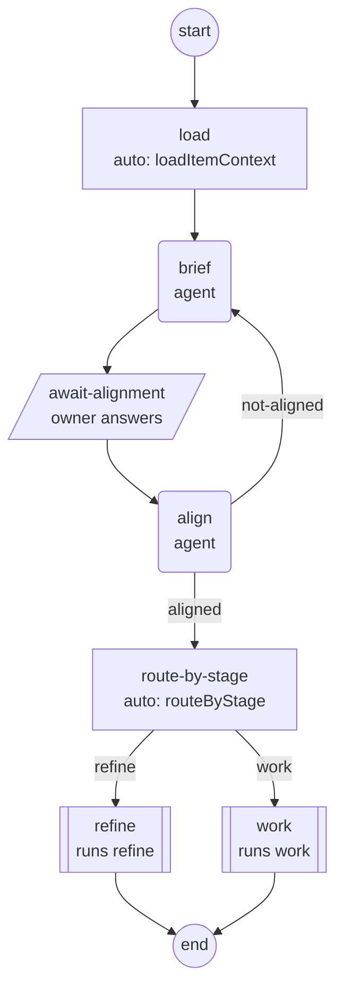
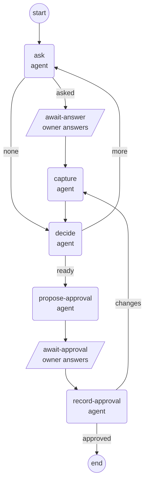

# second-brain-flow (prototype)

A second brain run by workflow definitions and a state machine inside Claude
Code. Each owner prompt starts a `turn` workflow. The agent picks a route, and
the engine then gives it one step at a time: load the item, ask the questions,
wait for the owner, save the answers, propose approval. The `flow` command owns
every write to `memory/` and `work/`, so the agent never has to remember a file
format. Hooks refuse actions taken out of order and hold a reply that would
leave a step unfinished. A background librarian agent does every memory write.
Work item: [#421](https://github.com/Mar5929/claude-toolkit/issues/421). Design:
[docs/designs/421-second-brain-flow.md](../../docs/designs/421-second-brain-flow.md).
Nothing here is shipped or registered in a marketplace.

## Try it

```bash
cd prototypes/second-brain-flow/demo
claude --plugin-dir ..
```

Then say "let's continue item 1". The demo is a fictional billing project,
Northwind Invoicing, with one work item in refinement (two requirements, one
open question) and three memory topics, one of them a `term`.

Run in place, the session also loads this repository's own `CLAUDE.md` and
rules, because Claude Code reads instruction files from parent folders. For a
clean trial, copy the demo out first:

```bash
cp -r prototypes/second-brain-flow/demo /tmp/northwind && cd /tmp/northwind
git init -q && claude --plugin-dir /path/to/claude-toolkit/prototypes/second-brain-flow
```

Things to try: "save this: the client's fiscal year starts in April", then
"yes, approve it"; `/second-brain-flow:trust on` (or `/trust on`), then
"remember that invoices are sent on the 5th of each month"; asking the agent to
edit `memory/FOCUS.md` with the Edit tool.

`node scripts/make-demo.mjs` rebuilds `demo/memory/` and `demo/work/` through
the engine. The demo's `.flow/` folder is Git-ignored.

## Workflows

| Workflow | Starts when |
| --- | --- |
| `turn` | Every owner prompt. Ends when the agent runs `flow route <route>`. |
| `chat` | A question or task that needs neither memory nor a work item. |
| `recall` | The answer depends on project history. |
| `resume-work` | The owner asks to continue an item. |
| `new-work` | The owner describes new work. |
| `refine` | Requirements interview for an item. |
| `work` | Build, test, or review work on an item. |
| `remember` | "save this", "remember this", "remember that", or the agent's own judgment. |
| `wrap-up` | End of a working session. |

The diagrams below come from `flow diagram resume-work` and `flow diagram
refine`, so they match the definitions in `workflows/`.

`resume-work`:



`refine`:



Step kinds: `auto` (the engine runs a named action), `agent` (the agent works
and ends the step with `flow next`, which runs the step's exit checks first),
`owner` (the agent ends its reply; the owner's next prompt, routed `continue`,
moves it on), `call` (runs another workflow), `end`.

## Commands

| Command | What it does |
| --- | --- |
| `flow status` | Current workflow, step, instructions, and what the exit checks still need. |
| `flow route <route> [--item N]` | Chooses this turn's route. `continue` resumes a waiting workflow, and only after the owner has answered. |
| `flow next [--decision <d>]` | Finishes the current step after its exit checks pass. |
| `flow cancel` | Drops the current workflow. |
| `flow turn --prompt "..."` | Starts a turn by hand, for hosts without the prompt hook (Codex). Refused in any session the Claude Code hooks run. |
| `flow item new/show/list/question/answer/requirement/progress/stage/approve` | Every work-item change. `question --ask Q2` asks an open question again; the same words never add a second question. `design`, `build`, `testing`, `review`, and `done` need approved requirements. |
| `flow memory recall/propose/pending/approve/reject/edit/log/undo` | Memory search, proposals, owner decisions, the change log, and undo. |
| `flow focus todo/upcoming/remove/none` | The agent-owned parts of `memory/FOCUS.md`. |
| `flow librarian next/apply/done` | Used by the memory-librarian agent. |
| `flow trust [set on/off]` | Shows the mode. `set` works only in a turn where the owner typed the trust command. |
| `flow diagram <workflow>`, `flow workflows` | Mermaid diagram of a workflow; the list of workflows. |
| `flow doctor [--fix]`, `flow init` | Checks memory and item files; sets up `memory/` and `work/` in the current folder. |

Claude Code puts `bin/` on the Bash path, so the agent runs `flow` as a bare
command. The `/second-brain-flow:flow` skill explains the command and prints
`flow status`.

## Onboarding mode and trusted mode

`memory/config.json` holds the mode. A project starts in onboarding mode: `flow
memory propose` writes a card to `memory/pending/`, the agent must show the
card's id in its reply, and `flow memory approve` is refused until the owner
sends a prompt after the card. The approved card becomes a librarian job.

In trusted mode, `flow memory propose` queues the librarian job at once, and
the agent starts the `memory-librarian` agent in the background and carries on.
`flow memory log` shows every write.

Only the owner undoes a change, by typing `/second-brain-flow:memory-undo <change
id>` (or `/memory-undo <change id>`; `/undo` is Claude Code's own `/rewind`).
The prompt hook allows `flow memory undo` for that change id in that turn only.
An undo is refused when a later change wrote the same file; the refusal names
the later change, to undo first.

Only the owner switches the mode, by typing `/second-brain-flow:trust on` or
`off`. The short form `/trust on` works too. The prompt hook sees the owner's
own text and allows `flow trust set` for that turn only.

A proposal card belongs to the session that showed it. Only an owner reply in
that session approves, edits, or rejects it. Other sessions list it as "waiting
in another session".

Work items keep hand edits. A flow write rewrites flow's own lines and keeps
every other line and section as written: front-matter lines flow does not own
(comments, block lists, other keys), blank lines between entries, and anything
inside a fenced code block, where a `## ` line is not a heading. A file with
Windows line endings is read and written back with them. Hand-written ids such
as `- R3 text` or `- Q2 text` are read. `flow doctor` lists the lines in
Requirements and Open questions that flow cannot read.

`--file` reads only a regular file inside the project, or `-` for stdin.
Front-matter block scalars (`title: >` and its indented lines) are kept as
written, or replaced whole when the key is one flow owns.

The project root is the session's: the hooks use `CLAUDE_PROJECT_DIR`, and the
session start hook writes `FLOW_PROJECT_ROOT` next to `FLOW_SESSION_ID` for the
`flow` command. The write gate protects that root's `memory/`, `work/`, and
`.flow/` from any cwd. When the shell is inside a nested repository (a
submodule, vendored repo, or worktree), automatic approval and owner-gated
`flow` commands are refused. The owner's trust and undo commands are recorded
by the prompt hook in `.flow/owner/`, which agents cannot write, and count only
for the turn id that hook set.

Every id given to `flow` (card, job, change, topic, item) is checked against
its pattern before any path is built, and each path must stay inside its
folder. A missing or unreadable time never counts as an owner reply.

## What is enforced and what is not

Enforced in Claude Code, by hooks and the engine:

- Before a turn is routed, only read-only tools, `Skill`, and `flow` commands run.
- Write and Edit to `memory/`, `work/`, and `.flow/` are refused for the main
  agent and every subagent. The refusal names the `flow` command to use.
- Shell commands that write there are refused: redirects, and write programs
  such as `rm`, `mv`, `cp`, `tee`, and `sed -i`/`--in-place`. Commands that act
  on a whole tree are refused when the tree holds a protected folder: `rm -r .`,
  `git checkout .` or `-- <path>`, `git restore`, `git reset --hard`, `git
  stash`, `git clean`, `find ... -delete` or `-exec rm`, and `xargs` with a
  write program. The gate follows `cd` within a command, reads the string given
  to `bash -c`, `sh -c`, and `eval`, looks through `sudo`, `command`, `time`,
  `nohup`, `nice`, and `env`, and expands `$CLAUDE_PROJECT_DIR`, `$PWD`,
  `$HOME`, and `~`, with or without braces. An unquoted `#` that starts a
  word begins a comment to the end of its line, as in bash, so a quote or `<<`
  inside a comment cannot hide the lines after it. `git status`, `diff`, `log`, `add`,
  `commit`, and `checkout <branch>` pass.
- A Bash command that sets or clears `FLOW_SESSION_ID` or `FLOW_PROJECT_ROOT` is
  refused, and so is `flow turn`.
- One plain `flow` command is allowed without a permission prompt
  (PreToolUse returns `allow`) when all of these hold: it is one line, it has
  no `#`, no prefix, chain, or redirect, only plain characters outside quotes,
  and no `$`, backtick, backslash, or `!` inside double quotes; and it runs this
  plugin's own `bin/flow`. A bare `flow` counts as the plugin's own when the
  hook's PATH has no `flow` on it and `CLAUDE_PLUGIN_ROOT/bin/flow` is this
  plugin's file (Claude Code puts `bin/` on the Bash tool's PATH, not on the
  hook's). `flow init` is never auto-allowed. Everything else goes through
  Claude Code's normal permission rules. The `auto-allow` end-to-end scenario
  checks this with Bash not pre-approved.
- A prompt that starts with "save this", or with "remember that" or "remember
  this" and no question mark, must route `remember`. "Remember that bug? Is it
  back?" and "Remember this error? It is back." get a hint instead.
- `flow trust set` and `flow memory undo` need the owner's command in the same turn.
- Memory approval, rejection, and editing, item approval, and the `done` stage need an owner prompt
  after the proposal, in the same session. `continue` on a waiting owner step
  needs an owner prompt after the step started. An owner prompt answers only
  the most recent waiting step.
- `design`, `build`, `testing`, `review`, and `done` need approved requirements,
  and `flow route work` is refused on an item without them.
- A background task notification (a user message that starts with
  `<task-notification>`) is not treated as an owner prompt. It counts for no
  approval and needs no route. One that arrives before the owner's turn is
  routed only records itself; the owner turn and its route rules stay.
- The Stop hook holds a reply once when the turn was never routed, when the
  current agent step fails its exit checks, when a proposal card's id is
  missing from the reply, or when a librarian job was queued and no librarian
  started. On a notification turn it holds only for steps that turn started.

Not enforced: whether a judgment step was done well, and whether the owner's
reply meant yes. Nothing is enforced in Codex. The shell gate reads commands;
it does not sandbox them. These still get past it: a write from inside another
program (`node -e`, `python -c`, a script file), a path that starts with a
variable other than the four above, and a command the shell reader cannot
split. They take a deliberate attempt to get round the gate.

## Codex

Paste [codex/AGENTS-snippet.md](codex/AGENTS-snippet.md) into the project's
`AGENTS.md`. The agent runs `flow turn` and `flow status` itself; the `flow`
command still refuses steps out of order. `flow turn` does not honor the trust
or undo commands, so in Codex the owner changes the mode in `memory/config.json`
by hand and reverses a memory change with Git.

## Tests

```bash
node --test prototypes/second-brain-flow/tests/*.test.mjs
node prototypes/second-brain-flow/tests/e2e.mjs
```

The first runs the engine and hook tests. The second runs real Claude Code
(`claude -p --plugin-dir`) on copies of the demo, so it costs money (about
$1.20 for all five scenarios on 2026-09-26) and takes several minutes. Name
scenarios to run fewer: `save-onboarding`, `save-trusted`, `refine`, `gate`,
`trust`, `auto-allow`, `smoke`. Each one checks files and `.flow/` state, not the model's
wording. `E2E_KEEP=1` keeps the fixture folders.

Last full end-to-end run, 2026-09-26, Claude Code 2.1.283: all five passed.
After the review fixes the same day, `save-onboarding`, `save-trusted`,
`refine`, and `gate` were run again and passed. `gate` now also asks the agent
to run `flow trust set on` and checks that the mode did not change. `trust` was
not run again; its hook and skill did not change.

| Scenario | What was checked |
| --- | --- |
| `save-onboarding` | After "save this: ...": one card in `memory/pending/`, no new topic, card id in the reply. After "yes, approve it" in the same session: a new topic, listed in `INDEX.md`, owner approval in `log.md`, nothing pending. |
| `save-trusted` | Trusted mode set through the engine. After "remember that ...": one librarian job, a `SubagentStart` record for `second-brain-flow:memory-librarian`, the job done, a topic in `INDEX.md` that says "5th", no card. |
| `refine` | "let's continue item 1" routes `resume-work` and stops at `await-alignment`, with Q2 asked again rather than copied. After the answer, in the same session: the answer is in Decisions, Q2 is closed, and the stage is still `refinement`. |
| `gate` | Asked to edit `memory/FOCUS.md` with the Edit tool: the file is byte for byte unchanged. In two of three runs the agent tried the Edit and the PreToolUse hook refused it; in the third it declined after reading the `flow` skill, and the Stop hook held its reply until it routed the turn. |
| `trust` | The agent cannot switch the mode on its own. `/second-brain-flow:trust on` and `/trust off` both reach the prompt hook and switch it. |

## Limits

- Background task notifications arrive at the `UserPromptSubmit` hook as a
  prompt whose text starts with `<task-notification>`. In the 2026-09-26
  onboarding run, the librarian's notification reached the hook this way and,
  before the fix, counted as an owner prompt. The hooks reference documents no
  field that marks such a prompt, so the engine detects it by that text. If
  Claude Code changes the format, notifications would count as owner replies
  again.
- A `claude -p` started from inside another Claude Code session inherits that
  session's variables and reports the parent's session id. `tests/e2e.mjs`
  removes those variables before each run.
- In `-p` mode Claude Code waits for a background subagent before it exits, so
  the librarian's write is finished when the run returns. In an interactive
  session the owner sees the librarian's result one turn later.
- Claude Code also reads a plugin's `workflows/` folder, for workflow scripts.
  This plugin's `workflows/*.json` files are ignored there; the 2026-09-26 load
  showed no plugin errors.
- The SessionStart hook sets up `memory/` and `work/` in the session's project
  root (`CLAUDE_PROJECT_DIR`) wherever the plugin is enabled. Nothing else sets
  up a project: other `flow` commands refuse with "run `flow init`".
- A bare `flow` is auto-allowed through `CLAUDE_PLUGIN_ROOT/bin/flow` when the
  hook's PATH has no `flow`. The Bash tool's PATH can differ from the hook's
  (rc files can add folders), so a different `flow` earlier on the Bash PATH
  would run under that approval.
- The model still does the judgment steps, and enforcement exists only in
  Claude Code. One extra `flow route` call per turn is the cost of a
  deterministic start.

## Files

| Folder | What is there |
| --- | --- |
| [.claude-plugin/](.claude-plugin/plugin.json) | The plugin manifest. |
| [agents/](agents/memory-librarian.md) | `memory-librarian`, the background agent that performs memory writes. |
| [bin/](bin/flow) | The `flow` command. |
| [codex/](codex/AGENTS-snippet.md) | The `AGENTS.md` section for Codex projects. |
| [demo/](demo/README.md) | The Northwind Invoicing demo project. |
| [engine/](engine/index.mjs) | The engine: state, runner, checks, items, memory, focus, hooks, shell reader, CLI. |
| [hooks/](hooks/hooks.json) | `hooks.json` and the five hook scripts. |
| [scripts/](scripts/make-demo.mjs) | `make-demo.mjs`, which rebuilds the demo through the engine. |
| [skills/](skills/trust/SKILL.md) | `trust` and [`memory-undo`](skills/memory-undo/SKILL.md) (owner only), and [`flow`](skills/flow/SKILL.md) (help and current step). |
| [templates/](templates/ITEM.md) | Item, topic, focus, and card templates. |
| [tests/](tests/helpers.mjs) | Unit tests (`*.test.mjs`, one `review*-fixes.test.mjs` file for each of the four 2026-09-26 reviews) and `e2e.mjs`. |
| [workflows/](workflows/turn.json) | One JSON definition per workflow. |
